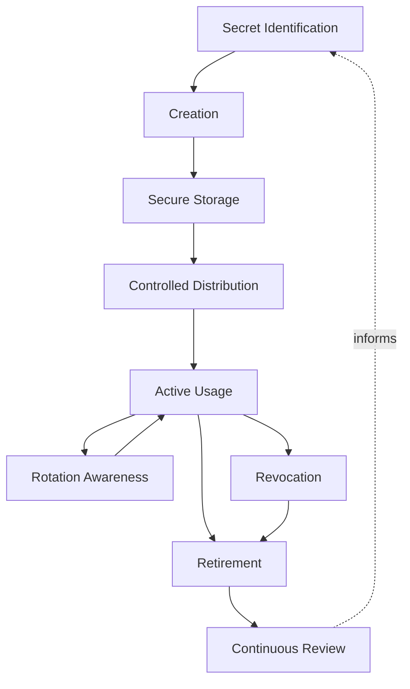
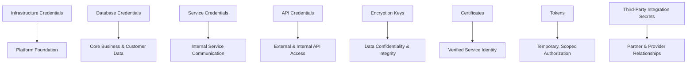
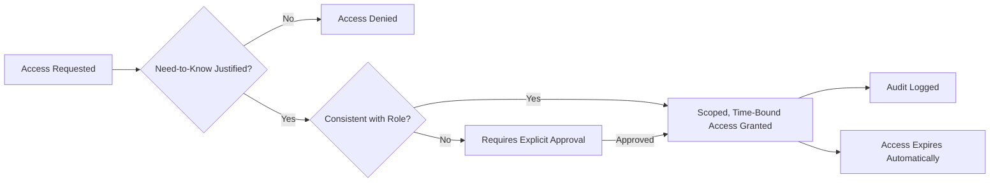
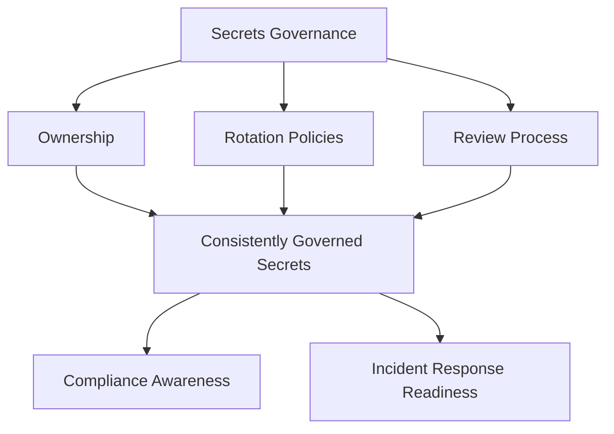
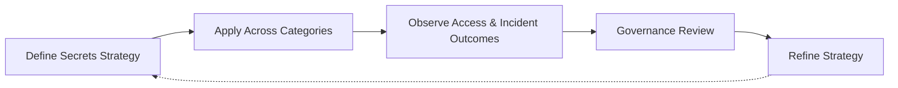

# Secrets Management

## 1. Document Purpose

This document defines how secrets — credentials, keys, tokens, and other sensitive operational material — are governed across the delivery and operational lifecycle at **StackLeo**, without recommending specific secrets management products, environment variable names, or configuration examples.

- **Purpose of Secrets Management** — to ensure that the credentials and keys the platform depends on to authenticate, encrypt, and integrate are protected at every stage of their existence, from creation through eventual retirement, so they never become the weakest link in an otherwise well-governed platform.
- **Relationship with DevSecOps** — this document is the delivery-lifecycle expression of `devsecops.md`: it defines how secret protection travels through every pipeline, environment, and operational surface, rather than being treated as a separate, bolted-on concern.
- **Relationship with Zero Trust** — no request, service, or actor is trusted with a secret by default; access to any secret is granted explicitly, scoped narrowly, and continuously justified, consistent with the Zero Trust Mindset defined in `06_Security/security-principles.md`.
- **Relationship with Platform Engineering** — secure, low-friction secret handling is intended to be delivered as self-service platform capability through `platform-engineering.md`, so protecting secrets correctly is the easiest path for every engineering team, not an extra burden.
- **Relationship with Compliance** — disciplined secrets governance, including rotation and auditability, directly supports the compliance and audit expectations that grow as StackLeo expands into corporate sales, wholesale, and a multi-vendor marketplace.
- **Relationship with Operational Resilience** — a compromised, leaked, or improperly rotated secret is one of the most direct paths to a business-impacting incident; this document exists to make secret handling a source of confidence rather than a recurring point of operational risk.

This document is authoritative for how secret protection principles, defined in `06_Security/security-principles.md`, are practiced through the delivery lifecycle. It is implementation-independent and vendor-neutral, defining philosophy, lifecycle, and governance — not specific products, variable names, or configuration examples.

## 2. Secrets Management Philosophy

- **Least Privilege** — every actor, human or system, is granted access only to the specific secrets required for its defined responsibility, and nothing more.
- **Need-to-Know Access** — access to a secret is justified by an active, specific need, not granted broadly out of convenience or anticipation of future use.
- **Separation of Secrets and Configuration** — sensitive material is governed distinctly from general configuration, consistent with `configuration-management.md`, reflecting its materially higher sensitivity and risk.
- **Defense in Depth** — protection of secrets relies on multiple independent layers, so no single control failure results in exposure.
- **Traceability** — every secret's existence, access, and lifecycle event can be traced to a specific actor, reason, and time.
- **Auditability** — the state and history of secret access is always reconstructable, supporting investigation without special preparation.
- **Continuous Improvement** — secrets management practice is expected to mature as the platform, organization, and threat landscape evolve.

## 3. Secrets Lifecycle

### Secret Identification

- **Purpose** — recognize when a piece of information constitutes a secret requiring protected handling, rather than ordinary configuration.
- **Business Value** — prevents sensitive material from being unintentionally treated as non-sensitive.
- **Governance Objectives** — establish a consistent, understood standard for what qualifies as a secret.

### Creation

- **Purpose** — generate or obtain a new secret through a deliberate, controlled process.
- **Business Value** — ensures secrets originate from a trustworthy source rather than an ad hoc or convenience-driven one.
- **Governance Objectives** — prevent secret creation outside of governed, accountable processes.

### Secure Storage

- **Purpose** — hold a secret in a protected state whenever it is not actively in use.
- **Business Value** — minimizes the window and surface area in which a secret could be exposed.
- **Governance Objectives** — ensure no secret is ever stored in an unprotected, plainly readable form.

### Controlled Distribution

- **Purpose** — make a secret available only to the specific actor and context that legitimately requires it.
- **Business Value** — prevents unnecessary proliferation of copies that each represent additional exposure risk.
- **Governance Objectives** — ensure distribution is deliberate, logged, and scoped to genuine need.

### Active Usage

- **Purpose** — support the secret's intended function during its period of legitimate use.
- **Business Value** — delivers the authentication, encryption, or integration capability the secret exists to provide.
- **Governance Objectives** — ensure usage remains consistent with the secret's declared, approved purpose.

### Rotation Awareness

- **Purpose** — periodically replace a secret with a new value, limiting the value of any undetected exposure.
- **Business Value** — reduces the window during which a compromised secret, even one not yet known to be compromised, remains useful to an attacker.
- **Governance Objectives** — ensure rotation occurs on a defined, risk-appropriate cadence rather than indefinitely.

### Revocation

- **Purpose** — immediately invalidate a secret when it is known or suspected to be compromised, or when access is no longer legitimate.
- **Business Value** — limits the impact of a known exposure to the shortest possible window.
- **Governance Objectives** — ensure revocation can be executed rapidly and does not depend on a lengthy process.

### Retirement

- **Purpose** — formally conclude a secret's lifecycle once it is no longer needed for any legitimate purpose.
- **Business Value** — reduces the total inventory of live secrets the organization must protect and reason about.
- **Governance Objectives** — ensure retirement is a deliberate, recorded decision, not an unexplained cessation of use.

### Continuous Review

- **Purpose** — periodically reassess the full inventory of active secrets for continued necessity and appropriate scope.
- **Business Value** — prevents unnecessary or over-scoped secrets from silently accumulating over time.
- **Governance Objectives** — ensure review occurs on a defined cadence, not only in response to an incident.

*Diagram 1: Enterprise Secrets Lifecycle — a secret moves from identification and controlled creation through secure storage and distribution, into active, rotated use, until it is revoked or retired, with continuous review informing future practice.*

### Secrets Lifecycle Matrix

| Stage | Purpose | Business Value |
|---|---|---|
| Secret Identification | Recognize material requiring protected handling | Prevents sensitive material from being treated as ordinary |
| Creation | Generate or obtain through a controlled process | Ensures secrets originate from a trustworthy source |
| Secure Storage | Hold secrets in a protected state when not in use | Minimizes exposure window and surface area |
| Controlled Distribution | Make available only to legitimate need | Prevents unnecessary proliferation of exposure risk |
| Active Usage | Support intended authentication or integration function | Delivers the capability the secret exists to provide |
| Rotation Awareness | Periodically replace secret values | Limits the value of an undetected exposure |
| Revocation | Immediately invalidate compromised or unneeded secrets | Limits impact of a known exposure to the shortest window |
| Retirement | Formally conclude a secret's lifecycle | Reduces the total inventory of live secrets to protect |
| Continuous Review | Periodically reassess the full secret inventory | Prevents unnecessary or over-scoped secrets from accumulating |

## 4. Secret Categories

### API Credentials

- **Purpose** — authenticate calls made to or received from application programming interfaces.
- **Scope** — specific to a given API relationship, internal or external.
- **Risk Considerations** — often granted broad functional access; compromise can expose significant capability.
- **Governance Expectations** — scoped as narrowly as the API relationship allows, consistent with `05_API/authentication.md`.

### Database Credentials

- **Purpose** — authenticate access to stored data.
- **Scope** — specific to a given data store or a defined access level within it.
- **Risk Considerations** — compromise can expose or corrupt the platform's core business and customer data.
- **Governance Expectations** — held to the strictest access and rotation discipline given the sensitivity of underlying data.

### Service Credentials

- **Purpose** — authenticate one internal service's communication with another.
- **Scope** — specific to a defined service-to-service relationship.
- **Risk Considerations** — compromise can enable lateral movement between internal services.
- **Governance Expectations** — scoped to the minimum interaction required between the specific services involved.

### Infrastructure Credentials

- **Purpose** — authenticate access to provision, modify, or manage the platform's underlying infrastructure.
- **Scope** — specific to infrastructure management functions defined in `infrastructure-as-code.md`.
- **Risk Considerations** — compromise can affect the platform's entire operational foundation.
- **Governance Expectations** — subject to the highest level of access restriction and oversight in the secret inventory.

### Encryption Keys

- **Purpose** — protect the confidentiality and integrity of data at rest and in transit.
- **Scope** — specific to the data or communication channel they protect.
- **Risk Considerations** — compromise can expose all data protected by the affected key.
- **Governance Expectations** — governed with particular attention to rotation and controlled access, consistent with `06_Security/encryption.md`.

### Certificates

- **Purpose** — establish and verify trusted identity for services and communication channels.
- **Scope** — specific to the service or domain they represent.
- **Risk Considerations** — compromise can enable impersonation of a trusted system.
- **Governance Expectations** — tracked for validity and renewed proactively before expiration.

### Tokens

- **Purpose** — represent temporary, scoped authorization for a specific session or action.
- **Scope** — specific to a defined session, actor, or limited time window.
- **Risk Considerations** — generally lower individual risk due to limited scope and lifespan, but high volume increases aggregate exposure surface.
- **Governance Expectations** — issued with the narrowest practical scope and shortest practical lifespan.

### Third-Party Integration Secrets

- **Purpose** — authenticate the platform's relationship with external partners, such as payment providers and couriers.
- **Scope** — specific to a given partner relationship.
- **Risk Considerations** — compromise can affect both StackLeo and its partners, and may carry contractual or regulatory consequence.
- **Governance Expectations** — governed jointly with awareness of the partner relationship's terms and expectations.

*Diagram 4: Secret Category Model — each category of secret protects a distinct layer of the platform, from foundational infrastructure and data through internal services, external integrations, and partner relationships.*

### Secret Category Matrix

| Category | Purpose | Risk Considerations |
|---|---|---|
| API Credentials | Authenticate API calls | Broad functional access; compromise exposes significant capability |
| Database Credentials | Authenticate access to stored data | Compromise can expose or corrupt core business and customer data |
| Service Credentials | Authenticate internal service communication | Compromise can enable lateral movement between services |
| Infrastructure Credentials | Authenticate infrastructure management access | Compromise can affect the entire operational foundation |
| Encryption Keys | Protect confidentiality and integrity of data | Compromise exposes all data protected by the affected key |
| Certificates | Establish and verify trusted identity | Compromise can enable impersonation of a trusted system |
| Tokens | Represent temporary, scoped authorization | Lower individual risk, but high volume increases aggregate surface |
| Third-Party Integration Secrets | Authenticate partner relationships | Compromise can affect both StackLeo and its partners |

## 5. Access Governance

- **Ownership** — every secret has a clearly identified owning team accountable for its lifecycle and appropriate use.
- **Least Privilege** — access to a secret is scoped to the minimum necessary for a defined responsibility, consistent with Section 2.
- **Role-Based Access** — access is granted according to defined role and responsibility, not to individuals on an ad hoc basis.
- **Temporary Access** — where access is only needed for a limited duration or purpose, it is granted temporarily and expires automatically rather than persisting indefinitely.
- **Approval Awareness** — access to sensitive categories of secret, particularly infrastructure and database credentials, requires deliberate approval.
- **Audit Logging** — every instance of secret access is logged in a way that supports later investigation.

*Diagram 3: Secret Access Flow — every access request is justified by need, checked against role, and either denied, escalated for approval, or granted narrowly and temporarily, with every grant logged and set to expire.*

### Access Governance Matrix

| Governance Area | Focus | Accountable For |
|---|---|---|
| Ownership | Clearly identified owning team per secret | Lifecycle and appropriate use of owned secrets |
| Least Privilege | Access scoped to minimum necessary need | Preventing unnecessarily broad access grants |
| Role-Based Access | Access aligned to defined role and responsibility | Consistent, non-arbitrary access decisions |
| Temporary Access | Automatic expiration for limited-duration need | Preventing indefinite persistence of unneeded access |
| Approval Awareness | Deliberate approval for sensitive categories | Preventing unreviewed access to high-risk secrets |
| Audit Logging | Logged record of every access instance | Supporting investigation without reconstruction effort |

## 6. Secrets Governance

- **Ownership** — a designated owner is accountable for the coherence of secrets governance across every category defined in Section 4.
- **Rotation Policies** — rotation cadence is defined proportionate to each secret category's risk, and applied consistently rather than left to individual discretion.
- **Review Process** — the full secret inventory is periodically reviewed for continued necessity, appropriate scope, and rotation currency.
- **Compliance Awareness** — secrets governance is maintained with awareness of the compliance and audit expectations that accompany StackLeo's growing business scope, including corporate and wholesale relationships.
- **Documentation Alignment** — the existence, purpose, and ownership of each secret category is documented, without documenting the secret values themselves.
- **Incident Response Readiness** — the organization maintains a prepared, practiced path for rapid revocation and rotation in response to a suspected compromise, consistent with `06_Security/incident-response.md`.

*Diagram 2: Secrets Governance Framework — ownership, rotation policy, and periodic review converge on consistently governed secrets, sustaining both compliance awareness and readiness to respond rapidly to a suspected compromise.*

### Secrets Governance Matrix

| Governance Area | Focus | Accountable For |
|---|---|---|
| Ownership | Coherence across every secret category | Overall governance of the secrets inventory |
| Rotation Policies | Risk-proportionate rotation cadence | Consistent rotation, not individual discretion |
| Review Process | Periodic inventory reassessment | Continued necessity, scope, and rotation currency |
| Compliance Awareness | Alignment with growing regulatory expectations | Governance that scales with business complexity |
| Documentation Alignment | Documented purpose and ownership, not values | Understandable governance without exposing secrets |
| Incident Response Readiness | Prepared, practiced revocation and rotation path | Rapid containment of a suspected compromise |

## 7. Future Readiness

- **Zero Trust Architecture** — access governance principles in Section 5 are structured to deepen naturally as Zero Trust maturity grows, without requiring redefinition of underlying philosophy.
- **Cloud-Native Platforms** — secrets governance is defined independent of any specific provider, allowing adoption of elastic, provider-hosted infrastructure without redefining secret handling practice.
- **Platform Engineering** — secure, low-friction secret access is intended to be delivered as reusable, self-service platform capability as `platform-engineering.md` matures.
- **Microservices** — as capability decomposes into a growing number of independently deployable services, service credential governance scales without requiring redefinition.
- **AI Systems** — credentials and keys supporting AI-assisted capability are governed under the same lifecycle and access principles as any other secret category.
- **Marketplace Platform** — as StackLeo evolves toward business sales, corporate accounts, wholesale, and a multi-vendor marketplace, third-party integration secret governance extends to a growing number of seller and partner relationships without redefinition.
- **Multi-Region Operations** — as new sales channels and additional currencies beyond BDT are introduced, secrets governance accommodates regional variation in partner and provider relationships without disrupting core principles.
- **Global Engineering Teams** — access governance remains independent of contributor location, supporting distributed teams operating under consistent least-privilege discipline.

## 8. Governance

- **Ownership** — a designated secrets management governance owner is accountable for the coherence and enforcement of this strategy across the organization.
- **Review Process** — significant changes to secrets lifecycle, category definitions, or access governance are reviewed consistent with the review discipline in `03_System_Design/architecture-decisions.md` and `06_Security/security-governance.md`.
- **Secret Policies** — individual teams may define secret handling detail consistent with this strategy, but may not bypass its access or rotation principles.
- **Audit Readiness** — access logs and lifecycle records are maintained in a state that supports audit and investigation at any time, without exposing secret values themselves.
- **Continuous Improvement** — secrets management practice is expected to mature as the platform, organization, and threat landscape evolve, consistent with `devops-principles.md`.

*Diagram 5: Continuous Secret Improvement Cycle — secrets strategy is applied across every category, its outcomes observed, reviewed by governance, and refined, with refinements feeding directly back into the strategy.*

### Governance Responsibility Matrix

| Governance Area | Owner | Accountable For |
|---|---|---|
| Ownership | Secrets Management Governance Owner | Coherence and enforcement of this strategy |
| Review Process | Security & Platform Teams | Reviewing changes to lifecycle and access governance |
| Secret Policies | Secret Owning Teams | Detail consistent with enterprise governance principles |
| Audit Readiness | Security & Platform Teams | Access logs and lifecycle records ready for audit |
| Continuous Improvement | DevSecOps / Platform Engineering | Maturing strategy as threat landscape and scale evolve |

## 9. Anti-Patterns

- **Hardcoded Secrets** — embedding credentials or keys directly within source code or build artifacts. This exposes secrets to anyone with access to the codebase or artifact, far beyond the intended audience.
- **Shared Credentials** — using the same secret across multiple actors, services, or purposes. This makes attribution impossible and means a single compromise affects every consumer of the shared secret.
- **Unlimited Access** — granting broad, standing access to secrets beyond genuine need. This directly contradicts Least Privilege and expands the impact of any single compromised account.
- **Missing Rotation** — allowing secrets to remain unchanged indefinitely. This means a compromise, once it occurs, can remain useful to an attacker indefinitely as well.
- **Weak Auditability** — allowing secret access to occur without a reliable log. This makes investigation of a suspected compromise slow, incomplete, or impossible.
- **Poor Ownership** — leaving a secret or category of secrets without a clearly accountable owner. This causes governance, rotation, and access discipline to degrade with no one responsible for correcting it.
- **Manual Secret Distribution** — sharing secrets through informal, untracked channels. This creates untracked copies that each represent additional, unmanaged exposure risk.
- **Reactive Secret Management** — addressing secrets governance only after a compromise or near-miss occurs. This means avoidable exposure, rather than deliberate design, drives improvement.

### Anti-Pattern Summary

| Anti-Pattern | Why It Must Be Avoided |
|---|---|
| Hardcoded Secrets | Exposes secrets to anyone with codebase or artifact access |
| Shared Credentials | Prevents attribution; a single compromise affects every consumer |
| Unlimited Access | Contradicts least privilege; expands impact of compromised accounts |
| Missing Rotation | Lets a compromise remain useful to an attacker indefinitely |
| Weak Auditability | Makes investigation of a suspected compromise slow or impossible |
| Poor Ownership | Governance and rotation discipline degrade with no accountable owner |
| Manual Secret Distribution | Creates untracked copies representing unmanaged exposure risk |
| Reactive Secret Management | Avoidable exposure, not deliberate design, drives improvement |

## 10. Document Information

| Property | Value |
|----------|-------|
| Document | secrets-management.md |
| Version | 1.0.0 |
| Status | Active |
| Maintained By | StackLeo |
| Last Updated | 2026-07-24 |

---

© StackLeo. All Rights Reserved.
