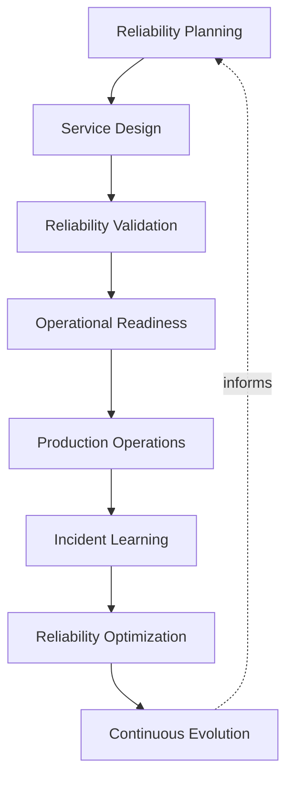
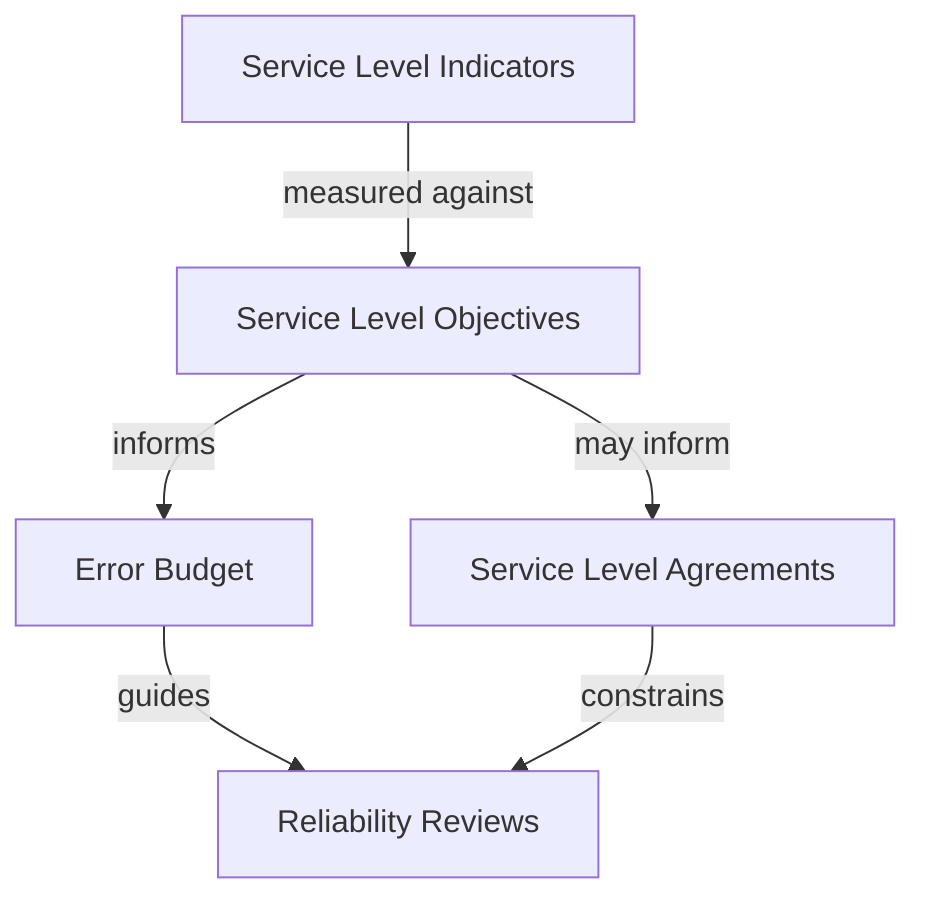
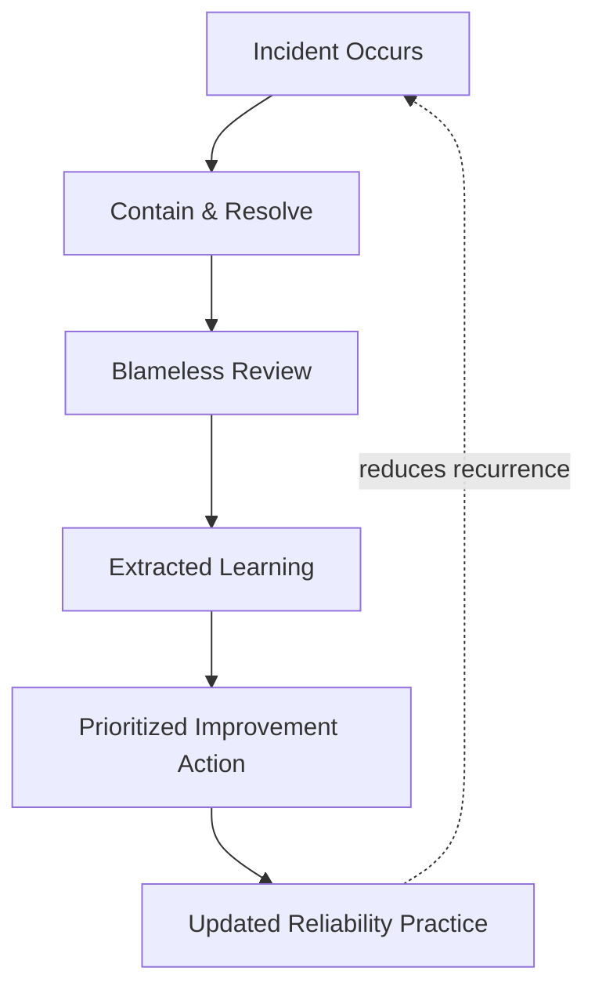
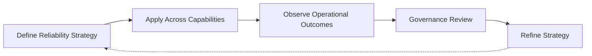

# SRE Strategy

## 1. Document Purpose

This document defines the enterprise strategy for Site Reliability Engineering at **StackLeo** — the principles, lifecycle, and governance through which the platform's reliability is deliberately engineered and sustained, without recommending specific SRE tools, monitoring platforms, or implementation metrics.

- **Purpose of SRE** — to ensure that reliability is an engineered, measured property of the platform, treated with the same rigor as feature delivery, rather than an assumed byproduct of good intentions.
- **Relationship with DevOps** — this document is the reliability-specific elaboration of `devops-principles.md`, in particular the Reliability principle, extending it into a dedicated discipline of measurement, review, and continuous operational learning.
- **Relationship with Platform Engineering** — reliability practices defined here are intended to be delivered as self-service platform capability through `platform-engineering.md`, so every team benefits from consistent reliability discipline without independently re-deriving it.
- **Relationship with Operational Excellence** — SRE is the specific discipline through which the operational excellence commitment in `devops-overview.md` becomes measurable and actionable, connecting directly to `observability.md` and `monitoring.md`.
- **Relationship with Business Continuity** — reliability engineering is a direct, proactive protection against business disruption; resilience designed in advance is materially cheaper than recovery improvised during an incident.
- **Relationship with Customer Trust** — customers experience the platform's reliability directly, whether browsing, purchasing, or, in time, transacting through business and marketplace channels; reliability failures are trust failures, not merely technical ones.

This document is implementation-independent and vendor-neutral. It defines reliability philosophy, lifecycle, and governance conceptually — not specific tools, monitoring platforms, or implementation metrics.

## 2. Reliability Engineering Philosophy

- **Reliability as a Feature** — reliability is treated as a deliberate, prioritized capability the business delivers to customers, not a background assumption that competes silently with feature work.
- **Automation First** — repeatable reliability work — validation, recovery, capacity response — is automated by default, consistent with `devops-principles.md`.
- **Error Budget Awareness** — a defined, deliberate tolerance for imperfection is acknowledged and managed, rather than pursuing an unrealistic and costly standard of absolute perfection.
- **Continuous Improvement** — reliability practice is expected to mature over time, informed by what is learned from real operational outcomes.
- **Learning Culture** — reliability failures are treated as a source of organizational learning, consistent with the Blameless Improvement principle in `devops-principles.md`.
- **Shared Responsibility** — reliability is owned jointly by the teams that build a capability and the teams that operate it, not delegated entirely to a single specialized function.
- **Operational Simplicity** — reliability is pursued, in part, by reducing unnecessary operational complexity, not only by adding safeguards on top of complexity that already exists.

## 3. Reliability Lifecycle

### Reliability Planning

- **Purpose** — determine the reliability expectations appropriate to a capability before it is designed.
- **Business Value** — ensures reliability investment is proportionate to genuine business importance.
- **Governance Objectives** — ensure every capability can be traced back to a deliberate reliability expectation.

### Service Design

- **Purpose** — shape a capability's architecture to meet its defined reliability expectations from the outset.
- **Business Value** — makes reliability a structural property of the capability rather than a later addition.
- **Governance Objectives** — ensure design decisions are reviewed for reliability implications before implementation begins.

### Reliability Validation

- **Purpose** — confirm the implemented capability genuinely meets its defined reliability expectations.
- **Business Value** — catches reliability weaknesses before they are discovered through real customer impact.
- **Governance Objectives** — treat reliability validation as a required step, connected to the quality gates in `ci-cd-strategy.md`.

### Operational Readiness

- **Purpose** — confirm the organization is prepared to operate and support the capability once it is live.
- **Business Value** — reduces the likelihood of a capability being released before it can be reliably sustained.
- **Governance Objectives** — ensure operational readiness is verified as a distinct step, consistent with `release-management.md`.

### Production Operations

- **Purpose** — sustain the capability's reliability during its live, operating period.
- **Business Value** — delivers the consistent, trustworthy experience customers and the business depend on.
- **Governance Objectives** — treat production reliability as an ongoing responsibility, not a status confirmed once and assumed thereafter.

### Incident Learning

- **Purpose** — deliberately extract organizational learning from every incident, regardless of its severity.
- **Business Value** — turns every disruption into an investment in future reliability rather than a pure cost.
- **Governance Objectives** — ensure incident learning is a required, structured step, not an informal afterthought.

### Reliability Optimization

- **Purpose** — deliberately improve a capability's reliability based on accumulated operational evidence.
- **Business Value** — directs reliability investment toward genuine, evidence-based need rather than assumption.
- **Governance Objectives** — ensure optimization is prioritized and resourced, not perpetually deferred.

### Continuous Evolution

- **Purpose** — mature reliability practice itself as the platform, organization, and operating scale grow.
- **Business Value** — keeps reliability practice aligned with the platform's growing complexity and business importance.
- **Governance Objectives** — ensure reliability practice is reviewed and evolved deliberately, not left static.

*Diagram 1: Enterprise Reliability Lifecycle — reliability moves from deliberate planning and design through validation and operational readiness, into sustained production operation, with incident learning driving optimization and continuous evolution.*

### Reliability Lifecycle Matrix

| Stage | Purpose | Business Value |
|---|---|---|
| Reliability Planning | Determine expectations before design | Ensures investment proportionate to genuine importance |
| Service Design | Shape architecture to meet expectations | Makes reliability structural, not a later addition |
| Reliability Validation | Confirm expectations are genuinely met | Catches weaknesses before real customer impact |
| Operational Readiness | Confirm preparedness to operate and support | Reduces release of capability the organization cannot sustain |
| Production Operations | Sustain reliability during live operation | Delivers the consistent experience customers depend on |
| Incident Learning | Extract organizational learning from incidents | Turns disruption into future reliability investment |
| Reliability Optimization | Improve based on accumulated evidence | Directs investment toward genuine, evidence-based need |
| Continuous Evolution | Mature reliability practice itself | Keeps practice aligned with growing complexity |

## 4. Core SRE Capabilities

### Service Level Objectives (SLO) Awareness

- **Purpose** — express reliability expectations as defined, measurable objectives.
- **Business Value** — converts an abstract notion of "reliable enough" into a concrete, agreed standard.
- **Strategic Objectives** — align engineering effort and business expectation around the same defined target.

### Service Level Indicators (SLI) Awareness

- **Purpose** — recognize the categories of signal that meaningfully reflect a capability's actual reliability.
- **Business Value** — ensures reliability conversations are grounded in genuine signal rather than assumption.
- **Strategic Objectives** — connect reliability objectives to observable, meaningful system behavior.

### Service Level Agreements (SLA) Context

- **Purpose** — understand how internal reliability objectives relate to any external commitments made to customers or partners.
- **Business Value** — protects the business from committing externally to reliability it has not internally validated it can sustain.
- **Strategic Objectives** — keep external commitments consistent with genuine internal capability.

### Error Budget Concepts

- **Purpose** — recognize a deliberate, agreed tolerance for imperfection within which change can proceed confidently.
- **Business Value** — balances the competing needs of delivery velocity and reliability without treating them as inherently opposed.
- **Strategic Objectives** — use budget consumption as a shared signal for when to prioritize stability over new capability.

### Reliability Reviews

- **Purpose** — periodically and deliberately assess a capability's reliability posture.
- **Business Value** — surfaces reliability risk proactively rather than waiting for it to manifest as an incident.
- **Strategic Objectives** — make reliability assessment a routine practice, not an exceptional one.

### Capacity Awareness

- **Purpose** — understand a capability's ability to sustain expected and growing demand.
- **Business Value** — prevents reliability failures caused by demand outpacing understood capacity.
- **Strategic Objectives** — connect capacity understanding directly to the growth expectations in `scalability.md`.

### Operational Readiness

- **Purpose** — confirm a capability and the team supporting it are genuinely prepared for live operation.
- **Business Value** — reduces the likelihood of a capability being operated before the organization is prepared to sustain it.
- **Strategic Objectives** — make readiness an explicitly confirmed state, not an assumed one.

### Resilience Engineering

- **Purpose** — deliberately design a capability to withstand and recover from realistic failure conditions.
- **Business Value** — reduces the customer and business impact of failures that will inevitably occur.
- **Strategic Objectives** — treat resilience as an engineered property, elaborated further in Section 6.

*Diagram 3: SLI–SLO–SLA Relationship Model — indicators are measured against objectives, objective performance determines error budget consumption, and objectives may inform external agreements, with reviews grounded in both.*

### SRE Capability Matrix

| Capability | Purpose | Strategic Objective |
|---|---|---|
| SLO Awareness | Express reliability expectations as measurable objectives | Align engineering effort and business expectation |
| SLI Awareness | Recognize signals reflecting actual reliability | Ground reliability conversations in genuine signal |
| SLA Context | Understand relation to external commitments | Keep external commitments consistent with capability |
| Error Budget Concepts | Recognize a deliberate tolerance for imperfection | Balance delivery velocity and reliability |
| Reliability Reviews | Periodically assess reliability posture | Make reliability assessment routine, not exceptional |
| Capacity Awareness | Understand ability to sustain demand | Prevent reliability failure from unmanaged growth |
| Operational Readiness | Confirm genuine preparedness for live operation | Make readiness an explicitly confirmed state |
| Resilience Engineering | Design to withstand and recover from failure | Reduce impact of failures that will inevitably occur |

## 5. Reliability Governance

- **Ownership** — every capability has a clearly accountable owner responsible for its reliability posture.
- **Reliability Reviews** — capabilities are subject to periodic, deliberate reliability review, consistent with Section 4.
- **Operational Readiness** — a capability is not considered ready for production responsibility until operational readiness is explicitly confirmed.
- **Risk Awareness** — reliability risk is deliberately assessed and knowingly accepted or mitigated, consistent with the risk-based approach in `06_Security/security-principles.md`.
- **Incident Learning** — every incident, regardless of severity, contributes to a structured, governed learning process rather than being closed without reflection.
- **Auditability** — reliability decisions, reviews, and incident outcomes are traceable to support investigation and organizational memory.

*Diagram 4: Incident Learning Feedback Loop — every incident moves through containment and blameless review into extracted learning and prioritized action, updating reliability practice in a way intended to reduce recurrence.*

### Reliability Governance Matrix

| Governance Area | Focus | Accountable For |
|---|---|---|
| Ownership | Clearly accountable owner per capability | Overall reliability posture |
| Reliability Reviews | Periodic, deliberate posture assessment | Proactive surfacing of reliability risk |
| Operational Readiness | Explicit confirmation before production responsibility | Preventing premature operational responsibility |
| Risk Awareness | Deliberate assessment of reliability risk | Knowingly accepted or mitigated risk decisions |
| Incident Learning | Structured, governed learning from every incident | Converting disruption into organizational learning |
| Auditability | Traceable decisions, reviews, and outcomes | Supporting investigation and organizational memory |

## 6. Resilience Engineering

- **Fault Tolerance Awareness** — capabilities are designed with deliberate awareness that individual components can and will fail, rather than assuming uninterrupted correct behavior.
- **Failure Isolation** — a failure in one part of the system is prevented from cascading into unrelated parts, consistent with the failure containment principles in `deployment-strategy.md` and `environment-management.md`.
- **Graceful Degradation** — where full functionality cannot be sustained, a capability is designed to degrade in a controlled, minimally disruptive way rather than failing completely.
- **Recovery Readiness** — the ability to restore a capability to a known-good state is confirmed in advance, consistent with `rollback.md` and `backup.md`.
- **Business Continuity** — resilience engineering exists in direct service of protecting business continuity, connecting engineering practice to genuine business stakes.
- **Continuous Resilience Improvement** — resilience is treated as a continuously improving property, informed by real incidents and deliberate testing of assumptions, not a state achieved once and left static.

### Resilience Engineering Matrix

| Resilience Dimension | Focus | Business Value |
|---|---|---|
| Fault Tolerance Awareness | Deliberate design for inevitable component failure | Reduces surprise and unpreparedness when failure occurs |
| Failure Isolation | Prevents cascading failure across the system | Limits the blast radius of any single failure |
| Graceful Degradation | Controlled, minimally disruptive reduced functionality | Preserves partial value instead of total failure |
| Recovery Readiness | Confirmed ability to restore known-good state | Limits duration and severity of business impact |
| Business Continuity | Direct connection to protecting genuine business stakes | Keeps resilience investment grounded in real consequence |
| Continuous Resilience Improvement | Ongoing improvement informed by real evidence | Keeps resilience aligned with actual, evolving risk |

## 7. Future Readiness

- **Cloud-Native Platforms** — reliability principles are defined independent of any specific provider, allowing adoption of elastic, provider-hosted infrastructure without redefining this strategy.
- **Kubernetes** — resilience and capacity awareness principles extend naturally to container orchestration concepts, consistent with `kubernetes-strategy.md`, without requiring a separate reliability philosophy.
- **Microservices** — as capability decomposes into a growing number of independently deployable services, failure isolation and reliability review principles scale without requiring redefinition.
- **AI Systems** — AI-assisted capability is governed under the same SLO awareness, reliability review, and resilience engineering principles as any other system capability.
- **Marketplace Platform** — as StackLeo evolves toward business sales, corporate accounts, wholesale, and a multi-vendor marketplace, reliability governance extends to a broader set of dependent, integrated capabilities without redefinition.
- **Multi-Region Operations** — as StackLeo expands from Bangladesh into South Asia and, over time, global markets, reliability and capacity planning accommodate regional variation without disrupting core governance.
- **Global Engineering Teams** — reliability governance remains independent of contributor or operator location, supporting distributed teams sharing consistent reliability discipline.

## 8. Governance

- **Ownership** — a designated SRE governance owner is accountable for the coherence and enforcement of this strategy across the platform.
- **Review Process** — significant changes to reliability lifecycle, capability priorities, or governance expectations are reviewed consistent with the review discipline in `03_System_Design/architecture-decisions.md`.
- **Reliability Policies** — individual teams may define reliability detail consistent with this strategy, but may not bypass its review or governance principles.
- **Audit Readiness** — reliability records, reviews, and incident outcomes are maintained in a state that supports audit and investigation at any time.
- **Continuous Improvement** — SRE strategy is expected to mature as the platform, organization, and operational scale evolve, consistent with `devops-principles.md`.

*Diagram 5: Continuous Reliability Improvement Cycle — reliability strategy is applied across every capability, its outcomes observed, reviewed by governance, and refined, with refinements feeding directly back into the strategy.*

### Governance Responsibility Matrix

| Governance Area | Owner | Accountable For |
|---|---|---|
| Ownership | SRE Governance Owner | Coherence and enforcement of this strategy |
| Review Process | Architecture & Platform Teams | Reviewing changes to lifecycle and capability priorities |
| Reliability Policies | Capability Owning Teams | Detail consistent with enterprise governance principles |
| Audit Readiness | Platform & Operations Teams | Reliability records ready for audit at any time |
| Continuous Improvement | SRE / Platform Engineering | Maturing strategy as platform and scale evolve |

## 9. Anti-Patterns

- **Reliability as an Afterthought** — considering reliability only after a capability is built rather than during its design. This makes reliability materially more expensive and difficult to achieve retroactively.
- **Ignoring Error Budgets** — pursuing an unrealistic standard of absolute perfection, or ignoring budget consumption entirely. This either stalls delivery velocity unnecessarily or allows reliability to erode unnoticed.
- **Weak Incident Learning** — closing incidents without genuine, structured reflection. This forfeits the primary opportunity every incident represents to prevent recurrence.
- **Manual Operations** — relying on manual, person-executed intervention for repeatable reliability work. This introduces variance, human error, and dependency on individual availability during exactly the moments reliability matters most.
- **Reactive Reliability** — treating reliability practice as adequate until an incident proves otherwise. This means avoidable failures, rather than deliberate design, drive reliability investment.
- **Weak Ownership** — leaving a capability's reliability posture without a clearly accountable owner. This causes reliability discipline to degrade with no one responsible for correcting it.
- **Poor Operational Visibility** — operating capability without sufficient insight into its actual behavior. This means problems are discovered through customer impact rather than proactive detection.
- **Missing Continuous Improvement** — treating current reliability practice as a permanently finished state. This guarantees practice falls behind the platform's growing scale and complexity over time.

### Anti-Pattern Summary

| Anti-Pattern | Why It Must Be Avoided |
|---|---|
| Reliability as an Afterthought | Makes reliability materially more expensive to achieve retroactively |
| Ignoring Error Budgets | Stalls delivery unnecessarily or lets reliability erode unnoticed |
| Weak Incident Learning | Forfeits the primary opportunity to prevent recurrence |
| Manual Operations | Introduces variance and error precisely when reliability matters most |
| Reactive Reliability | Avoidable failures, not deliberate design, drive investment |
| Weak Ownership | Reliability discipline degrades with no accountable owner |
| Poor Operational Visibility | Problems discovered through customer impact, not proactive detection |
| Missing Continuous Improvement | Practice falls behind platform scale and complexity |

## 10. Document Information

| Property | Value |
|----------|-------|
| Document | sre-strategy.md |
| Version | 1.0.0 |
| Status | Active |
| Maintained By | StackLeo |
| Last Updated | 2026-07-24 |

---

© StackLeo. All Rights Reserved.
