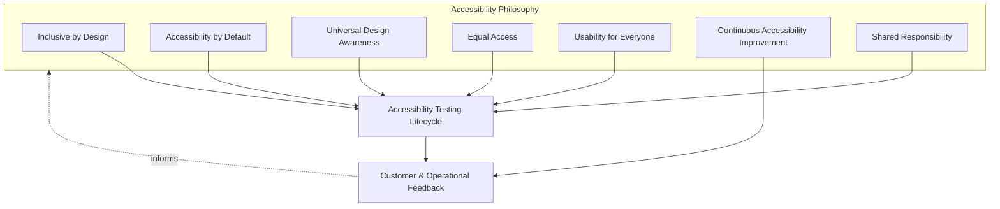
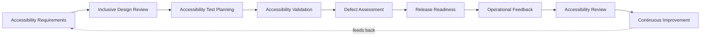
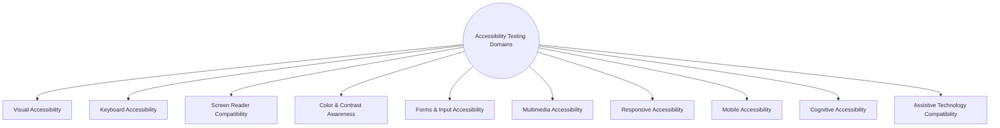
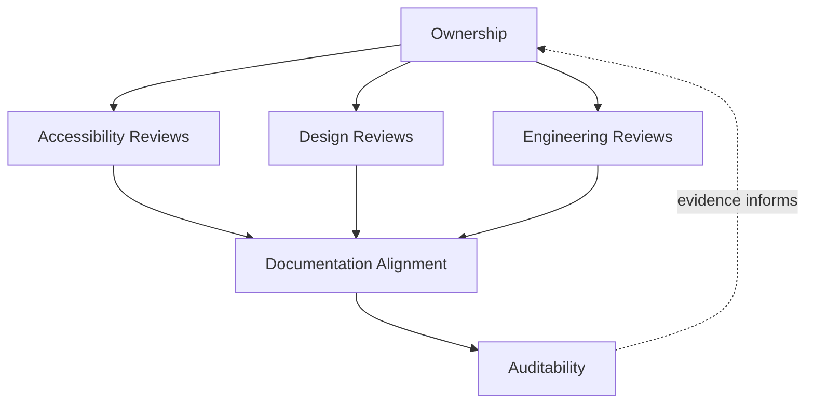
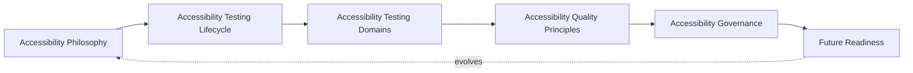
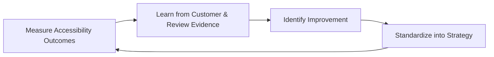

# Enterprise Accessibility Testing & Inclusive Quality Strategy

## 1. Document Purpose

This document defines the official Enterprise Accessibility Testing & Inclusive Quality Strategy for **StackLeo Tech Store**. It establishes accessibility philosophy, the accessibility testing lifecycle, accessibility testing domains, and long-term inclusive quality governance that apply across the entire platform — independent of any specific team, tool, or assistive technology.

- **Purpose of Accessibility Testing** — accessibility testing exists to produce objective, evidence-based confidence that the platform can be perceived, operated, and understood by customers regardless of ability, converting the WCAG 2.2 AA commitment in `02_Product/non-functional-requirements.md` (Section 11) from a stated intention into a verified, sustained outcome.
- **Relationship with Quality Strategy** — Accessibility Quality is one of the ten quality domains defined in `quality-strategy.md` (Section 4.7); this document is that domain's dedicated elaboration, defining how accessibility is verified rather than redefining why it matters.
- **Relationship with UX Design** — this strategy validates, rather than replaces, the inclusive intent of experience design; it assumes accessibility is considered during design and exists to confirm that intent survives all the way into delivered, released experience.
- **Relationship with Product Design** — accessibility requirements (Section 3.1) trace to the same customer journeys and personas defined in `02_Product/user-journeys.md` and `02_Product/user-personas.md`, ensuring accessibility validation reflects genuine product context rather than generic, decontextualized checks.
- **Relationship with Customer Experience** — accessibility is a direct component of customer experience, not a separate concern layered on top of it; an inaccessible experience is, for the customer affected, a broken experience, regardless of how well it performs for others.
- **Relationship with Digital Inclusion** — this strategy positions StackLeo's accessibility commitment within the broader goal of digital inclusion in Bangladesh and its future markets, consistent with the inclusive, trust-centered brand vision in `01_Business/vision.md` (Section 9).

This document is implementation-independent and vendor-neutral. It defines accessibility philosophy, lifecycle, domains, and governance — not specific accessibility testing tools, browser extensions, assistive technologies, compliance platforms, or code-level implementation techniques.

## 2. Accessibility Philosophy

Accessibility at StackLeo is governed by seven principles. Each exists to produce a specific business outcome — accessibility is pursued because of the customers it reaches and the trust it builds, not as a compliance formality.

### 2.1 Inclusive by Design

Accessibility is considered from the moment an experience is conceived, not inspected into it after design and construction are complete.

- **Business Value** — an accessibility barrier prevented at design time costs a fraction of one retrofitted after release; inclusive design protects both delivery velocity and reach into the customer base at the same time.

### 2.2 Accessibility by Default

The default behavior and presentation of any customer-facing experience is the most accessible reasonable option, rather than accessibility being an opt-in enhancement layered on afterward.

- **Business Value** — ensures every customer benefits from accessible defaults without needing to know to ask for them, widening the platform's effective reach without additional customer effort.

### 2.3 Universal Design Awareness

Experiences are designed to work well for the widest practical range of customers and contexts from the outset, recognizing that accessibility improvements (clear structure, sufficient contrast, predictable navigation) commonly benefit all customers, not only those with disabilities.

- **Business Value** — a single well-designed experience serves customers with permanent, temporary, and situational limitations alike (e.g., bright sunlight, a broken pointing device, unfamiliarity with technology) — a materially larger addressable population than disability alone.

### 2.4 Equal Access

Every customer, regardless of ability, is entitled to genuinely equivalent access to StackLeo's products, pricing, and purchasing capability — not a degraded or separate experience.

- **Business Value** — protects the trust-centered brand promise in `01_Business/vision.md`; unequal access is, in practice, a form of unequal service that directly contradicts that promise.

### 2.5 Usability for Everyone

Accessibility is pursued together with, not instead of, general usability (`quality-strategy.md`, Section 4.6); an experience is not genuinely accessible if it is technically operable by assistive technology but confusing or exhausting to use.

- **Business Value** — ensures accessibility investment improves the real, lived experience of customers, not only a technical conformance score.

### 2.6 Continuous Accessibility Improvement

Accessibility practice matures over time, informed by real customer feedback, assistive technology evolution, and evolving standards, rather than being fixed at a single point of initial compliance.

- **Business Value** — protects long-term conformance and reach as the platform, its channels (Section 7), and assistive technology itself continue to evolve.

### 2.7 Shared Responsibility

Accessibility is owned jointly by Product, Design, Engineering, and QA; no single function is solely accountable for whether the platform is genuinely usable by everyone.

- **Business Value** — prevents the anti-pattern in Section 9.5, where accessibility degrades because every function assumes another is responsible for it.

*Diagram 1: Accessibility Philosophy Overview — the seven principles shape the accessibility testing lifecycle, and customer and operational feedback feed back into the philosophy itself.*

## 3. Accessibility Testing Lifecycle

Accessibility testing is governed across nine conceptual stages, spanning from initial requirements through operational feedback and continuous improvement.

### 3.1 Accessibility Requirements

- **Purpose** — establish explicit, verifiable accessibility expectations for a capability, tracing to `02_Product/non-functional-requirements.md` (Section 11, NFR-037–NFR-041).
- **Business Value** — removes ambiguity about what "accessible" means for a given capability, replacing subjective impression with agreed, standards-aligned criteria.
- **Governance Objectives** — ensure every customer-facing capability has documented accessibility requirements before design proceeds.

### 3.2 Inclusive Design Review

- **Purpose** — review design artifacts for accessibility and inclusive design considerations before construction begins.
- **Business Value** — catches structural accessibility barriers (e.g., reliance on color alone, unclear navigation order) at the cheapest possible point to address them.
- **Governance Objectives** — require documented design review sign-off addressing accessibility before a capability proceeds to development.

### 3.3 Accessibility Test Planning

- **Purpose** — determine the accessibility testing approach, domains (Section 4), and depth appropriate to the capability, coordinated with `test-planning.md`.
- **Business Value** — ensures accessibility testing effort is deliberately scoped rather than treated as an afterthought squeezed into general testing time.
- **Governance Objectives** — confirm accessibility test plans trace to the requirements established in Section 3.1.

### 3.4 Accessibility Validation

- **Purpose** — execute planned accessibility testing across relevant domains (Section 4) and confirm conformance with defined requirements.
- **Business Value** — produces objective, evidence-based confidence that the capability is genuinely usable by customers with disabilities before release.
- **Governance Objectives** — ensure validation includes both automated conformance checks and genuine assistive-technology-representative verification, neither alone being treated as sufficient.

### 3.5 Defect Assessment

- **Purpose** — assess discovered accessibility barriers for severity and customer impact, and determine appropriate resolution priority.
- **Business Value** — ensures accessibility defect response is proportionate to genuine impact on affected customers, consistent with Equal Access (Section 2.4).
- **Governance Objectives** — ensure accessibility defects are triaged against consistent, documented severity criteria and tracked to resolution.

### 3.6 Release Readiness

- **Purpose** — confirm, using accumulated accessibility evidence, that a capability is genuinely ready to reach customers.
- **Business Value** — converts accessibility-related release decisions into routine, evidence-based confirmations rather than assumptions.
- **Governance Objectives** — treat accessibility as release-blocking for customer-facing capability, consistent with `quality-strategy.md` (Section 4.7) and `testing-strategy.md` (Section 5.7).

### 3.7 Operational Feedback

- **Purpose** — capture real customer feedback and observed difficulty from customers using assistive technology once a capability is live.
- **Business Value** — surfaces accessibility gaps that pre-release testing, however thorough, may not have anticipated.
- **Governance Objectives** — ensure accessibility-related customer feedback channels exist and are actively monitored, not merely available in theory.

### 3.8 Accessibility Review

- **Purpose** — periodically evaluate the overall accessibility health and maturity of the platform, not only the outcome of individual capabilities.
- **Business Value** — gives leadership an honest, evidence-based view of accessibility maturity, supporting informed investment decisions.
- **Governance Objectives** — ensure review is conducted on a regular, predictable cadence and reported to accountable ownership (Section 6.1).

### 3.9 Continuous Improvement

- **Purpose** — act on operational feedback and review findings to deliberately improve accessibility practice.
- **Business Value** — ensures accessibility maturity compounds over time rather than remaining static as the platform, channels, and standards evolve.
- **Governance Objectives** — ensure improvement actions arising from accessibility reviews are tracked to completion.

### Accessibility Testing Lifecycle Matrix

| Stage | Purpose | Business Value | Governance Objective |
|---|---|---|---|
| Accessibility Requirements | Establish explicit, verifiable expectations | Removes ambiguity about what "accessible" means | Documented requirements before design proceeds |
| Inclusive Design Review | Review design for accessibility before construction | Catches structural barriers at the cheapest point | Documented sign-off before development begins |
| Accessibility Test Planning | Determine testing approach and domains | Effort deliberately scoped, not an afterthought | Plans trace to documented requirements |
| Accessibility Validation | Execute testing and confirm conformance | Objective, evidence-based confidence pre-release | Includes both automated checks and representative verification |
| Defect Assessment | Assess barriers for severity and customer impact | Response proportionate to genuine impact | Defects triaged against consistent criteria, tracked to closure |
| Release Readiness | Confirm genuine readiness using accumulated evidence | Converts release decisions into routine confirmations | Treated as release-blocking for customer-facing capability |
| Operational Feedback | Capture real customer feedback post-release | Surfaces gaps pre-release testing may have missed | Feedback channels exist and are actively monitored |
| Accessibility Review | Evaluate overall accessibility maturity periodically | Informs leadership investment decisions | Regular cadence, reported to accountable ownership |
| Continuous Improvement | Act on feedback and review findings | Maturity compounds over time | Improvement actions tracked to completion |

*Diagram 2: Enterprise Accessibility Testing Lifecycle — a continuous cycle in which release and operational evidence directly informs the next iteration of requirements.*

## 4. Accessibility Testing Domains

Accessibility testing is organized across ten conceptual domains, each verifying a distinct dimension of accessible experience, consistent with WCAG 2.2 AA and `02_Product/non-functional-requirements.md` (Section 11).

### 4.1 Visual Accessibility

- **Purpose** — confirm customers with low vision or visual impairment can perceive and use presented content.
- **Scope** — text scaling, visual clarity, and non-reliance on visual presentation alone to convey meaning.
- **Governance Expectations** — verified for all customer-facing experience as a baseline expectation, not an enhancement.
- **Business Importance** — protects usability for a customer segment that is both significant and easily overlooked by sighted-only design review.

### 4.2 Keyboard Accessibility

- **Purpose** — confirm all customer-facing functionality can be operated using keyboard navigation alone, per NFR-037.
- **Scope** — full interaction paths — browse, search, cart, checkout — without requiring a pointing device, including visible focus indication per NFR-040.
- **Governance Expectations** — required for every customer-facing interactive element without exception.
- **Business Importance** — directly serves customers using assistive input devices and is foundational to Screen Reader Compatibility (Section 4.3).

### 4.3 Screen Reader Compatibility

- **Purpose** — confirm customer-facing content is presented in a manner correctly interpretable by screen reader technology, per NFR-038 and NFR-041.
- **Scope** — semantic structure, meaningful labeling, and correct assistive-technology interpretation of all customer-facing content.
- **Governance Expectations** — validated through both automated structural checks and genuine assistive-technology-representative verification.
- **Business Importance** — enables customers with visual impairments to independently browse, evaluate, and purchase products.

### 4.4 Color & Contrast Awareness

- **Purpose** — confirm sufficient color contrast and non-reliance on color alone to convey meaning, per NFR-039.
- **Scope** — text and meaningful interface elements across all customer-facing surfaces and brand presentations.
- **Governance Expectations** — validated against WCAG 2.2 AA contrast thresholds; brand color decisions are reviewed against this expectation rather than assumed compliant.
- **Business Importance** — protects readability for customers with low vision or color vision differences, a substantial and common form of visual variation.

### 4.5 Forms & Input Accessibility

- **Purpose** — confirm forms (registration, checkout, address entry) are usable, understandable, and correctly labeled for all customers.
- **Scope** — checkout, account, and other data-entry flows central to completing a purchase.
- **Governance Expectations** — required at the highest rigor for checkout and payment flows, given their criticality to revenue and customer trust.
- **Business Importance** — protects the specific journey where an accessibility barrier most directly and immediately blocks a completed sale.

### 4.6 Multimedia Accessibility

- **Purpose** — confirm images, video, and other non-text content are accessible to customers who cannot perceive them as presented.
- **Scope** — product imagery, promotional media, and any video or audio content presented to customers.
- **Governance Expectations** — meaningful non-text content requires an accessible text alternative as a baseline, non-negotiable expectation.
- **Business Importance** — protects product discovery and evaluation, which depend heavily on imagery in a technology retail catalog.

### 4.7 Responsive Accessibility

- **Purpose** — confirm accessibility is preserved as presentation adapts across screen sizes and orientations.
- **Scope** — customer-facing experience across the device and browser diversity addressed in `02_Product/non-functional-requirements.md` (Compatibility).
- **Governance Expectations** — accessibility validation is repeated across representative responsive breakpoints, not performed once at a single size.
- **Business Importance** — protects accessibility for customers who predominantly or exclusively use smaller or non-desktop devices, common in Bangladesh's device landscape.

### 4.8 Mobile Accessibility

- **Purpose** — confirm accessibility on mobile web today, and mobile app experience once introduced (Section 7).
- **Scope** — touch target sizing, gesture alternatives, and mobile-specific assistive technology behavior.
- **Governance Expectations** — mobile accessibility is validated as its own domain, not assumed automatically inherited from desktop validation.
- **Business Importance** — protects accessibility for what is likely StackLeo's dominant access method given regional device usage patterns.

### 4.9 Cognitive Accessibility

- **Purpose** — confirm experiences are understandable and predictable for customers with cognitive, learning, or attention-related differences, and for customers simply unfamiliar with technology.
- **Scope** — clarity of language, predictability of navigation and interaction patterns, and freedom from unnecessary complexity in critical flows.
- **Governance Expectations** — evaluated with particular attention to checkout and account flows, where confusion carries the highest business cost.
- **Business Importance** — extends accessibility benefit to a broad population, including the less technical customer personas already central to `02_Product/user-personas.md`.

### 4.10 Assistive Technology Compatibility

- **Purpose** — confirm the platform behaves correctly and predictably across the range of assistive technology customers actually use.
- **Scope** — cross-cutting validation spanning Sections 4.1–4.9, confirmed against representative assistive technology usage rather than a single configuration.
- **Governance Expectations** — validated as a distinct, explicit domain rather than assumed as an automatic byproduct of the other nine domains.
- **Business Importance** — provides the final, holistic confirmation that accessibility conformance translates into genuine usability with real assistive technology.

### Accessibility Testing Domain Matrix

| Domain | Purpose | Governance Expectations | Business Importance |
|---|---|---|---|
| Visual Accessibility | Confirm perceivability for low-vision customers | Baseline for all customer-facing experience | Protects a segment easily overlooked by sighted-only review |
| Keyboard Accessibility | Confirm full keyboard operability | Required for every interactive element, no exception | Foundational to assistive-input and screen reader use |
| Screen Reader Compatibility | Confirm correct assistive-technology interpretation | Validated via automated checks and representative verification | Enables independent browsing and purchasing |
| Color & Contrast Awareness | Confirm sufficient contrast, no color-only meaning | Validated against WCAG 2.2 AA thresholds | Protects readability for low vision/color vision differences |
| Forms & Input Accessibility | Confirm accessible, understandable data entry | Highest rigor for checkout and payment flows | Protects the journey most directly tied to completed sales |
| Multimedia Accessibility | Confirm accessible non-text content | Text alternatives required as a baseline | Protects product discovery, which depends heavily on imagery |
| Responsive Accessibility | Confirm accessibility across screen sizes | Validated across representative breakpoints | Protects customers on smaller/non-desktop devices |
| Mobile Accessibility | Confirm accessibility on mobile web and future app | Validated as its own domain, not inherited from desktop | Protects StackLeo's likely dominant access method |
| Cognitive Accessibility | Confirm understandable, predictable experiences | Particular attention to checkout and account flows | Extends benefit to a broad, including less-technical, population |
| Assistive Technology Compatibility | Confirm correct behavior with real assistive technology | Validated as a distinct, explicit domain | Confirms conformance translates into genuine usability |

*Diagram 3: Inclusive Design Validation Framework — ten domains, each independently governed but collectively confirming an experience is genuinely usable by every customer.*

## 5. Accessibility Quality Principles

Accessibility quality principles are organized around the four foundational properties of an accessible experience, extended with StackLeo-specific governance commitments.

- **Perceivable Experiences** — customers must be able to perceive presented content through at least one sense available to them (sight, hearing, touch via assistive technology); this underpins Visual, Color & Contrast, and Multimedia Accessibility (Sections 4.1, 4.4, 4.6).
- **Operable Experiences** — customers must be able to operate all interactive functionality regardless of input method; this underpins Keyboard and Forms & Input Accessibility (Sections 4.2, 4.5).
- **Understandable Experiences** — customers must be able to understand both the content presented and how the interface behaves; this underpins Cognitive Accessibility (Section 4.9).
- **Robust Experiences** — content must remain correctly interpretable across current and future assistive technology; this underpins Screen Reader Compatibility and Assistive Technology Compatibility (Sections 4.3, 4.10).
- **Inclusive User Journeys** — accessibility is validated across complete customer journeys (browse → cart → checkout → order), not only in isolated components, ensuring an accessible individual page does not still leave an inaccessible overall journey.
- **Accessibility Quality Gates** — accessibility validation outcomes are a mandatory, first-class input to release readiness (Section 3.6), never an optional or advisory signal bypassed under schedule pressure.
- **Continuous Validation** — accessibility conformance is re-validated on an ongoing basis as the experience evolves, rather than confirmed once and assumed to remain true indefinitely.

### Accessibility Quality Principle Matrix

| Principle | Description | Business Value |
|---|---|---|
| Perceivable Experiences | Content perceivable through at least one available sense | Ensures no customer is excluded by how content is presented |
| Operable Experiences | Functionality usable regardless of input method | Ensures no customer is excluded by how they interact |
| Understandable Experiences | Content and behavior are comprehensible | Reduces confusion-driven abandonment across all customers |
| Robust Experiences | Correct interpretation across current and future assistive technology | Protects accessibility as technology evolves |
| Inclusive User Journeys | Validated across complete journeys, not isolated components | Prevents an accessible page from sitting inside an inaccessible journey |
| Accessibility Quality Gates | Mandatory, first-class input to release readiness | Prevents accessibility risk from being silently accepted |
| Continuous Validation | Re-validated on an ongoing basis as experience evolves | Keeps conformance genuine rather than a one-time snapshot |

## 6. Accessibility Governance

### 6.1 Ownership

Every accessibility testing domain (Section 4) has a single accountable owner; overall accessibility governance is owned jointly by Product, Design, and QA leadership, consistent with Shared Responsibility (Section 2.7).

### 6.2 Accessibility Reviews

Accessibility validation outcomes are formally reviewed at defined lifecycle checkpoints (Section 3.4–3.6), ensuring accessibility confirmation is a deliberate governance act, not an informal assumption.

### 6.3 Design Reviews

Design artifacts are reviewed for accessibility and inclusive design considerations (Section 3.2) before development begins, ensuring accessibility is evaluated at its cheapest point of correction.

### 6.4 Engineering Reviews

Engineering practice is periodically reviewed for consistent application of accessible defaults (Section 2.2), independent of any single capability's individual test outcome.

### 6.5 Documentation Alignment

Accessibility documentation is kept consistent with `02_Product/non-functional-requirements.md` (Section 11), `quality-strategy.md`, and `testing-strategy.md`; an accessibility claim that contradicts current requirements documentation is treated as a governance gap.

### 6.6 Auditability

Accessibility requirements, design review outcomes, validation results, and defect resolutions are retained in a form that can be independently reviewed after the fact, supporting internal governance and future regulatory or compliance review.

### Accessibility Governance Matrix

| Governance Area | Objective |
|---|---|
| Ownership | Every accessibility domain has one accountable owner |
| Accessibility Reviews | Accessibility confirmation is a deliberate, checkpointed governance act |
| Design Reviews | Accessibility is evaluated at design time, its cheapest point of correction |
| Engineering Reviews | Accessible defaults are applied consistently, independent of any single feature |
| Documentation Alignment | Accessibility documentation stays consistent with requirements and quality strategy |
| Auditability | Requirements, reviews, and results retained for independent review |

### Governance Responsibility Matrix

| Role | Responsibility |
|---|---|
| Head of Quality / QA Leadership | Owns coherence and enforcement of this accessibility strategy, in partnership with Product and Design leadership. |
| Accessibility Lead / Champion | Owns accessibility domain execution (Section 4) and coordinates review activity across Design and Engineering. |
| Product Design / UX Lead | Ensures inclusive design review (Section 3.2) reflects genuine customer persona and journey context. |
| Engineering Leads | Apply Accessibility by Default (Section 2.2) consistently within their domain. |
| QA / Test Architects | Ensure accessibility validation is planned and executed consistently with `testing-strategy.md` (Section 5.7). |
| Customer Support Lead | Ensures accessibility-related customer feedback (Section 3.7) is captured and routed to accountable owners. |
| Internal Audit / Review Function | Independently verifies that accessibility governance records reflect actual practice. |

*Diagram 4 (Part A): Accessibility Governance Model — ownership anchors review activity across accessibility, design, and engineering, feeding documentation alignment and auditable evidence.*

*Diagram 4 (Part B): Accessibility Quality Operating Model — how philosophy, lifecycle, domains, principles, and governance operate together as a single, self-reinforcing system that continues to evolve as the platform grows.*

## 7. Future Readiness

This strategy is designed to remain valid as StackLeo evolves in scale and architectural complexity, without requiring redefinition of its underlying philosophy.

- **Cloud-Native Platforms** — accessibility testing domains (Section 4) are defined independently of any specific runtime or deployment model, so they apply unchanged as infrastructure evolves.
- **AI Systems** — as AI-assisted capability (recommendations, search relevance, conversational assistance) is introduced, Perceivable and Understandable Experience principles (Section 5) extend to cover AI-generated or AI-mediated content, ensuring it remains accessible by the same standards as any other customer-facing content.
- **Marketplace Platform** — the multi-vendor marketplace model extends Multimedia and Forms & Input Accessibility (Sections 4.6, 4.5) to cover seller-supplied content and listings, applying the same conformance rigor used for StackLeo's own catalog today.
- **Mobile Applications** — Mobile Accessibility (Section 4.8) extends from mobile web today into a dedicated native mobile app validation domain once that channel is introduced, without requiring a new governance model.
- **Multi-Tenant Architecture** — where future architecture introduces tenant-specific or seller-specific presentation, accessibility governance (Section 6) extends to hold each tenant's contribution to the same conformance standard as StackLeo's own experience.
- **Global Accessibility Programs** — as StackLeo expands into South Asia and beyond, this strategy's principles (Sections 2, 5) remain applicable across jurisdictions, while specific regulatory accessibility obligations in new markets are layered on as additional, market-specific requirements without altering the underlying philosophy.
- **Global Engineering Teams** — the lifecycle, domains, and governance defined in Sections 3–6 are defined independently of team size, location, or organizational structure, so they remain coherent as engineering and design scale beyond a single, co-located team.

## 8. Governance

- **Ownership** — the Head of Quality (or equivalent accountable executive function), in partnership with Product Design leadership, owns this strategy and is accountable for its consistent application across the platform.
- **Review Process** — this strategy is formally reviewed whenever a material change occurs in product experience (`02_Product`), business model (`01_Business/business-model.md`), or applicable accessibility standards, and on a regular recurring cadence independent of specific change events.
- **Accessibility Policies** — subordinate, practice-specific accessibility documents (design guideline references, defect severity standards, and further documents within `08_QUALITY_ASSURANCE`) must remain consistent with the philosophy, lifecycle, and domains defined here.
- **Audit Readiness** — this strategy and the evidence it requires (Section 6.6) are maintained in a state ready for internal or external audit at any time, without requiring advance preparation.
- **Continuous Improvement** — this strategy itself is subject to Continuous Accessibility Improvement (Section 2.6, Section 3.9); its effectiveness is periodically assessed and revised based on genuine customer feedback and organizational evidence.

*Diagram 5: Continuous Accessibility Improvement Cycle — accessibility outcomes are measured, learned from, improved upon, and standardized back into this strategy, on a continuing basis.*

## 9. Anti-Patterns

The following recurring failure patterns are explicitly recognized and avoided, as each one structurally undermines this strategy.

| Anti-Pattern | Why It's Avoided |
|---|---|
| Accessibility Considered Too Late | Contradicts Inclusive by Design (Section 2.1); barriers found after construction is complete are the most expensive and disruptive to correct. |
| Keyboard-Only Barriers | Undermines Keyboard Accessibility (Section 4.2), one of the most foundational and easily verified accessibility requirements; its absence blocks an entire category of customers outright. |
| Poor Color Contrast Awareness | Undermines Color & Contrast Awareness (Section 4.4); insufficient contrast silently excludes customers with low vision or color vision differences without any explicit decision to do so. |
| Missing Inclusive Design Reviews | Undermines Inclusive Design Review (Section 3.2); without design-stage review, accessibility becomes dependent on individual developer awareness rather than deliberate practice. |
| Accessibility as a Compliance Checkbox | Contradicts Usability for Everyone (Section 2.5); treating accessibility as a conformance checklist rather than genuine usability produces experiences that pass audits but still frustrate real customers. |
| Reactive Accessibility Improvements | Contradicts Continuous Accessibility Improvement (Section 2.6); waiting for customer complaints to reveal barriers is the costliest and least dignified way to discover an accessibility failure. |
| Weak Documentation | Undermines Documentation Alignment (Section 6.5) and Auditability (Section 6.6), leaving accessibility evidence unclear or unverifiable after the fact. |
| Missing Continuous Accessibility Reviews | Contradicts Section 3.8; without regular review, accessibility maturity stagnates or silently regresses as the platform and standards evolve. |

## 10. Document Information

| Property | Value |
|----------|-------|
| Document | accessibility-testing.md |
| Version | 1.0.0 |
| Status | Active |
| Maintained By | StackLeo |
| Last Updated | 2026-07-24 |

---

© StackLeo. All Rights Reserved.
