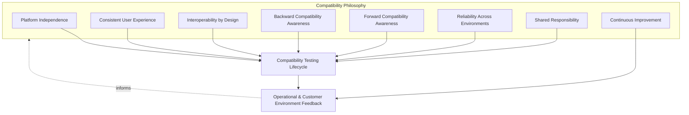
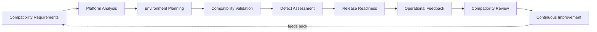
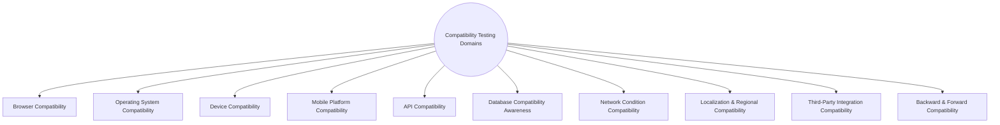
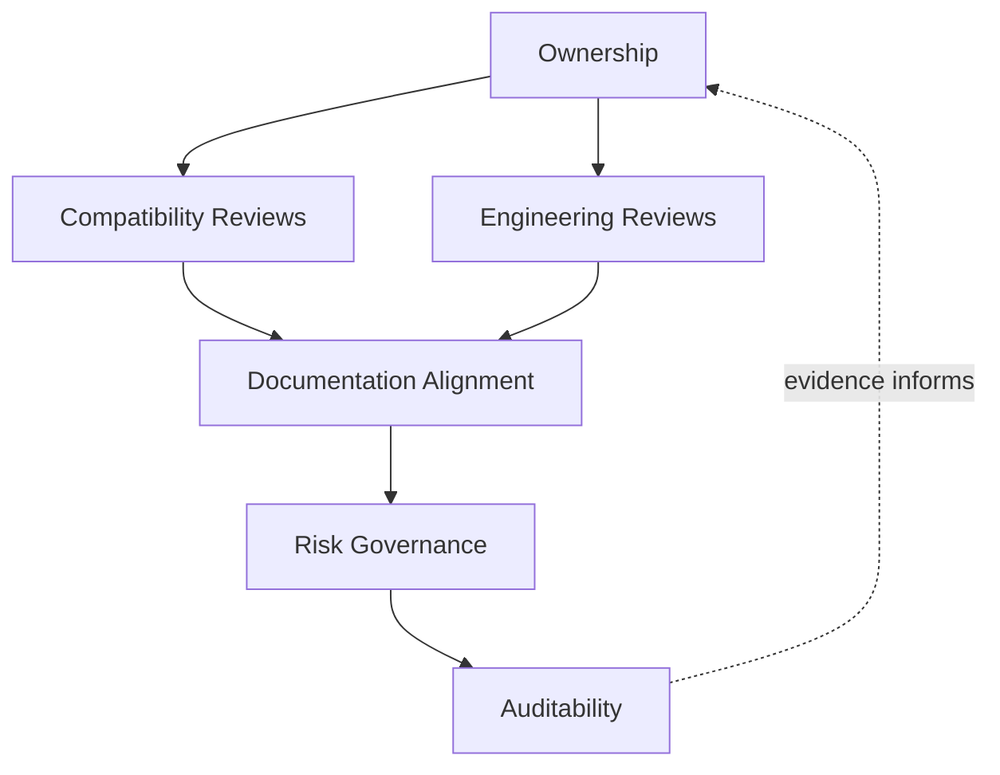
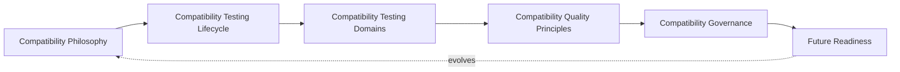
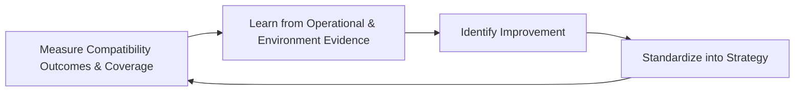

# Enterprise Compatibility & Cross-Platform Testing Strategy

## 1. Document Purpose

This document defines the official Enterprise Compatibility & Cross-Platform Testing Strategy for **StackLeo Tech Store**. It establishes compatibility philosophy, the compatibility testing lifecycle, compatibility testing domains, and long-term compatibility engineering governance that apply across the entire platform — independent of any specific browser, device, operating system, or testing tool.

- **Purpose of Compatibility Testing** — compatibility testing exists to produce objective, evidence-based confidence that the platform functions correctly and consistently across the diverse browsers, devices, operating systems, networks, and integrations customers and partners actually use, converting the compatibility commitment in `02_Product/non-functional-requirements.md` (Section 17, NFR-065–NFR-066) into a verified, sustained outcome.
- **Relationship with Quality Strategy** — Compatibility Quality is one of the ten quality domains defined in `quality-strategy.md` (Section 4.8); this document is that domain's dedicated elaboration, defining how compatibility is verified rather than redefining why it matters.
- **Relationship with Testing Strategy** — this document is the compatibility-specific elaboration of Compatibility Testing as a type defined in `testing-strategy.md` (Section 5.8); it extends that definition into a full lifecycle, domain set, and governance model, while remaining subordinate to the overall testing philosophy and levels defined there.
- **Relationship with Customer Experience** — compatibility is a precondition for customer experience, not a separate concern from it; a well-designed experience that fails on the customer's actual device or browser has, for that customer, no experience at all.
- **Relationship with Platform Engineering** — this strategy assumes the abstraction and standardization discipline of `07_DEVOPS/platform-engineering.md`; compatibility validation confirms that the consistency platform engineering intends to deliver is genuinely realized across every environment a customer or partner encounters.
- **Relationship with Business Continuity** — compatibility failure on a widely used browser, device, or partner integration is itself a form of business disruption; this strategy is a proactive protection against the customer- and partner-facing continuity risks addressed operationally in `06_Security/business-continuity.md`.

This document is implementation-independent and vendor-neutral. It defines compatibility philosophy, lifecycle, domains, and governance — not specific browsers, devices, operating systems, testing tools, cloud device farms, or compatibility platforms.

## 2. Compatibility Philosophy

Compatibility at StackLeo is governed by eight principles. Each exists to produce a specific business outcome — compatibility is pursued because of the reach and trust it protects, not as an abstract engineering exercise.

### 2.1 Platform Independence

The platform's core capability is designed to function correctly regardless of the specific browser, device, or operating system a customer chooses, rather than depending on the characteristics of any single environment.

- **Business Value** — protects StackLeo's addressable market from being artificially constrained by technology choices outside the business's or the customer's control.

### 2.2 Consistent User Experience

Customers receive a functionally and experientially consistent experience across environments, even where visual presentation reasonably adapts to context.

- **Business Value** — protects brand trust; a customer who receives a degraded or confusing experience on their preferred device forms the same negative impression as one who encounters an outright defect.

### 2.3 Interoperability by Design

The platform is designed from the outset to interact correctly with external systems — payment providers, couriers, and future marketplace and B2B partners — through well-defined, stable contracts.

- **Business Value** — protects the reliability of StackLeo's partner ecosystem, directly supporting the Interoperability requirements in `02_Product/non-functional-requirements.md` (Section 18, NFR-067–NFR-071).

### 2.4 Backward Compatibility Awareness

Changes to the platform's contracts and behavior are made with deliberate awareness of what currently depends on them, avoiding silent breakage of still-valid prior integrations or client versions.

- **Business Value** — protects existing customers, partners, and integrations from being broken by changes made in service of new capability, preserving continuity of trust.

### 2.5 Forward Compatibility Awareness

The platform's contracts and structures are designed, where reasonable, to accommodate future evolution without requiring disruptive redesign.

- **Business Value** — reduces the cost and risk of future expansion (Section 7), consistent with the extensibility commitments in `03_System_Design/quality-attributes.md` (Section 9).

### 2.6 Reliability Across Environments

The platform behaves reliably and predictably regardless of the specific environment conditions it encounters, including variable network quality common across its primary market.

- **Business Value** — protects customer trust and completed transactions in a market where network and device conditions are materially more variable than in mature markets.

### 2.7 Shared Responsibility

Compatibility is owned jointly by Engineering, QA, and Product; no single function is solely accountable for whether the platform works correctly across every environment customers use.

- **Business Value** — prevents the anti-pattern in Section 9.7, where compatibility degrades because ownership of "does it work everywhere" is unclear.

### 2.8 Continuous Improvement

Compatibility practice matures over time, informed by real customer environment data, evolving browser and device landscapes, and operational feedback.

- **Business Value** — keeps compatibility strategy relevant as the browser, device, and partner ecosystem StackLeo depends on continues to evolve independently of StackLeo itself.

*Diagram 1: Compatibility Philosophy Overview — the eight principles shape the compatibility testing lifecycle, and operational and customer environment feedback feed back into the philosophy itself.*

## 3. Compatibility Testing Lifecycle

Compatibility testing is governed across nine conceptual stages, spanning from initial requirements through operational feedback and continuous improvement.

### 3.1 Compatibility Requirements

- **Purpose** — establish explicit, verifiable compatibility expectations for a capability, tracing to `02_Product/non-functional-requirements.md` (Sections 17–18).
- **Business Value** — removes ambiguity about which environments and integration partners a capability must genuinely support.
- **Governance Objectives** — ensure every customer-facing or partner-facing capability has documented compatibility requirements before design proceeds.

### 3.2 Platform Analysis

- **Purpose** — determine the actual browsers, devices, operating systems, and network conditions relevant to StackLeo's real customer base, informed by genuine usage data.
- **Business Value** — grounds compatibility effort in real market conditions rather than convenient or outdated assumptions.
- **Governance Objectives** — ensure platform analysis is refreshed periodically to reflect genuine, current usage patterns.

### 3.3 Environment Planning

- **Purpose** — determine the specific compatibility testing approach and representative environment coverage appropriate to the capability's risk, coordinated with `test-planning.md`.
- **Business Value** — ensures compatibility testing effort is deliberately scoped rather than attempted exhaustively or arbitrarily.
- **Governance Objectives** — confirm environment coverage decisions trace to platform analysis (Section 3.2) rather than convenience or habit.

### 3.4 Compatibility Validation

- **Purpose** — execute planned compatibility testing across relevant domains (Section 4) and confirm consistent behavior.
- **Business Value** — produces objective, evidence-based confidence that the capability functions correctly across the environments customers actually use.
- **Governance Objectives** — ensure validation results are recorded per environment combination and traceable to the requirement they verify.

### 3.5 Defect Assessment

- **Purpose** — assess discovered compatibility defects for severity, customer reach, and business impact.
- **Business Value** — ensures compatibility defect response is proportionate to genuine reach and consequence, not treated uniformly regardless of impact.
- **Governance Objectives** — ensure compatibility defects are triaged against consistent, documented criteria and tracked to resolution or an explicit, accountable risk decision.

### 3.6 Release Readiness

- **Purpose** — confirm, using accumulated compatibility evidence, that a capability is genuinely ready to reach customers across its intended environments.
- **Business Value** — converts compatibility-related release decisions into routine, evidence-based confirmations rather than assumptions.
- **Governance Objectives** — treat compatibility as a required release readiness input, consistent with `testing-strategy.md` (Section 3.8).

### 3.7 Operational Feedback

- **Purpose** — capture real customer and partner reports of compatibility issues encountered in production.
- **Business Value** — surfaces environment-specific gaps that pre-release testing, however thorough, could not fully anticipate given real-world environment diversity.
- **Governance Objectives** — ensure compatibility-related feedback channels exist and are actively monitored, not merely available in theory.

### 3.8 Compatibility Review

- **Purpose** — periodically evaluate the overall compatibility health and coverage of the platform against the current environment landscape.
- **Business Value** — gives leadership an honest, evidence-based view of compatibility maturity and coverage adequacy, informing investment decisions.
- **Governance Objectives** — ensure review is conducted on a regular, predictable cadence and reported to accountable ownership (Section 6.1).

### 3.9 Continuous Improvement

- **Purpose** — act on operational feedback and review findings to deliberately improve compatibility practice and coverage.
- **Business Value** — ensures compatibility maturity compounds over time as the browser, device, and partner ecosystem evolves.
- **Governance Objectives** — ensure improvement actions arising from compatibility reviews are tracked to completion.

### Compatibility Testing Lifecycle Matrix

| Stage | Purpose | Business Value | Governance Objective |
|---|---|---|---|
| Compatibility Requirements | Establish explicit, verifiable expectations | Removes ambiguity about supported environments/partners | Documented requirements before design proceeds |
| Platform Analysis | Determine actual relevant environments from real usage | Grounds effort in real market conditions | Analysis refreshed periodically against real data |
| Environment Planning | Determine testing approach and coverage | Effort deliberately scoped, not arbitrary | Coverage traces to platform analysis |
| Compatibility Validation | Execute testing and confirm consistent behavior | Objective, evidence-based confidence pre-release | Results recorded per environment, traceable to requirement |
| Defect Assessment | Assess defects for severity and reach | Response proportionate to genuine impact | Defects triaged against consistent criteria, tracked to closure |
| Release Readiness | Confirm genuine readiness across intended environments | Converts release decisions into routine confirmations | Compatibility is a required release readiness input |
| Operational Feedback | Capture real customer/partner compatibility reports | Surfaces gaps pre-release testing couldn't fully anticipate | Feedback channels exist and are actively monitored |
| Compatibility Review | Evaluate overall coverage against current landscape | Informs leadership investment decisions | Regular cadence, reported to accountable ownership |
| Continuous Improvement | Act on feedback and review findings | Compatibility maturity compounds over time | Improvement actions tracked to completion |

*Diagram 2: Enterprise Compatibility Testing Lifecycle — a continuous cycle in which release and operational evidence directly informs the next iteration of requirements.*

## 4. Compatibility Testing Domains

Compatibility testing is organized across ten conceptual domains, each verifying a distinct dimension of cross-platform and cross-environment consistency.

### 4.1 Browser Compatibility

- **Purpose** — confirm the web experience functions correctly across the browsers customers actually use, per NFR-065.
- **Scope** — current major browsers relevant to StackLeo's Bangladesh customer base, informed by Platform Analysis (Section 3.2).
- **Governance Expectations** — coverage prioritized by real, current usage share, reviewed periodically rather than fixed once.
- **Business Importance** — protects the primary channel (Web) through which all current customers access StackLeo.

### 4.2 Operating System Compatibility

- **Purpose** — confirm correct function across the operating systems underlying customers' browsers and future native applications.
- **Scope** — desktop and mobile operating system versions relevant to the current and projected customer base.
- **Governance Expectations** — coverage informed by genuine usage data rather than assumption about a "typical" customer device.
- **Business Importance** — protects against operating-system-specific behavior differences that browser-level testing alone may not reveal.

### 4.3 Device Compatibility

- **Purpose** — confirm correct function across the physical device types and form factors customers use.
- **Scope** — desktop, tablet, and mobile device diversity, consistent with `02_Product/non-functional-requirements.md` (NFR-065).
- **Governance Expectations** — representative device coverage is reviewed against Bangladesh's actual device landscape, not assumed from other markets.
- **Business Importance** — Bangladesh's diverse device landscape makes device compatibility a direct determinant of reachable market size.

### 4.4 Mobile Platform Compatibility

- **Purpose** — confirm correct function on mobile web today, and prepare for the future native Mobile App channel, per NFR-066.
- **Scope** — mobile-specific behavior including touch interaction, viewport handling, and, once introduced, native app platform conformance.
- **Governance Expectations** — validated as its own domain distinct from general device compatibility, given mobile's likely dominant access share.
- **Business Importance** — protects the channel most likely to represent the majority of customer access in StackLeo's primary market.

### 4.5 API Compatibility

- **Purpose** — confirm the platform's service contracts remain correctly consumable by current and evolving clients (web, future mobile, future POS).
- **Scope** — request/response contract conformance across channel-independent interfaces, per `05_API/api-standards.md` and `05_API/versioning.md`.
- **Governance Expectations** — validated whenever a contract changes, with explicit attention to Backward Compatibility Awareness (Section 2.4).
- **Business Importance** — protects every channel simultaneously, since a broken contract affects all consumers of it at once.

### 4.6 Database Compatibility Awareness

- **Purpose** — confirm data structures and access patterns remain correctly compatible across schema evolution, consistent with `04_Database/migration-strategy.md`.
- **Scope** — compatibility of data access assumptions across application versions and in-flight migrations.
- **Governance Expectations** — schema changes are assessed for compatibility impact on currently deployed application versions before release.
- **Business Importance** — protects data integrity and application correctness during the transition periods that schema evolution inevitably creates.

### 4.7 Network Condition Compatibility

- **Purpose** — confirm the platform behaves acceptably under the variable network conditions customers actually experience.
- **Scope** — degraded, intermittent, and variable-bandwidth conditions representative of real usage in StackLeo's primary and future markets.
- **Governance Expectations** — validated as a distinct compatibility concern, not assumed identical to performance testing under ideal network conditions.
- **Business Importance** — protects customers on lower-bandwidth or less reliable connections from being silently excluded from a usable experience.

### 4.8 Localization & Regional Compatibility

- **Purpose** — confirm the platform functions correctly under regional configuration, including future language, currency, and formatting variation.
- **Scope** — current BDT currency handling and the future Bangla-language and multi-currency support anticipated in `02_Product/non-functional-requirements.md` (Section 16).
- **Governance Expectations** — regional compatibility is validated proactively ahead of each new market or currency introduction, not only after launch.
- **Business Importance** — directly enables StackLeo's stated expansion path from Bangladesh into South Asia and beyond (Section 7).

### 4.9 Third-Party Integration Compatibility

- **Purpose** — confirm correct, ongoing interoperability with external payment, courier, and communication providers, per `02_Product/non-functional-requirements.md` (Section 18, NFR-067–NFR-071).
- **Scope** — integration contracts and behavior with current partners, and onboarding validation for future partners.
- **Governance Expectations** — validated on integration change, on partner-side change notification, and on a recurring cadence regardless of known changes.
- **Business Importance** — protects the reliability of transactions that depend on external parties StackLeo does not fully control.

### 4.10 Backward & Forward Compatibility

- **Purpose** — confirm changes do not silently break currently valid prior integrations, and that current design reasonably accommodates anticipated future evolution.
- **Scope** — cross-cutting validation applied wherever a contract, schema, or integration point changes, spanning Sections 4.5–4.9.
- **Governance Expectations** — explicit backward/forward compatibility impact assessment is required for any change to a shared contract.
- **Business Importance** — protects continuity of trust with existing customers and partners while preserving the platform's ability to evolve.

### Compatibility Testing Domain Matrix

| Domain | Purpose | Governance Expectations | Business Importance |
|---|---|---|---|
| Browser Compatibility | Confirm correct function across customer browsers | Coverage prioritized by real, current usage share | Protects the primary current customer channel |
| Operating System Compatibility | Confirm correct function across OS versions | Coverage informed by genuine usage data | Catches OS-specific issues browser testing may miss |
| Device Compatibility | Confirm correct function across device types | Coverage reviewed against actual local device landscape | Direct determinant of reachable market size |
| Mobile Platform Compatibility | Confirm mobile web and future native app function | Validated as its own domain given dominant access share | Protects the channel likely to dominate customer access |
| API Compatibility | Confirm service contracts remain correctly consumable | Validated on every contract change | Protects every channel simultaneously |
| Database Compatibility Awareness | Confirm compatibility across schema evolution | Assessed before release for deployed-version impact | Protects data integrity during migration transitions |
| Network Condition Compatibility | Confirm acceptable behavior under variable networks | Validated as distinct from ideal-network performance testing | Protects customers on lower-bandwidth connections |
| Localization & Regional Compatibility | Confirm correct regional configuration handling | Validated proactively ahead of new market/currency launch | Directly enables StackLeo's stated expansion path |
| Third-Party Integration Compatibility | Confirm ongoing interoperability with external partners | Validated on change, notification, and recurring cadence | Protects transactions dependent on external parties |
| Backward & Forward Compatibility | Confirm changes don't break prior integrations | Impact assessment required for shared contract changes | Protects continuity of trust while enabling evolution |

*Diagram 3: Cross-Platform Validation Framework — ten domains, each independently governed but collectively confirming consistent behavior across every environment and integration StackLeo depends on.*

## 5. Compatibility Quality Principles

- **Consistent Functional Behavior** — a capability's business logic and outcome are identical across environments, even where presentation reasonably adapts to device or context.
- **Cross-Platform Reliability** — the platform behaves dependably across the full range of supported environments, not only the environment most familiar to the engineering team.
- **Interoperability** — the platform exchanges data and behavior correctly with external systems and future channels, consistent with `02_Product/non-functional-requirements.md` (Section 18).
- **Graceful Degradation** — where full capability cannot be supported in a given environment (e.g., an older browser), the experience degrades in a controlled, still-usable way rather than failing outright.
- **Progressive Enhancement Awareness** — capability is designed so a functional baseline works broadly, with richer capability layered on for environments that support it, rather than requiring the richest capability as a precondition for any functionality at all.
- **Compatibility Quality Gates** — compatibility validation outcomes are a mandatory, first-class input to release readiness (Section 3.6), never an optional or advisory signal bypassed under schedule pressure.
- **Continuous Validation** — compatibility is re-validated on an ongoing basis as browsers, devices, operating systems, and partner integrations evolve independently of StackLeo's own release cadence.

### Compatibility Quality Principle Matrix

| Principle | Description | Business Value |
|---|---|---|
| Consistent Functional Behavior | Identical business logic and outcome across environments | Ensures no customer receives a functionally inferior outcome |
| Cross-Platform Reliability | Dependable behavior across the full range of supported environments | Protects trust beyond the engineering team's most familiar environment |
| Interoperability | Correct data and behavior exchange with external systems | Protects the partner ecosystem StackLeo depends on |
| Graceful Degradation | Controlled, still-usable experience where full capability is unavailable | Prevents outright failure from becoming the fallback |
| Progressive Enhancement Awareness | Functional baseline first, richer capability layered on | Widens usable reach without gating core function on the richest environment |
| Compatibility Quality Gates | Mandatory, first-class input to release readiness | Prevents compatibility risk from being silently accepted |
| Continuous Validation | Re-validated as the external environment landscape evolves | Keeps confidence current as environments change independently of StackLeo |

## 6. Compatibility Governance

### 6.1 Ownership

Every compatibility testing domain (Section 4) has a single accountable owner; overall compatibility governance is owned jointly by Engineering and QA leadership, consistent with Shared Responsibility (Section 2.7).

### 6.2 Compatibility Reviews

Compatibility validation outcomes are formally reviewed at defined lifecycle checkpoints (Section 3.4–3.6), ensuring compatibility confirmation is a deliberate governance act, not an informal assumption.

### 6.3 Engineering Reviews

Architectural and integration decisions with compatibility implications are reviewed against `03_System_Design/integration-architecture.md` and `05_API/api-governance.md`, independent of any single capability's test outcome.

### 6.4 Documentation Alignment

Compatibility documentation is kept consistent with `02_Product/non-functional-requirements.md` (Sections 17–18), `quality-strategy.md`, and `testing-strategy.md`; a compatibility claim that contradicts current requirements documentation is treated as a governance gap.

### 6.5 Risk Governance

Compatibility-related risk — deprioritized environments, known partner integration fragility, deferred backward-compatibility assessment — is tracked, prioritized, and escalated consistently, ensuring accepted risk is always a deliberate, accountable decision.

### 6.6 Auditability

Compatibility requirements, platform analysis, validation results, and defect resolutions are retained in a form that can be independently reviewed after the fact, supporting internal governance and partner or regulatory review where relevant.

### Compatibility Governance Matrix

| Governance Area | Objective |
|---|---|
| Ownership | Every compatibility domain has one accountable owner |
| Compatibility Reviews | Compatibility confirmation is a deliberate, checkpointed governance act |
| Engineering Reviews | Architectural/integration compatibility implications reviewed independently |
| Documentation Alignment | Compatibility documentation stays consistent with requirements and quality strategy |
| Risk Governance | Accepted compatibility risk is always a deliberate, accountable decision |
| Auditability | Requirements, analysis, and results retained for independent review |

### Governance Responsibility Matrix

| Role | Responsibility |
|---|---|
| Head of Quality / QA Leadership | Owns coherence and enforcement of this compatibility strategy, in partnership with Engineering leadership. |
| Compatibility Lead / QA Architect | Owns compatibility domain execution (Section 4) and platform analysis (Section 3.2) coordination. |
| Solution Architect | Ensures API, database, and integration compatibility decisions align with `03_System_Design` and `05_API` documentation. |
| Engineering Leads | Apply backward/forward compatibility awareness (Sections 2.4–2.5) within their domain. |
| Product Manager | Ensures compatibility requirements reflect genuine current and future market and channel expectations. |
| Partner / Integration Manager | Ensures Third-Party Integration Compatibility (Section 4.9) reflects current partner obligations and changes. |
| Internal Audit / Review Function | Independently verifies that compatibility governance records reflect actual practice. |

*Diagram 4: Compatibility Governance Model — ownership anchors review activity, which feeds documentation alignment, risk governance, and ultimately auditable evidence.*

*Diagram 5: Compatibility Quality Operating Model — how philosophy, lifecycle, domains, principles, and governance operate together as a single, self-reinforcing system that continues to evolve as the platform grows.*

## 7. Future Readiness

This strategy is designed to remain valid as StackLeo evolves in scale and architectural complexity, without requiring redefinition of its underlying philosophy.

- **Cloud-Native Platforms** — compatibility testing domains (Section 4) are defined independently of any specific runtime or deployment model, so they apply unchanged as infrastructure evolves, consistent with `03_System_Design/deployment-architecture.md`.
- **AI Systems** — as AI-assisted capability is introduced, API Compatibility (Section 4.5) extends to cover AI-serving interfaces, ensuring contract stability applies equally to AI-driven and conventional capability.
- **Marketplace Platform** — the multi-vendor marketplace model extends Third-Party Integration and API Compatibility (Sections 4.9, 4.5) to cover seller-facing interfaces, applying the same interoperability rigor used for existing partners today.
- **Mobile Applications** — Mobile Platform Compatibility (Section 4.4) extends from mobile web validation today into full native app compatibility validation once that channel is introduced, without requiring a new governance model.
- **POS Systems** — as the future POS channel is introduced, API and Third-Party Integration Compatibility (Sections 4.5, 4.9) extend to cover in-store transaction interfaces, applying the same contract-stability principles as existing channels.
- **Multi-Tenant Architecture** — where future architecture introduces tenant-specific or seller-specific integration, Backward & Forward Compatibility (Section 4.10) extends to ensure one tenant's integration changes cannot silently affect another's.
- **Multi-Region Operations** — as StackLeo expands from Bangladesh into South Asia and beyond, Localization & Regional Compatibility and Network Condition Compatibility (Sections 4.8, 4.7) extend to cover new markets' language, currency, and connectivity characteristics.
- **Global Engineering Teams** — the lifecycle, domains, and governance defined in Sections 3–6 are defined independently of team size, location, or organizational structure, so they remain coherent as engineering scales beyond a single, co-located team.

## 8. Governance

- **Ownership** — the Head of Quality (or equivalent accountable executive function) owns this strategy and is accountable for its consistent application across the platform, in partnership with Engineering and Product leadership.
- **Review Process** — this strategy is formally reviewed whenever a material change occurs in business model (`01_Business/business-model.md`), architecture (`03_System_Design`), or the external environment landscape (new browser versions, device trends, partner changes), and on a regular recurring cadence independent of specific change events.
- **Compatibility Policies** — subordinate, practice-specific compatibility documents (environment coverage standards, defect severity criteria, and further documents within `08_QUALITY_ASSURANCE`) must remain consistent with the philosophy, lifecycle, and domains defined here.
- **Audit Readiness** — this strategy and the evidence it requires (Section 6.6) are maintained in a state ready for internal or external audit at any time, without requiring advance preparation.
- **Continuous Improvement** — this strategy itself is subject to Continuous Improvement (Section 2.8, Section 3.9); its effectiveness is periodically assessed and revised based on genuine operational and organizational evidence.

*Diagram 6: Continuous Compatibility Improvement Cycle — compatibility outcomes are measured, learned from, improved upon, and standardized back into this strategy, on a continuing basis.*

## 9. Anti-Patterns

The following recurring failure patterns are explicitly recognized and avoided, as each one structurally undermines this strategy.

| Anti-Pattern | Why It's Avoided |
|---|---|
| Testing on a Single Platform | Contradicts Platform Independence (Section 2.1) and Platform Analysis (Section 3.2); validating on only the team's preferred environment leaves the majority of real customer environments unverified. |
| Ignoring Legacy Compatibility | Contradicts Backward Compatibility Awareness (Section 2.4); silently dropping support for still-valid prior integrations or environments breaks currently trusting customers and partners. |
| Inconsistent User Experience | Contradicts Consistent User Experience (Section 2.2); functional or experiential inconsistency across environments erodes trust even when no capability is technically broken. |
| Weak Integration Validation | Undermines Third-Party Integration Compatibility (Section 4.9); insufficient validation of partner interoperability risks failures in transactions StackLeo does not fully control. |
| Reactive Compatibility Fixes | Contradicts Continuous Validation (Section 5.7); waiting for customer complaints to reveal environment-specific defects is the costliest and least controlled way to discover them. |
| Poor Documentation | Undermines Documentation Alignment (Section 6.4) and Auditability (Section 6.6), leaving compatibility evidence unclear or unverifiable after the fact. |
| Weak Ownership | Undermines Section 6.1; without a clear accountable owner, "does it work everywhere" becomes nobody's specific responsibility and consequently no one's genuine priority. |
| Missing Continuous Compatibility Reviews | Contradicts Section 3.8 and Section 2.8; without regular review, compatibility coverage silently falls behind an evolving browser, device, and partner landscape. |

## 10. Document Information

| Property | Value |
|----------|-------|
| Document | compatibility-testing.md |
| Version | 1.0.0 |
| Status | Active |
| Maintained By | StackLeo |
| Last Updated | 2026-07-24 |

---

© StackLeo. All Rights Reserved.
