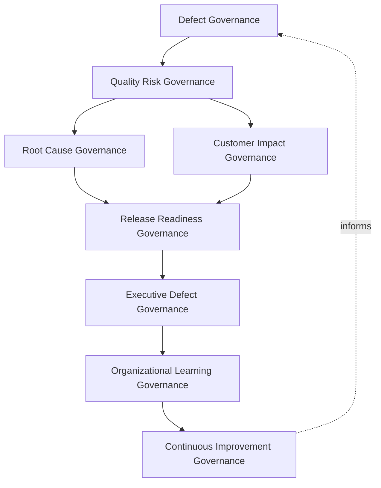
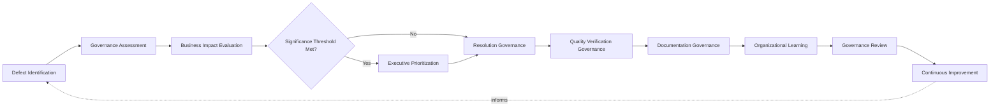
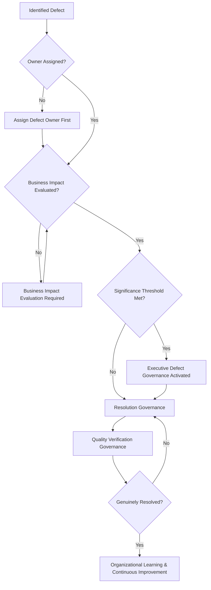
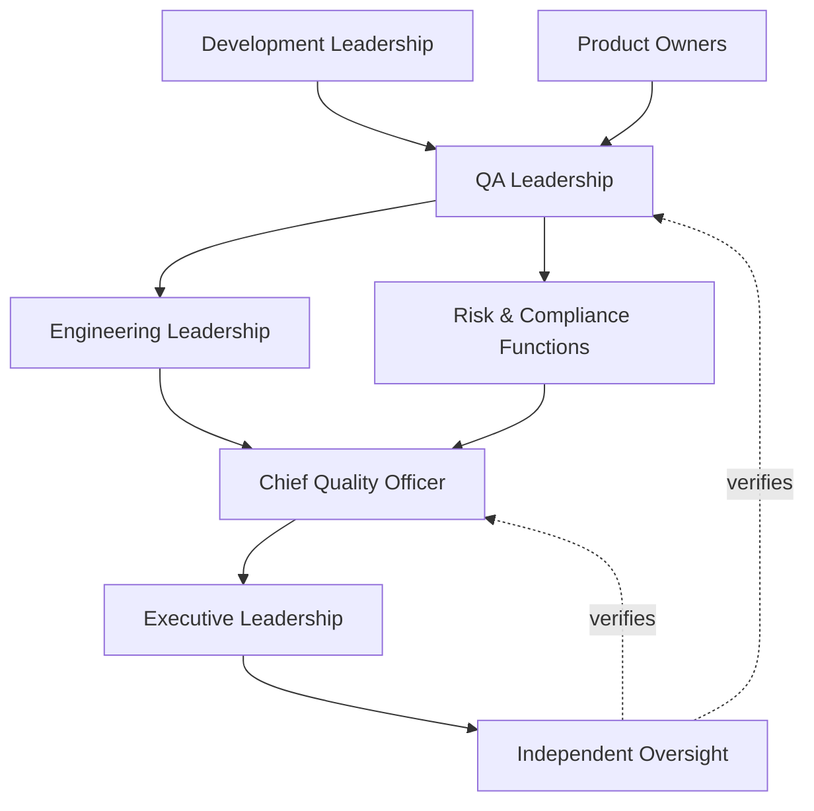
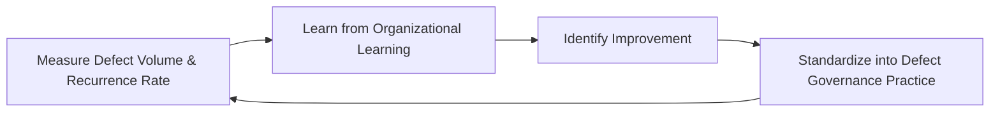
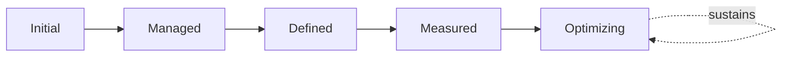

# Enterprise Defect Management Governance Framework

## 1. Document Purpose

This document defines the official Enterprise Defect Management Governance Framework for **StackLeo Tech Store** — the CQO/VP-of-Engineering-owned executive charter under which defect management, quality risk governance, defect ownership, and continuous quality improvement are governed as a deliberate, accountable discipline. It establishes governance for defect identification, quality risk, root cause accountability, release readiness, organizational accountability, executive oversight, and long-term defect management maturity across the StackLeo platform, consistent with ISTQB Advanced Level practice, IEEE 29119, ISO 9001, COBIT governance principles, and TOGAF enterprise architecture thinking.

`defect-management.md` remains the operational governance framework for defect management practice in this folder — the document that elaborates in full operational depth StackLeo's defect lifecycle, domains, and root cause analysis and CAPA practice. This document sits above it as the highest-level executive mandate, consistent with the executive-charter relationship `testing-governance.md`, `test-automation-governance.md`, and `quality-metrics-governance.md` hold over their respective operational documents: it does not restate defect resolution detail, it establishes the philosophy, organizational ownership, and executive expectations that give defect management practice its authority and coherence at the level of the Board and executive leadership. This framework governs *software* defects discovered through testing and QA practice specifically; where a quality issue escalates into a broader operational or business problem, accountability transfers to `09_OPERATIONS/problem-management-governance.md`, which this framework does not duplicate.

- **Purpose of Defect Management Governance** — to ensure every discovered quality issue at StackLeo is captured, understood, resolved, and genuinely learned from under consistent, accountable governance, rather than handled with rigor that varies by team, severity, or convenience.
- **Relationship with Testing Strategy** — defects enter this framework primarily from Test Execution and Defect Evaluation (`testing-strategy.md`, Sections 3.5–3.6); this framework governs what happens to a defect from that point through resolution, verification, and learning.
- **Relationship with Quality Assurance** — this framework operationalizes Prevention Over Detection from `quality-assurance-framework.md` (Section 2.2); a defect, once found, is the concrete evidence this framework converts into durable quality improvement rather than a recurring cost.
- **Relationship with Risk Management** — this framework connects defect severity and quality risk directly to `06_Security/enterprise-risk-management-strategy.md`, ensuring accepted defect risk is always a deliberate, governed decision rather than an unexamined gap.
- **Relationship with Software Delivery** — defect severity and trend data are a direct input to the release readiness decision governed by `release-quality-gates.md` and `07_DEVOPS/release-management.md`; this framework ensures unresolved defects are never silently carried into a release without an explicit, accountable decision.
- **Relationship with Executive Decision-Making** — this framework exists to give executive leadership genuine visibility into the quality risk the organization is knowingly carrying, a visibility that directly informs release, investment, and prioritization decisions.
- **Relationship with Continuous Improvement** — Root Cause Governance (Section 3.3) is the specific mechanism by which this framework ensures defects become genuine organizational learning, coordinated with `problem-management-governance.md` where a pattern of defects reveals a systemic operational cause.

This document is implementation-independent and vendor-neutral. It defines defect management governance philosophy, model, domains, and lifecycle conceptually — not specific issue tracking software, bug management tools, QA platforms, cloud providers, consulting firms, commercial products, defect workflows, bug triage meetings, issue resolution procedures, ticket configurations, infrastructure configurations, implementation roadmaps, or code.

## 2. Defect Management Philosophy

Defect management governance at StackLeo rests on eight principles. Each exists to produce a specific business outcome — defects are governed deliberately because each one is genuine evidence about the platform's real quality, not merely an inconvenience to be closed.

### 2.1 Every Defect is Organizational Learning

Every discovered defect is treated as genuine evidence about the platform, its engineering practice, or its process, not merely an item to be resolved and forgotten.

- **Business Value** — converts the cost of every defect into a durable investment in future quality, rather than a repeated, isolated expense.

### 2.2 Governance Before Resolution

The accountability structure — who owns a defect, who assesses its impact, who decides its priority — is established before resolution activity begins.

- **Business Value** — ensures resolution effort exists because a genuine, governed decision called for it, not as ad hoc reaction to whoever raised the loudest complaint.

### 2.3 Prevention Over Recurrence

Governance prioritizes understanding and eliminating a defect's underlying cause over simply closing the individual instance repeatedly.

- **Business Value** — the cost of preventing a recurring defect class is typically far lower than the cumulative cost of resolving the same defect again and again.

### 2.4 Accountability

Every defect traces to a specific, named, responsible owner from identification through verified closure.

- **Business Value** — ensures no defect is left to drift without someone genuinely responsible for its resolution.

### 2.5 Transparency

Defect status, severity, and resolution progress are documented and visible to those who genuinely need them.

- **Business Value** — allows the platform's true defect posture to be scrutinized and defended, rather than obscured.

### 2.6 Risk Awareness

The urgency and depth of defect governance are proportionate to genuine business, customer, and financial impact, consistent with `06_Security/enterprise-risk-management-strategy.md`.

- **Business Value** — directs finite resolution capacity toward the defects that genuinely matter most, rather than treating every defect identically.

### 2.7 Business Alignment

Defect governance decisions are made in service of genuine business priority, focusing resolution effort where quality risk matters most.

- **Business Value** — ensures limited resolution capacity is directed toward what genuinely matters most to the business and its customers.

### 2.8 Continuous Improvement

Defect management governance practice matures over time, informed by real defect trends and the organization's growth in scale and complexity.

- **Business Value** — keeps defect governance aligned with StackLeo's growth in scale, market reach, and operational complexity.

## 3. Enterprise Defect Governance Model

Defect management governance operates across eight conceptual layers, each holding accountability for a distinct dimension of how StackLeo governs quality issues. Every layer here is elaborated in full operational depth in `defect-management.md`.

### 3.1 Defect Governance

- **Purpose** — own the overall coherence of how the organization captures, classifies, and tracks every discovered defect.
- **Governance Scope** — oversight of Defect Identification and Logging (`defect-management.md`, Sections 3.1–3.2) across every domain in Section 4.
- **Business Value** — ensures every discovered defect enters a single, coherent governance discipline, not disconnected local tracking.
- **Executive Expectations** — leadership trusts no discovered defect exists outside this framework's visibility.

### 3.2 Quality Risk Governance

- **Purpose** — own the coherence of how a defect's genuine business, customer, and financial risk is assessed.
- **Governance Scope** — oversight of Prioritization (`defect-management.md`, Section 3.4), grounded in Risk Awareness (Section 2.6).
- **Business Value** — ensures resolution urgency genuinely reflects potential consequence, not assumption.
- **Executive Expectations** — leadership trusts high-risk defects are never under-prioritized relative to their consequence.

### 3.3 Root Cause Governance

- **Purpose** — own the coherence of how investigation is held accountable for reaching a genuinely substantiated underlying cause.
- **Governance Scope** — oversight of Root Cause Analysis and CAPA (`defect-management.md`, Section 5), coordinated with `09_OPERATIONS/problem-management-governance.md` where a systemic operational cause is revealed.
- **Business Value** — ensures the cause finally addressed is the genuine one, preventing recurrence of the same defect class.
- **Executive Expectations** — leadership trusts root cause conclusions are genuinely substantiated, not merely asserted.

### 3.4 Release Readiness Governance

- **Purpose** — own the coherence of how accumulated defect evidence supports the decision that a capability is genuinely ready for release.
- **Governance Scope** — oversight coordinated with `release-quality-gates.md` and Release Quality Metrics (`quality-metrics-governance.md`, Section 4.4).
- **Business Value** — ensures no defect is silently carried into a release without an explicit, accountable decision.
- **Executive Expectations** — leadership trusts release readiness criteria are never silently bypassed under schedule pressure.

### 3.5 Customer Impact Governance

- **Purpose** — own the coherence of how a defect's genuine effect on the customer experience is understood and weighed.
- **Governance Scope** — oversight applying Customer Experience Defects (Section 4.9) across every domain in Section 4.
- **Business Value** — ensures defect governance genuinely reflects the customer's actual experience, not only internal severity classification.
- **Executive Expectations** — leadership expects customer impact to be a genuine, weighted input to prioritization decisions.

### 3.6 Executive Defect Governance

- **Purpose** — own executive-level accountability for the defects carrying the greatest organizational consequence.
- **Governance Scope** — oversight spanning Sections 3.1–3.5 and 3.7 wherever a defect rises to genuine executive concern.
- **Business Value** — ensures the most consequential quality risk is visible at the level accountable for the organization as a whole.
- **Executive Expectations** — leadership expects to be informed of, not surprised by, the organization's most significant accepted defect risk.

### 3.7 Organizational Learning Governance

- **Purpose** — own the coherence of how the organization converts resolved defects into durable, shared organizational learning.
- **Governance Scope** — oversight of Post-Incident Learning (`defect-management.md`, Section 3.9) across every domain in Section 4.
- **Business Value** — ensures a resolved defect strengthens the organization's broader capability, not only the specific area affected.
- **Executive Expectations** — leadership expects every significant defect to produce a documented, attributable lesson.

### 3.8 Continuous Improvement Governance

- **Purpose** — govern the mechanism by which every other layer in this model matures over time.
- **Governance Scope** — consolidates findings from defect trends, root cause outcomes, and audits across every domain in Section 4.
- **Business Value** — prevents defect governance itself from becoming the next thing that quietly stagnates as the organization scales.
- **Executive Expectations** — leadership expects defect management maturity to be assessed periodically, not assumed static once established.

### Enterprise Defect Governance Matrix

| Layer | Purpose | Business Value | Executive Expectations |
|---|---|---|---|
| Defect Governance | Own coherence of capturing, classifying, tracking defects | Ensures every defect enters a single, coherent discipline | Trusts no discovered defect exists outside this framework |
| Quality Risk Governance | Own coherence of assessing genuine business risk | Ensures urgency genuinely reflects potential consequence | Trusts high-risk defects are never under-prioritized |
| Root Cause Governance | Own coherence of holding investigation accountable | Ensures the genuine cause is addressed, preventing recurrence | Trusts conclusions are genuinely substantiated |
| Release Readiness Governance | Own coherence of using evidence to support release decisions | Ensures no defect is silently carried into a release | Trusts readiness criteria are never silently bypassed |
| Customer Impact Governance | Own coherence of weighing genuine customer effect | Ensures governance reflects genuine customer experience | Expects customer impact to be a genuine, weighted input |
| Executive Defect Governance | Own executive accountability for highest-consequence defects | Ensures the most consequential risk is visible to leadership | Expects leadership informed of, not surprised by, accepted risk |
| Organizational Learning Governance | Own coherence of converting resolution into shared learning | Strengthens the organization's broader capability | Expects every significant defect to produce a documented lesson |
| Continuous Improvement Governance | Govern maturation of every other layer | Prevents defect governance itself from stagnating | Expects maturity to be assessed periodically |

*Diagram 1: Enterprise Defect Governance Framework — defect governance feeds quality risk governance, branching into root cause and customer impact governance, converging on release readiness governance, resolving into executive oversight and organizational learning that feeds continuous improvement back into the model.*

## 4. Enterprise Defect Domains

Defect management governance is exercised across ten conceptual domains, each requiring a distinct governance emphasis. Every domain here is elaborated in full operational depth in `defect-management.md`.

### 4.1 Functional Defects

- **Purpose** — govern defects where the platform fails to behave according to specified business logic.
- **Governance Considerations** — governed under Defect Governance (Section 3.1), required without exception for every functional requirement.
- **Business Importance** — protects the most directly customer-visible and revenue-affecting form of correctness.
- **Executive Expectations** — leadership expects functional defects affecting the critical path to receive the highest resolution priority.

### 4.2 Integration Defects

- **Purpose** — govern defects arising at the interface between components or with external integrations.
- **Governance Considerations** — governed under Root Cause Governance (Section 3.3), given their tendency to mask deeper systemic causes.
- **Business Importance** — protects against the class of defect that isolated component testing structurally cannot catch.
- **Executive Expectations** — leadership expects integration defects to be investigated for genuine boundary-assumption causes, not only symptomatically patched.

### 4.3 Performance Defects

- **Purpose** — govern defects where the platform fails to respond predictably within acceptable bounds.
- **Governance Considerations** — governed under Quality Risk Governance (Section 3.2), given direct sensitivity to conversion and trust.
- **Business Importance** — protects conversion and customer trust, both highly sensitive to responsiveness.
- **Executive Expectations** — leadership expects performance defects affecting critical-path capability to be release-blocking.

### 4.4 Security Defects

- **Purpose** — govern defects affecting the platform's protection of confidentiality, integrity, and availability.
- **Governance Considerations** — governed jointly with, and never superseding, `06_Security/vulnerability-management.md` and `06_Security/incident-response.md`, which remain authoritative for security-specific obligations.
- **Business Importance** — protects StackLeo's core trust differentiator per `01_Business/vision.md`.
- **Executive Expectations** — leadership expects security defects to be governed with mandatory, non-negotiable urgency, never treated as a routine defect.

### 4.5 Usability Defects

- **Purpose** — govern defects where the platform is genuinely confusing or unsatisfying for customers to use.
- **Governance Considerations** — governed under Customer Impact Governance (Section 3.5), grounded in genuine customer behavior.
- **Business Importance** — protects the customer experience that directly influences conversion and repeat use.
- **Executive Expectations** — leadership expects usability defects to be weighed alongside functional defects, not subordinated to them.

### 4.6 Accessibility Defects

- **Purpose** — govern defects that prevent customers from using the platform regardless of ability.
- **Governance Considerations** — governed under Defect Governance (Section 3.1), release-blocking for customer-facing capability.
- **Business Importance** — protects StackLeo's addressable market and the inclusive standard implied by the brand vision.
- **Executive Expectations** — leadership expects accessibility defects to be treated as release-blocking, not discretionary.

### 4.7 Compliance Defects

- **Purpose** — govern defects carrying a genuine regulatory or contractual obligation dimension.
- **Governance Considerations** — governed under Executive Defect Governance (Section 3.6), coordinated with `06_Security/compliance-governance.md`.
- **Business Importance** — protects the business's standing with regulators and its contractual counterparties.
- **Executive Expectations** — leadership expects compliance defects to be escalated immediately, without exception.

### 4.8 Operational Defects

- **Purpose** — govern defects affecting the platform's ability to be operated, supported, and monitored once live.
- **Governance Considerations** — governed under Release Readiness Governance (Section 3.4), coordinated with `09_OPERATIONS/operational-excellence-framework.md`.
- **Business Importance** — determines whether the business can sustain a capability once customers depend on it.
- **Executive Expectations** — leadership expects operational defects to be resolved before, not discovered after, customer exposure.

### 4.9 Customer Experience Defects

- **Purpose** — govern defects whose primary impact is the customer's overall experience of the platform, spanning multiple technical categories.
- **Governance Considerations** — governed under Customer Impact Governance (Section 3.5), grounded in genuine customer feedback.
- **Business Importance** — protects the trust relationship every customer interaction depends on.
- **Executive Expectations** — leadership expects customer experience defects to be prioritized in proportion to genuine, cumulative impact.

### 4.10 Enterprise Quality Risks

- **Purpose** — govern the aggregated defect risk the organization is knowingly carrying across the platform as a whole.
- **Governance Considerations** — governed exclusively under Executive Defect Governance (Section 3.6).
- **Business Importance** — protects leadership's ability to understand overall accepted quality risk, not only defect by defect.
- **Executive Expectations** — leadership expects one coherent picture of enterprise quality risk, not ten disconnected domain reports.

### Enterprise Defect Domain Matrix

| Domain | Purpose | Business Importance | Executive Expectations |
|---|---|---|---|
| Functional Defects | Govern defects failing specified business logic | Protects the most customer-visible correctness | Critical-path defects receive the highest resolution priority |
| Integration Defects | Govern defects at component or external interfaces | Protects against boundary-assumption defects other testing cannot catch | Investigated for genuine cause, not only symptomatically patched |
| Performance Defects | Govern defects failing predictable response | Protects conversion and customer trust | Critical-path performance defects are release-blocking |
| Security Defects | Govern defects affecting data protection | Protects StackLeo's core trust differentiator | Governed with mandatory, non-negotiable urgency |
| Usability Defects | Govern defects genuinely confusing to customers | Protects the experience driving conversion and repeat use | Weighed alongside functional defects, not subordinated |
| Accessibility Defects | Govern defects preventing use regardless of ability | Protects addressable market and brand commitment | Treated as release-blocking, not discretionary |
| Compliance Defects | Govern defects with regulatory or contractual dimension | Protects standing with regulators and counterparties | Escalated immediately, without exception |
| Operational Defects | Govern defects affecting operability and support | Determines sustainability once customers depend on it | Resolved before, not discovered after, customer exposure |
| Customer Experience Defects | Govern defects affecting overall customer experience | Protects the trust relationship every interaction depends on | Prioritized in proportion to genuine, cumulative impact |
| Enterprise Quality Risks | Govern aggregated accepted defect risk platform-wide | Protects leadership's ability to understand overall risk | Expects one coherent picture, not ten disconnected reports |

## 5. Enterprise Defect Lifecycle

Defect management governance operates across ten conceptual lifecycle stages, applicable across every domain in Section 4.

### 5.1 Defect Identification

- **Purpose** — govern how a genuine defect is recognized and distinguished from expected or intended behavior.
- **Governance Objectives** — apply Defect Governance (Section 3.1) to ensure every genuine defect is captured consistently.
- **Business Value** — enables governance to begin as early as possible, before a defect's impact compounds.

### 5.2 Governance Assessment

- **Purpose** — govern how an identified defect is assessed for genuine scope and severity before resolution is authorized.
- **Governance Objectives** — apply Governance Before Resolution (Section 2.2) consistently before resolution effort is committed.
- **Business Value** — ensures resolution effort is authorized deliberately, not reflexively for every reported issue.

### 5.3 Business Impact Evaluation

- **Purpose** — govern how a defect's genuine business, customer, and financial impact is evaluated.
- **Governance Objectives** — apply Quality Risk Governance (Section 3.2), grounded in Risk Awareness (Section 2.6).
- **Business Value** — ensures resolution urgency genuinely reflects potential consequence, not assumption.

### 5.4 Executive Prioritization

- **Purpose** — govern the point at which a defect's scope or consequence requires executive-level prioritization decisions.
- **Governance Objectives** — apply Executive Defect Governance (Section 3.6) against clearly understood significance thresholds.
- **Business Value** — ensures leadership is engaged exactly when genuinely warranted, directing resolution investment deliberately.

### 5.5 Resolution Governance

- **Purpose** — govern how a prioritized defect is carried through to genuine resolution.
- **Governance Objectives** — apply Root Cause Governance (Section 3.3), consistent with Prevention Over Recurrence (Section 2.3).
- **Business Value** — ensures resolution addresses the genuine cause, not merely the visible symptom.

### 5.6 Quality Verification Governance

- **Purpose** — govern how a resolved defect is confirmed genuinely fixed before closure.
- **Governance Objectives** — coordinate with Quality Verification Governance (`quality-assurance-framework.md`, Section 5.3) to ensure trustworthy confirmation.
- **Business Value** — prevents premature closure of a defect that has not actually been resolved.

### 5.7 Documentation Governance

- **Purpose** — govern the completeness and integrity of the defect record itself.
- **Governance Objectives** — require documentation to remain consistent with `defect-management.md` as it evolves.
- **Business Value** — ensures the organization retains a genuine, trustworthy record of what was found and how it was resolved.

### 5.8 Organizational Learning

- **Purpose** — formally capture what a resolved defect reveals about defect management governance itself.
- **Governance Objectives** — apply Organizational Learning Governance (Section 3.7), requiring lessons to be documented and attributed.
- **Business Value** — ensures the organization genuinely learns from experience rather than repeating the same defect class.

### 5.9 Governance Review

- **Purpose** — formally reassess whether a resolved defect's governance was handled appropriately.
- **Governance Objectives** — apply Continuous Improvement Governance (Section 3.8) to every defect meeting a defined significance threshold.
- **Business Value** — ensures defect governance itself is genuinely scrutinized, not assumed correct by default.

### 5.10 Continuous Improvement

- **Purpose** — apply accumulated lessons to strengthen future defect management governance.
- **Governance Objectives** — require findings to be genuinely analyzed for recurring patterns, consistent with Section 3.8.
- **Business Value** — turns each defect into an input that makes future defect governance genuinely stronger.

### Enterprise Defect Lifecycle Matrix

| Stage | Purpose | Governance Objective | Business Value |
|---|---|---|---|
| Defect Identification | Recognize a genuine defect distinct from intended behavior | Ensures every genuine defect is captured consistently | Enables governance to begin before impact compounds |
| Governance Assessment | Assess scope and severity before resolution is authorized | Applied consistently before resolution effort is committed | Ensures resolution is authorized deliberately |
| Business Impact Evaluation | Evaluate genuine business, customer, financial impact | Grounded in risk awareness | Ensures urgency genuinely reflects potential consequence |
| Executive Prioritization | Elevate defects requiring executive-level decisions | Applied against clear significance thresholds | Directs resolution investment deliberately |
| Resolution Governance | Carry a prioritized defect through to genuine resolution | Consistent with prevention over recurrence | Ensures resolution addresses genuine cause, not symptom |
| Quality Verification Governance | Confirm a resolved defect is genuinely fixed | Coordinated with quality verification governance | Prevents premature closure of an unresolved defect |
| Documentation Governance | Maintain completeness and integrity of the record | Kept consistent with subordinate documentation | Retains a genuine, trustworthy record |
| Organizational Learning | Capture governance implications from resolution | Documented and attributed to specific implications | Ensures genuine learning rather than repeated defects |
| Governance Review | Reassess whether governance was handled appropriately | Applied to every defect meeting a significance threshold | Ensures governance itself is genuinely scrutinized |
| Continuous Improvement | Apply lessons to strengthen future governance | Findings genuinely analyzed for recurring patterns | Makes future defect governance genuinely stronger |

*Diagram 2: Enterprise Defect Lifecycle — identification and governance assessment inform business impact evaluation, escalating to executive prioritization only where thresholds are met before resolution and quality verification governance, with documentation, organizational learning, and governance review feeding continuous improvement back into the cycle.*

## 6. Defect Management Principles

- **Accountability** — every defect traces to a specific, named, responsible owner, consistent with Section 2.4.
- **Transparency** — defect status, severity, and resolution are documented and visible to those who need them, consistent with Section 2.5.
- **Traceability** — every defect traces to the specific requirement, test, or customer report that surfaced it.
- **Risk Awareness** — governance urgency is proportionate to genuine business, customer, and financial impact, consistent with Section 2.6.
- **Customer Focus** — defect prioritization considers genuine customer impact, not only internal severity classification.
- **Prevention** — governance prioritizes eliminating a defect's underlying cause over repeatedly resolving symptoms, consistent with Section 2.3.
- **Organizational Learning** — every defect deepens the organization's genuine future readiness, consistent with Section 2.1.
- **Continuous Improvement** — governance practice matures over time, informed by real defect trends.

### Defect Management Principles Matrix

| Principle | Description | Business Value |
|---|---|---|
| Accountability | Every defect traces to a specific, named, responsible owner | Ensures no defect drifts without genuine ownership |
| Transparency | Status, severity, and resolution documented and visible | Allows true defect posture to be scrutinized and defended |
| Traceability | Every defect traces to the requirement, test, or report that surfaced it | Supports accountability, audit, and impact analysis |
| Risk Awareness | Urgency proportionate to genuine business, customer, financial impact | Directs finite resolution capacity toward what matters most |
| Customer Focus | Prioritization considers genuine customer impact | Protects the trust relationship every defect places at risk |
| Prevention | Prioritizes eliminating cause over repeatedly resolving symptoms | Reduces the cumulative cost of recurring defect classes |
| Organizational Learning | Each defect deepens genuine future readiness | Converts defect cost into durable resilience investment |
| Continuous Improvement | Practice matures from real defect trends | Keeps governance aligned with organizational growth |

*Diagram 4: Enterprise Defect Governance Decision Flow — an identified defect is checked for assigned ownership and evaluated business impact, with executive governance activated upon meeting significance thresholds, resolving into resolution and quality verification governance that confirms genuine resolution before continuous improvement.*

## 7. Ownership & Accountability

Governance authority for defect management is distributed deliberately across eight accountable functions, defined here at the governance-objective level, without prescribing specific operational defect resolution responsibilities.

### 7.1 Executive Leadership

- **Governance Objective** — the Board and executive leadership hold ultimate accountability for the organization's genuine defect and quality risk posture.
- **Business Value** — provides a single point of ultimate accountability for whether defect governance is genuinely functioning as intended.

### 7.2 Chief Quality Officer

- **Governance Objective** — the Chief Quality Officer owns the coherence and enforcement of this framework across every domain, layer, and stage it defines.
- **Business Value** — provides a single point of specialist accountability for whether defect management governance is genuinely functioning as intended.

### 7.3 Engineering Leadership

- **Governance Objective** — engineering leadership owns Root Cause Governance (Section 3.3) within the capability their teams build.
- **Business Value** — ensures root cause investigation is genuinely substantiated, not superficial.

### 7.4 QA Leadership

- **Governance Objective** — QA leadership owns Defect and Quality Risk Governance (Sections 3.1–3.2) in coordination with `defect-management.md` and `testing-governance.md`.
- **Business Value** — provides a single point of specialist accountability for the framework's coherence.

### 7.5 Product Owners

- **Governance Objective** — product owners own Customer Impact Governance (Section 3.5) for their assigned capability.
- **Business Value** — ensures genuine customer impact is represented directly in prioritization decisions.

### 7.6 Development Leadership

- **Governance Objective** — development leadership owns Resolution Governance (Section 5.5) within their assigned capability.
- **Business Value** — embeds resolution accountability closest to where a defect is actually fixed.

### 7.7 Risk & Compliance Functions

- **Governance Objective** — risk and compliance functions ensure Compliance Defects (Section 4.7) and accepted defect risk remain aligned to `06_Security/enterprise-risk-management-strategy.md` and `06_Security/compliance-governance.md`.
- **Business Value** — ensures defect governance remains a genuine response to assessed risk and obligation, not a disconnected parallel exercise.

### 7.8 Independent Oversight

- **Governance Objective** — an independent function, separate from those who design and operate defect governance, periodically verifies its overall effectiveness.
- **Business Value** — prevents governance from being assumed effective on the word of the same function responsible for running it.

### Ownership & Accountability Matrix

| Role | Governance Objective | Business Value |
|---|---|---|
| Executive Leadership | Hold ultimate accountability for genuine defect and quality risk posture | Provides a single point of ultimate accountability |
| Chief Quality Officer | Own coherence and enforcement of this framework | Provides a single point of specialist accountability |
| Engineering Leadership | Own root cause governance within capability their teams build | Ensures root cause investigation is genuinely substantiated |
| QA Leadership | Own defect and quality risk governance | Provides specialist accountability for the framework's coherence |
| Product Owners | Own customer impact governance for their assigned capability | Ensures genuine customer impact informs prioritization |
| Development Leadership | Own resolution governance within their assigned capability | Embeds resolution accountability closest to where fixes happen |
| Risk & Compliance Functions | Ensure compliance defects and accepted risk remain aligned | Keeps governance a genuine response to assessed risk and obligation |
| Independent Oversight | Independently verify overall governance effectiveness | Prevents self-assessed assumption of effectiveness |

*Diagram 3: Defect Ownership & Accountability Model — accountability flows from development leadership and product owners through QA leadership, engineering leadership, and risk and compliance functions into the Chief Quality Officer, converging on executive leadership verified by independent oversight.*

## 8. Executive Oversight

- **Executive Defect Reviews** — the overall coherence of defect management governance is formally reviewed on a regular cadence, consistent with `qa-governance.md` (Section 8).
- **Enterprise Quality Reporting** — aggregated defect health — open defects, severity trends, accepted risk — is reported to executive leadership and the Board, coordinated with `quality-metrics-governance.md`.
- **Governance Reviews** — the governance model, domains, and lifecycle defined in this framework (Sections 3–7) are periodically reassessed for continued fitness.
- **Release Readiness Oversight** — the organization's readiness to activate Release Readiness Governance (Section 3.4) is reviewed directly with executive leadership.
- **Documentation Governance** — this framework's relationship to `defect-management.md`, `testing-governance.md`, and `quality-metrics-governance.md` is kept current as those documents evolve.
- **Organizational Readiness** — defect decisions, evidence, and outcomes are maintained in a state ready for internal or external audit at any time, coordinated with `06_Security/audit-governance.md`.

### Executive Oversight Matrix

| Oversight Mechanism | Purpose | Governance Role |
|---|---|---|
| Executive Defect Reviews | Confirm overall defect governance coherence | Regular, predictable cadence for the framework as a whole |
| Enterprise Quality Reporting | Provide leadership a single, coherent defect picture | Reports open defects, severity trends, accepted risk |
| Governance Reviews | Reassess the governance model itself for continued fitness | Applies to Sections 3–7 of this framework |
| Release Readiness Oversight | Review readiness to activate release readiness governance | Direct executive-level review of release decision rigor |
| Documentation Governance | Keep this framework's subordinate relationships current | Updated as related documents evolve |
| Organizational Readiness | Maintain decisions and evidence ready for independent review | Continuous state, coordinated with audit governance |

### Governance Responsibility Matrix

| Role | Responsibility |
|---|---|
| Executive Leadership | Owns ultimate accountability for the organization's genuine defect and quality risk posture. |
| Chief Quality Officer | Owns coherence and enforcement of this framework, in partnership with executive leadership. |
| Defect Management Governance Lead | Owns the operational defect model within `defect-management.md`. |
| Engineering Leadership | Owns root cause governance within capability their teams build. |
| QA Leadership | Owns defect and quality risk governance. |
| Product Owners | Own customer impact governance for their assigned capability. |
| Development Leadership | Own resolution governance within their assigned capability. |
| Risk & Compliance Functions | Ensure compliance defects and accepted risk remain aligned to enterprise standards. |
| Independent Oversight | Independently verifies the overall effectiveness of this framework. |

## 9. Future Readiness

This framework is designed to remain valid as StackLeo evolves in scale, geography, and organizational complexity, without requiring redefinition of its underlying philosophy.

- **AI-Assisted Defect Governance** — as defect classification and prioritization increasingly incorporate AI-assisted analysis, they remain governed under Defect Governance and Quality Risk Governance (Sections 3.1–3.2) at the same rigor as any other method.
- **Predictive Quality Intelligence** — where the organization develops the capability to anticipate a defect class before it fully materializes, that capability is governed as an extension of Business Impact Evaluation (Section 5.3), not a separate discipline.
- **Enterprise Scale** — the governance model, domains, and lifecycle defined throughout this framework are defined independently of organizational size, so they remain coherent as StackLeo's operational complexity grows substantially.
- **Global Expansion** — Governance Assessment and Executive Prioritization (Sections 5.2, 5.4) are structured to be re-applied as StackLeo expands from Bangladesh into South Asia and global markets, each with genuinely distinct defect considerations.
- **Intelligent Defect Analysis** — where root cause investigation increasingly draws on intelligent pattern analysis across defect history, that analysis remains subject to the same Root Cause Governance (Section 3.3) as any other investigative method.
- **Autonomous Quality Insights (conceptual only)** — where automation increasingly performs steps within defect identification or classification, that automation remains subject to the same ownership and executive oversight as any human-performed activity.
- **Digital Governance Platforms** — this framework's governance discipline is treated as a direct contributor to the digital trust customers, partners, and regulators extend to StackLeo, not merely an internal engineering exercise.
- **Future Engineering Organizations** — Continuous Improvement Governance (Section 3.8) is structured to absorb genuinely new engineering organizational models — additional sales channels, multi-vendor operations, distributed teams — without requiring this framework to be rewritten.

## 10. Defect Management Maturity Model

Defect management governance maturity is described across five conceptual levels, consistent with ISO 9001 and established process maturity thinking.

- **Initial** — defect governance, where it exists, is informal and inconsistent; defects are handled reactively, and ownership is unclear.
- **Managed** — basic defect governance exists for individual domains, but consistency across the ten domains in Section 4 varies significantly.
- **Defined** — the governance model, domains, and lifecycle are standardized, documented, and consistently applied across the organization, consistent with the model defined throughout this framework.
- **Measured** — defect volume, resolution time, and recurrence rate are measured systematically, and decisions are grounded in genuine evidence rather than qualitative impression alone.
- **Optimizing** — defect management governance is continuously and deliberately improved based on quantitative evidence and organizational learning; improvement itself is a managed, ongoing discipline rather than an occasional initiative.

### Defect Management Maturity Model Matrix

| Level | Characteristics | Primary Focus |
|---|---|---|
| Initial | Informal, inconsistent governance; defects handled reactively | Ad hoc, individually-dependent defect practice |
| Managed | Basic governance exists per domain; consistency varies | Domain-level consistency |
| Defined | Standardized governance model, domains, and lifecycle | Organization-wide consistency and clear ownership |
| Measured | Volume, resolution time, recurrence rate measured systematically | Evidence-based defect governance decisions |
| Optimizing | Practice continuously and deliberately improved from evidence | Sustained, deliberate improvement as a discipline |

*Diagram 5: Continuous Defect Improvement Cycle — defect outcomes are measured, learned from, improved upon, and standardized back into governed practice, on a continuing basis.*

*Diagram 6: Defect Management Maturity Progression Model — maturity advances from informal, reactively-handled defect practice toward standardized, measured, and continuously optimized defect management governance.*

## 11. Anti-Patterns

The following recurring failure patterns are explicitly recognized and avoided, as each one structurally undermines this framework.

### Anti-Pattern Summary

| Anti-Pattern | Why It's Avoided |
|---|---|
| Defects Without Governance | Contradicts Governance Before Resolution (Section 2.2); defects resolved without genuine governance leave no accountable record of what was found or why it mattered. |
| Undefined Defect Ownership | Contradicts Accountability (Section 2.4); a defect with no accountable owner has no one genuinely responsible for its resolution. |
| Weak Executive Visibility | Contradicts Enterprise Quality Reporting (Section 8); leadership cannot govern quality risk it is never shown. |
| Poor Documentation | Undermines Documentation Governance (Sections 5.7, 8) and Transparency (Section 2.5), leaving defect decisions unclear or unverifiable after the fact. |
| Reactive Defect Handling | Contradicts Governance Before Resolution (Section 2.2); resolving defects only under pressure leaves prioritization inconsistent and evaluation shallow. |
| Recurring Quality Issues | Contradicts Prevention Over Recurrence (Section 2.3); the same defect class resurfacing repeatedly signals root cause investigation is not genuinely reaching the underlying cause. |
| Siloed Defect Knowledge | Contradicts Organizational Learning (Section 2.1) and Organizational Learning Governance (Section 3.7); defect learning held only by the individuals who resolved it cannot prevent others from repeating the same investigation. |
| Missing Continuous Improvement | Contradicts Continuous Improvement (Sections 2.8, 3.8); without deliberate improvement, defect governance stagnates as the organization and its risk landscape grow. |

## 12. Document Information

| Property | Value |
|----------|-------|
| Document | defect-management-governance.md |
| Version | 1.0.0 |
| Status | Active |
| Maintained By | StackLeo |
| Last Updated | 2026-07-24 |

---

© StackLeo. All Rights Reserved.
