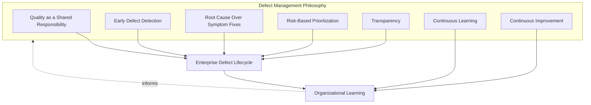
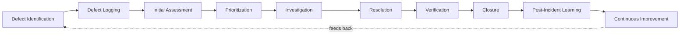
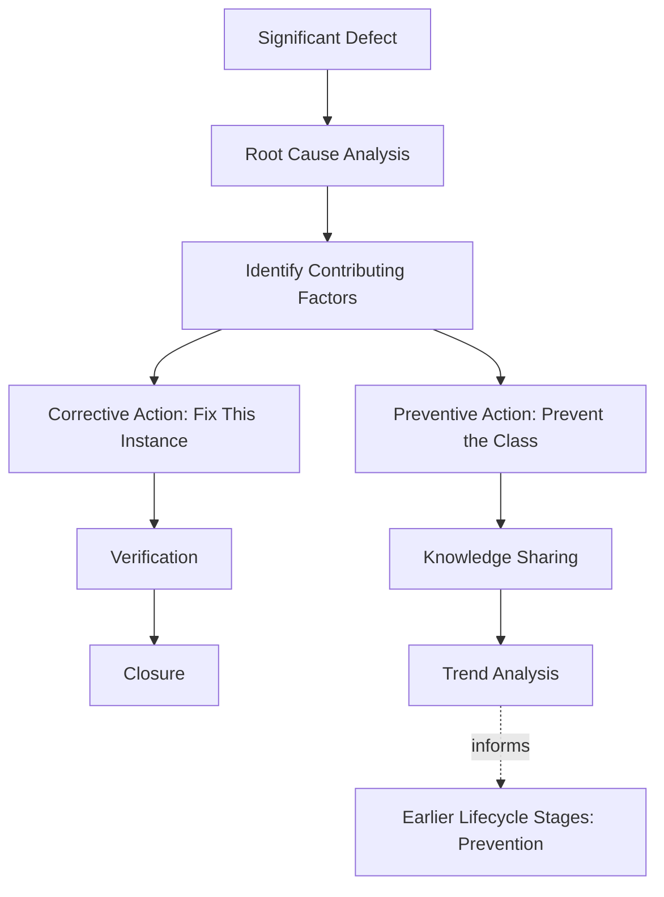
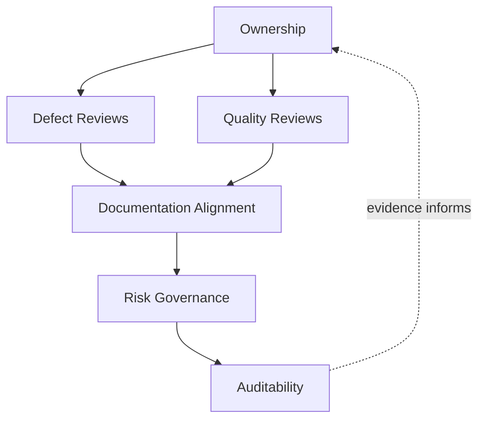
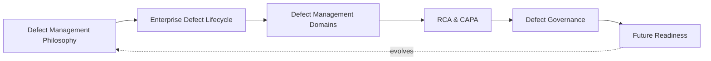
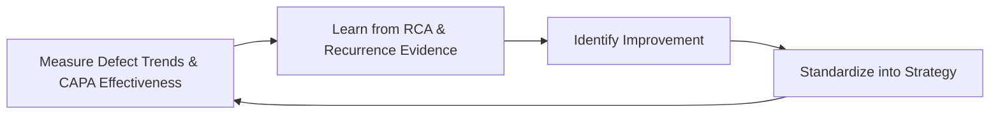

# Enterprise Defect Management & Quality Issue Governance Strategy

## 1. Document Purpose

This document defines the official Enterprise Defect Management & Quality Issue Governance Strategy for **StackLeo Tech Store**. It establishes defect governance, the defect lifecycle, root cause analysis and corrective/preventive action practice, and long-term defect intelligence maturity across the platform — independent of any specific issue tracking system, ALM platform, or workflow tool.

- **Purpose of Defect Management** — defect management exists to ensure every discovered quality issue is captured, understood, resolved, and learned from consistently, converting Defect Evaluation (`testing-strategy.md`, Section 3.6) from an isolated activity into a governed, continuously improving discipline.
- **Relationship with Quality Strategy** — this document operationalizes Prevention Over Detection and Continuous Improvement from `quality-strategy.md` (Sections 2.3, 2.5); defects, once found, are the concrete input this strategy exists to convert into durable quality improvement rather than a recurring cost.
- **Relationship with Testing Strategy** — defects enter this strategy primarily from Test Execution and Defect Evaluation in `testing-strategy.md` (Sections 3.5–3.6); this document defines what happens to a defect once testing has identified it, through resolution, verification, and learning.
- **Relationship with Release Management** — defect severity and trend data are a direct input to the release readiness decision governed by `07_DEVOPS/release-management.md`; unresolved or unassessed defects are never silently carried into a release without an explicit, accountable decision.
- **Relationship with Engineering Excellence** — how defects are investigated and resolved is a direct reflection of engineering discipline, consistent with Engineering Excellence in `quality-strategy.md` (Section 2.6); this strategy exists to make that discipline consistent rather than dependent on individual initiative.
- **Relationship with Continuous Improvement** — Root Cause Analysis and CAPA (Section 5) are the specific mechanism by which defects become organizational learning rather than isolated, repeatedly recurring events, directly extending the Continuous Improvement principle shared across `quality-strategy.md` and `testing-strategy.md`.

This document is implementation-independent and vendor-neutral. It defines defect management philosophy, lifecycle, domains, and governance — not specific issue tracking software, ALM platforms, ticketing systems, severity thresholds, or workflow implementations.

## 2. Defect Management Philosophy

Defect management at StackLeo is governed by seven principles. Each exists to produce a specific business outcome — defects are managed deliberately because of the trust, cost, and learning at stake, not as routine administrative processing.

### 2.1 Quality as a Shared Responsibility

Responding to and resolving defects is owned jointly by Engineering, QA, Product, and Operations; no single function is solely responsible for a quality issue once it is found, consistent with `quality-strategy.md` (Section 2.7).

- **Business Value** — prevents the anti-pattern in Section 9.7, where a defect stalls because no one is clearly accountable for seeing it through to resolution.

### 2.2 Early Defect Detection

Defects are sought and identified as early in the lifecycle as possible, consistent with Shift-Left Testing (`testing-strategy.md`, Section 2.1).

- **Business Value** — a defect found early costs a fraction of one found in production, both in remediation effort and in customer or business impact.

### 2.3 Root Cause Over Symptom Fixes

Resolution addresses the underlying cause of a defect, not merely its observed symptom, consistent with Root Cause Analysis (Section 5).

- **Business Value** — prevents the same underlying issue from resurfacing repeatedly in different forms, which is a materially more expensive outcome than resolving it once, correctly.

### 2.4 Risk-Based Prioritization

Defect priority is determined by genuine business, customer, and financial impact, consistent with Risk-Based Testing (`testing-strategy.md`, Section 2.3), not by convenience, visibility, or order of discovery.

- **Business Value** — ensures limited engineering capacity is directed toward the defects that matter most to the business, rather than distributed evenly regardless of consequence.

### 2.5 Transparency

Defect status, severity, and resolution progress are visible to relevant stakeholders, not held privately within the team investigating them.

- **Business Value** — allows Product, Release Management, and Leadership to make informed decisions about scope, timing, and risk acceptance without being surprised late.

### 2.6 Continuous Learning

Every defect, regardless of severity, is treated as a potential source of organizational learning about how the platform, process, or practice can improve.

- **Business Value** — converts the cost already incurred by a defect into a durable asset — improved future practice — rather than a pure loss.

### 2.7 Continuous Improvement

Defect management practice itself matures over time, informed by defect trends, RCA findings, and the effectiveness of past corrective action.

- **Business Value** — ensures defect management becomes more effective over time rather than repeating the same handling patterns indefinitely as the platform grows.

*Diagram 1: Defect Management Philosophy Overview — the seven principles shape the defect lifecycle, and organizational learning feeds back into the philosophy itself.*

## 3. Enterprise Defect Lifecycle

Defect management is governed across ten conceptual stages, spanning from initial identification through post-incident learning and continuous improvement.

### 3.1 Defect Identification

- **Purpose** — recognize that observed platform behavior deviates from its expected or specified behavior.
- **Business Value** — is the necessary first step for every subsequent stage; a defect that is never identified can never be resolved.
- **Governance Objectives** — ensure identification can originate from any source — testing, engineering, customer report, or operational observation — without artificial barriers to reporting.

### 3.2 Defect Logging

- **Purpose** — capture the identified defect in a consistent, complete, and traceable record.
- **Business Value** — preserves the evidence and context necessary for effective investigation and resolution, especially when addressed later or by someone other than the reporter.
- **Governance Objectives** — require a consistent minimum set of information for every logged defect, regardless of its eventual severity.

### 3.3 Initial Assessment

- **Purpose** — perform a first-pass evaluation of the defect's validity, severity, and likely business impact.
- **Business Value** — filters and orients incoming defects quickly, preventing investigation effort from being spent before basic validity is confirmed.
- **Governance Objectives** — ensure every logged defect receives an initial assessment within a defined, consistent expectation, not left unattended indefinitely.

### 3.4 Prioritization

- **Purpose** — determine the order in which defects will be addressed, based on Risk-Based Prioritization (Section 2.4).
- **Business Value** — ensures the defects most damaging to customers and the business are addressed first, rather than whichever is easiest or most recent.
- **Governance Objectives** — ensure prioritization criteria are documented and applied consistently, not decided ad hoc for each defect.

### 3.5 Investigation

- **Purpose** — determine the specific cause of the defect sufficiently to design an effective resolution.
- **Business Value** — prevents wasted resolution effort based on an incomplete or incorrect understanding of the defect's cause.
- **Governance Objectives** — ensure investigation depth is proportionate to the defect's assessed severity and recurrence risk.

### 3.6 Resolution

- **Purpose** — implement a fix that addresses the investigated cause of the defect.
- **Business Value** — restores the platform to its expected, correct behavior, ending the direct impact of the defect.
- **Governance Objectives** — ensure resolution is reviewed for consistency with Root Cause Over Symptom Fixes (Section 2.3) before being considered complete.

### 3.7 Verification

- **Purpose** — confirm the implemented resolution genuinely fixes the defect without introducing new issues.
- **Business Value** — prevents the costly failure mode of a defect being marked resolved while still affecting customers, or being replaced by a new defect.
- **Governance Objectives** — require independent verification distinct from the resolution itself, consistent with `testing-strategy.md` (Section 6, Verification & Validation Strategy).

### 3.8 Closure

- **Purpose** — formally conclude the defect's lifecycle once verification confirms successful resolution.
- **Business Value** — provides a clear, auditable end-state, distinguishing genuinely resolved defects from those merely no longer being actively worked.
- **Governance Objectives** — require documented closure criteria consistently applied, never inferred from simple inactivity.

### 3.9 Post-Incident Learning

- **Purpose** — for defects of significant impact, capture what the defect reveals about the platform, process, or practice that allowed it to occur.
- **Business Value** — converts a costly event into durable organizational learning, consistent with Continuous Learning (Section 2.6).
- **Governance Objectives** — ensure post-incident learning is conducted for defects meeting a defined significance threshold, and connected to Root Cause Analysis (Section 5).

### 3.10 Continuous Improvement

- **Purpose** — act on defect trends and learning to deliberately improve defect management and broader engineering practice.
- **Business Value** — ensures defect management effectiveness compounds over time rather than remaining static.
- **Governance Objectives** — ensure improvement actions arising from defect trends and RCA findings are tracked to completion.

### Enterprise Defect Lifecycle Matrix

| Stage | Purpose | Business Value | Governance Objective |
|---|---|---|---|
| Defect Identification | Recognize deviation from expected behavior | Necessary first step for every subsequent stage | Identification open to any source, no artificial barriers |
| Defect Logging | Capture the defect consistently and completely | Preserves evidence and context for investigation | Consistent minimum information required for every defect |
| Initial Assessment | First-pass evaluation of validity, severity, impact | Filters and orients incoming defects quickly | Every defect assessed within a defined, consistent expectation |
| Prioritization | Determine order of resolution by risk-based impact | Ensures most damaging defects are addressed first | Criteria documented and applied consistently |
| Investigation | Determine specific cause sufficient to resolve | Prevents wasted effort on incomplete understanding | Depth proportionate to assessed severity and recurrence risk |
| Resolution | Implement a fix addressing the investigated cause | Restores expected, correct platform behavior | Reviewed for root-cause consistency before completion |
| Verification | Confirm the fix works without introducing new issues | Prevents falsely-resolved or newly-broken outcomes | Independent verification required, distinct from resolution |
| Closure | Formally conclude the defect's lifecycle | Clear, auditable end-state | Documented closure criteria, never inferred from inactivity |
| Post-Incident Learning | Capture what a significant defect reveals | Converts a costly event into durable learning | Conducted for defects meeting a significance threshold |
| Continuous Improvement | Act on trends and learning to improve practice | Effectiveness compounds over time | Improvement actions tracked to completion |

*Diagram 2: Enterprise Defect Lifecycle — a continuous cycle in which closure and learning directly inform the next iteration of defect identification and prevention.*

## 4. Defect Management Domains

Defects are organized across ten conceptual domains, each corresponding to a distinct quality concern addressed elsewhere in `quality-strategy.md` and `testing-strategy.md`.

### 4.1 Functional Defects

- **Purpose** — capture deviations from specified business logic and functional behavior.
- **Scope** — incorrect outcomes across catalog, cart, checkout, payment, and order capability, tracing to `02_Product/functional-requirements.md`.
- **Governance Expectations** — assessed against acceptance criteria in `02_Product/acceptance-criteria.md` to confirm genuine deviation, not a misunderstanding of intended behavior.
- **Business Importance** — the most directly customer-visible and revenue-affecting defect category.

### 4.2 Performance Defects

- **Purpose** — capture instances where the platform fails to meet defined responsiveness, scalability, or capacity expectations.
- **Scope** — informed by `performance-testing.md`; degraded response time, capacity shortfalls, and scalability failures.
- **Governance Expectations** — assessed with workload context (`performance-testing.md`, Section 3.2), not treated as equivalent to functional defects in investigation approach.
- **Business Importance** — directly affects conversion and customer trust, and often signals a broader capacity or architectural concern.

### 4.3 Security Defects

- **Purpose** — capture deviations from expected security behavior or the discovery of a security vulnerability.
- **Scope** — governed jointly with `06_Security/vulnerability-management.md` and `07_DEVOPS/devsecops-strategy.md`.
- **Governance Expectations** — handled with priority and confidentiality proportionate to their potential impact, per security governance, never treated as a routine defect category.
- **Business Importance** — protects StackLeo's core trust differentiator; security defects carry consequences beyond the immediate technical fix.

### 4.4 Usability Defects

- **Purpose** — capture instances where an experience is technically functional but confusing, inefficient, or frustrating to use.
- **Scope** — informed by `quality-strategy.md` (Section 4.6) and real customer journeys in `02_Product/user-journeys.md`.
- **Governance Expectations** — assessed with customer-representative context, since usability defects are often missed by purely technical review.
- **Business Importance** — directly affects task and purchase completion rates, particularly for less technical customer personas.

### 4.5 Accessibility Defects

- **Purpose** — capture barriers preventing customers with disabilities from perceiving, operating, or understanding the platform.
- **Scope** — governed jointly with `accessibility-testing.md`; spans the ten accessibility domains defined there.
- **Governance Expectations** — treated as release-blocking for customer-facing capability, consistent with `accessibility-testing.md` (Section 3.6).
- **Business Importance** — protects equal access and the addressable market accessibility conformance enables.

### 4.6 Compatibility Defects

- **Purpose** — capture instances where the platform behaves incorrectly on a specific browser, device, operating system, or integration.
- **Scope** — governed jointly with `compatibility-testing.md`; spans the ten compatibility domains defined there.
- **Governance Expectations** — assessed with environment reach context, since compatibility defect impact varies significantly by affected environment prevalence.
- **Business Importance** — protects reachable market size, since an unaddressed compatibility defect silently excludes any customer using the affected environment.

### 4.7 Integration Defects

- **Purpose** — capture failures at the boundary between internal components or with external partners.
- **Scope** — informed by `testing-strategy.md` (Section 4.3, Integration Testing) and `05_API/api-standards.md`.
- **Governance Expectations** — investigated with explicit attention to which side of the boundary the root cause lies, given shared accountability with external parties.
- **Business Importance** — protects transactions that depend on correct coordination between multiple components or partners StackLeo does not fully control alone.

### 4.8 Infrastructure-Related Quality Issues

- **Purpose** — capture quality issues whose root cause lies in the operating environment rather than application logic.
- **Scope** — issues surfaced through `07_DEVOPS/observability-strategy.md` and `07_DEVOPS/sre-strategy.md` that manifest as a customer-visible quality defect.
- **Governance Expectations** — routed to and investigated jointly with Operations/SRE, since resolution may require infrastructure rather than application change.
- **Business Importance** — ensures the boundary between "application defect" and "operational issue" does not become a reason for a genuine problem to go unaddressed.

### 4.9 Documentation Defects

- **Purpose** — capture inaccuracies or gaps in documentation that mislead engineering, QA, or customer-facing decisions.
- **Scope** — requirements, architecture, API, and quality documentation across the repository.
- **Governance Expectations** — treated as a genuine defect category, not an informal correction, since undocumented or misdocumented behavior is a recurring root cause of other defect categories.
- **Business Importance** — protects the reliability of the documentation this entire quality program depends on for consistent decision-making.

### 4.10 Process Defects

- **Purpose** — capture instances where a defect's true cause lies in a gap or weakness in process, not in a specific piece of code or content.
- **Scope** — gaps in the lifecycle stages defined in `quality-strategy.md` (Section 3) and `testing-strategy.md` (Section 3) that allowed a defect to reach customers.
- **Governance Expectations** — identified explicitly through Root Cause Analysis (Section 5), since process defects are the category most likely to be missed if RCA stops at the first technical explanation.
- **Business Importance** — addressing a process defect prevents an entire class of future defects, offering the highest leverage of any defect category.

### Defect Management Domain Matrix

| Domain | Purpose | Governance Expectations | Business Importance |
|---|---|---|---|
| Functional Defects | Capture deviations from specified business logic | Assessed against documented acceptance criteria | Most directly customer-visible and revenue-affecting |
| Performance Defects | Capture failures to meet responsiveness/capacity expectations | Assessed with workload context, distinct investigation approach | Affects conversion; often signals architectural concern |
| Security Defects | Capture security behavior deviations or vulnerabilities | Priority and confidentiality per security governance | Protects the core trust differentiator |
| Usability Defects | Capture confusing or inefficient, if functional, experiences | Assessed with customer-representative context | Affects task and purchase completion rates |
| Accessibility Defects | Capture barriers for customers with disabilities | Release-blocking for customer-facing capability | Protects equal access and addressable market |
| Compatibility Defects | Capture environment-specific incorrect behavior | Assessed with environment reach context | Protects reachable market size |
| Integration Defects | Capture boundary failures, internal or external | Investigated with explicit boundary-side attention | Protects transactions dependent on multi-party coordination |
| Infrastructure-Related Quality Issues | Capture environment-caused quality issues | Routed to and investigated jointly with Operations/SRE | Prevents issues falling through an "app vs. ops" gap |
| Documentation Defects | Capture inaccuracies or gaps in documentation | Treated as a genuine defect category | Protects reliability of decision-making documentation |
| Process Defects | Capture root causes lying in process, not code | Identified explicitly through RCA | Highest-leverage category; prevents entire future defect classes |

## 5. Root Cause Analysis & CAPA

- **Root Cause Analysis (RCA)** — a structured investigation that traces a defect back to its true underlying cause, rather than stopping at its first, most visible explanation, consistent with Root Cause Over Symptom Fixes (Section 2.3).
- **Contributing Factors** — RCA explicitly considers the full set of conditions that allowed a defect to occur and reach customers (e.g., process, design, review, or environmental factors), not only the single proximate technical cause.
- **Corrective Actions** — actions taken to resolve the specific defect already identified, addressing its root cause so it does not recur in the same form.
- **Preventive Actions** — broader actions taken to prevent an entire class of similar defects, addressing the systemic or process-level contributing factors RCA reveals.
- **Knowledge Sharing** — RCA findings and resulting corrective/preventive actions are shared across teams, not confined to the team that happened to encounter the defect, consistent with Continuous Learning (Section 2.6).
- **Trend Analysis** — defects and RCA findings are analyzed in aggregate over time, consistent with `quality-metrics.md` (Section 3.4), to identify systemic patterns invisible in any single defect.
- **Continuous Learning** — RCA and CAPA outcomes feed back into Section 3.1 (Defect Identification) and earlier lifecycle stages defined in `quality-strategy.md` and `testing-strategy.md`, closing the loop between what was learned and how future defects are prevented.

### RCA & CAPA Matrix

| Element | Purpose | Governance Role |
|---|---|---|
| Root Cause Analysis | Trace a defect to its true underlying cause | Required for defects meeting a defined significance threshold |
| Contributing Factors | Consider the full set of conditions enabling the defect | Prevents RCA from stopping at the first visible explanation |
| Corrective Actions | Resolve the specific identified defect at its root | Tracked to verified completion (Section 3.7) |
| Preventive Actions | Prevent an entire class of similar future defects | Tracked separately from corrective actions, to completion |
| Knowledge Sharing | Distribute RCA findings across teams | Findings documented and made accessible beyond the originating team |
| Trend Analysis | Identify systemic patterns across aggregated defects | Connected to `quality-metrics.md` trend analysis practice |
| Continuous Learning | Feed RCA/CAPA outcomes back into earlier lifecycle stages | Improvement actions tracked to completion |

*Diagram 3: Root Cause Analysis & CAPA Flow — a significant defect is traced to its contributing factors, producing both an immediate corrective action and a broader preventive action that feeds organizational learning.*

## 6. Defect Governance

### 6.1 Ownership

Every defect management domain (Section 4) has a single accountable owner; overall defect governance is owned jointly by Engineering and QA leadership, consistent with Quality as a Shared Responsibility (Section 2.1).

### 6.2 Defect Reviews

Open defects are formally reviewed on a recurring basis against prioritization criteria (Section 3.4), ensuring no defect stalls without visibility or accountable ownership.

### 6.3 Quality Reviews

Defect trends are reviewed against the quality domains defined in `quality-strategy.md` (Section 4), ensuring defect data is interpreted in the context of overall platform quality, consistent with `quality-metrics.md`.

### 6.4 Documentation Alignment

Defect management documentation is kept consistent with `quality-strategy.md`, `testing-strategy.md`, `accessibility-testing.md`, `compatibility-testing.md`, and `07_DEVOPS/incident-management.md`; a defect record that contradicts current requirements or architecture documentation is treated as a governance gap.

### 6.5 Risk Governance

Defect-related risk — unresolved high-severity defects, recurring patterns without preventive action, deferred RCA — is tracked, prioritized, and escalated consistently, ensuring accepted risk is always a deliberate, accountable decision.

### 6.6 Auditability

Defect records, RCA findings, and CAPA outcomes are retained in a form that can be independently reviewed after the fact, supporting internal governance and the compliance posture referenced in `06_Security/compliance.md`.

### Defect Governance Matrix

| Governance Area | Objective |
|---|---|
| Ownership | Every defect domain has one accountable owner |
| Defect Reviews | Open defects reviewed recurringly against prioritization criteria |
| Quality Reviews | Defect trends interpreted in context of overall platform quality |
| Documentation Alignment | Defect records stay consistent with requirements and architecture documentation |
| Risk Governance | Accepted defect risk is always a deliberate, accountable decision |
| Auditability | Defect records, RCA, and CAPA outcomes retained for independent review |

### Governance Responsibility Matrix

| Role | Responsibility |
|---|---|
| Head of Quality / QA Leadership | Owns coherence and enforcement of this defect management strategy, in partnership with Engineering leadership. |
| Defect Triage Lead / QA Manager | Owns Initial Assessment and Prioritization (Sections 3.3–3.4) and coordinates defect review cadence. |
| Engineering Leads | Own Investigation and Resolution (Sections 3.5–3.6) within their domain and drive corrective/preventive action. |
| Security Lead | Ensures Security Defects (Section 4.3) are handled per `06_Security/vulnerability-management.md`. |
| Product Manager | Ensures defect prioritization reflects genuine customer and business impact. |
| Release Manager | Ensures unresolved defect status is a genuine, accurate input to release readiness decisions. |
| Internal Audit / Review Function | Independently verifies that defect governance records reflect actual practice. |

*Diagram 4: Defect Governance Framework — ownership anchors review activity, which feeds documentation alignment, risk governance, and ultimately auditable evidence.*

*Diagram 5 (Part A): Quality Issue Management Operating Model — how philosophy, lifecycle, domains, RCA/CAPA, and governance operate together as a single, self-reinforcing system that continues to evolve as the platform grows.*

## 7. Future Readiness

This strategy is designed to remain valid as StackLeo evolves in scale and architectural complexity, without requiring redefinition of its underlying philosophy.

- **Cloud-Native Platforms** — defect domains (Section 4) are defined independently of any specific runtime or deployment model, so they apply unchanged as infrastructure evolves.
- **AI Systems** — as AI-assisted capability is introduced, Functional Defects (Section 4.1) extend to cover incorrect or inconsistent AI-driven outcomes, investigated with the same Root Cause Over Symptom Fixes discipline (Section 2.3), without prescribing any specific AI model or remediation technique.
- **Marketplace Platform** — the multi-vendor marketplace model extends Functional and Integration Defects (Sections 4.1, 4.7) to cover seller-supplied content and listings, applying the same lifecycle rigor used for StackLeo's own catalog today.
- **Multi-Tenant Architecture** — where future architecture introduces tenant isolation, Integration and Infrastructure-Related Quality Issues (Sections 4.7–4.8) extend to explicitly cover cross-tenant defect scenarios.
- **Microservices** — as the platform decomposes into further bounded services per `03_System_Design/service-architecture.md`, Integration Defects (Section 4.7) grow in relative importance, and defect ownership extends naturally to service-level teams.
- **Continuous Delivery** — as delivery cadence accelerates per `07_DEVOPS/ci-cd-strategy.md`, the defect lifecycle (Section 3) is applied at a faster cadence per change, without abandoning any of its nine stages.
- **Predictive Quality Intelligence** — as defect and RCA data accumulates, Trend Analysis (Section 5) may evolve toward anticipating likely defect-prone areas before defects occur, governed by the same Continuous Learning principle (Section 2.6) and never adopted as an unreviewed replacement for human investigation.
- **Global Engineering Teams** — the lifecycle, domains, and governance defined in Sections 3–6 are defined independently of team size, location, or organizational structure, so they remain coherent as engineering scales beyond a single, co-located team.

## 8. Governance

- **Ownership** — the Head of Quality (or equivalent accountable executive function) owns this strategy and is accountable for its consistent application across the platform, in partnership with Engineering leadership.
- **Review Process** — this strategy is formally reviewed whenever a material change occurs in business model (`01_Business/business-model.md`), architecture (`03_System_Design`), or delivery practice (`07_DEVOPS`), and on a regular recurring cadence independent of specific change events.
- **Defect Management Policies** — subordinate, practice-specific defect documents (severity classification guidance, RCA templates, and further documents within `08_QUALITY_ASSURANCE`) must remain consistent with the philosophy, lifecycle, and domains defined here.
- **Audit Readiness** — this strategy and the evidence it requires (Section 6.6) are maintained in a state ready for internal or external audit at any time, without requiring advance preparation.
- **Continuous Improvement** — this strategy itself is subject to Continuous Improvement (Section 2.7, Section 3.10); its effectiveness is periodically assessed and revised based on genuine defect trends and organizational evidence.

*Diagram 5 (Part B): Continuous Defect Improvement Cycle — defect outcomes are measured, learned from, improved upon, and standardized back into this strategy, on a continuing basis.*

## 9. Anti-Patterns

The following recurring failure patterns are explicitly recognized and avoided, as each one structurally undermines this strategy.

| Anti-Pattern | Why It's Avoided |
|---|---|
| Fixing Symptoms Instead of Causes | Contradicts Root Cause Over Symptom Fixes (Section 2.3); a symptom-only fix leaves the true cause in place, allowing the defect to resurface in a different form. |
| Weak Prioritization | Contradicts Risk-Based Prioritization (Section 2.4); without disciplined prioritization, the most damaging defects may wait behind less consequential ones. |
| Duplicate Defect Reporting | Undermines Defect Logging (Section 3.2); undetected duplicates fragment investigation effort and distort defect trend data used in Section 5 and `quality-metrics.md`. |
| Poor Root Cause Analysis | Undermines Section 5; RCA that stops at the first visible explanation misses contributing factors and forfeits the preventive value RCA exists to provide. |
| Reactive Defect Management | Contradicts Early Defect Detection (Section 2.2); waiting for defects to accumulate before addressing them concentrates cost and risk instead of distributing it. |
| Weak Documentation | Undermines Documentation Alignment (Section 6.4) and Auditability (Section 6.6), leaving defect records and RCA findings unclear or unverifiable after the fact. |
| Weak Ownership | Undermines Section 6.1; without a clear accountable owner, a defect can stall indefinitely with no one responsible for driving it to resolution. |
| Missing Continuous Learning | Contradicts Continuous Learning (Section 2.6) and Post-Incident Learning (Section 3.9); without deliberate learning, the same class of defect can recur indefinitely despite repeated individual fixes. |

## 10. Document Information

| Property | Value |
|----------|-------|
| Document | defect-management.md |
| Version | 1.0.0 |
| Status | Active |
| Maintained By | StackLeo |
| Last Updated | 2026-07-24 |

---

© StackLeo. All Rights Reserved.
