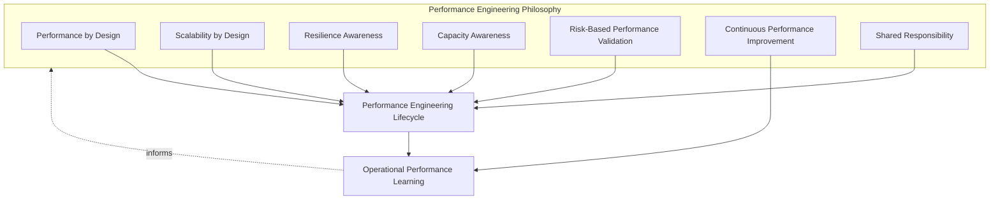
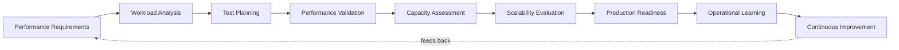
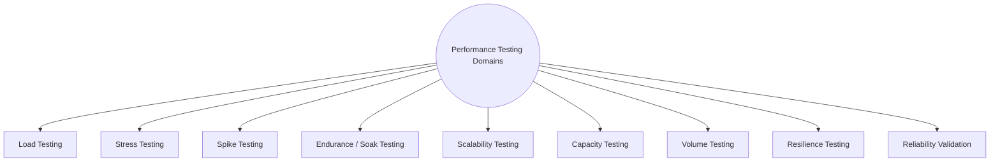
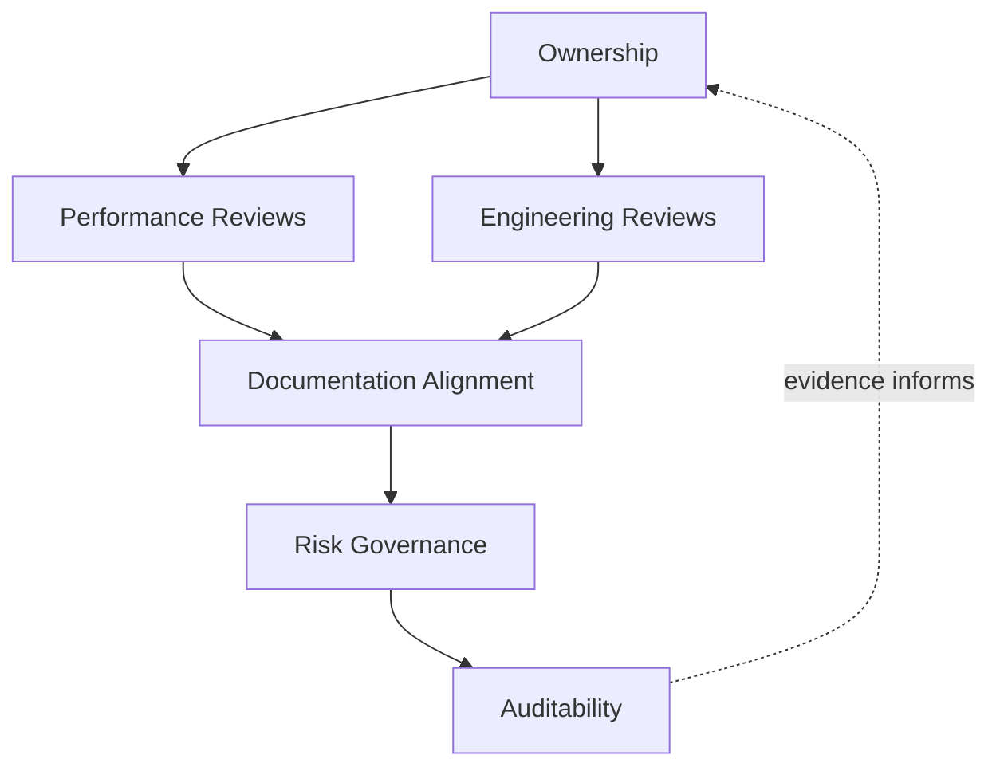
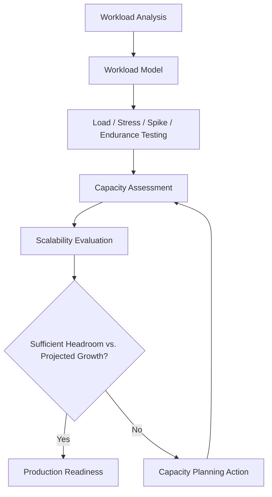
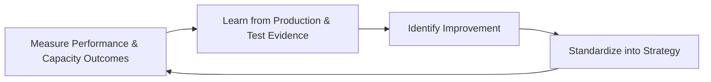
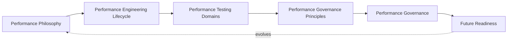

# Enterprise Performance, Scalability & Capacity Testing Strategy

## 1. Document Purpose

This document defines the official Enterprise Performance, Scalability & Capacity Testing Strategy for **StackLeo Tech Store**. It establishes performance engineering philosophy, the performance testing lifecycle, performance testing domains, and long-term performance engineering governance that apply across the entire platform — independent of any specific team, tool, or infrastructure provider.

- **Purpose of Performance Testing** — performance testing exists to produce objective, evidence-based confidence that the platform responds predictably, scales sustainably, and holds capacity under both expected and adverse conditions, before customers experience the alternative.
- **Relationship with Quality Strategy** — Performance Quality is one of the ten quality domains defined in `quality-strategy.md` (Section 4.3); this document is that domain's dedicated elaboration, defining how performance is verified rather than redefining why it matters.
- **Relationship with Testing Strategy** — this document is the performance-specific elaboration of Performance Testing as a type defined in `testing-strategy.md` (Section 5.5); it extends that definition into a full lifecycle, domain set, and governance model, while remaining subordinate to the overall testing philosophy and levels defined there.
- **Relationship with Site Reliability Engineering (SRE)** — performance testing produces the pre-production evidence that complements the operational reliability discipline defined in `07_DEVOPS/sre-strategy.md`; where SRE measures and sustains reliability in production, this strategy validates performance and capacity before a capability ever reaches it.
- **Relationship with DevOps** — this strategy assumes the delivery cadence of `07_DEVOPS/devops-principles.md`; performance validation is conceptually anchored to the pipeline gates in `07_DEVOPS/ci-cd-strategy.md` and the growth stages defined in `03_System_Design/scalability-strategy.md`, without prescribing specific benchmarking tools.
- **Relationship with Customer Experience** — performance is one of the most directly customer-perceptible quality attributes; slow or unreliable response under real conditions is a leading cause of abandoned purchases, making this strategy a direct protector of conversion and the trust-centered brand defined in `01_Business/vision.md`.

This document is implementation-independent and vendor-neutral. It defines performance engineering philosophy, lifecycle, domains, and governance — not specific performance testing tools, monitoring platforms, cloud providers, benchmarking software, or infrastructure configuration.

## 2. Performance Engineering Philosophy

Performance engineering at StackLeo is governed by seven principles. Each exists to produce a specific business outcome — performance is pursued because of the conversion, trust, and operational stability it protects, not as an abstract engineering metric.

### 2.1 Performance by Design

Performance characteristics are designed into a capability from the outset — through architectural choices such as critical-path isolation (per `03_System_Design/quality-attributes.md`, Section 3) — rather than optimized only after a problem is observed.

- **Business Value** — a performance defect prevented at design time avoids costly architectural rework later; designing for performance protects delivery velocity and customer experience simultaneously.

### 2.2 Scalability by Design

Capacity is architected to grow by adding resources within an existing structure, consistent with `03_System_Design/scalability-strategy.md`, rather than requiring redesign each time demand grows.

- **Business Value** — allows the business to pursue growth (Section 7) with confidence that the architecture will not become the limiting factor at the moment growth is most valuable.

### 2.3 Resilience Awareness

Performance engineering explicitly considers how the platform behaves as it approaches and exceeds its capacity limits, not only how it behaves under comfortable, expected load.

- **Business Value** — ensures degradation under extreme conditions is graceful and recoverable rather than catastrophic, protecting the core purchase journey even during unexpected demand.

### 2.4 Capacity Awareness

Current and projected capacity needs are understood deliberately, informed by real business growth trajectories, rather than assumed or discovered only when a limit is already being exceeded.

- **Business Value** — allows capacity investment to be planned proactively and cost-effectively, avoiding both wasteful over-provisioning and risky under-provisioning.

### 2.5 Risk-Based Performance Validation

Performance validation effort and depth are proportionate to business risk, consistent with `testing-strategy.md` (Section 2.3) — critical-path commerce capability (browse, cart, checkout, payment) receives materially more rigorous performance validation than peripheral capability.

- **Business Value** — directs finite performance engineering effort toward the journeys whose failure would cause the greatest business harm.

### 2.6 Continuous Performance Improvement

Performance engineering practice matures over time, informed by real production behavior and evolving business scale, rather than being fixed at a single point in the platform's history.

- **Business Value** — keeps performance strategy relevant as StackLeo grows through the stages defined in `03_System_Design/scalability-strategy.md` (Section 3).

### 2.7 Shared Responsibility

Performance is owned jointly by Engineering, Architecture, QA, and Operations; no single function is solely accountable for the platform's responsiveness and capacity.

- **Business Value** — prevents the anti-pattern in Section 9.6, where performance degrades because it is treated as a specialist concern disconnected from everyday engineering decisions.

*Diagram 1: Performance Engineering Philosophy Overview — the seven principles shape the performance lifecycle, and operational learning feeds back into the philosophy itself.*

## 3. Performance Engineering Lifecycle

Performance engineering is governed across nine conceptual stages, spanning from initial requirements through production learning and continuous improvement.

### 3.1 Performance Requirements

- **Purpose** — establish explicit, measurable performance expectations for a capability, tracing to `02_Product/non-functional-requirements.md`.
- **Business Value** — removes ambiguity about what "fast enough" or "scalable enough" means, replacing subjective impression with agreed targets.
- **Governance Objectives** — ensure every capability with meaningful performance risk has documented, quantitative performance requirements before design proceeds.

### 3.2 Workload Analysis

- **Purpose** — understand realistic usage patterns, transaction volumes, and traffic characteristics the capability must sustain.
- **Business Value** — grounds subsequent testing in genuine business conditions rather than convenient or arbitrary assumptions.
- **Governance Objectives** — ensure workload models are derived from real or realistically projected business data, and reviewed before test planning begins.

### 3.3 Test Planning

- **Purpose** — determine the performance testing approach, scope, and domains (Section 4) appropriate to the capability's risk and workload profile, coordinated with `test-planning.md`.
- **Business Value** — ensures performance testing effort is deliberately scoped and resourced rather than assembled ad hoc.
- **Governance Objectives** — confirm performance test plans trace to documented requirements (Section 3.1) and workload models (Section 3.2).

### 3.4 Performance Validation

- **Purpose** — execute planned performance tests and confirm the capability meets its defined performance requirements.
- **Business Value** — produces objective, evidence-based confidence in responsiveness before customers are exposed to the capability.
- **Governance Objectives** — ensure validation results are recorded consistently and evaluated against explicit, pre-agreed thresholds, not subjective judgment.

### 3.5 Capacity Assessment

- **Purpose** — determine the maximum sustainable load the capability can absorb under defined conditions, and compare it against projected demand.
- **Business Value** — informs proactive capacity planning decisions, consistent with Capacity Awareness (Section 2.4).
- **Governance Objectives** — ensure capacity headroom relative to projected growth is explicitly documented and reviewed, not assumed adequate.

### 3.6 Scalability Evaluation

- **Purpose** — confirm the capability's capacity grows proportionately as resources are added, consistent with `03_System_Design/scalability-strategy.md`.
- **Business Value** — validates that the architecture's scaling strategy holds true in practice, not only in design intent.
- **Governance Objectives** — ensure scalability assumptions are periodically re-validated as the platform and its growth stage evolve.

### 3.7 Production Readiness

- **Purpose** — confirm, using accumulated performance evidence, that a capability is genuinely ready to face real customer load.
- **Business Value** — converts performance-related release decisions into routine, evidence-based confirmations rather than high-risk assumptions.
- **Governance Objectives** — ensure performance production readiness criteria are applied consistently and connected to `testing-strategy.md` (Section 3.8).

### 3.8 Operational Learning

- **Purpose** — capture what real production traffic and behavior reveal about actual performance and capacity, complementing the reliability discipline in `07_DEVOPS/sre-strategy.md`.
- **Business Value** — converts genuine operational experience into a durable input for future performance requirements and workload models.
- **Governance Objectives** — ensure significant production performance learnings are documented and routed back into Section 3.1 and Section 3.2.

### 3.9 Continuous Improvement

- **Purpose** — act on operational learning and validation trends to deliberately improve performance engineering practice.
- **Business Value** — ensures performance engineering effectiveness compounds over time as the platform and business scale.
- **Governance Objectives** — ensure improvement actions arising from performance retrospectives are tracked to completion.

### Performance Engineering Lifecycle Matrix

| Stage | Purpose | Business Value | Governance Objective |
|---|---|---|---|
| Performance Requirements | Establish explicit, measurable expectations | Removes ambiguity about "fast enough" | Documented, quantitative requirements before design |
| Workload Analysis | Understand realistic usage and traffic patterns | Grounds testing in genuine business conditions | Workload models derived from real/projected data |
| Test Planning | Determine scope and approach for performance testing | Effort deliberately scoped and resourced | Plans trace to requirements and workload models |
| Performance Validation | Execute tests and confirm requirements are met | Objective, evidence-based confidence pre-release | Results evaluated against explicit thresholds |
| Capacity Assessment | Determine maximum sustainable load vs. projected demand | Informs proactive capacity planning | Headroom explicitly documented and reviewed |
| Scalability Evaluation | Confirm capacity grows proportionately with resources | Validates scaling strategy holds true in practice | Assumptions re-validated as growth stage evolves |
| Production Readiness | Confirm genuine readiness using accumulated evidence | Converts release decisions into routine confirmations | Criteria applied consistently, connected to release readiness |
| Operational Learning | Capture what production reveals about performance | Converts real experience into durable input | Learnings documented and routed back to requirements |
| Continuous Improvement | Act on learning and trends to improve practice | Effectiveness compounds as platform scales | Improvement actions tracked to completion |

*Diagram 2: Enterprise Performance Engineering Lifecycle — a continuous cycle in which production and operational evidence directly informs the next iteration of requirements.*

## 4. Performance Testing Domains

Performance testing is organized across nine conceptual domains, each verifying a distinct dimension of platform behavior under load or adverse condition.

### 4.1 Load Testing

- **Purpose** — verify the platform behaves correctly and responsively under expected, realistic traffic conditions.
- **Scope** — normal and moderately elevated business-as-usual traffic, per workload models derived in Section 3.2.
- **Governance Expectations** — required for every capability on the critical customer path before release.
- **Business Importance** — confirms the platform performs correctly under the conditions it will face on an ordinary day.

### 4.2 Stress Testing

- **Purpose** — determine how the platform behaves when load exceeds expected capacity, and where its breaking point lies.
- **Scope** — traffic deliberately driven beyond normal and peak expectations until degradation or failure occurs.
- **Governance Expectations** — required for critical-path capability to establish a known, understood failure threshold rather than an unknown one.
- **Business Importance** — ensures that if capacity is ever exceeded, the business already knows how the platform will behave rather than discovering it during a real event.

### 4.3 Spike Testing

- **Purpose** — verify the platform handles sudden, sharp increases in traffic, rather than only gradually increasing load.
- **Scope** — rapid traffic surges, such as a promotional flash sale announcement, consistent with `03_System_Design/scalability-strategy.md` (Section 3, Expansion Stage).
- **Governance Expectations** — required for any capability materially exposed to promotional or event-driven traffic surges.
- **Business Importance** — directly protects revenue-critical promotional events, which are among the highest-value and highest-risk traffic conditions the platform faces.

### 4.4 Endurance (Soak) Testing

- **Purpose** — verify the platform remains stable and performant under sustained load over an extended period.
- **Scope** — realistic load sustained over a duration sufficient to reveal gradual degradation (e.g., resource exhaustion patterns).
- **Governance Expectations** — required for capability expected to run continuously without frequent restart or redeployment.
- **Business Importance** — protects against failure modes that only manifest over time, which are otherwise invisible in short-duration testing.

### 4.5 Scalability Testing

- **Purpose** — verify that adding resources proportionately increases the capability's capacity, validating the scaling strategy defined in `03_System_Design/scalability-strategy.md`.
- **Scope** — capacity measured at multiple resource levels to confirm a proportional, predictable relationship.
- **Governance Expectations** — required whenever a capability's scaling approach changes materially, and periodically thereafter.
- **Business Importance** — confirms the platform's growth strategy is genuinely sound, not merely assumed from architectural intent.

### 4.6 Capacity Testing

- **Purpose** — determine the specific, current maximum sustainable capacity of a capability under defined conditions.
- **Scope** — a capability's present-state ceiling, evaluated against current and near-term projected demand.
- **Governance Expectations** — required as an input to capacity planning decisions and reviewed on a recurring basis, not only once.
- **Business Importance** — provides the concrete number capacity planning and business growth decisions can be reliably based on.

### 4.7 Volume Testing

- **Purpose** — verify the platform behaves correctly when handling large volumes of data, independent of concurrent user load.
- **Scope** — data-intensive scenarios such as large catalogs, high order history volume, or extensive seller listings under the future marketplace model.
- **Governance Expectations** — required for capability whose data volume is expected to grow substantially over time.
- **Business Importance** — protects against degradation that emerges from data scale alone, distinct from and complementary to traffic-based testing.

### 4.8 Resilience Testing

- **Purpose** — verify the platform degrades gracefully and recovers correctly when a dependency or component becomes degraded or unavailable under load.
- **Scope** — failure and recovery behavior of critical-path capability under realistic load conditions, complementing Recovery Testing in `testing-strategy.md` (Section 5.10).
- **Governance Expectations** — required for capability with a defined resilience expectation in `02_Product/non-functional-requirements.md`.
- **Business Importance** — ensures adverse conditions degrade the experience rather than break it entirely, protecting the core purchase journey.

### 4.9 Reliability Validation

- **Purpose** — confirm the platform produces consistent, correct outcomes under sustained load, complementing Reliability Testing in `testing-strategy.md` (Section 5.9).
- **Scope** — correctness of critical transactions (orders, payments, inventory) specifically under performance-stressed conditions, not only under nominal conditions.
- **Governance Expectations** — required for financially or operationally critical capability as a condition of Production Readiness (Section 3.7).
- **Business Importance** — protects the integrity of business-critical outcomes precisely when the platform is under the most demanding conditions.

### Performance Testing Domain Matrix

| Domain | Purpose | Governance Expectations | Business Importance |
|---|---|---|---|
| Load Testing | Verify behavior under expected, realistic traffic | Required for every critical-path capability pre-release | Confirms correct performance on an ordinary day |
| Stress Testing | Determine behavior beyond expected capacity | Required to establish a known failure threshold | Ensures the breaking point is known, not discovered live |
| Spike Testing | Verify handling of sudden, sharp traffic increases | Required for promotion/event-exposed capability | Protects high-value, high-risk promotional events |
| Endurance (Soak) Testing | Verify stability under sustained load over time | Required for continuously-running capability | Catches degradation invisible to short-duration tests |
| Scalability Testing | Verify capacity grows proportionately with resources | Required when scaling approach changes, and periodically | Confirms the growth strategy is genuinely sound |
| Capacity Testing | Determine current maximum sustainable capacity | Required input to capacity planning, reviewed recurringly | Provides the concrete basis for growth decisions |
| Volume Testing | Verify correctness under large data volumes | Required where data volume is expected to grow substantially | Protects against data-scale degradation, distinct from traffic load |
| Resilience Testing | Verify graceful degradation and recovery under load | Required wherever a resilience expectation is defined | Ensures adverse conditions degrade, not break, the journey |
| Reliability Validation | Confirm correct outcomes under sustained load | Required for financially/operationally critical capability | Protects business-critical integrity under demanding conditions |

*Diagram 3 (Part A): Performance Testing Domain Map — nine domains, each independently governed but collectively forming the platform's performance verification footprint.*

## 5. Performance Governance Principles

- **Performance Objectives** — every capability with meaningful performance risk has explicit, quantitative objectives, tracing to `02_Product/non-functional-requirements.md` and never left implicit.
- **Service Level Awareness** — performance validation is designed with awareness of the service level expectations sustained operationally under `07_DEVOPS/sre-strategy.md`, so pre-production testing and production reliability practice reinforce, rather than contradict, one another.
- **Capacity Planning** — capacity decisions are made proactively from Capacity Assessment (Section 3.5) and Capacity Testing (Section 4.6) evidence, not reactively once a limit has already been exceeded.
- **Workload Modeling** — performance testing is grounded in realistic, evidence-based workload models (Section 3.2), reflecting genuine business usage rather than convenient or arbitrary assumptions.
- **Bottleneck Awareness** — performance engineering explicitly seeks to understand where and why a capability's capacity is constrained, rather than treating capacity as an undifferentiated single number.
- **Continuous Measurement** — performance is measured continuously across the lifecycle (Section 3), not confirmed once and assumed to remain valid indefinitely as the platform evolves.
- **Release Readiness** — performance evidence is a mandatory, first-class input to release readiness decisions (`testing-strategy.md`, Section 3.8), never an optional or advisory signal bypassed under schedule pressure.

### Performance Governance Principle Matrix

| Principle | Description | Business Value |
|---|---|---|
| Performance Objectives | Explicit, quantitative objectives for every meaningful-risk capability | Removes ambiguity about what "acceptable" performance means |
| Service Level Awareness | Testing designed with awareness of operational SLA/SLO expectations | Keeps pre-production testing and production practice aligned |
| Capacity Planning | Capacity decisions made proactively from assessment evidence | Avoids reactive scrambling once a limit is already exceeded |
| Workload Modeling | Testing grounded in realistic, evidence-based usage patterns | Ensures test results reflect genuine business conditions |
| Bottleneck Awareness | Understand where and why capacity is constrained | Enables targeted, cost-effective remediation |
| Continuous Measurement | Performance measured continuously, not confirmed once | Keeps confidence current as the platform evolves |
| Release Readiness | Performance evidence is a mandatory release input | Prevents performance risk from being silently accepted |

## 6. Performance Governance

### 6.1 Ownership

Every performance testing domain (Section 4) has a single accountable owner; overall performance governance is owned jointly by Engineering, Architecture, and QA leadership, consistent with Shared Responsibility (Section 2.7).

### 6.2 Performance Reviews

Performance requirements, workload models, and test results are formally reviewed at defined lifecycle checkpoints (Section 3.3–3.4), ensuring performance confirmation is a deliberate governance act.

### 6.3 Engineering Reviews

Architectural decisions with performance or scalability implications are reviewed against `03_System_Design/quality-attributes.md` (Sections 3–4) and `03_System_Design/scalability-strategy.md`, independent of any single capability's test outcome.

### 6.4 Documentation Alignment

Performance testing documentation is kept consistent with `02_Product/non-functional-requirements.md`, `03_System_Design`, `07_DEVOPS/sre-strategy.md`, and `testing-strategy.md`; a performance claim that contradicts current architecture or requirements documentation is treated as a governance gap.

### 6.5 Risk Governance

Performance-related risk — unvalidated capacity headroom, known bottlenecks, deferred scalability validation — is tracked, prioritized, and escalated consistently, ensuring accepted risk is always a deliberate, accountable decision.

### 6.6 Auditability

Performance requirements, workload models, test results, and capacity assessments are retained in a form that can be independently reviewed after the fact, supporting internal governance and the compliance posture referenced in `06_Security/compliance.md`.

### Performance Governance Matrix

| Governance Area | Objective |
|---|---|
| Ownership | Every performance testing domain has one accountable owner |
| Performance Reviews | Performance confirmation is a deliberate, checkpointed governance act |
| Engineering Reviews | Architectural performance implications reviewed independent of any single feature |
| Documentation Alignment | Performance documentation stays consistent with requirements, architecture, and SRE practice |
| Risk Governance | Accepted performance risk is always a deliberate, accountable decision |
| Auditability | Requirements, workload models, and results retained for independent review |

### Governance Responsibility Matrix

| Role | Responsibility |
|---|---|
| Head of Quality / QA Leadership | Owns coherence and enforcement of this performance testing strategy, in partnership with Engineering and SRE. |
| Performance Engineering Lead / Architect | Owns performance domain execution (Section 4) and workload modeling (Section 3.2) across capabilities. |
| Solution Architect | Ensures architectural decisions remain aligned with `03_System_Design/quality-attributes.md` and `scalability-strategy.md`. |
| Engineering Leads | Apply Performance by Design (Section 2.1) within their domain and respond to identified bottlenecks. |
| SRE / Operations Lead | Ensures pre-production performance evidence remains consistent with operational reliability practice in `07_DEVOPS/sre-strategy.md`. |
| Product Manager | Ensures performance requirements (Section 3.1) reflect genuine customer and business expectations. |
| Internal Audit / Review Function | Independently verifies that performance governance records reflect actual practice. |

*Diagram 4: Performance Testing Governance Framework — ownership anchors review activity, which feeds documentation alignment, risk governance, and ultimately auditable evidence.*

*Diagram 3 (Part B): Workload & Capacity Assessment Model — workload evidence drives testing, which drives capacity assessment and a deliberate headroom decision before production readiness.*

## 7. Future Readiness

This strategy is designed to remain valid as StackLeo evolves in scale and architectural complexity, without requiring redefinition of its underlying philosophy.

- **Cloud-Native Platforms** — performance domains (Section 4) are defined independently of any specific runtime or deployment model, so they apply unchanged as infrastructure evolves, consistent with `03_System_Design/deployment-architecture.md`.
- **Microservices** — as the platform decomposes into further bounded services per `03_System_Design/service-architecture.md`, Scalability and Capacity Testing (Sections 4.5–4.6) extend naturally to per-service evaluation without requiring a new governance model.
- **AI Systems** — as AI-assisted capability (recommendations, search relevance, fraud detection) is introduced, Load and Volume Testing (Sections 4.1, 4.7) extend to cover the additional computational and data-volume demands such capability introduces.
- **Marketplace Platform** — the multi-vendor marketplace model extends Volume and Capacity Testing (Sections 4.7, 4.6) to cover seller-driven catalog and traffic growth, consistent with the Enterprise Stage in `03_System_Design/scalability-strategy.md` (Section 3).
- **Multi-Tenant Architecture** — where future architecture introduces tenant isolation, Resilience and Capacity Testing (Sections 4.8, 4.6) extend to verify that one tenant's load cannot degrade another's performance.
- **Multi-Region Operations** — as StackLeo expands from Bangladesh into South Asia and beyond, workload modeling (Section 3.2) extends to cover regional traffic patterns, network conditions, and localized peak events.
- **Peak Traffic Events** — Spike Testing (Section 4.3) is treated as a standing, recurring practice ahead of known promotional and seasonal events, not a one-time validation performed only at initial launch.
- **Global Engineering Teams** — the lifecycle, domains, and governance defined in Sections 3–6 are defined independently of team size, location, or organizational structure, so they remain coherent as engineering scales beyond a single, co-located team.

## 8. Governance

- **Ownership** — the Head of Quality (or equivalent accountable executive function) owns this strategy and is accountable for its consistent application across the platform, in partnership with Engineering, Architecture, and SRE leadership.
- **Review Process** — this strategy is formally reviewed whenever a material change occurs in business model (`01_Business/business-model.md`), architecture (`03_System_Design`), or growth stage (`03_System_Design/scalability-strategy.md`), and on a regular recurring cadence independent of specific change events.
- **Performance Testing Policies** — subordinate, practice-specific performance documents (workload modeling standards, capacity planning reporting, and further documents within `08_QUALITY_ASSURANCE`) must remain consistent with the philosophy, lifecycle, and domains defined here.
- **Audit Readiness** — this strategy and the evidence it requires (Section 6.6) are maintained in a state ready for internal or external audit at any time, without requiring advance preparation.
- **Continuous Improvement** — this strategy itself is subject to Continuous Performance Improvement (Section 2.6, Section 3.9); its effectiveness is periodically assessed and revised based on genuine operational and organizational evidence.

*Diagram 5: Continuous Performance Improvement Cycle — performance outcomes are measured, learned from, improved upon, and standardized back into this strategy, on a continuing basis.*

*Diagram 6: Performance Engineering Operating Model — how philosophy, lifecycle, domains, governance principles, and governance operate together as a single, self-reinforcing system that continues to evolve as the platform grows.*

## 9. Anti-Patterns

The following recurring failure patterns are explicitly recognized and avoided, as each one structurally undermines this strategy.

| Anti-Pattern | Why It's Avoided |
|---|---|
| Performance Testing Only Before Release | Contradicts Performance by Design (Section 2.1) and Continuous Measurement (Section 5.6); performance issues found immediately before release are the costliest and highest-risk to remediate. |
| Unrealistic Workloads | Undermines Workload Analysis (Section 3.2) and Workload Modeling (Section 5.4); testing against unrealistic assumptions produces confidence that does not reflect genuine business conditions. |
| Ignoring Capacity Planning | Contradicts Capacity Awareness (Section 2.4); reactive capacity decisions are materially more expensive and riskier than proactive ones. |
| Ignoring Scalability | Contradicts Scalability by Design (Section 2.2); an architecture never validated for its scaling assumptions may fail at precisely the moment growth is most valuable to the business. |
| Weak Performance Objectives | Undermines Performance Requirements (Section 3.1) and Performance Objectives (Section 5.1); without explicit targets, "acceptable performance" becomes an unverifiable subjective judgment. |
| Reactive Performance Engineering | Contradicts Risk-Based Performance Validation (Section 2.5); waiting for a production incident to reveal a performance limitation is the costliest and least controlled way to discover it. |
| Poor Documentation | Undermines Documentation Alignment (Section 6.4) and Auditability (Section 6.6), leaving performance evidence unclear or unverifiable after the fact. |
| Missing Continuous Improvement | Contradicts Section 2.6 and Section 3.9; without deliberate improvement, performance engineering practice stagnates while the business and platform continue to grow in scale. |

## 10. Document Information

| Property | Value |
|----------|-------|
| Document | performance-testing.md |
| Version | 1.0.0 |
| Status | Active |
| Maintained By | StackLeo |
| Last Updated | 2026-07-24 |

---

© StackLeo. All Rights Reserved.
