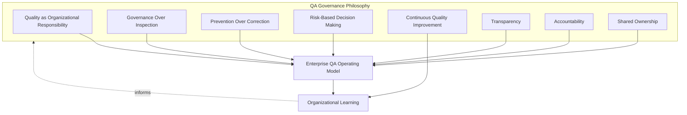
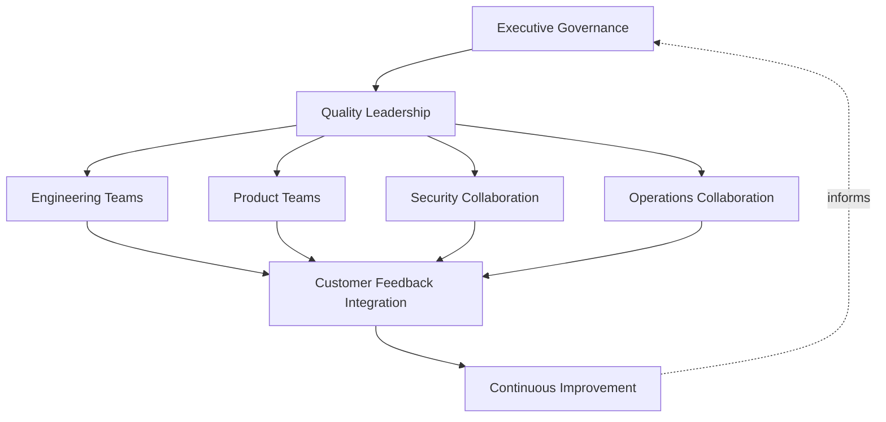
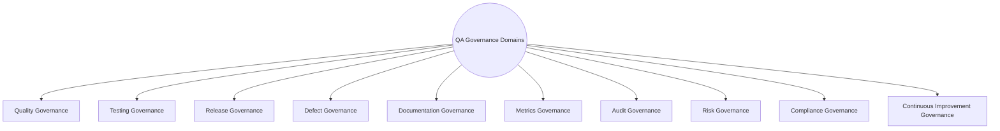
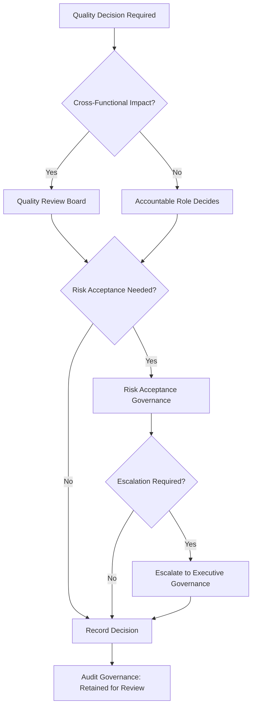
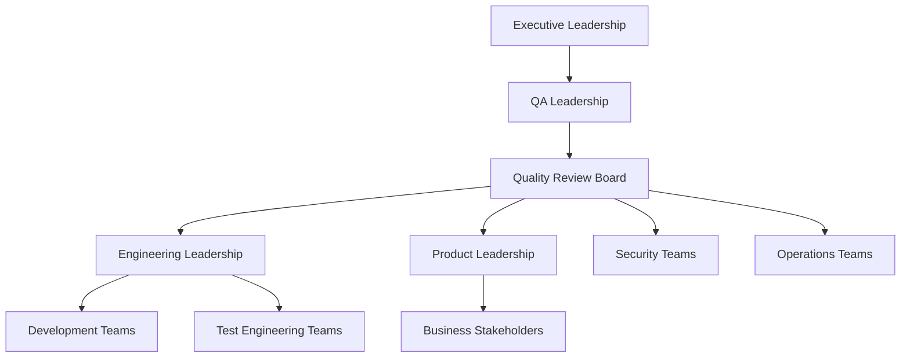
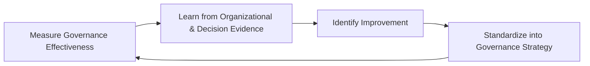
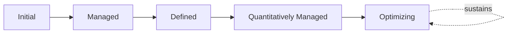

# Enterprise Quality Assurance Governance

## 1. Document Purpose

This document defines the official Enterprise Quality Assurance Governance Strategy for **StackLeo Tech Store**. It establishes the governance principles, operating model, organizational responsibilities, and decision-making processes that hold every other document in `08_QUALITY_ASSURANCE` together as a coherent, accountable whole.

- **Purpose of QA Governance** — to ensure that quality decisions across the platform are made deliberately, by accountable people, against a consistent set of principles — never left to accumulate as ad hoc, undocumented judgment calls, regardless of how sound any individual quality practice is in isolation.
- **Relationship with Quality Strategy** — this document is the governance layer sitting above `quality-strategy.md`; that document defines what quality means across the platform's ten domains, while this document defines who is accountable for it, how quality decisions are made, and how that accountability is sustained over time.
- **Relationship with Testing Strategy** — this document provides the organizational governance structure that `testing-strategy.md`, `test-planning.md`, and `test-automation-strategy.md` operate within; it does not redefine testing practice, but ensures that practice has clear ownership and consistent decision discipline.
- **Relationship with Release Governance** — `release-quality-gates.md` defines the specific gate domains and decision framework applied at the moment of release; this document defines the broader organizational governance — roles, review boards, escalation — within which that release decision is made.
- **Relationship with Engineering Governance** — QA governance is not a separate, parallel structure to how StackLeo governs engineering; it is the quality-specific application of the same accountability and decision discipline that governs architecture (`03_System_Design/architecture-decisions.md`) and delivery (`07_DEVOPS`).
- **Relationship with Business Governance** — quality governance ultimately serves business governance; the decisions this document structures — what quality risk is acceptable, what a release requires, how defects are prioritized — are business decisions with technical substance, not purely technical decisions with business implications.

This document is implementation-independent and vendor-neutral. It defines governance philosophy, operating model, roles, and decision structure — not specific QA tools, testing frameworks, project management platforms, or implementation technologies.

## 2. QA Governance Philosophy

QA governance at StackLeo is built on eight principles. Each exists to produce a specific business outcome — governance is pursued because of the consistency and accountability it creates at scale, not as bureaucratic overhead.

### 2.1 Quality as an Organizational Responsibility

Quality is a property of the whole organization's practice — Product, Engineering, QA, Security, Operations, and Leadership together — not a deliverable produced solely by a QA department on behalf of everyone else.

- **Business Value** — prevents the anti-pattern in Section 10.1, where quality is treated as someone else's job and consequently degrades wherever QA is not directly present.

### 2.2 Governance Over Inspection

Governance shapes how quality is built and decided throughout the organization, rather than relying on inspection at the end of a process to catch what governance failed to prevent.

- **Business Value** — shifts investment toward structurally sound decision-making, which scales, rather than exhaustive inspection, which does not.

### 2.3 Prevention Over Correction

Governance structures are designed to prevent poor quality decisions before they are made, consistent with Prevention Over Detection in `quality-strategy.md` (Section 2.3), rather than correcting their consequences after the fact.

- **Business Value** — a governance gap prevented costs far less than the defect, release incident, or compliance failure it would otherwise have allowed.

### 2.4 Risk-Based Decision Making

Governance rigor and escalation depth are proportionate to genuine business risk, consistent with `quality-strategy.md` (Section 5.2), rather than applying uniform process regardless of consequence.

- **Business Value** — ensures governance attention concentrates on decisions that matter most, avoiding both under-governed critical decisions and over-governed trivial ones.

### 2.5 Continuous Quality Improvement

QA governance itself matures over time, informed by real organizational experience, consistent with Continuous Improvement across every document in this folder.

- **Business Value** — keeps governance genuinely useful as StackLeo scales from single-seller B2C retailer toward marketplace, corporate sales, and regional expansion.

### 2.6 Transparency

Quality posture, decisions, and their rationale are visible to those who need to understand them, not held privately within any single function.

- **Business Value** — builds cross-functional confidence and enables informed decision-making by stakeholders who depend on, but do not directly perform, quality work.

### 2.7 Accountability

Every quality decision, policy, and accepted risk traces to a specific, named accountable role, never left ambiguous or diffused across "the team" generally.

- **Business Value** — prevents the anti-pattern in Section 10.3, where a quality gap persists because responsibility was never clearly assigned to begin with.

### 2.8 Shared Ownership

While accountability (Section 2.7) is always specific, the broader work of achieving quality is shared across Product, Engineering, QA, Security, and Operations, consistent with Shared Responsibility across `quality-strategy.md` and `testing-strategy.md`.

- **Business Value** — produces quality outcomes grounded in complete organizational context, rather than the narrower view any single function could provide alone.

*Diagram 1: QA Governance Philosophy Overview — the eight principles shape the enterprise QA operating model, and organizational learning feeds back into the philosophy itself.*

## 3. Enterprise QA Operating Model

QA operates across eight conceptual layers, spanning executive governance through continuous improvement, each with a distinct role in sustaining quality across the organization.

### 3.1 Executive Governance

- **Purpose** — provide visible, accountable sponsorship for quality as a business priority, and make or ratify decisions of significant business risk.
- **Business Value** — signals that quality is a genuine business priority, not merely a technical concern, and secures the resourcing quality requires.
- **Governance Objectives** — ensure Executive Leadership is informed of and accountable for significant quality risk decisions (Section 6).

### 3.2 Quality Leadership

- **Purpose** — own the coherence of quality philosophy, strategy, and standards across the platform, as documented throughout `08_QUALITY_ASSURANCE`.
- **Business Value** — ensures quality practice is consistent and deliberate across teams, rather than independently reinvented by each one.
- **Governance Objectives** — ensure every document in this folder has a designated accountable owner and is kept current (Section 8).

### 3.3 Engineering Teams

- **Purpose** — build quality into the platform through disciplined design, construction, and verification practice, consistent with `quality-strategy.md` (Section 3.3).
- **Business Value** — makes quality a property of how software is built, not solely a property confirmed by others afterward.
- **Governance Objectives** — ensure engineering practice is reviewed against the standards defined in `quality-strategy.md` and `testing-strategy.md`.

### 3.4 Product Teams

- **Purpose** — define what "fit for purpose" genuinely means for a capability, grounding quality in real business and customer need.
- **Business Value** — keeps quality effort anchored to genuine customer value rather than internal technical assumption.
- **Governance Objectives** — ensure acceptance criteria and business context are available and current for every capability under quality governance.

### 3.5 Security Collaboration

- **Purpose** — ensure security is governed as an integral quality concern, jointly with `06_Security` and `07_DEVOPS/devsecops-strategy.md`, rather than a separate track.
- **Business Value** — protects StackLeo's core trust differentiator by keeping security decisions connected to, not isolated from, broader quality governance.
- **Governance Objectives** — ensure Security Readiness (`release-quality-gates.md`, Section 4.2) is never overridden without Security leadership's explicit involvement.

### 3.6 Operations Collaboration

- **Purpose** — ensure operational sustainability is governed as part of quality, jointly with `07_DEVOPS/sre-strategy.md` and `07_DEVOPS/operational-readiness.md`.
- **Business Value** — protects against the failure mode where a technically correct release becomes an operational crisis due to insufficient operational readiness.
- **Governance Objectives** — ensure Operational Readiness (`release-quality-gates.md`, Section 4.8) is a genuine, non-bypassable governance input.

### 3.7 Customer Feedback Integration

- **Purpose** — ensure real customer experience and feedback are systematically incorporated into quality governance, not only internal verification evidence.
- **Business Value** — closes the loop between internally verified quality and genuinely experienced quality, consistent with Shift-Right Learning (`testing-strategy.md`, Section 2.2).
- **Governance Objectives** — ensure customer feedback channels feed into Operational Learning (`quality-strategy.md`, Section 3.7) and defect intake (`defect-management.md`, Section 3.1).

### 3.8 Continuous Improvement

- **Purpose** — act on evidence and organizational learning from every other layer to deliberately improve quality governance itself.
- **Business Value** — ensures QA governance effectiveness compounds over time rather than remaining fixed as the organization and platform grow.
- **Governance Objectives** — ensure improvement actions arising from governance review (Section 8) are tracked to completion.

### Enterprise QA Operating Model Matrix

| Layer | Purpose | Business Value | Governance Objective |
|---|---|---|---|
| Executive Governance | Provide accountable sponsorship for quality priorities | Signals quality as a genuine business priority | Executive Leadership informed of/accountable for significant risk decisions |
| Quality Leadership | Own coherence of quality philosophy and standards | Ensures consistent, deliberate practice across teams | Every document has a designated, accountable owner |
| Engineering Teams | Build quality in through disciplined practice | Makes quality a property of how software is built | Practice reviewed against strategy and testing standards |
| Product Teams | Define genuine fitness for business purpose | Anchors quality effort to genuine customer value | Acceptance criteria and context available and current |
| Security Collaboration | Govern security as an integral quality concern | Protects the core trust differentiator | Security Readiness never overridden without Security involvement |
| Operations Collaboration | Govern operational sustainability as part of quality | Prevents technically sound releases becoming operational crises | Operational Readiness is a genuine, non-bypassable input |
| Customer Feedback Integration | Incorporate real customer experience into governance | Closes the loop between verified and experienced quality | Feedback feeds into operational learning and defect intake |
| Continuous Improvement | Act on evidence to improve governance itself | Effectiveness compounds over time | Improvement actions tracked to completion |

*Diagram 2: QA Operating Model — eight layers spanning executive sponsorship through continuous improvement, forming a closed organizational loop.*

## 4. QA Governance Domains

QA governance spans ten conceptual domains, each corresponding to a governed discipline documented elsewhere in `08_QUALITY_ASSURANCE` or its adjacent folders.

### 4.1 Quality Governance

- **Purpose** — govern adherence to the quality philosophy, lifecycle, and domains defined in `quality-strategy.md`.
- **Scope** — the platform's ten quality domains (`quality-strategy.md`, Section 4) and nine lifecycle stages (Section 3).
- **Governance Expectations** — reviewed per `quality-strategy.md` (Section 6) as the foundational governance layer this document sits above.
- **Business Importance** — provides the conceptual foundation every other governance domain in this document depends on.

### 4.2 Testing Governance

- **Purpose** — govern adherence to the testing lifecycle, levels, and types defined in `testing-strategy.md` and `test-planning.md`.
- **Scope** — test planning, design, execution, and automation practice across the organization.
- **Governance Expectations** — reviewed per `testing-strategy.md` (Section 7) and `test-automation-strategy.md` (Section 6).
- **Business Importance** — ensures verification effort is genuinely proportionate to risk, not left to individual team discretion.

### 4.3 Release Governance

- **Purpose** — govern adherence to the release quality gates and decision framework defined in `release-quality-gates.md`.
- **Scope** — go/no-go decision-making, exception management, and post-release review.
- **Governance Expectations** — reviewed per `release-quality-gates.md` (Section 6); coordinated with `07_DEVOPS/release-management.md`.
- **Business Importance** — protects the moment of greatest customer-facing risk in the entire delivery lifecycle.

### 4.4 Defect Governance

- **Purpose** — govern adherence to the defect lifecycle, RCA, and CAPA practice defined in `defect-management.md`.
- **Scope** — defect identification through closure, and organizational learning from significant defects.
- **Governance Expectations** — reviewed per `defect-management.md` (Section 6).
- **Business Importance** — ensures defects become organizational learning rather than a recurring, unmanaged cost.

### 4.5 Documentation Governance

- **Purpose** — govern the accuracy, currency, and consistency of quality-related documentation across the repository.
- **Scope** — every document in `08_QUALITY_ASSURANCE` and its cross-references into `02_Product`, `03_System_Design`, `06_Security`, and `07_DEVOPS`.
- **Governance Expectations** — documentation misalignment is treated as a governance gap in every subordinate strategy, not a minor administrative issue.
- **Business Importance** — protects the reliability of the shared understanding every other governance domain depends on.

### 4.6 Metrics Governance

- **Purpose** — govern adherence to the measurement philosophy, domains, and KPI strategy defined in `quality-metrics.md`.
- **Scope** — metric definition, validation, executive reporting, and governance review of the measurement set itself.
- **Governance Expectations** — reviewed per `quality-metrics.md` (Section 6).
- **Business Importance** — ensures quality decisions across the organization are genuinely evidence-based, not anecdotal.

### 4.7 Audit Governance

- **Purpose** — ensure quality decisions and evidence across all domains remain available for independent review.
- **Scope** — cross-cutting; consolidates the auditability expectations defined individually across every document in this folder.
- **Governance Expectations** — audit readiness is a continuous state, not a preparation exercise triggered only when an audit is imminent.
- **Business Importance** — supports internal governance confidence and external compliance or partner review as StackLeo grows.

### 4.8 Risk Governance

- **Purpose** — ensure quality-related risk across every domain is tracked, prioritized, and escalated consistently.
- **Scope** — cross-cutting; consolidates the risk governance expectations defined individually across `quality-strategy.md`, `testing-strategy.md`, `performance-testing.md`, `defect-management.md`, and `release-quality-gates.md`.
- **Governance Expectations** — accepted quality risk is always a deliberate, accountable decision, never a silent default.
- **Business Importance** — ensures the organization understands and consciously accepts, rather than unconsciously inherits, its quality risk exposure.

### 4.9 Compliance Governance

- **Purpose** — ensure quality practice satisfies applicable regulatory and policy obligations, jointly with `06_Security/compliance.md`.
- **Scope** — Compliance Readiness (`release-quality-gates.md`, Section 4.10) and any market-specific regulatory obligation affecting quality practice.
- **Governance Expectations** — reviewed jointly with Legal/Compliance functions, never assumed satisfied by general quality practice alone.
- **Business Importance** — protects StackLeo's license to operate in its current and future markets.

### 4.10 Continuous Improvement Governance

- **Purpose** — govern the mechanism by which every other governance domain matures over time.
- **Scope** — retrospective findings, improvement action tracking, and periodic reassessment of governance effectiveness itself.
- **Governance Expectations** — improvement actions are tracked to completion with the same discipline as any other governed commitment.
- **Business Importance** — prevents governance itself from becoming the next thing that quietly stagnates as the organization scales.

### QA Governance Domain Matrix

| Domain | Purpose | Governance Expectations | Business Importance |
|---|---|---|---|
| Quality Governance | Govern adherence to quality philosophy and lifecycle | Reviewed per `quality-strategy.md` Section 6 | Foundational layer all other domains depend on |
| Testing Governance | Govern adherence to testing lifecycle, levels, types | Reviewed per `testing-strategy.md` and `test-automation-strategy.md` | Ensures verification proportionate to risk |
| Release Governance | Govern release gate and decision framework adherence | Reviewed per `release-quality-gates.md` Section 6 | Protects the moment of greatest customer-facing risk |
| Defect Governance | Govern defect lifecycle, RCA, and CAPA practice | Reviewed per `defect-management.md` Section 6 | Converts defects into learning, not recurring cost |
| Documentation Governance | Govern accuracy and consistency of quality documentation | Misalignment treated as a governance gap everywhere | Protects the shared understanding governance depends on |
| Metrics Governance | Govern measurement philosophy, domains, and KPI strategy | Reviewed per `quality-metrics.md` Section 6 | Ensures decisions are evidence-based, not anecdotal |
| Audit Governance | Ensure decisions and evidence remain independently reviewable | Audit readiness is continuous, not preparation-triggered | Supports internal confidence and external compliance review |
| Risk Governance | Track, prioritize, and escalate quality risk consistently | Accepted risk is always deliberate, never a silent default | Ensures conscious, not unconscious, risk exposure |
| Compliance Governance | Ensure quality practice satisfies regulatory obligations | Reviewed jointly with Legal/Compliance | Protects StackLeo's license to operate |
| Continuous Improvement Governance | Govern maturation of every other governance domain | Improvement actions tracked with full discipline | Prevents governance itself from stagnating |

*Diagram 3: QA Governance Domain Map — ten domains, each governing a distinct discipline documented elsewhere, together forming complete governance coverage.*

## 5. Roles & Responsibilities

Responsibility is expressed conceptually using a RACI-style model (Responsible, Accountable, Consulted, Informed) across the major governance activities defined in this folder.

### Roles & Responsibility Matrix

| Governance Activity | Executive Leadership | Product Leadership | Engineering Leadership | QA Leadership | Development Teams | Test Engineering Teams | Security Teams | Operations Teams | Business Stakeholders |
|---|---|---|---|---|---|---|---|---|---|
| Quality Strategy Definition | A | C | C | R | I | I | C | I | C |
| Testing Strategy & Planning | I | C | C | A/R | C | R | C | I | I |
| Test Automation Governance | I | I | C | A | R | R | I | I | I |
| Performance/Accessibility/Compatibility Validation | I | C | C | A | C | R | C | C | I |
| Quality Metrics & Reporting | C | I | C | A/R | I | C | I | I | I |
| Defect Management & RCA/CAPA | I | C | A | R | R | R | C | C | I |
| Release Go/No-Go Decision | A | C | C | R | C | C | C | C | I |
| Security Readiness Sign-off | I | I | C | C | I | C | A/R | I | I |
| Operational Readiness Sign-off | I | I | C | C | I | I | I | A/R | I |
| Compliance Readiness Sign-off | A | C | I | C | I | I | C | I | R |
| Quality Governance Review | A | C | C | R | I | I | C | C | I |

*R = Responsible (does the work), A = Accountable (owns the outcome), C = Consulted (input sought), I = Informed (kept aware).*

Each role's broader governance responsibility:

- **Executive Leadership** — provides sponsorship, ratifies significant risk-acceptance decisions, and holds Quality Leadership accountable for platform-wide quality health.
- **Product Leadership** — ensures quality decisions are grounded in genuine business and customer context, and confirms Business Readiness (`release-quality-gates.md`, Section 4.9).
- **Engineering Leadership** — ensures engineering practice consistently reflects the standards defined across `quality-strategy.md` and `testing-strategy.md`.
- **QA Leadership** — owns coherence and enforcement of every strategy in `08_QUALITY_ASSURANCE`, and coordinates cross-functional quality decision-making.
- **Development Teams** — build quality into the platform directly, consistent with Quality Engineering (`quality-strategy.md`, Section 3.3).
- **Test Engineering Teams** — plan, design, and execute verification across the levels, types, and domains defined in `testing-strategy.md` and its subordinate strategies.
- **Security Teams** — own Security Readiness and hold non-negotiable authority to hold a release on security grounds.
- **Operations Teams** — own Operational Readiness and post-release observation, consistent with `07_DEVOPS/sre-strategy.md`.
- **Business Stakeholders** — provide requirement and acceptance context, and participate in User Acceptance Testing (`testing-strategy.md`, Section 4.6).

## 6. Decision Governance

- **Quality Review Boards** — a cross-functional body, drawn from Section 5's roles, that reviews significant quality decisions — strategy changes, major risk acceptance, systemic process gaps — ensuring they are not made by any single function in isolation.
- **Release Approval Governance** — the go/no-go decision defined in `release-quality-gates.md` (Section 3.5) is governed by clear, accountable ownership and documented criteria, never defaulting to whoever happens to be available at the time.
- **Risk Acceptance Governance** — where quality risk is knowingly carried forward rather than resolved, acceptance is made explicitly by an accountable role proportionate to the risk's magnitude, consistent with Risk-Based Decision Making (Section 2.4).
- **Exception Governance** — deviations from standard quality, testing, or release expectations are explicitly requested, reviewed, and approved, never assumed or silently applied, consistent with Exception Management (`release-quality-gates.md`, Section 5.6).
- **Escalation Governance** — a clear, known path exists for escalating quality concerns that cannot be resolved at the level where they are first raised, ensuring disagreement or uncertainty does not stall indefinitely.
- **Audit Governance** — decisions made through every mechanism above are recorded in a form that supports independent review, consistent with Auditability (Section 4.7).

### Decision Governance Matrix

| Mechanism | Purpose | Governance Role |
|---|---|---|
| Quality Review Boards | Review significant, cross-functional quality decisions | Prevents unilateral decisions on matters affecting multiple functions |
| Release Approval Governance | Govern the go/no-go release decision | Ensures accountable, criteria-based release decisions |
| Risk Acceptance Governance | Govern explicit acceptance of known quality risk | Ensures risk carried forward is a deliberate, proportionate decision |
| Exception Governance | Govern deviations from standard expectations | Ensures deviations are requested, reviewed, and approved explicitly |
| Escalation Governance | Provide a path for unresolved quality concerns | Prevents disagreement or uncertainty from stalling indefinitely |
| Audit Governance | Ensure decisions are recorded for independent review | Supports accountability and continuous improvement over time |

*Diagram 4: Quality Decision Governance Flow — decisions route to the appropriate accountable level based on scope and risk, with every path concluding in a recorded, auditable outcome.*

*Diagram 5: QA Organizational Governance Structure — accountability flows from Executive Leadership through QA Leadership and a cross-functional Quality Review Board into the teams that perform the work.*

## 7. Future Readiness

This strategy is designed to remain valid as StackLeo evolves in scale and organizational complexity, without requiring redefinition of its underlying philosophy.

- **Cloud-Native Platforms** — governance domains (Section 4) are defined independently of any specific runtime or deployment model, so they apply unchanged as infrastructure evolves.
- **AI Systems** — as AI-assisted capability is introduced, Quality and Testing Governance (Sections 4.1–4.2) extend to cover AI-specific behavioral evaluation and oversight, governed by the same accountability and risk-based principles (Sections 2.4, 2.7) applied to any other capability.
- **Marketplace Platform** — the multi-vendor marketplace model extends Quality, Defect, and Compliance Governance (Sections 4.1, 4.4, 4.9) to cover seller-supplied content, applying the same accountability structure used for StackLeo's own catalog today.
- **Multi-Tenant Architecture** — where future architecture introduces tenant isolation, Risk and Release Governance (Sections 4.8, 4.3) extend to explicitly govern cross-tenant quality decisions.
- **Continuous Delivery** — as delivery cadence accelerates per `07_DEVOPS/ci-cd-strategy.md`, Decision Governance (Section 6) becomes lighter-weight and more frequent per change, without reducing accountability or auditability.
- **Global Engineering Organizations** — the operating model, roles, and governance domains defined in Sections 3–6 are defined independently of team size, location, or organizational structure, so they remain coherent as engineering scales across geographies.
- **Regulatory Evolution** — Compliance Governance (Section 4.9) is structured to absorb new market-specific regulatory obligations as StackLeo expands into South Asia and beyond, without requiring the broader governance model to be redesigned.
- **Enterprise Scale** — the RACI-style responsibility model (Section 5) is designed to extend to additional roles and functions as the organization grows, preserving the principle of clear, specific accountability (Section 2.7) at any scale.

## 8. Governance

- **Ownership** — the Chief Quality Officer (or equivalent accountable executive function) owns this document and is accountable for the coherence of every subordinate strategy within `08_QUALITY_ASSURANCE`, in partnership with Executive, Engineering, and Product leadership.
- **Review Process** — this document is formally reviewed whenever a material change occurs in business model (`01_Business/business-model.md`), organizational structure, or any subordinate quality strategy, and on a regular recurring cadence independent of specific change events.
- **QA Policies** — every document within `08_QUALITY_ASSURANCE` operates as a policy subordinate to this governance strategy; a subordinate document that conflicts with the principles defined here is treated as a documentation defect (`defect-management.md`, Section 4.9) requiring resolution.
- **Audit Readiness** — this strategy and the evidence it requires (Section 4.7) are maintained in a state ready for internal or external audit at any time, without requiring advance preparation.
- **Continuous Improvement** — this strategy itself is subject to Continuous Quality Improvement (Section 2.5, Section 3.8); its effectiveness is periodically assessed and revised based on genuine organizational evidence.

*Diagram 6: Continuous Quality Improvement Loop — governance effectiveness is measured, learned from, improved upon, and standardized back into this strategy, on a continuing basis.*

## 9. QA Maturity Model

QA maturity is described across five conceptual levels, adapted from established process maturity thinking. Progression reflects increasing consistency, measurement, and deliberate improvement — not merely increasing activity volume.

- **Initial** — quality outcomes depend heavily on individual effort and informal practice; processes are inconsistent across teams, and success is achieved inconsistently rather than reliably engineered.
- **Managed** — basic quality processes exist and are followed within individual teams or projects, but practice is not yet consistent across the organization; documentation and governance exist but may vary in depth.
- **Defined** — quality processes are standardized, documented, and consistently applied across the organization, consistent with the lifecycle and governance structures defined throughout `08_QUALITY_ASSURANCE`; roles and responsibilities (Section 5) are clear organization-wide.
- **Quantitatively Managed** — quality is measured systematically using the metrics and KPIs defined in `quality-metrics.md`, and decisions are made based on genuine trend data rather than qualitative impression alone.
- **Optimizing** — quality practice is continuously and deliberately improved based on quantitative evidence and organizational learning, consistent with Section 2.5 and Section 3.8; improvement itself is a managed, ongoing discipline rather than an occasional initiative.

### QA Maturity Model Matrix

| Level | Characteristics | Primary Focus |
|---|---|---|
| Initial | Outcomes depend on individual effort; inconsistent practice across teams | Ad hoc effort, informal quality practice |
| Managed | Basic processes exist and are followed within individual teams | Team-level consistency |
| Defined | Standardized, documented processes applied consistently organization-wide | Organization-wide consistency and clear ownership |
| Quantitatively Managed | Quality measured systematically; decisions grounded in trend data | Evidence-based decision-making |
| Optimizing | Practice continuously and deliberately improved from evidence | Sustained, deliberate improvement as a discipline |

*Diagram 7: QA Maturity Progression Model — maturity advances from individually-dependent effort toward standardized, measured, and continuously optimized quality practice.*

## 10. Anti-Patterns

The following recurring failure patterns are explicitly recognized and avoided, as each one structurally undermines this strategy.

| Anti-Pattern | Why It's Avoided |
|---|---|
| QA as a Separate Department Only | Contradicts Quality as an Organizational Responsibility (Section 2.1); quality confined to a single department cannot influence decisions made everywhere else it is actually determined. |
| Weak Executive Sponsorship | Undermines Executive Governance (Section 3.1); without visible sponsorship, quality loses both resourcing priority and the authority to enforce difficult decisions. |
| Poor Accountability | Contradicts Accountability (Section 2.7); when responsibility is diffused across "the team," quality gaps persist because no specific role is answerable for them. |
| Weak Decision Governance | Undermines Section 6; without clear review boards, approval authority, and escalation paths, quality decisions become inconsistent and undefendable. |
| Reactive Quality | Contradicts Prevention Over Correction (Section 2.3); governance that only responds after a failure has already occurred forfeits the far cheaper option of preventing it. |
| Poor Documentation | Undermines Documentation Governance (Section 4.5); without accurate, current documentation, every other governance domain loses its shared factual basis. |
| Weak Audit Readiness | Undermines Audit Governance (Section 4.7); treating audit readiness as a one-time preparation exercise rather than a continuous state invites gaps to accumulate unnoticed. |
| Missing Continuous Improvement | Contradicts Continuous Quality Improvement (Section 2.5) and Continuous Improvement Governance (Section 4.10); without deliberate improvement, governance itself becomes the next thing that silently stagnates as the organization scales. |

## 11. Document Information

| Property | Value |
|----------|-------|
| Document | qa-governance.md |
| Version | 1.0.0 |
| Status | Active |
| Maintained By | StackLeo |
| Last Updated | 2026-07-24 |

---

© StackLeo. All Rights Reserved.
