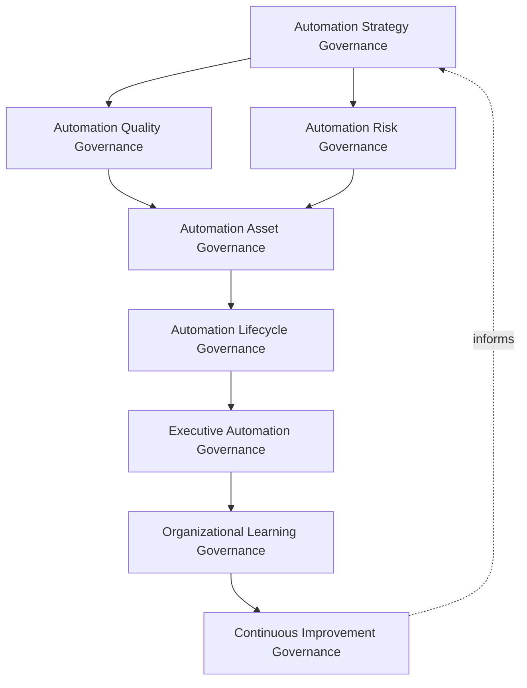
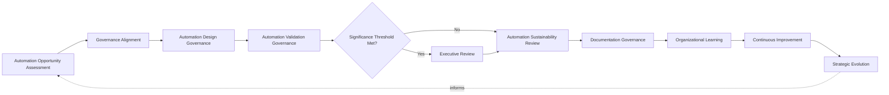
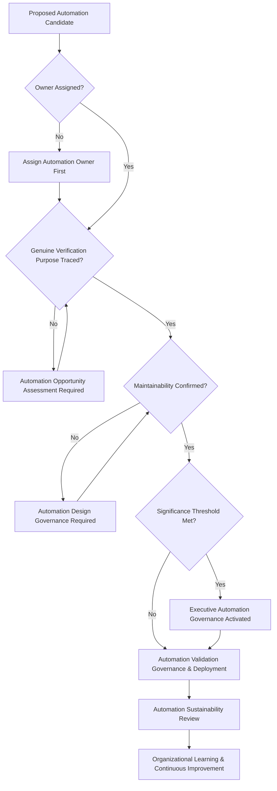
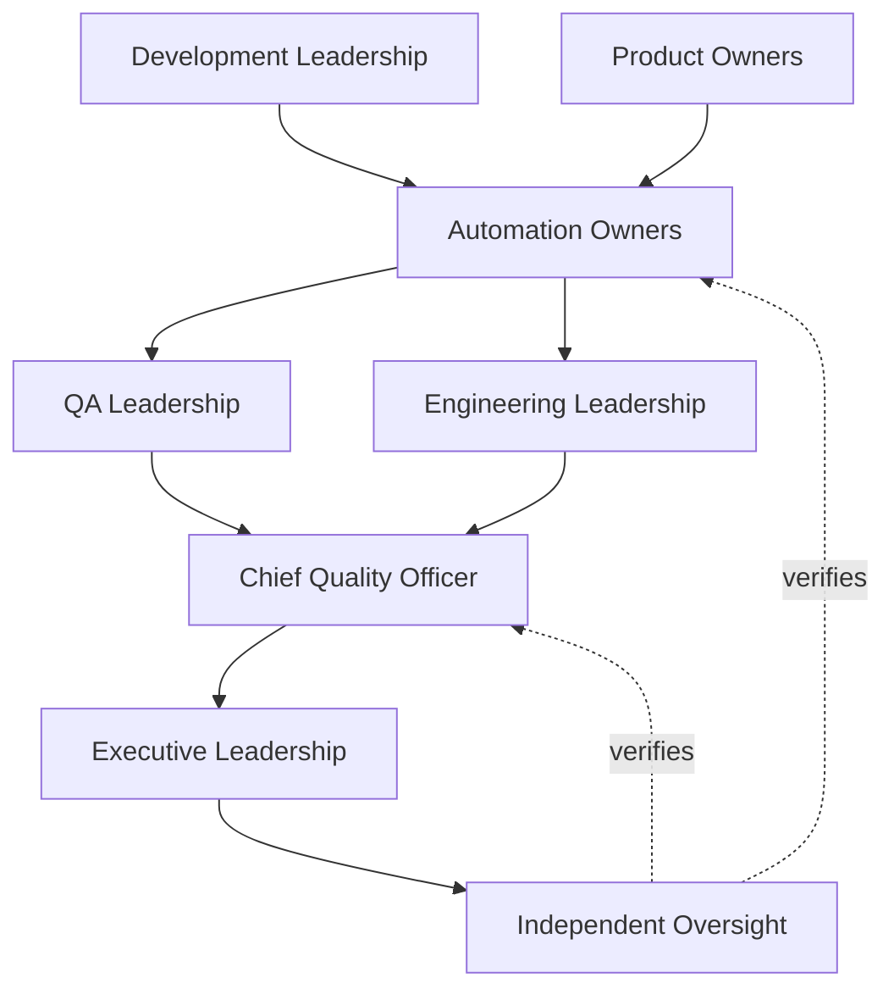
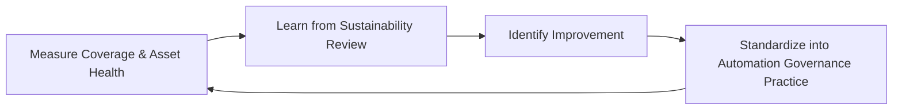
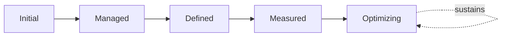

# Enterprise Test Automation Governance Strategy

## 1. Document Purpose

This document defines the official Enterprise Test Automation Governance Strategy for **StackLeo Tech Store** — the CQO/VP-of-Engineering-owned executive charter under which test automation, automation quality, automation ownership, and sustainable automation practice are governed as a deliberate, accountable discipline. It establishes governance for automation strategy, automation quality, automation risk, automation assets, organizational accountability, executive oversight, sustainable automation, and long-term automation maturity across the StackLeo platform, consistent with ISTQB Advanced Level practice, IEEE 29119, ISO 9001, COBIT governance principles, and TOGAF enterprise architecture thinking.

`test-automation-strategy.md` remains the operational governance framework for automation practice in this folder — the document that elaborates in full operational depth StackLeo's automation lifecycle, domains, and sustainability discipline. This document sits above it as the highest-level executive mandate, consistent with the executive-charter relationship `testing-governance.md` holds over `testing-strategy.md`: it does not restate automation execution detail, it establishes the philosophy, organizational ownership, and executive expectations that give automation practice its authority and coherence at the level of the Board and executive leadership. This document is coordinated with, and does not duplicate, `test-governance-framework.md`, which governs test-related policy consistency across all testing and quality documentation, including this one.

- **Purpose of Test Automation Governance** — to ensure test automation at StackLeo is pursued as a deliberate, accountable investment in sustainable verification capacity, rather than a collection of scripts whose value, ownership, and maintenance burden are left ungoverned.
- **Relationship with Testing Strategy** — `testing-strategy.md` and `testing-governance.md` govern testing broadly; this strategy governs specifically how a proportion of that verification is automated, selected, and sustained, without redefining the testing levels or types those documents already own.
- **Relationship with Quality Assurance** — automation is one mechanism, among others, by which the quality culture and capability defined in `quality-assurance-framework.md` and `quality-strategy.md` are continuously verified; this strategy ensures automation investment is made in service of those quality objectives, not as an independent goal.
- **Relationship with Software Delivery** — sustainable, increasing delivery frequency depends on proportionate, trustworthy automated verification; this strategy exists so that delivery speed is matched by genuine automated confidence, not by increasing unverified risk.
- **Relationship with DevOps** — this strategy assumes the delivery cadence and automation-first culture of `07_DEVOPS/devops-principles.md`; Automation Lifecycle Governance (Section 3.5) is coordinated with, and never duplicates, the pipeline gate discipline in `07_DEVOPS/ci-cd-strategy.md`.
- **Relationship with Risk Management** — this strategy applies the risk-based discipline established in `06_Security/enterprise-risk-management-strategy.md` specifically to the decision of what genuinely warrants automation investment, consistent with Automation Risk Governance (Section 3.3).
- **Relationship with Executive Decision-Making** — this strategy exists to give executive leadership genuine confidence that automation investment is a deliberate, accountable capital decision, not an unmanaged accumulation of technical assets.

This document is implementation-independent and vendor-neutral. It defines test automation governance philosophy, model, domains, and lifecycle conceptually — not specific automation frameworks, testing tools, CI/CD platforms, cloud testing providers, scripting libraries, consulting firms, commercial products, automation implementation, scripting practices, framework architecture, infrastructure configurations, execution pipelines, coding standards, implementation roadmaps, or code.

## 2. Test Automation Philosophy

Test automation governance at StackLeo rests on eight principles. Each exists to produce a specific business outcome — automation is governed deliberately because its cost accumulates continuously, and its value must be deliberately protected, not merely assumed.

### 2.1 Automation Supports Business Value

Automation is governed as a means to a genuine business end — sustainable verification capacity — never pursued as a technical achievement valuable in its own right.

- **Business Value** — ensures automation investment is always traceable to genuine business value, not technical novelty.

### 2.2 Governance Before Automation

The accountability structure — who decides what is automated, who owns the resulting asset, who sustains it — is established before automation work begins.

- **Business Value** — ensures automation exists because a genuine, governed decision called for it, not because it was convenient to build.

### 2.3 Automation with Purpose

Every automated asset traces to a specific, deliberate verification purpose it exists to serve, not automation applied indiscriminately regardless of genuine need.

- **Business Value** — prevents the accumulation of automation that consumes maintenance effort without delivering proportionate verification value.

### 2.4 Accountability

Every automated asset has a specific, named, responsible owner from creation through retirement.

- **Business Value** — ensures no automated asset is left to decay without someone genuinely responsible for its health.

### 2.5 Transparency

Automation coverage, health, and investment decisions are documented and visible to those who genuinely need them.

- **Business Value** — allows automation's genuine contribution and cost to be scrutinized and defended, not merely assumed.

### 2.6 Maintainability

Automation is governed with explicit, ongoing attention to the cost of sustaining it, not only the cost of initially building it.

- **Business Value** — protects against automation becoming a growing liability that consumes more effort to maintain than it saves.

### 2.7 Business Alignment

Automation investment decisions are made in service of genuine business priority, focusing automation where it delivers the greatest sustained value.

- **Business Value** — ensures limited automation investment is directed toward what genuinely matters most to the business.

### 2.8 Continuous Improvement

Test automation governance practice matures over time, informed by real automation outcomes and the organization's growth in scale and complexity.

- **Business Value** — keeps automation governance aligned with StackLeo's growth in scale, market reach, and operational complexity.

## 3. Enterprise Test Automation Governance Model

Test automation governance operates across eight conceptual layers, each holding accountability for a distinct dimension of how StackLeo governs automation. Every layer here is elaborated in full operational depth in `test-automation-strategy.md`.

### 3.1 Automation Strategy Governance

- **Purpose** — own the overall coherence of how the organization decides what is automated and why.
- **Governance Scope** — oversight of Automation Opportunity Assessment (`test-automation-strategy.md`, Section 3.1) across every domain in Section 4.
- **Business Value** — ensures automation investment traces to deliberate, defensible selection criteria.
- **Executive Expectations** — leadership trusts automation decisions are genuinely deliberate, not opportunistic.

### 3.2 Automation Quality Governance

- **Purpose** — own the coherence of how the quality and reliability of automated assets themselves are governed.
- **Governance Scope** — oversight of Validation (`test-automation-strategy.md`, Section 3.5), ensuring automated tests are themselves trustworthy.
- **Business Value** — ensures automation results are genuinely trustworthy, not a false signal masking real defects.
- **Executive Expectations** — leadership trusts automated results are as reliable as the manual verification they replace.

### 3.3 Automation Risk Governance

- **Purpose** — own the coherence of how genuine risk informs what is prioritized for automation.
- **Governance Scope** — oversight of Risk-Based Automation (`test-automation-strategy.md`, Section 2.2) across every domain in Section 4.
- **Business Value** — ensures automation investment is directed where a genuine gap in verification would matter most.
- **Executive Expectations** — leadership trusts high-risk capability is never left under-automated relative to its consequence.

### 3.4 Automation Asset Governance

- **Purpose** — own the coherence of how automated assets are tracked, owned, and sustained as genuine organizational assets.
- **Governance Scope** — oversight of Maintenance and Optimization (`test-automation-strategy.md`, Sections 3.7–3.8).
- **Business Value** — ensures automation is treated as a maintained investment, not a disposable, ungoverned byproduct.
- **Executive Expectations** — leadership trusts every automated asset has a genuine, accountable owner.

### 3.5 Automation Lifecycle Governance

- **Purpose** — own the coherence of how automation moves from opportunity through development, execution, and eventual retirement.
- **Governance Scope** — oversight of the full lifecycle defined in `test-automation-strategy.md` (Section 3), coordinated with `07_DEVOPS/ci-cd-strategy.md`.
- **Business Value** — ensures automation is governed consistently across its entire life, not only at creation.
- **Executive Expectations** — leadership trusts automation lifecycle governance is genuinely exercised, not merely documented.

### 3.6 Executive Automation Governance

- **Purpose** — own executive-level accountability for the automation decisions carrying the greatest organizational consequence.
- **Governance Scope** — oversight spanning Sections 3.1–3.5 and 3.7 wherever an automation matter rises to genuine executive concern.
- **Business Value** — ensures the most consequential automation investment or risk is visible at the level accountable for the organization as a whole.
- **Executive Expectations** — leadership expects to be informed of, not surprised by, the organization's most significant automation exposure or investment.

### 3.7 Organizational Learning Governance

- **Purpose** — own the coherence of how the organization converts automation outcomes into durable, shared organizational learning.
- **Governance Scope** — oversight of Organizational Learning (Section 5.8) across every domain in Section 4.
- **Business Value** — ensures every significant automation outcome strengthens the organization's broader automation capability.
- **Executive Expectations** — leadership expects every significant automation initiative to produce a documented, attributable lesson.

### 3.8 Continuous Improvement Governance

- **Purpose** — govern the mechanism by which every other layer in this model matures over time.
- **Governance Scope** — consolidates findings from automation outcomes, audits, and organizational learning across every domain in Section 4.
- **Business Value** — prevents automation governance itself from becoming the next thing that quietly stagnates as the organization scales.
- **Executive Expectations** — leadership expects automation governance maturity to be assessed periodically, not assumed static once established.

### Enterprise Test Automation Governance Matrix

| Layer | Purpose | Business Value | Executive Expectations |
|---|---|---|---|
| Automation Strategy Governance | Own coherence of deciding what is automated and why | Ensures investment traces to deliberate, defensible criteria | Trusts automation decisions are deliberate, not opportunistic |
| Automation Quality Governance | Own coherence of governing the quality of automated assets | Ensures automation results are genuinely trustworthy | Trusts automated results are as reliable as manual verification |
| Automation Risk Governance | Own coherence of how risk informs automation priority | Directs investment where a genuine gap would matter most | Trusts high-risk capability is never under-automated |
| Automation Asset Governance | Own coherence of tracking and sustaining automated assets | Ensures automation is a maintained investment, not disposable | Trusts every asset has a genuine, accountable owner |
| Automation Lifecycle Governance | Own coherence of the full automation lifecycle | Ensures consistent governance across the entire life of an asset | Trusts lifecycle governance is genuinely exercised |
| Executive Automation Governance | Own executive accountability for highest-consequence decisions | Ensures the most consequential exposure is visible to leadership | Expects leadership informed of, not surprised by, top exposure |
| Organizational Learning Governance | Own coherence of converting outcomes into shared learning | Strengthens the organization's broader automation capability | Expects every significant initiative to produce a documented lesson |
| Continuous Improvement Governance | Govern maturation of every other layer | Prevents governance itself from stagnating | Expects maturity to be assessed periodically |

*Diagram 1: Enterprise Test Automation Governance Framework — strategy governance branches into quality and risk governance, converging on asset governance ahead of lifecycle governance, resolving into executive oversight and organizational learning that feeds continuous improvement back into the model.*

## 4. Enterprise Test Automation Domains

Test automation governance is exercised across ten conceptual domains, each requiring a distinct governance emphasis. Every domain here is elaborated in full operational depth in `test-automation-strategy.md`.

### 4.1 Functional Test Automation

- **Purpose** — govern automated verification of specified business logic and functional requirements.
- **Governance Considerations** — governed under Automation Strategy Governance (Section 3.1), prioritized by genuine business-rule complexity.
- **Business Importance** — protects the most directly customer-visible correctness at sustainable, repeatable verification cost.
- **Executive Expectations** — leadership expects functional automation coverage to scale with platform complexity, not lag behind it.

### 4.2 API Test Automation

- **Purpose** — govern automated verification of interfaces between internal components and external integrations.
- **Governance Considerations** — governed under Automation Risk Governance (Section 3.3), required at every genuine integration boundary.
- **Business Importance** — protects against boundary-assumption defects at a verification cost far lower than end-to-end alternatives.
- **Executive Expectations** — leadership expects API-level automation to be the default verification approach at integration boundaries.

### 4.3 UI Test Automation

- **Purpose** — govern automated verification of the platform's customer-facing interface behavior.
- **Governance Considerations** — governed under Automation Quality Governance (Section 3.2), given its greater sensitivity to change and maintenance cost.
- **Business Importance** — protects the customer's direct experience of the platform.
- **Executive Expectations** — leadership expects UI automation investment to be proportionate to genuine maintenance sustainability.

### 4.4 Regression Test Automation

- **Purpose** — govern automated re-verification that previously confirmed behavior remains correct after change.
- **Governance Considerations** — governed under Automation Asset Governance (Section 3.4), scoped by genuine change impact.
- **Business Importance** — protects existing customer trust and revenue-generating capability from silent breakage at sustainable cost.
- **Executive Expectations** — leadership expects regression automation to be the primary defense against unintended breakage.

### 4.5 Performance Test Automation

- **Purpose** — govern automated verification that the platform responds predictably under expected and peak conditions.
- **Governance Considerations** — governed under Automation Risk Governance (Section 3.3), required for critical-path or high-load capability.
- **Business Importance** — protects conversion and customer trust, both highly sensitive to responsiveness.
- **Executive Expectations** — leadership expects performance automation to run consistently, not only ahead of major events.

### 4.6 Security Test Automation

- **Purpose** — govern automated verification of the platform's protection of confidentiality, integrity, and availability.
- **Governance Considerations** — governed jointly with, and never superseding, `06_Security/security-governance.md` and `07_DEVOPS/devsecops-strategy.md`.
- **Business Importance** — protects StackLeo's core trust differentiator through continuous, repeatable verification.
- **Executive Expectations** — leadership expects security automation to be embedded in the delivery lifecycle, not a separate, manually-triggered activity.

### 4.7 Accessibility Test Automation

- **Purpose** — govern automated verification that the platform remains usable by customers regardless of ability.
- **Governance Considerations** — governed under Automation Strategy Governance (Section 3.1), release-blocking for customer-facing capability.
- **Business Importance** — expands StackLeo's addressable market at sustainable, repeatable verification cost.
- **Executive Expectations** — leadership expects accessibility automation to run as a routine, not exceptional, verification step.

### 4.8 Operational Readiness Automation

- **Purpose** — govern automated verification that the platform is genuinely ready to be operated, supported, and monitored once live.
- **Governance Considerations** — governed under Automation Lifecycle Governance (Section 3.5), coordinated with `09_OPERATIONS/operational-excellence-framework.md`.
- **Business Importance** — determines whether the business can sustain a capability once customers depend on it, verified repeatably.
- **Executive Expectations** — leadership expects operational readiness automation to be a gating condition, not an afterthought.

### 4.9 Release Validation Automation

- **Purpose** — govern automated verification that supports the release readiness decision.
- **Governance Considerations** — governed under Automation Lifecycle Governance (Section 3.5), coordinated with `testing-governance.md` (Section 3.6, Release Quality Governance).
- **Business Importance** — converts release into a routine, evidence-based decision rather than a high-anxiety event.
- **Executive Expectations** — leadership expects release validation automation results to be trusted, never overridden without accountable justification.

### 4.10 Enterprise Automation Governance

- **Purpose** — govern automation decisions whose consequence extends across the platform as a whole.
- **Governance Considerations** — governed exclusively under Executive Automation Governance (Section 3.6).
- **Business Importance** — protects the organization's overall automation investment as a coherent, sustainable capability.
- **Executive Expectations** — leadership expects direct, deliberate engagement for any automation decision genuinely rising to this category.

### Enterprise Test Automation Domain Matrix

| Domain | Purpose | Business Importance | Executive Expectations |
|---|---|---|---|
| Functional Test Automation | Govern automated verification of business logic | Protects customer-visible correctness at sustainable cost | Expects coverage to scale with platform complexity |
| API Test Automation | Govern automated verification of interfaces and integrations | Protects against boundary defects at lower verification cost | Expects it as the default approach at integration boundaries |
| UI Test Automation | Govern automated verification of customer-facing behavior | Protects the customer's direct experience of the platform | Expects investment proportionate to maintenance sustainability |
| Regression Test Automation | Govern automated re-verification after change | Protects existing capability from silent breakage | Expects it as the primary defense against unintended breakage |
| Performance Test Automation | Govern automated verification of predictable response | Protects conversion and customer trust | Expects consistent, not only event-driven, execution |
| Security Test Automation | Govern automated verification of data protection | Protects StackLeo's core trust differentiator | Expects embedding in the delivery lifecycle |
| Accessibility Test Automation | Govern automated verification of usability regardless of ability | Expands addressable market at sustainable cost | Expects routine, not exceptional, execution |
| Operational Readiness Automation | Govern automated verification of operational readiness | Determines sustainability once customers depend on it | Expects a gating condition, not an afterthought |
| Release Validation Automation | Govern automated verification supporting release decisions | Converts release into a routine, evidence-based decision | Expects results trusted, not overridden without justification |
| Enterprise Automation Governance | Govern platform-wide automation decisions | Protects overall automation investment as a coherent capability | Expects direct engagement for platform-wide decisions |

## 5. Enterprise Test Automation Lifecycle

Test automation governance operates across ten conceptual lifecycle stages, applicable across every domain in Section 4.

### 5.1 Automation Opportunity Assessment

- **Purpose** — govern how a genuine candidate for automation is identified and evaluated.
- **Governance Objectives** — apply Automation with Purpose (Section 2.3), ensuring candidates trace to genuine verification need.
- **Business Value** — ensures automation effort is directed only at genuine, sustainable opportunity.

### 5.2 Governance Alignment

- **Purpose** — govern how an assessed opportunity is aligned to the appropriate governance layer in Section 3.
- **Governance Objectives** — apply Governance Before Automation (Section 2.2) consistently across every proposed initiative.
- **Business Value** — ensures every automation initiative is reviewed by the function genuinely accountable for its domain.

### 5.3 Automation Design Governance

- **Purpose** — govern how an aligned opportunity is designed with genuine attention to maintainability and sustainability.
- **Governance Objectives** — apply Maintainability (Section 2.6) before development effort is committed.
- **Business Value** — ensures the resulting asset is genuinely sustainable, not a short-term convenience with long-term cost.

### 5.4 Automation Validation Governance

- **Purpose** — govern how the reliability and trustworthiness of a developed automated asset is confirmed.
- **Governance Objectives** — apply Automation Quality Governance (Section 3.2) before an asset is relied upon.
- **Business Value** — ensures automated results are genuinely trustworthy before they inform real decisions.

### 5.5 Executive Review

- **Purpose** — govern the point at which an automation initiative's scope or consequence requires executive visibility.
- **Governance Objectives** — apply Executive Automation Governance (Section 3.6) against clearly understood significance thresholds.
- **Business Value** — ensures leadership is engaged exactly when genuinely warranted.

### 5.6 Automation Sustainability Review

- **Purpose** — govern the periodic reassessment of whether an existing automated asset remains genuinely worth sustaining.
- **Governance Objectives** — apply Automation Asset Governance (Section 3.4) to confirm assets earn their ongoing maintenance cost.
- **Business Value** — prevents automation from silently accumulating as an ungoverned, growing liability.

### 5.7 Documentation Governance

- **Purpose** — govern the completeness and integrity of the automation record itself.
- **Governance Objectives** — require documentation to remain consistent with `test-automation-strategy.md` as it evolves.
- **Business Value** — ensures the organization retains a genuine, trustworthy record of what is automated and why.

### 5.8 Organizational Learning

- **Purpose** — formally capture what automation outcomes reveal about automation governance itself.
- **Governance Objectives** — apply Organizational Learning Governance (Section 3.7), requiring lessons to be documented and attributed.
- **Business Value** — ensures the organization genuinely learns from experience rather than repeating the same gaps.

### 5.9 Continuous Improvement

- **Purpose** — apply accumulated lessons to strengthen future automation governance.
- **Governance Objectives** — require findings to be genuinely analyzed for recurring patterns, consistent with Section 3.8.
- **Business Value** — turns each automation cycle into an input that makes future automation governance genuinely stronger.

### 5.10 Strategic Evolution

- **Purpose** — periodically reassess whether automation strategy itself remains aligned with evolving business and technical need.
- **Governance Objectives** — apply Business Alignment (Section 2.7) on a periodic, predictable basis.
- **Business Value** — keeps automation investment genuinely connected to what the business is trying to achieve, not fixed to past assumptions.

### Enterprise Test Automation Lifecycle Matrix

| Stage | Purpose | Governance Objective | Business Value |
|---|---|---|---|
| Automation Opportunity Assessment | Identify and evaluate a genuine automation candidate | Candidates trace to genuine verification need | Directs effort only at genuine, sustainable opportunity |
| Governance Alignment | Align an assessed opportunity to the appropriate layer | Applied consistently across every proposed initiative | Ensures review by the genuinely accountable function |
| Automation Design Governance | Design with genuine attention to maintainability | Applied before development effort is committed | Ensures the asset is genuinely sustainable |
| Automation Validation Governance | Confirm reliability and trustworthiness of the asset | Applied before an asset is relied upon | Ensures results are trustworthy before informing decisions |
| Executive Review | Elevate initiatives requiring executive visibility | Applied against clear significance thresholds | Engages leadership exactly when warranted |
| Automation Sustainability Review | Reassess whether an asset remains worth sustaining | Confirms assets earn their ongoing maintenance cost | Prevents automation becoming an ungoverned, growing liability |
| Documentation Governance | Maintain completeness and integrity of the record | Kept consistent with subordinate documentation | Retains a genuine, trustworthy record |
| Organizational Learning | Capture governance implications from outcomes | Documented and attributed to specific implications | Ensures genuine learning rather than repeated gaps |
| Continuous Improvement | Apply lessons to strengthen future governance | Findings genuinely analyzed for recurring patterns | Makes future automation governance genuinely stronger |
| Strategic Evolution | Reassess alignment with evolving business and technical need | Applied on a periodic, predictable basis | Keeps investment connected to genuine business intent |

*Diagram 2: Enterprise Test Automation Lifecycle — opportunity assessment and governance alignment inform design and validation governance, escalating to executive review only where thresholds are met before sustainability review, with documentation, organizational learning, and continuous improvement feeding strategic evolution back into the cycle.*

## 6. Test Automation Principles

- **Business Value** — every automation initiative traces to a genuine business outcome, consistent with Section 2.1.
- **Accountability** — every automated asset has a specific, named, responsible owner, consistent with Section 2.4.
- **Transparency** — coverage, health, and investment decisions are documented and visible, consistent with Section 2.5.
- **Maintainability** — automation is governed with explicit attention to the cost of sustaining it, consistent with Section 2.6.
- **Traceability** — every automated asset traces to the specific verification purpose it exists to serve.
- **Risk Awareness** — automation investment is proportionate to genuine business, customer, and financial risk.
- **Sustainability** — automation is governed as a long-lived asset requiring ongoing investment, not a one-time deliverable.
- **Continuous Improvement** — governance practice matures over time, informed by real automation outcomes.

### Test Automation Principles Matrix

| Principle | Description | Business Value |
|---|---|---|
| Business Value | Every initiative traces to a genuine business outcome | Ensures investment is never technical novelty for its own sake |
| Accountability | Every asset has a specific, named, responsible owner | Ensures no asset drifts without genuine ownership |
| Transparency | Coverage, health, and investment documented and visible | Allows automation's contribution and cost to be scrutinized |
| Maintainability | Governed with explicit attention to sustaining cost | Protects against automation becoming a growing liability |
| Traceability | Every asset traces to its specific verification purpose | Prevents accumulation of automation without proportionate value |
| Risk Awareness | Investment proportionate to genuine risk | Directs limited automation investment where it matters most |
| Sustainability | Governed as a long-lived asset requiring ongoing investment | Protects automation's value over its full lifespan |
| Continuous Improvement | Practice matures from real automation outcomes | Keeps governance aligned with organizational growth |

*Diagram 4: Enterprise Test Automation Governance Decision Flow — a proposed automation candidate is checked for assigned ownership, genuine verification purpose, and confirmed maintainability, with executive governance activated upon meeting significance thresholds, resolving into validation, sustainability review, and continuous improvement.*

## 7. Ownership & Accountability

Governance authority for test automation is distributed deliberately across eight accountable functions, defined here at the governance-objective level, without prescribing specific operational automation responsibilities.

### 7.1 Executive Leadership

- **Governance Objective** — the Board and executive leadership hold ultimate accountability for how the organization governs automation as a sustainable investment.
- **Business Value** — provides a single point of ultimate accountability for whether automation governance is genuinely functioning as intended.

### 7.2 Chief Quality Officer

- **Governance Objective** — the Chief Quality Officer owns the coherence and enforcement of this strategy across every domain, layer, and stage it defines.
- **Business Value** — provides a single point of specialist accountability for whether automation governance is genuinely functioning as intended.

### 7.3 Engineering Leadership

- **Governance Objective** — engineering leadership owns Maintainability (Section 2.6) within the automated assets their teams build.
- **Business Value** — ensures sustainability is genuinely designed into automation, not imposed as an afterthought.

### 7.4 QA Leadership

- **Governance Objective** — QA leadership owns Automation Strategy and Quality Governance (Sections 3.1–3.2) in coordination with `testing-governance.md`.
- **Business Value** — provides a single point of specialist accountability for the strategy's coherence.

### 7.5 Automation Owners

- **Governance Objective** — each significant automated asset has a specific, named owner accountable for its purpose, quality, and sustained maintenance.
- **Business Value** — ensures every asset has a clear, singular point of accountability throughout its lifecycle.

### 7.6 Product Owners

- **Governance Objective** — product owners confirm automation coverage genuinely reflects business-critical customer workflows.
- **Business Value** — ensures automation investment is connected to genuine business and customer priority.

### 7.7 Development Leadership

- **Governance Objective** — development leadership owns Functional, API, and Regression Test Automation (Sections 4.1–4.2, 4.4) within their assigned capability.
- **Business Value** — embeds automation accountability closest to where a capability is actually built.

### 7.8 Independent Oversight

- **Governance Objective** — an independent function, separate from those who design and operate automation governance, periodically verifies its overall effectiveness.
- **Business Value** — prevents governance from being assumed effective on the word of the same function responsible for running it.

### Ownership & Accountability Matrix

| Role | Governance Objective | Business Value |
|---|---|---|
| Executive Leadership | Hold ultimate accountability for automation as sustainable investment | Provides a single point of ultimate accountability |
| Chief Quality Officer | Own coherence and enforcement of this strategy | Provides a single point of specialist accountability |
| Engineering Leadership | Own maintainability within assets their teams build | Ensures sustainability is genuinely designed in |
| QA Leadership | Own automation strategy and quality governance | Provides specialist accountability for the strategy's coherence |
| Automation Owners | Own purpose, quality, and maintenance of a specific asset | Ensures every asset has clear, singular accountability |
| Product Owners | Confirm coverage reflects business-critical workflows | Connects investment to genuine business and customer priority |
| Development Leadership | Own functional, API, and regression automation | Embeds accountability closest to where capability is built |
| Independent Oversight | Independently verify overall governance effectiveness | Prevents self-assessed assumption of effectiveness |

*Diagram 3: Test Automation Ownership & Accountability Model — accountability flows from development leadership and product owners through automation ownership, QA leadership, and engineering leadership into the Chief Quality Officer, converging on executive leadership verified by independent oversight.*

## 8. Executive Oversight

- **Executive Automation Reviews** — the overall coherence of automation governance is formally reviewed on a regular cadence, consistent with `testing-governance.md` (Section 8).
- **Automation Portfolio Reporting** — aggregated automation health — coverage, asset sustainability, investment outcomes — is reported to executive leadership and the Board.
- **Governance Reviews** — the governance model, domains, and lifecycle defined in this strategy (Sections 3–7) are periodically reassessed for continued fitness.
- **Enterprise Quality Oversight** — automation's contribution to overall quality confidence is reviewed jointly with `quality-assurance-framework.md` (Section 8).
- **Documentation Governance** — this strategy's relationship to `test-automation-strategy.md`, `testing-governance.md`, and `test-governance-framework.md` is kept current as those documents evolve.
- **Organizational Readiness** — automation decisions, evidence, and outcomes are maintained in a state ready for internal or external audit at any time, coordinated with `06_Security/audit-governance.md`.

### Executive Oversight Matrix

| Oversight Mechanism | Purpose | Governance Role |
|---|---|---|
| Executive Automation Reviews | Confirm overall automation governance coherence | Regular, predictable cadence for the strategy as a whole |
| Automation Portfolio Reporting | Provide leadership a single, coherent automation picture | Reports coverage, asset sustainability, investment outcomes |
| Governance Reviews | Reassess the governance model itself for continued fitness | Applies to Sections 3–7 of this strategy |
| Enterprise Quality Oversight | Review automation's contribution to overall quality confidence | Joint review with the broader quality assurance framework |
| Documentation Governance | Keep this strategy's subordinate relationships current | Updated as related documents evolve |
| Organizational Readiness | Maintain decisions and evidence ready for independent review | Continuous state, coordinated with audit governance |

### Governance Responsibility Matrix

| Role | Responsibility |
|---|---|
| Executive Leadership | Owns ultimate accountability for automation as a sustainable investment. |
| Chief Quality Officer | Owns coherence and enforcement of this strategy, in partnership with executive leadership. |
| Test Automation Governance Lead | Owns the operational automation model within `test-automation-strategy.md`. |
| QA Leadership | Owns automation strategy and quality governance in coordination with `testing-governance.md`. |
| Automation Owners | Own purpose, quality, and maintenance within their assigned asset. |
| Product Owners | Confirm automation coverage reflects business-critical customer workflows. |
| Development Leadership | Own functional, API, and regression automation within their assigned capability. |
| Independent Oversight | Independently verifies the overall effectiveness of automation governance. |

## 9. Future Readiness

This strategy is designed to remain valid as StackLeo evolves in scale, geography, and organizational complexity, without requiring redefinition of its underlying philosophy.

- **AI-Assisted Test Automation** — as automation design and maintenance increasingly incorporate AI-assisted methods, they remain governed under Automation Design Governance (Section 5.3) at the same rigor as any other method.
- **Intelligent Automation Governance** — where automation prioritization increasingly draws on intelligent risk and pattern analysis, that analysis remains subject to the same Automation Risk Governance (Section 3.3) as any other evaluation method.
- **Enterprise Scale** — the governance model, domains, and lifecycle defined throughout this strategy are defined independently of organizational size, so they remain coherent as StackLeo's operational complexity grows substantially.
- **Global Expansion** — Automation Opportunity Assessment and Governance Alignment (Sections 5.1–5.2) are structured to be re-applied as StackLeo expands from Bangladesh into South Asia and global markets, each with genuinely distinct automation considerations.
- **Self-Healing Automation (conceptual only)** — where automated assets increasingly incorporate self-adjusting mechanisms, that capability remains subject to the same Automation Quality Governance (Section 3.2) as any other automation method.
- **Autonomous Testing (conceptual only)** — where testing activity increasingly proceeds with reduced human initiation, it remains subject to the same ownership and executive oversight defined throughout this strategy.
- **Digital Quality Platforms** — this strategy's governance discipline is treated as a direct contributor to the digital trust customers, partners, and regulators extend to StackLeo, not merely an internal engineering exercise.
- **Future Engineering Organizations** — Continuous Improvement Governance (Section 3.8) is structured to absorb genuinely new engineering organizational models — additional sales channels, multi-vendor operations, distributed teams — without requiring this strategy to be rewritten.

## 10. Test Automation Maturity Model

Test automation governance maturity is described across five conceptual levels, consistent with ISO 9001 and established process maturity thinking.

- **Initial** — automation governance, where it exists, is informal and inconsistent; automation is built opportunistically, and ownership is unclear.
- **Managed** — basic automation governance exists for individual domains, but consistency across the ten domains in Section 4 varies significantly.
- **Defined** — the governance model, domains, and lifecycle are standardized, documented, and consistently applied across the organization, consistent with the model defined throughout this strategy.
- **Measured** — coverage, asset health, and sustainability outcomes are measured systematically, and decisions are grounded in genuine evidence rather than qualitative impression alone.
- **Optimizing** — test automation governance is continuously and deliberately improved based on quantitative evidence and organizational learning; improvement itself is a managed, ongoing discipline rather than an occasional initiative.

### Test Automation Maturity Model Matrix

| Level | Characteristics | Primary Focus |
|---|---|---|
| Initial | Informal, inconsistent governance; automation built opportunistically | Ad hoc, individually-dependent automation practice |
| Managed | Basic governance exists per domain; consistency varies | Domain-level consistency |
| Defined | Standardized governance model, domains, and lifecycle | Organization-wide consistency and clear ownership |
| Measured | Coverage, asset health, and sustainability measured systematically | Evidence-based automation governance decisions |
| Optimizing | Practice continuously and deliberately improved from evidence | Sustained, deliberate improvement as a discipline |

*Diagram 5: Continuous Test Automation Improvement Cycle — automation outcomes are measured, learned from, improved upon, and standardized back into governed practice, on a continuing basis.*

*Diagram 6: Test Automation Maturity Progression Model — maturity advances from informal, opportunistically-built automation practice toward standardized, measured, and continuously optimized test automation governance.*

## 11. Anti-Patterns

The following recurring failure patterns are explicitly recognized and avoided, as each one structurally undermines this strategy.

### Anti-Pattern Summary

| Anti-Pattern | Why It's Avoided |
|---|---|
| Automation Without Strategy | Contradicts Automation Strategy Governance (Section 3.1); automation pursued without a governed selection approach accumulates without traceable value. |
| Tool-Driven Decisions | Contradicts Automation Supports Business Value (Section 2.1); choosing what to automate based on tooling convenience, rather than genuine business need, misdirects investment. |
| Undefined Automation Ownership | Contradicts Accountability (Section 2.4) and Automation Owners (Section 7.5); an asset with no accountable owner is left to decay unmaintained. |
| Weak Executive Visibility | Contradicts Automation Portfolio Reporting (Section 8); leadership cannot govern automation investment it is never shown. |
| Poor Documentation | Undermines Documentation Governance (Sections 5.7, 8) and Transparency (Section 2.5), leaving automation decisions unclear or unverifiable after the fact. |
| Fragile Automation Assets | Contradicts Maintainability (Section 2.6); assets that break under minor, unrelated change consume more effort to sustain than they save. |
| Automation for Automation's Sake | Contradicts Automation with Purpose (Section 2.3); automating without a genuine, traceable verification purpose produces assets that add cost without proportionate value. |
| Missing Continuous Improvement | Contradicts Continuous Improvement (Sections 2.8, 3.8); without deliberate improvement, automation governance stagnates as the organization and its risk landscape grow. |

## 12. Document Information

| Property | Value |
|----------|-------|
| Document | test-automation-governance.md |
| Version | 1.0.0 |
| Status | Active |
| Maintained By | StackLeo |
| Last Updated | 2026-07-24 |

---

© StackLeo. All Rights Reserved.
