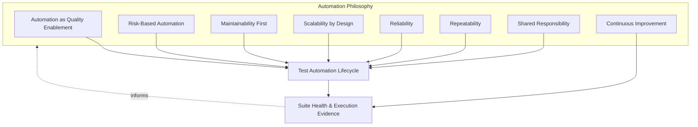
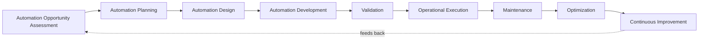
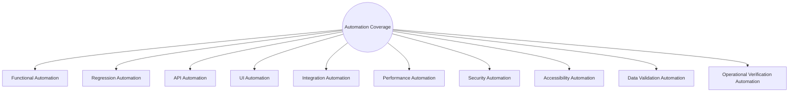
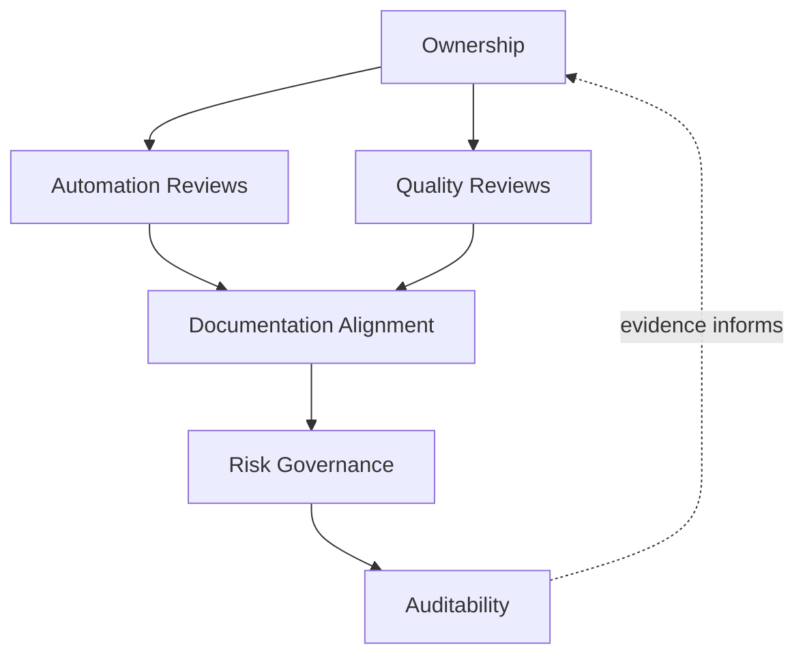
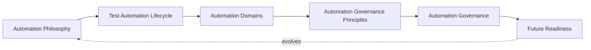
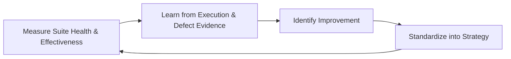

# Enterprise Test Automation Strategy

## 1. Document Purpose

This document defines the official Enterprise Test Automation Strategy for **StackLeo Tech Store**. It establishes automation governance, the automation lifecycle, automation domains, and long-term automation maturity that apply across the entire platform — independent of any specific team, tool, framework, or programming language.

- **Purpose of Enterprise Test Automation** — automation exists to make continuous verification (`testing-strategy.md`, Section 2.4) economically and operationally sustainable at scale; it converts repeatable verification effort into a reliable, repeatable asset so that testing depth can grow with the platform rather than becoming a bottleneck to delivery.
- **Relationship with Testing Strategy** — this document is the automation-specific elaboration of `testing-strategy.md`; it does not redefine testing levels (Section 4) or types (Section 5) established there, but defines how a proportion of that verification is automated, selected, built, and sustained over time.
- **Relationship with Quality Strategy** — automation is one mechanism, among others, by which the quality lifecycle and domains defined in `quality-strategy.md` are continuously verified; automation coverage decisions (Section 5.1) are made in service of those quality domains, not as an independent objective.
- **Relationship with DevOps** — this strategy assumes the delivery cadence and automation-first culture of `07_DEVOPS/devops-principles.md`; automated verification is treated as a first-class citizen of the delivery pipeline described conceptually in `07_DEVOPS/ci-cd-strategy.md`, without prescribing specific pipeline tooling.
- **Relationship with DevSecOps** — Security Automation (Section 4.7) is governed jointly with `07_DEVOPS/devsecops-strategy.md`, embedding automated security verification into the delivery lifecycle rather than treating it as a separate, manually-triggered activity.
- **Relationship with Continuous Delivery** — sustainable continuous delivery depends on fast, trustworthy automated feedback; this strategy exists so that increasing delivery frequency (`07_DEVOPS/ci-cd-strategy.md`) is matched by proportionate, reliable automated verification rather than growing risk.

This document is implementation-independent and vendor-neutral. It defines automation philosophy, lifecycle, domains, and governance — not specific automation frameworks, testing tools, CI/CD platforms, browsers, cloud providers, or programming languages.

## 2. Automation Philosophy

Automation at StackLeo is governed by eight principles. Each exists to produce a specific business outcome — automation is pursued because of the sustainable verification capacity it creates, not as an end in itself.

### 2.1 Automation as Quality Enablement

Automation exists to enable and sustain the quality and testing strategies already defined — it is a means of achieving Continuous Verification (`testing-strategy.md`, Section 2.4), not a parallel objective pursued independently of them.

- **Business Value** — keeps automation investment anchored to genuine quality outcomes, preventing automation effort from becoming disconnected from what it is actually meant to protect.

### 2.2 Risk-Based Automation

What gets automated, and in what order, is determined by business risk and repeatability value, consistent with Risk-Based Testing (`testing-strategy.md`, Section 2.3).

- **Business Value** — directs finite automation investment toward the highest-consequence, most-repeated verification first, maximizing return on a limited engineering resource.

### 2.3 Maintainability First

Automated tests are built to be understood, modified, and sustained over time, treating long-term maintainability as equally important as initial creation speed.

- **Business Value** — prevents the common failure mode where automation investment erodes over time because suites become too costly to maintain, ultimately protecting the durability of the investment itself.

### 2.4 Scalability by Design

Automation is architected to grow in coverage and volume without a proportional increase in maintenance burden or execution time.

- **Business Value** — ensures automation can expand alongside the platform's growth into marketplace, multi-region, and multi-channel operation (Section 7) without becoming a structural constraint on delivery speed.

### 2.5 Reliability

Automated tests produce consistent, trustworthy results — a failure indicates a genuine issue, and a pass indicates genuine confidence, not a coincidence of timing or environment.

- **Business Value** — protects the credibility of automation itself; unreliable automation is worse than no automation, because it trains teams to ignore its signal.

### 2.6 Repeatability

Automated verification produces the same result given the same conditions, every time it runs, forming a dependable basis for release decisions.

- **Business Value** — allows automated evidence to be trusted as a stable input to Release Readiness (`testing-strategy.md`, Section 3.8) and quality gates (Section 5.7).

### 2.7 Shared Responsibility

Automation is owned jointly by Engineering and QA; building and sustaining automated verification is a shared engineering discipline, not a task delegated entirely to a separate automation function.

- **Business Value** — prevents the anti-pattern in Section 9.5, where automation degrades because the teams who write the code being tested have no stake in the automation verifying it.

### 2.8 Continuous Improvement

Automation practice itself is expected to mature over time, informed by real suite health, execution trends, and defect-detection effectiveness.

- **Business Value** — keeps automation's return on investment growing over time rather than allowing suites to stagnate or silently decay in value.

*Diagram 1: Automation Philosophy Overview — the eight principles shape the automation lifecycle, and suite health evidence feeds back into the philosophy itself.*

## 3. Test Automation Lifecycle

Automation is governed across nine conceptual stages, spanning from initial opportunity assessment through operational execution, maintenance, and continuous improvement.

### 3.1 Automation Opportunity Assessment

- **Purpose** — identify which testing effort is genuinely worth automating, based on risk, repeatability, and stability of the capability under test.
- **Business Value** — prevents automation investment in areas that are unstable, low-value, or better suited to manual or exploratory verification.
- **Governance Objectives** — ensure every automation candidate is assessed against consistent, documented criteria before planning begins.

### 3.2 Automation Planning

- **Purpose** — determine scope, priority, and approach for the assessed automation opportunity, coordinated with `test-planning.md`.
- **Business Value** — ensures automation effort is deliberately scheduled and resourced rather than pursued opportunistically without coordination.
- **Governance Objectives** — confirm automation plans trace to a specific risk or coverage gap identified in Section 3.1.

### 3.3 Automation Design

- **Purpose** — define the structure, scope, and expected behavior of the automated verification before construction begins.
- **Business Value** — reduces rework by ensuring automation design is reviewed for maintainability (Section 2.3) and reusability (Section 5.5) before effort is invested in building it.
- **Governance Objectives** — ensure automation design is reviewed against architectural and maintainability standards prior to development.

### 3.4 Automation Development

- **Purpose** — construct the automated verification according to its reviewed design.
- **Business Value** — converts planned, designed verification into a durable, reusable asset that reduces future manual verification effort.
- **Governance Objectives** — ensure development follows agreed design and maintainability conventions consistently across contributors.

### 3.5 Validation

- **Purpose** — confirm that newly developed automation itself behaves correctly and reliably before it is trusted in ongoing use.
- **Business Value** — prevents unreliable automation (Section 2.5) from entering operational use and eroding trust in automated results.
- **Governance Objectives** — require explicit validation sign-off before automation is promoted to operational execution.

### 3.6 Operational Execution

- **Purpose** — run validated automation as a routine part of ongoing delivery and verification activity.
- **Business Value** — delivers the core value automation exists to provide: fast, repeatable, trustworthy verification integrated into everyday delivery.
- **Governance Objectives** — ensure execution results are consistently captured and connected to quality gates (Section 5.7) and release readiness.

### 3.7 Maintenance

- **Purpose** — keep automated verification aligned with an evolving platform, updating it as requirements and behavior legitimately change.
- **Business Value** — protects the automation investment from decaying into irrelevance or, worse, producing misleading results against outdated expectations.
- **Governance Objectives** — ensure maintenance is a planned, tracked activity, not an unmanaged, reactive burden absorbed silently by whoever notices a failure.

### 3.8 Optimization

- **Purpose** — improve the efficiency, reliability, and coverage value of existing automation over time.
- **Business Value** — increases the return generated by existing automation investment without requiring proportional new investment.
- **Governance Objectives** — ensure optimization is informed by genuine suite health and effectiveness evidence (Section 3.9), not assumption.

### 3.9 Continuous Improvement

- **Purpose** — act on suite health trends, execution outcomes, and defect-detection effectiveness to deliberately improve automation practice.
- **Business Value** — ensures automation's value compounds over time rather than remaining static as the platform grows in scale and complexity.
- **Governance Objectives** — ensure improvement actions arising from automation retrospectives are tracked to completion.

### Test Automation Lifecycle Matrix

| Stage | Purpose | Business Value | Governance Objective |
|---|---|---|---|
| Automation Opportunity Assessment | Identify what is genuinely worth automating | Avoids investment in unstable or low-value coverage | Every candidate assessed against consistent criteria |
| Automation Planning | Determine scope, priority, and approach | Effort deliberately scheduled and resourced | Plans trace to an identified risk or coverage gap |
| Automation Design | Define structure and expected behavior before build | Reduces rework via early maintainability review | Design reviewed against architectural standards first |
| Automation Development | Construct automation per reviewed design | Converts effort into a durable, reusable asset | Development follows agreed conventions consistently |
| Validation | Confirm new automation is itself correct and reliable | Prevents unreliable automation entering operational use | Explicit sign-off required before promotion |
| Operational Execution | Run validated automation as routine delivery activity | Delivers fast, repeatable, trustworthy verification | Results captured and connected to quality gates |
| Maintenance | Keep automation aligned with legitimate platform change | Protects investment from decay or misleading results | Maintenance is planned and tracked, not reactive |
| Optimization | Improve efficiency, reliability, and coverage value | Increases return without proportional new investment | Informed by genuine suite health evidence |
| Continuous Improvement | Act on trends to improve automation practice | Automation value compounds over time | Improvement actions tracked to completion |

*Diagram 2: Enterprise Test Automation Lifecycle — a continuous cycle in which operational and optimization evidence directly informs the next iteration of opportunity assessment.*

## 4. Automation Domains

Automation is organized across ten conceptual domains, each corresponding to a distinct verification concern from `testing-strategy.md`. Domains describe *what* is automated; the lifecycle (Section 3) describes *how* automation for any domain is built and sustained.

### 4.1 Functional Automation

- **Purpose** — automate repeatable verification of specified business logic and functional behavior.
- **Scope** — high-repeatability functional scenarios drawn from `testing-strategy.md` (Section 5.1), prioritized by business criticality.
- **Governance Expectations** — automated functional coverage is mapped to acceptance criteria in `02_Product/acceptance-criteria.md`, not built arbitrarily.
- **Business Importance** — protects the platform's core, revenue-generating correctness at a sustainable, repeatable cost.

### 4.2 Regression Automation

- **Purpose** — automate re-verification of previously confirmed behavior so it can be checked efficiently after every change.
- **Scope** — the accumulated set of previously verified, stable business behavior, consistent with `testing-strategy.md` (Section 5.2).
- **Governance Expectations** — regression automation coverage is reviewed periodically to ensure it remains representative of genuinely important behavior, not just historically accumulated tests.
- **Business Importance** — the single highest-leverage automation investment, since regression risk grows with every release regardless of what changed.

### 4.3 API Automation

- **Purpose** — automate verification of service and integration contracts independent of any particular presentation layer.
- **Scope** — request/response behavior, error handling, and contract conformance for internal and external-facing interfaces, per `05_API/api-standards.md`.
- **Governance Expectations** — API automation is prioritized for its typically higher stability and lower maintenance cost relative to UI-level verification.
- **Business Importance** — verifies the contracts multiple channels (web, future mobile, future POS) depend on simultaneously, multiplying its protective value.

### 4.4 UI Automation

- **Purpose** — automate verification of customer- and staff-facing presentation behavior.
- **Scope** — critical customer journeys (per `02_Product/business-workflows.md`) where presentation-layer correctness materially affects the customer experience.
- **Governance Expectations** — UI automation scope is deliberately kept narrow and high-value, in recognition of its comparatively higher fragility and maintenance cost (Section 9.4).
- **Business Importance** — protects the experience layer customers directly interact with, where failure is most immediately visible to revenue and trust.

### 4.5 Integration Automation

- **Purpose** — automate verification that components and services interact correctly across defined boundaries.
- **Scope** — interactions between bounded contexts and with external integrations (payment, courier, communication providers), consistent with `testing-strategy.md` (Section 4.3).
- **Governance Expectations** — integration automation is prioritized wherever a boundary crosses an external dependency, given the higher consequence of undetected boundary defects.
- **Business Importance** — protects against the class of defect most likely to be missed by functional automation confined to a single component.

### 4.6 Performance Automation

- **Purpose** — automate repeatable measurement of platform responsiveness under defined conditions.
- **Scope** — critical-path customer journeys and backend processing, consistent with `testing-strategy.md` (Section 5.5).
- **Governance Expectations** — performance automation results are evaluated against explicit, documented thresholds, not subjective impression.
- **Business Importance** — provides early, repeatable warning of performance regression before it reaches customers and affects conversion.

### 4.7 Security Automation

- **Purpose** — automate repeatable verification of baseline security expectations as an integral part of delivery.
- **Scope** — governed jointly with `07_DEVOPS/devsecops-strategy.md` and `06_Security/security-principles.md`; covers verification that can be reliably and repeatably automated, complementing rather than replacing deeper manual security assessment.
- **Governance Expectations** — security automation failures are treated as release-blocking with the same rigor as functional automation failures.
- **Business Importance** — embeds StackLeo's core trust differentiator into everyday delivery rather than relying solely on periodic manual review.

### 4.8 Accessibility Automation

- **Purpose** — automate repeatable verification of baseline accessibility conformance.
- **Scope** — customer-facing experiences, evaluated against the WCAG-aligned expectation in `02_Product/non-functional-requirements.md`, complementing but not replacing manual accessibility assessment.
- **Governance Expectations** — accessibility automation results feed the same release-blocking gate as manual accessibility testing (`testing-strategy.md`, Section 5.7).
- **Business Importance** — makes ongoing accessibility conformance economically sustainable as the platform grows, rather than dependent on periodic manual audit alone.

### 4.9 Data Validation Automation

- **Purpose** — automate verification of data correctness, consistency, and integrity across processing and storage.
- **Scope** — data transformations and consistency rules significant to business and financial correctness, consistent with `04_Database/data-governance.md`.
- **Governance Expectations** — data validation automation coverage is prioritized for financially or operationally critical data (orders, payments, inventory).
- **Business Importance** — protects the accuracy of information the business and its customers rely on for financial and operational decisions.

### 4.10 Operational Verification Automation

- **Purpose** — automate confirmation that the platform's operational health and readiness signals behave as expected.
- **Scope** — health checks, diagnostic signals, and recovery behavior, consistent with `07_DEVOPS/observability-strategy.md` and Operational Readiness Testing (`testing-strategy.md`, Section 4.7).
- **Governance Expectations** — operational verification automation is treated as a release-gating check for capability with production operational impact.
- **Business Importance** — provides continuous, low-cost assurance that the organization's ability to detect and respond to production issues remains intact.

### Automation Domain Matrix

| Domain | Purpose | Governance Expectations | Business Importance |
|---|---|---|---|
| Functional Automation | Automate repeatable verification of business logic | Coverage mapped to acceptance criteria | Protects core revenue-generating correctness at sustainable cost |
| Regression Automation | Automate re-verification of previously confirmed behavior | Coverage reviewed periodically for continued relevance | Highest-leverage investment; regression risk grows every release |
| API Automation | Automate verification of service/integration contracts | Prioritized for stability and lower maintenance cost | Verifies contracts multiple channels depend on simultaneously |
| UI Automation | Automate verification of presentation behavior | Scope kept narrow and high-value given fragility | Protects the experience layer most visible to customers |
| Integration Automation | Automate verification of cross-boundary interaction | Prioritized at external-dependency boundaries | Catches boundary defects other automation domains miss |
| Performance Automation | Automate repeatable responsiveness measurement | Evaluated against explicit, documented thresholds | Early warning of regression before it reaches customers |
| Security Automation | Automate baseline security verification | Failures release-blocking, same rigor as functional | Embeds trust differentiator into everyday delivery |
| Accessibility Automation | Automate baseline accessibility conformance checks | Feeds the same release-blocking gate as manual testing | Makes ongoing conformance economically sustainable at scale |
| Data Validation Automation | Automate data correctness and integrity verification | Prioritized for financially/operationally critical data | Protects accuracy of business- and customer-critical data |
| Operational Verification Automation | Automate confirmation of operational health signals | Release-gating for production operational impact | Continuous assurance of incident detection/response capability |

*Diagram 3: Automation Coverage Model — ten coverage domains, each independently governed but collectively forming the platform's automated verification footprint.*

## 5. Automation Governance Principles

- **Test Selection Strategy** — what is automated is chosen deliberately using Automation Opportunity Assessment (Section 3.1), favoring stable, high-repeatability, high-risk verification over unstable or one-off scenarios better suited to manual or exploratory testing.
- **Automation Coverage** — coverage decisions are expressed relative to business risk and the domains in Section 4, not as an undifferentiated percentage target pursued for its own sake.
- **Automation ROI Awareness** — automation investment is continually weighed against the manual effort it replaces and the maintenance cost it introduces; automation that costs more to sustain than it saves is a candidate for retirement or redesign, not indefinite continuation.
- **Stability** — automation targets capability that is sufficiently stable to justify the investment; automating against rapidly changing, unstable capability produces a high-maintenance, low-value outcome (Section 9.4).
- **Reusability** — automated verification is designed to be reused across scenarios and, where legitimate, across testing levels, avoiding duplicated effort that multiplies maintenance cost without multiplying protective value.
- **Traceability** — every piece of automated verification traces to a requirement, risk, or acceptance criterion it exists to verify, consistent with Traceability in `test-planning.md` (Section 2.4).
- **Quality Gates** — automated verification results are a first-class input to the quality gates defined in `test-planning.md` (Section 5) and Release Readiness (`testing-strategy.md`, Section 3.8), not an informal or advisory signal.

### Automation Governance Principle Matrix

| Principle | Description | Business Value |
|---|---|---|
| Test Selection Strategy | Automate stable, high-repeatability, high-risk verification deliberately | Directs investment where it returns the most protective value |
| Automation Coverage | Express coverage relative to risk, not an undifferentiated target | Keeps coverage meaningful rather than a vanity metric |
| Automation ROI Awareness | Continually weigh investment against manual effort saved and cost incurred | Prevents sustaining automation that costs more than it saves |
| Stability | Automate only sufficiently stable capability | Avoids high-maintenance, low-value automation |
| Reusability | Design automation for reuse across scenarios/levels | Avoids duplicated effort and multiplied maintenance cost |
| Traceability | Trace every automated check to a requirement or risk | Enables defensible, evidence-based quality gate decisions |
| Quality Gates | Treat automated results as first-class gate input | Makes automated evidence a genuine driver of release decisions |

## 6. Automation Governance

### 6.1 Ownership

Every automation domain (Section 4) has a single accountable owner; overall automation governance is owned jointly by Engineering and QA leadership, consistent with Shared Responsibility (Section 2.7).

### 6.2 Automation Reviews

Automation design and suite health are formally reviewed against maintainability (Section 2.3) and stability (Section 5.4) expectations on a recurring basis, not only when a suite has already become a visible problem.

### 6.3 Quality Reviews

Automation outcomes are reviewed against the quality expectations defined in `quality-strategy.md` (Section 4) and testing levels/types in `testing-strategy.md` (Sections 4–5), ensuring automated evidence is interpreted in the context of overall platform quality.

### 6.4 Documentation Alignment

Automation documentation is kept consistent with `testing-strategy.md`, `test-planning.md`, `03_System_Design`, and `07_DEVOPS`; automation that verifies against outdated requirements or architecture is treated as a governance gap, not a valid result.

### 6.5 Risk Governance

Automation-related risk — untested critical paths, known-fragile suites, deferred maintenance — is tracked, prioritized, and escalated consistently, ensuring accepted risk is always a deliberate, accountable decision.

### 6.6 Auditability

Automation design decisions, validation sign-offs, and execution evidence are retained in a form that can be independently reviewed after the fact, supporting internal governance and the compliance posture referenced in `06_Security/compliance.md`.

### Automation Governance Matrix

| Governance Area | Objective |
|---|---|
| Ownership | Every automation domain has one accountable owner |
| Automation Reviews | Suite health and maintainability reviewed on a recurring basis |
| Quality Reviews | Automated evidence interpreted in context of overall platform quality |
| Documentation Alignment | Automation stays consistent with testing, planning, and architecture documentation |
| Risk Governance | Accepted automation risk is always a deliberate, accountable decision |
| Auditability | Design, validation, and execution evidence retained for independent review |

### Governance Responsibility Matrix

| Role | Responsibility |
|---|---|
| Head of Quality / QA Leadership | Owns coherence and enforcement of this automation strategy, in partnership with Engineering leadership. |
| Automation Architect / Lead | Owns automation architecture principles, design review, and suite health across domains (Section 4). |
| Engineering Leads | Ensure automation for their domain is built, maintained, and reviewed as a shared engineering responsibility (Section 2.7). |
| QA / Test Architects | Ensure automation selection and coverage remain aligned with `testing-strategy.md` and `test-planning.md`. |
| Security Lead | Ensures Security Automation (Section 4.7) reflects `06_Security/security-principles.md` and `07_DEVOPS/devsecops-strategy.md`. |
| Release Manager | Ensures automated quality gate results are genuinely incorporated into release readiness decisions. |
| Internal Audit / Review Function | Independently verifies that automation governance records reflect actual practice. |

*Diagram 4: Automation Governance Framework — ownership anchors review activity, which feeds documentation alignment, risk governance, and ultimately auditable evidence.*

*Diagram 5: Test Automation Operating Model — how philosophy, lifecycle, domains, governance principles, and governance operate together as a single, self-reinforcing system that continues to evolve as the platform grows.*

## 7. Future Readiness

This strategy is designed to remain valid as StackLeo evolves in scale and architectural complexity, without requiring redefinition of its underlying philosophy.

- **Cloud-Native Platforms** — automation domains (Section 4) are defined independently of any specific runtime or deployment model, so they apply unchanged as infrastructure evolves, consistent with `03_System_Design/deployment-architecture.md`.
- **Microservices** — as the platform decomposes into further bounded services per `03_System_Design/service-architecture.md`, API and Integration Automation (Sections 4.3, 4.5) grow in relative importance, and automation ownership extends naturally to service-level teams.
- **AI-Assisted Testing** — where AI-assisted techniques are introduced to support automation activity (e.g., assisting test selection or maintenance), they are governed under the same Maintainability First and Reliability principles (Sections 2.3, 2.5) as any other automation practice, never adopted as an unreviewed shortcut around governance.
- **Marketplace Platform** — the multi-vendor marketplace model extends Functional, Data Validation, and Security Automation (Sections 4.1, 4.9, 4.7) to cover seller-supplied content and listings, applying the same selection rigor (Section 5.1) used for StackLeo's own catalog today.
- **Multi-Tenant Architecture** — where future architecture introduces tenant isolation, Integration and Security Automation (Sections 4.5, 4.7) extend to explicitly verify cross-tenant isolation as an automated, repeatable check.
- **Continuous Delivery** — as delivery cadence accelerates per `07_DEVOPS/ci-cd-strategy.md`, automated verification becomes proportionally more central to Release Readiness, reinforcing Reliability and Repeatability (Sections 2.5–2.6) as non-negotiable properties of the suite.
- **Multi-Region Operations** — as StackLeo expands from Bangladesh into South Asia and beyond, automated verification extends to cover regional conditions, localization, and data residency expectations without requiring a new automation model.
- **Global Engineering Teams** — the lifecycle, domains, and governance defined in Sections 3–6 are defined independently of team size, location, or organizational structure, so they remain coherent as engineering scales beyond a single, co-located team.

## 8. Governance

- **Ownership** — the Head of Quality (or equivalent accountable executive function) owns this strategy and is accountable for its consistent application across the platform, in partnership with Engineering leadership.
- **Review Process** — this strategy is formally reviewed whenever a material change occurs in business model (`01_Business/business-model.md`), architecture (`03_System_Design`), or delivery practice (`07_DEVOPS`), and on a regular recurring cadence independent of specific change events.
- **Automation Policies** — subordinate, practice-specific automation documents (suite health standards, maintenance policy, coverage reporting, and further documents within `08_QUALITY_ASSURANCE`) must remain consistent with the philosophy, lifecycle, and domains defined here.
- **Audit Readiness** — this strategy and the evidence it requires (Section 6.6) are maintained in a state ready for internal or external audit at any time, without requiring advance preparation.
- **Continuous Improvement** — this strategy itself is subject to Continuous Improvement (Section 3.9); its effectiveness is periodically assessed and revised based on genuine suite health, execution trends, and organizational evidence.

*Diagram 6: Continuous Automation Improvement Cycle — automation outcomes are measured, learned from, improved upon, and standardized back into this strategy, on a continuing basis.*

## 9. Anti-Patterns

The following recurring failure patterns are explicitly recognized and avoided, as each one structurally undermines this strategy.

| Anti-Pattern | Why It's Avoided |
|---|---|
| Automating Everything | Contradicts Risk-Based Automation (Section 2.2) and Test Selection Strategy (Section 5.1); indiscriminate automation wastes investment on low-value, unstable, or one-off scenarios. |
| Poor Test Selection | Undermines Automation Opportunity Assessment (Section 3.1); automating the wrong things produces a suite that is costly without being genuinely protective. |
| Fragile Automation | Contradicts Reliability and Stability (Sections 2.5, 5.4); automation that fails for reasons unrelated to genuine defects erodes trust in automated results. |
| High Maintenance Suites | Contradicts Maintainability First (Section 2.3); suites that cost more to maintain than they save violate Automation ROI Awareness (Section 5.3). |
| Weak Governance | Undermines Section 6; without ownership and review, automation quality and relevance silently decay over time. |
| Reactive Automation | Contradicts Automation as Quality Enablement (Section 2.1); automation built only after a defect has already reached production is protecting against yesterday's failure, not tomorrow's risk. |
| Poor Documentation | Undermines Documentation Alignment (Section 6.4) and Auditability (Section 6.6), leaving automation intent and coverage unclear or unverifiable after the fact. |
| Missing Continuous Improvement | Contradicts Section 2.8 and Section 3.9; without deliberate improvement, automation's return on investment stagnates or declines as the platform grows in complexity. |

## 10. Document Information

| Property | Value |
|----------|-------|
| Document | test-automation-strategy.md |
| Version | 1.0.0 |
| Status | Active |
| Maintained By | StackLeo |
| Last Updated | 2026-07-24 |

---

© StackLeo. All Rights Reserved.
