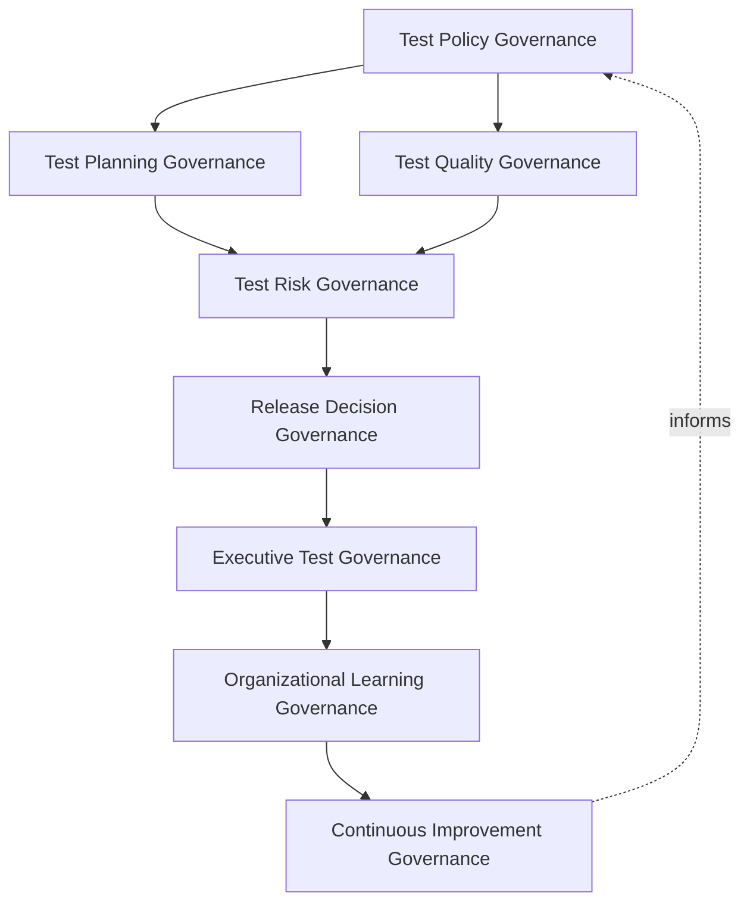
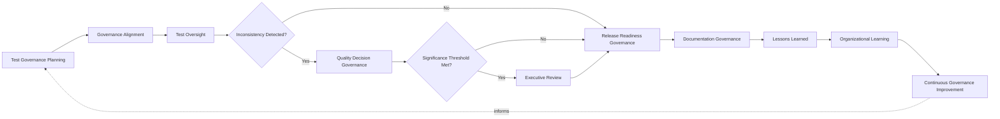
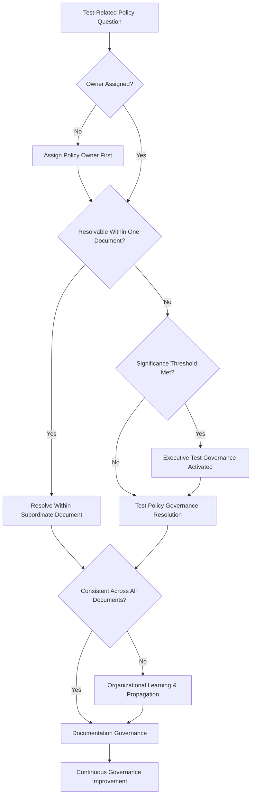
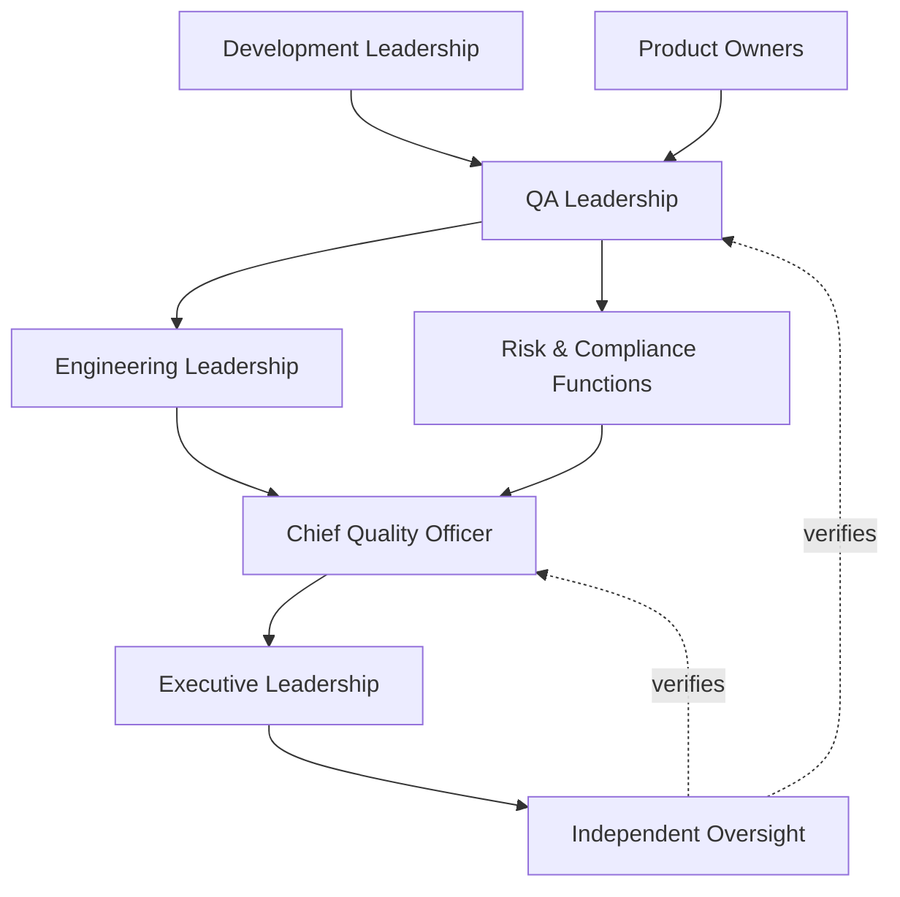
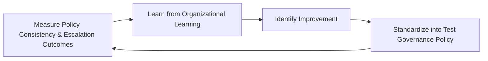
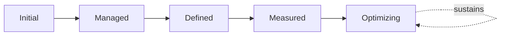

# Enterprise Test Governance Framework

## 1. Document Purpose

This document defines the official Enterprise Test Governance Framework for **StackLeo Tech Store** — the CQO/VP-of-Engineering-owned executive charter under which test-related policy, cross-document decision consistency, and organizational accountability for testing governance itself are governed as a deliberate discipline. It establishes governance for test policy, quality decision-making, governance consistency, executive oversight, and long-term testing governance maturity across the StackLeo platform, consistent with ISTQB Advanced Level practice, IEEE 29119, ISO 9001, COBIT governance principles, and TOGAF enterprise architecture thinking.

This framework occupies a distinct, higher tier than the testing and quality documents already governing this folder. `testing-governance.md` governs testing as a practice — test strategy, risk-based testing, environment and data governance, release quality evidence. `quality-assurance-framework.md` governs quality as an enterprise-wide cultural capability. `qa-governance.md` governs the operating model — who decides, and through what process — for the whole `08_QUALITY_ASSURANCE` folder. This framework governs none of that directly. It is the policy and consistency layer that sits above all three: the single source of authoritative test-related policy those documents must remain consistent with, and the escalation path when a test-related decision cannot be resolved coherently within any one of them alone. Where those documents answer "how is testing done, and how is quality culture cultivated," this framework answers "what is the policy every test-related governance decision must honor, and who resolves it when documents would otherwise disagree."

- **Purpose of Test Governance** — to ensure that test-related policy is authored once, applied consistently across every subordinate testing and quality document, and enforced through a single, accountable executive decision path, rather than allowed to drift into inconsistent or contradictory interpretation across the organization.
- **Relationship with Testing Strategy** — `testing-strategy.md` and `testing-governance.md` define testing practice and its governance in full operational depth; this framework defines the policy boundaries within which both must remain consistent, without restating their lifecycle, level, or domain detail.
- **Relationship with Quality Assurance** — `qa-governance.md` and `quality-assurance-framework.md` govern the QA operating model and quality culture respectively; this framework ensures test-specific policy never diverges from the broader quality policy those documents establish.
- **Relationship with Software Delivery** — this framework anchors the ultimate policy authority behind release decisions, coordinated with `release-quality-gates.md` and `07_DEVOPS/release-management.md`, ensuring "release-ready" carries one consistent meaning across every document that invokes it.
- **Relationship with Risk Management** — this framework connects test-related risk acceptance policy directly to `06_Security/enterprise-risk-management-strategy.md`, ensuring every subordinate document applies the same risk framework rather than an independently invented one.
- **Relationship with Executive Decision-Making** — this framework is itself the top decision-rights authority for test governance; it exists so executive leadership has one place to look when a test-related policy question needs a final, accountable answer.
- **Relationship with Compliance** — this framework ensures test-related compliance obligations, coordinated with `06_Security/compliance-governance.md`, are interpreted identically wherever they are referenced across testing and quality documentation.

This document is implementation-independent and vendor-neutral. It defines test governance policy, model, domains, and lifecycle conceptually — not specific testing tools, test management platforms, automation frameworks, cloud testing services, consulting firms, commercial products, test execution procedures, test case development, automation implementation, testing workflows, infrastructure configurations, deployment pipelines, implementation roadmaps, or code.

## 2. Test Governance Philosophy

Test governance at StackLeo rests on eight principles. Each exists to produce a specific business outcome — governance of testing governance itself is pursued deliberately because policy inconsistency, left unaddressed, quietly undermines every document that depends on it.

### 2.1 Governance Before Testing

Test-related policy is established before subordinate testing and quality documents are written or revised, not inferred retroactively from whatever practice happens to exist.

- **Business Value** — ensures every testing and quality document is built on a stable, authoritative policy foundation rather than reconciled after the fact.

### 2.2 Quality as a Business Objective

Test governance treats quality as a genuine business objective with direct commercial consequence, not a technical concern isolated from business decision-making.

- **Business Value** — keeps test-related policy decisions connected to genuine business priority, never treated as a purely technical matter beneath executive attention.

### 2.3 Risk-Aware Decision Making

Test governance policy decisions are weighted by genuine business, customer, and financial risk, consistent with the enterprise risk framework this policy layer connects to.

- **Business Value** — ensures policy-level scrutiny is directed where a genuine inconsistency or gap would cause the greatest harm.

### 2.4 Accountability

Every policy this framework establishes traces to a specific, named, responsible owner.

- **Business Value** — ensures no test-related policy question is left unresolved for lack of a clear, accountable decision-maker.

### 2.5 Transparency

Test governance policy, decisions, and their rationale are documented and visible to every subordinate document and function that depends on them.

- **Business Value** — allows policy consistency to be verified and defended, rather than assumed.

### 2.6 Traceability

Every policy decision this framework makes can be traced back to the specific inconsistency, gap, or risk that required it.

- **Business Value** — ensures policy exists because it was genuinely needed, not as speculative or precautionary accumulation.

### 2.7 Business Alignment

Test governance policy is made in service of genuine business priority, ensuring consistency effort is directed where divergence would matter most.

- **Business Value** — ensures limited governance attention is directed toward what genuinely matters most to the business.

### 2.8 Continuous Improvement

Test governance policy matures over time, informed by real inconsistencies discovered, escalations resolved, and the organization's growth in scale and complexity.

- **Business Value** — keeps this framework aligned with StackLeo's growth in scale, market reach, and organizational complexity.

## 3. Enterprise Test Governance Model

Test governance operates across eight conceptual policy layers, each holding accountability for a distinct dimension of consistency across StackLeo's testing and quality documentation. Each layer governs policy and consistency — the operational practice it applies to remains owned by `testing-governance.md`, `quality-assurance-framework.md`, and `qa-governance.md`.

### 3.1 Test Policy Governance

- **Purpose** — own the single, authoritative statement of test-related policy that every subordinate document must remain consistent with.
- **Governance Scope** — oversight of policy statements referenced across `testing-strategy.md`, `testing-governance.md`, `quality-assurance-framework.md`, and `qa-governance.md`.
- **Business Value** — ensures a test-related question has exactly one authoritative answer, never several conflicting ones.
- **Executive Expectations** — leadership trusts test policy is authored once and applied consistently everywhere it applies.

### 3.2 Test Planning Governance

- **Purpose** — own the policy-level consistency of how testing-related planning decisions are made across functions and domains.
- **Governance Scope** — oversight of planning policy referenced in `testing-strategy.md` (Test Planning) and `testing-governance.md` (Quality Planning).
- **Business Value** — ensures planning decisions across different domains apply compatible logic, not independently invented criteria.
- **Executive Expectations** — leadership trusts planning policy is coherent across the whole organization, not domain by domain.

### 3.3 Test Quality Governance

- **Purpose** — own the policy-level definition of what "acceptable quality" means across the enterprise.
- **Governance Scope** — oversight ensuring `quality-strategy.md`, `quality-assurance-framework.md`, and `testing-governance.md` apply one consistent definition of acceptable quality.
- **Business Value** — prevents the same capability being judged against different, unreconciled quality standards depending on which document is consulted.
- **Executive Expectations** — leadership trusts "acceptable quality" carries the same meaning everywhere it is invoked.

### 3.4 Test Risk Governance

- **Purpose** — own the policy connecting test-related risk acceptance decisions to `06_Security/enterprise-risk-management-strategy.md`.
- **Governance Scope** — oversight ensuring every subordinate document's risk-based prioritization uses the same enterprise risk framework.
- **Business Value** — ensures accepted testing risk is always evaluated against one consistent standard, not several local ones.
- **Executive Expectations** — leadership trusts test risk decisions are never quietly more lenient in one document than another.

### 3.5 Release Decision Governance

- **Purpose** — own the ultimate policy defining what "release-ready" means at the highest level.
- **Governance Scope** — oversight coordinated with `release-quality-gates.md`, Release Quality Governance (`testing-governance.md`, Section 3.6), and `07_DEVOPS/release-management.md`.
- **Business Value** — ensures the release decision rests on one authoritative definition of readiness, not competing interpretations.
- **Executive Expectations** — leadership trusts "release-ready" is never redefined informally to accommodate schedule pressure.

### 3.6 Executive Test Governance

- **Purpose** — own executive-level accountability for the test policy questions carrying the greatest organizational consequence.
- **Governance Scope** — oversight spanning Sections 3.1–3.5 and 3.7 wherever a policy question cannot be resolved coherently within a subordinate document alone.
- **Business Value** — ensures the most consequential policy gaps or conflicts are resolved at the level accountable for the organization as a whole.
- **Executive Expectations** — leadership expects to be the final word when subordinate documents cannot resolve a conflict themselves.

### 3.7 Organizational Learning Governance

- **Purpose** — own the coherence of how the organization converts resolved policy inconsistencies into durable, shared organizational learning.
- **Governance Scope** — oversight of Organizational Learning (Section 5.9) across every domain in Section 4.
- **Business Value** — ensures a resolved inconsistency strengthens the whole body of testing and quality documentation, not only the document where it surfaced.
- **Executive Expectations** — leadership expects every significant policy resolution to produce a documented, attributable lesson.

### 3.8 Continuous Improvement Governance

- **Purpose** — govern the mechanism by which every other layer in this model matures over time.
- **Governance Scope** — consolidates findings from policy escalations, audits, and organizational learning across every domain in Section 4.
- **Business Value** — prevents this framework itself from becoming the next thing that quietly stagnates as the organization scales.
- **Executive Expectations** — leadership expects test governance maturity to be assessed periodically, not assumed static once established.

### Enterprise Test Governance Matrix

| Layer | Purpose | Business Value | Executive Expectations |
|---|---|---|---|
| Test Policy Governance | Own the single authoritative statement of test-related policy | Ensures a test-related question has exactly one authoritative answer | Trusts policy is authored once, applied consistently everywhere |
| Test Planning Governance | Own policy-level consistency of planning decisions across functions | Ensures compatible planning logic, not invented independently | Trusts planning policy is coherent across the whole organization |
| Test Quality Governance | Own the policy-level definition of acceptable quality | Prevents unreconciled quality standards across documents | Trusts acceptable quality carries the same meaning everywhere |
| Test Risk Governance | Own the policy connecting risk decisions to enterprise risk | Ensures accepted risk evaluated against one consistent standard | Trusts risk decisions are never quietly more lenient in one place |
| Release Decision Governance | Own the ultimate policy defining release-readiness | Ensures release rests on one authoritative definition | Trusts readiness is never informally redefined under pressure |
| Executive Test Governance | Own executive accountability for highest-consequence policy questions | Resolves the most consequential conflicts at the accountable level | Expects to be the final word when documents cannot resolve conflict |
| Organizational Learning Governance | Own coherence of converting resolutions into shared learning | Strengthens the whole body of documentation, not just one document | Expects every significant resolution to produce a documented lesson |
| Continuous Improvement Governance | Govern maturation of every other layer | Prevents this framework itself from stagnating | Expects maturity to be assessed periodically |

*Diagram 1: Enterprise Test Governance Framework — policy governance branches into planning and quality governance, converging on risk governance ahead of release decision governance, resolving into executive oversight and organizational learning that feeds continuous improvement back into the model.*

## 4. Enterprise Test Governance Domains

Test governance policy is exercised across ten conceptual domains, each requiring a distinct consistency emphasis. Each domain governs the policy-level consistency of the corresponding testing or quality area — the operational governance of that area itself remains owned by `testing-governance.md`.

### 4.1 Functional Test Governance

- **Purpose** — govern policy consistency for what functional testing must achieve, wherever it is referenced across subordinate documents.
- **Governance Considerations** — governed under Test Quality Governance (Section 3.3), ensuring `testing-strategy.md` and `testing-governance.md` apply one consistent functional standard.
- **Business Importance** — protects the most directly customer-visible and revenue-affecting form of correctness from inconsistent policy interpretation.
- **Executive Expectations** — leadership expects "functionally correct" to mean the same thing in every document that uses the term.

### 4.2 Integration Test Governance

- **Purpose** — govern policy consistency for how integration boundaries are defined and treated as testing-critical.
- **Governance Considerations** — governed under Test Policy Governance (Section 3.1), ensuring boundary definitions remain consistent across documentation.
- **Business Importance** — protects against the specific class of defect that arises when boundary definitions are inconsistently understood.
- **Executive Expectations** — leadership expects a consistent definition of what constitutes a genuine integration boundary.

### 4.3 System Test Governance

- **Purpose** — govern policy consistency for what constitutes acceptable system-level verification before acceptance testing.
- **Governance Considerations** — governed under Test Quality Governance (Section 3.3), coordinated with Release Decision Governance (Section 3.5).
- **Business Importance** — protects the checkpoint at which the platform is first verified as customers will genuinely experience it.
- **Executive Expectations** — leadership expects system-level policy to be applied identically regardless of which team delivers a capability.

### 4.4 Security Test Governance

- **Purpose** — govern policy consistency for how security testing obligations are interpreted across subordinate documents.
- **Governance Considerations** — governed jointly with, and never superseding, `06_Security/security-governance.md`, which remains authoritative for security-specific obligations.
- **Business Importance** — protects StackLeo's core trust differentiator from inconsistent security testing policy interpretation.
- **Executive Expectations** — leadership expects security test policy to carry mandatory, non-negotiable weight in every document that references it.

### 4.5 Performance Test Governance

- **Purpose** — govern policy consistency for what constitutes acceptable performance verification for critical-path capability.
- **Governance Considerations** — governed under Test Risk Governance (Section 3.4), coordinated with `03_System_Design/quality-attributes.md`.
- **Business Importance** — protects conversion and customer trust from inconsistent performance policy interpretation.
- **Executive Expectations** — leadership expects one consistent policy defining which capability requires performance verification.

### 4.6 Accessibility Test Governance

- **Purpose** — govern policy consistency for treating accessibility as release-blocking across every subordinate document.
- **Governance Considerations** — governed under Test Policy Governance (Section 3.1), ensuring the same accessibility standard applies everywhere.
- **Business Importance** — protects StackLeo's addressable market and brand commitment from inconsistent accessibility interpretation.
- **Executive Expectations** — leadership expects accessibility policy to be applied without exception, regardless of the delivering team.

### 4.7 Compliance Test Governance

- **Purpose** — govern policy consistency for how test-related regulatory and contractual obligations are interpreted across documents.
- **Governance Considerations** — governed under Executive Test Governance (Section 3.6), coordinated with `06_Security/compliance-governance.md`.
- **Business Importance** — protects the business's standing with regulators from inconsistent compliance testing interpretation.
- **Executive Expectations** — leadership expects compliance test policy to be interpreted identically across every referencing document.

### 4.8 Operational Readiness Governance

- **Purpose** — govern policy consistency for what constitutes genuine operational readiness before customer exposure.
- **Governance Considerations** — governed under Release Decision Governance (Section 3.5), coordinated with `09_OPERATIONS/operational-excellence-framework.md`.
- **Business Importance** — protects the business's ability to sustain and recover a capability once customers depend on it.
- **Executive Expectations** — leadership expects one consistent readiness definition, not one that varies by release.

### 4.9 Customer Experience Validation

- **Purpose** — govern policy consistency for how genuine customer fitness for purpose is confirmed across subordinate documents.
- **Governance Considerations** — governed under Test Quality Governance (Section 3.3), coordinated with Quality Validation Governance (`quality-assurance-framework.md`, Section 5.4).
- **Business Importance** — protects against a capability being technically correct while still failing the real customer it was built for.
- **Executive Expectations** — leadership expects customer validation policy to apply consistently regardless of capability or team.

### 4.10 Enterprise Release Governance

- **Purpose** — govern policy consistency for the ultimate, organization-wide release decision.
- **Governance Considerations** — governed exclusively under Release Decision Governance (Section 3.5) and Executive Test Governance (Section 3.6).
- **Business Importance** — protects the organization's most consequential recurring decision — what reaches customers and when.
- **Executive Expectations** — leadership expects direct, deliberate engagement whenever release policy itself is in question.

### Enterprise Test Domain Matrix

| Domain | Purpose | Business Importance | Executive Expectations |
|---|---|---|---|
| Functional Test Governance | Govern policy consistency for functional testing standards | Protects the most customer-visible correctness from inconsistent policy | Expects "functionally correct" to mean the same thing everywhere |
| Integration Test Governance | Govern policy consistency for integration boundary definitions | Protects against inconsistently understood boundaries | Expects a consistent definition of a genuine integration boundary |
| System Test Governance | Govern policy consistency for system-level verification standards | Protects the checkpoint verifying the platform as customers experience it | Expects identical policy regardless of delivering team |
| Security Test Governance | Govern policy consistency for security testing obligations | Protects the core trust differentiator from inconsistent interpretation | Expects mandatory, non-negotiable weight everywhere referenced |
| Performance Test Governance | Govern policy consistency for performance verification standards | Protects conversion and trust from inconsistent policy interpretation | Expects one consistent policy on what requires verification |
| Accessibility Test Governance | Govern policy consistency for release-blocking accessibility treatment | Protects addressable market and brand commitment | Expects policy applied without exception |
| Compliance Test Governance | Govern policy consistency for regulatory and contractual obligations | Protects standing with regulators from inconsistent interpretation | Expects identical interpretation across every referencing document |
| Operational Readiness Governance | Govern policy consistency for genuine operational readiness | Protects the ability to sustain and recover once customers depend on it | Expects one consistent readiness definition |
| Customer Experience Validation | Govern policy consistency for confirming genuine fitness for purpose | Protects against technically correct capability failing real customers | Expects consistent application regardless of capability or team |
| Enterprise Release Governance | Govern policy consistency for the ultimate release decision | Protects the organization's most consequential recurring decision | Expects direct engagement whenever release policy is in question |

## 5. Enterprise Test Governance Lifecycle

Test governance operates across ten conceptual lifecycle stages, applicable across every domain in Section 4.

### 5.1 Test Governance Planning

- **Purpose** — govern how this framework's policy priorities are determined before subordinate documents are authored or revised.
- **Governance Objectives** — apply Governance Before Testing (Section 2.1) from the earliest planning point.
- **Business Value** — ensures policy exists deliberately, ahead of the documents that will depend on it.

### 5.2 Governance Alignment

- **Purpose** — govern how a subordinate document's practice is confirmed consistent with this framework's policy.
- **Governance Objectives** — apply Test Policy Governance (Section 3.1) consistently across every subordinate document.
- **Business Value** — ensures every testing and quality document remains genuinely aligned to one authoritative policy source.

### 5.3 Test Oversight

- **Purpose** — govern the ongoing observation of whether subordinate documents and their practice remain policy-consistent.
- **Governance Objectives** — apply Transparency (Section 2.5) to keep inconsistency visible while it can still be corrected.
- **Business Value** — surfaces policy drift before it compounds into genuinely conflicting practice.

### 5.4 Quality Decision Governance

- **Purpose** — govern how a quality-related policy question is resolved when a subordinate document alone cannot resolve it.
- **Governance Objectives** — apply Test Quality Governance (Section 3.3) to produce one authoritative, documented answer.
- **Business Value** — prevents the same question from being answered differently depending on who is asked.

### 5.5 Executive Review

- **Purpose** — govern the point at which a policy question requires executive-level visibility or decision.
- **Governance Objectives** — apply Executive Test Governance (Section 3.6) against clearly understood significance thresholds.
- **Business Value** — ensures leadership is engaged exactly when genuinely warranted.

### 5.6 Release Readiness Governance

- **Purpose** — govern how this framework's release-readiness policy is applied to a specific release decision.
- **Governance Objectives** — apply Release Decision Governance (Section 3.5), never bypassed under schedule pressure.
- **Business Value** — ensures every release decision rests on the same authoritative readiness definition.

### 5.7 Documentation Governance

- **Purpose** — govern the completeness and integrity of the policy record itself.
- **Governance Objectives** — require documentation to remain consistent with `testing-governance.md`, `quality-assurance-framework.md`, and `qa-governance.md` as they evolve.
- **Business Value** — ensures the organization retains a genuine, trustworthy record of policy and the reasoning behind it.

### 5.8 Lessons Learned

- **Purpose** — formally capture what a resolved policy question reveals about this framework itself.
- **Governance Objectives** — require lessons to be documented and attributed to specific policy implications.
- **Business Value** — ensures the organization genuinely learns from experience rather than repeating the same inconsistency.

### 5.9 Organizational Learning

- **Purpose** — govern how policy lessons are propagated back to every subordinate document they affect.
- **Governance Objectives** — apply Organizational Learning Governance (Section 3.7) to ensure lessons reach every relevant document.
- **Business Value** — ensures a resolved inconsistency does not simply resurface in a different document later.

### 5.10 Continuous Governance Improvement

- **Purpose** — apply accumulated lessons to strengthen this framework's future policy and consistency practice.
- **Governance Objectives** — require findings to be genuinely analyzed for recurring patterns, consistent with Section 3.8.
- **Business Value** — turns each resolved inconsistency into an input that makes future policy governance genuinely stronger.

### Enterprise Test Governance Lifecycle Matrix

| Stage | Purpose | Governance Objective | Business Value |
|---|---|---|---|
| Test Governance Planning | Determine policy priorities before documents are authored | Applied from the earliest planning point | Ensures policy exists deliberately, ahead of dependent documents |
| Governance Alignment | Confirm a document's practice is policy-consistent | Applied consistently across every subordinate document | Ensures genuine alignment to one authoritative policy source |
| Test Oversight | Observe ongoing policy consistency across documents | Keeps inconsistency visible while correctable | Surfaces policy drift before it compounds |
| Quality Decision Governance | Resolve a quality policy question documents cannot resolve alone | Produces one authoritative, documented answer | Prevents the same question being answered differently |
| Executive Review | Elevate policy questions requiring executive visibility | Applied against clear significance thresholds | Engages leadership exactly when warranted |
| Release Readiness Governance | Apply release-readiness policy to a specific decision | Never bypassed under schedule pressure | Ensures every release rests on the same readiness definition |
| Documentation Governance | Maintain completeness and integrity of the policy record | Kept consistent with subordinate documentation | Retains a genuine, trustworthy record of policy and reasoning |
| Lessons Learned | Capture what a resolution reveals about this framework | Documented and attributed to specific implications | Ensures genuine learning rather than repeated inconsistency |
| Organizational Learning | Propagate policy lessons to every affected document | Ensures lessons reach every relevant document | Prevents a resolved inconsistency resurfacing elsewhere |
| Continuous Governance Improvement | Apply lessons to strengthen future policy practice | Findings genuinely analyzed for recurring patterns | Makes future policy governance genuinely stronger |

*Diagram 2: Enterprise Test Governance Lifecycle — governance planning and alignment inform ongoing oversight, escalating detected inconsistencies through quality decision governance and, where warranted, executive review, before release readiness governance, with documentation, lessons learned, and organizational learning feeding continuous governance improvement back into the cycle.*

## 6. Test Governance Principles

- **Accountability** — every policy this framework establishes traces to a specific, named, responsible owner, consistent with Section 2.4.
- **Transparency** — policy, decisions, and rationale are documented and visible to every dependent document, consistent with Section 2.5.
- **Independence** — policy resolution is made with sufficient independence from the document raising the question to remain genuinely objective.
- **Traceability** — every policy decision traces back to the specific inconsistency, gap, or risk that required it, consistent with Section 2.6.
- **Risk Awareness** — policy attention is weighted toward genuine business, customer, and financial consequence, consistent with Section 2.3.
- **Customer Focus** — policy decisions are made with explicit awareness of their ultimate effect on the customer.
- **Governance Consistency** — the same policy question receives the same answer regardless of which document raised it.
- **Continuous Improvement** — governance practice matures over time, informed by real policy resolutions.

### Test Governance Principles Matrix

| Principle | Description | Business Value |
|---|---|---|
| Accountability | Every policy traces to a specific, named, responsible owner | Ensures no policy question is left unresolved for lack of an owner |
| Transparency | Policy, decisions, and rationale documented and visible | Allows policy consistency to be verified and defended |
| Independence | Resolution made with genuine objectivity from the raising document | Protects the credibility of policy decisions |
| Traceability | Every decision traces to the specific gap or risk requiring it | Ensures policy exists because it was genuinely needed |
| Risk Awareness | Attention weighted toward genuine business consequence | Directs limited governance attention where it matters most |
| Customer Focus | Decisions made with explicit awareness of ultimate customer effect | Keeps policy connected to genuine customer impact |
| Governance Consistency | The same question receives the same answer everywhere | Prevents contradictory policy interpretation across documents |
| Continuous Improvement | Practice matures from real policy resolutions | Keeps this framework aligned with organizational growth |

*Diagram 4: Enterprise Test Governance Decision Flow — a policy question is checked for assigned ownership and whether it can be resolved within a single document, with executive governance activated upon meeting significance thresholds, resolving into a consistency check, propagation where needed, and continuous governance improvement.*

## 7. Ownership & Accountability

Governance authority for test governance is distributed deliberately across eight accountable functions, defined here at the governance-objective level, without prescribing specific operational testing responsibilities.

### 7.1 Executive Leadership

- **Governance Objective** — the Board and executive leadership hold ultimate accountability for the coherence of test-related policy across the organization.
- **Business Value** — provides a single point of ultimate accountability for whether this framework is genuinely functioning as intended.

### 7.2 Chief Quality Officer

- **Governance Objective** — the Chief Quality Officer owns the coherence and enforcement of this framework across every domain, layer, and stage it defines.
- **Business Value** — provides a single point of specialist accountability for whether test governance policy is genuinely functioning as intended.

### 7.3 Engineering Leadership

- **Governance Objective** — engineering leadership ensures test-related policy remains practically applicable to how the platform is actually designed and built.
- **Business Value** — ensures policy is genuinely workable, not disconnected from real engineering practice.

### 7.4 QA Leadership

- **Governance Objective** — QA leadership owns Test Policy and Test Quality Governance (Sections 3.1, 3.3) in coordination with `testing-governance.md` and `qa-governance.md`.
- **Business Value** — provides a single point of specialist accountability for policy consistency with existing testing governance.

### 7.5 Product Owners

- **Governance Objective** — product owners ensure Customer Experience Validation policy (Section 4.9) genuinely reflects business and customer priority.
- **Business Value** — keeps policy connected to genuine business and customer need, not only technical convenience.

### 7.6 Development Leadership

- **Governance Objective** — development leadership ensures Functional, Integration, and System Test Governance policy (Sections 4.1–4.3) is genuinely applicable to delivery practice.
- **Business Value** — ensures policy consistency is achievable within real delivery constraints.

### 7.7 Risk & Compliance Functions

- **Governance Objective** — risk and compliance functions ensure Test Risk and Compliance Test Governance policy (Sections 3.4, 4.7) remains aligned to `06_Security/enterprise-risk-management-strategy.md` and `06_Security/compliance-governance.md`.
- **Business Value** — ensures test governance policy remains a genuine response to assessed risk and obligation, not a disconnected parallel exercise.

### 7.8 Independent Oversight

- **Governance Objective** — an independent function, separate from those who design and operate this framework, periodically verifies its overall effectiveness.
- **Business Value** — prevents governance from being assumed effective on the word of the same function responsible for running it.

### Ownership & Accountability Matrix

| Role | Governance Objective | Business Value |
|---|---|---|
| Executive Leadership | Hold ultimate accountability for coherence of test-related policy | Provides a single point of ultimate accountability |
| Chief Quality Officer | Own coherence and enforcement of this framework | Provides a single point of specialist accountability |
| Engineering Leadership | Ensure policy remains practically applicable to real practice | Ensures policy is genuinely workable, not disconnected |
| QA Leadership | Own test policy and test quality governance | Provides specialist accountability for consistency with existing governance |
| Product Owners | Ensure customer experience validation policy reflects priority | Keeps policy connected to genuine business and customer need |
| Development Leadership | Ensure functional/integration/system policy is applicable | Ensures consistency is achievable within real delivery constraints |
| Risk & Compliance Functions | Ensure risk and compliance policy remains aligned to enterprise standards | Keeps policy a genuine response to assessed risk and obligation |
| Independent Oversight | Independently verify overall governance effectiveness | Prevents self-assessed assumption of effectiveness |

*Diagram 3: Test Governance Ownership & Accountability Model — accountability flows from development leadership and product owners through QA leadership, engineering leadership, and risk and compliance functions into the Chief Quality Officer, converging on executive leadership verified by independent oversight.*

## 8. Executive Oversight

- **Executive Quality Reviews** — the overall coherence of this framework is formally reviewed on a regular cadence, consistent with `qa-governance.md` (Section 8).
- **Release Governance Reviews** — the organization's readiness to apply Release Decision Governance (Section 3.5) is reviewed directly with executive leadership.
- **Enterprise Testing Reports** — aggregated policy health — inconsistencies detected, escalations resolved, propagation completeness — is reported to executive leadership and the Board.
- **Governance Compliance Reviews** — subordinate documents (`testing-strategy.md`, `testing-governance.md`, `quality-assurance-framework.md`, `qa-governance.md`) are periodically reviewed for continued policy consistency.
- **Documentation Governance** — this framework's relationship to its subordinate documents is kept current as those documents evolve.
- **Organizational Readiness** — policy decisions, evidence, and outcomes are maintained in a state ready for internal or external audit at any time, coordinated with `06_Security/audit-governance.md`.

### Executive Oversight Matrix

| Oversight Mechanism | Purpose | Governance Role |
|---|---|---|
| Executive Quality Reviews | Confirm overall framework coherence | Regular, predictable cadence for the framework as a whole |
| Release Governance Reviews | Review readiness to apply release decision governance | Direct executive-level review of release policy application |
| Enterprise Testing Reports | Provide leadership a single, coherent policy picture | Reports inconsistencies, escalations, propagation completeness |
| Governance Compliance Reviews | Confirm subordinate documents remain policy-consistent | Periodic review across all four subordinate documents |
| Documentation Governance | Keep this framework's subordinate relationships current | Updated as related documents evolve |
| Organizational Readiness | Maintain decisions and evidence ready for independent review | Continuous state, coordinated with audit governance |

### Governance Responsibility Matrix

| Role | Responsibility |
|---|---|
| Executive Leadership | Owns ultimate accountability for the coherence of test-related policy. |
| Chief Quality Officer | Owns coherence and enforcement of this framework, in partnership with executive leadership. |
| Testing Governance Lead | Owns the operational governance model within `testing-governance.md`. |
| QA Governance Lead | Owns the operating-model governance structure within `qa-governance.md`. |
| Product Owners | Ensure customer experience validation policy reflects genuine priority. |
| Development Leadership | Ensure functional, integration, and system governance policy is applicable. |
| Risk & Compliance Functions | Ensure risk and compliance policy remains aligned to enterprise standards. |
| Independent Oversight | Independently verifies the overall effectiveness of this framework. |

## 9. Future Readiness

This framework is designed to remain valid as StackLeo evolves in scale, geography, and organizational complexity, without requiring redefinition of its underlying philosophy.

- **AI-Assisted Test Governance** — as policy consistency checking increasingly incorporates AI-assisted analysis, it remains governed under Test Oversight (Section 5.3) at the same rigor as any other method.
- **Intelligent Quality Governance** — where quality decision-making increasingly draws on intelligent pattern analysis, that analysis remains subject to the same Test Quality Governance (Section 3.3) as any other evaluation method.
- **Enterprise Scale** — the governance model, domains, and lifecycle defined throughout this framework are defined independently of organizational size, so they remain coherent as StackLeo's operational complexity grows substantially.
- **Global Expansion** — Test Governance Planning and Governance Alignment (Sections 5.1–5.2) are structured to be re-applied as StackLeo expands from Bangladesh into South Asia and global markets, each with genuinely distinct policy considerations.
- **Continuous Testing Governance** — Test Oversight (Section 5.3) is structured to extend coherently as testing activity becomes increasingly continuous and integrated across the delivery lifecycle.
- **Autonomous Quality Oversight (conceptual only)** — where automation increasingly performs steps within policy consistency checking, that automation remains subject to the same ownership and executive oversight as any human-performed activity.
- **Digital Governance Platforms** — this framework's governance discipline is treated as a direct contributor to the digital trust customers, partners, and regulators extend to StackLeo, not merely an internal administrative exercise.
- **Future Engineering Organizations** — Continuous Improvement Governance (Section 3.8) is structured to absorb genuinely new engineering organizational models — additional sales channels, multi-vendor operations, distributed teams — without requiring this framework to be rewritten.

## 10. Test Governance Maturity Model

Test governance maturity is described across five conceptual levels, consistent with ISO 9001 and established process maturity thinking.

- **Initial** — test governance policy, where it exists, is informal and inconsistent; inconsistencies between documents are discovered reactively, and resolution ownership is unclear.
- **Managed** — basic policy governance exists for individual domains, but consistency across the ten domains in Section 4 varies significantly.
- **Defined** — the governance model, domains, and lifecycle are standardized, documented, and consistently applied across the organization, consistent with the model defined throughout this framework.
- **Measured** — policy consistency, escalation resolution, and propagation completeness are measured systematically, and decisions are grounded in genuine evidence rather than qualitative impression alone.
- **Optimizing** — test governance is continuously and deliberately improved based on quantitative evidence and organizational learning; improvement itself is a managed, ongoing discipline rather than an occasional initiative.

### Test Governance Maturity Model Matrix

| Level | Characteristics | Primary Focus |
|---|---|---|
| Initial | Informal, inconsistent policy; inconsistencies discovered reactively | Ad hoc, individually-dependent policy resolution |
| Managed | Basic governance exists per domain; consistency varies | Domain-level consistency |
| Defined | Standardized governance model, domains, and lifecycle | Organization-wide consistency and clear ownership |
| Measured | Consistency, escalation resolution, propagation measured systematically | Evidence-based test governance decisions |
| Optimizing | Practice continuously and deliberately improved from evidence | Sustained, deliberate improvement as a discipline |

*Diagram 5: Continuous Test Governance Improvement Cycle — policy consistency and escalation outcomes are measured, learned from, improved upon, and standardized back into governed policy, on a continuing basis.*

*Diagram 6: Test Governance Maturity Progression Model — maturity advances from informal, reactively-discovered policy inconsistency toward standardized, measured, and continuously optimized test governance.*

## 11. Anti-Patterns

The following recurring failure patterns are explicitly recognized and avoided, as each one structurally undermines this framework.

### Anti-Pattern Summary

| Anti-Pattern | Why It's Avoided |
|---|---|
| Testing Without Governance | Contradicts Governance Before Testing (Section 2.1); testing and quality documents authored without policy foundation drift apart over time. |
| Undefined Test Ownership | Contradicts Accountability (Section 2.4); a policy question with no accountable owner is never genuinely resolved. |
| Weak Executive Visibility | Contradicts Enterprise Testing Reports (Section 8); leadership cannot govern policy inconsistency it is never shown. |
| Poor Documentation | Undermines Documentation Governance (Sections 5.7, 8) and Transparency (Section 2.5), leaving policy decisions unclear or unverifiable after the fact. |
| Inconsistent Quality Decisions | Contradicts Governance Consistency (Section 6); the same policy question answered differently across documents undermines trust in every one of them. |
| Reactive Testing Governance | Contradicts Governance Before Testing (Section 2.1); resolving policy conflicts only after they cause visible harm forfeits the chance to prevent them. |
| Siloed QA Organizations | Contradicts the Enterprise Test Governance Model (Section 3); policy that never propagates beyond the document where it originated leaves the rest of the organization inconsistent. |
| Missing Continuous Improvement | Contradicts Continuous Improvement (Sections 2.8, 3.8); without deliberate improvement, this framework itself stagnates as the organization and its documentation landscape grow. |

## 12. Document Information

| Property | Value |
|----------|-------|
| Document | test-governance-framework.md |
| Version | 1.0.0 |
| Status | Active |
| Maintained By | StackLeo |
| Last Updated | 2026-07-24 |

---

© StackLeo. All Rights Reserved.
