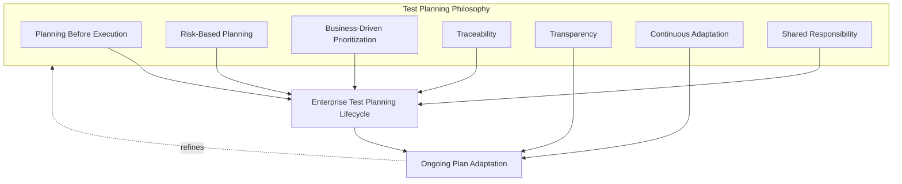
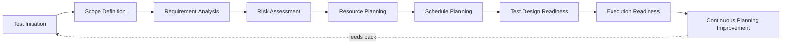
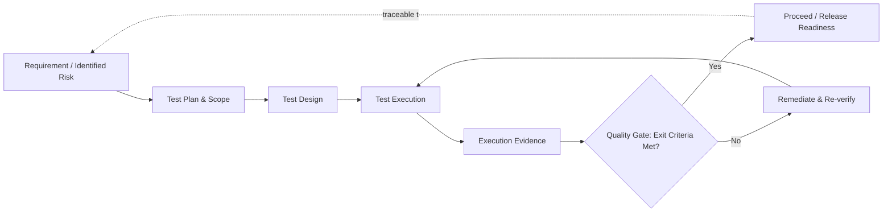
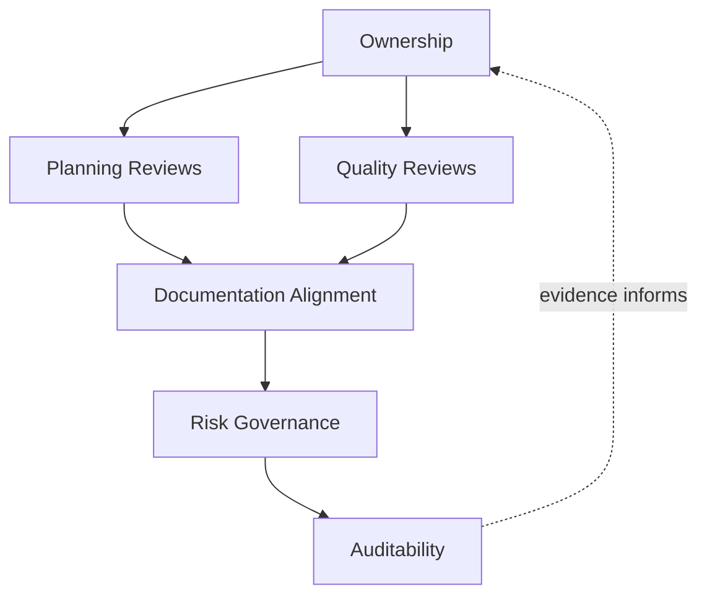
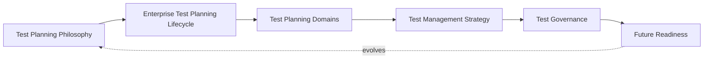
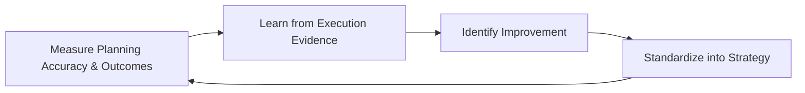

# Enterprise Test Planning & Test Management Strategy

## 1. Document Purpose

This document defines the official Enterprise Test Planning & Test Management Strategy for **StackLeo Tech Store**. It establishes how testing is planned, scoped, resourced, scheduled, and governed before and during execution — independent of any specific team, tool, or delivery method.

- **Purpose of Enterprise Test Planning** — planning exists to ensure testing is a deliberate, well-informed activity rather than an improvised reaction to whatever a delivery cycle happens to produce; it converts the testing philosophy and lifecycle defined in `testing-strategy.md` into a concrete, scoped, resourced, and scheduled plan of action for a specific release, capability, or period.
- **Relationship with Testing Strategy** — this document is the planning-specific elaboration of `testing-strategy.md`; where that document defines *what testing is and how it verifies quality* across nine lifecycle stages, seven levels, and ten types, this document defines *how testing activity is planned, scoped, and managed* so that strategy is executed in practice, most directly extending Test Planning and Test Analysis (`testing-strategy.md`, Sections 3.1–3.2).
- **Relationship with Quality Strategy** — test planning exists to operationalize the risk-based, evidence-based governance established in `quality-strategy.md`; planning decisions in this document (Sections 3–5) are the mechanism by which the quality lifecycle stages defined there (`quality-strategy.md`, Section 3) are actually resourced and scheduled.
- **Relationship with Project Management** — test planning is coordinated with, but distinct from, broader project and delivery planning; it consumes scope, timeline, and milestone context from `00_Project_Overview/project-roadmap.md` and `00_Project_Overview/project-scope.md`, and in turn informs whether project-level schedules are realistic from a quality-assurance perspective.
- **Relationship with Release Management** — Execution Readiness (Section 3.8) and Exit Criteria (Section 5.2) directly feed the release readiness decision governed by `07_DEVOPS/release-management.md`; test planning provides the quality evidence that release decisions depend on.
- **Relationship with Risk Management** — this document applies the risk-based prioritization principle established in `quality-strategy.md` (Section 5.2) and `06_Security/security-principles.md` to the specific question of what to plan, resource, and schedule test effort around, ensuring planning decisions are traceable to genuine business risk defined in `01_Business/business-requirements.md`.

This document is implementation-independent and vendor-neutral. It defines test planning philosophy, lifecycle, domains, and governance — not specific test management tools, project management platforms, automation frameworks, programming languages, infrastructure configuration, or code.

## 2. Test Planning Philosophy

Test planning at StackLeo is governed by seven principles. Each exists to produce a specific business outcome — planning is pursued because of the predictability and confidence it creates, not as a bureaucratic prerequisite to testing.

### 2.1 Planning Before Execution

Test scope, priority, and approach are deliberately established before execution begins, rather than discovered informally as execution proceeds.

- **Business Value** — prevents wasted execution effort on poorly scoped or misprioritized testing, and gives stakeholders a clear, reviewable statement of intended coverage before commitment.

### 2.2 Risk-Based Planning

Planning effort and depth are allocated in proportion to genuine business, customer, and financial risk, consistent with `testing-strategy.md` (Section 2.3).

- **Business Value** — ensures the highest-consequence capability (checkout, payments, orders) receives the most deliberate planning attention, rather than planning effort being distributed evenly regardless of consequence.

### 2.3 Business-Driven Prioritization

Planning priorities trace directly to business objectives and customer value defined in `01_Business` and `02_Product`, not to what is simplest to plan or most familiar to the planning team.

- **Business Value** — ensures planning decisions protect what the business genuinely depends on, keeping test planning accountable to business outcomes rather than internal convenience.

### 2.4 Traceability

Every planned test activity traces to a specific requirement, acceptance criterion, or identified risk, and every plan can be traced forward to the execution and evidence it produced.

- **Business Value** — makes it possible to answer, with confidence, "what was tested, why, and what did it prove" — the foundation of defensible release decisions and audit readiness (Section 6.6).

### 2.5 Transparency

Test plans, scope decisions, and known gaps are visible to all relevant stakeholders, not held privately within the testing function.

- **Business Value** — allows Product, Engineering, and Business stakeholders to make informed decisions about schedule, scope trade-offs, and accepted risk, rather than being surprised late in delivery.

### 2.6 Continuous Adaptation

Test plans are revisited and adjusted as requirements, risk, and delivery context change, rather than treated as fixed once written.

- **Business Value** — keeps planning genuinely useful throughout delivery instead of becoming an outdated artifact that no longer reflects real conditions.

### 2.7 Shared Responsibility

Test planning is a joint activity across QA, Engineering, Product, and Business stakeholders; no single function plans testing in isolation from those who understand the requirement, the risk, or the architecture.

- **Business Value** — produces plans grounded in complete context, avoiding the blind spots that arise when planning is done by one function without input from the others.

*Diagram 1: Test Planning Philosophy Overview — the seven principles shape the planning lifecycle, and ongoing adaptation feeds back into the philosophy itself.*

## 3. Enterprise Test Planning Lifecycle

Test planning is governed across nine conceptual stages, spanning from initial initiation through execution readiness and continuous improvement of planning practice itself.

### 3.1 Test Initiation

- **Purpose** — formally recognize that a capability, release, or period of work requires a test plan, and establish its initial context.
- **Business Value** — ensures test planning begins deliberately and on time, rather than being triggered late or informally.
- **Governance Objectives** — confirm every significant capability or release has a formally initiated test plan before scope definition begins.

### 3.2 Scope Definition

- **Purpose** — determine what will and will not be covered by testing for the capability or release in question.
- **Business Value** — makes coverage boundaries explicit and reviewable, preventing silent gaps caused by unstated assumptions about what "testing" includes.
- **Governance Objectives** — ensure scope is documented, including explicit out-of-scope declarations, and reviewed by accountable stakeholders.

### 3.3 Requirement Analysis

- **Purpose** — examine functional and non-functional requirements, and acceptance criteria, to determine their testing implications.
- **Business Value** — surfaces ambiguous, incomplete, or untestable requirements before planning commitments are finalized around them.
- **Governance Objectives** — ensure every requirement in `02_Product/functional-requirements.md`, `02_Product/non-functional-requirements.md`, and `02_Product/acceptance-criteria.md` relevant to the plan's scope is accounted for.

### 3.4 Risk Assessment

- **Purpose** — identify and prioritize the business, technical, and customer risks that testing must address.
- **Business Value** — directs planning effort toward what matters most, consistent with Risk-Based Planning (Section 2.2).
- **Governance Objectives** — ensure risk assessment is documented, reviewed, and directly shapes subsequent resource and schedule decisions.

### 3.5 Resource Planning

- **Purpose** — determine the people, skills, and capacity required to execute the planned testing scope.
- **Business Value** — prevents commitments to test coverage that the available capacity cannot realistically deliver.
- **Governance Objectives** — ensure resourcing decisions are reviewed against planned scope and risk priority before schedule commitments are finalized.

### 3.6 Schedule Planning

- **Purpose** — establish realistic timing and sequencing for planned test activities, coordinated with broader delivery timelines.
- **Business Value** — protects delivery predictability by ensuring test timing reflects genuine effort estimates rather than optimistic assumption.
- **Governance Objectives** — ensure schedules are reviewed jointly with project and release timelines, and that conflicts are surfaced early, not discovered at execution.

### 3.7 Test Design Readiness

- **Purpose** — confirm that requirement analysis, risk assessment, and scope are sufficiently mature to begin test design (`testing-strategy.md`, Section 3.3).
- **Business Value** — prevents wasted design effort caused by proceeding on incomplete or unstable planning inputs.
- **Governance Objectives** — establish a clear, checkable readiness condition before test design formally begins.

### 3.8 Execution Readiness

- **Purpose** — confirm that planning, resourcing, scheduling, and preparation are complete and test execution (`testing-strategy.md`, Section 3.5) can begin.
- **Business Value** — reduces the risk of execution starting prematurely and stalling on missing prerequisites.
- **Governance Objectives** — apply consistent, documented readiness criteria before execution is authorized to begin.

### 3.9 Continuous Planning Improvement

- **Purpose** — capture what actual execution and outcomes reveal about the quality of prior planning, and apply that learning to future plans.
- **Business Value** — ensures planning accuracy and realism improve over time rather than repeating the same estimation or scoping mistakes.
- **Governance Objectives** — ensure planning retrospective findings are documented and demonstrably applied to subsequent planning cycles.

### Enterprise Test Planning Lifecycle Matrix

| Stage | Purpose | Business Value | Governance Objective |
|---|---|---|---|
| Test Initiation | Formally recognize the need for a test plan | Planning begins deliberately and on time | Every significant capability/release has a formally initiated plan |
| Scope Definition | Determine what is and isn't covered | Makes coverage boundaries explicit and reviewable | Scope documented, including explicit out-of-scope items |
| Requirement Analysis | Determine testing implications of requirements | Surfaces ambiguous or untestable requirements early | Every relevant requirement accounted for in the plan |
| Risk Assessment | Identify and prioritize testing-relevant risk | Directs effort toward what matters most | Risk assessment documented and shapes resourcing/scheduling |
| Resource Planning | Determine people, skills, and capacity needed | Prevents commitments capacity cannot deliver | Resourcing reviewed against scope and risk priority |
| Schedule Planning | Establish realistic timing and sequencing | Protects overall delivery predictability | Schedules reviewed jointly with project/release timelines |
| Test Design Readiness | Confirm inputs are mature enough for design | Prevents wasted design effort on unstable inputs | Clear, checkable readiness condition before design begins |
| Execution Readiness | Confirm all prerequisites for execution are met | Reduces risk of premature, stalled execution | Consistent, documented readiness criteria applied |
| Continuous Planning Improvement | Capture learning to improve future planning | Planning accuracy improves over time | Retrospective findings documented and applied |

*Diagram 2: Enterprise Test Planning Lifecycle — a continuous cycle in which execution outcomes directly inform the next iteration of planning.*

## 4. Test Planning Domains

Test planning is organized across nine conceptual domains. Each domain addresses a distinct planning concern and is evaluated independently, though all contribute to a single coherent test plan.

### 4.1 Scope Management

- **Purpose** — define and control what is included in and excluded from a given test planning effort.
- **Scope** — features, capabilities, releases, or periods covered, and explicit statements of what is deliberately excluded and why.
- **Governance Expectations** — scope changes are reviewed and re-approved, not silently absorbed once planning is underway.
- **Business Importance** — prevents both wasted effort on unnecessary coverage and dangerous silent gaps in necessary coverage.

### 4.2 Test Objectives

- **Purpose** — articulate what the testing effort is intended to prove or demonstrate.
- **Scope** — objectives expressed in terms of business and quality outcomes (e.g., "confirm checkout remains reliable under peak load"), not internal testing mechanics.
- **Governance Expectations** — objectives are reviewed for direct traceability to business or customer value before being finalized.
- **Business Importance** — keeps testing effort anchored to genuine purpose rather than becoming an exercise performed for its own sake.

### 4.3 Resource Planning

- **Purpose** — determine the people, skills, and capacity allocated to fulfill the test plan.
- **Scope** — role coverage across testing levels and types defined in `testing-strategy.md` (Sections 4–5), and capacity against planned scope.
- **Governance Expectations** — resourcing gaps against planned scope are surfaced and resolved before execution readiness (Section 3.8) is declared.
- **Business Importance** — under-resourced testing is one of the most common causes of silently reduced coverage under schedule pressure.

### 4.4 Environment Readiness

- **Purpose** — confirm that the conditions in which testing will occur are suitable and available when needed.
- **Scope** — availability, stability, and representativeness of the context testing depends on, conceptually aligned with `07_DEVOPS/environment-management.md`.
- **Governance Expectations** — environment readiness is verified as a distinct planning checkpoint, not assumed to be automatically available.
- **Business Importance** — unreliable or unrepresentative test conditions undermine the credibility of every result produced within them.

### 4.5 Test Data Planning

- **Purpose** — determine what data is required to execute planned tests meaningfully and safely.
- **Scope** — data coverage for realistic business scenarios, consistent with data handling expectations in `04_Database/data-governance.md` and `06_Security/data-protection.md`.
- **Governance Expectations** — test data planning explicitly addresses data privacy and protection expectations, never assuming production data can be used without governance.
- **Business Importance** — inadequate or unrepresentative data planning is a common, often invisible cause of tests that pass without proving anything meaningful.

### 4.6 Risk Planning

- **Purpose** — determine how identified risks (Section 3.4) will be addressed through planned test coverage and prioritization.
- **Scope** — mapping of assessed risks to specific planned test activities, ensuring no significant risk goes unaddressed by the plan.
- **Governance Expectations** — every risk classified as high-impact has an explicit, documented planned response, or an explicit, accountable decision to accept it.
- **Business Importance** — connects abstract risk assessment to concrete planned action, ensuring risk awareness translates into risk mitigation.

### 4.7 Communication Planning

- **Purpose** — determine how test planning decisions, progress, and findings will be communicated to relevant stakeholders.
- **Scope** — stakeholder identification, communication cadence, and escalation paths for significant planning or execution issues.
- **Governance Expectations** — communication expectations are agreed upon during planning, not improvised once issues arise.
- **Business Importance** — supports Transparency (Section 2.5), ensuring stakeholders are never surprised by testing outcomes they had no visibility into.

### 4.8 Reporting Planning

- **Purpose** — determine what testing progress and outcome information will be captured and reported, and to whom.
- **Scope** — reporting content, audience, and cadence sufficient to support Quality Assessment and Release Readiness (`testing-strategy.md`, Sections 3.7–3.8).
- **Governance Expectations** — reporting expectations are defined before execution begins, ensuring evidence needed for later decisions is captured as it is produced.
- **Business Importance** — well-planned reporting is what allows release decisions to be evidence-based rather than based on informal impressions.

### 4.9 Exit Planning

- **Purpose** — determine, in advance, the conditions under which testing for the planned scope will be considered complete.
- **Scope** — exit criteria (Section 5.2) appropriate to the plan's scope and risk profile.
- **Governance Expectations** — exit conditions are agreed upon during planning and not redefined after execution results are already known.
- **Business Importance** — prevents the credibility risk of "moving the goalposts" to justify a release decision already made for other reasons.

### Test Planning Domain Matrix

| Domain | Purpose | Governance Expectations | Business Importance |
|---|---|---|---|
| Scope Management | Define and control what is included/excluded | Scope changes reviewed and re-approved | Prevents wasted effort and silent coverage gaps |
| Test Objectives | Articulate what testing is meant to prove | Reviewed for traceability to business value | Anchors testing to genuine purpose |
| Resource Planning | Determine people, skills, and capacity | Gaps surfaced and resolved before execution readiness | Prevents silently reduced coverage under pressure |
| Environment Readiness | Confirm suitable, available test conditions | Verified as a distinct planning checkpoint | Unreliable conditions undermine result credibility |
| Test Data Planning | Determine data required for meaningful testing | Explicitly addresses privacy and protection expectations | Prevents tests that pass without proving anything |
| Risk Planning | Map assessed risks to planned test coverage | High-impact risk has explicit response or accepted decision | Converts risk awareness into risk mitigation |
| Communication Planning | Determine how decisions/findings are communicated | Agreed during planning, not improvised later | Supports transparency; avoids stakeholder surprise |
| Reporting Planning | Determine what progress/outcome data is captured | Defined before execution begins | Enables evidence-based release decisions |
| Exit Planning | Determine in advance when testing is complete | Agreed during planning, not redefined afterward | Prevents "moving the goalposts" on release decisions |

## 5. Test Management Strategy

- **Entry Criteria** — the documented conditions that must be satisfied before a test activity may begin (e.g., requirement analysis complete, environment ready); entry criteria prevent execution from starting on an unstable foundation.
- **Exit Criteria** — the documented conditions that must be satisfied before a test activity is considered complete (Section 4.9); exit criteria are agreed during planning and applied consistently, never adjusted retroactively to justify a predetermined outcome.
- **Test Deliverables** — the tangible planning and execution artifacts produced (test plans, scope statements, risk assessments, execution evidence, reports) that collectively provide the traceable record referenced throughout this document.
- **Milestone Management** — key planning and execution checkpoints are defined and tracked against the broader delivery timeline, coordinated with `00_Project_Overview/project-roadmap.md` and release timing in `07_DEVOPS/release-management.md`.
- **Traceability** — every deliverable and milestone connects backward to a requirement or risk (Section 2.4) and forward to the evidence it produced, forming an unbroken chain from business need to verified outcome.
- **Quality Gates** — defined checkpoints at which accumulated planning and execution evidence is formally reviewed before work is authorized to proceed to the next stage, consistent with the lifecycle stages in Section 3 and `testing-strategy.md` (Section 3).
- **Decision Governance** — decisions made at quality gates (proceed, hold, escalate) are made by accountable stakeholders against documented criteria, and are themselves recorded as part of the traceable record.

### Test Management Matrix

| Element | Purpose | Governance Role |
|---|---|---|
| Entry Criteria | Confirm a stable foundation before a test activity begins | Prevents wasted effort on unready inputs |
| Exit Criteria | Confirm a test activity is genuinely complete | Applied consistently; never adjusted retroactively |
| Test Deliverables | Produce the tangible planning/execution record | Forms the basis of traceability and auditability |
| Milestone Management | Track key checkpoints against delivery timeline | Coordinates test planning with project and release schedules |
| Traceability | Connect requirement/risk to deliverable to evidence | Enables defensible, evidence-based decisions |
| Quality Gates | Formally review evidence before proceeding | Makes progression a deliberate, reviewed decision |
| Decision Governance | Govern proceed/hold/escalate decisions at gates | Ensures decisions are accountable and recorded |

*Diagram 3: Test Scope & Traceability Model — every planned activity traces back to a requirement or risk and forward to the evidence that determines whether a quality gate is passed.*

## 6. Test Governance

### 6.1 Ownership

Every test planning domain (Section 4) has a single accountable owner; overall test planning governance is owned jointly by QA and Engineering leadership, consistent with Shared Responsibility (Section 2.7).

### 6.2 Planning Reviews

Test plans are formally reviewed against scope, risk, resourcing, and schedule (Sections 3–4) before Test Design Readiness (Section 3.7) is declared, ensuring planning quality is itself verified before being acted upon.

### 6.3 Quality Reviews

Test planning outcomes are reviewed against the quality expectations defined in `quality-strategy.md` (Section 4) and `testing-strategy.md` (Sections 4–5), ensuring planning decisions remain aligned with platform-wide quality domains and testing levels/types.

### 6.4 Documentation Alignment

Test planning documentation is kept consistent with `02_Product/acceptance-criteria.md`, `testing-strategy.md`, `03_System_Design`, and `07_DEVOPS/release-management.md`; a plan that contradicts current requirements or release timing is treated as a governance gap.

### 6.5 Risk Governance

Planning-related risk — unresourced scope, compressed schedules, unaddressed high-impact risk — is tracked, prioritized, and escalated consistently, ensuring accepted risk is always a deliberate, accountable decision.

### 6.6 Auditability

Test plans, scope decisions, risk assessments, and gate decisions are retained in a form that can be independently reviewed after the fact, supporting internal governance and the compliance posture referenced in `06_Security/compliance.md`.

### Test Governance Matrix

| Governance Area | Objective |
|---|---|
| Ownership | Every planning domain has one accountable owner |
| Planning Reviews | Plan quality is verified before design readiness is declared |
| Quality Reviews | Planning stays aligned with platform-wide quality and testing strategy |
| Documentation Alignment | Planning stays consistent with requirements, testing strategy, and release timing |
| Risk Governance | Accepted planning risk is always a deliberate, accountable decision |
| Auditability | Planning and gate decisions retained for independent review |

### Governance Responsibility Matrix

| Role | Responsibility |
|---|---|
| Head of Quality / QA Leadership | Owns coherence and enforcement of this test planning strategy, in partnership with Engineering leadership. |
| Test Manager / Test Lead | Owns day-to-day test planning lifecycle execution (Section 3) and quality gate coordination. |
| Engineering Leads | Provide architectural and technical input to Risk Assessment and Resource Planning (Sections 3.4–3.5). |
| Product Owners | Provide requirement and priority input to Scope Definition and Test Objectives (Sections 3.2, 4.2). |
| Project / Release Manager | Coordinates Schedule Planning (Section 3.6) and Milestone Management (Section 5) with broader delivery timelines. |
| Security Lead | Ensures Risk Planning (Section 4.6) and Test Data Planning (Section 4.5) reflect security and privacy expectations. |
| Internal Audit / Review Function | Independently verifies that planning records and gate decisions reflect actual practice. |

*Diagram 4: Test Planning Governance Framework — ownership anchors review activity, which feeds documentation alignment, risk governance, and ultimately auditable evidence.*

*Diagram 5: Test Management Operating Model — how philosophy, lifecycle, domains, management strategy, and governance operate together as a single, self-reinforcing system that continues to evolve as the platform grows.*

## 7. Future Readiness

This strategy is designed to remain valid as StackLeo evolves in scale and architectural complexity, without requiring redefinition of its underlying philosophy.

- **Cloud-Native Platforms** — planning domains (Section 4) are defined independently of any specific runtime or deployment model, so they apply unchanged as infrastructure evolves, consistent with `03_System_Design/deployment-architecture.md`.
- **Microservices** — as the platform decomposes into further bounded services per `03_System_Design/service-architecture.md`, Scope Management and Risk Planning (Sections 4.1, 4.6) extend naturally to service-level planning without requiring a new governance model.
- **AI Systems** — as AI-assisted capability is introduced, Test Objectives and Test Data Planning (Sections 4.2, 4.5) extend to address behavioral evaluation criteria and representative training-adjacent data scenarios, consistent with `quality-strategy.md` (Section 7).
- **Marketplace Platform** — the multi-vendor marketplace model extends Scope Definition and Risk Assessment (Sections 3.2, 3.4) to cover seller-supplied content and listings, applying the same planning rigor used for StackLeo's own catalog today.
- **Multi-Tenant Architecture** — where future architecture introduces tenant isolation, Risk Planning and Environment Readiness (Sections 4.6, 4.4) extend to explicitly plan for cross-tenant verification scenarios.
- **Continuous Delivery** — as delivery cadence accelerates per `07_DEVOPS/ci-cd-strategy.md`, planning shifts toward lighter-weight, more frequent planning cycles per change, while the same nine lifecycle stages (Section 3) and quality gates (Section 5) continue to apply at a faster cadence rather than being abandoned.
- **Multi-Region Operations** — as StackLeo expands from Bangladesh into South Asia and beyond, Environment Readiness and Test Data Planning (Sections 4.4–4.5) extend to cover regional conditions, localization, and data residency expectations.
- **Global Engineering Teams** — the lifecycle, domains, and governance defined in Sections 3–6 are defined independently of team size, location, or organizational structure, so they remain coherent as engineering scales beyond a single, co-located team.

## 8. Governance

- **Ownership** — the Head of Quality (or equivalent accountable executive function) owns this strategy and is accountable for its consistent application across the platform, in partnership with Engineering, Product, and Release Management.
- **Review Process** — this strategy is formally reviewed whenever a material change occurs in business model (`01_Business/business-model.md`), architecture (`03_System_Design`), or delivery practice (`07_DEVOPS`), and on a regular recurring cadence independent of specific change events.
- **Test Planning Policies** — subordinate, practice-specific planning documents (test case standards, defect management, test metrics, and further documents within `08_QUALITY_ASSURANCE`) must remain consistent with the philosophy, lifecycle, and domains defined here.
- **Audit Readiness** — this strategy and the evidence it requires (Section 6.6) are maintained in a state ready for internal or external audit at any time, without requiring advance preparation.
- **Continuous Improvement** — this strategy itself is subject to Continuous Planning Improvement (Section 3.9); its effectiveness is periodically assessed and revised based on genuine planning accuracy, execution outcomes, and organizational evidence.

*Diagram 6: Continuous Test Planning Improvement Cycle — planning outcomes are measured, learned from, improved upon, and standardized back into this strategy, on a continuing basis.*

## 9. Anti-Patterns

The following recurring failure patterns are explicitly recognized and avoided, as each one structurally undermines this strategy.

| Anti-Pattern | Why It's Avoided |
|---|---|
| No Formal Planning | Contradicts Planning Before Execution (Section 2.1); testing without a plan produces inconsistent, unaccountable coverage decisions. |
| Undefined Scope | Undermines Scope Management (Section 4.1); without explicit boundaries, coverage gaps go unnoticed until they surface as production defects. |
| Unrealistic Scheduling | Contradicts Schedule Planning (Section 3.6); schedules disconnected from genuine effort estimates lead to silently compressed or abandoned testing under deadline pressure. |
| Weak Risk Assessment | Contradicts Risk-Based Planning (Section 2.2); without genuine risk assessment, planning effort cannot be directed where it matters most. |
| Poor Traceability | Undermines Traceability (Section 2.4); without a clear chain from requirement to evidence, release decisions cannot be defended or audited. |
| Reactive Planning | Contradicts Continuous Adaptation (Section 2.6) by its absence — plans that are never revisited become disconnected from real delivery conditions, forcing planning to happen informally and reactively instead. |
| Weak Documentation | Undermines Documentation Alignment (Section 6.4) and Auditability (Section 6.6), leaving planning decisions unclear or unverifiable after the fact. |
| Missing Continuous Reviews | Contradicts Continuous Planning Improvement (Section 3.9); without regular review, planning practice repeats the same estimation and scoping mistakes indefinitely. |

## 10. Document Information

| Property | Value |
|----------|-------|
| Document | test-planning.md |
| Version | 1.0.0 |
| Status | Active |
| Maintained By | StackLeo |
| Last Updated | 2026-07-24 |

---

© StackLeo. All Rights Reserved.
