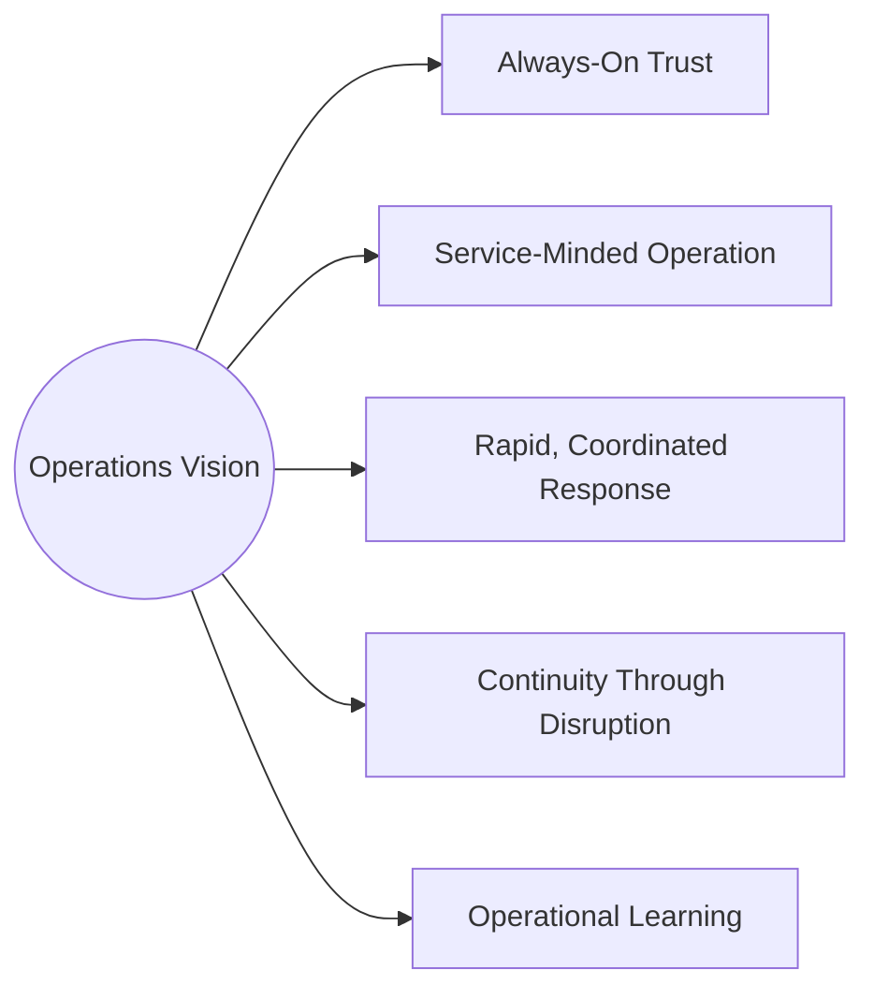
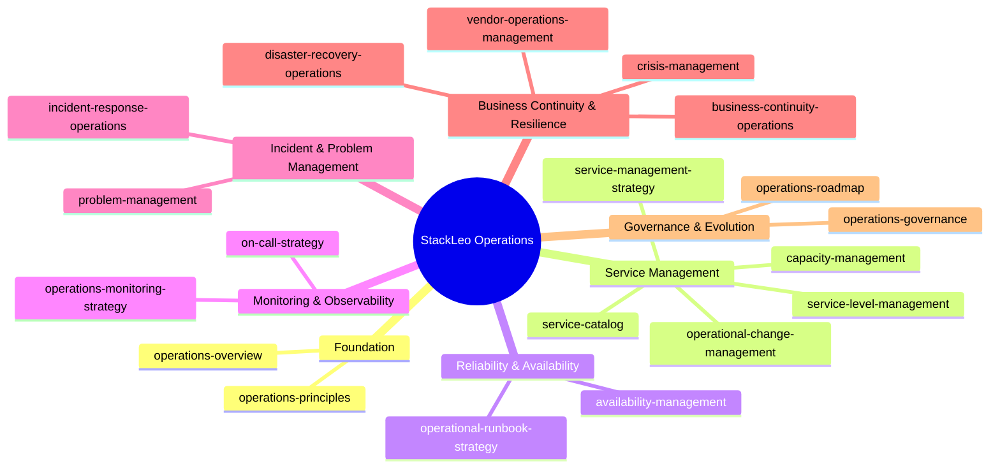
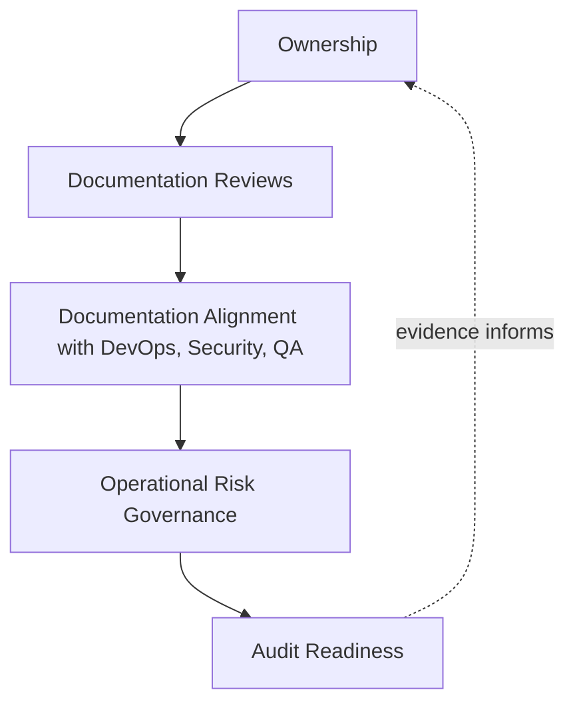
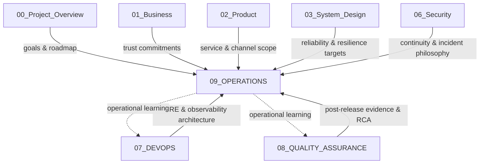
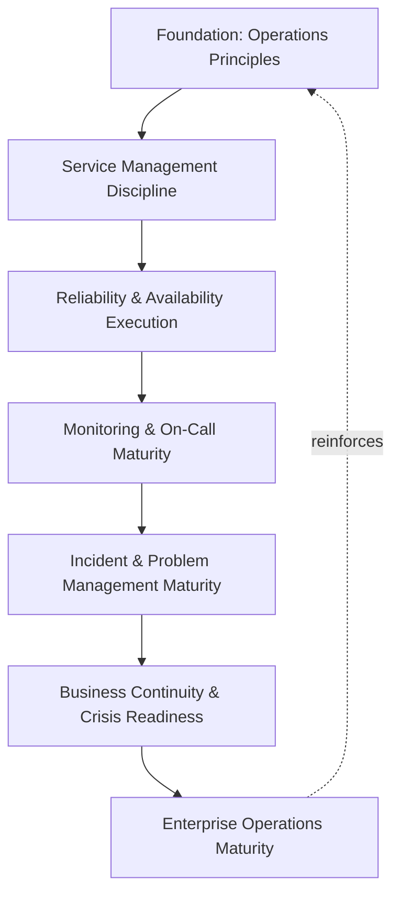

# 09_OPERATIONS

## 1. Purpose

This folder contains the official Enterprise Operations documentation for the **StackLeo Tech Store** project. It defines how the platform is run, supported, and kept trustworthy on a day-to-day basis, once it is live — translating the delivery and reliability architecture established in `07_DEVOPS` into the daily operational discipline of service management, monitoring response, incident and problem handling, and business continuity execution.

This README describes the contents of this folder only. It is not the project's main README and does not describe the repository as a whole.

- **Purpose of Enterprise Operations** — to ensure the platform's day-to-day operation is governed, consistent, and accountable, rather than dependent on individual improvisation each time something needs attention.
- **Relationship with DevOps (`07_DEVOPS`)** — `07_DEVOPS` defines the architecture of reliability, delivery, and observability — the engineered target. This folder defines the daily operational discipline of running against that target: who watches, who responds, how service is sustained, and how the organization learns from operating the platform in practice.
- **Relationship with Security (`06_Security`)** — this folder does not redefine security incident response or business continuity philosophy, both authoritatively defined in `06_Security/incident-response.md` and `06_Security/business-continuity.md`. It defines the operational execution layer through which those philosophies are exercised day to day, including for non-security operational events.
- **Relationship with Quality Assurance (`08_QUALITY_ASSURANCE`)** — quality assurance governs what is verified before release; this folder governs what is observed and sustained after release. Post-release validation and operational learning defined in `08_QUALITY_ASSURANCE` feed directly into the monitoring and incident practice defined here.
- **Relationship with Business Governance** — operations is where architecture and quality commitments become lived customer experience; this folder is the mechanism by which StackLeo's trust-centered brand promise, defined in `01_Business/vision.md`, is sustained every single day the platform is live, not only at the moment of release.

This documentation is implementation-independent and vendor-neutral. It describes operations philosophy, lifecycle, and governance — not specific monitoring tools, ITSM platforms, cloud providers, or operational software.

## 2. Operations Vision

StackLeo's operations vision rests on five commitments, elaborated fully across this folder's subordinate documents:

- **Always-On Trust** — customers can rely on the platform being available, correct, and responsive at any moment they choose to shop, regardless of time, day, or season.
- **Service-Minded Operation** — the platform is operated as a service delivered to customers and the business, not merely as infrastructure kept running.
- **Rapid, Coordinated Response** — when something goes wrong, the organization responds in a known, practiced, coordinated way, not an improvised one.
- **Continuity Through Disruption** — the business continues serving customers through disruption of any scale, from a minor operational hiccup to a significant crisis.
- **Operational Learning** — every operational event, large or small, is treated as an opportunity to make future operation more resilient.

*Diagram: Operations Vision — five commitments that every document in this folder exists to make real in daily practice.*

## 3. Operations Principles

- **Service Orientation** — operational practice is organized around the services the business and its customers depend on, not around individual technical components in isolation.
- **Proactive Reliability** — operations acts to prevent and anticipate disruption wherever possible, consistent with the reliability engineering defined in `07_DEVOPS/sre-strategy.md`, rather than existing solely to react once something has already failed.
- **Coordinated Response** — incident and crisis response follow a known, understood structure, so effort is not spent reinventing coordination in the moment it is needed most.
- **Continuity by Design** — the ability to continue operating through disruption is planned for in advance, consistent with `06_Security/business-continuity.md`, not improvised during a live event.
- **Evidence-Based Operation** — operational decisions are grounded in observed telemetry and service data, consistent with `07_DEVOPS/observability-strategy.md`, rather than assumption.
- **Blameless Learning** — operational review focuses on contributing conditions and systemic weaknesses, not on assigning fault to individuals, consistent with `07_DEVOPS/incident-management.md`.
- **Continuous Improvement** — operational practice matures deliberately over time, informed by what is learned from real operating experience.

### Operations Principle Summary

| Principle | Focus | Primary Business Outcome |
|---|---|---|
| Service Orientation | Organize around services the business and customers depend on | Keeps operational attention aligned with genuine business value |
| Proactive Reliability | Anticipate and prevent disruption, not only react to it | Reduces frequency and severity of customer-visible disruption |
| Coordinated Response | Follow a known, practiced response structure | Reduces time to resolution and confusion during live events |
| Continuity by Design | Plan continuity capability in advance | Preserves business function through disruption of any scale |
| Evidence-Based Operation | Ground decisions in observed telemetry, not assumption | Improves the accuracy and speed of operational decisions |
| Blameless Learning | Focus review on systemic conditions, not individual fault | Sustains a learning culture that improves practice over time |
| Continuous Improvement | Mature operational practice deliberately over time | Keeps operational capability aligned with business growth |

## 4. Folder Structure

This folder's documentation is organized into six domains, each addressed by a dedicated set of documents.

*Diagram 1: Operations Documentation Map — the six domains this folder is organized into, and the documents each domain will contain.*

### Foundation

Establishes the philosophy every other document in this folder builds on:

- **operations-overview.md** — introduces the Operations function at StackLeo: its scope, objectives, and place within the wider engineering and business organization.
- **operations-principles.md** — defines the foundational operations philosophy and non-negotiable principles guiding every practice in this folder.

### Service Management

Covers how operations is organized around services the business and customers depend on, consistent with ISO 20000 service management thinking:

- **service-management.md** — defines the overarching IT service management framework StackLeo operates under.
- **service-catalog.md** — defines the services the platform provides, to whom, and at what expected level.
- **service-level-management.md** — defines how business-facing service level expectations are set, tracked, and reported, distinct from the engineering-level objectives in `07_DEVOPS/sre-strategy.md`.
- **change-management.md** — defines how operational and business-facing changes are reviewed and coordinated, distinct from the source-level change discipline in `07_DEVOPS/git-strategy.md`.
- **configuration-management.md** — defines governance of Configuration Items and their relationships (services, applications, platform, infrastructure, dependencies), distinct from the environment/application settings governed in `07_DEVOPS/configuration-management.md`.
- **capacity-management.md** — defines how business and operational capacity (support staffing, service capacity) is planned proactively, distinct from technical capacity testing in `08_QUALITY_ASSURANCE/performance-testing.md`.
- **release-management.md** — defines the ITSM coordination layer for release — stakeholder alignment, cross-functional coordination, and operational handover — sitting across `07_DEVOPS/release-management.md` (business timing decision) and `08_QUALITY_ASSURANCE/release-quality-gates.md` (quality evidence and go/no-go framework).

### Reliability & Availability

Covers how the platform's engineered reliability is sustained in daily operation:

- **availability-management.md** — defines how day-to-day operational practice executes against the reliability objectives defined in `07_DEVOPS/sre-strategy.md`.
- **performance-management.md** — defines the continuous, in-production discipline of observing, assessing, and optimizing performance, distinct from pre-release validation in `08_QUALITY_ASSURANCE/performance-testing.md` and proactive resource planning in `capacity-management.md`.
- **operational-runbooks.md** — defines the conceptual approach to standard operating procedures for routine and non-routine operational tasks.

### Monitoring & Observability

Covers how the running platform is watched and responded to in daily practice:

- **monitoring-observability.md** — defines how operational teams use the observability foundation in `07_DEVOPS/observability-strategy.md` to sustain day-to-day situational awareness.
- **on-call-strategy.md** — defines the conceptual approach to continuous operational coverage and escalation.

### Incident & Problem Management

Covers how disruption is handled in the moment and its recurring causes eliminated over time:

- **incident-management.md** — defines the cross-functional, business-facing incident governance layer — coordination, communication, and major incident escalation — that sits above the technical incident lifecycle defined in `07_DEVOPS/incident-management.md`.
- **problem-management.md** — defines the formal practice of identifying and eliminating the recurring root causes behind multiple incidents, consistent with ISO 20000 problem management.

### Business Continuity & Resilience

Covers how the business continues operating through disruption of any scale:

- **business-continuity.md** — defines the operational, COO-owned execution and testing of the business continuity philosophy authoritatively established in `06_Security/business-continuity.md`.
- **disaster-recovery.md** — defines the operational governance layer for disaster declaration, recovery coordination, validation, and testing — sitting across `06_Security/disaster-recovery.md` (philosophy) and `07_DEVOPS/disaster-recovery.md` (engineering execution).
- **crisis-management.md** — defines organizational crisis response coordination beyond technical incident response, consistent with ISO 22301 business continuity management.
- **vendor-operations-management.md** — defines the ongoing operational governance of couriers, payment providers, and future marketplace and B2B partners.

### Governance & Evolution

Covers how this folder itself is owned and matured over time:

- **operations-governance.md** — defines ownership, review process, and policy structure for operational practice.
- **operations-metrics-kpis.md** — defines the COO-owned enterprise measurement layer that aggregates domain-level operational metrics into business-facing KPIs and executive reporting.
- **operations-roadmap.md** — defines the planned maturity progression of operational capability at StackLeo over time.

## 5. Document Overview

Documents are authored progressively; this README establishes the navigational structure they populate as each is completed.

### Document Catalog

| Document | Domain | Purpose | Status |
|---|---|---|---|
| `operations-overview.md` | Foundation | Introduces the Operations function, scope, and organizational placement | Active |
| `operations-principles.md` | Foundation | Defines foundational operations philosophy and principles | Planned |
| `service-management.md` | Service Management | Defines the overarching ITSM framework | Active |
| `service-catalog.md` | Service Management | Defines the services provided and to whom | Active |
| `service-level-management.md` | Service Management | Defines business-facing service level expectations | Active |
| `change-management.md` | Service Management | Defines review and coordination of operational/business change | Active |
| `configuration-management.md` | Service Management | Defines governance of Configuration Items and their relationships | Active |
| `capacity-management.md` | Service Management | Defines proactive business and operational capacity planning | Active |
| `release-management.md` | Service Management | Defines ITSM coordination layer for release stakeholder alignment and handover | Active |
| `availability-management.md` | Reliability & Availability | Defines daily execution against reliability objectives | Active |
| `performance-management.md` | Reliability & Availability | Defines continuous in-production performance observation and optimization | Active |
| `operational-runbooks.md` | Reliability & Availability | Defines the conceptual approach to standard operating procedures | Active |
| `monitoring-observability.md` | Monitoring & Observability | Defines daily operational use of the observability foundation | Active |
| `on-call-strategy.md` | Monitoring & Observability | Defines continuous operational coverage and escalation | Planned |
| `incident-management.md` | Incident & Problem Management | Defines cross-functional coordination, communication, and major incident escalation | Active |
| `problem-management.md` | Incident & Problem Management | Defines elimination of recurring root causes across incidents | Active |
| `business-continuity.md` | Business Continuity & Resilience | Defines operational execution and testing of business continuity | Active |
| `disaster-recovery.md` | Business Continuity & Resilience | Defines operational governance for declaration, coordination, validation, and testing | Active |
| `crisis-management.md` | Business Continuity & Resilience | Defines organizational crisis response coordination | Planned |
| `vendor-operations-management.md` | Business Continuity & Resilience | Defines ongoing operational governance of external partners | Planned |
| `operations-governance.md` | Governance & Evolution | Defines ownership, review process, and policy structure | Active |
| `operations-metrics-kpis.md` | Governance & Evolution | Defines enterprise measurement aggregation and executive KPI reporting | Active |
| `operations-roadmap.md` | Governance & Evolution | Defines planned maturity progression of operational capability | Planned |

## 6. Operations Lifecycle

Day-to-day operation is governed across seven conceptual stages, forming a continuous cycle rather than a linear process.

- **Service Planning** — define the services offered and the level at which they are expected to perform, per `service-catalog.md` and `service-level-management.md`.
- **Operational Readiness** — confirm the organization is prepared to run, support, and monitor a capability before it depends on that readiness, consistent with `08_QUALITY_ASSURANCE/release-quality-gates.md` (Section 4.8).
- **Monitoring & Detection** — continuously observe platform and service health, consistent with `07_DEVOPS/observability-strategy.md`, to notice deviation as early as possible.
- **Incident Response** — respond to detected disruption in a coordinated, practiced way, per `incident-response-operations.md`.
- **Problem Resolution** — investigate and eliminate the recurring root causes behind incidents, per `problem-management.md`, rather than only resolving individual occurrences.
- **Continuity Assurance** — sustain the business's ability to continue operating through disruption of any scale, per `business-continuity-operations.md` and `disaster-recovery-operations.md`.
- **Operational Learning & Improvement** — capture what every stage reveals and feed it back into service planning and readiness for the next cycle.

*Diagram 2: Enterprise Operations Lifecycle — a continuous cycle in which learning from every stage informs the next iteration of service planning.*

## 7. Service Management Overview

Service management, consistent with ISO 20000 thinking, treats the platform not merely as running software but as a defined set of services delivered to customers, partners, and the business itself.

- **Service Catalog** — the specific services StackLeo operates (storefront, checkout, order fulfillment coordination, and, over time, marketplace and B2B services) are explicitly defined, so operational attention has a clear, agreed scope.
- **Service Level Management** — business-facing expectations for each service's availability and responsiveness are set and tracked, translating the engineering-level objectives in `07_DEVOPS/sre-strategy.md` into commitments the business and its customers can understand.
- **Operational Change Management** — changes affecting live services are reviewed and coordinated at the operational level, complementing, not duplicating, the source-level change discipline in `07_DEVOPS`.
- **Capacity Management** — the business proactively plans the operational capacity (support staffing, service throughput) needed to sustain service levels as the business grows across its stated growth stages.

This overview is intentionally conceptual; each element is elaborated fully once its dedicated document is authored, per the catalog in Section 5.

## 8. Reliability & Availability Overview

Reliability and availability are engineered in `07_DEVOPS/sre-strategy.md`; this folder governs how that engineering is sustained through daily operational discipline.

- **Availability Management** — day-to-day practice is organized around meeting the reliability objectives already defined architecturally, treating any deviation as an operational signal requiring attention, not a surprise.
- **Standard Operating Procedures** — routine and non-routine operational tasks are guided by known, consistent procedure, reducing dependence on any single individual's memory or judgment.
- **Operational Ownership** — every service in the catalog (Section 7) has clear operational ownership, ensuring availability concerns are never diffused across "the team" generally.

## 9. Monitoring & Observability Overview

Observability is architected in `07_DEVOPS/observability-strategy.md`; this folder governs how that architected capability is actually used, day to day, by the people responsible for keeping the platform healthy.

- **Continuous Situational Awareness** — operational teams maintain an ongoing understanding of platform and service health, rather than only checking when a problem is suspected.
- **On-Call Coverage** — continuous operational coverage ensures detected issues reach a capable responder promptly, regardless of when they occur.
- **Escalation Discipline** — a known, practiced escalation path ensures issues beyond a first responder's capacity to resolve reach the right additional expertise without delay.

## 10. Incident & Problem Management Overview

Incident and problem management are related but distinct disciplines: incident management restores service quickly; problem management prevents the same disruption from recurring.

- **Incident Response** — day-to-day execution of the incident lifecycle defined in `07_DEVOPS/incident-management.md`, focused on rapid detection, coordinated response, and timely restoration of service.
- **Problem Management** — a formal, ISO 20000-aligned discipline that investigates the recurring causes behind multiple incidents, connecting to Root Cause Analysis and CAPA practice in `08_QUALITY_ASSURANCE/defect-management.md` (Section 5) where the underlying cause is a software defect.
- **Blameless Review** — every incident and problem review focuses on contributing conditions, not individual fault, consistent with the Learning Culture principle in `07_DEVOPS/incident-management.md`.

## 11. Business Continuity Overview

Business continuity, consistent with ISO 22301 thinking, ensures the business — not merely its technical systems — continues functioning through disruption at every scale.

- **Business Continuity Operations** — the operational execution and periodic testing of the continuity philosophy defined in `06_Security/business-continuity.md`, ensuring plans remain genuinely workable, not merely documented.
- **Disaster Recovery Operations** — the operational testing cadence and execution of the recovery plans defined in `06_Security/disaster-recovery.md`, confirming recovery capability is proven, not assumed.
- **Crisis Management** — coordination of organizational response to disruption whose scale or nature extends beyond a contained technical incident, spanning communication, business decision-making, and cross-functional coordination.
- **Vendor & Partner Continuity** — operational continuity considerations extend to the couriers, payment providers, and future marketplace partners StackLeo's services depend on, recognizing that customer-facing continuity is not fully within StackLeo's direct control alone.

## 12. Governance

- **Ownership** — a designated Operations lead (or equivalent COO-accountable function) owns the coherence, currency, and enforcement of this folder's documentation, in partnership with DevOps/SRE, Security, and QA leadership.
- **Review Process** — this folder's documentation is formally reviewed whenever a material change occurs in business model (`01_Business/business-model.md`), architecture (`03_System_Design`), or delivery practice (`07_DEVOPS`), and on a regular recurring cadence independent of specific change events.
- **Operations Policies** — every document within this folder operates as a policy subordinate to the principles established here; subordinate documents must remain consistent with the vision, principles, and lifecycle defined in Sections 2–3 and Section 6.
- **Audit Readiness** — operational records — service level performance, incident history, continuity test results — are maintained in a state ready for internal or external audit at any time.
- **Continuous Improvement** — this folder's documentation, and the practice it describes, is expected to mature over time as the platform, organization, and operating scale evolve, rather than being fixed at any single point in time.

*Diagram 3: Operations Governance Framework — ownership anchors review activity, which feeds documentation alignment, risk governance, and ultimately auditable operational evidence.*

### Operations Capability Matrix

| Capability | Governing Domain | Executes Against | Business Outcome |
|---|---|---|---|
| Service definition and scope | Service Management | `service-catalog.md` | Clear, agreed boundaries for operational attention |
| Business-facing service commitments | Service Management | `service-level-management.md`, `07_DEVOPS/sre-strategy.md` | Translates engineering objectives into business commitments |
| Operational change coordination | Service Management | `operational-change-management.md` | Prevents uncoordinated change from disrupting live services |
| Business/operational capacity planning | Service Management | `capacity-management.md` | Sustains service levels through business growth |
| Daily reliability execution | Reliability & Availability | `availability-management.md`, `07_DEVOPS/sre-strategy.md` | Keeps engineered reliability real in daily practice |
| Standard operating procedure | Reliability & Availability | `operational-runbook-strategy.md` | Reduces dependence on individual memory or judgment |
| Continuous situational awareness | Monitoring & Observability | `operations-monitoring-strategy.md`, `07_DEVOPS/observability-strategy.md` | Notices deviation before it becomes customer-visible |
| Continuous coverage and escalation | Monitoring & Observability | `on-call-strategy.md` | Ensures issues reach a capable responder promptly |
| Incident response execution | Incident & Problem Management | `incident-response-operations.md`, `07_DEVOPS/incident-management.md` | Restores service quickly and in a coordinated way |
| Recurring root cause elimination | Incident & Problem Management | `problem-management.md`, `08_QUALITY_ASSURANCE/defect-management.md` | Prevents the same disruption from recurring |
| Continuity plan execution and testing | Business Continuity & Resilience | `business-continuity-operations.md`, `06_Security/business-continuity.md` | Confirms continuity plans are genuinely workable |
| Recovery plan testing | Business Continuity & Resilience | `disaster-recovery-operations.md`, `06_Security/disaster-recovery.md` | Confirms recovery capability is proven, not assumed |
| Crisis coordination | Business Continuity & Resilience | `crisis-management.md` | Coordinates response beyond contained technical incidents |
| Partner operational continuity | Business Continuity & Resilience | `vendor-operations-management.md` | Extends continuity thinking to dependencies outside StackLeo |

## 13. Related Documentation

This folder does not exist in isolation. It depends on, and feeds back into, several other folders across the repository.

### Related Folder Matrix

| Folder | Relationship | Direction |
|---|---|---|
| `00_Project_Overview` | Operational maturity is sequenced against stated project goals and roadmap milestones | Receives direction |
| `01_Business` | Operational continuity and service quality are direct expressions of the trust commitments defined there | Receives direction |
| `02_Product` | Service catalog scope reflects the product capability and channel roadmap | Receives direction |
| `03_System_Design` | Reliability and resilience architecture provide the structural target operations executes against | Receives direction |
| `06_Security` | Business continuity, disaster recovery, and incident response philosophy are authoritative there; this folder executes them daily | Receives direction, executes philosophy |
| `07_DEVOPS` | SRE, observability, and incident management architecture define the engineered target this folder operates against day to day | Receives direction, executes architecture |
| `08_QUALITY_ASSURANCE` | Post-release validation and defect RCA/CAPA feed operational learning and problem management | Receives evidence |

*Diagram: Operations Folder Relationships — this folder receives architectural and business direction from prior folders and feeds operational learning back into DevOps and Quality Assurance practice.*

## 14. Future Roadmap

This folder's documentation is deliberately structured to remain valid as StackLeo's scope grows.

- **Global Expansion** — as StackLeo grows from Bangladesh into South Asia and beyond, `service-level-management.md` and `capacity-management.md` extend to cover region-specific service commitments without redefining operational principles.
- **New Sales Channels** — as the Mobile App, Physical Store, and POS channels are introduced, `service-catalog.md` extends to include them as first-class services with their own defined operational ownership.
- **Marketplace Platform** — the multi-vendor marketplace model extends `vendor-operations-management.md` to govern a growing number of independent seller relationships requiring operational continuity consideration.
- **Corporate Sales & Wholesale** — B2B and wholesale business models introduce distinct service level expectations, extending `service-level-management.md` to cover enterprise customer commitments.
- **AI Systems** — as AI-assisted capability is introduced, `operations-monitoring-strategy.md` and `problem-management.md` extend to cover behavioral monitoring and recurring-issue investigation for AI-driven capability.
- **Multi-Currency Operations** — as multi-currency support matures, `service-management-strategy.md` extends to reflect the operational implications of serving customers across multiple currencies.
- **Enterprise Operations Maturity** — this folder's overall maturity is expected to progress in deliberate stages, detailed fully once `operations-roadmap.md` is authored, mirroring the staged maturity approach already established in `07_DEVOPS/README.md`.

*Diagram: Operations Maturity Evolution — each stage depends on the discipline established before it, and mature operational practice reinforces the founding principles rather than replacing them.*

## Document Information

| Property | Value |
|----------|-------|
| Document | README.md |
| Folder | 09_OPERATIONS |
| Version | 1.0.0 |
| Status | Active |
| Maintained By | StackLeo |
| Last Updated | 2026-07-26 |

---

© StackLeo. All Rights Reserved.
