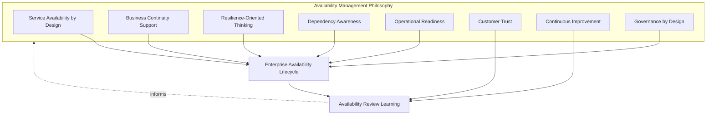
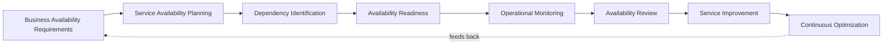
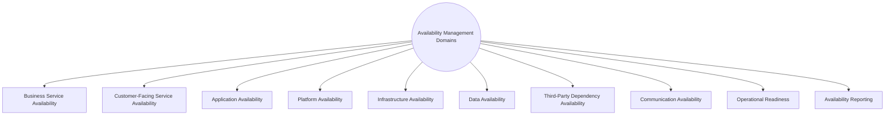
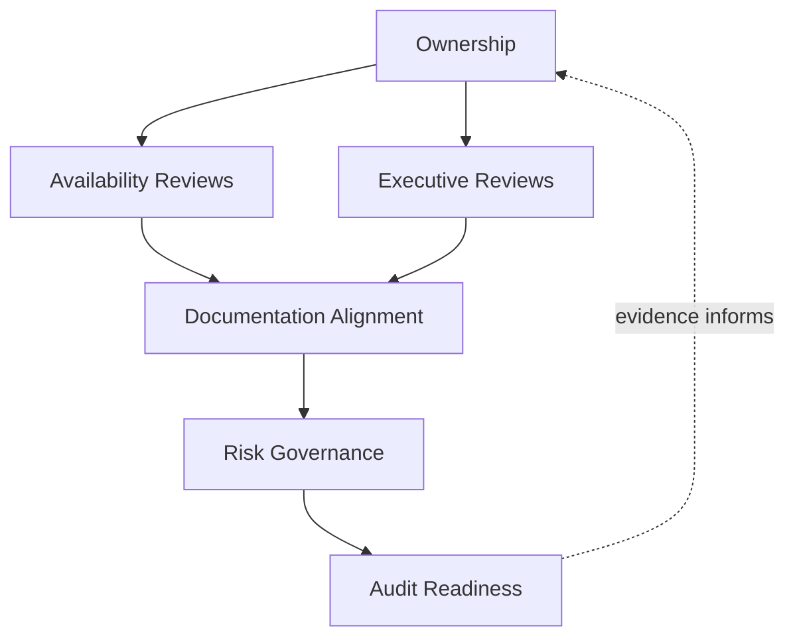
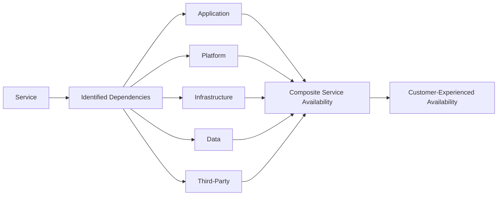
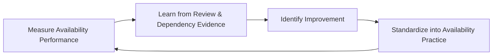
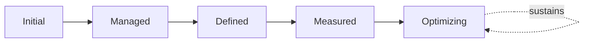

# Enterprise Availability Management & Service Availability Strategy

## 1. Document Purpose

This document defines the official Enterprise Availability Management & Service Availability Strategy for **StackLeo Tech Store**. It establishes how the organization plans, sustains, and reviews the availability of its services — independent of any specific monitoring platform, high-availability product, cloud provider, or load balancing technology.

This document governs availability as a service management discipline: what must remain available, why, what it depends on, and how the organization stays ready to sustain it. It complements rather than duplicates `07_DEVOPS/sre-strategy.md`, which engineers reliability into the platform architecturally, and Availability Expectations in `service-level-management.md` (Section 4.4), which express availability as a business-facing commitment. This document is the operational planning and governance layer connecting the two — ensuring availability commitments are genuinely achievable and sustained through deliberate, ongoing practice.

- **Purpose of Availability Management** — to ensure the services customers and the business depend on remain accessible and functional as consistently as genuinely required, through deliberate planning rather than hopeful assumption.
- **Relationship with Service Level Management** — Availability Expectations in `service-level-management.md` (Section 4.4) are the business-facing commitments this document's planning exists to fulfill; this document defines how those commitments are made genuinely achievable, not merely stated.
- **Relationship with Capacity Management** — insufficient capacity is one of the most common causes of availability degradation under load; this document assumes and depends on the proactive planning defined in `capacity-management.md`.
- **Relationship with Monitoring & Observability** — availability planning and review depend on genuine, current health data; this document draws directly on Service Health Monitoring in `monitoring-observability.md` (Section 4.1) as its evidentiary foundation.
- **Relationship with Disaster Recovery** — `disaster-recovery.md` governs restoration following a severe disruption that exceeds routine resilience; this document governs the proactive planning that determines how much disruption routine resilience can absorb before that escalation becomes necessary.
- **Relationship with Business Continuity** — sustained service availability is one of the most direct, continuous expressions of the business continuity commitment defined in `business-continuity.md`; availability management is continuity practiced every ordinary day, not only during declared crisis.
- **Relationship with Enterprise Governance** — availability commitments carry direct business consequences — revenue, trust, contractual obligation — that warrant deliberate, accountable governance rather than being left to informal technical judgment alone.

This document is implementation-independent and vendor-neutral. It defines availability management philosophy, lifecycle, domains, and governance conceptually — not specific monitoring platforms, high-availability products, cloud providers, load balancing technologies, uptime percentages, availability targets, SLAs, or infrastructure configuration.

## 2. Availability Management Philosophy

Availability management at StackLeo is governed by eight principles. Each exists to produce a specific business outcome — availability is planned deliberately because of the trust and revenue it protects, not as a purely technical aspiration.

### 2.1 Service Availability by Design

Availability is considered from the moment a service is designed, consistent with Performance by Design thinking used throughout this repository, not addressed only after a service is already live and struggling.

- **Business Value** — an availability weakness prevented at design time avoids costly architectural rework and customer-visible disruption later.

### 2.2 Business Continuity Support

Availability management exists in direct support of `business-continuity.md`; sustained everyday availability is the most common and continuous expression of business continuity in practice.

- **Business Value** — connects routine availability planning to the same organizational seriousness given to formal continuity governance.

### 2.3 Resilience-Oriented Thinking

Availability planning assumes eventual failure of some component and focuses on how gracefully the broader service degrades and recovers, not solely on preventing failure outright.

- **Business Value** — accepts that perfect prevention is unrealistic and invests instead in the capability to absorb failure without full service loss.

### 2.4 Dependency Awareness

Availability planning explicitly accounts for what a service depends on, consistent with Configuration Relationships in `configuration-management.md` (Section 4.9).

- **Business Value** — prevents the common failure mode where a service is assumed available because it appears healthy, while an unrecognized dependency is actually degraded.

### 2.5 Operational Readiness

The organization is genuinely prepared to detect, respond to, and recover from availability degradation, consistent with Operational Readiness in `operations-overview.md` (Section 4.3).

- **Business Value** — ensures availability planning translates into real operational capability, not only a documented aspiration.

### 2.6 Customer Trust

Availability decisions are made with explicit awareness of their effect on customer trust, consistent with the brand commitment in `01_Business/vision.md`.

- **Business Value** — keeps availability planning anchored to genuine customer impact, not only internal technical metrics.

### 2.7 Continuous Improvement

Availability management practice matures over time, informed by real operational experience and evolving business scale.

- **Business Value** — keeps availability capability aligned with StackLeo's growth in scale, architectural complexity, and business model.

### 2.8 Governance by Design

Availability governance structures are established deliberately as services are designed, not retrofitted once an availability gap has already affected customers.

- **Business Value** — prevents the costly, high-visibility discovery of availability governance gaps during an actual disruption.

*Diagram 1: Availability Management Philosophy Overview — the eight principles shape the enterprise availability lifecycle, and availability review learning feeds back into the philosophy itself.*

## 3. Enterprise Availability Lifecycle

Availability management is governed across eight conceptual stages, spanning from initial business requirements through continuous optimization.

### 3.1 Business Availability Requirements

- **Purpose** — determine what level of availability genuine customer and business need actually requires for a given service.
- **Business Value** — grounds subsequent planning in real necessity rather than either arbitrary aspiration or convenient assumption.
- **Governance Objectives** — require availability requirements to trace to `service-catalog.md` (Service Criticality, Section 4.8) and genuine business context.

### 3.2 Service Availability Planning

- **Purpose** — determine the architectural and operational approach that will achieve the required availability level.
- **Business Value** — converts a stated requirement into a concrete, actionable plan for achieving it.
- **Governance Objectives** — require plans to be reviewed against `03_System_Design/quality-attributes.md` (Section 5, Availability) for architectural soundness.

### 3.3 Dependency Identification

- **Purpose** — identify everything the service's availability actually depends on, consistent with Dependency Awareness (Section 2.4).
- **Business Value** — surfaces indirect availability risk that would otherwise remain invisible until it causes an actual disruption.
- **Governance Objectives** — require dependency identification to draw on Configuration Relationships in `configuration-management.md` (Section 4.9).

### 3.4 Availability Readiness

- **Purpose** — confirm the organization is genuinely prepared to sustain the planned availability level once the service is live.
- **Business Value** — bridges the gap between an availability plan and the operational capability to actually deliver it.
- **Governance Objectives** — connect to Operational Readiness in `operations-overview.md` (Section 4.3), applying the same rigor to availability-specific preparation.

### 3.5 Operational Monitoring

- **Purpose** — continuously observe actual service availability against expectations, consistent with `monitoring-observability.md`.
- **Business Value** — allows availability deviation to be noticed and addressed while still small, rather than discovered only through customer complaint.
- **Governance Objectives** — require availability monitoring coverage to be confirmed as part of Availability Readiness (Section 3.4).

### 3.6 Availability Review

- **Purpose** — formally evaluate actual availability performance against requirements on a recurring basis.
- **Business Value** — gives stakeholders an honest, evidence-based view of whether availability commitments are genuinely being met.
- **Governance Objectives** — require review to occur on a predictable, regular cadence, connected to Executive Reviews (Section 6.3).

### 3.7 Service Improvement

- **Purpose** — act on availability review findings to make deliberate improvements to a service's availability posture.
- **Business Value** — ensures review translates into action rather than remaining a passive reporting exercise.
- **Governance Objectives** — require improvement actions arising from review to be documented and tracked to completion.

### 3.8 Continuous Optimization

- **Purpose** — sustain a standing discipline of improving availability practice across the whole service portfolio, not only in response to specific review findings.
- **Business Value** — ensures availability capability compounds in value over time as the platform and business scale.
- **Governance Objectives** — require optimization efforts to be connected to genuine operational evidence, not undertaken speculatively.

### Enterprise Availability Lifecycle Matrix

| Stage | Purpose | Business Value | Governance Objective |
|---|---|---|---|
| Business Availability Requirements | Determine what level of availability is genuinely needed | Grounds planning in real necessity, not arbitrary aspiration | Requirements trace to service criticality and business context |
| Service Availability Planning | Determine the approach to achieve required availability | Converts requirement into an actionable plan | Reviewed against architecture quality attributes |
| Dependency Identification | Identify everything availability actually depends on | Surfaces indirect risk invisible until it causes disruption | Draws on documented configuration relationships |
| Availability Readiness | Confirm the organization can sustain the planned level | Bridges plan and genuine operational capability | Same rigor as general operational readiness |
| Operational Monitoring | Continuously observe actual availability vs. expectations | Allows deviation to be noticed while still small | Coverage confirmed as part of availability readiness |
| Availability Review | Formally evaluate performance against requirements | Honest, evidence-based view of commitment fulfillment | Regular, predictable cadence, connected to executive review |
| Service Improvement | Act on review findings to improve availability posture | Translates review into deliberate action | Improvement actions documented and tracked |
| Continuous Optimization | Sustain standing discipline across the whole portfolio | Availability capability compounds in value over time | Connected to genuine operational evidence |

*Diagram 2: Enterprise Availability Lifecycle — a continuous cycle in which service improvement and optimization directly inform the next iteration of business availability requirements.*

## 4. Availability Management Domains

Availability management spans ten conceptual domains, each addressing a distinct dimension of what must remain accessible and functional.

### 4.1 Business Service Availability

- **Purpose** — protect the availability of the highest-level business services defined in `service-catalog.md` (Section 3.1, Business Services).
- **Scope** — the business-facing view of availability, expressed in terms customers and executives understand.
- **Governance Expectations** — reviewed jointly with Business and Product stakeholders, not treated as a purely technical concern.
- **Business Importance** — represents the outcome every other availability domain ultimately serves.

### 4.2 Customer-Facing Service Availability

- **Purpose** — protect the availability of services customers directly interact with — browsing, search, cart, checkout.
- **Scope** — informed by Customer-Facing Services in `service-catalog.md` (Section 3.2).
- **Governance Expectations** — receives the highest planning and monitoring priority given its direct, immediate customer visibility.
- **Business Importance** — directly determines whether customers can complete the purchase journey that generates revenue.

### 4.3 Application Availability

- **Purpose** — protect the availability of application-level logic and components.
- **Scope** — informed by Application Configuration Items in `configuration-management.md` (Section 4.3).
- **Governance Expectations** — planned jointly with engineering teams owning the relevant application logic.
- **Business Importance** — application-level failure can cause unavailability even when infrastructure remains healthy.

### 4.4 Platform Availability

- **Purpose** — protect the availability of shared platform capability that multiple services depend on.
- **Scope** — informed by Platform Configuration Items in `configuration-management.md` (Section 4.4).
- **Governance Expectations** — planned with explicit awareness of every dependent service, given multiplied impact if degraded.
- **Business Importance** — a platform-level failure can simultaneously affect multiple services at once.

### 4.5 Infrastructure Availability

- **Purpose** — protect the availability of the underlying technical environment.
- **Scope** — coordinated with `03_System_Design/deployment-architecture.md`, at a conceptual planning level.
- **Governance Expectations** — infrastructure availability is distinguished from application-level symptoms, so root cause is never confused with effect.
- **Business Importance** — provides the foundational availability every other technical domain in this section ultimately depends on.

### 4.6 Data Availability

- **Purpose** — protect the availability and accessibility of business and customer data required for services to function.
- **Scope** — coordinated with `04_Database/database-strategy.md` and Data Recovery in `disaster-recovery.md` (Section 4.5).
- **Governance Expectations** — data availability is planned distinctly from data correctness, since data can be available but stale or inconsistent.
- **Business Importance** — most services cannot remain meaningfully available if the data underlying them is not accessible.

### 4.7 Third-Party Dependency Availability

- **Purpose** — protect against availability degradation originating from external dependencies — payment providers, couriers, future marketplace partners.
- **Scope** — informed by External Dependency Configuration Items in `configuration-management.md` (Section 4.8).
- **Governance Expectations** — availability planning includes graceful degradation strategies for scenarios where a partner itself becomes unavailable.
- **Business Importance** — protects the business from disruption it does not directly cause but remains responsible for managing gracefully.

### 4.8 Communication Availability

- **Purpose** — protect the organization's ability to communicate about service status during availability degradation.
- **Scope** — coordinated with Communication Continuity in `business-continuity.md` (Section 4.7).
- **Governance Expectations** — communication availability is planned as a distinct concern, not assumed to remain unaffected when a core service degrades.
- **Business Importance** — a well-communicated degradation preserves substantially more trust than a silent one.

### 4.9 Operational Readiness

- **Purpose** — protect the organization's genuine capability to detect, respond to, and recover from availability degradation.
- **Scope** — cross-cutting; consolidates readiness expectations from Section 3.4 across every other domain in this section.
- **Governance Expectations** — operational readiness is confirmed explicitly, never assumed automatically from a service having launched successfully.
- **Business Importance** — determines whether a well-designed availability plan actually translates into real-world resilience.

### 4.10 Availability Reporting

- **Purpose** — communicate availability performance to the stakeholders who depend on it for decisions.
- **Scope** — informed by Service Reporting in `service-management.md` (Section 4.9) and Executive Service Reviews in `service-level-management.md` (Section 6.3).
- **Governance Expectations** — reporting reflects genuine underlying monitoring evidence and is produced on a predictable, regular cadence.
- **Business Importance** — gives leadership and business stakeholders an honest basis for decisions about availability investment.

### Availability Management Domain Matrix

| Domain | Purpose | Governance Expectations | Business Importance |
|---|---|---|---|
| Business Service Availability | Protect the highest-level business services | Reviewed jointly with Business and Product stakeholders | Represents the outcome every other domain serves |
| Customer-Facing Service Availability | Protect services customers directly interact with | Highest planning and monitoring priority | Directly determines revenue-generating purchase completion |
| Application Availability | Protect application-level logic and components | Planned jointly with owning engineering teams | Can cause unavailability even when infrastructure is healthy |
| Platform Availability | Protect shared platform capability | Planned with awareness of every dependent service | A failure can simultaneously affect multiple services |
| Infrastructure Availability | Protect the underlying technical environment | Distinguished from application-level symptoms | Foundational availability every technical domain depends on |
| Data Availability | Protect availability/accessibility of required data | Planned distinctly from data correctness | Services cannot remain meaningfully available without data access |
| Third-Party Dependency Availability | Protect against external dependency degradation | Includes graceful degradation strategies | Protects against disruption outside direct control |
| Communication Availability | Protect ability to communicate during degradation | Planned as a distinct, not assumed-unaffected, concern | Preserves trust through well-communicated degradation |
| Operational Readiness | Protect genuine capability to detect, respond, recover | Confirmed explicitly, never assumed automatically | Determines whether a plan translates into real resilience |
| Availability Reporting | Communicate performance to dependent stakeholders | Reflects genuine evidence, predictable cadence | Honest basis for availability investment decisions |

*Diagram 5 (Part A): Enterprise Availability Readiness Model — ten domains spanning business, technical, and organizational availability, together forming the platform's complete resilience posture.*

## 5. Availability Governance Principles

- **Executive Ownership** — significant availability investment and risk-acceptance decisions are reviewed at the executive level, given their direct business consequence.
- **Service Visibility** — current availability status and history are visible to the stakeholders who depend on them, consistent with Monitoring & Observability practice.
- **Dependency Transparency** — service dependencies are documented and visible, consistent with Dependency Awareness (Section 2.4), never left implicit.
- **Resilience Readiness** — the organization's capability to detect, respond to, and recover from degradation is confirmed explicitly, consistent with Operational Readiness (Section 4.9).
- **Risk Awareness** — availability decisions are made with explicit awareness of the business risk that degradation represents.
- **Auditability** — availability plans, dependency records, and review outcomes can be independently reviewed after the fact.
- **Stakeholder Communication** — availability performance and significant degradation are communicated honestly to affected stakeholders, consistent with Customer Trust (Section 2.6).
- **Continuous Improvement** — availability governance itself matures over time, informed by real operational experience.

### Availability Governance Principle Matrix

| Principle | Description | Business Value |
|---|---|---|
| Executive Ownership | Significant decisions reviewed at the executive level | Reflects genuine business consequence of availability risk |
| Service Visibility | Current status and history visible to dependent stakeholders | Builds confidence and enables informed decision-making |
| Dependency Transparency | Service dependencies documented and visible | Prevents indirect availability risk from remaining invisible |
| Resilience Readiness | Detection, response, and recovery capability confirmed explicitly | Ensures plans translate into genuine operational capability |
| Risk Awareness | Decisions made with explicit awareness of business risk | Enables deliberate, informed risk-based prioritization |
| Auditability | Plans, records, and reviews independently reviewable | Supports accountability and confidence for partners and regulators |
| Stakeholder Communication | Performance and degradation communicated honestly | Preserves trust through transparency, not only technical performance |
| Continuous Improvement | Governance matures from real operational experience | Keeps availability capability aligned with organizational growth |

## 6. Availability Governance

### 6.1 Ownership

Every availability domain (Section 4) has a designated accountable owner; overall availability governance is owned jointly by Operations and SRE leadership, with significant risk-acceptance decisions escalating to executive review.

### 6.2 Availability Reviews

Individual services are formally reviewed against Business Availability Requirements (Section 3.1) on a recurring basis, ensuring Availability Review (Section 3.6) is a deliberate governance act, not an informal assumption.

### 6.3 Executive Reviews

Overall availability health across the service portfolio is reviewed with executive stakeholders on a regular cadence, consistent with Executive Service Reviews in `service-level-management.md` (Section 6.3).

### 6.4 Documentation Alignment

Availability documentation is kept consistent with `service-catalog.md`, `service-level-management.md`, `configuration-management.md`, and `07_DEVOPS/sre-strategy.md`; an availability claim that contradicts current dependency or service level documentation is treated as a governance gap.

### 6.5 Risk Governance

Availability-related risk — undocumented dependencies, unvalidated resilience readiness, unaddressed third-party exposure — is tracked, prioritized, and escalated consistently, ensuring accepted risk is always a deliberate, accountable decision.

### 6.6 Audit Readiness

Availability plans, dependency records, monitoring evidence, and review outcomes are retained in a form that can be independently reviewed after the fact, supporting internal governance and partner or regulatory review where relevant.

### Availability Governance Matrix

| Governance Area | Objective |
|---|---|
| Ownership | Every availability domain has a designated accountable owner |
| Availability Reviews | Performance confirmation is a deliberate, recurring governance act |
| Executive Reviews | Overall availability health reviewed with executive stakeholders |
| Documentation Alignment | Availability documentation stays consistent with catalog, SLM, and configuration practice |
| Risk Governance | Accepted availability risk is always a deliberate, accountable decision |
| Audit Readiness | Plans, records, and reviews retained for independent review |

*Diagram 2b: Availability Governance Framework — ownership anchors review activity, which feeds documentation alignment, risk governance, and ultimately auditable evidence.*

*Diagram 3: Service Dependency & Availability Model — a service's actual, customer-experienced availability is a composite of every layer it depends on, not the health of any single layer alone.*

### Governance Responsibility Matrix

| Role | Responsibility |
|---|---|
| COO / Operations Lead | Owns coherence and enforcement of this availability management strategy, in partnership with SRE leadership. |
| Service Owners | Own Business Availability Requirements and planning (Sections 3.1–3.2) for their respective services. |
| SRE Lead | Ensures Service Availability Planning (Section 3.2) aligns with `07_DEVOPS/sre-strategy.md` and architecture quality attributes. |
| Solution Architect | Ensures Infrastructure and Platform Availability (Sections 4.4–4.5) remain consistent with `03_System_Design`. |
| Partner / Vendor Manager | Owns Third-Party Dependency Availability planning (Section 4.7) jointly with Operations. |
| Communications Lead | Owns Communication Availability (Section 4.8) practice during degradation. |
| Executive Leadership | Reviews significant availability risk-acceptance decisions and overall portfolio health. |
| Internal Audit / Review Function | Independently verifies that availability governance records reflect actual practice. |

## 7. Future Readiness

This strategy is designed to remain valid as StackLeo evolves in scale and architectural complexity, without requiring redefinition of its underlying philosophy.

- **Cloud-Native Platforms** — availability domains (Section 4) are defined independently of any specific runtime or deployment model, so they apply unchanged as infrastructure evolves.
- **AI-Enabled Services** — as AI-assisted capability is introduced as a customer-facing service, it receives its own availability planning (Section 3.2) under the same domain structure as any other service.
- **Marketplace Platform** — the multi-vendor marketplace model extends Business Service and Third-Party Dependency Availability (Sections 4.1, 4.7) to cover seller-facing services and seller-side dependencies.
- **Multi-Tenant Architecture** — where future architecture introduces tenant isolation, Platform and Application Availability (Sections 4.4, 4.3) extend to explicitly assess cross-tenant availability impact.
- **Multi-Region Operations** — as StackLeo expands from Bangladesh into South Asia and beyond, Infrastructure and Data Availability (Sections 4.5–4.6) extend to cover region-specific availability planning.
- **Global Business Expansion** — Operational Readiness (Section 4.9) extends to address distributed teams and "follow-the-sun" availability monitoring as the business grows beyond its current footprint.
- **Enterprise Scale** — the availability lifecycle, domains, and governance defined in Sections 3–6 are defined independently of organizational size or structure, so they remain coherent as the business grows substantially.
- **Evolving Service Dependencies** — Dependency Identification (Section 3.3) is structured to be revisited as the platform's architecture evolves, ensuring availability planning adapts to genuinely new dependency structures rather than only historical ones.

## 8. Governance

- **Ownership** — the COO (or equivalent accountable executive function) owns this strategy and is accountable for its consistent application across the platform, in partnership with SRE leadership.
- **Review Process** — this strategy is formally reviewed whenever a material change occurs in business model (`01_Business/business-model.md`), the service catalog (`service-catalog.md`), or reliability architecture (`07_DEVOPS/sre-strategy.md`), and on a regular recurring cadence independent of specific change events.
- **Availability Management Policies** — subordinate, practice-specific availability documents (domain-specific plans, dependency maps) must remain consistent with the philosophy, lifecycle, and domains defined here.
- **Audit Readiness** — this strategy and the evidence it requires (Section 6.6) are maintained in a state ready for internal or external audit at any time, without requiring advance preparation.
- **Continuous Improvement** — this strategy itself is subject to Continuous Improvement (Section 2.7, Section 3.8); its effectiveness is periodically assessed and revised based on genuine operational and organizational evidence.

*Diagram 4: Availability Review & Improvement Cycle — availability performance is measured, learned from, improved upon, and standardized back into practice, on a continuing basis.*

## 9. Availability Management Maturity Model

Availability management maturity is described across five conceptual levels, adapted from established process maturity thinking. Progression reflects increasing consistency, measurement, and deliberate improvement — not merely increasing monitoring volume.

- **Initial** — availability planning, where it exists, is informal and reactive; dependencies are poorly understood, and availability degradation is often first discovered through customer reports.
- **Managed** — basic availability planning exists for individual significant services, but consistency and dependency mapping across domains (Section 4) vary significantly.
- **Defined** — availability planning, dependency identification, and governance are standardized, documented, and consistently applied across the organization, consistent with the lifecycle and domains defined throughout this document; ownership is clear organization-wide.
- **Measured** — availability performance is measured systematically against defined requirements, and decisions are grounded in genuine monitoring data rather than qualitative impression alone.
- **Optimizing** — availability management practice is continuously and deliberately improved based on quantitative evidence and organizational learning; improvement itself is a managed, ongoing discipline rather than an occasional initiative.

### Availability Management Maturity Model Matrix

| Level | Characteristics | Primary Focus |
|---|---|---|
| Initial | Informal, reactive planning; dependencies poorly understood | Ad hoc availability, reactive to customer reports |
| Managed | Basic planning exists per significant service; mapping varies | Service-level consistency |
| Defined | Standardized, documented planning and governance applied organization-wide | Organization-wide consistency and clear ownership |
| Measured | Performance measured systematically against defined requirements | Evidence-based availability decisions |
| Optimizing | Practice continuously and deliberately improved from evidence | Sustained, deliberate improvement as a discipline |

*Diagram 6: Availability Management Maturity Progression Model — maturity advances from informal, reactive planning toward standardized, measured, and continuously optimized availability management practice.*

## 10. Anti-Patterns

The following recurring failure patterns are explicitly recognized and avoided, as each one structurally undermines this strategy.

| Anti-Pattern | Why It's Avoided |
|---|---|
| Reactive Availability Planning | Contradicts Service Availability by Design (Section 2.1); addressing availability only after a service is already struggling forfeits the far cheaper option of planning for it upfront. |
| Hidden Service Dependencies | Contradicts Dependency Awareness (Section 2.4) and Dependency Transparency (Section 5.3); an undocumented dependency can silently degrade a service that otherwise appears healthy. |
| Weak Operational Readiness | Contradicts Operational Readiness (Section 4.9); a well-designed availability plan the organization cannot actually execute provides no genuine protection. |
| Poor Availability Visibility | Contradicts Service Visibility (Section 5.2); without genuine visibility, stakeholders cannot make informed decisions about availability investment or risk. |
| Missing Stakeholder Alignment | Undermines Business Availability Requirements (Section 3.1); availability planned without genuine stakeholder input risks solving the wrong problem or missing genuine need. |
| Weak Documentation | Undermines Documentation Alignment (Section 6.4), leaving availability plans disconnected from current dependency and service level documentation. |
| Weak Governance | Undermines Section 6.1; without clear ownership and review, availability planning drifts into inconsistency as the platform and organization grow. |
| Missing Continuous Improvement | Contradicts Continuous Improvement (Section 2.7, Section 3.8); without deliberate improvement, availability management effectiveness stagnates as the business and platform grow in complexity. |

## 11. Document Information

| Property | Value |
|----------|-------|
| Document | availability-management.md |
| Version | 1.0.0 |
| Status | Active |
| Maintained By | StackLeo |
| Last Updated | 2026-07-24 |

---

© StackLeo. All Rights Reserved.
