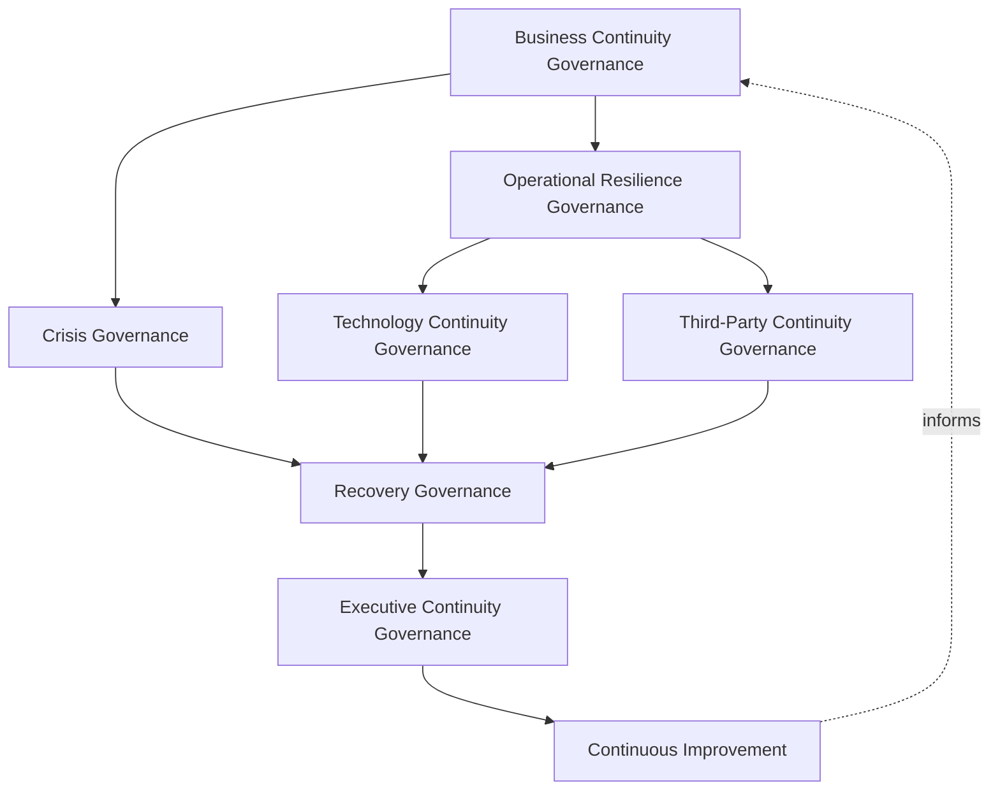
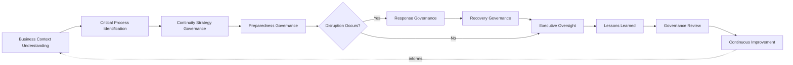
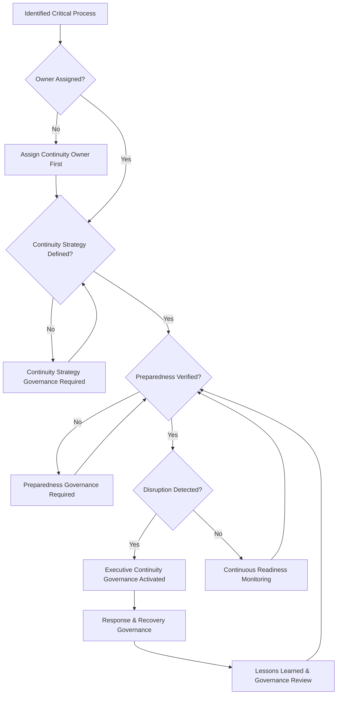
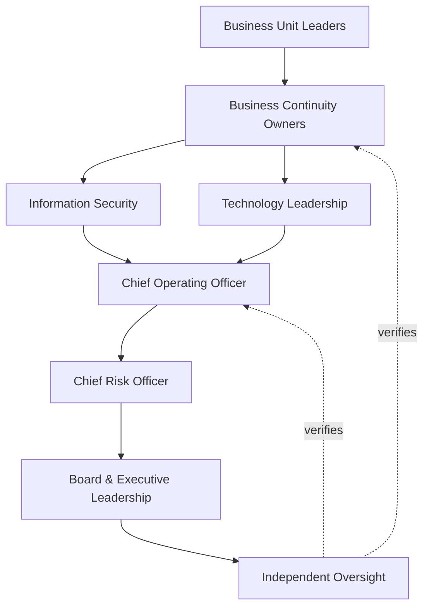
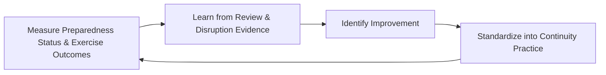

# Enterprise Business Continuity Governance Strategy

## 1. Document Purpose

This document defines the official Enterprise Business Continuity Governance Strategy for **StackLeo Tech Store** — the CRO/COO/CISO-owned executive charter under which the organization's ability to continue operating through, and recover from, disruption is governed as a deliberate, accountable discipline. It establishes governance for business continuity, organizational resilience, crisis governance, disruption governance, recovery governance, executive oversight, organizational accountability, and long-term business continuity maturity, consistent with ISO 22301, ISO 31000, ISO/IEC 27001, and TOGAF enterprise architecture thinking.

`business-continuity.md` remains the operational governance framework for continuity practice — the document that elaborates in full operational depth StackLeo's continuity lifecycle, domains, and crisis governance. This document sits above it as the highest-level executive mandate, consistent with the executive-charter relationship `enterprise-risk-management-strategy.md` holds over `risk-management.md`: it does not restate operational continuity detail, it establishes the philosophy, organizational ownership, and executive expectations that give continuity practice its authority and continuity at the level of the Board and executive leadership.

- **Purpose of Business Continuity Governance** — to ensure StackLeo can continue serving customers and operating the business through disruption, and recover deliberately and completely afterward, as a matter of genuine organizational discipline rather than assumed resilience.
- **Relationship with Enterprise Risk Management** — organizational resilience, established in `enterprise-risk-management-strategy.md` (Section 2.7), is one of the outcomes this strategy exists to deliver; disruption risk itself is identified and evaluated under that strategy's broader risk governance.
- **Relationship with Information Security** — a security incident is one of the disruption categories this strategy governs continuity through; `security-governance.md` and `incident-response.md` govern the technical and security-specific response, while this strategy governs the broader business continuity that response operates within.
- **Relationship with Third-Party Risk Governance** — the failure or unavailability of a critical third party, governed under `third-party-risk-governance.md` (Section 2.7), is a genuine business continuity risk this strategy plans for directly.
- **Relationship with Crisis Management** — crisis governance, elaborated in `business-continuity.md` (Section 6), is the acute, time-critical dimension of this strategy's broader continuity discipline, activated when disruption rises to genuine organizational crisis.
- **Relationship with Disaster Recovery** — `disaster-recovery.md` governs the technical recovery of platform infrastructure and data; this strategy governs the broader business continuity — customer service, operations, communication — that technical recovery is one input to, not the whole of.
- **Relationship with Executive Decision-Making** — this strategy exists to give executive leadership genuine confidence in the organization's ability to withstand disruption, a confidence that directly informs decisions about growth, expansion, and acceptable risk.

This document is implementation-independent and vendor-neutral. It defines business continuity governance philosophy, model, domains, and lifecycle conceptually — not specific BCM software, disaster recovery tools, backup vendors, cloud providers, consulting firms, monitoring platforms, security products, disaster recovery procedures, incident response workflows, backup implementations, failover mechanisms, infrastructure configurations, deployment architectures, recovery playbooks, operational continuity procedures, or code.

## 2. Business Continuity Philosophy

Business continuity governance at StackLeo rests on eight principles. Each exists to produce a specific business outcome — continuity is governed deliberately because disruption is not a question of if but when, and genuine resilience must be built before it is needed.

### 2.1 Organizational Resilience

The organization is built to withstand and continue operating through disruption, not merely to avoid disruption entirely.

- **Business Value** — protects business continuity even when a genuine, unavoidable disruption eventually occurs.

### 2.2 Continuity Before Recovery

Preventing an interruption to critical business function, wherever feasible, is prioritized before relying on recovering from one after it has occurred.

- **Business Value** — reduces the genuine cost and consequence of disruption by minimizing interruption in the first place.

### 2.3 Governance Before Operations

The accountability structure — who decides, who owns, who is accountable — is established before specific continuity activity is undertaken.

- **Business Value** — ensures continuity capability exists because a genuine, governed decision called for it, not as an ad hoc reaction to a past disruption.

### 2.4 Accountability

Every continuity governance decision traces to a specific, named, responsible party.

- **Business Value** — ensures every critical business function has someone genuinely responsible for its continuity.

### 2.5 Preparedness

The organization is genuinely prepared for disruption before it occurs, not merely committed in principle to responding when it does.

- **Business Value** — ensures response, when needed, is executed from genuine readiness rather than improvised under pressure.

### 2.6 Business Alignment

Continuity governance decisions are made in service of genuine business priority, focusing preparedness where disruption would matter most.

- **Business Value** — ensures limited continuity investment is directed toward what genuinely matters most to the business.

### 2.7 Adaptive Resilience

Continuity capability is designed to adapt to genuinely novel forms of disruption, not only the specific scenarios anticipated in advance.

- **Business Value** — protects the organization against disruption categories that planning alone could not have fully anticipated.

### 2.8 Continuous Improvement

Business continuity governance practice matures over time, informed by real disruption events, exercises, and the organization's growth in scale and complexity.

- **Business Value** — keeps continuity governance aligned with StackLeo's growth in scale, market reach, and operational complexity.

## 3. Enterprise Business Continuity Governance Model

Business continuity governance operates across eight conceptual layers, each holding accountability for a distinct dimension of organizational resilience. Every layer here is elaborated in full operational depth in `business-continuity.md`.

### 3.1 Business Continuity Governance

- **Purpose** — own the overall coherence of how the organization plans to continue operating through disruption.
- **Governance Scope** — oversight spanning every layer in this model and every domain in Section 4.
- **Business Value** — ensures continuity governance operates as a single coherent discipline, not a collection of disconnected local plans.
- **Executive Expectations** — leadership trusts no critical business function exists outside this framework's visibility.

### 3.2 Crisis Governance

- **Purpose** — own the coherence of how the organization governs itself during an acute, time-critical disruption.
- **Governance Scope** — oversight of Response Governance (Section 5.5), elaborated in `business-continuity.md` (Section 6).
- **Business Value** — ensures crisis decisions are made under a clear, pre-established governance structure, never improvised under pressure.
- **Executive Expectations** — leadership trusts crisis governance activates immediately and decisively when genuinely warranted.

### 3.3 Operational Resilience Governance

- **Purpose** — own the coherence of how day-to-day business operation continues functioning through disruption.
- **Governance Scope** — oversight of Customer Services, Sales & Marketplace, and Logistics & Delivery Continuity (Sections 4.1–4.2, 4.6).
- **Business Value** — protects the operational reliability customers directly experience, even under disruption.
- **Executive Expectations** — leadership trusts operational continuity is planned for proportionate to genuine business criticality.

### 3.4 Technology Continuity Governance

- **Purpose** — own the coherence of how platform technology continues functioning or is recovered through disruption.
- **Governance Scope** — oversight of Technology Services Continuity (Section 4.4), coordinated with `disaster-recovery.md`.
- **Business Value** — ensures the platform's technical foundation supports, rather than undermines, broader business continuity.
- **Executive Expectations** — leadership trusts technology continuity is tested, not merely documented.

### 3.5 Third-Party Continuity Governance

- **Purpose** — own the coherence of how dependency on external parties is planned for in continuity governance.
- **Governance Scope** — oversight of Vendor & Third-Party and Supply Chain Continuity (Sections 4.7, 4.5), coordinated with `third-party-risk-governance.md`.
- **Business Value** — ensures a critical third party's failure does not become an unplanned-for business continuity crisis.
- **Executive Expectations** — leadership expects third-party continuity dependency to be understood before, not discovered during, a disruption.

### 3.6 Recovery Governance

- **Purpose** — own the coherence of how the organization deliberately recovers from a realized disruption.
- **Governance Scope** — oversight of Recovery Governance (Section 5.6) across every domain in Section 4.
- **Business Value** — ensures recovery is a deliberate, governed process, never an ad hoc return to normal operation.
- **Executive Expectations** — leadership trusts recovery proceeds according to a genuine plan, not improvisation.

### 3.7 Executive Continuity Governance

- **Purpose** — own executive-level accountability for the continuity decisions carrying the greatest organizational consequence.
- **Governance Scope** — oversight spanning Sections 3.1–3.6 wherever a continuity matter rises to genuine executive or Board concern.
- **Business Value** — ensures the most consequential continuity gaps or crises are visible at the level accountable for the organization as a whole.
- **Executive Expectations** — leadership expects to be informed of, not surprised by, the organization's most significant continuity exposure.

### 3.8 Continuous Improvement

- **Purpose** — govern the mechanism by which every other layer in this model matures over time.
- **Governance Scope** — consolidates findings from continuity exercises, real disruption events, and audits across every domain in Section 4.
- **Business Value** — prevents continuity governance itself from becoming the next thing that quietly stagnates as the organization scales.
- **Executive Expectations** — leadership expects continuity maturity to be assessed periodically, not assumed static once established.

### Enterprise Business Continuity Governance Matrix

| Layer | Purpose | Business Value | Executive Expectations |
|---|---|---|---|
| Business Continuity Governance | Own overall coherence of how the organization plans to continue operating | Ensures governance operates as a single coherent discipline | Trusts no critical function exists outside this framework's visibility |
| Crisis Governance | Own coherence of governing acute, time-critical disruption | Ensures decisions made under pre-established structure | Trusts crisis governance activates immediately when warranted |
| Operational Resilience Governance | Own coherence of day-to-day operation continuing through disruption | Protects operational reliability even under disruption | Trusts continuity planned proportionate to genuine criticality |
| Technology Continuity Governance | Own coherence of platform technology continuing or recovering | Ensures the technical foundation supports broader continuity | Trusts technology continuity is tested, not merely documented |
| Third-Party Continuity Governance | Own coherence of planning for external dependency | Ensures third-party failure isn't an unplanned crisis | Expects dependency understood before, not during, a disruption |
| Recovery Governance | Own coherence of deliberately recovering from disruption | Ensures recovery is deliberate, never ad hoc | Trusts recovery proceeds according to a genuine plan |
| Executive Continuity Governance | Own executive accountability for highest-consequence decisions | Ensures the most consequential gaps are visible to leadership | Expects leadership informed of, not surprised by, top exposure |
| Continuous Improvement | Govern maturation of every other layer | Prevents governance itself from stagnating | Expects maturity to be assessed periodically |

*Diagram 1: Enterprise Business Continuity Governance Framework — continuity and crisis governance establish the foundation, operational resilience extends it through technology and third-party continuity, recovery governance closes the disruption cycle, and executive oversight converges on continuous improvement that feeds back into the model.*

## 4. Enterprise Business Continuity Domains

Business continuity is governed across ten conceptual domains, each requiring a distinct resilience emphasis.

### 4.1 Customer Services Continuity

- **Purpose** — protect the customer's ability to shop, receive support, and interact with StackLeo through disruption.
- **Continuity Considerations** — governed under Operational Resilience Governance (Section 3.3), given its direct effect on customer experience.
- **Business Importance** — protects the trust relationship every customer transaction depends on.
- **Executive Expectations** — leadership expects customer-facing continuity to be prioritized above internal-only functions.

### 4.2 Sales & Marketplace Continuity

- **Purpose** — protect the platform's ability to process sales and, eventually, marketplace transactions through disruption.
- **Continuity Considerations** — governed under Operational Resilience Governance (Section 3.3), structured ahead of the marketplace model's launch.
- **Business Importance** — protects the core revenue-generating function of the business.
- **Executive Expectations** — leadership expects sales continuity to be planned for with the highest business-criticality priority.

### 4.3 Financial Operations Continuity

- **Purpose** — protect payment processing, reconciliation, and financial reporting through disruption.
- **Continuity Considerations** — governed under Recovery Governance (Section 3.6), given regulatory and audit sensitivity.
- **Business Importance** — protects the business's financial integrity and its standing with regulators and payment partners.
- **Executive Expectations** — leadership expects financial operations continuity to meet the strictest planning rigor in this model.

### 4.4 Technology Services Continuity

- **Purpose** — protect the platform's technical infrastructure and services through disruption.
- **Continuity Considerations** — governed under Technology Continuity Governance (Section 3.4), coordinated with `disaster-recovery.md`.
- **Business Importance** — protects the technical foundation every other continuity domain ultimately depends on.
- **Executive Expectations** — leadership expects technology continuity capability to be genuinely tested, not merely designed.

### 4.5 Supply Chain Continuity

- **Purpose** — protect the sourcing relationships that supply the products StackLeo sells.
- **Continuity Considerations** — governed under Third-Party Continuity Governance (Section 3.5), anticipating growth in wholesale sourcing.
- **Business Importance** — protects the business's ability to reliably source the products it depends on to operate.
- **Executive Expectations** — leadership expects supply chain continuity plans to be reviewed as sourcing relationships evolve.

### 4.6 Logistics & Delivery Continuity

- **Purpose** — protect the fulfillment and delivery process through disruption.
- **Continuity Considerations** — governed under Operational Resilience Governance (Section 3.3), given its direct role in the customer experience.
- **Business Importance** — protects the operational reliability customers directly experience.
- **Executive Expectations** — leadership expects logistics continuity to include planning for courier and delivery partner disruption.

### 4.7 Vendor & Third-Party Continuity

- **Purpose** — protect the business from disruption originating in a third-party relationship.
- **Continuity Considerations** — governed under Third-Party Continuity Governance (Section 3.5), coordinated with `third-party-risk-governance.md`.
- **Business Importance** — protects against disruption risk StackLeo does not directly control but is nonetheless exposed to.
- **Executive Expectations** — leadership expects critical third-party dependency to be explicitly identified and planned for.

### 4.8 Employee & Workforce Continuity

- **Purpose** — protect the organization's ability to continue operating with its own people through disruption.
- **Continuity Considerations** — governed under Business Continuity Governance (Section 3.1), coordinated with `06_Security/identity-lifecycle.md`.
- **Business Importance** — protects the organization's most fundamental operational capability — its own workforce.
- **Executive Expectations** — leadership expects workforce continuity to address both operational capability and genuine employee wellbeing.

### 4.9 Regulatory & Compliance Continuity

- **Purpose** — protect the organization's ability to continue meeting its obligations through disruption.
- **Continuity Considerations** — governed under Executive Continuity Governance (Section 3.7), coordinated with `06_Security/compliance-governance.md`.
- **Business Importance** — protects the business's standing with regulators even during a disruptive event.
- **Executive Expectations** — leadership expects regulatory obligations to remain met, not suspended, during disruption.

### 4.10 Executive Operations Continuity

- **Purpose** — protect the organization's ability to continue being led and directed through disruption.
- **Continuity Considerations** — governed under Executive Continuity Governance (Section 3.7), coordinated with the Board's own governance practice.
- **Business Importance** — protects the organization's fundamental decision-making capability during its most consequential moments.
- **Executive Expectations** — leadership expects executive succession and decision continuity to be explicitly planned for.

### Enterprise Business Continuity Domain Matrix

| Domain | Purpose | Business Importance | Executive Expectations |
|---|---|---|---|
| Customer Services Continuity | Protect customer shopping and support capability | Protects the trust relationship every transaction depends on | Prioritized above internal-only functions |
| Sales & Marketplace Continuity | Protect sales and marketplace transaction processing | Protects the core revenue-generating function | Planned for with the highest business-criticality priority |
| Financial Operations Continuity | Protect payment, reconciliation, and reporting | Protects financial integrity and regulator/partner standing | Meets the strictest planning rigor in this model |
| Technology Services Continuity | Protect platform technical infrastructure and services | Protects the technical foundation every domain depends on | Genuinely tested, not merely designed |
| Supply Chain Continuity | Protect sourcing relationships supplying products sold | Protects the ability to reliably source dependent products | Reviewed as sourcing relationships evolve |
| Logistics & Delivery Continuity | Protect fulfillment and delivery through disruption | Protects the operational reliability customers experience | Includes planning for courier and delivery partner disruption |
| Vendor & Third-Party Continuity | Protect against disruption originating in third parties | Protects against risk not directly controlled | Critical dependency explicitly identified and planned for |
| Employee & Workforce Continuity | Protect operating capability with the organization's people | Protects the organization's most fundamental capability | Addresses both operational capability and employee wellbeing |
| Regulatory & Compliance Continuity | Protect the ability to continue meeting obligations | Protects standing with regulators during disruption | Obligations remain met, not suspended, during disruption |
| Executive Operations Continuity | Protect the ability to continue being led and directed | Protects fundamental decision-making capability | Executive succession and decision continuity explicitly planned |

## 5. Enterprise Business Continuity Lifecycle

Continuity is governed across ten conceptual lifecycle stages, applicable across every domain in Section 4.

### 5.1 Business Context Understanding

- **Purpose** — establish a genuine understanding of StackLeo's business, operations, and dependencies.
- **Governance Objectives** — require context to be understood before continuity strategy is developed, consistent with Section 2.3.
- **Business Value** — ensures continuity planning is genuinely relevant to StackLeo's actual operations, not generic assumption.

### 5.2 Critical Process Identification

- **Purpose** — identify which business processes are genuinely critical to continued operation.
- **Governance Objectives** — require identification to reflect genuine business priority, consistent with Business Alignment (Section 2.6).
- **Business Value** — ensures continuity effort is directed toward what genuinely matters most, not spread uniformly.

### 5.3 Continuity Strategy Governance

- **Purpose** — govern how the organization decides its approach to maintaining critical processes through disruption.
- **Governance Objectives** — require strategy to reflect Continuity Before Recovery (Section 2.2) wherever genuinely feasible.
- **Business Value** — ensures the chosen approach genuinely addresses the criticality identified in the prior stage.

### 5.4 Preparedness Governance

- **Purpose** — govern how the organization becomes genuinely ready to execute its continuity strategy.
- **Governance Objectives** — require preparedness to be verified, not merely documented, consistent with Preparedness (Section 2.5).
- **Business Value** — ensures the organization can genuinely execute its plan when disruption actually occurs.

### 5.5 Response Governance

- **Purpose** — govern how the organization responds during an actual disruption.
- **Governance Objectives** — require response to follow the pre-established governance structure, consistent with Crisis Governance (Section 3.2).
- **Business Value** — ensures response decisions are made deliberately, not improvised under pressure.

### 5.6 Recovery Governance

- **Purpose** — govern how the organization deliberately returns to normal operation after disruption.
- **Governance Objectives** — require recovery to proceed according to a genuine plan, consistent with Section 3.6.
- **Business Value** — ensures recovery is complete and deliberate, never a premature or incomplete return to normal.

### 5.7 Executive Oversight

- **Purpose** — sustain executive and Board-level visibility into continuity readiness and any active disruption.
- **Governance Objectives** — require oversight to occur continuously, not only when a disruption is already underway.
- **Business Value** — ensures leadership maintains genuine confidence in organizational resilience over time.

### 5.8 Lessons Learned

- **Purpose** — formally capture what a real disruption or exercise reveals about continuity governance itself.
- **Governance Objectives** — require lessons to be documented and attributed to specific governance implications.
- **Business Value** — ensures the organization genuinely learns from experience rather than repeating the same gaps.

### 5.9 Governance Review

- **Purpose** — formally reassess whether this strategy's model, domains, and lifecycle remain fit for purpose.
- **Governance Objectives** — require review to occur periodically, consistent with Executive Oversight (Section 8).
- **Business Value** — keeps continuity governance itself from becoming the next thing that silently drifts out of relevance.

### 5.10 Continuous Improvement

- **Purpose** — apply accumulated lessons to strengthen future continuity strategy and preparedness.
- **Governance Objectives** — require findings to be genuinely analyzed for recurring patterns, consistent with Continuous Learning (Section 6).
- **Business Value** — turns each disruption or exercise into an input that makes future continuity genuinely stronger.

### Enterprise Business Continuity Lifecycle Matrix

| Stage | Purpose | Governance Objective | Business Value |
|---|---|---|---|
| Business Context Understanding | Establish genuine understanding of operations and dependencies | Understood before continuity strategy is developed | Ensures planning is genuinely relevant, not generic |
| Critical Process Identification | Identify processes genuinely critical to continued operation | Reflects genuine business priority | Directs effort toward what genuinely matters most |
| Continuity Strategy Governance | Decide the approach to maintaining critical processes | Reflects continuity before recovery wherever feasible | Ensures the approach addresses identified criticality |
| Preparedness Governance | Become genuinely ready to execute the strategy | Verified, not merely documented | Ensures the organization can genuinely execute when needed |
| Response Governance | Respond during an actual disruption | Follows the pre-established governance structure | Ensures decisions are deliberate, not improvised |
| Recovery Governance | Deliberately return to normal operation | Proceeds according to a genuine plan | Ensures recovery is complete, never premature |
| Executive Oversight | Sustain leadership visibility into readiness and disruption | Occurs continuously, not only during disruption | Ensures leadership maintains genuine confidence over time |
| Lessons Learned | Capture what disruption or exercises reveal about governance | Documented and attributed to specific implications | Ensures genuine learning rather than repeated gaps |
| Governance Review | Reassess whether the strategy remains fit for purpose | Occurs periodically | Prevents governance itself from drifting out of relevance |
| Continuous Improvement | Apply lessons to strengthen future practice | Findings genuinely analyzed for recurring patterns | Makes future continuity genuinely stronger |

*Diagram 2: Enterprise Business Continuity Lifecycle — business context and critical process understanding inform continuity strategy and preparedness, with response and recovery governing an actual disruption, before executive oversight, lessons learned, and governance review feed continuous improvement back into the cycle.*

## 6. Business Continuity Governance Principles

- **Accountability** — every continuity decision traces to a specific, named, responsible party, consistent with Section 2.4.
- **Preparedness** — the organization is genuinely, verifiably ready before disruption occurs, consistent with Section 2.5.
- **Resilience** — the organization is built to withstand and continue through disruption, consistent with Section 2.1.
- **Transparency** — continuity plans, readiness status, and disruption response are documented and visible to those who need them.
- **Business Alignment** — continuity governance decisions are made in service of genuine business priority.
- **Risk Awareness** — continuity planning is directly informed by the disruption risk identified under `enterprise-risk-management-strategy.md`.
- **Continuous Learning** — each exercise and real disruption deepens the organization's genuine continuity capability.
- **Continuous Improvement** — governance practice matures over time, informed by real events and exercises.

### Business Continuity Governance Principles Matrix

| Principle | Description | Business Value |
|---|---|---|
| Accountability | Every decision traces to a specific, named, responsible party | Ensures continuity decisions have a clear owner |
| Preparedness | The organization is genuinely, verifiably ready | Ensures response executed from readiness, not improvisation |
| Resilience | The organization is built to withstand and continue through disruption | Protects continuity when disruption eventually occurs |
| Transparency | Plans, readiness, and response documented and visible | Allows continuity posture to be scrutinized and defended |
| Business Alignment | Decisions made in service of genuine business priority | Directs limited investment toward what matters most |
| Risk Awareness | Planning directly informed by identified disruption risk | Ensures continuity addresses genuine, assessed risk |
| Continuous Learning | Each exercise and disruption deepens genuine capability | Ensures capability improves rather than stagnates |
| Continuous Improvement | Practice matures from real events and exercises | Keeps continuity governance aligned with organizational growth |

*Diagram 4: Enterprise Business Continuity Decision Flow — a critical process is checked for ownership, defined strategy, and verified preparedness, with executive governance activated upon detected disruption, resolving into response, recovery, and lessons learned that feed back into continued readiness verification.*

## 7. Ownership & Accountability

Governance authority for business continuity is distributed deliberately across eight accountable functions, defined here at the governance-objective level, without prescribing specific operational continuity activities.

### 7.1 Board & Executive Leadership

- **Governance Objective** — the Board and executive leadership hold ultimate accountability for organizational resilience and business continuity governance.
- **Business Value** — provides a single point of ultimate accountability for whether continuity governance is genuinely functioning as intended.

### 7.2 Chief Operating Officer

- **Governance Objective** — the Chief Operating Officer owns the coherence and enforcement of this strategy across every domain, layer, and stage it defines.
- **Business Value** — provides a single point of specialist accountability for whether business continuity is genuinely functioning as intended.

### 7.3 Chief Risk Officer

- **Governance Objective** — the Chief Risk Officer ensures continuity planning remains aligned to the disruption risk identified under `enterprise-risk-management-strategy.md`.
- **Business Value** — ensures continuity governance remains a genuine response to assessed risk, not a disconnected parallel exercise.

### 7.4 Business Continuity Owners

- **Governance Objective** — each critical process has a specific, named continuity owner accountable for its continuity strategy and preparedness.
- **Business Value** — ensures no critical process persists without someone genuinely responsible for its continuity.

### 7.5 Information Security

- **Governance Objective** — information security owns Technology Continuity Governance's security dimension, coordinated with `06_Security/security-governance.md` and `disaster-recovery.md`.
- **Business Value** — ensures technical continuity remains integrated with, not separate from, broader security discipline.

### 7.6 Technology Leadership

- **Governance Objective** — technology leadership owns Technology Services Continuity (Section 4.4), coordinated with `disaster-recovery.md`.
- **Business Value** — ensures the platform's technical foundation genuinely supports broader business continuity.

### 7.7 Business Unit Leaders

- **Governance Objective** — business unit leaders own continuity preparedness within their own function, consistent with Critical Process Identification (Section 5.2).
- **Business Value** — ensures continuity is genuinely embedded within the functions closest to critical business processes.

### 7.8 Independent Oversight

- **Governance Objective** — an independent function, separate from those who design and operate continuity governance, periodically verifies its overall effectiveness.
- **Business Value** — prevents governance from being assumed effective on the word of the same function responsible for running it.

### Ownership & Accountability Matrix

| Role | Governance Objective | Business Value |
|---|---|---|
| Board & Executive Leadership | Hold ultimate accountability for organizational resilience | Provides a single point of ultimate accountability |
| Chief Operating Officer | Own coherence and enforcement of this strategy | Provides a single point of specialist accountability |
| Chief Risk Officer | Ensure planning remains aligned to identified disruption risk | Keeps governance a genuine response to assessed risk |
| Business Continuity Owners | Own strategy and preparedness for a specific critical process | Ensures no critical process persists without genuine responsibility |
| Information Security | Own the security dimension of technology continuity | Ensures technical continuity is integrated with security discipline |
| Technology Leadership | Own Technology Services Continuity | Ensures the technical foundation genuinely supports continuity |
| Business Unit Leaders | Own continuity preparedness within their own function | Ensures continuity is embedded closest to critical processes |
| Independent Oversight | Independently verify overall governance effectiveness | Prevents self-assessed assumption of effectiveness |

*Diagram 3: Business Continuity Ownership & Accountability Model — accountability flows from business unit and continuity ownership through security and technology leadership into the Chief Operating Officer and Chief Risk Officer, converging on Board oversight verified by independent oversight.*

## 8. Executive Oversight

- **Executive Business Continuity Reviews** — the overall coherence of continuity governance is formally reviewed on a regular cadence, consistent with `06_Security/security-governance.md` (Section 6).
- **Organizational Resilience Reporting** — aggregated continuity health — critical process coverage, preparedness status, exercise outcomes — is reported to executive leadership and the Board.
- **Governance Reviews** — the governance model, domains, and lifecycle defined in this strategy (Sections 3–7) are periodically reassessed for continued fitness.
- **Crisis Readiness Reviews** — the organization's readiness to activate Crisis Governance (Section 3.2) is reviewed directly with executive leadership.
- **Documentation Governance** — this strategy's relationship to `business-continuity.md`, `disaster-recovery.md`, and `enterprise-risk-management-strategy.md` is kept current as those documents evolve.
- **Audit Readiness** — continuity decisions, evidence, and outcomes are maintained in a state ready for internal or external audit at any time, coordinated with `06_Security/audit-governance.md`.

### Executive Oversight Matrix

| Oversight Mechanism | Purpose | Governance Role |
|---|---|---|
| Executive Business Continuity Reviews | Confirm overall continuity governance coherence | Regular, predictable cadence for the strategy as a whole |
| Organizational Resilience Reporting | Provide leadership a single, coherent continuity picture | Reports critical process coverage, preparedness, exercise outcomes |
| Governance Reviews | Reassess the governance model itself for continued fitness | Applies to Sections 3–7 of this strategy |
| Crisis Readiness Reviews | Review readiness to activate crisis governance | Direct executive-level review of crisis activation capability |
| Documentation Governance | Keep this strategy's subordinate relationships current | Updated as related documents evolve |
| Audit Readiness | Maintain decisions and evidence ready for independent review | Continuous state, coordinated with audit governance |

### Governance Responsibility Matrix

| Role | Responsibility |
|---|---|
| Board & Executive Leadership | Owns ultimate accountability for organizational resilience and business continuity governance. |
| Chief Operating Officer | Owns coherence and enforcement of this strategy, in partnership with the Board. |
| Business Continuity Governance Lead | Owns the operational continuity model within `business-continuity.md`. |
| Chief Risk Officer | Ensures continuity planning remains aligned to enterprise risk. |
| Business Continuity Owners | Own strategy and preparedness within their assigned critical process. |
| Information Security | Owns the security dimension of technology continuity. |
| Technology Leadership | Owns Technology Services Continuity in coordination with `disaster-recovery.md`. |
| Independent Oversight | Independently verifies the overall effectiveness of continuity governance. |

## 9. Future Readiness

This strategy is designed to remain valid as StackLeo evolves in scale, geography, and organizational complexity, without requiring redefinition of its underlying philosophy.

- **AI-Assisted Business Continuity** — as continuity monitoring and disruption detection increasingly incorporate AI-assisted analysis, they remain governed under Executive Oversight (Section 5.7) at the same rigor as any other method.
- **Enterprise Scale** — the governance model, domains, and lifecycle defined throughout this strategy are defined independently of organizational size, so they remain coherent as StackLeo's operational complexity grows substantially.
- **Global Expansion** — Business Context Understanding (Section 5.1) is structured to be re-established as StackLeo expands from Bangladesh into South Asia and global markets, each with genuinely distinct continuity considerations.
- **Multi-Region Operations** — Supply Chain and Logistics & Delivery Continuity (Sections 4.5–4.6) are structured to absorb genuinely multi-region operational complexity as it emerges.
- **Multi-Tenant Platforms** — where future architecture introduces tenant isolation, Technology Continuity Governance (Section 3.4) extends to explicitly scope continuity per tenant.
- **Digital Resilience** — this strategy's governance discipline is treated as a direct contributor to the digital trust customers, partners, and regulators extend to StackLeo, not merely an internal control exercise.
- **Adaptive Organizations** — Adaptive Resilience (Section 2.7) extends to encompass increasingly flexible organizational structures capable of responding to genuinely novel disruption categories.
- **Future Risk Landscapes** — Continuous Improvement (Section 3.8) and Continuous Learning (Section 6) are structured to absorb genuinely new categories of disruption risk as they emerge, without requiring this strategy to be rewritten.

## 10. Business Continuity Governance Maturity Model

Business continuity governance maturity is described across five conceptual levels, consistent with ISO 22301 and established process maturity thinking.

- **Initial** — continuity governance, where it exists, is informal and inconsistent; critical processes are identified reactively, and ownership is unclear.
- **Managed** — basic continuity governance exists for individual domains, but consistency across the ten domains in Section 4 varies significantly.
- **Defined** — the governance model, domains, and lifecycle are standardized, documented, and consistently applied across the organization, consistent with the model defined throughout this strategy.
- **Measured** — critical process coverage, preparedness status, and exercise outcomes are measured systematically, and decisions are grounded in genuine evidence rather than qualitative impression alone.
- **Optimizing** — business continuity governance is continuously and deliberately improved based on quantitative evidence and organizational learning; improvement itself is a managed, ongoing discipline rather than an occasional initiative.

### Business Continuity Governance Maturity Model Matrix

| Level | Characteristics | Primary Focus |
|---|---|---|
| Initial | Informal, inconsistent governance; critical processes identified reactively | Ad hoc, individually-dependent continuity practice |
| Managed | Basic governance exists per domain; consistency varies | Domain-level consistency |
| Defined | Standardized governance model, domains, and lifecycle | Organization-wide consistency and clear ownership |
| Measured | Coverage, preparedness, and exercise outcomes measured systematically | Evidence-based continuity governance decisions |
| Optimizing | Practice continuously and deliberately improved from evidence | Sustained, deliberate improvement as a discipline |

*Diagram 5: Continuous Business Continuity Improvement Cycle — continuity exercise and real disruption outcomes are measured, learned from, improved upon, and standardized back into governed practice, on a continuing basis.*

*Diagram 6: Business Continuity Governance Maturity Progression Model — maturity advances from informal, reactively-identified continuity practice toward standardized, measured, and continuously optimized business continuity governance.*

## 11. Anti-Patterns

The following recurring failure patterns are explicitly recognized and avoided, as each one structurally undermines this strategy.

### Anti-Pattern Summary

| Anti-Pattern | Why It's Avoided |
|---|---|
| Continuity Without Ownership | Contradicts Business Continuity Owners (Section 7.4); a critical process with no accountable owner has no one genuinely responsible for its continuity. |
| Recovery Without Preparedness | Contradicts Continuity Before Recovery (Section 2.2); relying solely on recovery without genuine preparedness accepts avoidable disruption impact. |
| Siloed Continuity Planning | Contradicts the Enterprise Business Continuity Governance Model (Section 3); domain-by-domain planning that never converges leaves no coherent, organization-wide picture of resilience. |
| Weak Executive Visibility | Contradicts Organizational Resilience Reporting (Section 8); leadership cannot govern continuity risk it is never shown. |
| Poor Documentation | Undermines Documentation Governance (Section 8) and Transparency (Section 6), leaving continuity decisions unclear or unverifiable after the fact. |
| Technology-Only Continuity Thinking | Contradicts Organizational Resilience (Section 2.1); treating continuity as purely a technical recovery exercise misses customer, operational, and workforce consequence. |
| Compliance Without Resilience | Contradicts Regulatory & Compliance Continuity (Section 4.9); satisfying a continuity checklist without genuine operational resilience leaves the organization compliant on paper and exposed in practice. |
| Missing Continuous Improvement | Contradicts Continuous Improvement (Section 2.8) and Continuous Improvement (Section 3.8); without deliberate improvement, continuity governance stagnates as the organization and its risk landscape grow. |

## 12. Document Information

| Property | Value |
|----------|-------|
| Document | business-continuity-governance.md |
| Version | 1.0.0 |
| Status | Active |
| Maintained By | StackLeo |
| Last Updated | 2026-07-24 |

---

© StackLeo. All Rights Reserved.
