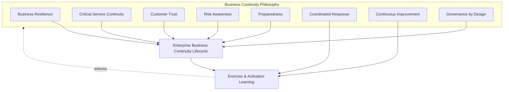
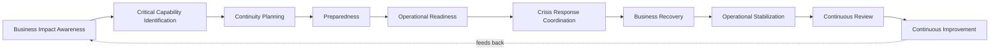
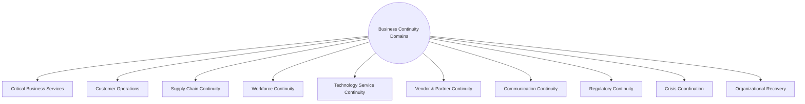
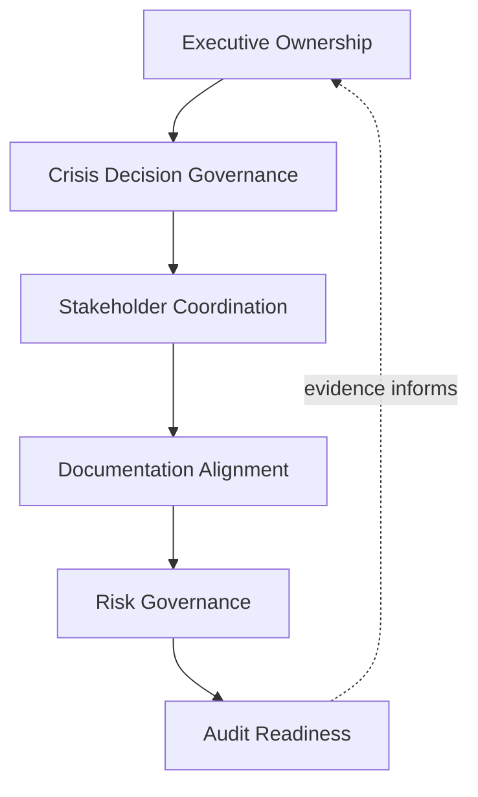
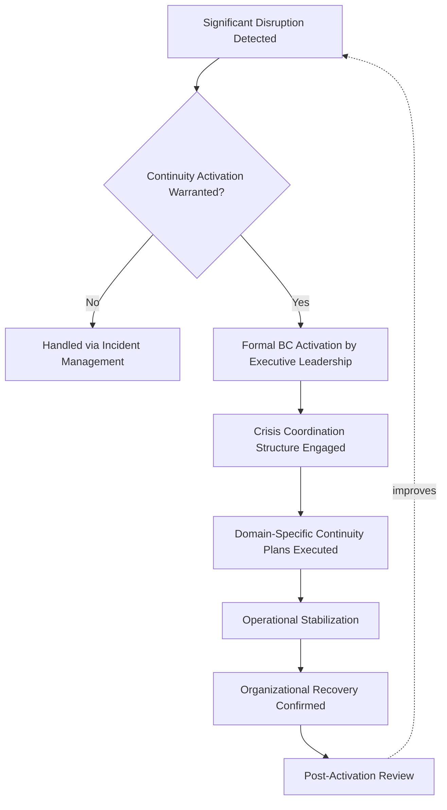
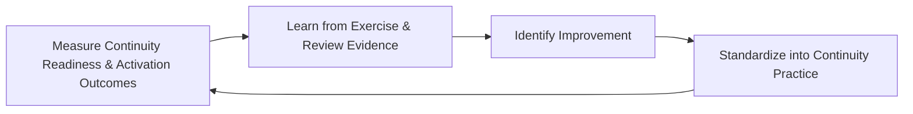

# Enterprise Business Continuity Management Strategy

## 1. Document Purpose

This document defines the official Enterprise Business Continuity Management (BCM) Strategy for **StackLeo Tech Store**, from the perspective of enterprise operations. It establishes how the organization prepares for, coordinates through, and recovers from disruption at every scale — independent of any specific BCM software, crisis management tool, or communication platform.

`06_Security/business-continuity.md` remains the authoritative source for StackLeo's foundational business continuity philosophy, resilience principles, and governance model, extending resilience thinking from `06_Security/security-principles.md` across the whole organization. This document is that philosophy's operational execution counterpart: it governs how continuity capability is actually organized, exercised, tested, and coordinated in practice across business operations — workforce, customer operations, supply chain, vendor relationships, and crisis response — as a COO-owned operational discipline sitting alongside, not beneath, the enterprise-wide governance defined there.

- **Purpose of Business Continuity** — to ensure the business itself, not merely its technical systems, continues to function through disruption of any scale, keeping commerce, customer support, and critical operations running in some meaningful form.
- **Relationship with Operations** — this document is the continuity-specific elaboration of Business Continuity in `operations-overview.md` (Section 5.9); it defines specifically how continuity capability is organized and sustained as an operational discipline, day to day and through crisis.
- **Relationship with Disaster Recovery** — `06_Security/disaster-recovery.md` answers how systems and infrastructure are technically restored; this document answers how the business as a whole continues operating while that restoration occurs, coordinated through the executable procedures defined in `operational-runbooks.md` (Sections 4.6–4.7).
- **Relationship with Incident Management** — a technical incident, per `incident-management.md` (Section 4.8, Major Incident Governance), may escalate into a business continuity activation when its impact extends beyond a contained technical event into broader business disruption; this document defines the operational mechanics of that activation.
- **Relationship with Operational Risk Management** — this strategy applies ISO 31000-aligned risk thinking to the specific question of what could disrupt the business and how severely, directly informing Critical Capability Identification (Section 3.2).
- **Relationship with Enterprise Governance** — business continuity activation is among the most consequential operational decisions the organization can make; this document ensures that decision, and the response it triggers, is governed with executive accountability commensurate with its significance.
- **Relationship with Organizational Resilience** — this document positions continuity not as a plan filed away for a rare emergency, but as a continuously sustained organizational capability, consistent with Operational Resilience in `operations-overview.md` (Section 2.5).

This document is implementation-independent and vendor-neutral. It defines business continuity philosophy, lifecycle, domains, and governance conceptually — not specific BCM software, crisis management tools, communication platforms, recovery timelines, recovery objective values, or infrastructure configuration.

## 2. Business Continuity Philosophy

Business continuity at StackLeo is governed by eight principles. Each exists to produce a specific business outcome — continuity is pursued deliberately because of what it protects for customers and the business through disruption, not as a compliance formality.

### 2.1 Business Resilience

The business is structured and prepared to absorb disruption and continue functioning, rather than assuming disruption will simply not occur.

- **Business Value** — accepts that disruption is eventually inevitable and invests in the capability to withstand it, protecting revenue and customer relationships precisely when they are most at risk.

### 2.2 Critical Service Continuity

The services most essential to customers and the business, identified through Critical Capability Identification (Section 3.2), receive priority protection and recovery attention.

- **Business Value** — ensures finite continuity investment protects what matters most first, rather than being spread evenly regardless of consequence.

### 2.3 Customer Trust

Continuity decisions are made with explicit awareness of their effect on customer trust, consistent with the brand commitment in `01_Business/vision.md`.

- **Business Value** — customers judge StackLeo not only by whether disruption occurs, but by whether the business continues to serve them reliably through it.

### 2.4 Risk Awareness

Continuity planning is grounded in a genuine understanding of what could disrupt the business and how severely, consistent with ISO 31000 risk management thinking.

- **Business Value** — directs continuity investment toward genuinely plausible and consequential scenarios, not generic or unlikely ones.

### 2.5 Preparedness

Continuity capability exists and is validated in advance of the disruption it addresses, never assembled reactively once a crisis has already begun.

- **Business Value** — ensures the organization is genuinely ready when disruption occurs, rather than discovering gaps in the moment they matter most.

### 2.6 Coordinated Response

Response to significant disruption follows a known, practiced structure, consistent with Crisis Response Coordination (Section 3.6), rather than being improvised uniquely each time.

- **Business Value** — reduces confusion and wasted effort during exactly the moments when clarity and speed matter most.

### 2.7 Continuous Improvement

Continuity practice matures over time, informed by real exercises, activations, and evolving business scale.

- **Business Value** — keeps continuity capability aligned with StackLeo's growth from single-market B2C retailer toward marketplace, corporate sales, and regional expansion.

### 2.8 Governance by Design

Continuity governance structures are established deliberately as capability is built, not retrofitted once a gap has already caused harm during an actual disruption.

- **Business Value** — prevents the costly, high-stakes discovery of governance gaps during a live crisis rather than during calm, deliberate planning.

*Diagram 1: Business Continuity Philosophy Overview — the eight principles shape the enterprise business continuity lifecycle, and exercise and activation learning feed back into the philosophy itself.*

## 3. Enterprise Business Continuity Lifecycle

Business continuity is governed across ten conceptual stages, spanning from initial business impact awareness through continuous improvement.

### 3.1 Business Impact Awareness

- **Purpose** — understand the genuine consequences to customers and the business if a given capability were disrupted.
- **Business Value** — grounds subsequent planning in real business consequence rather than generic assumption.
- **Governance Objectives** — require business impact understanding to be documented for every critical capability before continuity planning begins.

### 3.2 Critical Capability Identification

- **Purpose** — identify which business capabilities are essential enough to warrant dedicated continuity planning.
- **Business Value** — ensures continuity investment is prioritized deliberately, consistent with Critical Service Continuity (Section 2.2).
- **Governance Objectives** — require critical capability status to be reviewed periodically as the business and its service portfolio (`service-catalog.md`) evolve.

### 3.3 Continuity Planning

- **Purpose** — determine how each identified critical capability will continue functioning, in some meaningful form, through disruption.
- **Business Value** — converts abstract awareness of risk into a concrete, actionable plan.
- **Governance Objectives** — require every critical capability to have a documented continuity plan before it is considered continuity-ready.

### 3.4 Preparedness

- **Purpose** — establish the concrete readiness — trained people, prepared procedures, validated alternatives — that a continuity plan depends on.
- **Business Value** — ensures a plan on paper translates into genuine organizational capability.
- **Governance Objectives** — require preparedness to be confirmed through exercises, not assumed from the plan's existence alone.

### 3.5 Operational Readiness

- **Purpose** — confirm the organization is specifically prepared to activate and execute continuity plans at the moment they are needed.
- **Business Value** — bridges the gap between having a plan and being able to execute it under real, often stressful, conditions.
- **Governance Objectives** — connect to Operational Readiness in `operations-overview.md` (Section 4.3), applying the same rigor to continuity-specific readiness.

### 3.6 Crisis Response Coordination

- **Purpose** — organize the people, decisions, and communication required to respond once significant disruption occurs.
- **Business Value** — ensures a coordinated, practiced response rather than an improvised one during the organization's most consequential moments.
- **Governance Objectives** — require a clear crisis coordination structure to be established and known in advance, per Crisis Governance (Section 6).

### 3.7 Business Recovery

- **Purpose** — restore normal business function following disruption, once immediate crisis response has stabilized the situation.
- **Business Value** — directly determines how quickly the business returns to serving customers and generating revenue normally.
- **Governance Objectives** — require recovery actions to be tracked and coordinated with technical recovery per `06_Security/disaster-recovery.md`.

### 3.8 Operational Stabilization

- **Purpose** — confirm that recovered operations are genuinely stable and sustainable, not merely temporarily functioning.
- **Business Value** — prevents a premature declaration of "back to normal" that leaves the business exposed to renewed disruption.
- **Governance Objectives** — require explicit confirmation of stabilization before formally closing a continuity activation.

### 3.9 Continuous Review

- **Purpose** — periodically evaluate the overall health and readiness of business continuity capability, not only after an actual activation.
- **Business Value** — gives leadership an honest, evidence-based view of continuity maturity, supporting informed investment decisions.
- **Governance Objectives** — require review to occur on a regular, predictable cadence, connected to Executive Reviews in `service-level-management.md` (Section 6.3).

### 3.10 Continuous Improvement

- **Purpose** — act on exercise, activation, and review findings to deliberately improve continuity capability.
- **Business Value** — ensures continuity effectiveness compounds over time rather than remaining static as the business and platform grow.
- **Governance Objectives** — require improvement actions arising from review to be documented and tracked to completion.

### Enterprise Business Continuity Lifecycle Matrix

| Stage | Purpose | Business Value | Governance Objective |
|---|---|---|---|
| Business Impact Awareness | Understand consequences of disruption to a capability | Grounds planning in real business consequence | Documented for every critical capability before planning |
| Critical Capability Identification | Identify capabilities essential enough for dedicated planning | Ensures investment is prioritized deliberately | Reviewed periodically as the business and portfolio evolve |
| Continuity Planning | Determine how a capability continues through disruption | Converts abstract risk awareness into an actionable plan | Every critical capability has a documented plan |
| Preparedness | Establish concrete readiness a plan depends on | Ensures a plan translates into genuine capability | Confirmed through exercises, not assumed |
| Operational Readiness | Confirm ability to activate and execute plans | Bridges having a plan and executing it under real conditions | Same rigor as general operational readiness |
| Crisis Response Coordination | Organize people, decisions, communication for response | Ensures coordinated, practiced response | Clear structure established and known in advance |
| Business Recovery | Restore normal business function post-disruption | Determines speed of return to normal service and revenue | Coordinated with technical recovery practice |
| Operational Stabilization | Confirm recovered operations are genuinely stable | Prevents premature declaration of "back to normal" | Explicit confirmation required before closing activation |
| Continuous Review | Periodically evaluate overall continuity health | Honest, evidence-based view for investment decisions | Regular cadence, connected to executive review |
| Continuous Improvement | Act on findings to improve continuity capability | Effectiveness compounds over time | Improvement actions tracked to completion |

*Diagram 2: Enterprise Business Continuity Lifecycle — a continuous cycle in which review and improvement directly inform the next iteration of business impact awareness.*

## 4. Business Continuity Domains

Business continuity spans ten conceptual domains, each addressing a distinct dimension of what must continue functioning through disruption.

### 4.1 Critical Business Services

- **Purpose** — protect the specific services identified as most essential to customers and the business, per `service-catalog.md` (Service Criticality, Section 4.8).
- **Scope** — the highest-criticality entries in the service portfolio.
- **Governance Expectations** — every critical business service has a documented, tested continuity plan.
- **Business Importance** — represents the core of what continuity exists to protect; all other domains ultimately serve this one.

### 4.2 Customer Operations

- **Purpose** — protect the organization's ability to serve and support customers through disruption.
- **Scope** — customer-facing commerce and support functions, consistent with Service Support in `service-management.md` (Section 4.5).
- **Governance Expectations** — customer operations continuity is planned with explicit attention to maintaining Customer Trust (Section 2.3).
- **Business Importance** — customers experience continuity most directly through whether they can still be served, not through internal technical detail.

### 4.3 Supply Chain Continuity

- **Purpose** — protect the flow of products and fulfillment capability that commerce depends on.
- **Scope** — sourcing, inventory, and fulfillment coordination, particularly relevant to StackLeo's technology and electronics retail model.
- **Governance Expectations** — supply chain continuity planning accounts for the specific vendors and logistics partners StackLeo depends on.
- **Business Importance** — a disrupted supply chain affects the ability to deliver on commerce promises regardless of how well technical systems perform.

### 4.4 Workforce Continuity

- **Purpose** — protect the organization's ability to have the right people available and capable of performing critical functions through disruption.
- **Scope** — staffing continuity for roles essential to critical business services.
- **Governance Expectations** — workforce continuity planning identifies single points of failure in critical roles and plans for their absence.
- **Business Importance** — even a fully available technical platform cannot serve the business if no one is available to operate or support it.

### 4.5 Technology Service Continuity

- **Purpose** — protect the technical platform's ability to continue functioning, coordinated with `06_Security/disaster-recovery.md`.
- **Scope** — the technology dimension of continuity, kept connected to but distinct from the broader business dimensions in this section.
- **Governance Expectations** — technology continuity plans are validated jointly with SRE and Security leadership.
- **Business Importance** — provides the technical foundation the rest of business continuity ultimately depends on.

### 4.6 Vendor & Partner Continuity

- **Purpose** — protect the business from disruption originating in the couriers, payment providers, and future marketplace or B2B partners StackLeo depends on.
- **Scope** — informed by External Dependency Configuration Items in `configuration-management.md` (Section 4.8) and Third-Party Service Incidents in `incident-management.md` (Section 4.5).
- **Governance Expectations** — continuity planning includes explicit consideration of what happens if a critical partner itself becomes unavailable.
- **Business Importance** — protects the business from disruption it does not directly cause but remains responsible for managing.

### 4.7 Communication Continuity

- **Purpose** — protect the organization's ability to communicate internally and with customers and partners during disruption.
- **Scope** — informed by Communication Management in `incident-management.md` (Section 4.9), extended here to crisis-scale communication needs.
- **Governance Expectations** — communication continuity plans include alternatives for scenarios where primary communication channels are themselves affected.
- **Business Importance** — a well-communicated crisis preserves substantially more trust than a technically well-handled but poorly communicated one.

### 4.8 Regulatory Continuity

- **Purpose** — protect the organization's ability to meet its regulatory and compliance obligations through disruption.
- **Scope** — informed by Compliance Readiness in `08_QUALITY_ASSURANCE/release-quality-gates.md` (Section 4.10) and `06_Security/compliance.md`.
- **Governance Expectations** — continuity planning explicitly addresses obligations that continue to apply even during a disruption.
- **Business Importance** — protects StackLeo's license to operate in its current and future markets, which does not pause during a crisis.

### 4.9 Crisis Coordination

- **Purpose** — govern the organizational structure through which significant disruption is managed as it unfolds.
- **Scope** — cross-functional coordination extending beyond any single domain in this section, elaborated fully in Section 6.
- **Governance Expectations** — crisis coordination structure and roles are established and known before a crisis occurs, never improvised in the moment.
- **Business Importance** — is the mechanism that converts individual domain plans into a single, coherent organizational response.

### 4.10 Organizational Recovery

- **Purpose** — govern the return of the organization as a whole, not only individual services, to stable, normal function.
- **Scope** — cross-cutting; consolidates Business Recovery and Operational Stabilization (Sections 3.7–3.8) across every domain in this section.
- **Governance Expectations** — organizational recovery is confirmed complete through explicit, documented criteria, not assumed from the absence of further visible problems.
- **Business Importance** — determines when the organization can confidently move from crisis footing back to normal operating rhythm.

### Business Continuity Domain Matrix

| Domain | Purpose | Governance Expectations | Business Importance |
|---|---|---|---|
| Critical Business Services | Protect the most essential customer/business services | Documented, tested continuity plan for every critical service | Represents the core of what continuity protects |
| Customer Operations | Protect ability to serve and support customers | Planned with explicit attention to customer trust | Customers experience continuity through being served |
| Supply Chain Continuity | Protect product and fulfillment flow | Accounts for specific vendors and logistics partners | Disruption affects delivery regardless of tech performance |
| Workforce Continuity | Protect availability of people for critical functions | Identifies single points of failure in critical roles | A platform cannot serve the business without people to run it |
| Technology Service Continuity | Protect the technical platform's function | Validated jointly with SRE and Security leadership | Provides the technical foundation continuity depends on |
| Vendor & Partner Continuity | Protect against disruption from external dependencies | Considers what happens if a critical partner is unavailable | Protects against disruption StackLeo doesn't directly cause |
| Communication Continuity | Protect internal/external communication during disruption | Includes alternatives for affected primary channels | Preserves trust through well-communicated crisis |
| Regulatory Continuity | Protect ability to meet regulatory obligations | Addresses obligations that continue during disruption | Protects StackLeo's license to operate |
| Crisis Coordination | Govern organizational structure for managing disruption | Structure and roles established and known in advance | Converts individual plans into coherent organizational response |
| Organizational Recovery | Govern return of the whole organization to normal function | Confirmed complete through explicit, documented criteria | Determines when to confidently resume normal rhythm |

*Diagram 4 (Part A): Organizational Resilience Framework — ten domains spanning services, people, partners, and coordination, together forming the organization's complete continuity posture.*

## 5. Business Continuity Governance Principles

- **Executive Ownership** — business continuity is owned at the executive level, consistent with Governance by Design (Section 2.8), reflecting its significance to the business as a whole.
- **Accountability** — every continuity domain (Section 4) has a specific, named accountable owner, never left to diffuse, shared-by-default responsibility.
- **Preparedness** — continuity capability is validated in advance through exercises, consistent with Section 3.4, not assumed adequate from documentation alone.
- **Operational Resilience** — continuity governance treats disruption as an eventual certainty to prepare for, not a rare exception to hope against.
- **Communication** — continuity governance ensures communication capability itself is protected, consistent with Communication Continuity (Section 4.7).
- **Auditability** — continuity plans, exercise outcomes, and activation records can be independently reviewed after the fact.
- **Continuous Improvement** — continuity governance itself matures over time, informed by real exercises and activations.
- **Risk Awareness** — continuity governance decisions are made with explicit awareness of business risk, consistent with ISO 31000 thinking.

### Business Continuity Governance Principle Matrix

| Principle | Description | Business Value |
|---|---|---|
| Executive Ownership | Continuity owned at the executive level | Reflects significance commensurate with business-wide impact |
| Accountability | Every domain has a specific, named accountable owner | Prevents diffuse responsibility from becoming no responsibility |
| Preparedness | Capability validated through exercises, not assumed | Ensures genuine readiness, not merely documented intent |
| Operational Resilience | Disruption treated as an eventual certainty | Keeps preparation genuine rather than complacent |
| Communication | Communication capability itself is protected | Preserves coordination even when primary channels are affected |
| Auditability | Plans, exercises, and activations independently reviewable | Supports accountability and confidence for partners and regulators |
| Continuous Improvement | Governance matures from real exercises and activations | Keeps continuity capability aligned with organizational growth |
| Risk Awareness | Decisions made with explicit awareness of business risk | Enables deliberate, informed risk-based prioritization |

## 6. Crisis Governance

### 6.1 Leadership Responsibilities

Executive leadership holds ultimate accountability for continuity governance and for the decision to formally activate a business continuity response, consistent with Executive Ownership (Section 5.1).

### 6.2 Crisis Decision Governance

Significant decisions made during a crisis — activation, resource allocation, external communication — are made by designated accountable roles against the pre-established structure from Crisis Response Coordination (Section 3.6), never improvised on the spot.

### 6.3 Stakeholder Coordination

Crisis response coordinates across Business, Engineering, Operations, Security, and Support, consistent with Shared Responsibility principles used throughout this repository, ensuring no function acts in isolation during a significant event.

### 6.4 Documentation Alignment

Business continuity documentation is kept consistent with `06_Security/business-continuity.md`, `06_Security/disaster-recovery.md`, `operational-runbooks.md`, and `incident-management.md`; a continuity plan that contradicts current incident or recovery documentation is treated as a governance gap.

### 6.5 Risk Governance

Continuity-related risk — untested plans, single points of failure in workforce or vendors, undocumented critical services — is tracked, prioritized, and escalated consistently, ensuring accepted risk is always a deliberate, accountable decision.

### 6.6 Audit Readiness

Continuity plans, exercise records, activation decisions, and post-activation reviews are retained in a form that can be independently reviewed after the fact, supporting internal governance and partner or regulatory review where relevant.

### Crisis Governance Matrix

| Governance Area | Objective |
|---|---|
| Leadership Responsibilities | Executive leadership holds ultimate continuity accountability |
| Crisis Decision Governance | Significant decisions made by designated roles against pre-established structure |
| Stakeholder Coordination | Response coordinated across all relevant functions, none acting in isolation |
| Documentation Alignment | Continuity documentation stays consistent with recovery and incident practice |
| Risk Governance | Accepted continuity risk is always a deliberate, accountable decision |
| Audit Readiness | Plans, exercises, activations, and reviews retained for independent review |

*Diagram 2b: Business Continuity Governance Framework — executive ownership anchors crisis decision governance and stakeholder coordination, which feed documentation alignment, risk governance, and ultimately auditable evidence.*

*Diagram 3: Crisis Management Operating Model — significant disruption is assessed for continuity activation, engaging crisis coordination and domain-specific plans through to confirmed recovery and post-activation review.*

### Governance Responsibility Matrix

| Role | Responsibility |
|---|---|
| COO / Executive Leadership | Owns coherence and enforcement of this business continuity strategy, and authorizes formal activation. |
| Business Continuity Lead | Owns Continuity Planning and Preparedness (Sections 3.3–3.4) across critical capabilities. |
| Service Owners | Own Critical Business Services continuity plans (Section 4.1) for their respective services. |
| SRE Lead | Owns Technology Service Continuity (Section 4.5) jointly with `06_Security/disaster-recovery.md`. |
| Security Lead | Ensures alignment with `06_Security/business-continuity.md` philosophy and governance. |
| HR / People Lead | Owns Workforce Continuity (Section 4.4) planning for critical roles. |
| Supply Chain / Operations Lead | Owns Supply Chain and Vendor & Partner Continuity (Sections 4.3, 4.6). |
| Internal Audit / Review Function | Independently verifies that continuity governance records reflect actual practice. |

## 7. Future Readiness

This strategy is designed to remain valid as StackLeo evolves in scale and organizational complexity, without requiring redefinition of its underlying philosophy.

- **Cloud-Native Platforms** — Technology Service Continuity (Section 4.5) is defined independently of any specific runtime or deployment model, so it applies unchanged as infrastructure evolves.
- **AI-Enabled Operations** — where AI-assisted capability supports crisis coordination or impact assessment, it operates within the same Preparedness and Risk Awareness principles (Section 2) as any other continuity practice, never replacing accountable executive decision-making during activation.
- **Marketplace Platform** — the multi-vendor marketplace model extends Vendor & Partner Continuity (Section 4.6) to cover a growing number of seller relationships requiring continuity consideration.
- **Multi-Tenant Architecture** — where future architecture introduces tenant isolation, Critical Business Services continuity planning (Section 4.1) extends to explicitly consider cross-tenant impact.
- **Multi-Region Operations** — as StackLeo expands from Bangladesh into South Asia and beyond, Regulatory and Communication Continuity (Sections 4.8, 4.7) extend to cover region-specific compliance and communication requirements.
- **Global Business Expansion** — Workforce and Supply Chain Continuity (Sections 4.4, 4.3) extend to address distributed teams and multi-region logistics as the business grows beyond its current footprint.
- **Enterprise Scale** — the continuity lifecycle, domains, and governance defined in Sections 3–6 are defined independently of organizational size or structure, so they remain coherent as the business grows substantially.
- **Evolving Business Risks** — Business Impact Awareness and Critical Capability Identification (Sections 3.1–3.2) are structured to be revisited as new risks emerge, ensuring the strategy adapts to genuinely new threats rather than only historical ones.

## 8. Governance

- **Ownership** — the COO (or equivalent accountable executive function) owns this strategy and is accountable for its consistent application across the business, in partnership with Security and SRE leadership.
- **Review Process** — this strategy is formally reviewed whenever a material change occurs in business model (`01_Business/business-model.md`), the service catalog (`service-catalog.md`), or security continuity philosophy (`06_Security/business-continuity.md`), and on a regular recurring cadence independent of specific change events.
- **Business Continuity Policies** — subordinate, practice-specific continuity documents (domain-specific plans, exercise schedules) must remain consistent with the philosophy, lifecycle, and domains defined here.
- **Audit Readiness** — this strategy and the evidence it requires (Section 6.6) are maintained in a state ready for internal or external audit at any time, without requiring advance preparation.
- **Continuous Improvement** — this strategy itself is subject to Continuous Improvement (Section 2.7, Section 3.10); its effectiveness is periodically assessed and revised based on genuine exercise, activation, and organizational evidence.

*Diagram 5: Continuous Business Continuity Improvement Cycle — readiness and activation outcomes are measured, learned from, improved upon, and standardized back into practice, on a continuing basis.*

## 9. Business Continuity Maturity Model

Business continuity maturity is described across five conceptual levels, adapted from established process maturity thinking. Progression reflects increasing consistency, measurement, and deliberate improvement — not merely increasing plan documentation volume.

- **Initial** — continuity planning, where it exists, is informal and untested; critical capabilities are not clearly identified, and response to significant disruption depends heavily on individual improvisation.
- **Managed** — basic continuity plans exist for individual critical capabilities, but consistency and testing across domains (Section 4) vary significantly.
- **Defined** — continuity planning, exercises, and governance are standardized, documented, and consistently applied across the organization, consistent with the lifecycle and domains defined throughout this document; ownership is clear organization-wide.
- **Measured** — continuity readiness is measured systematically through exercise outcomes and coverage assessment, and decisions are grounded in genuine evidence rather than qualitative impression alone.
- **Optimizing** — continuity practice is continuously and deliberately improved based on quantitative evidence and organizational learning; improvement itself is a managed, ongoing discipline rather than an occasional initiative.

### Business Continuity Maturity Model Matrix

| Level | Characteristics | Primary Focus |
|---|---|---|
| Initial | Informal, untested planning; critical capabilities not clearly identified | Ad hoc, individually-dependent response |
| Managed | Basic plans exist per critical capability; consistency and testing vary | Capability-level consistency |
| Defined | Standardized, documented planning and governance applied organization-wide | Organization-wide consistency and clear ownership |
| Measured | Readiness measured systematically through exercises and coverage assessment | Evidence-based continuity decisions |
| Optimizing | Practice continuously and deliberately improved from evidence | Sustained, deliberate improvement as a discipline |

*Diagram 6: Business Continuity Maturity Progression Model — maturity advances from informal, untested planning toward standardized, measured, and continuously optimized continuity practice.*

## 10. Anti-Patterns

The following recurring failure patterns are explicitly recognized and avoided, as each one structurally undermines this strategy.

| Anti-Pattern | Why It's Avoided |
|---|---|
| Reactive Planning | Contradicts Preparedness (Section 2.5); continuity capability assembled only after disruption has begun arrives too late to meaningfully limit its impact. |
| Undefined Critical Services | Contradicts Critical Capability Identification (Section 3.2); without clearly identified priorities, continuity investment cannot be deliberately directed where it matters most. |
| Weak Crisis Coordination | Contradicts Coordinated Response (Section 2.6); an improvised response during a significant crisis wastes time and increases the risk of conflicting action. |
| Poor Communication | Undermines Communication Continuity (Section 4.7); a poorly communicated crisis erodes trust independent of how well the underlying disruption is actually managed. |
| Missing Preparedness | Contradicts Section 3.4; a plan never validated through exercise may fail precisely when it is needed most, since documented intent does not guarantee real-world adequacy. |
| Weak Documentation | Undermines Documentation Alignment (Section 6.4), leaving continuity plans disconnected from current incident and recovery practice. |
| Weak Governance | Undermines Section 6.1; without clear executive ownership and review, continuity capability drifts into inconsistency and neglect over time. |
| Missing Continuous Improvement | Contradicts Continuous Improvement (Section 2.7, Section 3.10); without deliberate improvement, continuity capability stagnates as the business and platform grow in complexity. |

## 11. Document Information

| Property | Value |
|----------|-------|
| Document | business-continuity.md |
| Version | 1.0.0 |
| Status | Active |
| Maintained By | StackLeo |
| Last Updated | 2026-07-24 |

---

© StackLeo. All Rights Reserved.
