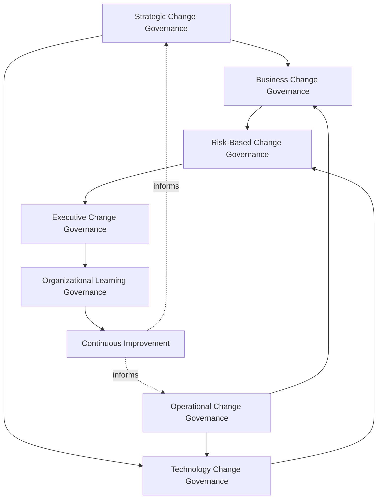
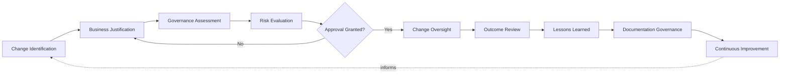
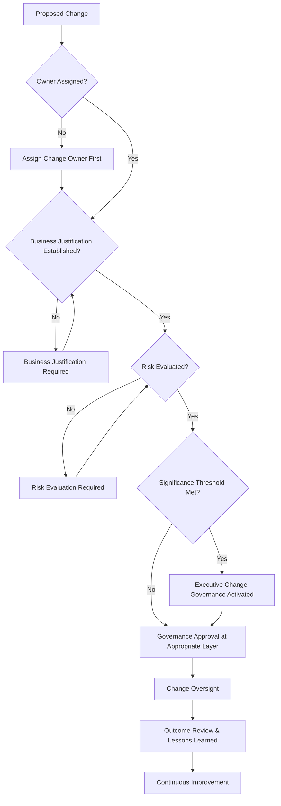
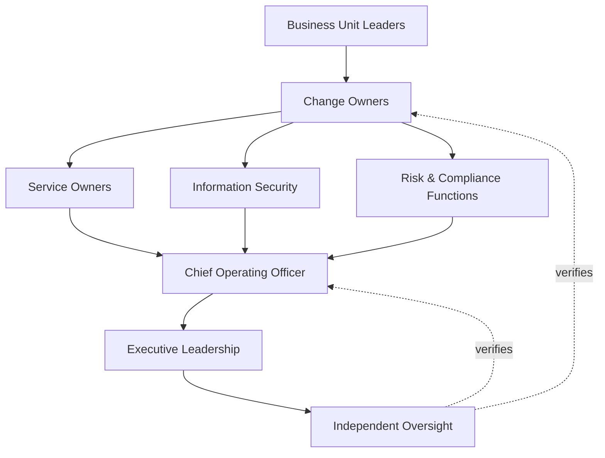
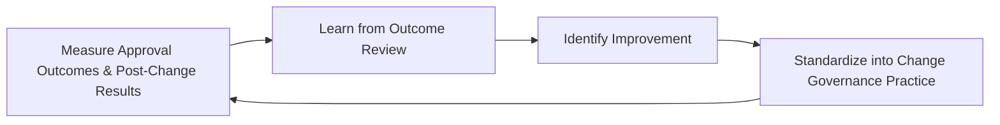
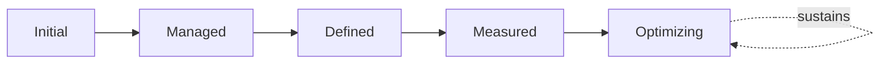

# Enterprise Change Management Governance Strategy

## 1. Document Purpose

This document defines the official Enterprise Change Management Governance Strategy for **StackLeo Tech Store** — the COO/CIO-owned executive charter under which organizational change, change approval, change ownership, and change risk are governed as a deliberate, accountable discipline. It establishes governance for strategic and operational change, approval governance, change ownership, change risk governance, organizational accountability, executive oversight, operational stability, and long-term change management maturity across the StackLeo platform, consistent with ITIL 4, ISO/IEC 20000, ISO 9001, COBIT governance principles, and TOGAF enterprise architecture thinking.

`change-management.md` remains the operational governance framework for change management practice in this folder — the document that elaborates in full operational depth StackLeo's change domains, lifecycle, and review discipline, itself sitting alongside `07_DEVOPS/git-strategy.md` (source-level change) and `07_DEVOPS/release-management.md` (release decisions). This document sits above it as the highest-level executive mandate, consistent with the executive-charter relationship `incident-management-governance.md` and `problem-management-governance.md` hold over their respective operational documents: it does not restate operational review detail, it establishes the philosophy, organizational ownership, and executive expectations that give change management practice its authority and coherence at the level of the Board and executive leadership.

- **Purpose of Change Management Governance** — to ensure that change to the business and its platform is a controlled, well-informed decision made deliberately by accountable people, rather than an unmanaged event that happens to services, customers, and the organization itself.
- **Relationship with Operations Governance** — `operations-governance-strategy.md` establishes the broader executive mandate for how StackLeo's daily operation is governed; this strategy is that mandate's specific application to the moment operation is deliberately changed, consistent with Operational Governance (`operations-governance-strategy.md`, Section 3).
- **Relationship with Service Management** — every change ultimately affects one or more services defined in `service-catalog.md` and the commitments in `service-level-management.md`; this strategy governs the accountability structure under which that effect is deliberately assessed before change proceeds.
- **Relationship with Risk Management** — this strategy applies the risk-based discipline established in `06_Security/enterprise-risk-management-strategy.md` (Section 3.2, Operational Risk Governance) specifically to the decision of whether, when, and how a given change should proceed.
- **Relationship with Business Continuity** — a poorly governed change is itself a recognized category of business disruption; this strategy exists in part to prevent the class of continuity event that `business-continuity-governance.md` would otherwise have to respond to.
- **Relationship with Information Security** — change affecting security posture is governed jointly with, and never supersedes, the protection principles established in `06_Security/security-governance.md`; this strategy ensures security-relevant change receives deliberate risk evaluation before it proceeds.
- **Relationship with Executive Decision-Making** — this strategy exists to give executive leadership genuine confidence that organizational and platform change proceeds deliberately, a confidence every growth, investment, and transformation decision implicitly depends on.

This document is implementation-independent and vendor-neutral. It defines change management governance philosophy, model, domains, and lifecycle conceptually — not specific ITSM platforms, workflow automation software, CI/CD tools, deployment platforms, cloud providers, consulting firms, operational products, change approval workflows, CAB meeting procedures, deployment procedures, release management processes, rollback strategies, infrastructure configurations, implementation roadmaps, or code.

## 2. Change Management Philosophy

Change management governance at StackLeo rests on eight principles. Each exists to produce a specific business outcome — change is governed deliberately because uncontrolled change is one of the most common sources of avoidable disruption, cost, and lost trust.

### 2.1 Controlled Change Enables Innovation

Governance exists to make change safe to pursue confidently, not to slow or discourage it.

- **Business Value** — allows the organization to move quickly and ambitiously because the risk of any single change is genuinely understood and managed, not because risk is ignored.

### 2.2 Governance Before Change

The accountability structure — who proposes, who assesses, who approves — is established before a specific change is undertaken.

- **Business Value** — ensures change proceeds because a genuine, governed decision called for it, not as an ad hoc reaction to pressure or convenience.

### 2.3 Stability with Agility

Governance protects the reliability the business and its customers depend on while remaining genuinely responsive to legitimate business need.

- **Business Value** — prevents the false choice between a stable platform and a fast-moving business; both are pursued together, deliberately balanced.

### 2.4 Accountability

Every change traces to a specific, named, responsible owner from proposal through to outcome review.

- **Business Value** — ensures no change is left to drift without someone genuinely responsible for its outcome.

### 2.5 Transparency

Change proposals, decisions, and outcomes are documented and visible to those who genuinely need them.

- **Business Value** — allows change governance to be scrutinized and defended, and keeps affected stakeholders genuinely informed.

### 2.6 Risk-Aware Decision Making

The scrutiny applied to a proposed change is proportionate to its genuine potential impact, not applied uniformly regardless of consequence.

- **Business Value** — directs governance attention toward the changes that genuinely warrant it, without burdening low-risk change unnecessarily.

### 2.7 Business Alignment

Change governance decisions are made in service of genuine business priority, ensuring change delivers the value it was proposed to deliver.

- **Business Value** — ensures change effort is directed toward what genuinely matters most to the business, not activity for its own sake.

### 2.8 Continuous Improvement

Change management governance practice matures over time, informed by real change outcomes and the organization's growth in scale and complexity.

- **Business Value** — keeps change governance aligned with StackLeo's growth in scale, market reach, and operational complexity.

## 3. Enterprise Change Governance Model

Change management governance operates across eight conceptual layers, each holding accountability for a distinct dimension of how StackLeo governs change. Every layer here is elaborated in full operational depth in `change-management.md`.

### 3.1 Strategic Change Governance

- **Purpose** — own the coherence of how change originating from enterprise strategy or transformation initiatives is governed.
- **Governance Scope** — oversight of Strategic Changes (Section 4.10) and their alignment to `01_Business/business-model.md`.
- **Business Value** — ensures the organization's most consequential change is deliberately connected to genuine strategic intent.
- **Executive Expectations** — leadership trusts strategic change is pursued because it genuinely advances the business, not as disconnected activity.

### 3.2 Operational Change Governance

- **Purpose** — own the coherence of how change to live services and day-to-day operation is reviewed and coordinated.
- **Governance Scope** — oversight of the operational change lifecycle elaborated in `change-management.md`.
- **Business Value** — protects the operational reliability customers and the business directly depend on.
- **Executive Expectations** — leadership trusts operational change is coordinated, not left to individual teams acting in isolation.

### 3.3 Business Change Governance

- **Purpose** — own the coherence of how change to business process, customer experience, and commercial operation is governed.
- **Governance Scope** — oversight of Business Process, Customer Experience, and Marketplace Changes (Sections 4.1, 4.4–4.5).
- **Business Value** — ensures business-facing change is deliberately assessed for its effect on customers and operations before it proceeds.
- **Executive Expectations** — leadership expects business change to be governed with the same rigor as technical change.

### 3.4 Technology Change Governance

- **Purpose** — own the coherence of how change to platform technology is governed.
- **Governance Scope** — oversight of Technology Platform Changes (Section 4.2), coordinated with `07_DEVOPS/release-management.md`.
- **Business Value** — ensures technical change proceeds in a way that protects, rather than undermines, platform reliability.
- **Executive Expectations** — leadership trusts technology change governance is genuinely exercised, not merely documented.

### 3.5 Risk-Based Change Governance

- **Purpose** — own the coherence of how genuine risk is evaluated and weighed in every change decision.
- **Governance Scope** — oversight of Risk Evaluation (Section 5.4) across every domain in Section 4.
- **Business Value** — ensures the scrutiny a change receives is genuinely proportionate to its potential consequence.
- **Executive Expectations** — leadership trusts high-risk change is never approved without genuine, documented risk evaluation.

### 3.6 Executive Change Governance

- **Purpose** — own executive-level accountability for the changes carrying the greatest organizational consequence.
- **Governance Scope** — oversight spanning Sections 3.1–3.5 and 3.7 wherever a change rises to genuine executive concern.
- **Business Value** — ensures the most consequential change is visible at the level accountable for the organization as a whole.
- **Executive Expectations** — leadership expects to be informed of, not surprised by, the organization's most significant proposed or active change.

### 3.7 Organizational Learning Governance

- **Purpose** — own the coherence of how the organization converts individual change outcomes into durable, shared organizational learning.
- **Governance Scope** — oversight of Outcome Review and Lessons Learned (Sections 5.7–5.8) across every domain in Section 4.
- **Business Value** — ensures every significant change strengthens the organization's broader ability to change well in future.
- **Executive Expectations** — leadership expects every significant change to produce a documented, attributable lesson.

### 3.8 Continuous Improvement

- **Purpose** — govern the mechanism by which every other layer in this model matures over time.
- **Governance Scope** — consolidates findings from change outcomes, audits, and organizational learning across every domain in Section 4.
- **Business Value** — prevents change governance itself from becoming the next thing that quietly stagnates as the organization scales.
- **Executive Expectations** — leadership expects change management maturity to be assessed periodically, not assumed static once established.

### Enterprise Change Governance Matrix

| Layer | Purpose | Business Value | Executive Expectations |
|---|---|---|---|
| Strategic Change Governance | Own coherence of change from strategy or transformation | Connects the most consequential change to genuine strategic intent | Trusts strategic change genuinely advances the business |
| Operational Change Governance | Own coherence of change to live services and daily operation | Protects operational reliability customers and business depend on | Trusts operational change is coordinated, not isolated |
| Business Change Governance | Own coherence of change to process, experience, and commerce | Ensures business change is assessed for its effect before it proceeds | Expects business change governed with the same rigor as technical |
| Technology Change Governance | Own coherence of change to platform technology | Protects, rather than undermines, platform reliability | Trusts technology governance is genuinely exercised |
| Risk-Based Change Governance | Own coherence of evaluating genuine risk in every decision | Ensures scrutiny is genuinely proportionate to consequence | Trusts high-risk change is never approved without evaluation |
| Executive Change Governance | Own executive accountability for highest-consequence change | Ensures the most consequential change is visible to leadership | Expects leadership informed of, not surprised by, top change |
| Organizational Learning Governance | Own coherence of converting outcomes into shared learning | Strengthens the organization's broader ability to change well | Expects every significant change to produce a documented lesson |
| Continuous Improvement | Govern maturation of every other layer | Prevents governance itself from stagnating | Expects maturity to be assessed periodically |

*Diagram 1: Enterprise Change Governance Framework — strategic and operational governance converge through business and technology change governance into risk-based evaluation, resolving into executive oversight and organizational learning that feeds continuous improvement back into the model.*

## 4. Enterprise Change Domains

Change management is governed across ten conceptual domains, each requiring a distinct governance emphasis. Every domain here is elaborated in full operational depth in `change-management.md`.

### 4.1 Business Process Changes

- **Purpose** — govern change to how internal business processes and workflows operate.
- **Governance Considerations** — governed under Business Change Governance (Section 3.3), coordinated with Business Unit Leaders (Section 7.4).
- **Business Importance** — protects the organization's own operating capability while enabling it to improve deliberately.
- **Executive Expectations** — leadership expects process change to be assessed for its effect on people and operations, not only its intended outcome.

### 4.2 Technology Platform Changes

- **Purpose** — govern change to the platform's technical architecture, application, and infrastructure.
- **Governance Considerations** — governed under Technology Change Governance (Section 3.4), coordinated with `07_DEVOPS/release-management.md`.
- **Business Importance** — protects the technical foundation every other change domain ultimately depends on.
- **Executive Expectations** — leadership expects platform change to be governed with rigor proportionate to its potential customer impact.

### 4.3 Information Security Changes

- **Purpose** — govern change affecting the platform's security posture, controls, or protective architecture.
- **Governance Considerations** — governed jointly with, and never superseding, `06_Security/security-governance.md`, which remains authoritative for security-specific obligations.
- **Business Importance** — protects customer data, platform integrity, and regulatory standing.
- **Executive Expectations** — leadership expects security-relevant change to receive risk evaluation at the rigor defined in `06_Security/security-governance.md`.

### 4.4 Customer Experience Changes

- **Purpose** — govern change to how customers interact with and experience the platform.
- **Governance Considerations** — governed under Business Change Governance (Section 3.3), given its direct effect on customer trust.
- **Business Importance** — protects the trust relationship every customer interaction depends on.
- **Executive Expectations** — leadership expects customer experience change to be assessed for genuine customer impact before it proceeds.

### 4.5 Marketplace Changes

- **Purpose** — govern change to the platform's sales and, eventually, multi-vendor marketplace capability.
- **Governance Considerations** — governed under Business Change Governance (Section 3.3), structured ahead of the marketplace model's launch.
- **Business Importance** — protects the durability of the platform's core revenue-generating function through change.
- **Executive Expectations** — leadership expects marketplace change to receive the highest business-criticality governance priority.

### 4.6 Financial & Payment Changes

- **Purpose** — govern change to payment processing, reconciliation, or financial reporting capability.
- **Governance Considerations** — governed under Risk-Based Change Governance (Section 3.5), given its financial and regulatory sensitivity.
- **Business Importance** — protects revenue integrity and the business's standing with payment partners and regulators.
- **Executive Expectations** — leadership expects financial and payment change to meet the strictest evaluation rigor in this model.

### 4.7 Third-Party Service Changes

- **Purpose** — govern change originating in, or affecting, a vendor, integration partner, or other external dependency.
- **Governance Considerations** — governed under Risk-Based Change Governance (Section 3.5), coordinated with `06_Security/third-party-risk-governance.md`.
- **Business Importance** — protects the business from disruption introduced through a dependency it does not directly control.
- **Executive Expectations** — leadership expects third-party-originated change to be evaluated with the same rigor as internally initiated change.

### 4.8 Regulatory & Compliance Changes

- **Purpose** — govern change undertaken to satisfy a regulatory, contractual, or compliance obligation.
- **Governance Considerations** — governed under Executive Change Governance (Section 3.6), coordinated with `06_Security/compliance-governance.md`.
- **Business Importance** — protects the business's standing with regulators and its contractual counterparties.
- **Executive Expectations** — leadership expects compliance-driven change to proceed on a timeline that genuinely meets its obligation.

### 4.9 Organizational Changes

- **Purpose** — govern change to the organization's own structure, roles, or ways of working.
- **Governance Considerations** — governed under Strategic Change Governance (Section 3.1), coordinated with executive leadership.
- **Business Importance** — protects the organization's ability to execute effectively through structural change.
- **Executive Expectations** — leadership expects organizational change to be planned with explicit attention to genuine continuity of operation.

### 4.10 Strategic Business Changes

- **Purpose** — govern change whose consequence extends to the organization's strategy, market position, or business model.
- **Governance Considerations** — governed exclusively under Strategic and Executive Change Governance (Sections 3.1, 3.6).
- **Business Importance** — protects the organization's most consequential asset — its long-term strategic direction.
- **Executive Expectations** — leadership expects direct, deliberate engagement for any change genuinely rising to this category.

### Enterprise Change Domain Matrix

| Domain | Purpose | Business Importance | Executive Expectations |
|---|---|---|---|
| Business Process Changes | Govern change to internal processes and workflows | Protects operating capability while enabling deliberate improvement | Assessed for effect on people and operations |
| Technology Platform Changes | Govern change to technical architecture and infrastructure | Protects the technical foundation every domain depends on | Governed proportionate to potential customer impact |
| Information Security Changes | Govern change affecting security posture and controls | Protects data, integrity, and regulatory standing | Evaluated at the rigor defined in `security-governance.md` |
| Customer Experience Changes | Govern change to customer interaction and experience | Protects the trust relationship every interaction depends on | Assessed for genuine customer impact before proceeding |
| Marketplace Changes | Govern change to sales and marketplace capability | Protects durability of the core revenue-generating function | Receives the highest business-criticality priority |
| Financial & Payment Changes | Govern change to payment and financial reporting capability | Protects revenue integrity and partner/regulator standing | Meets the strictest evaluation rigor in this model |
| Third-Party Service Changes | Govern change originating in external dependencies | Protects against disruption not directly controlled | Evaluated with the same rigor as internal change |
| Regulatory & Compliance Changes | Govern change to satisfy regulatory or contractual obligation | Protects standing with regulators and counterparties | Proceeds on a timeline that genuinely meets obligation |
| Organizational Changes | Govern change to structure, roles, or ways of working | Protects the organization's ability to execute effectively | Planned with explicit attention to continuity |
| Strategic Business Changes | Govern change affecting strategy or market position | Protects the organization's long-term strategic direction | Receives direct, deliberate executive engagement |

## 5. Enterprise Change Lifecycle

Change management governance operates across ten conceptual lifecycle stages, applicable across every domain in Section 4.

### 5.1 Change Identification

- **Purpose** — govern how the organization recognizes that a genuine change is being proposed.
- **Governance Objectives** — require identification to distinguish a genuine change from routine operational activity.
- **Business Value** — ensures governance effort is directed only at genuine change, not day-to-day operation.

### 5.2 Business Justification

- **Purpose** — govern how a proposed change is required to articulate the genuine business value it is intended to deliver.
- **Governance Objectives** — apply Business Alignment (Section 2.7) before governance resources are committed to assessment.
- **Business Value** — ensures change effort is directed toward what genuinely matters to the business.

### 5.3 Governance Assessment

- **Purpose** — govern how a justified change is assessed against the appropriate governance layer in Section 3.
- **Governance Objectives** — apply Governance Before Change (Section 2.2) consistently across every proposed change.
- **Business Value** — ensures every change is reviewed by the function genuinely accountable for its domain.

### 5.4 Risk Evaluation

- **Purpose** — govern how genuine risk is identified and weighed for an assessed change.
- **Governance Objectives** — apply Risk-Based Change Governance (Section 3.5) proportionate to potential consequence.
- **Business Value** — ensures the depth of scrutiny a change receives reflects its genuine potential impact.

### 5.5 Governance Approval

- **Purpose** — govern the decision of whether, when, and under what conditions a change is authorized to proceed.
- **Governance Objectives** — require approval authority to match the governance layer and risk level established in prior stages.
- **Business Value** — ensures the decision to proceed is made deliberately, by someone genuinely accountable for it.

### 5.6 Change Oversight

- **Purpose** — govern how an approved change is monitored as it is carried out.
- **Governance Objectives** — apply Accountability (Section 2.4) throughout execution, without prescribing execution mechanics.
- **Business Value** — ensures deviation from an approved change is visible to governance while it can still be addressed.

### 5.7 Outcome Review

- **Purpose** — formally assess whether a completed change achieved its intended business justification.
- **Governance Objectives** — apply Organizational Learning Governance (Section 3.7) to every change meeting a defined significance threshold.
- **Business Value** — ensures the organization knows whether its change decisions are genuinely delivering value.

### 5.8 Lessons Learned

- **Purpose** — formally capture what an outcome review reveals about change management governance itself.
- **Governance Objectives** — require lessons to be documented and attributed to specific governance implications.
- **Business Value** — ensures the organization genuinely learns from experience rather than repeating the same gaps.

### 5.9 Documentation Governance

- **Purpose** — govern the completeness and integrity of the change record itself.
- **Governance Objectives** — require documentation to remain consistent with `change-management.md` as it evolves.
- **Business Value** — ensures the organization retains a genuine, trustworthy record of what changed, why, and with what outcome.

### 5.10 Continuous Improvement

- **Purpose** — apply accumulated lessons to strengthen future change management governance.
- **Governance Objectives** — require findings to be genuinely analyzed for recurring patterns, consistent with Section 3.8.
- **Business Value** — turns each change into an input that makes future change governance genuinely stronger.

### Enterprise Change Lifecycle Matrix

| Stage | Purpose | Governance Objective | Business Value |
|---|---|---|---|
| Change Identification | Recognize that a genuine change is being proposed | Distinguishes genuine change from routine activity | Directs governance effort only at genuine change |
| Business Justification | Require articulation of genuine intended business value | Applied before governance resources are committed | Directs change effort toward what genuinely matters |
| Governance Assessment | Assess a justified change against the appropriate layer | Applied consistently across every proposed change | Ensures review by the function genuinely accountable |
| Risk Evaluation | Identify and weigh genuine risk | Applied proportionate to potential consequence | Ensures scrutiny reflects genuine potential impact |
| Governance Approval | Decide whether, when, and how change proceeds | Authority matches the governance layer and risk level | Ensures the decision is made deliberately by an accountable party |
| Change Oversight | Monitor an approved change as it is carried out | Applies accountability throughout execution | Keeps deviation visible while it can still be addressed |
| Outcome Review | Assess whether the change achieved its justification | Applied to every change meeting a significance threshold | Confirms whether change decisions genuinely deliver value |
| Lessons Learned | Capture governance implications from outcome review | Documented and attributed to specific implications | Ensures genuine learning rather than repeated gaps |
| Documentation Governance | Maintain completeness and integrity of the change record | Kept consistent with subordinate documentation | Retains a genuine, trustworthy record |
| Continuous Improvement | Apply lessons to strengthen future governance | Findings genuinely analyzed for recurring patterns | Makes future change governance genuinely stronger |

*Diagram 2: Enterprise Change Lifecycle — identification and business justification inform governance assessment and risk evaluation, with approval gating change oversight, before outcome review, lessons learned, and documentation governance feed continuous improvement back into the cycle.*

## 6. Change Management Principles

- **Accountability** — every change traces to a specific, named, responsible owner, consistent with Section 2.4.
- **Transparency** — change proposals, decisions, and outcomes are documented and visible to those who need them, consistent with Section 2.5.
- **Risk Awareness** — scrutiny applied to a change is proportionate to its genuine potential impact, consistent with Section 2.6.
- **Business Alignment** — change governance decisions are made in service of genuine business priority, consistent with Section 2.7.
- **Stability** — governance protects the reliability the business and customers depend on, consistent with Section 2.3.
- **Adaptability** — governance remains genuinely responsive to legitimate business need, consistent with Section 2.3.
- **Traceability** — every change decision and its rationale can be reconstructed after the fact.
- **Continuous Improvement** — governance practice matures over time, informed by real change outcomes.

### Change Management Principles Matrix

| Principle | Description | Business Value |
|---|---|---|
| Accountability | Every change traces to a specific, named, responsible owner | Ensures no change drifts without genuine ownership |
| Transparency | Proposals, decisions, and outcomes documented and visible | Allows change governance to be scrutinized and defended |
| Risk Awareness | Scrutiny proportionate to genuine potential impact | Directs governance attention where it genuinely matters |
| Business Alignment | Decisions made in service of genuine business priority | Ensures change effort delivers genuine business value |
| Stability | Protects the reliability business and customers depend on | Prevents change from becoming a source of avoidable disruption |
| Adaptability | Remains genuinely responsive to legitimate business need | Prevents governance from becoming an obstacle to genuine progress |
| Traceability | Every decision and rationale can be reconstructed after the fact | Supports accountability, audit, and organizational learning |
| Continuous Improvement | Practice matures from real change outcomes | Keeps governance aligned with organizational growth |

*Diagram 4: Enterprise Change Governance Decision Flow — a proposed change is checked for assigned ownership, business justification, and risk evaluation, with executive governance activated upon meeting significance thresholds, resolving into approval, oversight, outcome review, and continuous improvement.*

## 7. Ownership & Accountability

Governance authority for change management is distributed deliberately across eight accountable functions, defined here at the governance-objective level, without prescribing specific operational change execution responsibilities.

### 7.1 Executive Leadership

- **Governance Objective** — the Board and executive leadership hold ultimate accountability for how the organization governs deliberate change.
- **Business Value** — provides a single point of ultimate accountability for whether change management governance is genuinely functioning as intended.

### 7.2 Chief Operating Officer

- **Governance Objective** — the Chief Operating Officer owns the coherence and enforcement of this strategy across every domain, layer, and stage it defines.
- **Business Value** — provides a single point of specialist accountability for whether change management governance is genuinely functioning as intended.

### 7.3 Change Owners

- **Governance Objective** — each individual change has a specific, named owner accountable for its justification, risk evaluation, and outcome, consistent with Accountability (Section 2.4).
- **Business Value** — ensures every proposed or active change has a clear, singular point of accountability throughout its lifecycle.

### 7.4 Business Unit Leaders

- **Governance Objective** — business unit leaders own change governance readiness within their own function, consistent with Business Process Changes (Section 4.1).
- **Business Value** — ensures change governance is genuinely embedded within the functions closest to proposed change.

### 7.5 Service Owners

- **Governance Objective** — each service defined in `service-catalog.md` has a specific, named owner accountable for assessing change impact on that service.
- **Business Value** — ensures no service persists without someone genuinely responsible for evaluating change affecting it.

### 7.6 Information Security

- **Governance Objective** — information security owns Information Security Changes (Section 4.3) jointly with `06_Security/security-governance.md`, which remains authoritative for security-specific obligations.
- **Business Value** — ensures security-relevant change remains integrated with, not separate from, broader change governance.

### 7.7 Risk & Compliance Functions

- **Governance Objective** — risk and compliance functions ensure change evaluation remains aligned to `06_Security/enterprise-risk-management-strategy.md` and `06_Security/compliance-governance.md`.
- **Business Value** — ensures change governance remains a genuine response to assessed risk and obligation, not a disconnected parallel exercise.

### 7.8 Independent Oversight

- **Governance Objective** — an independent function, separate from those who design and operate change governance, periodically verifies its overall effectiveness.
- **Business Value** — prevents governance from being assumed effective on the word of the same function responsible for running it.

### Ownership & Accountability Matrix

| Role | Governance Objective | Business Value |
|---|---|---|
| Executive Leadership | Hold ultimate accountability for governing deliberate change | Provides a single point of ultimate accountability |
| Chief Operating Officer | Own coherence and enforcement of this strategy | Provides a single point of specialist accountability |
| Change Owners | Own justification, risk evaluation, and outcome of a specific change | Ensures every change has clear, singular accountability |
| Business Unit Leaders | Own change governance readiness within their own function | Embeds governance closest to proposed change |
| Service Owners | Own assessment of change impact on their assigned service | Ensures no service persists without genuine change accountability |
| Information Security | Own security changes jointly with `security-governance.md` | Keeps security-relevant change integrated with broader governance |
| Risk & Compliance Functions | Ensure evaluation remains aligned to enterprise risk and compliance | Keeps governance a genuine response to assessed risk and obligation |
| Independent Oversight | Independently verify overall governance effectiveness | Prevents self-assessed assumption of effectiveness |

*Diagram 3: Change Ownership & Accountability Model — accountability flows from business unit and change ownership through service ownership, security, and risk and compliance functions into the Chief Operating Officer, converging on executive leadership verified by independent oversight.*

## 8. Executive Oversight

- **Executive Change Reviews** — the overall coherence of change management governance is formally reviewed on a regular cadence, consistent with `operations-governance-strategy.md` (Section 8).
- **Change Portfolio Reporting** — aggregated change health — proposed, active, and completed change across every domain — is reported to executive leadership and the Board.
- **Governance Reviews** — the governance model, domains, and lifecycle defined in this strategy (Sections 3–7) are periodically reassessed for continued fitness.
- **Enterprise Change Visibility** — leadership maintains a single, coherent view of significant change across the organization, preventing change from being visible only within the function proposing it.
- **Documentation Governance** — this strategy's relationship to `change-management.md`, `07_DEVOPS/release-management.md`, and `06_Security/enterprise-risk-management-strategy.md` is kept current as those documents evolve.
- **Organizational Readiness** — change decisions, evidence, and outcomes are maintained in a state ready for internal or external audit at any time, coordinated with `06_Security/audit-governance.md`.

### Executive Oversight Matrix

| Oversight Mechanism | Purpose | Governance Role |
|---|---|---|
| Executive Change Reviews | Confirm overall change governance coherence | Regular, predictable cadence for the strategy as a whole |
| Change Portfolio Reporting | Provide leadership a single, coherent change picture | Reports proposed, active, and completed change across domains |
| Governance Reviews | Reassess the governance model itself for continued fitness | Applies to Sections 3–7 of this strategy |
| Enterprise Change Visibility | Maintain a single, coherent view of significant change | Prevents change visibility being confined to the proposing function |
| Documentation Governance | Keep this strategy's subordinate relationships current | Updated as related documents evolve |
| Organizational Readiness | Maintain decisions and evidence ready for independent review | Continuous state, coordinated with audit governance |

### Governance Responsibility Matrix

| Role | Responsibility |
|---|---|
| Executive Leadership | Owns ultimate accountability for how the organization governs deliberate change. |
| Chief Operating Officer | Owns coherence and enforcement of this strategy, in partnership with executive leadership. |
| Change Management Governance Lead | Owns the operational change model within `change-management.md`. |
| Service Owners | Own assessment of change impact within their assigned service. |
| Change Owners | Own justification, risk evaluation, and outcome of their assigned change. |
| Information Security | Owns Information Security Changes jointly with `06_Security/security-governance.md`. |
| Risk & Compliance Functions | Ensure change evaluation remains aligned to enterprise risk and compliance. |
| Independent Oversight | Independently verifies the overall effectiveness of change management governance. |

## 9. Future Readiness

This strategy is designed to remain valid as StackLeo evolves in scale, geography, and organizational complexity, without requiring redefinition of its underlying philosophy.

- **AI-Assisted Change Governance** — as change assessment and approval workflows increasingly incorporate AI-assisted analysis, they remain governed under Governance Assessment and Approval (Sections 5.3, 5.5) at the same rigor as any other method.
- **Intelligent Change Risk Analysis** — where the organization develops enhanced capability to estimate change risk, that capability is governed as an extension of Risk Evaluation (Section 5.4), not a separate discipline.
- **Enterprise Scale** — the governance model, domains, and lifecycle defined throughout this strategy are defined independently of organizational size, so they remain coherent as StackLeo's operational complexity grows substantially.
- **Global Expansion** — Business Justification and Governance Assessment (Sections 5.2–5.3) are structured to be re-applied as StackLeo expands from Bangladesh into South Asia and global markets, each with genuinely distinct change considerations.
- **Multi-Region Operations** — Technology Platform and Third-Party Service Changes (Sections 4.2, 4.7) are structured to absorb genuinely multi-region operational complexity as it emerges.
- **Adaptive Organizations** — Stability with Agility (Section 2.3) extends to encompass increasingly flexible organizational structures capable of governing change at increasing velocity without losing control.
- **Digital Transformation** — this strategy's governance discipline is treated as a direct enabler of digital transformation, not an obstacle to it, ensuring transformation proceeds deliberately rather than chaotically.
- **Future Enterprise Operating Models** — Continuous Improvement (Section 3.8) is structured to absorb genuinely new operating models — additional sales channels, multi-vendor operations, corporate and wholesale sales — without requiring this strategy to be rewritten.

## 10. Change Management Maturity Model

Change management governance maturity is described across five conceptual levels, consistent with ITIL 4 and established process maturity thinking.

- **Initial** — change governance, where it exists, is informal and inconsistent; change is proposed and executed reactively, and ownership is unclear.
- **Managed** — basic change governance exists for individual domains, but consistency across the ten domains in Section 4 varies significantly.
- **Defined** — the governance model, domains, and lifecycle are standardized, documented, and consistently applied across the organization, consistent with the model defined throughout this strategy.
- **Measured** — change volume, approval outcomes, and post-change results are measured systematically, and decisions are grounded in genuine evidence rather than qualitative impression alone.
- **Optimizing** — change management governance is continuously and deliberately improved based on quantitative evidence and organizational learning; improvement itself is a managed, ongoing discipline rather than an occasional initiative.

### Change Management Maturity Model Matrix

| Level | Characteristics | Primary Focus |
|---|---|---|
| Initial | Informal, inconsistent governance; change proposed and executed reactively | Ad hoc, individually-dependent change practice |
| Managed | Basic governance exists per domain; consistency varies | Domain-level consistency |
| Defined | Standardized governance model, domains, and lifecycle | Organization-wide consistency and clear ownership |
| Measured | Volume, approval outcomes, and results measured systematically | Evidence-based change governance decisions |
| Optimizing | Practice continuously and deliberately improved from evidence | Sustained, deliberate improvement as a discipline |

*Diagram 5: Continuous Change Improvement Cycle — change outcomes are measured, learned from, improved upon, and standardized back into governed practice, on a continuing basis.*

*Diagram 6: Change Management Maturity Progression Model — maturity advances from informal, reactively-executed change practice toward standardized, measured, and continuously optimized change management governance.*

## 11. Anti-Patterns

The following recurring failure patterns are explicitly recognized and avoided, as each one structurally undermines this strategy.

### Anti-Pattern Summary

| Anti-Pattern | Why It's Avoided |
|---|---|
| Changes Without Governance | Contradicts Governance Before Change (Section 2.2); change that bypasses this strategy's model proceeds without the deliberate accountability the organization depends on. |
| Undefined Change Ownership | Contradicts Change Owners (Section 7.3); a change with no accountable owner has no one genuinely responsible for its outcome. |
| Weak Executive Visibility | Contradicts Change Portfolio Reporting (Section 8); leadership cannot govern change risk it is never shown. |
| Poor Documentation | Undermines Documentation Governance (Sections 5.9, 8) and Transparency (Section 2.5), leaving change decisions unclear or unverifiable after the fact. |
| Reactive Change Decisions | Contradicts Governance Before Change (Section 2.2); deciding on change only under pressure leaves evaluation shallow and rushed. |
| Excessive Bureaucracy | Contradicts Stability with Agility (Section 2.3) and Risk-Aware Decision Making (Section 2.6); applying uniform, heavy scrutiny to low-risk change discourages the innovation this strategy exists to enable. |
| Ignoring Change Risks | Contradicts Risk-Based Change Governance (Section 3.5); proceeding without genuine risk evaluation accepts avoidable exposure. |
| Missing Continuous Improvement | Contradicts Continuous Improvement (Sections 2.8, 3.8); without deliberate improvement, change governance stagnates as the organization and its risk landscape grow. |

## 12. Document Information

| Property | Value |
|----------|-------|
| Document | change-management-governance.md |
| Version | 1.0.0 |
| Status | Active |
| Maintained By | StackLeo |
| Last Updated | 2026-07-24 |

---

© StackLeo. All Rights Reserved.
