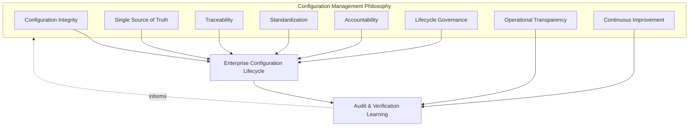
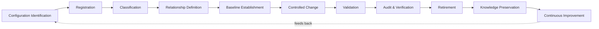
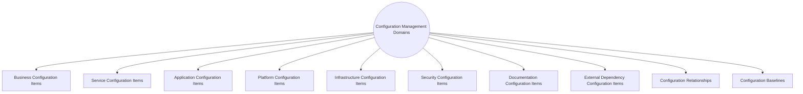
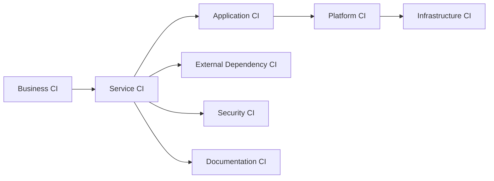
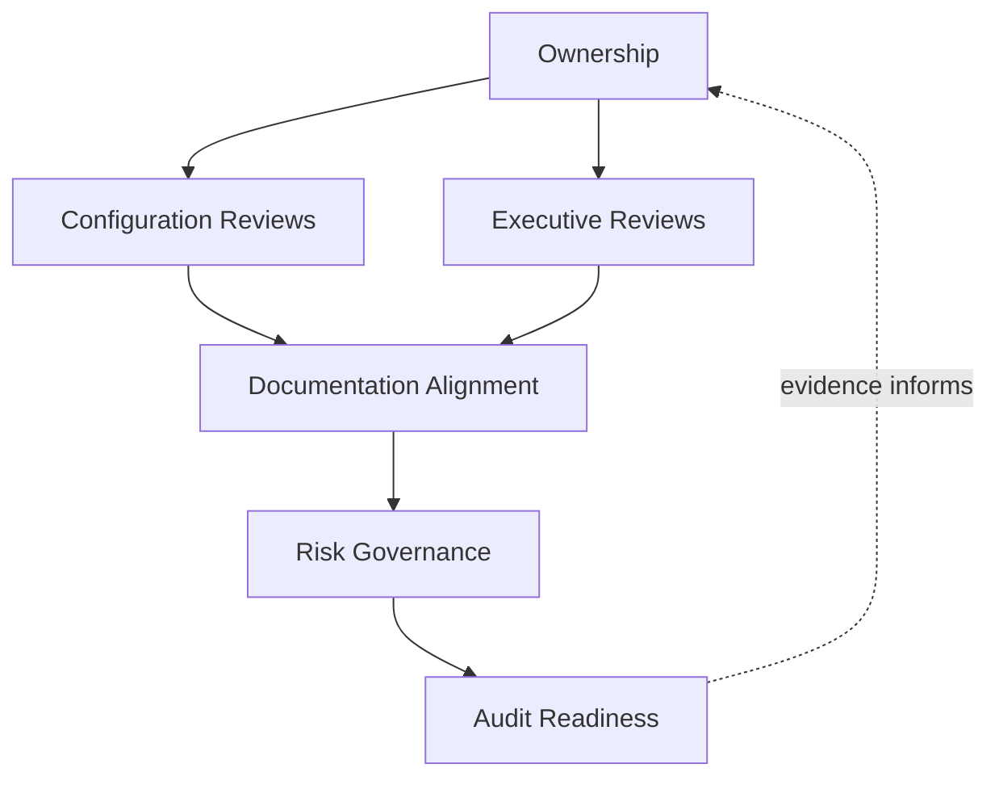
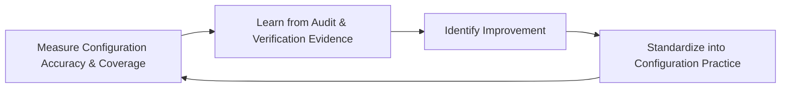
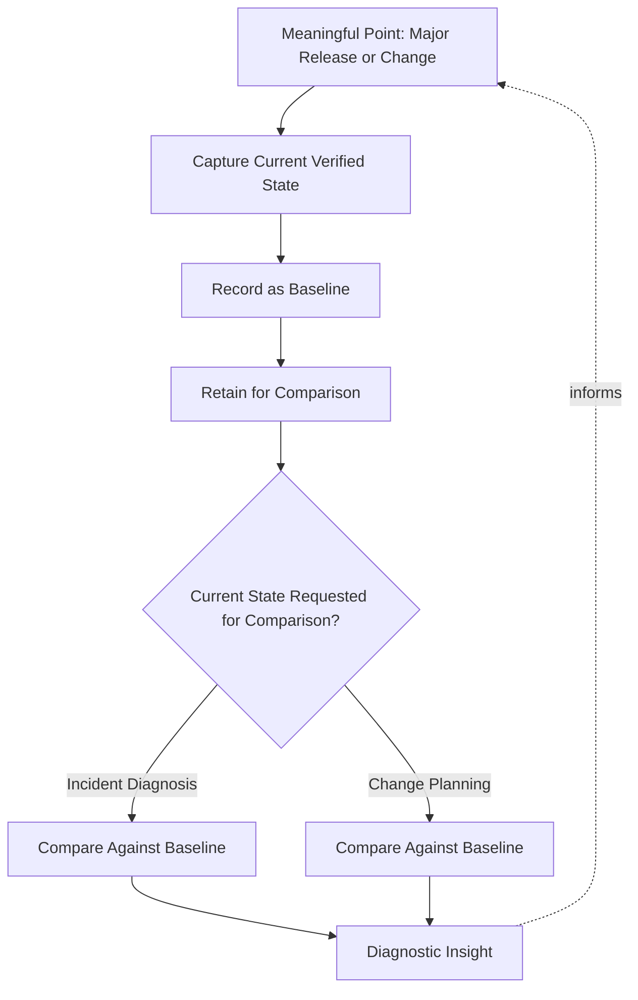
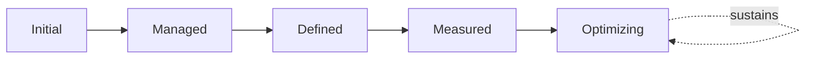

# Enterprise Configuration Management & Configuration Governance Strategy

## 1. Document Purpose

This document defines the official Enterprise Configuration Management & Configuration Governance Strategy for **StackLeo Tech Store**. It establishes how the platform's Configuration Items — the services, applications, infrastructure, and dependencies that make up the operating environment — are identified, recorded, related, and governed, independent of any specific CMDB platform, configuration management tool, or asset management software.

This document governs Configuration Items and their relationships, consistent with ITIL Service Configuration Management and ISO/IEC 20000 — a system of record answering "what exists, and how does it relate to everything else." It is distinct from `07_DEVOPS/configuration-management.md`, which governs environment- and application-level *settings* that shape runtime behavior (the values a service is configured with). This document governs the *things themselves* — the services, components, and dependencies — and the relationships between them that impact assessment, incident diagnosis, and architecture decisions all depend on.

- **Purpose of Configuration Management** — to ensure the organization has one accurate, trustworthy understanding of what the platform consists of and how its parts depend on one another, so that decisions about change, incidents, and risk are made against genuine reality, not assumption.
- **Relationship with Change Management** — Impact Assessment in `change-management.md` (Section 3.5) depends directly on accurate configuration relationships; a change cannot be safely assessed if what it affects is not genuinely known.
- **Relationship with Service Management** — this document extends Service Dependencies as introduced in `service-catalog.md` (Section 4.6) into a complete, governed configuration model spanning every layer of the platform, not only the service level.
- **Relationship with Service Catalog** — every Configuration Item ultimately supports one or more entries in `service-catalog.md`; this document provides the underlying structural detail the catalog's business-facing view is built on.
- **Relationship with Operations** — this document is the configuration-specific elaboration of Configuration Management in `operations-overview.md` (Section 5.6), providing the accurate dependency knowledge that effective incident and problem management depend on.
- **Relationship with Enterprise Architecture** — Configuration Items and their relationships are kept consistent with the architecture defined in `03_System_Design/component-architecture.md`; this document is the operational, continuously current counterpart to that architectural definition.
- **Relationship with Governance** — configuration accuracy is a precondition for effective governance elsewhere in this repository; a governance decision made against inaccurate configuration knowledge is only as reliable as that knowledge itself.

This document is implementation-independent and vendor-neutral. It defines configuration philosophy, lifecycle, domains, and governance conceptually — not specific CMDB platforms, configuration management tools, asset management software, data models, workflows, or infrastructure configuration.

## 2. Configuration Management Philosophy

Configuration management at StackLeo is governed by eight principles. Each exists to produce a specific business outcome — configuration is governed deliberately because of the decisions that depend on it being accurate, not as record-keeping for its own sake.

### 2.1 Configuration Integrity

Recorded configuration information genuinely reflects the actual state of the platform, not an idealized or outdated approximation of it.

- **Business Value** — decisions made against inaccurate configuration knowledge are only as reliable as that knowledge, however confidently they are made.

### 2.2 Single Source of Truth

Every Configuration Item has one authoritative record, consistent with Documentation Alignment practice used throughout this repository, rather than multiple, potentially conflicting descriptions.

- **Business Value** — prevents the anti-pattern in Section 10.1, where teams make decisions against different, contradictory understandings of the same reality.

### 2.3 Traceability

Every Configuration Item and its relationships can be traced to the services, decisions, and documentation that depend on it.

- **Business Value** — makes impact assessment, incident diagnosis, and audit genuinely possible, rather than dependent on institutional memory.

### 2.4 Standardization

Configuration Items are classified and described using a consistent structure, regardless of which team owns them.

- **Business Value** — makes the configuration model genuinely usable as a single reference, rather than a collection of inconsistent, team-specific records.

### 2.5 Accountability

Every Configuration Item has a single, named accountable owner responsible for its record's accuracy.

- **Business Value** — prevents the anti-pattern in Section 10.3, where configuration accuracy erodes because no one is specifically responsible for maintaining it.

### 2.6 Lifecycle Governance

Configuration Items are governed consistently across their full lifecycle — from identification through retirement — not only while newly introduced.

- **Business Value** — ensures configuration records do not silently drift from reality as the platform evolves and matures.

### 2.7 Operational Transparency

Configuration information is visible to the stakeholders who depend on it — Operations, Engineering, Security, and Change Management — not held privately within any single team.

- **Business Value** — enables informed decisions by teams who did not build a component but must understand its relationships to assess risk or diagnose an issue.

### 2.8 Continuous Improvement

Configuration management practice matures over time, informed by discovered gaps, audit findings, and evolving platform complexity.

- **Business Value** — keeps the configuration model a living, accurate asset rather than a static record that quietly diverges from reality.

*Diagram 1: Configuration Management Philosophy Overview — the eight principles shape the enterprise configuration lifecycle, and audit and verification learning feed back into the philosophy itself.*

## 3. Enterprise Configuration Lifecycle

Configuration management is governed across eleven conceptual stages, spanning from initial identification through retirement and continuous improvement.

### 3.1 Configuration Identification

- **Purpose** — recognize that a component, service, or dependency constitutes a Configuration Item warranting a formal record.
- **Business Value** — ensures nothing significant to the platform's operation exists outside the organization's configuration knowledge.
- **Governance Objectives** — require identification criteria to be applied consistently across every domain in Section 4.

### 3.2 Registration

- **Purpose** — formally record an identified Configuration Item with its defining attributes.
- **Business Value** — converts informal awareness of a component into a durable, referenceable record.
- **Governance Objectives** — require every registered item to include, at minimum, its classification, owner, and current status.

### 3.3 Classification

- **Purpose** — assign each Configuration Item to its appropriate domain (Section 4), establishing its type at a glance.
- **Business Value** — supports navigation and review at a meaningful level of granularity across a growing configuration model.
- **Governance Objectives** — apply classification consistently using shared domain definitions across the entire model.

### 3.4 Relationship Definition

- **Purpose** — document how a Configuration Item depends on, or is depended on by, other items.
- **Business Value** — is the single most valuable output of configuration management, since it is what makes impact assessment and diagnosis genuinely possible.
- **Governance Objectives** — require relationships to be defined bidirectionally and kept current as dependencies change.

### 3.5 Baseline Establishment

- **Purpose** — record a known, verified state of a Configuration Item or related set of items at a specific point in time.
- **Business Value** — provides a trusted reference point to compare against when investigating unexpected behavior or planning change.
- **Governance Objectives** — require baselines to be established at meaningful points — before major change, at major releases — not arbitrarily.

### 3.6 Controlled Change

- **Purpose** — ensure updates to Configuration Items and their relationships proceed through the same discipline as any other operational change, per `change-management.md`.
- **Business Value** — prevents configuration records from being altered informally in ways that silently diverge from governed change decisions.
- **Governance Objectives** — require configuration updates to trace to an approved change or a legitimate lifecycle event (registration, retirement).

### 3.7 Validation

- **Purpose** — confirm that recorded configuration information genuinely matches actual platform state.
- **Business Value** — is the concrete mechanism through which Configuration Integrity (Section 2.1) is sustained rather than merely assumed.
- **Governance Objectives** — require validation to be performed independently of the team that last updated the record where practical.

### 3.8 Audit & Verification

- **Purpose** — periodically and systematically confirm the accuracy of the configuration model as a whole, not only individual items.
- **Business Value** — catches accumulated drift that item-by-item validation alone might miss.
- **Governance Objectives** — require audit to be conducted on a regular, predictable cadence and reported to accountable ownership (Section 6.1).

### 3.9 Retirement

- **Purpose** — formally remove a Configuration Item from active status once it no longer exists or is no longer relevant.
- **Business Value** — keeps the configuration model an accurate reflection of the current platform, not an accumulation of historical clutter.
- **Governance Objectives** — require retirement to be an explicit, recorded decision, never an item simply left stale indefinitely.

### 3.10 Knowledge Preservation

- **Purpose** — retain relevant historical configuration knowledge even after an item's retirement.
- **Business Value** — preserves institutional understanding of how the platform evolved, supporting future architecture and problem investigation.
- **Governance Objectives** — connect retained knowledge to Knowledge Management in `service-management.md` (Section 4.8).

### 3.11 Continuous Improvement

- **Purpose** — act on audit findings and discovered gaps to deliberately improve configuration management practice.
- **Business Value** — ensures configuration management effectiveness compounds over time rather than remaining static as the platform grows.
- **Governance Objectives** — require improvement actions arising from audit and verification to be documented and tracked to completion.

### Enterprise Configuration Lifecycle Matrix

| Stage | Purpose | Business Value | Governance Objective |
|---|---|---|---|
| Configuration Identification | Recognize a component warranting a formal record | Ensures nothing significant exists outside configuration knowledge | Identification criteria applied consistently across domains |
| Registration | Formally record an identified item with defining attributes | Converts informal awareness into a durable, referenceable record | Every item includes classification, owner, and status |
| Classification | Assign each item to its appropriate domain | Supports navigation and review at meaningful granularity | Applied consistently using shared domain definitions |
| Relationship Definition | Document dependency relationships between items | The single most valuable output; enables impact assessment | Relationships defined bidirectionally, kept current |
| Baseline Establishment | Record a known, verified state at a point in time | Provides a trusted reference point for investigation and planning | Established at meaningful points, not arbitrarily |
| Controlled Change | Route configuration updates through change discipline | Prevents informal drift from governed decisions | Updates trace to an approved change or legitimate event |
| Validation | Confirm records genuinely match actual platform state | Sustains configuration integrity rather than assuming it | Performed independently of the last-updating team where practical |
| Audit & Verification | Periodically confirm accuracy of the whole model | Catches accumulated drift item-level validation might miss | Conducted on a regular, predictable cadence |
| Retirement | Formally remove items no longer relevant | Keeps the model an accurate reflection of the current platform | An explicit, recorded decision, never silent staleness |
| Knowledge Preservation | Retain historical knowledge after retirement | Preserves institutional understanding for future use | Connected to knowledge management practice |
| Continuous Improvement | Act on findings to improve practice | Effectiveness compounds over time | Improvement actions tracked to completion |

*Diagram 2: Enterprise Configuration Lifecycle — a continuous cycle in which audit findings and improvement directly inform the next iteration of configuration identification.*

## 4. Configuration Management Domains

The configuration model spans ten conceptual domains, each corresponding to a distinct category of Configuration Item or relationship.

### 4.1 Business Configuration Items

- **Purpose** — represent business-level constructs — business rules, policies, pricing models — that configuration relationships need to account for.
- **Scope** — informed by `01_Business/business-rules.md`, expressed here in terms of their configuration relevance rather than their business content.
- **Governance Expectations** — reviewed jointly with Business stakeholders when business-level items change.
- **Business Importance** — ensures business-driven dependencies are visible alongside technical ones in impact assessment.

### 4.2 Service Configuration Items

- **Purpose** — represent each service defined in `service-catalog.md` as a Configuration Item in its own right.
- **Scope** — the service-level entry point into the broader configuration model.
- **Governance Expectations** — kept synchronized with `service-catalog.md` so the two views of the same reality never diverge.
- **Business Importance** — connects the business-facing service view to the underlying technical configuration model.

### 4.3 Application Configuration Items

- **Purpose** — represent application-level components and their logical structure.
- **Scope** — informed by `03_System_Design/component-architecture.md`.
- **Governance Expectations** — kept consistent with current architecture documentation, updated as components evolve.
- **Business Importance** — provides the detail needed to assess the impact of application-level change.

### 4.4 Platform Configuration Items

- **Purpose** — represent shared platform capability that multiple services depend on.
- **Scope** — consistent with Platform Services in `service-catalog.md` (Section 3.5).
- **Governance Expectations** — relationships to every dependent service are explicitly documented, given their multiplied impact if affected.
- **Business Importance** — makes visible the disproportionate risk carried by shared capability.

### 4.5 Infrastructure Configuration Items

- **Purpose** — represent the underlying technical environment components services run on.
- **Scope** — informed by `03_System_Design/deployment-architecture.md`, at a conceptual rather than infrastructure-configuration level.
- **Governance Expectations** — distinguished clearly from Platform and Application items, so root cause is never confused with symptom.
- **Business Importance** — supports rapid identification of infrastructure-caused impact across multiple services.

### 4.6 Security Configuration Items

- **Purpose** — represent identity, access, and protection capability as Configuration Items, jointly with `06_Security`.
- **Scope** — security-relevant components and their relationships to the services they protect.
- **Governance Expectations** — reviewed jointly with Security leadership, given their protective significance.
- **Business Importance** — ensures security dependencies are visible in impact assessment, not treated as an invisible assumption.

### 4.7 Documentation Configuration Items

- **Purpose** — represent the documentation artifacts (architecture, runbooks, service definitions) that describe and support other Configuration Items.
- **Scope** — links between technical/service items and the documentation that explains them.
- **Governance Expectations** — documentation links are verified current as part of Audit & Verification (Section 3.8).
- **Business Importance** — ensures configuration knowledge is never siloed in a record without connection to its supporting explanation.

### 4.8 External Dependency Configuration Items

- **Purpose** — represent third-party services StackLeo depends on — payment providers, couriers, and future marketplace or B2B partners.
- **Scope** — informed by Third-Party Service Incidents in `incident-management.md` (Section 4.5) and Third-Party Integration Compatibility in `08_QUALITY_ASSURANCE/compatibility-testing.md` (Section 4.9).
- **Governance Expectations** — relationships to dependent internal services are documented despite the dependency lying outside direct StackLeo control.
- **Business Importance** — makes visible the risk StackLeo carries from parties it does not directly control.

### 4.9 Configuration Relationships

- **Purpose** — represent the dependency connections between Configuration Items across every other domain in this section.
- **Scope** — cross-cutting; the relationships themselves, distinct from the items they connect.
- **Governance Expectations** — relationships are the primary object of Relationship Definition (Section 3.4) and are never left implicit or undocumented.
- **Business Importance** — is what transforms a list of components into a genuinely useful model for impact assessment and diagnosis.

### 4.10 Configuration Baselines

- **Purpose** — represent recorded, verified states of Configuration Items at meaningful points in time.
- **Scope** — the accumulated set of baselines established through Section 3.5.
- **Governance Expectations** — baselines are retained and made available for comparison during incident diagnosis and change planning.
- **Business Importance** — provides a trusted "known good" reference that accelerates diagnosis when current behavior is in question.

### Configuration Management Domain Matrix

| Domain | Purpose | Governance Expectations | Business Importance |
|---|---|---|---|
| Business Configuration Items | Represent business-level constructs relevant to configuration | Reviewed jointly with Business stakeholders on change | Makes business-driven dependencies visible alongside technical ones |
| Service Configuration Items | Represent each catalog service as a Configuration Item | Kept synchronized with `service-catalog.md` | Connects the business-facing view to the technical model |
| Application Configuration Items | Represent application-level components | Kept consistent with current architecture documentation | Provides detail needed to assess application-level impact |
| Platform Configuration Items | Represent shared platform capability | Relationships to every dependent service explicitly documented | Makes visible disproportionate risk of shared capability |
| Infrastructure Configuration Items | Represent underlying technical environment components | Distinguished clearly from platform and application items | Supports rapid identification of infrastructure-caused impact |
| Security Configuration Items | Represent identity, access, and protection capability | Reviewed jointly with Security leadership | Ensures security dependencies are visible, not assumed |
| Documentation Configuration Items | Represent supporting documentation artifacts | Links verified current as part of audit | Prevents configuration knowledge from being siloed |
| External Dependency Configuration Items | Represent third-party dependencies | Relationships documented despite outside control | Makes visible risk carried from uncontrolled parties |
| Configuration Relationships | Represent dependency connections between items | Never left implicit or undocumented | Transforms a component list into a genuinely useful model |
| Configuration Baselines | Represent verified states at meaningful points in time | Retained and available for comparison | Provides a trusted reference accelerating diagnosis |

*Diagram 3 (Part A): Configuration Management Domain Map — ten domains spanning business, technical, and external Configuration Items, unified by their relationships and baselines.*

*Diagram 3 (Part B): Configuration Relationship Model — a representative dependency chain from business intent through service, application, platform, and infrastructure layers, alongside security, documentation, and external dependency relationships.*

## 5. Configuration Governance Principles

- **Ownership** — every Configuration Item has a single, named accountable owner, consistent with Accountability (Section 2.5).
- **Accuracy** — configuration records genuinely reflect current reality, consistent with Configuration Integrity (Section 2.1).
- **Consistency** — Configuration Items are classified and described using the same structure regardless of owning team, consistent with Standardization (Section 2.4).
- **Version Awareness** — changes to a Configuration Item's record are tracked over time, allowing its history to be understood, not only its current state.
- **Relationship Integrity** — documented relationships between items are kept accurate and current, since a broken or missing relationship undermines the entire model's value.
- **Auditability** — configuration records and their change history can be independently reviewed after the fact.
- **Risk Awareness** — configuration governance decisions are made with explicit awareness of the risk that inaccurate or incomplete configuration knowledge represents.
- **Continuous Improvement** — configuration governance itself matures over time, informed by audit findings and discovered gaps.

### Configuration Governance Principle Matrix

| Principle | Description | Business Value |
|---|---|---|
| Ownership | Every item has a single, named accountable owner | Ensures accuracy has a specific, responsible party |
| Accuracy | Records genuinely reflect current reality | Keeps decisions grounded in genuine, not assumed, knowledge |
| Consistency | Items classified and described using the same structure | Makes the model genuinely usable as a single reference |
| Version Awareness | Changes to records tracked over time | Allows history, not only current state, to be understood |
| Relationship Integrity | Documented relationships kept accurate and current | Preserves the model's core value for impact assessment |
| Auditability | Records and history independently reviewable | Supports accountability and confidence for partners and regulators |
| Risk Awareness | Decisions made with awareness of knowledge-gap risk | Enables deliberate, informed risk-taking rather than blind exposure |
| Continuous Improvement | Governance matures from audit findings and gaps | Keeps the model aligned with organizational and platform growth |

## 6. Configuration Governance

### 6.1 Ownership

Every configuration domain (Section 4) has a single accountable owner; overall configuration governance is owned jointly by Operations and Engineering leadership, consistent with Accountability (Section 2.5).

### 6.2 Configuration Reviews

Individual Configuration Item records are formally reviewed for accuracy on a recurring basis, ensuring Validation (Section 3.7) is a deliberate governance act, not an informal assumption.

### 6.3 Executive Reviews

Overall configuration model health — coverage, accuracy, relationship completeness — is reviewed with executive stakeholders on a regular cadence, consistent with Executive Reviews in `change-management.md` (Section 6.3).

### 6.4 Documentation Alignment

Configuration documentation is kept consistent with `service-catalog.md`, `change-management.md`, and `03_System_Design/component-architecture.md`; a configuration record that contradicts current service catalog or architecture documentation is treated as a governance gap.

### 6.5 Risk Governance

Configuration-related risk — unregistered items, undocumented relationships, stale baselines — is tracked, prioritized, and escalated consistently, ensuring accepted risk is always a deliberate, accountable decision.

### 6.6 Audit Readiness

Configuration records, relationship definitions, baselines, and audit outcomes are retained in a form that can be independently reviewed after the fact, supporting internal governance and partner or regulatory review where relevant.

### Configuration Governance Matrix

| Governance Area | Objective |
|---|---|
| Ownership | Every configuration domain has one accountable owner |
| Configuration Reviews | Record accuracy confirmation is a deliberate, recurring governance act |
| Executive Reviews | Overall model health reviewed with executive stakeholders |
| Documentation Alignment | Configuration records stay consistent with catalog and architecture documentation |
| Risk Governance | Accepted configuration risk is always a deliberate, accountable decision |
| Audit Readiness | Records, relationships, and baselines retained for independent review |

*Diagram 4: Configuration Governance Framework — ownership anchors review activity, which feeds documentation alignment, risk governance, and ultimately auditable evidence.*

### Governance Responsibility Matrix

| Role | Responsibility |
|---|---|
| COO / Operations Lead | Owns coherence and enforcement of this configuration management strategy, in partnership with Engineering leadership. |
| Configuration Owner | Owns the accuracy of an individual Configuration Item record and its relationships. |
| Solution Architect | Ensures Application and Platform Configuration Items (Sections 4.3–4.4) remain consistent with `03_System_Design`. |
| Service Owners | Ensure Service Configuration Items (Section 4.2) stay synchronized with `service-catalog.md`. |
| Security Lead | Owns Security Configuration Items (Section 4.6) jointly with `06_Security`. |
| Change Manager | Consumes configuration relationships for Impact Assessment in `change-management.md` (Section 3.5). |
| Internal Audit / Review Function | Independently verifies that configuration governance records reflect actual practice. |

## 7. Future Readiness

This strategy is designed to remain valid as StackLeo evolves in scale and architectural complexity, without requiring redefinition of its underlying philosophy.

- **Cloud-Native Platforms** — configuration domains (Section 4) are defined independently of any specific runtime or deployment model, so they apply unchanged as infrastructure evolves.
- **AI Systems** — as AI-assisted capability is introduced, it is registered as an Application or Platform Configuration Item (Sections 4.3–4.4) under the same lifecycle and governance as any other component.
- **Marketplace Platform** — the multi-vendor marketplace model extends Service and External Dependency Configuration Items (Sections 4.2, 4.8) to cover seller-facing services and seller-side dependencies.
- **Multi-Tenant Architecture** — where future architecture introduces tenant isolation, Configuration Relationships (Section 4.9) extend to explicitly represent per-tenant dependency variation.
- **Microservices** — as the platform decomposes into further bounded services per `03_System_Design/service-architecture.md`, the volume and complexity of Application and Platform Configuration Items grow, reinforcing the value of Relationship Definition (Section 3.4).
- **Multi-Region Operations** — as StackLeo expands from Bangladesh into South Asia and beyond, Infrastructure Configuration Items (Section 4.5) extend to represent region-specific deployment topology.
- **Enterprise Scale** — the configuration lifecycle, domains, and governance defined in Sections 3–6 are defined independently of team size or organizational structure, so they remain coherent as the configuration model scales substantially.
- **Global Engineering Organizations** — Configuration Item ownership (Section 6.1) extends naturally across geographically distributed teams without requiring the underlying governance model to be redesigned.

## 8. Governance

- **Ownership** — the Operations lead (or equivalent COO-accountable function) owns this strategy and is accountable for its consistent application across the platform, in partnership with Engineering leadership.
- **Review Process** — this strategy is formally reviewed whenever a material change occurs in architecture (`03_System_Design`), the service catalog (`service-catalog.md`), or change management practice (`change-management.md`), and on a regular recurring cadence independent of specific change events.
- **Configuration Management Policies** — subordinate, practice-specific configuration documents (classification standards, relationship definition templates) must remain consistent with the philosophy, lifecycle, and domains defined here.
- **Audit Readiness** — this strategy and the evidence it requires (Section 6.6) are maintained in a state ready for internal or external audit at any time, without requiring advance preparation.
- **Continuous Improvement** — this strategy itself is subject to Continuous Improvement (Section 2.8, Section 3.11); its effectiveness is periodically assessed and revised based on genuine audit findings and organizational evidence.

*Diagram 5: Continuous Configuration Improvement Cycle — configuration accuracy and coverage are measured, learned from, improved upon, and standardized back into practice, on a continuing basis.*

Baseline governance itself follows a distinct, recurring flow, ensuring baselines remain trustworthy reference points:

*Diagram: Configuration Baseline Governance Flow — baselines are captured at meaningful points, retained, and used as comparison references for both diagnosis and change planning.*

## 9. Configuration Management Maturity Model

Configuration management maturity is described across five conceptual levels, adapted from established process maturity thinking. Progression reflects increasing consistency, measurement, and deliberate improvement — not merely increasing record volume.

- **Initial** — configuration knowledge, where it exists, is informal and held in individual memory; there is no single, trusted record of what the platform consists of or how its parts relate.
- **Managed** — basic configuration records exist for individual significant items, but coverage and consistency vary across the portfolio.
- **Defined** — configuration identification, classification, and relationship definition are standardized, documented, and consistently applied across the platform, consistent with the lifecycle and domains defined throughout this document; ownership is clear organization-wide.
- **Measured** — configuration accuracy and coverage are measured systematically through regular audit, and decisions are grounded in genuine verification data rather than assumed completeness.
- **Optimizing** — configuration management practice is continuously and deliberately improved based on quantitative evidence and organizational learning; improvement itself is a managed, ongoing discipline rather than an occasional initiative.

### Configuration Management Maturity Model Matrix

| Level | Characteristics | Primary Focus |
|---|---|---|
| Initial | Informal knowledge held in individual memory; no trusted single record | Ad hoc awareness, no systematic recording |
| Managed | Basic records exist for individual significant items; coverage varies | Item-level consistency |
| Defined | Standardized identification, classification, and relationships applied platform-wide | Organization-wide consistency and clear ownership |
| Measured | Accuracy and coverage measured systematically through regular audit | Evidence-based configuration confidence |
| Optimizing | Practice continuously and deliberately improved from evidence | Sustained, deliberate improvement as a discipline |

*Diagram 6: Configuration Management Maturity Progression Model — maturity advances from informal, individually-held knowledge toward standardized, measured, and continuously optimized configuration management practice.*

## 10. Anti-Patterns

The following recurring failure patterns are explicitly recognized and avoided, as each one structurally undermines this strategy.

| Anti-Pattern | Why It's Avoided |
|---|---|
| Multiple Sources of Truth | Contradicts Single Source of Truth (Section 2.2); conflicting records lead teams to make decisions against different, incompatible understandings of the same reality. |
| Uncontrolled Configuration Changes | Contradicts Controlled Change (Section 3.6); updates made outside governed change discipline allow records to silently diverge from approved decisions. |
| Weak Ownership | Contradicts Accountability (Section 2.5); without a named owner per item, record accuracy has no one specifically responsible for sustaining it. |
| Missing Relationship Mapping | Undermines Configuration Relationships (Section 4.9); a list of items without documented relationships cannot support genuine impact assessment or diagnosis. |
| Poor Baseline Management | Undermines Baseline Establishment (Section 3.5); without trustworthy baselines, there is no reliable reference point for diagnosing unexpected behavior or planning change. |
| Weak Documentation | Undermines Documentation Configuration Items (Section 4.7) and Documentation Alignment (Section 6.4), leaving configuration records disconnected from their supporting explanation. |
| Weak Governance | Undermines Section 6.1; without clear ownership and review, the configuration model drifts into inaccuracy as the platform and organization grow. |
| Missing Continuous Improvement | Contradicts Continuous Improvement (Section 2.8, Section 3.11); without deliberate improvement, configuration management effectiveness stagnates as the platform grows in complexity. |

## 11. Document Information

| Property | Value |
|----------|-------|
| Document | configuration-management.md |
| Version | 1.0.0 |
| Status | Active |
| Maintained By | StackLeo |
| Last Updated | 2026-07-24 |

---

© StackLeo. All Rights Reserved.
