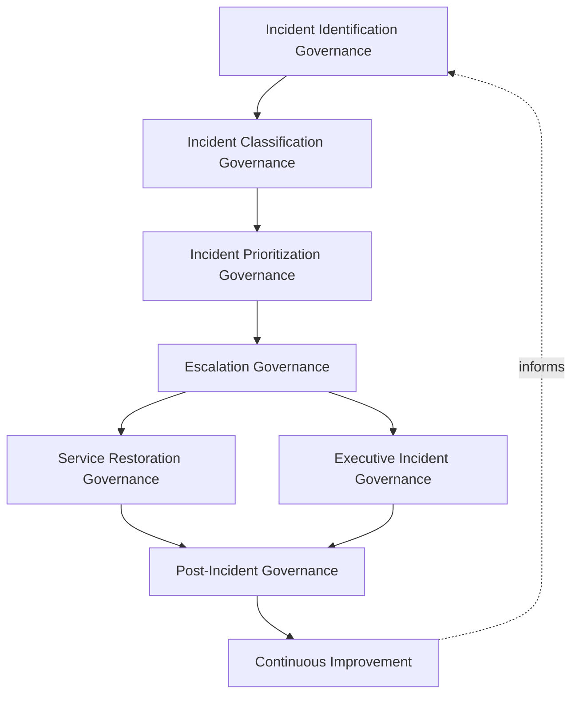
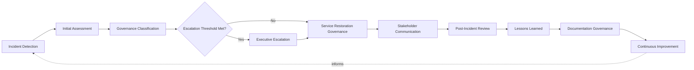
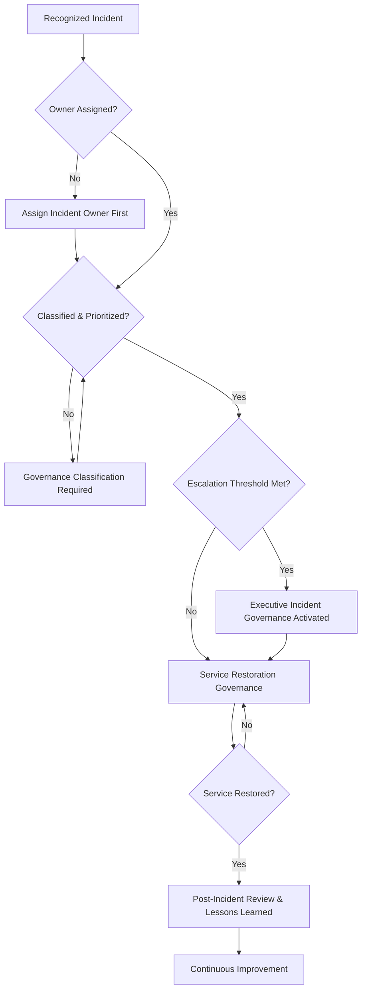
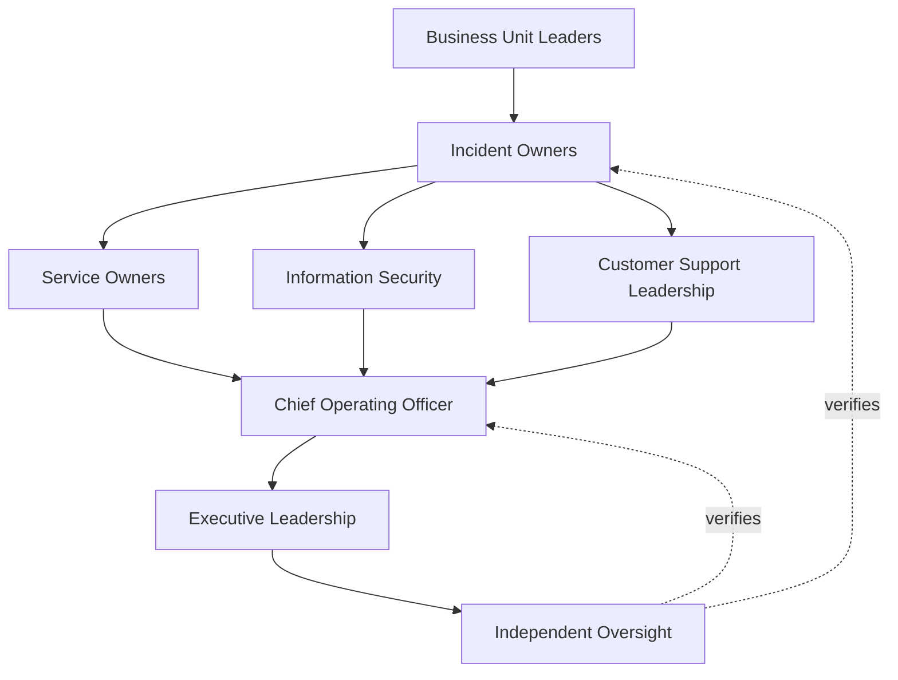
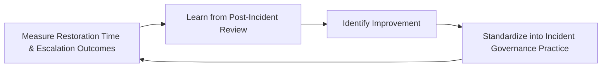

# Enterprise Incident Management Governance Strategy

## 1. Document Purpose

This document defines the official Enterprise Incident Management Governance Strategy for **StackLeo Tech Store** — the COO/CIO-owned executive charter under which incident management, service restoration, incident ownership, escalation, and organizational accountability for disruption are governed as a deliberate, accountable discipline. It establishes governance for incident identification, classification, prioritization, escalation, service restoration, executive oversight, organizational accountability, operational resilience, and long-term incident management maturity across the StackLeo platform, consistent with ITIL 4, ISO/IEC 20000, ISO 9001, COBIT governance principles, and TOGAF enterprise architecture thinking.

`incident-management.md` remains the operational governance framework for incident management practice in this folder — the document that elaborates in full operational depth StackLeo's incident domains, lifecycle, and cross-functional coordination, itself sitting above the technical incident lifecycle defined in `07_DEVOPS/incident-management.md` and coordinated with `06_Security/incident-response.md` for security-specific response. This document sits above all three as the highest-level executive mandate, consistent with the executive-charter relationship `business-continuity-governance.md` holds over `business-continuity.md` and `operations-governance-strategy.md` holds over `operations-governance.md`: it does not restate operational incident detail, it establishes the philosophy, organizational ownership, and executive expectations that give incident management practice its authority and coherence at the level of the Board and executive leadership.

- **Purpose of Incident Management Governance** — to ensure that when the platform, a service, or the business itself is disrupted, the organization's response is governed by clear ownership, deliberate escalation, and genuine executive accountability, rather than left to whoever happens to notice first.
- **Relationship with Operations Governance** — `operations-governance-strategy.md` establishes the broader executive mandate for how StackLeo's daily operation is governed; this strategy is that mandate's specific application to the moment operation is disrupted, consistent with Operational Governance (`operations-governance-strategy.md`, Section 3).
- **Relationship with Service Management** — incidents are, by definition, a threat to the commitments defined in `service-catalog.md` and `service-level-management.md`; this strategy governs the accountability structure under which that threat is identified, escalated, and resolved.
- **Relationship with Business Continuity** — a technical or operational incident may escalate beyond a contained event into broader business disruption; this strategy defines the governance point at which incident accountability hands off to the continuity governance established in `business-continuity-governance.md`.
- **Relationship with Risk Management** — the disruption risk this strategy governs the response to is identified and evaluated under `06_Security/enterprise-risk-management-strategy.md` (Section 3.2, Operational Risk Governance); this strategy is the governed response when that risk is realized.
- **Relationship with Executive Decision-Making** — this strategy exists to give executive leadership genuine, timely visibility into incidents that matter to the business, a visibility that directly informs decisions about investment, priority, and acceptable operational risk.
- **Relationship with Customer Experience** — how deliberately and transparently StackLeo governs its response to an incident is as consequential to customer trust as the incident itself; this strategy governs incident handling as a direct extension of the trust-centered brand promise in `01_Business/vision.md`.

This document is implementation-independent and vendor-neutral. It defines incident management governance philosophy, model, domains, and lifecycle conceptually — not specific ITSM platforms, incident response software, monitoring tools, cloud providers, consulting firms, ticketing systems, operational products, incident response procedures, escalation workflows, on-call schedules, ticket handling processes, infrastructure configurations, deployment architectures, operational runbooks, implementation roadmaps, or code.

## 2. Incident Management Philosophy

Incident management governance at StackLeo rests on eight principles. Each exists to produce a specific business outcome — incidents are governed deliberately because disruption threatens both customer trust and business continuity in ways that cannot be left to improvisation.

### 2.1 Rapid Service Restoration

Restoring acceptable service is the immediate governance priority during an incident; full root cause understanding, while important, is governed to follow restoration rather than delay it.

- **Business Value** — minimizes the duration of customer and business impact, typically the largest single cost component of any incident.

### 2.2 Governance Before Response

The accountability structure — who decides, who owns, who escalates to whom — is established before a specific incident occurs, not improvised once one is already underway.

- **Business Value** — ensures response, when needed, is executed from genuine readiness rather than invented under pressure.

### 2.3 Customer-Centric Incident Handling

Every incident governance decision is made with explicit awareness of its effect on customers, not only its technical resolution path.

- **Business Value** — protects the trust-centered brand commitment in `01_Business/vision.md` by ensuring governance never loses sight of genuine customer impact.

### 2.4 Accountability

Every incident traces to a specific, named, responsible owner from the moment it is recognized until it is formally closed.

- **Business Value** — ensures no incident is left to drift without someone genuinely responsible for its resolution.

### 2.5 Transparency

Incident status, impact, and resolution progress are documented and visible to those who genuinely need them, internally and, where appropriate, externally.

- **Business Value** — sustains stakeholder and customer confidence even while an incident remains unresolved.

### 2.6 Risk Awareness

The urgency and depth of incident governance are proportionate to genuine business, customer, and financial impact, consistent with the risk-based prioritization in `06_Security/enterprise-risk-management-strategy.md`.

- **Business Value** — directs finite response capacity toward the incidents that genuinely matter most, rather than treating every disruption identically.

### 2.7 Organizational Learning

Every incident, regardless of severity, is treated as a genuine opportunity to strengthen future readiness, not merely an event to be closed out.

- **Business Value** — converts the cost of disruption into a durable investment in future resilience.

### 2.8 Continuous Improvement

Incident management governance practice matures over time, informed by real incidents, near-misses, and the organization's growth in scale and complexity.

- **Business Value** — keeps incident governance aligned with StackLeo's growth in scale, market reach, and operational complexity.

## 3. Enterprise Incident Governance Model

Incident management governance operates across eight conceptual layers, each holding accountability for a distinct dimension of how StackLeo governs disruption. Every layer here is elaborated in full operational depth in `incident-management.md`.

### 3.1 Incident Identification Governance

- **Purpose** — own the coherence of how the organization recognizes that a genuine incident, rather than routine variance, is occurring.
- **Governance Scope** — oversight of the boundary between normal operational fluctuation and a genuine incident, coordinated with `monitoring-observability.md`.
- **Business Value** — ensures response effort is directed only at genuine disruption, not routine noise.
- **Executive Expectations** — leadership trusts that genuine incidents are recognized promptly, not discovered late through customer complaint.

### 3.2 Incident Classification Governance

- **Purpose** — own the coherence of how a recognized incident is characterized by type, domain, and scope.
- **Governance Scope** — oversight spanning every domain in Section 4.
- **Business Value** — ensures the right accountable function engages an incident from the outset, rather than after a misdirected initial response.
- **Executive Expectations** — leadership trusts classification is consistent and defensible, not a matter of individual judgment alone.

### 3.3 Incident Prioritization Governance

- **Purpose** — own the coherence of how urgency and response depth are assigned to a classified incident.
- **Governance Scope** — oversight of prioritization decisions across every domain, grounded in Risk Awareness (Section 2.6).
- **Business Value** — ensures limited response capacity is directed toward what genuinely matters most to the business and its customers.
- **Executive Expectations** — leadership trusts prioritization reflects genuine business impact, not the loudest internal voice.

### 3.4 Escalation Governance

- **Purpose** — own the coherence of how an incident's ownership and visibility expand as its scope or severity grows.
- **Governance Scope** — oversight of the path from Incident Owners through Business Unit Leaders to Executive Incident Governance (Sections 3.6, 7).
- **Business Value** — ensures an incident's true scope is never masked by an owner reluctant to escalate.
- **Executive Expectations** — leadership expects escalation to occur automatically once defined thresholds are met, never left to discretion alone.

### 3.5 Service Restoration Governance

- **Purpose** — own the coherence of how the organization governs the return of affected service to acceptable operation.
- **Governance Scope** — oversight of Service Restoration Governance (Section 5.5) across every domain in Section 4.
- **Business Value** — ensures restoration is pursued as the deliberate, governed priority described in Section 2.1, not one competing concern among several.
- **Executive Expectations** — leadership trusts restoration proceeds with urgency proportionate to genuine impact.

### 3.6 Executive Incident Governance

- **Purpose** — own executive-level accountability for the incidents carrying the greatest organizational consequence.
- **Governance Scope** — oversight spanning Sections 3.1–3.5 and 3.7 wherever an incident rises to genuine executive concern.
- **Business Value** — ensures the most consequential incidents are visible at the level accountable for the organization as a whole.
- **Executive Expectations** — leadership expects to be informed of, not surprised by, the organization's most significant active disruption.

### 3.7 Post-Incident Governance

- **Purpose** — own the coherence of how the organization reviews and formally closes out a resolved incident.
- **Governance Scope** — oversight of Post-Incident Review and Lessons Learned (Sections 5.7–5.8) across every domain in Section 4.
- **Business Value** — ensures a resolved incident is genuinely understood before it is closed, not merely marked complete.
- **Executive Expectations** — leadership expects every significant incident to produce a documented, attributable lesson.

### 3.8 Continuous Improvement

- **Purpose** — govern the mechanism by which every other layer in this model matures over time.
- **Governance Scope** — consolidates findings from post-incident review, near-misses, and audits across every domain in Section 4.
- **Business Value** — prevents incident governance itself from becoming the next thing that quietly stagnates as the organization scales.
- **Executive Expectations** — leadership expects incident management maturity to be assessed periodically, not assumed static once established.

### Enterprise Incident Governance Matrix

| Layer | Purpose | Business Value | Executive Expectations |
|---|---|---|---|
| Incident Identification Governance | Own coherence of recognizing genuine incidents | Ensures effort is directed only at genuine disruption | Trusts genuine incidents are recognized promptly |
| Incident Classification Governance | Own coherence of characterizing incident type, domain, scope | Ensures the right function engages from the outset | Trusts classification is consistent and defensible |
| Incident Prioritization Governance | Own coherence of assigning urgency and response depth | Directs limited capacity toward what matters most | Trusts prioritization reflects genuine business impact |
| Escalation Governance | Own coherence of expanding ownership and visibility | Ensures true scope is never masked by reluctance to escalate | Expects escalation to occur automatically at defined thresholds |
| Service Restoration Governance | Own coherence of governing the return to acceptable operation | Ensures restoration is pursued as the deliberate priority | Trusts restoration proceeds with proportionate urgency |
| Executive Incident Governance | Own executive accountability for highest-consequence incidents | Ensures the most consequential incidents are visible to leadership | Expects leadership informed of, not surprised by, top disruption |
| Post-Incident Governance | Own coherence of reviewing and formally closing incidents | Ensures resolved incidents are genuinely understood, not just closed | Expects every significant incident to produce a documented lesson |
| Continuous Improvement | Govern maturation of every other layer | Prevents governance itself from stagnating | Expects maturity to be assessed periodically |

*Diagram 1: Enterprise Incident Governance Framework — identification, classification, and prioritization establish the foundation, escalation governance branches into service restoration and executive oversight as scope requires, converging on post-incident governance and continuous improvement that feeds back into the model.*

## 4. Enterprise Incident Domains

Incident management is governed across ten conceptual domains, each requiring a distinct governance emphasis. Every domain here is elaborated in full operational depth in `incident-management.md`.

### 4.1 Customer Service Incidents

- **Purpose** — govern incidents affecting a customer's ability to receive support or resolve a concern with StackLeo.
- **Governance Considerations** — governed under Incident Prioritization Governance (Section 3.3), given its direct and immediate effect on customer experience.
- **Business Importance** — protects the trust relationship every customer support interaction depends on.
- **Executive Expectations** — leadership expects customer service incidents to be visible in proportion to genuine customer impact, not internal convenience.

### 4.2 Marketplace Incidents

- **Purpose** — govern incidents affecting the platform's ability to list, browse, or transact products, including future multi-vendor marketplace activity.
- **Governance Considerations** — governed under Incident Prioritization Governance (Section 3.3), structured ahead of the marketplace model's launch.
- **Business Importance** — protects the core revenue-generating function of the business.
- **Executive Expectations** — leadership expects marketplace incidents to receive the highest business-criticality governance priority.

### 4.3 Payment Service Incidents

- **Purpose** — govern incidents affecting payment processing, reconciliation, or checkout completion.
- **Governance Considerations** — governed under Escalation Governance (Section 3.4), given its financial and regulatory sensitivity.
- **Business Importance** — protects both immediate revenue capture and the business's standing with payment partners and regulators.
- **Executive Expectations** — leadership expects payment incidents to meet the strictest escalation rigor in this model.

### 4.4 Technology & Infrastructure Incidents

- **Purpose** — govern incidents affecting the platform's underlying technical infrastructure and services.
- **Governance Considerations** — governed under Service Restoration Governance (Section 3.5), coordinated with `07_DEVOPS/incident-management.md`.
- **Business Importance** — protects the technical foundation every other incident domain ultimately depends on.
- **Executive Expectations** — leadership expects technology incidents to be governed with the same rigor regardless of which layer of the stack is affected.

### 4.5 Information Security Incidents

- **Purpose** — govern the cross-functional coordination and executive visibility surrounding a security incident.
- **Governance Considerations** — governed jointly with, and never superseding, `06_Security/incident-response.md`, which remains authoritative for security-specific response obligations.
- **Business Importance** — protects customer data, platform integrity, and regulatory standing during the organization's most sensitive incident category.
- **Executive Expectations** — leadership expects security incidents to be escalated with the confidentiality and urgency defined in `06_Security/incident-response.md`.

### 4.6 Third-Party Service Incidents

- **Purpose** — govern incidents originating in a vendor, integration partner, or other external dependency.
- **Governance Considerations** — governed under Incident Classification Governance (Section 3.2), coordinated with `06_Security/third-party-risk-governance.md`.
- **Business Importance** — protects the business from disruption it does not directly control but is nonetheless exposed to.
- **Executive Expectations** — leadership expects third-party incident dependency to be understood before, not discovered during, a disruption.

### 4.7 Logistics & Fulfillment Incidents

- **Purpose** — govern incidents affecting order fulfillment, delivery, or logistics partner performance.
- **Governance Considerations** — governed under Incident Prioritization Governance (Section 3.3), given its direct role in the customer experience.
- **Business Importance** — protects the operational reliability customers directly experience after a purchase.
- **Executive Expectations** — leadership expects logistics incidents to be governed with explicit awareness of courier and delivery partner dependency.

### 4.8 Internal Business Operation Incidents

- **Purpose** — govern incidents affecting internal business functions that, while not directly customer-facing, threaten the organization's ability to operate.
- **Governance Considerations** — governed under Incident Classification Governance (Section 3.2), coordinated with Business Unit Leaders (Section 7.5).
- **Business Importance** — protects the organization's own operating capability, which customer-facing service ultimately depends on.
- **Executive Expectations** — leadership expects internal incidents to be governed with the same discipline as customer-facing ones, not treated as lower priority by default.

### 4.9 Compliance-Related Incidents

- **Purpose** — govern incidents that carry a genuine regulatory, contractual, or compliance obligation dimension.
- **Governance Considerations** — governed under Executive Incident Governance (Section 3.6), coordinated with `06_Security/compliance-governance.md`.
- **Business Importance** — protects the business's standing with regulators and its contractual counterparties.
- **Executive Expectations** — leadership expects compliance-related incidents to be escalated immediately, without exception, regardless of apparent technical severity.

### 4.10 Executive & Strategic Incidents

- **Purpose** — govern incidents whose consequence extends to the organization's reputation, strategy, or standing as a whole.
- **Governance Considerations** — governed exclusively under Executive Incident Governance (Section 3.6).
- **Business Importance** — protects the organization's most consequential asset — its standing with customers, partners, and the market.
- **Executive Expectations** — leadership expects direct, immediate engagement for any incident genuinely rising to this category.

### Enterprise Incident Domain Matrix

| Domain | Purpose | Business Importance | Executive Expectations |
|---|---|---|---|
| Customer Service Incidents | Govern incidents affecting customer support and resolution | Protects the trust relationship support interactions depend on | Visible in proportion to genuine customer impact |
| Marketplace Incidents | Govern incidents affecting listing, browsing, and transactions | Protects the core revenue-generating function | Receives the highest business-criticality priority |
| Payment Service Incidents | Govern incidents affecting payment and checkout | Protects revenue capture and partner/regulator standing | Meets the strictest escalation rigor in this model |
| Technology & Infrastructure Incidents | Govern incidents affecting technical infrastructure | Protects the technical foundation every domain depends on | Governed with consistent rigor across the stack |
| Information Security Incidents | Govern coordination and visibility of security incidents | Protects data, integrity, and regulatory standing | Escalated with confidentiality and urgency per `incident-response.md` |
| Third-Party Service Incidents | Govern incidents from vendors and external dependencies | Protects against risk not directly controlled | Dependency understood before, not during, disruption |
| Logistics & Fulfillment Incidents | Govern incidents affecting fulfillment and delivery | Protects post-purchase operational reliability | Governed with explicit delivery-partner awareness |
| Internal Business Operation Incidents | Govern incidents affecting internal operating capability | Protects operating capability customer service depends on | Governed with the same discipline as customer-facing incidents |
| Compliance-Related Incidents | Govern incidents with regulatory or contractual dimension | Protects standing with regulators and counterparties | Escalated immediately, without exception |
| Executive & Strategic Incidents | Govern incidents affecting reputation or strategy | Protects the organization's standing with market and partners | Receives direct, immediate executive engagement |

## 5. Enterprise Incident Lifecycle

Incident management governance operates across ten conceptual lifecycle stages, applicable across every domain in Section 4.

### 5.1 Incident Detection

- **Purpose** — govern how the organization recognizes that a disruption may be occurring.
- **Governance Objectives** — require detection capability to be treated as a first-class governance investment, coordinated with `monitoring-observability.md`.
- **Business Value** — enables governance to begin as early as possible, limiting eventual impact.

### 5.2 Initial Assessment

- **Purpose** — govern how the organization confirms the nature and immediate scope of a detected disruption.
- **Governance Objectives** — require assessment before response is scaled, preventing wasted effort on a misunderstood situation.
- **Business Value** — ensures governance decisions that follow are grounded in a genuine understanding of what is occurring.

### 5.3 Governance Classification

- **Purpose** — govern how an assessed incident is formally classified by domain, severity, and priority.
- **Governance Objectives** — apply Incident Classification and Prioritization Governance (Sections 3.2–3.3) consistently.
- **Business Value** — ensures the right accountable function and urgency level are assigned from the outset.

### 5.4 Executive Escalation

- **Purpose** — govern the point at which an incident's scope or severity requires executive visibility or engagement.
- **Governance Objectives** — apply Escalation and Executive Incident Governance (Sections 3.4, 3.6) against clearly understood thresholds.
- **Business Value** — ensures leadership is engaged exactly when genuinely warranted, neither too late nor unnecessarily.

### 5.5 Service Restoration Governance

- **Purpose** — govern the organization's priority of returning affected service to acceptable operation.
- **Governance Objectives** — apply Rapid Service Restoration (Section 2.1) as the governed priority throughout active response.
- **Business Value** — minimizes the duration of customer and business impact.

### 5.6 Stakeholder Communication

- **Purpose** — govern how affected stakeholders — customers, partners, internal teams, and leadership — are kept informed.
- **Governance Objectives** — apply Transparency (Section 2.5) proportionate to genuine incident impact and audience.
- **Business Value** — sustains stakeholder confidence even while an incident remains unresolved.

### 5.7 Post-Incident Review

- **Purpose** — govern the formal review of a resolved incident's cause, response, and impact.
- **Governance Objectives** — apply Post-Incident Governance (Section 3.7) to every incident meeting a defined significance threshold.
- **Business Value** — ensures a resolved incident is genuinely understood, not merely marked complete.

### 5.8 Lessons Learned

- **Purpose** — formally capture what a review reveals about incident management governance itself.
- **Governance Objectives** — require lessons to be documented and attributed to specific governance implications, consistent with Organizational Learning (Section 2.7).
- **Business Value** — ensures the organization genuinely learns from experience rather than repeating the same gaps.

### 5.9 Documentation Governance

- **Purpose** — govern the completeness and integrity of the incident record itself.
- **Governance Objectives** — require documentation to remain consistent with `incident-management.md` and `06_Security/incident-response.md` as those documents evolve.
- **Business Value** — ensures the organization retains a genuine, trustworthy record of what happened and why.

### 5.10 Continuous Improvement

- **Purpose** — apply accumulated lessons to strengthen future incident management governance.
- **Governance Objectives** — require findings to be genuinely analyzed for recurring patterns, consistent with Section 3.8.
- **Business Value** — turns each incident into an input that makes future incident governance genuinely stronger.

### Enterprise Incident Lifecycle Matrix

| Stage | Purpose | Governance Objective | Business Value |
|---|---|---|---|
| Incident Detection | Recognize that a disruption may be occurring | Treated as a first-class governance investment | Enables governance to begin as early as possible |
| Initial Assessment | Confirm the nature and immediate scope | Occurs before response is scaled | Grounds governance in genuine understanding |
| Governance Classification | Formally classify domain, severity, priority | Applies classification and prioritization consistently | Assigns the right function and urgency from the outset |
| Executive Escalation | Elevate incidents requiring executive visibility | Applies escalation against clear thresholds | Engages leadership exactly when warranted |
| Service Restoration Governance | Prioritize return to acceptable operation | Applies rapid restoration as governed priority | Minimizes duration of customer and business impact |
| Stakeholder Communication | Keep affected stakeholders informed | Applies transparency proportionate to impact | Sustains confidence during unresolved incidents |
| Post-Incident Review | Formally review cause, response, and impact | Applied to every incident meeting a significance threshold | Ensures resolved incidents are genuinely understood |
| Lessons Learned | Capture governance implications from review | Documented and attributed to specific implications | Ensures genuine learning rather than repeated gaps |
| Documentation Governance | Maintain completeness and integrity of the record | Kept consistent with subordinate documentation | Retains a genuine, trustworthy record |
| Continuous Improvement | Apply lessons to strengthen future governance | Findings genuinely analyzed for recurring patterns | Makes future incident governance genuinely stronger |

*Diagram 2: Enterprise Incident Lifecycle — detection and assessment inform governance classification, escalating to executive governance only where thresholds are met before service restoration, with stakeholder communication, post-incident review, lessons learned, and documentation governance feeding continuous improvement back into the cycle.*

## 6. Incident Management Principles

- **Accountability** — every incident traces to a specific, named, responsible owner, consistent with Section 2.4.
- **Transparency** — incident status, impact, and resolution are documented and visible to those who need them, consistent with Section 2.5.
- **Customer Focus** — every governance decision considers genuine customer impact, consistent with Section 2.3.
- **Timeliness** — detection, escalation, and restoration occur without avoidable delay, consistent with Rapid Service Restoration (Section 2.1).
- **Risk Awareness** — governance urgency is proportionate to genuine business, customer, and financial impact, consistent with Section 2.6.
- **Business Alignment** — incident governance decisions are made in service of genuine business priority, not internal convenience.
- **Organizational Learning** — every incident deepens the organization's genuine future readiness, consistent with Section 2.7.
- **Continuous Improvement** — governance practice matures over time, informed by real incidents and near-misses.

### Incident Management Principles Matrix

| Principle | Description | Business Value |
|---|---|---|
| Accountability | Every incident traces to a specific, named, responsible owner | Ensures no incident drifts without genuine ownership |
| Transparency | Status, impact, and resolution documented and visible | Sustains stakeholder confidence during unresolved incidents |
| Customer Focus | Governance decisions consider genuine customer impact | Protects the trust relationship every incident places at risk |
| Timeliness | Detection, escalation, restoration occur without avoidable delay | Minimizes duration and cost of disruption |
| Risk Awareness | Governance urgency proportionate to genuine impact | Directs finite capacity toward what matters most |
| Business Alignment | Decisions made in service of genuine business priority | Prevents governance from drifting toward internal convenience |
| Organizational Learning | Each incident deepens genuine future readiness | Converts disruption cost into durable resilience investment |
| Continuous Improvement | Practice matures from real incidents and near-misses | Keeps governance aligned with organizational growth |

*Diagram 4: Enterprise Incident Governance Decision Flow — a recognized incident is checked for assigned ownership and governance classification, with executive governance activated upon meeting escalation thresholds, resolving into service restoration, post-incident review, and continuous improvement.*

## 7. Ownership & Accountability

Governance authority for incident management is distributed deliberately across eight accountable functions, defined here at the governance-objective level, without prescribing specific operational incident response activities.

### 7.1 Executive Leadership

- **Governance Objective** — the Board and executive leadership hold ultimate accountability for how the organization governs its response to disruption.
- **Business Value** — provides a single point of ultimate accountability for whether incident governance is genuinely functioning as intended.

### 7.2 Chief Operating Officer

- **Governance Objective** — the Chief Operating Officer owns the coherence and enforcement of this strategy across every domain, layer, and stage it defines.
- **Business Value** — provides a single point of specialist accountability for whether incident management governance is genuinely functioning as intended.

### 7.3 Service Owners

- **Governance Objective** — each service defined in `service-catalog.md` has a specific, named owner accountable for that service's incident exposure and restoration priority.
- **Business Value** — ensures no service persists without someone genuinely responsible for its incident governance.

### 7.4 Incident Owners

- **Governance Objective** — each individual incident has a specific, named owner accountable for its classification, escalation, and resolution, consistent with Accountability (Section 2.4).
- **Business Value** — ensures every active incident has a clear, singular point of accountability throughout its lifecycle.

### 7.5 Business Unit Leaders

- **Governance Objective** — business unit leaders own incident governance readiness within their own function, consistent with Internal Business Operation Incidents (Section 4.8).
- **Business Value** — ensures incident governance is genuinely embedded within the functions closest to operational disruption.

### 7.6 Information Security

- **Governance Objective** — information security owns Information Security Incidents (Section 4.5) jointly with `06_Security/incident-response.md`, which remains authoritative for security-specific obligations.
- **Business Value** — ensures security-relevant incidents remain integrated with, not separate from, broader incident governance.

### 7.7 Customer Support Leadership

- **Governance Objective** — customer support leadership owns Customer Service Incidents (Section 4.1) and the customer-facing dimension of Stakeholder Communication (Section 5.6).
- **Business Value** — ensures the customer's genuine experience of an incident is represented directly in its governance.

### 7.8 Independent Oversight

- **Governance Objective** — an independent function, separate from those who design and operate incident governance, periodically verifies its overall effectiveness.
- **Business Value** — prevents governance from being assumed effective on the word of the same function responsible for running it.

### Ownership & Accountability Matrix

| Role | Governance Objective | Business Value |
|---|---|---|
| Executive Leadership | Hold ultimate accountability for governing disruption response | Provides a single point of ultimate accountability |
| Chief Operating Officer | Own coherence and enforcement of this strategy | Provides a single point of specialist accountability |
| Service Owners | Own incident exposure and restoration priority for a specific service | Ensures no service persists without genuine incident accountability |
| Incident Owners | Own classification, escalation, and resolution of a specific incident | Ensures every active incident has clear, singular accountability |
| Business Unit Leaders | Own incident governance readiness within their own function | Embeds governance closest to operational disruption |
| Information Security | Own security incidents jointly with `incident-response.md` | Keeps security incidents integrated with broader governance |
| Customer Support Leadership | Own customer service incidents and customer communication | Represents genuine customer experience in governance |
| Independent Oversight | Independently verify overall governance effectiveness | Prevents self-assessed assumption of effectiveness |

*Diagram 3: Incident Ownership & Accountability Model — accountability flows from business unit and incident ownership through service ownership, security, and customer support leadership into the Chief Operating Officer, converging on executive leadership verified by independent oversight.*

## 8. Executive Oversight

- **Executive Incident Reviews** — the overall coherence of incident management governance is formally reviewed on a regular cadence, consistent with `operations-governance-strategy.md` (Section 8).
- **Service Restoration Reporting** — aggregated incident health — active incidents, restoration status, service level impact — is reported to executive leadership and the Board.
- **Governance Reviews** — the governance model, domains, and lifecycle defined in this strategy (Sections 3–7) are periodically reassessed for continued fitness.
- **Major Incident Oversight** — the organization's readiness to activate Executive Incident Governance (Section 3.6) is reviewed directly with executive leadership.
- **Documentation Governance** — this strategy's relationship to `incident-management.md`, `06_Security/incident-response.md`, and `business-continuity-governance.md` is kept current as those documents evolve.
- **Operational Readiness** — incident decisions, evidence, and outcomes are maintained in a state ready for internal or external audit at any time, coordinated with `06_Security/audit-governance.md`.

### Executive Oversight Matrix

| Oversight Mechanism | Purpose | Governance Role |
|---|---|---|
| Executive Incident Reviews | Confirm overall incident governance coherence | Regular, predictable cadence for the strategy as a whole |
| Service Restoration Reporting | Provide leadership a single, coherent incident picture | Reports active incidents, restoration status, service level impact |
| Governance Reviews | Reassess the governance model itself for continued fitness | Applies to Sections 3–7 of this strategy |
| Major Incident Oversight | Review readiness to activate executive incident governance | Direct executive-level review of escalation capability |
| Documentation Governance | Keep this strategy's subordinate relationships current | Updated as related documents evolve |
| Operational Readiness | Maintain decisions and evidence ready for independent review | Continuous state, coordinated with audit governance |

### Governance Responsibility Matrix

| Role | Responsibility |
|---|---|
| Executive Leadership | Owns ultimate accountability for how the organization governs its response to disruption. |
| Chief Operating Officer | Owns coherence and enforcement of this strategy, in partnership with executive leadership. |
| Incident Management Governance Lead | Owns the operational incident model within `incident-management.md`. |
| Service Owners | Own incident exposure and restoration priority within their assigned service. |
| Incident Owners | Own classification, escalation, and resolution of their assigned incident. |
| Information Security | Owns Information Security Incidents jointly with `06_Security/incident-response.md`. |
| Customer Support Leadership | Owns Customer Service Incidents and customer-facing communication. |
| Independent Oversight | Independently verifies the overall effectiveness of incident management governance. |

## 9. Future Readiness

This strategy is designed to remain valid as StackLeo evolves in scale, geography, and organizational complexity, without requiring redefinition of its underlying philosophy.

- **AI-Assisted Incident Governance** — as incident detection and triage increasingly incorporate AI-assisted analysis, they remain governed under Incident Identification and Classification Governance (Sections 3.1–3.2) at the same rigor as any other method.
- **Predictive Incident Intelligence** — where the organization develops the capability to anticipate incidents before they fully materialize, that capability is governed as an extension of Incident Detection (Section 5.1), not a separate discipline.
- **Enterprise Scale** — the governance model, domains, and lifecycle defined throughout this strategy are defined independently of organizational size, so they remain coherent as StackLeo's operational complexity grows substantially.
- **Global Expansion** — Incident Classification and Prioritization Governance (Sections 3.2–3.3) are structured to be re-applied as StackLeo expands from Bangladesh into South Asia and global markets, each with genuinely distinct incident considerations.
- **Multi-Region Operations** — Technology & Infrastructure and Logistics & Fulfillment Incidents (Sections 4.4, 4.7) are structured to absorb genuinely multi-region operational complexity as it emerges.
- **Digital Operations** — this strategy's governance discipline is treated as a direct contributor to the digital trust customers, partners, and regulators extend to StackLeo, not merely an internal control exercise.
- **Hyperautomation (conceptual only)** — where automation increasingly performs steps within Incident Detection, Classification, or Restoration (Sections 5.1, 5.3, 5.5), that automation remains subject to the same ownership and escalation governance as any human-performed activity.
- **Future Operational Ecosystems** — Continuous Improvement (Section 3.8) is structured to absorb genuinely new operational models — additional sales channels, multi-vendor operations, corporate and wholesale sales — without requiring this strategy to be rewritten.

## 10. Incident Management Maturity Model

Incident management governance maturity is described across five conceptual levels, consistent with ITIL 4 and established process maturity thinking.

- **Initial** — incident governance, where it exists, is informal and inconsistent; incidents are identified reactively, and ownership is unclear.
- **Managed** — basic incident governance exists for individual domains, but consistency across the ten domains in Section 4 varies significantly.
- **Defined** — the governance model, domains, and lifecycle are standardized, documented, and consistently applied across the organization, consistent with the model defined throughout this strategy.
- **Measured** — incident volume, restoration time, and escalation outcomes are measured systematically, and decisions are grounded in genuine evidence rather than qualitative impression alone.
- **Optimizing** — incident management governance is continuously and deliberately improved based on quantitative evidence and organizational learning; improvement itself is a managed, ongoing discipline rather than an occasional initiative.

### Incident Management Maturity Model Matrix

| Level | Characteristics | Primary Focus |
|---|---|---|
| Initial | Informal, inconsistent governance; incidents identified reactively | Ad hoc, individually-dependent incident practice |
| Managed | Basic governance exists per domain; consistency varies | Domain-level consistency |
| Defined | Standardized governance model, domains, and lifecycle | Organization-wide consistency and clear ownership |
| Measured | Volume, restoration time, and outcomes measured systematically | Evidence-based incident governance decisions |
| Optimizing | Practice continuously and deliberately improved from evidence | Sustained, deliberate improvement as a discipline |

*Diagram 5: Continuous Incident Improvement Cycle — incident outcomes are measured, learned from, improved upon, and standardized back into governed practice, on a continuing basis.*

*Diagram 6: Incident Management Maturity Progression Model — maturity advances from informal, reactively-identified incident practice toward standardized, measured, and continuously optimized incident management governance.*

## 11. Anti-Patterns

The following recurring failure patterns are explicitly recognized and avoided, as each one structurally undermines this strategy.

### Anti-Pattern Summary

| Anti-Pattern | Why It's Avoided |
|---|---|
| Incidents Without Ownership | Contradicts Incident Owners (Section 7.4); an incident with no accountable owner has no one genuinely responsible for its resolution. |
| Weak Escalation Governance | Contradicts Escalation Governance (Section 3.4); unclear or discretionary escalation lets an incident's true scope go unrecognized until it is too late. |
| Poor Executive Visibility | Contradicts Service Restoration Reporting (Section 8); leadership cannot govern incident risk it is never shown. |
| Delayed Service Restoration | Contradicts Rapid Service Restoration (Section 2.1); prioritizing anything above restoration extends customer and business impact unnecessarily. |
| Poor Documentation | Undermines Documentation Governance (Sections 5.9, 8) and Transparency (Section 2.5), leaving incident decisions unclear or unverifiable after the fact. |
| Reactive Operations | Contradicts Governance Before Response (Section 2.2); treating governance as something invented in the moment leaves response improvised under pressure. |
| Siloed Incident Management | Contradicts the Enterprise Incident Governance Model (Section 3); domain-by-domain handling that never converges leaves no coherent, organization-wide picture of disruption. |
| Missing Continuous Improvement | Contradicts Continuous Improvement (Sections 2.8, 3.8); without deliberate improvement, incident governance stagnates as the organization and its risk landscape grow. |

## 12. Document Information

| Property | Value |
|----------|-------|
| Document | incident-management-governance.md |
| Version | 1.0.0 |
| Status | Active |
| Maintained By | StackLeo |
| Last Updated | 2026-07-24 |

---

© StackLeo. All Rights Reserved.
