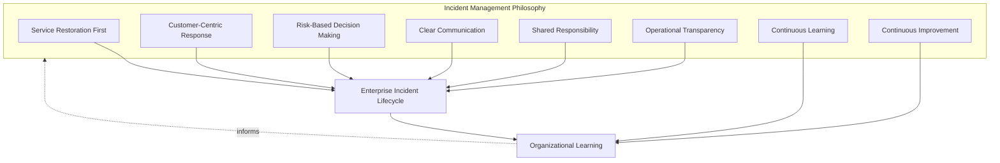
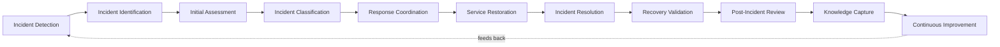
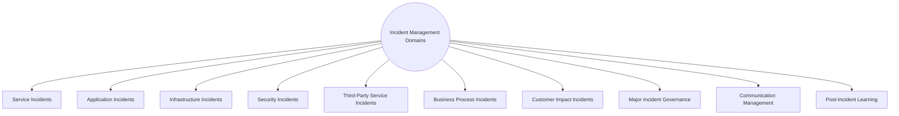
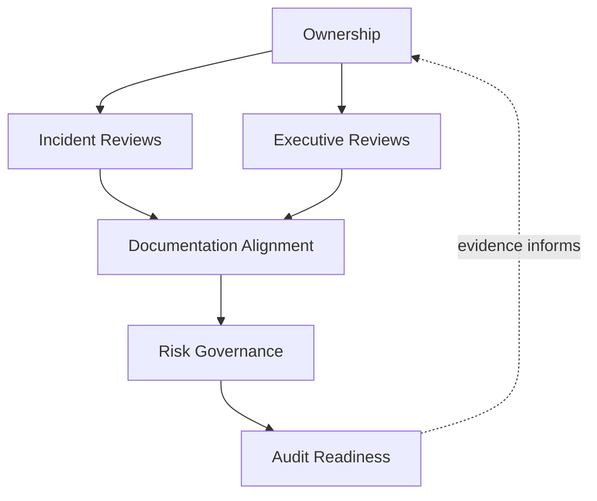
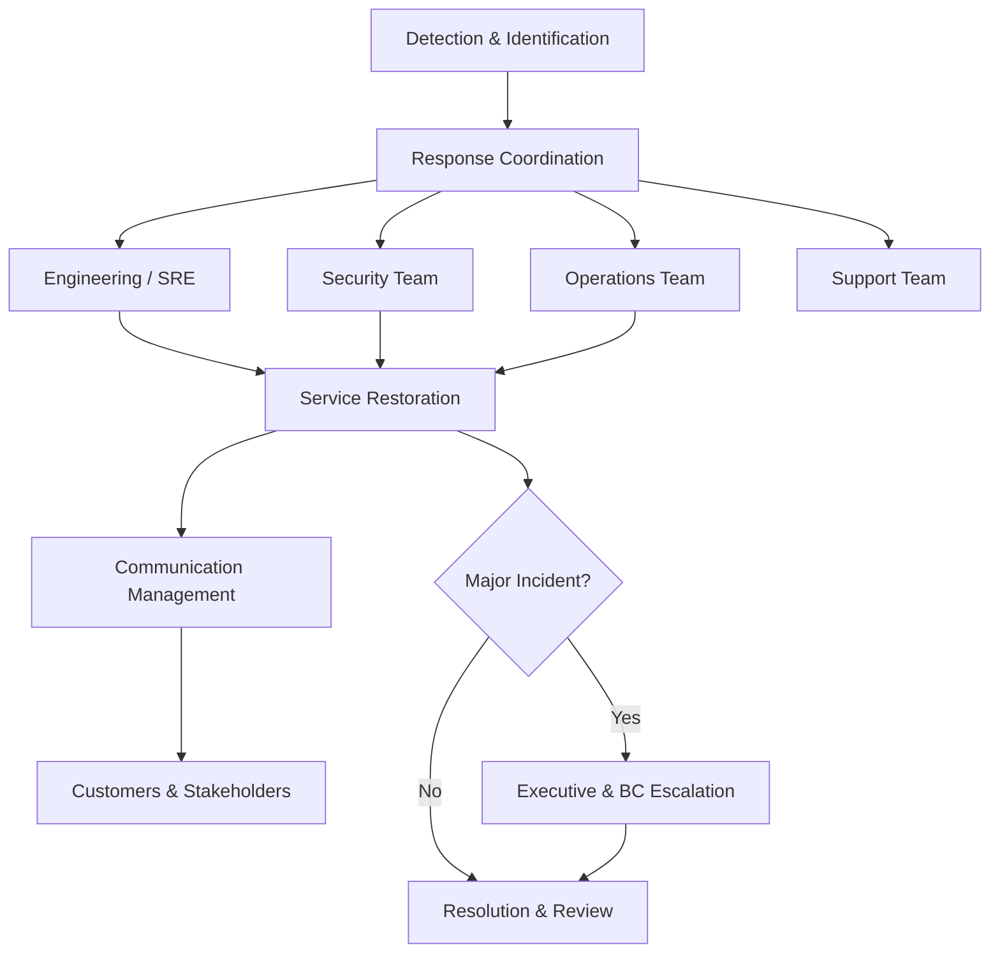
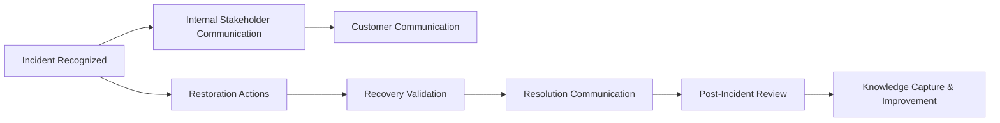
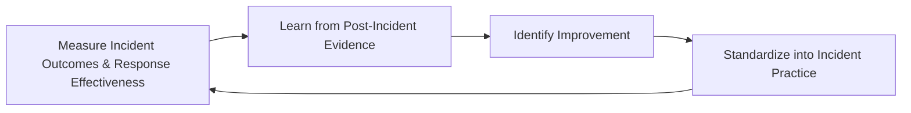
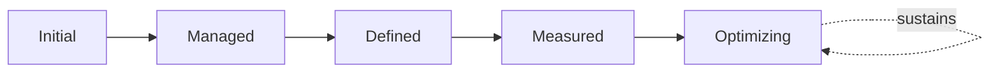

# Enterprise Incident Management & Operational Response Strategy

## 1. Document Purpose

This document defines the official Enterprise Incident Management & Operational Response Strategy for **StackLeo Tech Store**. It establishes how the organization responds to, communicates about, and learns from disruption — independent of any specific incident management tool, ticketing system, or communication platform.

A companion document, `07_DEVOPS/incident-management.md`, remains authoritative for the technical incident lifecycle — detection, response, and recovery mechanics from an engineering and SRE perspective. This document is that lifecycle's operational and cross-functional governance layer: it governs how incidents of every kind — not only technical ones — are coordinated across the whole organization, communicated to stakeholders, escalated when their scope exceeds a contained technical event, and converted into lasting organizational learning.

- **Purpose of Incident Management** — to ensure that when the platform, a service, or the business itself behaves unexpectedly, the organization responds in a coordinated, timely, and learning-oriented way that limits impact and converts disruption into an investment in future resilience.
- **Relationship with Operations** — this document is the incident-specific elaboration of `operations-overview.md`; Incident Response Awareness (`operations-overview.md`, Section 4.5) and Incident Management (Section 5.3) are the operational states and capability this document governs in full.
- **Relationship with Monitoring & Observability** — `monitoring-observability.md` defines how disruption is detected and initially diagnosed; this document governs what happens from the moment a detected event is recognized as an incident through its full resolution and review, per the Monitoring-to-Incident Awareness Flow established there (Section 6.2 of that document).
- **Relationship with Service Level Management** — incidents are a direct threat to the commitments defined in `service-level-management.md`; Post-Incident Service Review (`service-level-management.md`, Section 5) depends on this document's incident lifecycle producing accurate, timely evidence.
- **Relationship with Reliability Engineering** — this strategy assumes the reliability engineering philosophy of `07_DEVOPS/sre-strategy.md`; incident response is where engineered reliability meets real, unplanned conditions, and this document governs the organizational discipline applied at that moment.
- **Relationship with Business Continuity** — a technical incident may escalate beyond a contained event into broader business disruption; this document defines the point at which incident response hands off to the business continuity practice defined in `06_Security/business-continuity.md`.

This document is implementation-independent and vendor-neutral. It defines incident management philosophy, lifecycle, domains, and governance conceptually — not specific incident management tools, ticketing systems, communication platforms, severity matrices, escalation timelines, or infrastructure configuration.

## 2. Incident Management Philosophy

Incident management at StackLeo is governed by eight principles. Each exists to produce a specific business outcome — incidents are managed deliberately because of the trust and continuity at stake, not as reactive firefighting.

### 2.1 Service Restoration First

The immediate priority during an incident is restoring acceptable service, consistent with `07_DEVOPS/incident-management.md`; full root cause understanding, while important, follows restoration rather than delaying it.

- **Business Value** — minimizes the duration of customer and business impact, which is typically the largest cost component of any incident.

### 2.2 Customer-Centric Response

Every response decision during an incident is made with explicit awareness of its effect on customers, not only its technical resolution path.

- **Business Value** — protects the trust-centered brand commitment in `01_Business/vision.md` by ensuring technical response never loses sight of genuine customer impact.

### 2.3 Risk-Based Decision Making

The urgency and depth of response are proportionate to genuine business, customer, and financial impact, consistent with risk-based prioritization used throughout this repository.

- **Business Value** — directs finite response capacity toward the incidents that matter most, rather than treating every disruption identically.

### 2.4 Clear Communication

Stakeholders — customers, internal teams, leadership — receive timely, accurate, and honest information about an incident's status, consistent with Customer Communication in `service-management.md` (Section 4.7).

- **Business Value** — a well-communicated incident preserves substantially more trust than a technically well-handled but poorly communicated one.

### 2.5 Shared Responsibility

Incident response is owned jointly by Engineering, SRE, Operations, Security, Support, and Business stakeholders, depending on the incident's nature; no single function alone determines an adequate response.

- **Business Value** — ensures the right expertise is engaged regardless of where an incident originates or who first notices it.

### 2.6 Operational Transparency

The organization communicates honestly about incidents, internally and, where appropriate, externally, rather than minimizing or obscuring them.

- **Business Value** — builds durable trust; customers and partners forgive disruption more readily than they forgive being misled about it.

### 2.7 Continuous Learning

Every incident, regardless of severity, is treated as an opportunity for organizational learning, consistent with Blameless Reviews in `07_DEVOPS/incident-management.md`.

- **Business Value** — converts the cost already incurred by an incident into a durable asset — improved future resilience — rather than a pure loss.

### 2.8 Continuous Improvement

Incident management practice itself matures over time, informed by real incident history and post-incident findings.

- **Business Value** — ensures incident response becomes more effective over time rather than repeating the same coordination gaps indefinitely as the platform grows.

*Diagram 1: Incident Management Philosophy Overview — the eight principles shape the enterprise incident lifecycle, and organizational learning feeds back into the philosophy itself.*

## 3. Enterprise Incident Lifecycle

Incident management is governed across eleven conceptual stages, spanning from initial detection through knowledge capture and continuous improvement.

### 3.1 Incident Detection

- **Purpose** — recognize that platform, service, or business behavior deviates from expected bounds, consistent with Event Detection in `monitoring-observability.md` (Section 3.5).
- **Business Value** — is the necessary first step; an incident that is never detected can never be responded to.
- **Governance Objectives** — ensure detection can originate from any source — monitoring, customer report, or internal observation — without artificial barriers.

### 3.2 Incident Identification

- **Purpose** — confirm that a detected deviation genuinely constitutes an incident warranting formal response.
- **Business Value** — filters genuine incidents from noise, ensuring response capacity is not consumed by non-issues.
- **Governance Objectives** — require identification criteria to be applied consistently, not left to individual judgment alone.

### 3.3 Initial Assessment

- **Purpose** — perform a first-pass evaluation of an incident's scope, likely cause category, and business impact.
- **Business Value** — orients the response quickly, before deeper investigation, so appropriate resources can be engaged without delay.
- **Governance Objectives** — require every identified incident to receive an initial assessment within a defined, consistent expectation.

### 3.4 Incident Classification

- **Purpose** — classify the incident by domain (Section 4) and impact, informing which stakeholders and response patterns are engaged.
- **Business Value** — ensures the right expertise is engaged for the right kind of disruption, rather than a generic response applied uniformly.
- **Governance Objectives** — require classification to be documented and revisited as understanding of the incident develops.

### 3.5 Response Coordination

- **Purpose** — organize the people and effort required to respond, consistent with Coordinated Response in `07_DEVOPS/incident-management.md`.
- **Business Value** — prevents wasted effort and confusion from an improvised, uncoordinated response.
- **Governance Objectives** — ensure a clear response coordinator role is established for every incident above a defined significance threshold.

### 3.6 Service Restoration

- **Purpose** — restore acceptable service to customers and the business, consistent with Service Restoration First (Section 2.1).
- **Business Value** — directly limits the duration and depth of customer and business impact.
- **Governance Objectives** — ensure restoration actions are recorded as they are taken, supporting later Post-Incident Review (Section 3.9).

### 3.7 Incident Resolution

- **Purpose** — address the incident's underlying cause sufficiently that the disruption will not immediately recur.
- **Business Value** — distinguishes a genuinely resolved incident from one merely worked around temporarily.
- **Governance Objectives** — require resolution to be confirmed distinct from restoration, since restoring service does not guarantee the underlying issue is resolved.

### 3.8 Recovery Validation

- **Purpose** — confirm that restored and resolved service genuinely behaves correctly, not merely appears to.
- **Business Value** — prevents the costly failure mode of declaring an incident closed while customers are still affected.
- **Governance Objectives** — require independent validation, connected to Verification practice in `08_QUALITY_ASSURANCE/testing-strategy.md` (Section 6) where applicable.

### 3.9 Post-Incident Review

- **Purpose** — formally evaluate the incident's cause, response, and impact once resolved and validated.
- **Business Value** — converts the incident into a structured opportunity for learning, consistent with Continuous Learning (Section 2.7).
- **Governance Objectives** — require review for every incident meeting a defined significance threshold, conducted per Blameless Reviews.

### 3.10 Knowledge Capture

- **Purpose** — document what was learned about the incident, its cause, and its response for future reference.
- **Business Value** — prevents institutional knowledge about how an incident was handled and resolved from being lost.
- **Governance Objectives** — require knowledge capture to be connected to Knowledge Management in `service-management.md` (Section 4.8).

### 3.11 Continuous Improvement

- **Purpose** — act on post-incident findings to deliberately improve incident management practice and, where relevant, the platform itself.
- **Business Value** — ensures incident management effectiveness compounds over time rather than remaining static.
- **Governance Objectives** — require improvement actions arising from post-incident review to be documented and tracked to completion.

### Enterprise Incident Lifecycle Matrix

| Stage | Purpose | Business Value | Governance Objective |
|---|---|---|---|
| Incident Detection | Recognize deviation from expected bounds | Necessary first step for every subsequent stage | Detection open to any source, no artificial barriers |
| Incident Identification | Confirm a deviation genuinely constitutes an incident | Filters genuine incidents from noise | Identification criteria applied consistently |
| Initial Assessment | First-pass evaluation of scope, cause, impact | Orients response quickly, before deeper investigation | Every incident assessed within a defined expectation |
| Incident Classification | Classify by domain and impact | Ensures the right expertise is engaged | Classification documented and revisited as understanding grows |
| Response Coordination | Organize people and effort to respond | Prevents wasted effort from improvised response | Clear coordinator role for incidents above a significance threshold |
| Service Restoration | Restore acceptable service | Directly limits duration and depth of impact | Restoration actions recorded as they are taken |
| Incident Resolution | Address the underlying cause | Distinguishes genuine resolution from workaround | Resolution confirmed distinct from restoration |
| Recovery Validation | Confirm restored service genuinely behaves correctly | Prevents declaring closure while customers still affected | Independent validation required |
| Post-Incident Review | Formally evaluate cause, response, and impact | Converts incident into structured learning opportunity | Required for incidents meeting a significance threshold |
| Knowledge Capture | Document what was learned for future reference | Prevents loss of institutional knowledge | Connected to knowledge management practice |
| Continuous Improvement | Act on findings to improve practice and platform | Effectiveness compounds over time | Improvement actions tracked to completion |

*Diagram 2: Enterprise Incident Lifecycle — a continuous cycle in which knowledge capture and improvement directly inform the next iteration of detection and identification.*

## 4. Incident Management Domains

Incidents are organized across ten conceptual domains, each requiring a somewhat different response pattern and stakeholder set.

### 4.1 Service Incidents

- **Purpose** — capture disruption to a defined service in `service-catalog.md`.
- **Scope** — service-level unavailability or degradation, classified by the service's own criticality.
- **Governance Expectations** — response urgency is proportionate to the affected service's criticality classification.
- **Business Importance** — the most common and directly business-relevant incident domain, since services are how the business delivers value.

### 4.2 Application Incidents

- **Purpose** — capture disruption caused by application-level logic or behavior.
- **Scope** — informed by Application Monitoring in `monitoring-observability.md` (Section 4.3).
- **Governance Expectations** — engineering teams owning the affected application logic are engaged directly in response.
- **Business Importance** — often the most technically complex domain to diagnose, given its connection to business logic correctness.

### 4.3 Infrastructure Incidents

- **Purpose** — capture disruption originating in the underlying technical environment.
- **Scope** — informed by Infrastructure Health Awareness in `monitoring-observability.md` (Section 4.2).
- **Governance Expectations** — infrastructure-caused incidents are distinguished from application-level symptoms, so response targets the true source.
- **Business Importance** — can affect multiple services simultaneously, making rapid, accurate classification especially valuable.

### 4.4 Security Incidents

- **Purpose** — capture disruption arising from a security-relevant event.
- **Scope** — governed jointly with, and never superseding, `06_Security/incident-response.md`, which remains authoritative for security-specific response obligations.
- **Governance Expectations** — security incidents are handled with the confidentiality and urgency defined in `06_Security/incident-response.md`, alongside this document's cross-functional coordination.
- **Business Importance** — protects StackLeo's core trust differentiator; consequences extend beyond the immediate technical event.

### 4.5 Third-Party Service Incidents

- **Purpose** — capture disruption originating from external dependencies — payment providers, couriers, and future marketplace partners.
- **Scope** — incidents where StackLeo does not directly control the root cause but must still manage customer impact.
- **Governance Expectations** — response includes explicit coordination with the affected partner, alongside internal customer impact mitigation.
- **Business Importance** — protects customers from disruption StackLeo did not cause but is still responsible for managing gracefully.

### 4.6 Business Process Incidents

- **Purpose** — capture disruption to a business process (order fulfillment coordination, payment reconciliation) rather than a purely technical failure.
- **Scope** — informed by Business Process Monitoring in `monitoring-observability.md` (Section 4.4).
- **Governance Expectations** — response engages Business and Product stakeholders directly, not only Engineering and Operations.
- **Business Importance** — captures disruption that purely technical monitoring may miss, since a process can fail while every individual system appears healthy.

### 4.7 Customer Impact Incidents

- **Purpose** — capture incidents defined primarily by their effect on customers, regardless of underlying technical cause.
- **Scope** — cross-cutting; an incident in any other domain may also be classified here if customer impact is significant.
- **Governance Expectations** — customer impact classification triggers Customer Communication (Section 4.9) regardless of the incident's technical domain.
- **Business Importance** — keeps Customer-Centric Response (Section 2.2) concrete and operational, not merely aspirational.

### 4.8 Major Incident Governance

- **Purpose** — govern incidents whose scope, duration, or impact exceeds routine response capacity.
- **Scope** — incidents requiring executive awareness, cross-functional coordination beyond a single team, or potential Business Continuity escalation.
- **Governance Expectations** — major incidents trigger Executive Reviews (Section 6.3) and, where warranted, the handoff to `06_Security/business-continuity.md` described in Section 1.
- **Business Importance** — ensures the organization's most significant disruptions receive commensurately significant governance attention.

### 4.9 Communication Management

- **Purpose** — govern how incident status and impact are communicated to customers, internal stakeholders, and leadership.
- **Scope** — informed by Customer Communication in `service-management.md` (Section 4.7) and Clear Communication (Section 2.4).
- **Governance Expectations** — communication is timely, honest, and proportionate to the incident's significance, never delayed to avoid short-term discomfort.
- **Business Importance** — determines how much trust is preserved through disruption, often more than the technical resolution itself.

### 4.10 Post-Incident Learning

- **Purpose** — govern the systematic capture and application of lessons from resolved incidents.
- **Scope** — connects to Problem Management in `operations-overview.md` (Section 5.4) and RCA/CAPA practice in `08_QUALITY_ASSURANCE/defect-management.md` (Section 5) where the underlying cause is a software defect.
- **Governance Expectations** — learning is captured for every incident meeting a defined significance threshold, not only the most severe.
- **Business Importance** — offers the highest-leverage reduction in future incident volume of any domain in this section.

### Incident Management Domain Matrix

| Domain | Purpose | Governance Expectations | Business Importance |
|---|---|---|---|
| Service Incidents | Capture disruption to a defined service | Response urgency proportionate to service criticality | Most common and directly business-relevant domain |
| Application Incidents | Capture disruption from application-level logic | Owning engineering teams engaged directly | Often the most technically complex domain to diagnose |
| Infrastructure Incidents | Capture disruption from the technical environment | Distinguished from application-level symptoms | Can affect multiple services simultaneously |
| Security Incidents | Capture disruption from a security-relevant event | Governed jointly with, never superseding, security incident response | Protects the core trust differentiator |
| Third-Party Service Incidents | Capture disruption from external dependencies | Response includes explicit partner coordination | Protects customers from disruption StackLeo didn't cause |
| Business Process Incidents | Capture disruption to a business process | Engages Business and Product stakeholders directly | Captures failures purely technical monitoring may miss |
| Customer Impact Incidents | Capture incidents defined by customer effect | Triggers communication regardless of technical domain | Keeps customer-centric response concrete and operational |
| Major Incident Governance | Govern incidents exceeding routine response capacity | Triggers executive review and possible BC escalation | Ensures significant disruption gets significant attention |
| Communication Management | Govern status communication to all stakeholders | Timely, honest, proportionate to significance | Determines how much trust is preserved through disruption |
| Post-Incident Learning | Govern systematic capture and application of lessons | Captured for every incident meeting a significance threshold | Highest-leverage reduction in future incident volume |

*Diagram 3: Incident Management Domain Map — ten domains, each requiring a somewhat different response pattern, together forming complete incident coverage.*

## 5. Operational Response Principles

- **Early Detection** — problems are identified as early as possible, ideally before they meaningfully affect customers, consistent with `monitoring-observability.md` (Section 2.3).
- **Coordinated Response** — response follows a known, understood structure, consistent with Response Coordination (Section 3.5), rather than being improvised uniquely each time.
- **Service Restoration** — restoring acceptable service is the immediate operational priority, consistent with Service Restoration First (Section 2.1).
- **Stakeholder Communication** — customers, internal teams, and leadership receive timely, accurate information proportionate to the incident's significance.
- **Decision Governance** — significant response decisions (major incident declaration, business continuity escalation) are made by accountable roles against documented criteria.
- **Evidence Preservation** — information relevant to understanding an incident is preserved during response, supporting effective Post-Incident Review (Section 3.9).
- **Auditability** — incident response actions and decisions are recorded in a form that can be independently reviewed after the fact.
- **Continuous Improvement** — operational response practice matures over time, informed by real incident experience.

### Operational Response Principle Matrix

| Principle | Description | Business Value |
|---|---|---|
| Early Detection | Identify problems as early as possible | Reduces the window of customer impact before response begins |
| Coordinated Response | Follow a known, understood response structure | Reduces confusion and wasted effort during live incidents |
| Service Restoration | Prioritize restoring acceptable service immediately | Directly limits the duration of customer and business impact |
| Stakeholder Communication | Provide timely, accurate information to all stakeholders | Preserves trust through disruption, not only technical competence |
| Decision Governance | Significant decisions made by accountable roles | Ensures major decisions are deliberate, not improvised |
| Evidence Preservation | Preserve information relevant to understanding the incident | Supports effective, evidence-based post-incident review |
| Auditability | Record response actions and decisions | Supports accountability and confidence for partners and regulators |
| Continuous Improvement | Mature response practice from real incident experience | Keeps response capability aligned with organizational growth |

## 6. Incident Governance

### 6.1 Ownership

Every incident domain (Section 4) has a single accountable owner; overall incident management governance is owned jointly by Operations and SRE leadership, consistent with Shared Responsibility (Section 2.5).

### 6.2 Incident Reviews

Individual incidents are formally reviewed per Post-Incident Review (Section 3.9), ensuring learning is a deliberate governance act connected to the Service Review Matrix in `service-level-management.md` (Section 5).

### 6.3 Executive Reviews

Major incidents (Section 4.8) are reviewed with executive stakeholders, consistent with Executive Service Reviews in `service-level-management.md` (Section 6.3).

### 6.4 Documentation Alignment

Incident management documentation is kept consistent with `operations-overview.md`, `monitoring-observability.md`, `service-level-management.md`, and `06_Security/incident-response.md`; an incident record that contradicts current service or security documentation is treated as a governance gap.

### 6.5 Risk Governance

Incident-related risk — recurring incident patterns, unresolved response gaps, deferred post-incident actions — is tracked, prioritized, and escalated consistently, ensuring accepted risk is always a deliberate, accountable decision.

### 6.6 Audit Readiness

Incident records, response actions, and post-incident review outcomes are retained in a form that can be independently reviewed after the fact, supporting internal governance and partner or regulatory review where relevant.

### Incident Governance Matrix

| Governance Area | Objective |
|---|---|
| Ownership | Every incident domain has one accountable owner |
| Incident Reviews | Learning from individual incidents is a deliberate governance act |
| Executive Reviews | Major incidents receive executive-level review |
| Documentation Alignment | Incident documentation stays consistent with service and security documentation |
| Risk Governance | Accepted incident-related risk is always a deliberate, accountable decision |
| Audit Readiness | Records and outcomes retained for independent review |

*Diagram: Incident Response Governance Framework — ownership anchors review activity, which feeds documentation alignment, risk governance, and ultimately auditable evidence.*

### Governance Responsibility Matrix

| Role | Responsibility |
|---|---|
| COO / Operations Lead | Owns coherence and enforcement of this incident management strategy, in partnership with SRE and Security leadership. |
| Incident Response Coordinator | Owns Response Coordination (Section 3.5) for individual incidents above a defined significance threshold. |
| SRE Lead | Ensures technical response mechanics remain consistent with `07_DEVOPS/incident-management.md`. |
| Security Lead | Owns Security Incidents (Section 4.4) jointly with `06_Security/incident-response.md`. |
| Service Owners | Own Service Incidents (Section 4.1) for their respective services. |
| Communications Lead | Owns Communication Management (Section 4.9) practice and standards. |
| Executive Leadership | Reviews Major Incidents (Section 4.8) and authorizes Business Continuity escalation when warranted. |
| Internal Audit / Review Function | Independently verifies that incident governance records reflect actual practice. |

*Diagram: Operational Response Coordination Model — response coordination engages the appropriate functions based on incident classification, restoring service and communicating outward, with major incidents escalating to executive and business continuity governance.*

*Diagram: Incident Communication & Recovery Flow — communication runs in parallel with restoration and validation, concluding in a resolution message and structured review.*

## 7. Future Readiness

This strategy is designed to remain valid as StackLeo evolves in scale and architectural complexity, without requiring redefinition of its underlying philosophy.

- **Cloud-Native Platforms** — incident domains (Section 4) are defined independently of any specific runtime or deployment model, so they apply unchanged as infrastructure evolves.
- **AI-Assisted Operations** — where AI-assisted techniques support incident detection or triage, they operate within the same Response Coordination and Decision Governance principles (Sections 3.5, 5) as any other response practice, never bypassing accountable human decision-making for significant incidents.
- **Marketplace Platform** — the multi-vendor marketplace model extends Service and Third-Party Service Incidents (Sections 4.1, 4.5) to cover seller-facing services and seller-side dependencies.
- **Multi-Tenant Architecture** — where future architecture introduces tenant isolation, Incident Classification (Section 3.4) extends to explicitly assess cross-tenant impact.
- **Microservices** — as the platform decomposes into further bounded services per `03_System_Design/service-architecture.md`, Application and Infrastructure Incidents (Sections 4.2–4.3) grow in relative complexity, and Response Coordination extends naturally to multi-team incidents.
- **Multi-Region Operations** — as StackLeo expands from Bangladesh into South Asia and beyond, Communication Management (Section 4.9) extends to cover region-specific stakeholder and regulatory notification expectations.
- **Global Operations Teams** — the lifecycle, domains, and governance defined in Sections 3–6 are defined independently of team size, location, or organizational structure, so they remain coherent as incident response scales beyond a single, co-located team, including "follow-the-sun" coordination models.
- **Enterprise Scale** — Major Incident Governance (Section 4.8) is structured to extend to additional stakeholder groups and escalation paths as the organization grows, without requiring the underlying lifecycle to be redesigned.

## 8. Governance

- **Ownership** — the Operations lead (or equivalent COO-accountable function) owns this strategy and is accountable for its consistent application across the platform, in partnership with SRE and Security leadership.
- **Review Process** — this strategy is formally reviewed whenever a material change occurs in architecture (`03_System_Design`), the service catalog (`service-catalog.md`), or security incident practice (`06_Security/incident-response.md`), and on a regular recurring cadence independent of specific change events.
- **Incident Management Policies** — subordinate, practice-specific incident documents (classification guidance, communication templates) must remain consistent with the philosophy, lifecycle, and domains defined here.
- **Operational Readiness** — incident response readiness is maintained as a continuously sustained state, consistent with `operations-overview.md` (Section 4.5), never assembled only after disruption begins.
- **Audit Readiness** — this strategy and the evidence it requires (Section 6.6) are maintained in a state ready for internal or external audit at any time, without requiring advance preparation.
- **Continuous Improvement** — this strategy itself is subject to Continuous Improvement (Section 2.8, Section 3.11); its effectiveness is periodically assessed and revised based on genuine incident history and organizational evidence.

*Diagram 5: Continuous Incident Improvement Cycle — incident outcomes are measured, learned from, improved upon, and standardized back into practice, on a continuing basis.*

## 9. Incident Management Maturity Model

Incident management maturity is described across five conceptual levels, adapted from established process maturity thinking. Progression reflects increasing consistency, measurement, and deliberate improvement — not merely increasing response activity volume.

- **Initial** — incident response, where it occurs at all, is informal and inconsistent; coordination depends heavily on individual initiative, and learning from incidents is rarely captured systematically.
- **Managed** — basic incident response practice exists and is followed for individual incidents, but consistency across domains (Section 4) and teams varies significantly.
- **Defined** — incident management processes are standardized, documented, and consistently applied across the organization, consistent with the lifecycle and domains defined throughout this document; roles and responsibilities are clear organization-wide.
- **Measured** — incident response effectiveness is measured systematically — time to detect, time to restore — and decisions are grounded in genuine performance data rather than qualitative impression alone.
- **Optimizing** — incident management practice is continuously and deliberately improved based on quantitative evidence and organizational learning; improvement itself is a managed, ongoing discipline rather than an occasional initiative.

### Incident Management Maturity Model Matrix

| Level | Characteristics | Primary Focus |
|---|---|---|
| Initial | Informal response dependent on individual initiative; learning rarely captured | Ad hoc response, reactive coordination |
| Managed | Basic practice exists and is followed per incident; consistency varies | Incident-level consistency |
| Defined | Standardized, documented processes applied across the organization | Organization-wide consistency and clear ownership |
| Measured | Response effectiveness measured systematically against defined expectations | Evidence-based incident management decisions |
| Optimizing | Practice continuously and deliberately improved from evidence | Sustained, deliberate improvement as a discipline |

*Diagram 6: Incident Management Maturity Progression Model — maturity advances from informal, individually-dependent response toward standardized, measured, and continuously optimized incident management practice.*

## 10. Anti-Patterns

The following recurring failure patterns are explicitly recognized and avoided, as each one structurally undermines this strategy.

| Anti-Pattern | Why It's Avoided |
|---|---|
| Delayed Incident Recognition | Contradicts Early Detection (Section 5); slow recognition extends the window of customer impact before any response has even begun. |
| Poor Communication | Contradicts Clear Communication (Section 2.4) and Communication Management (Section 4.9); silence or vague updates during an incident erode trust independent of how well the technical issue is actually being handled. |
| Weak Coordination | Contradicts Coordinated Response (Section 5); an improvised response wastes effort and increases the risk of conflicting or duplicated actions. |
| Restoring Without Validation | Contradicts Recovery Validation (Section 3.8); declaring an incident resolved without confirming genuine recovery risks customers remaining affected unnoticed. |
| Repeated Incidents Without Learning | Contradicts Continuous Learning (Section 2.7) and Post-Incident Learning (Section 4.10); the same disruption recurring repeatedly indicates review findings are not being acted upon. |
| Poor Documentation | Undermines Documentation Alignment (Section 6.4) and Audit Readiness (Section 6.6), leaving incident records unclear or unverifiable after the fact. |
| Weak Governance | Undermines Section 6.1; without clear ownership and review, incident response drifts into inconsistency as the organization and platform scale. |
| Missing Continuous Improvement | Contradicts Continuous Improvement (Section 2.8, Section 3.11); without deliberate improvement, incident management effectiveness stagnates as the business and platform grow in complexity. |

## 11. Document Information

| Property | Value |
|----------|-------|
| Document | incident-management.md |
| Version | 1.0.0 |
| Status | Active |
| Maintained By | StackLeo |
| Last Updated | 2026-07-24 |

---

© StackLeo. All Rights Reserved.
