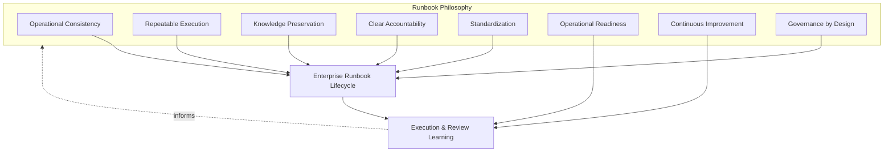
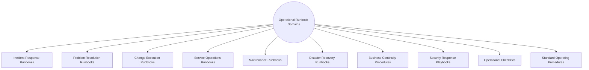
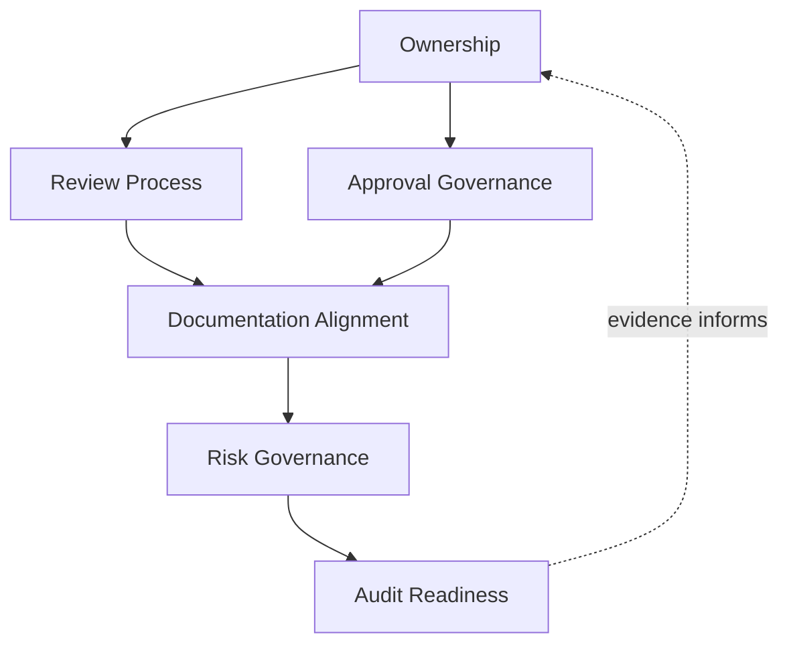
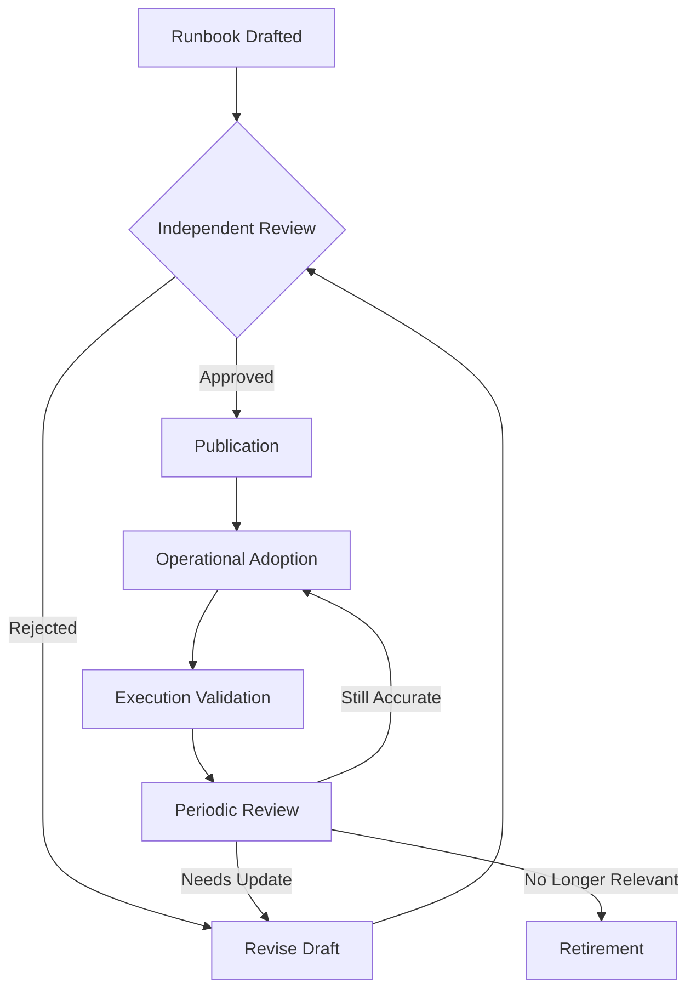
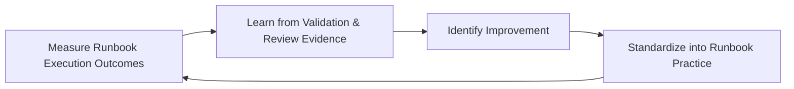

# Enterprise Operational Runbooks & Standard Operating Procedures Strategy

## 1. Document Purpose

This document defines the official Enterprise Operational Runbooks & Standard Operating Procedures (SOP) Strategy for **StackLeo Tech Store**. It establishes how operational execution knowledge is captured, governed, and sustained as a durable organizational asset — independent of any specific runbook automation tool, documentation platform, or workflow system.

- **Purpose of Operational Runbooks** — runbooks and SOPs exist to convert operational execution knowledge from something a few individuals happen to know into something the whole organization can reliably act on, ensuring routine and non-routine operational tasks are performed consistently regardless of who performs them.
- **Relationship with Operations** — this document elaborates Standard Operating Procedures as introduced in `operations-overview.md` (Section 3.6, Reliability Operations); it defines specifically how that procedural knowledge is created, governed, and kept current.
- **Relationship with Incident Management** — Incident Response Runbooks (Section 4.1) provide the pre-prepared execution guidance that `incident-management.md` response coordination depends on to act quickly and consistently rather than improvising under pressure.
- **Relationship with Problem Management** — Known Errors identified in `problem-management.md` (Section 3.6) commonly depend on documented workaround procedures, which this document governs as a runbook category in their own right.
- **Relationship with Change Management** — Change Execution Runbooks (Section 4.3) provide the prepared implementation guidance that Change Implementation Oversight in `change-management.md` (Section 3.9) depends on for safe, repeatable execution.
- **Relationship with Business Continuity** — Disaster Recovery Runbooks and Business Continuity Procedures (Sections 4.6–4.7) are the operational execution layer of the plans defined in `06_Security/disaster-recovery.md` and `06_Security/business-continuity.md`; a continuity plan that exists only as prose intent, without an executable runbook, is not genuinely actionable.
- **Relationship with Knowledge Management** — this document is the most operationally concrete expression of Knowledge Management as introduced in `service-management.md` (Section 4.8); runbooks are knowledge deliberately shaped for the specific purpose of being executed under real operational conditions.

This document is implementation-independent and vendor-neutral. It defines runbook philosophy, lifecycle, domains, and governance conceptually — not specific runbook automation tools, documentation platforms, workflow systems, automation scripts, or infrastructure configuration.

## 2. Runbook Philosophy

Runbook and SOP governance at StackLeo is built on eight principles. Each exists to produce a specific business outcome — runbooks are governed deliberately because of the consistency and resilience they protect, not as documentation for its own sake.

### 2.1 Operational Consistency

The same operational task is performed the same way regardless of who performs it or when, consistent with Operational Excellence in `operations-overview.md` (Section 2.1).

- **Business Value** — produces predictable outcomes at scale, where reliance on individual judgment alone eventually fails to keep pace with growth and team turnover.

### 2.2 Repeatable Execution

A runbook can be followed successfully by anyone with appropriate role access, not only by the person who originally wrote it or has performed the task before.

- **Business Value** — reduces the organization's exposure to any single individual's availability, memory, or continued employment.

### 2.3 Knowledge Preservation

Operational execution knowledge is captured deliberately and durably, consistent with Knowledge Preservation in `service-management.md` (Section 3.7).

- **Business Value** — prevents institutional knowledge about how to safely perform a critical task from being lost when a team member leaves or a service changes hands.

### 2.4 Clear Accountability

Every runbook has a single, named accountable owner responsible for its accuracy and currency.

- **Business Value** — prevents the anti-pattern in Section 10.3, where a runbook silently drifts out of date because no one is specifically responsible for maintaining it.

### 2.5 Standardization

Runbooks and SOPs are structured consistently, regardless of which team or domain (Section 4) they belong to.

- **Business Value** — makes runbooks genuinely usable under pressure, since responders do not need to learn a new format for every different procedure they encounter.

### 2.6 Operational Readiness

A runbook exists and is validated before it is needed, consistent with Operational Readiness in `operations-overview.md` (Section 4.3), not authored reactively during the event it should have prepared for.

- **Business Value** — ensures the organization is genuinely prepared for foreseeable operational scenarios, rather than discovering gaps in the moment they matter most.

### 2.7 Continuous Improvement

Runbook practice matures over time, informed by real execution experience and what post-incident or post-change review reveals about a runbook's adequacy.

- **Business Value** — keeps runbooks genuinely useful rather than becoming stale artifacts that no longer reflect how the platform actually behaves.

### 2.8 Governance by Design

Runbook governance is established deliberately as operational procedures are created, consistent with Governance by Design in `service-management.md` (Section 2.7), not retrofitted once a missing or outdated runbook has already caused a delayed response.

- **Business Value** — prevents the costly rework and risk of discovering governance gaps only during a live operational event.

*Diagram 1: Runbook Philosophy Overview — the eight principles shape the enterprise runbook lifecycle, and execution and review learning feed back into the philosophy itself.*

## 3. Enterprise Runbook Lifecycle

Runbook governance spans ten conceptual stages, from initial identification through retirement and knowledge preservation.

### 3.1 Runbook Identification

- **Purpose** — recognize that a recurring or foreseeable operational task warrants a formal, documented procedure.
- **Business Value** — ensures procedural documentation is created deliberately for genuinely significant tasks, not left to chance.
- **Governance Objectives** — require identification to consider evidence from incident history (`incident-management.md`), Known Errors (`problem-management.md`), and planned change (`change-management.md`).

### 3.2 Runbook Design

- **Purpose** — structure the identified procedure into clear, executable steps.
- **Business Value** — converts tacit, individual knowledge into an explicit, shareable asset.
- **Governance Objectives** — require design to follow the standardized structure defined in Section 5.

### 3.3 Review & Approval

- **Purpose** — confirm the designed runbook is accurate, complete, and safe to rely on before it is published.
- **Business Value** — prevents an unreviewed, potentially incorrect procedure from being trusted during a real operational event.
- **Governance Objectives** — require review by someone other than the runbook's author, consistent with independent validation practice used throughout this repository.

### 3.4 Publication

- **Purpose** — make the approved runbook available to those who need to execute it.
- **Business Value** — ensures a validated procedure actually reaches its intended users, rather than remaining unused despite existing.
- **Governance Objectives** — require published runbooks to be accessible to all relevant roles, consistent with Accessibility (Section 5.5).

### 3.5 Operational Adoption

- **Purpose** — establish the runbook as the expected, default way the covered task is performed going forward.
- **Business Value** — converts a documented procedure into genuine, lived operational practice, not merely a reference that exists but is ignored.
- **Governance Objectives** — require teams responsible for the covered task to be explicitly informed of the runbook's adoption.

### 3.6 Execution Validation

- **Purpose** — confirm the runbook genuinely works as intended when actually executed, whether during a real event or a deliberate exercise.
- **Business Value** — catches gaps between documented intent and actual operational reality before they matter during a genuine crisis.
- **Governance Objectives** — require execution outcomes to be recorded and connected to Periodic Review (Section 3.7).

### 3.7 Periodic Review

- **Purpose** — formally reassess whether a runbook remains accurate and adequate on a recurring basis.
- **Business Value** — prevents runbooks from silently drifting out of date as the platform and its operational context evolve.
- **Governance Objectives** — require review to occur on a predictable, regular cadence, not only when a problem is discovered.

### 3.8 Continuous Improvement

- **Purpose** — act on execution validation and periodic review findings to improve the runbook.
- **Business Value** — ensures runbooks improve over time based on genuine operational experience rather than remaining static once published.
- **Governance Objectives** — require improvement actions arising from review to be documented and tracked to completion.

### 3.9 Retirement

- **Purpose** — formally withdraw a runbook once its covered task, service, or scenario no longer exists.
- **Business Value** — prevents a stale, no-longer-relevant procedure from being mistakenly followed.
- **Governance Objectives** — require retirement to be an explicit, recorded decision, never a runbook simply left forgotten.

### 3.10 Knowledge Preservation

- **Purpose** — retain relevant knowledge from a retired runbook for historical and architectural reference.
- **Business Value** — preserves institutional understanding of how operational practice evolved, even after a specific procedure is no longer active.
- **Governance Objectives** — connect retained knowledge to Knowledge Management in `service-management.md` (Section 4.8).

### Enterprise Runbook Lifecycle Matrix

| Stage | Purpose | Business Value | Governance Objective |
|---|---|---|---|
| Runbook Identification | Recognize a task warranting a formal procedure | Ensures documentation is created deliberately, not by chance | Considers evidence from incident, problem, and change history |
| Runbook Design | Structure the procedure into executable steps | Converts tacit knowledge into an explicit, shareable asset | Follows the standardized structure |
| Review & Approval | Confirm accuracy and completeness before publication | Prevents an unreviewed procedure from being trusted | Reviewed by someone other than the author |
| Publication | Make the approved runbook available to users | Ensures a validated procedure actually reaches its audience | Accessible to all relevant roles |
| Operational Adoption | Establish the runbook as the expected default practice | Converts documentation into genuine, lived practice | Responsible teams explicitly informed of adoption |
| Execution Validation | Confirm the runbook works when actually executed | Catches gaps between intent and reality before they matter | Outcomes recorded and connected to periodic review |
| Periodic Review | Formally reassess accuracy and adequacy | Prevents silent drift out of date | Regular, predictable cadence, not only reactive |
| Continuous Improvement | Act on findings to improve the runbook | Runbooks improve based on genuine experience | Improvement actions documented and tracked |
| Retirement | Formally withdraw a no-longer-relevant runbook | Prevents a stale procedure from being mistakenly followed | An explicit, recorded decision, never forgotten |
| Knowledge Preservation | Retain knowledge from a retired runbook | Preserves institutional understanding over time | Connected to knowledge management practice |

*Diagram 2: Enterprise Runbook Lifecycle — a continuous cycle in which retirement and knowledge preservation directly inform the next iteration of runbook identification.*

## 4. Operational Runbook Domains

Runbooks and SOPs span ten conceptual domains, each covering a distinct category of operational execution knowledge.

### 4.1 Incident Response Runbooks

- **Purpose** — provide prepared execution guidance for responding to known incident categories, per `incident-management.md`.
- **Scope** — response procedures for the incident domains defined in `incident-management.md` (Section 4).
- **Governance Expectations** — prioritized for the highest-criticality services in `service-catalog.md`.
- **Business Importance** — allows the organization to act quickly and consistently under pressure rather than improvising during a live incident.

### 4.2 Problem Resolution Runbooks

- **Purpose** — provide guidance for investigating and resolving recurring problem categories, per `problem-management.md`.
- **Scope** — includes Known Error workaround procedures identified in Problem Management (Section 3.6 of that document).
- **Governance Expectations** — kept synchronized with the Known Error record it supports.
- **Business Importance** — allows a recurring, understood issue to be managed consistently while permanent resolution is pursued.

### 4.3 Change Execution Runbooks

- **Purpose** — provide prepared implementation guidance for executing an approved change, per `change-management.md`.
- **Scope** — implementation steps, including rollback considerations, for changes following the lifecycle in `change-management.md` (Section 3).
- **Governance Expectations** — required for changes classified above a defined risk level in `change-management.md` (Section 3.4).
- **Business Importance** — reduces the risk of implementation error during exactly the moment a service is most exposed to disruption.

### 4.4 Service Operations Runbooks

- **Purpose** — provide guidance for the routine, day-to-day operation of a specific service in `service-catalog.md`.
- **Scope** — ordinary operational tasks that are not incidents, problems, or changes, but still benefit from consistent execution.
- **Governance Expectations** — owned by the same Service Owner accountable for the service itself.
- **Business Importance** — protects the quality of everyday operation, which happens far more often than any exceptional event.

### 4.5 Maintenance Runbooks

- **Purpose** — provide guidance for planned, routine maintenance activity.
- **Scope** — scheduled tasks required to sustain a service or platform component's ongoing health.
- **Governance Expectations** — scheduled and tracked consistently, not performed only when someone happens to remember.
- **Business Importance** — prevents the gradual degradation that results from maintenance being informally deferred indefinitely.

### 4.6 Disaster Recovery Runbooks

- **Purpose** — provide the executable procedures for the recovery plans defined in `06_Security/disaster-recovery.md`.
- **Scope** — step-by-step recovery execution guidance, distinct from the recovery strategy and objectives themselves.
- **Governance Expectations** — validated through periodic exercises, consistent with Execution Validation (Section 3.6), not assumed workable from design alone.
- **Business Importance** — determines whether a disaster recovery plan is genuinely actionable or merely a well-intentioned document.

### 4.7 Business Continuity Procedures

- **Purpose** — provide the executable procedures for the continuity plans defined in `06_Security/business-continuity.md`.
- **Scope** — organizational, not only technical, continuity actions — communication, decision escalation, alternate operating procedures.
- **Governance Expectations** — reviewed jointly with Business stakeholders, given their organization-wide, not purely technical, scope.
- **Business Importance** — determines whether the business can genuinely continue operating through significant disruption, consistent with ISO 22301 thinking.

### 4.8 Security Response Playbooks

- **Purpose** — provide prepared execution guidance for responding to security-relevant events, jointly with `06_Security/incident-response.md`.
- **Scope** — security-specific response procedures, governed with the confidentiality appropriate to their content.
- **Governance Expectations** — reviewed and approved by Security leadership, never published or adopted without their explicit involvement.
- **Business Importance** — protects StackLeo's core trust differentiator by ensuring security response is consistent, not improvised.

### 4.9 Operational Checklists

- **Purpose** — provide short, focused verification lists for tasks requiring confirmation of multiple discrete conditions.
- **Scope** — pre-flight and post-action verification for tasks such as readiness confirmation, distinct from longer procedural runbooks.
- **Governance Expectations** — kept concise and genuinely usable in the moment, not allowed to grow into an unwieldy, unused document.
- **Business Importance** — catches the specific, foreseeable oversights that longer-form documentation is poorly suited to prevent.

### 4.10 Standard Operating Procedures (SOPs)

- **Purpose** — provide the broadest category of documented, standardized operational procedure, encompassing routine organizational and operational tasks not covered by the more specific domains above.
- **Scope** — general operational practice, per Standard Operating Procedures introduced in `operations-overview.md` (Section 3.6).
- **Governance Expectations** — governed under the same lifecycle (Section 3) as every other domain in this section, without exception.
- **Business Importance** — provides the baseline operational consistency this entire strategy exists to establish.

### Operational Runbook Domain Matrix

| Domain | Purpose | Governance Expectations | Business Importance |
|---|---|---|---|
| Incident Response Runbooks | Prepared guidance for known incident categories | Prioritized for highest-criticality services | Enables quick, consistent action under pressure |
| Problem Resolution Runbooks | Guidance for investigating and resolving recurring problems | Kept synchronized with the Known Error record | Manages understood issues consistently pending resolution |
| Change Execution Runbooks | Prepared implementation guidance for approved changes | Required above a defined change risk level | Reduces implementation error during peak exposure |
| Service Operations Runbooks | Guidance for routine, day-to-day service operation | Owned by the accountable Service Owner | Protects quality of everyday operation |
| Maintenance Runbooks | Guidance for planned, routine maintenance | Scheduled and tracked consistently | Prevents gradual degradation from deferred maintenance |
| Disaster Recovery Runbooks | Executable procedures for recovery plans | Validated through periodic exercises | Determines whether recovery plans are genuinely actionable |
| Business Continuity Procedures | Executable procedures for continuity plans | Reviewed jointly with Business stakeholders | Determines genuine ability to continue through disruption |
| Security Response Playbooks | Prepared guidance for security-relevant events | Reviewed and approved by Security leadership | Ensures consistent, not improvised, security response |
| Operational Checklists | Short verification lists for discrete conditions | Kept concise and genuinely usable in the moment | Catches specific, foreseeable oversights |
| Standard Operating Procedures | Broadest category of standardized operational procedure | Governed under the same lifecycle as every other domain | Provides the baseline operational consistency |

*Diagram 3: Operational Runbook Classification Model — ten domains spanning reactive response, routine operation, and continuity procedures, each governed under the same overall lifecycle.*

## 5. Runbook Governance Principles

- **Ownership** — every runbook has a single, named accountable owner, consistent with Clear Accountability (Section 2.4).
- **Accuracy** — runbooks genuinely reflect current platform and operational reality, verified through Execution Validation (Section 3.6).
- **Version Control** — changes to a runbook are tracked over time, allowing its history and evolution to be understood.
- **Review Discipline** — runbooks are reviewed on a predictable cadence, consistent with Periodic Review (Section 3.7), not only when a gap has already caused a problem.
- **Accessibility** — runbooks are readily available to everyone with a legitimate need to execute them, consistent with Publication (Section 3.4).
- **Auditability** — runbook approval, execution history, and review outcomes can be independently reviewed after the fact.
- **Operational Readiness** — runbooks exist and are validated in advance of the scenarios they address, never authored reactively during the event itself.
- **Continuous Improvement** — runbook governance itself matures over time, informed by real execution and review experience.

### Runbook Governance Principle Matrix

| Principle | Description | Business Value |
|---|---|---|
| Ownership | Every runbook has a single, named accountable owner | Ensures accuracy has a specific, responsible party |
| Accuracy | Runbooks genuinely reflect current reality | Keeps execution guidance trustworthy under real conditions |
| Version Control | Changes tracked over time | Allows history and evolution of a procedure to be understood |
| Review Discipline | Reviewed on a predictable cadence | Prevents runbooks from silently drifting out of date |
| Accessibility | Readily available to everyone with legitimate need | Ensures validated guidance actually reaches its intended users |
| Auditability | Approval and execution history independently reviewable | Supports accountability and confidence for partners and regulators |
| Operational Readiness | Exist and validated in advance of need | Ensures genuine preparedness, not reactive authoring under pressure |
| Continuous Improvement | Governance matures from real execution experience | Keeps runbooks aligned with organizational and platform growth |

## 6. Runbook Governance

### 6.1 Ownership

Every runbook domain (Section 4) has a designated accountable review authority; overall runbook governance is owned jointly by Operations and SRE leadership, consistent with Clear Accountability (Section 2.4).

### 6.2 Review Process

Individual runbooks are formally reviewed against Periodic Review (Section 3.7) on a recurring basis, ensuring accuracy confirmation is a deliberate governance act.

### 6.3 Approval Governance

New and materially updated runbooks proceed through Review & Approval (Section 3.3) before publication, with approval authority proportionate to the runbook's operational significance.

### 6.4 Documentation Alignment

Runbook documentation is kept consistent with `incident-management.md`, `problem-management.md`, `change-management.md`, and `06_Security/business-continuity.md`; a runbook that contradicts current incident, problem, or continuity documentation is treated as a governance gap.

### 6.5 Risk Governance

Runbook-related risk — missing coverage for a foreseeable scenario, unvalidated disaster recovery procedures, stale change execution guidance — is tracked, prioritized, and escalated consistently, ensuring accepted risk is always a deliberate, accountable decision.

### 6.6 Audit Readiness

Runbook approvals, execution history, and review outcomes are retained in a form that can be independently reviewed after the fact, supporting internal governance and partner or regulatory review where relevant.

### Runbook Governance Matrix

| Governance Area | Objective |
|---|---|
| Ownership | Every runbook domain has a designated accountable review authority |
| Review Process | Accuracy confirmation is a deliberate, recurring governance act |
| Approval Governance | New/updated runbooks approved proportionate to operational significance |
| Documentation Alignment | Runbooks stay consistent with incident, problem, change, and continuity documentation |
| Risk Governance | Accepted runbook-related risk is always a deliberate, accountable decision |
| Audit Readiness | Approvals, execution history, and outcomes retained for independent review |

*Diagram 4: Runbook Governance Framework — ownership anchors review and approval activity, which feeds documentation alignment, risk governance, and ultimately auditable evidence.*

*Diagram 5: Runbook Review & Approval Flow — a runbook proceeds through independent review before publication, and periodic review determines whether it continues in active use, requires revision, or is retired.*

### Governance Responsibility Matrix

| Role | Responsibility |
|---|---|
| COO / Operations Lead | Owns coherence and enforcement of this runbook strategy, in partnership with SRE and Security leadership. |
| Runbook Owner | Owns an individual runbook's accuracy, currency, and periodic review. |
| Service Owners | Own Service Operations Runbooks (Section 4.4) for their respective services. |
| SRE Lead | Owns Disaster Recovery Runbook validation (Section 4.6) jointly with `06_Security/disaster-recovery.md`. |
| Security Lead | Owns Security Response Playbooks (Section 4.8) jointly with `06_Security/incident-response.md`. |
| Change Manager | Ensures Change Execution Runbooks (Section 4.3) exist for changes above a defined risk level. |
| Business Continuity Lead | Owns Business Continuity Procedures (Section 4.7) jointly with Business stakeholders. |
| Internal Audit / Review Function | Independently verifies that runbook governance records reflect actual practice. |

## 7. Future Readiness

This strategy is designed to remain valid as StackLeo evolves in scale and architectural complexity, without requiring redefinition of its underlying philosophy.

- **Cloud-Native Platforms** — runbook domains (Section 4) are defined independently of any specific runtime or deployment model, so they apply unchanged as infrastructure evolves.
- **AI-Assisted Operations** — where AI-assisted techniques support runbook execution guidance or suggest relevant procedures during an event, they operate within the same Accuracy and Operational Readiness principles (Section 5) as any other runbook practice, never replacing accountable human judgment for significant actions.
- **Marketplace Platform** — the multi-vendor marketplace model extends Service Operations and Change Execution Runbooks (Sections 4.4, 4.3) to cover seller-facing services and marketplace-specific change scenarios.
- **Multi-Tenant Architecture** — where future architecture introduces tenant isolation, Incident Response and Disaster Recovery Runbooks (Sections 4.1, 4.6) extend to address cross-tenant scenarios explicitly.
- **Continuous Delivery** — as delivery cadence accelerates per `07_DEVOPS/ci-cd-strategy.md`, Change Execution Runbooks (Section 4.3) evolve toward lighter-weight, more frequently used guidance for the growing proportion of Standard Changes.
- **Multi-Region Operations** — as StackLeo expands from Bangladesh into South Asia and beyond, Business Continuity Procedures and Disaster Recovery Runbooks (Sections 4.7, 4.6) extend to cover region-specific continuity scenarios.
- **Global Engineering Organizations** — the lifecycle, domains, and governance defined in Sections 3–6 are defined independently of team size, location, or organizational structure, so they remain coherent as operations scale across geographies, including "follow-the-sun" execution models.
- **Enterprise Scale** — the Operational Runbook Domain set (Section 4) is structured to extend to additional domains and a growing volume of individual runbooks without requiring the underlying lifecycle to be redesigned.

## 8. Governance

- **Ownership** — the Operations lead (or equivalent COO-accountable function) owns this strategy and is accountable for its consistent application across the platform, in partnership with SRE and Security leadership.
- **Review Process** — this strategy is formally reviewed whenever a material change occurs in architecture (`03_System_Design`), incident or problem management practice (`incident-management.md`, `problem-management.md`), or continuity planning (`06_Security/business-continuity.md`), and on a regular recurring cadence independent of specific change events.
- **Runbook Policies** — subordinate, practice-specific runbook documents (individual procedures, checklists) must remain consistent with the philosophy, lifecycle, and domains defined here.
- **Operational Readiness** — runbook coverage for foreseeable operational scenarios is maintained as a continuously sustained state, consistent with `operations-overview.md` (Section 4.3), never assembled only after a gap has already caused a delayed response.
- **Audit Readiness** — this strategy and the evidence it requires (Section 6.6) are maintained in a state ready for internal or external audit at any time, without requiring advance preparation.
- **Continuous Improvement** — this strategy itself is subject to Continuous Improvement (Section 2.7, Section 3.8); its effectiveness is periodically assessed and revised based on genuine execution and review evidence.

*Diagram 6: Continuous Runbook Improvement Cycle — execution outcomes are measured, learned from, improved upon, and standardized back into practice, on a continuing basis.*

## 9. Runbook Maturity Model

Runbook maturity is described across five conceptual levels, adapted from established process maturity thinking. Progression reflects increasing consistency, measurement, and deliberate improvement — not merely increasing document volume.

- **Initial** — operational execution knowledge exists primarily as tribal knowledge, held informally by individuals; documented runbooks, where they exist, are inconsistent and often outdated.
- **Managed** — basic runbooks exist for individual significant scenarios, but coverage and consistency across domains (Section 4) vary significantly.
- **Defined** — runbook creation, review, and governance are standardized, documented, and consistently applied across the organization, consistent with the lifecycle and domains defined throughout this document; ownership is clear organization-wide.
- **Measured** — runbook effectiveness is measured systematically — execution success rate, time to locate the correct procedure — and decisions are grounded in genuine performance data rather than qualitative impression alone.
- **Optimizing** — runbook practice is continuously and deliberately improved based on quantitative evidence and organizational learning; improvement itself is a managed, ongoing discipline rather than an occasional initiative.

### Runbook Maturity Model Matrix

| Level | Characteristics | Primary Focus |
|---|---|---|
| Initial | Tribal knowledge held informally; documented runbooks inconsistent or outdated | Ad hoc, individually-dependent execution |
| Managed | Basic runbooks exist per significant scenario; consistency varies | Scenario-level consistency |
| Defined | Standardized, documented creation and governance applied organization-wide | Organization-wide consistency and clear ownership |
| Measured | Effectiveness measured systematically against defined expectations | Evidence-based runbook management decisions |
| Optimizing | Practice continuously and deliberately improved from evidence | Sustained, deliberate improvement as a discipline |

*Diagram 6b: Runbook Maturity Progression Model — maturity advances from informal, individually-held tribal knowledge toward standardized, measured, and continuously optimized runbook practice.*

## 10. Anti-Patterns

The following recurring failure patterns are explicitly recognized and avoided, as each one structurally undermines this strategy.

| Anti-Pattern | Why It's Avoided |
|---|---|
| Tribal Knowledge | Contradicts Repeatable Execution (Section 2.2); knowledge held only in individual memory cannot be reliably executed by anyone else, and is lost entirely if that individual becomes unavailable. |
| Outdated Runbooks | Contradicts Periodic Review (Section 3.7) and Accuracy (Section 5.2); a runbook that no longer reflects reality can actively mislead a responder during a genuine event, which is worse than having no runbook at all. |
| Missing Ownership | Contradicts Clear Accountability (Section 2.4); a runbook without a named owner has no one specifically responsible for keeping it accurate over time. |
| Inconsistent Procedures | Contradicts Standardization (Section 2.5); runbooks that vary in structure and quality across teams are harder to trust and use effectively under pressure. |
| Poor Documentation | Undermines Documentation Alignment (Section 6.4), leaving runbooks disconnected from the incident, problem, or continuity context they are meant to support. |
| Weak Governance | Undermines Section 6.1; without clear ownership and review, runbook quality and coverage drift into inconsistency as the platform and organization grow. |
| Lack of Validation | Contradicts Execution Validation (Section 3.6); a runbook never actually tested may fail precisely when it is needed most, since documented intent does not guarantee real-world accuracy. |
| Missing Continuous Improvement | Contradicts Continuous Improvement (Section 2.7, Section 3.8); without deliberate improvement, runbook quality stagnates as the platform grows in complexity. |

## 11. Document Information

| Property | Value |
|----------|-------|
| Document | operational-runbooks.md |
| Version | 1.0.0 |
| Status | Active |
| Maintained By | StackLeo |
| Last Updated | 2026-07-24 |

---

© StackLeo. All Rights Reserved.
