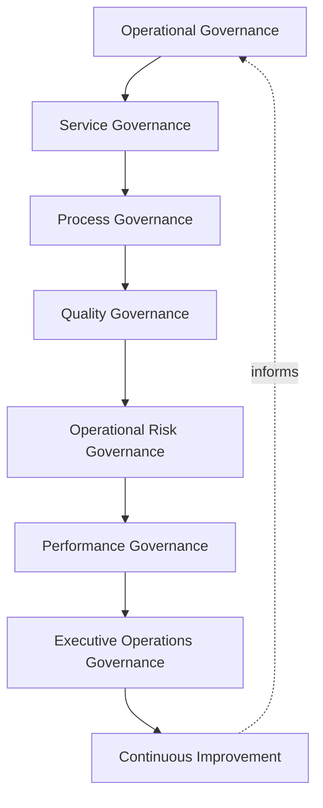
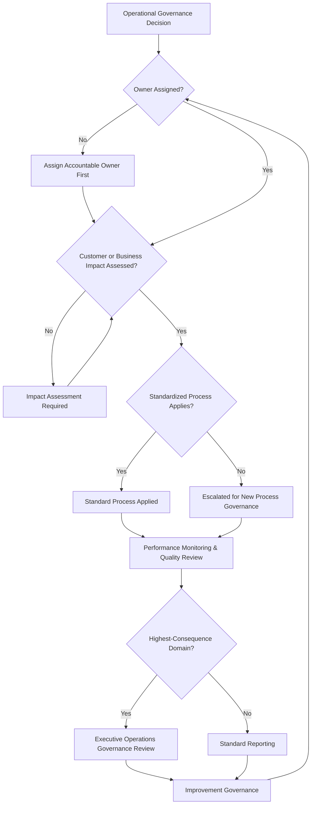
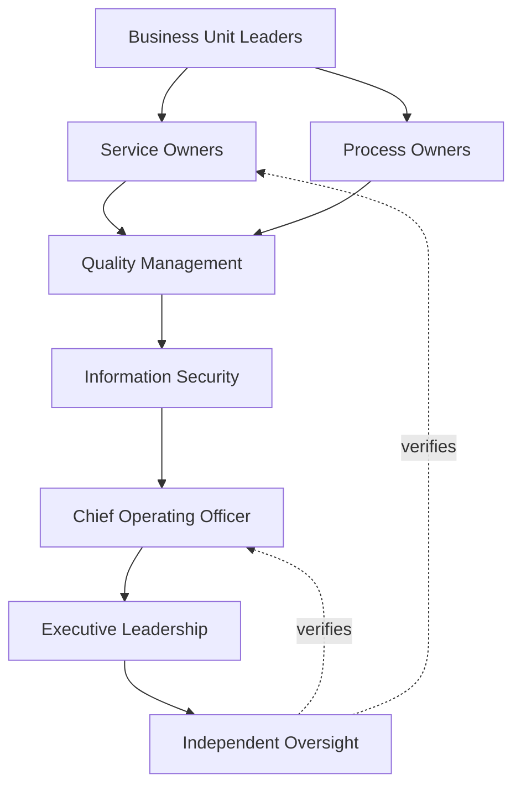
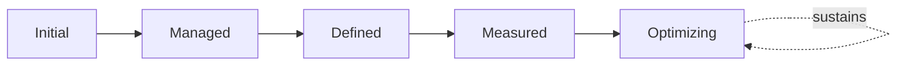

# Enterprise Operations Governance Strategy

## 1. Document Purpose

This document defines the official Enterprise Operations Governance Strategy for **StackLeo Tech Store** — the COO/CIO-owned executive charter under which operational excellence, service delivery, and day-to-day business execution are governed as a deliberate, accountable discipline. It establishes governance for operational excellence, service management, process governance, organizational accountability, executive oversight, operational resilience, and long-term operational maturity, consistent with ITIL 4, ISO/IEC 20000, ISO 9001, COBIT governance principles, and TOGAF enterprise architecture thinking.

`operations-governance.md` remains the master operational governance framework for `09_OPERATIONS` — the document that holds every subordinate operations strategy together as a coherent, accountable whole. This document sits above it as the highest-level executive mandate, consistent with the executive-charter relationship `enterprise-risk-management-strategy.md` holds over `risk-management.md`: it does not restate operational structure, it establishes the philosophy, organizational ownership, and executive expectations that give operational practice its authority and continuity at the level of the Board and executive leadership.

- **Purpose of Operations Governance** — to ensure operational decisions across the platform — what is prioritized, who is accountable, what service level is genuinely delivered — are made deliberately, by accountable people, against a consistent set of principles, never left to accumulate as ad hoc, undocumented judgment calls.
- **Relationship with Enterprise Strategy** — this strategy ensures the day-to-day running of the platform remains a deliberate expression of `01_Business/business-model.md` and `01_Business/vision.md`, never an activity that has drifted apart from genuine business intent over time.
- **Relationship with Service Management** — `service-management.md`, `service-catalog.md`, and `service-level-management.md` elaborate the specific services StackLeo delivers and the levels at which they are delivered; this strategy establishes the governance philosophy and accountability structure those service management practices operate within.
- **Relationship with Business Continuity** — `business-continuity-governance.md` governs how operations continue through disruption; this strategy governs how operations are run deliberately under normal conditions, the baseline continuity is measured against.
- **Relationship with Risk Management** — operational risk surfaced across every subordinate operations strategy — change, configuration, availability, capacity — rolls up into `enterprise-risk-management-strategy.md` (Section 3.2, Operational Risk Governance), ensuring operational risk decisions have a clear, traceable owner.
- **Relationship with Information Security** — this strategy coordinates with, but does not replace, the protection principles established in `06_Security/security-governance.md`; it is the governance layer specifically accountable for day-to-day operational execution, distinct from the governance layer accountable for protection.
- **Relationship with Executive Decision-Making** — this strategy exists to give executive leadership genuine confidence that the organization's daily operation is deliberately governed, a confidence every growth and investment decision implicitly depends on.

This document is implementation-independent and vendor-neutral. It defines operations governance philosophy, model, domains, and lifecycle conceptually — not specific ITSM platforms, service desk software, workflow automation tools, cloud providers, monitoring platforms, consulting firms, operational products, operational workflows, SOPs, service desk configurations, infrastructure configurations, deployment architectures, implementation roadmaps, process execution procedures, or code.

## 2. Operations Governance Philosophy

Operations governance at StackLeo rests on eight principles. Each exists to produce a specific business outcome — operations are governed deliberately because the daily running of the business is where every strategic decision either is, or is not, actually realized.

### 2.1 Operational Excellence as a Strategic Capability

Operational excellence is treated as a genuine strategic capability, not a routine, background activity beneath executive attention.

- **Business Value** — ensures operational investment receives priority proportionate to its genuine contribution to business success.

### 2.2 Governance Before Operations

The governance structure — who decides, who owns, who is accountable — is established before specific operational processes are executed.

- **Business Value** — ensures operational activity occurs within a deliberate, accountable structure, not as ad hoc, individually improvised practice.

### 2.3 Customer-Centric Service Delivery

Every operational decision is evaluated for its genuine effect on the customer's experience, consistent with StackLeo's B2C foundation.

- **Business Value** — ensures operational excellence translates into genuine customer value, not merely internal efficiency.

### 2.4 Accountability

Every operational governance decision traces to a specific, named, responsible party.

- **Business Value** — ensures every operational domain has someone genuinely responsible for its outcomes.

### 2.5 Standardization

Comparable operational processes are governed consistently across the organization, never left to diverge based on which team happens to run them.

- **Business Value** — ensures operational quality is predictable regardless of which part of the organization delivers it.

### 2.6 Continuous Improvement

Operations governance practice matures over time, informed by real operational findings, incidents, and the organization's growth in scale and complexity.

- **Business Value** — keeps operations governance aligned with StackLeo's growth in scale, market reach, and business model complexity.

### 2.7 Organizational Agility

Operational governance is structured to adapt to genuinely new business needs, never so rigid that it obstructs legitimate operational evolution.

- **Business Value** — allows the organization to respond to genuine change without abandoning governance discipline in the process.

### 2.8 Business Alignment

Operations governance decisions are made in service of genuine business need, never imposed as friction disconnected from real operational purpose.

- **Business Value** — keeps operations governance genuinely followed rather than resented as bureaucratic overhead.

## 3. Enterprise Operations Governance Model

Operations governance operates across eight conceptual layers, each holding accountability for a distinct dimension of operational practice. Every layer here is elaborated in full operational depth in `operations-governance.md`.

### 3.1 Operational Governance

- **Purpose** — own the overall coherence of how day-to-day business operation is governed.
- **Governance Scope** — oversight spanning every layer in this model and every domain in Section 4.
- **Business Value** — ensures operational governance operates as a single coherent discipline, not a collection of disconnected local practices.
- **Executive Expectations** — leadership trusts no operational domain exists outside this framework's visibility.

### 3.2 Service Governance

- **Purpose** — own the coherence of how services delivered to customers and internal stakeholders are defined and governed.
- **Governance Scope** — oversight of Service Delivery Governance (Section 5.3), coordinated with `service-management.md` and `service-catalog.md`.
- **Business Value** — ensures services are delivered deliberately at a defined level, not an ad hoc, best-effort basis.
- **Executive Expectations** — leadership trusts service levels are defined, tracked, and genuinely met.

### 3.3 Process Governance

- **Purpose** — own the coherence of how operational processes are defined, standardized, and governed.
- **Governance Scope** — oversight of Process Governance (Section 5.2), consistent with Standardization (Section 2.5).
- **Business Value** — ensures comparable processes are executed consistently across the organization.
- **Executive Expectations** — leadership trusts processes are documented and consistently applied, not individually reinvented.

### 3.4 Quality Governance

- **Purpose** — own the coherence of how operational quality is defined, measured, and improved.
- **Governance Scope** — oversight of Quality Review (Section 5.5), coordinated with `08_QUALITY_ASSURANCE/qa-governance.md`.
- **Business Value** — ensures operational output meets a defined, verifiable standard.
- **Executive Expectations** — leadership expects quality issues to be identified and remediated, not left to accumulate silently.

### 3.5 Operational Risk Governance

- **Purpose** — own the coherence of how risk to day-to-day operation is identified and governed.
- **Governance Scope** — oversight of operational risk across every domain in Section 4, coordinated with `enterprise-risk-management-strategy.md` (Section 3.2).
- **Business Value** — protects the operational reliability customers directly experience.
- **Executive Expectations** — leadership trusts operational risk is monitored continuously, not only after disruption.

### 3.6 Performance Governance

- **Purpose** — own the coherence of how operational performance is measured against defined expectations.
- **Governance Scope** — oversight of Performance Monitoring (Section 5.4), coordinated with `operations-metrics-kpis.md`.
- **Business Value** — ensures operational performance is genuinely evidenced, not assumed adequate.
- **Executive Expectations** — leadership trusts performance is measured consistently and reported transparently.

### 3.7 Executive Operations Governance

- **Purpose** — own executive-level accountability for the operational decisions carrying the greatest organizational consequence.
- **Governance Scope** — oversight spanning Sections 3.1–3.6 wherever an operational matter rises to genuine executive concern.
- **Business Value** — ensures the most consequential operational issues are visible at the level accountable for the organization as a whole.
- **Executive Expectations** — leadership expects to be informed of, not surprised by, the platform's highest-risk operational issues.

### 3.8 Continuous Improvement

- **Purpose** — govern the mechanism by which every other layer in this model matures over time.
- **Governance Scope** — consolidates findings from operational reviews, incidents, and audits across every domain in Section 4.
- **Business Value** — prevents operations governance itself from becoming the next thing that quietly stagnates as the organization scales.
- **Executive Expectations** — leadership expects operational maturity to be assessed periodically, not assumed static once established.

### Enterprise Operations Governance Matrix

| Layer | Purpose | Business Value | Executive Expectations |
|---|---|---|---|
| Operational Governance | Own overall coherence of day-to-day operation | Ensures governance operates as a single coherent discipline | Trusts no domain exists outside this framework's visibility |
| Service Governance | Own coherence of how delivered services are defined | Ensures services delivered deliberately at a defined level | Trusts service levels are defined, tracked, genuinely met |
| Process Governance | Own coherence of how processes are standardized | Ensures comparable processes executed consistently | Trusts processes documented and consistently applied |
| Quality Governance | Own coherence of how operational quality is measured | Ensures output meets a defined, verifiable standard | Expects quality issues identified and remediated, not accumulating |
| Operational Risk Governance | Own coherence of risk to day-to-day operation | Protects operational reliability customers experience | Trusts risk monitored continuously, not only after disruption |
| Performance Governance | Own coherence of measuring performance against expectations | Ensures performance is genuinely evidenced, not assumed | Trusts performance measured consistently, reported transparently |
| Executive Operations Governance | Own executive accountability for highest-consequence decisions | Ensures the most consequential issues visible to leadership | Expects leadership informed of, not surprised by, top issues |
| Continuous Improvement | Govern maturation of every other layer | Prevents governance itself from stagnating | Expects maturity to be assessed periodically |

*Diagram 1: Enterprise Operations Governance Framework — operational governance establishes the foundation, service, process, and quality governance sustain delivery consistency, risk and performance governance provide evidence-based assurance, and executive oversight converges on continuous improvement that feeds back into the model.*

## 4. Enterprise Operations Domains

Operations are governed across ten conceptual domains, each requiring a distinct governance emphasis.

### 4.1 Customer Operations

- **Purpose** — govern the operational functions directly delivering the customer shopping experience.
- **Governance Considerations** — governed under Service Governance (Section 3.2), the domain of highest customer-facing consequence.
- **Business Importance** — protects the trust relationship every customer transaction depends on.
- **Executive Expectations** — leadership expects customer operations to be prioritized above internal-only functions.

### 4.2 Marketplace Operations

- **Purpose** — govern the future operational functions supporting the multi-vendor marketplace.
- **Governance Considerations** — governed under Process Governance (Section 3.3), structured ahead of the marketplace model's launch.
- **Business Importance** — will become foundational to the multi-vendor marketplace business model as it launches.
- **Executive Expectations** — leadership expects marketplace operations governance to be designed before, not retrofitted after, launch.

### 4.3 Sales Operations

- **Purpose** — govern the operational functions supporting order processing and revenue generation.
- **Governance Considerations** — governed under Performance Governance (Section 3.6), given its direct effect on business revenue.
- **Business Importance** — protects the core revenue-generating function of the business.
- **Executive Expectations** — leadership expects sales operations performance to be tracked with the highest priority.

### 4.4 Financial Operations

- **Purpose** — govern the operational functions supporting payment processing and reconciliation.
- **Governance Considerations** — governed under Quality Governance (Section 3.4), given regulatory and audit sensitivity.
- **Business Importance** — protects the business's financial integrity and its standing with regulators and payment partners.
- **Executive Expectations** — leadership expects financial operations to meet the strictest governance rigor in this model.

### 4.5 Technology Operations

- **Purpose** — govern the operational functions maintaining the platform's technical foundation.
- **Governance Considerations** — governed under Operational Risk Governance (Section 3.5), coordinated with `07_DEVOPS`.
- **Business Importance** — protects the technical reliability every other operational domain depends on.
- **Executive Expectations** — leadership expects technology operations governance to remain consistent with `03_System_Design/architecture-principles.md`.

### 4.6 Supply Chain Operations

- **Purpose** — govern the operational functions supporting product sourcing.
- **Governance Considerations** — governed under Process Governance (Section 3.3), anticipating growth in wholesale sourcing relationships.
- **Business Importance** — protects the business's ability to reliably source the products it sells.
- **Executive Expectations** — leadership expects supply chain operations to be reviewed as sourcing scale and complexity grow.

### 4.7 Logistics Operations

- **Purpose** — govern the operational functions supporting order fulfillment and delivery.
- **Governance Considerations** — governed under Service Governance (Section 3.2), given its direct role in the customer experience.
- **Business Importance** — protects the operational reliability customers directly experience.
- **Executive Expectations** — leadership expects logistics operations performance to be monitored continuously.

### 4.8 Support Operations

- **Purpose** — govern the operational functions supporting customer service and issue resolution.
- **Governance Considerations** — governed under Service Governance (Section 3.2), coordinated with `service-level-management.md`.
- **Business Importance** — protects customer trust when something goes wrong with an order or account.
- **Executive Expectations** — leadership expects support operations to meet defined, genuinely tracked service levels.

### 4.9 Vendor Operations

- **Purpose** — govern the operational functions supporting external vendor and partner relationships.
- **Governance Considerations** — governed under Operational Risk Governance (Section 3.5), coordinated with `06_Security/third-party-risk-governance.md`.
- **Business Importance** — protects the integrations and relationships the commerce experience depends on.
- **Executive Expectations** — leadership expects vendor operations to be governed with rigor proportionate to genuine business dependency.

### 4.10 Executive Operations

- **Purpose** — govern the operational functions directly supporting executive decision-making and organizational direction.
- **Governance Considerations** — governed under Executive Operations Governance (Section 3.7), coordinated with the Board's own governance practice.
- **Business Importance** — protects the organization's fundamental decision-making capability.
- **Executive Expectations** — leadership expects executive operations to be foundational, never an afterthought to other domains.

### Enterprise Operations Domain Matrix

| Domain | Purpose | Business Importance | Executive Expectations |
|---|---|---|---|
| Customer Operations | Govern functions delivering the customer shopping experience | Protects the trust relationship every transaction depends on | Prioritized above internal-only functions |
| Marketplace Operations | Govern future multi-vendor marketplace functions | Will become foundational to the marketplace business model | Designed before, not retrofitted after, launch |
| Sales Operations | Govern order processing and revenue generation functions | Protects the core revenue-generating function | Performance tracked with the highest priority |
| Financial Operations | Govern payment processing and reconciliation functions | Protects financial integrity and regulator/partner standing | Meets the strictest governance rigor in this model |
| Technology Operations | Govern functions maintaining the technical foundation | Protects the technical reliability other domains depend on | Remains consistent with architecture principles |
| Supply Chain Operations | Govern product sourcing functions | Protects the ability to reliably source products sold | Reviewed as sourcing scale and complexity grow |
| Logistics Operations | Govern order fulfillment and delivery functions | Protects the operational reliability customers experience | Performance monitored continuously |
| Support Operations | Govern customer service and issue resolution functions | Protects customer trust when something goes wrong | Meets defined, genuinely tracked service levels |
| Vendor Operations | Govern external vendor and partner relationship functions | Protects integrations the commerce experience depends on | Governed with rigor proportionate to business dependency |
| Executive Operations | Govern functions supporting executive decision-making | Protects fundamental decision-making capability | Foundational, never an afterthought to other domains |

## 5. Enterprise Operations Lifecycle

Operations are governed across ten conceptual lifecycle stages, applicable across every domain in Section 4.

### 5.1 Operational Planning

- **Purpose** — establish what operational capability is genuinely needed and how it will be governed.
- **Governance Objectives** — require planning to reflect genuine business priority, consistent with Business Alignment (Section 2.8).
- **Business Value** — ensures operational investment is directed toward what genuinely matters most.

### 5.2 Process Governance

- **Purpose** — govern how operational processes are defined and standardized.
- **Governance Objectives** — require processes to be documented and consistently applied, consistent with Standardization (Section 2.5).
- **Business Value** — ensures comparable operational activity is executed predictably regardless of who performs it.

### 5.3 Service Delivery Governance

- **Purpose** — govern how defined services are actually delivered to customers and internal stakeholders.
- **Governance Objectives** — require delivery to match its defined service level, coordinated with `service-level-management.md`.
- **Business Value** — ensures customers and stakeholders receive the service level genuinely promised.

### 5.4 Performance Monitoring

- **Purpose** — sustain awareness of operational performance against defined expectations.
- **Governance Objectives** — require monitoring to be a continuous, standing activity, coordinated with `operations-metrics-kpis.md`.
- **Business Value** — catches degrading operational performance before it becomes a genuine customer-facing issue.

### 5.5 Quality Review

- **Purpose** — formally assess whether operational output meets its defined quality standard.
- **Governance Objectives** — require review to occur on a predictable, regular cadence, coordinated with `08_QUALITY_ASSURANCE/qa-governance.md`.
- **Business Value** — catches quality issues before they accumulate into a genuine customer trust problem.

### 5.6 Executive Oversight

- **Purpose** — sustain executive-level visibility into operational health and significant issues.
- **Governance Objectives** — require oversight to occur continuously, consistent with Section 8.
- **Business Value** — ensures leadership maintains genuine confidence in operational execution over time.

### 5.7 Improvement Governance

- **Purpose** — govern how identified operational gaps or inefficiencies are addressed.
- **Governance Objectives** — require improvement to trace to a specific, accountable owner and a defined resolution.
- **Business Value** — ensures identified operational issues actually get resolved, not merely logged.

### 5.8 Documentation Governance

- **Purpose** — govern how operational plans, processes, and outcomes are recorded.
- **Governance Objectives** — require every stage of this lifecycle to leave a durable, reviewable record.
- **Business Value** — ensures operational governance can be independently verified, not merely asserted.

### 5.9 Lessons Learned

- **Purpose** — formally capture what an operational outcome reveals about governance practice itself.
- **Governance Objectives** — require lessons to be documented and attributed to specific governance implications.
- **Business Value** — ensures the organization genuinely learns from operational experience, not only resolves individual issues.

### 5.10 Continuous Improvement

- **Purpose** — apply accumulated lessons to strengthen future operational planning and governance.
- **Governance Objectives** — require findings to be genuinely analyzed for recurring patterns, not treated as isolated exceptions.
- **Business Value** — turns each operational cycle into an input that makes future operations genuinely better governed.

### Enterprise Operations Lifecycle Matrix

| Stage | Purpose | Governance Objective | Business Value |
|---|---|---|---|
| Operational Planning | Establish what capability is needed and how governed | Reflects genuine business priority | Ensures investment directed toward what matters most |
| Process Governance | Govern how processes are defined and standardized | Documented and consistently applied | Ensures predictable execution regardless of who performs it |
| Service Delivery Governance | Govern how defined services are actually delivered | Delivery matches its defined service level | Ensures stakeholders receive the service genuinely promised |
| Performance Monitoring | Sustain awareness of performance against expectations | A continuous, standing activity | Catches degrading performance before it becomes an issue |
| Quality Review | Assess whether output meets its defined standard | Occurs on a predictable, regular cadence | Catches quality issues before they accumulate |
| Executive Oversight | Sustain leadership visibility into health and issues | Occurs continuously | Ensures leadership maintains genuine confidence over time |
| Improvement Governance | Govern how identified gaps are addressed | Traces to a specific owner and defined resolution | Ensures issues actually get resolved, not just logged |
| Documentation Governance | Govern how plans, processes, outcomes are recorded | Every stage leaves a durable, reviewable record | Ensures governance can be independently verified |
| Lessons Learned | Capture what outcomes reveal about governance itself | Documented and attributed to specific implications | Ensures genuine learning, not only issue resolution |
| Continuous Improvement | Apply lessons to strengthen future practice | Findings genuinely analyzed for recurring patterns | Makes future operations genuinely better governed |

*Diagram 2: Enterprise Operations Lifecycle — operational planning and process governance shape service delivery, monitored and reviewed for quality, with executive oversight and improvement governance feeding documentation, lessons learned, and continuous improvement back into the cycle.*

## 6. Operations Governance Principles

- **Accountability** — every operational governance decision traces to a specific, named, responsible party, consistent with Section 2.4.
- **Transparency** — operational plans, performance, and issues are documented and visible to those who need them.
- **Customer Focus** — operational decisions are evaluated for their genuine effect on customer experience, consistent with Section 2.3.
- **Operational Consistency** — comparable operational processes are governed consistently, consistent with Standardization (Section 2.5).
- **Quality Orientation** — operational output is held to a defined, verifiable quality standard.
- **Business Alignment** — operations governance decisions are made in service of genuine business need, never imposed as disconnected friction.
- **Adaptability** — operational governance adapts to genuinely new business needs, consistent with Organizational Agility (Section 2.7).
- **Continuous Improvement** — governance practice matures over time, informed by real operational findings and incidents.

### Operations Governance Principles Matrix

| Principle | Description | Business Value |
|---|---|---|
| Accountability | Every decision traces to a specific, named, responsible party | Ensures operational domains have a clear owner |
| Transparency | Plans, performance, issues documented and visible | Allows operational posture to be scrutinized and defended |
| Customer Focus | Decisions evaluated for genuine effect on customer experience | Ensures excellence translates into genuine customer value |
| Operational Consistency | Comparable processes governed consistently | Ensures predictable quality regardless of who delivers it |
| Quality Orientation | Output held to a defined, verifiable standard | Protects customer trust in operational reliability |
| Business Alignment | Decisions made in service of genuine business need | Keeps governance followed rather than resented as friction |
| Adaptability | Governance adapts to genuinely new business needs | Allows response to change without abandoning discipline |
| Continuous Improvement | Practice matures from real findings and incidents | Keeps operations governance aligned with organizational growth |

*Diagram 4: Enterprise Operations Governance Decision Flow — an operational decision is checked for ownership and impact assessment, applied through a standardized process or escalated for new governance, monitored and reviewed for quality, escalated for executive review where highest-consequence, and resolved into improvement governance.*

## 7. Ownership & Accountability

Governance authority for operations is distributed deliberately across eight accountable functions, defined here at the governance-objective level, without prescribing specific operational responsibilities.

### 7.1 Executive Leadership

- **Governance Objective** — executive leadership sets the strategic priority this strategy operates within and holds the Chief Operating Officer accountable for its execution.
- **Business Value** — ensures operations governance decisions reflect genuine organizational priority.

### 7.2 Chief Operating Officer

- **Governance Objective** — the Chief Operating Officer owns the coherence and enforcement of this strategy across every domain, layer, and stage it defines.
- **Business Value** — provides a single point of specialist accountability for whether operations governance is genuinely functioning as intended.

### 7.3 Business Unit Leaders

- **Governance Objective** — business unit leaders own operational execution and governance adoption within their own function.
- **Business Value** — ensures operations governance is genuinely embedded within the functions closest to daily execution.

### 7.4 Service Owners

- **Governance Objective** — each defined service has a specific, named owner accountable for its delivery against its service level.
- **Business Value** — ensures no service persists without someone genuinely responsible for confirming it is delivered as promised.

### 7.5 Process Owners

- **Governance Objective** — each defined operational process has a specific, named owner accountable for its standardization and consistency.
- **Business Value** — ensures processes remain coherent and comparable across the organization, not silently diverging over time.

### 7.6 Quality Management

- **Governance Objective** — quality management owns Quality Governance (Section 3.4), coordinated with `08_QUALITY_ASSURANCE/qa-governance.md`.
- **Business Value** — ensures operational quality standards are defined, measured, and genuinely upheld.

### 7.7 Information Security

- **Governance Objective** — information security ensures operational governance remains consistent with the protection principles established in `06_Security/security-governance.md`.
- **Business Value** — ensures operational efficiency is never pursued at the expense of the organization's protective posture.

### 7.8 Independent Oversight

- **Governance Objective** — an independent function, separate from those who design and operate operations governance, periodically verifies its overall effectiveness.
- **Business Value** — prevents governance from being assumed effective on the word of the same function responsible for running it.

### Ownership & Accountability Matrix

| Role | Governance Objective | Business Value |
|---|---|---|
| Executive Leadership | Set strategic priority and hold the COO accountable | Ensures decisions reflect genuine organizational priority |
| Chief Operating Officer | Own coherence and enforcement of this strategy | Provides a single point of specialist accountability |
| Business Unit Leaders | Own operational execution and adoption within their function | Ensures governance is embedded closest to daily execution |
| Service Owners | Own delivery of a specific service against its service level | Ensures someone is genuinely responsible for promised delivery |
| Process Owners | Own standardization and consistency of a specific process | Ensures processes remain coherent, not silently diverging |
| Quality Management | Own how operational quality is defined and upheld | Ensures quality standards are genuinely maintained |
| Information Security | Ensure operations remain consistent with protective posture | Prevents efficiency pursued at the expense of protection |
| Independent Oversight | Independently verify overall governance effectiveness | Prevents self-assessed assumption of effectiveness |

*Diagram 3: Operations Ownership & Accountability Model — accountability flows from business unit ownership through service and process ownership into quality management and information security, converging on the Chief Operating Officer and executive leadership verified by independent oversight.*

## 8. Executive Oversight

- **Executive Operations Reviews** — the overall coherence of operations governance is formally reviewed on a regular cadence, consistent with `06_Security/security-governance.md` (Section 6).
- **Operational Performance Reporting** — aggregated operational health — service level attainment, process consistency, quality trends — is reported to executive leadership, coordinated with `operations-metrics-kpis.md`.
- **Governance Reviews** — the governance model, domains, and lifecycle defined in this strategy (Sections 3–7) are periodically reassessed for continued fitness.
- **Service Performance Oversight** — service delivery against defined service levels is reviewed directly with executive leadership, coordinated with `service-level-management.md`.
- **Documentation Governance** — this strategy's relationship to `operations-governance.md`, `service-management.md`, and `business-continuity-governance.md` is kept current as those documents evolve.
- **Operational Readiness** — the organization's readiness to deliver defined services and processes is maintained in a continuously verified state.

### Executive Oversight Matrix

| Oversight Mechanism | Purpose | Governance Role |
|---|---|---|
| Executive Operations Reviews | Confirm overall operations governance coherence | Regular, predictable cadence for the strategy as a whole |
| Operational Performance Reporting | Provide leadership a single, coherent operational picture | Reports service attainment, process consistency, quality trends |
| Governance Reviews | Reassess the governance model itself for continued fitness | Applies to Sections 3–7 of this strategy |
| Service Performance Oversight | Review service delivery against defined service levels | Direct executive-level review coordinated with service management |
| Documentation Governance | Keep this strategy's subordinate relationships current | Updated as related documents evolve |
| Operational Readiness | Maintain readiness to deliver services and processes | Continuous state, never preparation-triggered |

### Governance Responsibility Matrix

| Role | Responsibility |
|---|---|
| Chief Operating Officer | Owns coherence and enforcement of this strategy, in partnership with Executive Leadership. |
| Operations Governance Lead | Owns the operational governance model within `operations-governance.md`. |
| Business Unit Leaders | Own operational execution and adoption within their assigned domain. |
| Service Owners | Own delivery within their assigned service. |
| Process Owners | Own standardization within their assigned process. |
| Quality Management | Owns Quality Governance in coordination with `08_QUALITY_ASSURANCE/qa-governance.md`. |
| Information Security | Ensures operational governance remains consistent with protective posture. |
| Independent Oversight | Independently verifies the overall effectiveness of operations governance. |

## 9. Future Readiness

This strategy is designed to remain valid as StackLeo evolves in scale, geography, and organizational complexity, without requiring redefinition of its underlying philosophy.

- **AI-Assisted Operations** — as operational monitoring and process execution increasingly incorporate AI-assisted capability, they remain governed under Performance Monitoring (Section 5.4) at the same rigor as any other method.
- **Intelligent Service Management** — Service Delivery Governance (Section 5.3) is structured to absorb increasingly intelligent, automated service management practice as it matures.
- **Enterprise Scale** — the governance model, domains, and lifecycle defined throughout this strategy are defined independently of organizational size, so they remain coherent as StackLeo's operational complexity grows substantially.
- **Global Expansion** — the governance model is defined independently of jurisdiction, so it extends coherently as StackLeo expands from Bangladesh into South Asia and global markets.
- **Multi-Tenant Platforms** — where future architecture introduces tenant isolation, operations governance extends to explicitly scope service delivery per tenant.
- **Hyperautomation (conceptual only)** — Process Governance (Section 3.3) is defined independently of any specific automation technology, so it applies unchanged as operational processes become increasingly automated.
- **Digital Operations** — this strategy's governance discipline is treated as a direct contributor to the digital trust customers, partners, and regulators extend to StackLeo, remaining structured to absorb increasingly digital-native operating practice.
- **Future Operating Models** — this strategy's governance model is defined independently of any specific business model configuration, so it extends coherently as StackLeo evolves from B2C toward corporate sales, wholesale, and the multi-vendor marketplace.

## 10. Operations Governance Maturity Model

Operations governance maturity is described across five conceptual levels, consistent with ITIL 4, ISO/IEC 20000, and established process maturity thinking.

- **Initial** — operations governance, where it exists, is informal and inconsistent; processes vary by whoever happens to execute them, and ownership is unclear.
- **Managed** — basic governance exists for individual domains, but consistency across the ten domains in Section 4 varies significantly.
- **Defined** — the governance model, domains, and lifecycle are standardized, documented, and consistently applied across the organization, consistent with the model defined throughout this strategy.
- **Measured** — service attainment, process consistency, and quality trends are measured systematically, and decisions are grounded in genuine evidence rather than qualitative impression alone.
- **Optimizing** — operations governance is continuously and deliberately improved based on quantitative evidence and organizational learning; improvement itself is a managed, ongoing discipline rather than an occasional initiative.

### Operations Governance Maturity Model Matrix

| Level | Characteristics | Primary Focus |
|---|---|---|
| Initial | Informal, inconsistent governance; processes vary by executor | Ad hoc, individually-dependent operational practice |
| Managed | Basic governance exists per domain; consistency varies | Domain-level consistency |
| Defined | Standardized governance model, domains, and lifecycle | Organization-wide consistency and clear ownership |
| Measured | Service attainment and quality trends measured systematically | Evidence-based operations governance decisions |
| Optimizing | Practice continuously and deliberately improved from evidence | Sustained, deliberate improvement as a discipline |

*Diagram 5: Continuous Operations Improvement Cycle — operational review and incident outcomes are measured, learned from, improved upon, and standardized back into governed practice, on a continuing basis.*

*Diagram 6: Operations Governance Maturity Progression Model — maturity advances from informal, individually-dependent operational practice toward standardized, measured, and continuously optimized operations governance.*

## 11. Anti-Patterns

The following recurring failure patterns are explicitly recognized and avoided, as each one structurally undermines this strategy.

### Anti-Pattern Summary

| Anti-Pattern | Why It's Avoided |
|---|---|
| Operations Without Governance | Contradicts Governance Before Operations (Section 2.2); operational activity undertaken without genuine accountable governance leaves outcomes ungoverned despite the appearance of diligence. |
| Siloed Operations | Contradicts the Enterprise Operations Governance Model (Section 3); domain-by-domain practice that never converges leaves no coherent, organization-wide picture of operational health. |
| Undefined Ownership | Contradicts Service Owners and Process Owners (Sections 7.4–7.5); an operational domain with no accountable owner has no one genuinely responsible for its outcomes. |
| Weak Executive Visibility | Contradicts Operational Performance Reporting (Section 8); leadership cannot govern operational risk it is never shown. |
| Poor Documentation | Undermines Documentation Governance (Section 5.8) and Transparency (Section 6), leaving operational decisions unclear or unverifiable after the fact. |
| Reactive Operations | Contradicts Operational Planning (Section 5.1); addressing operational needs only after they become urgent leaves the organization perpetually behind. |
| Quality Without Governance | Contradicts Quality Governance (Section 3.4); quality activity undertaken without genuine accountable process creates the appearance of quality without its substance. |
| Missing Continuous Improvement | Contradicts Continuous Improvement (Section 2.6) and Continuous Improvement (Section 3.8); without deliberate improvement, operations governance stagnates as the organization and its complexity grow. |

## 12. Document Information

| Property | Value |
|----------|-------|
| Document | operations-governance-strategy.md |
| Version | 1.0.0 |
| Status | Active |
| Maintained By | StackLeo |
| Last Updated | 2026-07-24 |

---

© StackLeo. All Rights Reserved.
