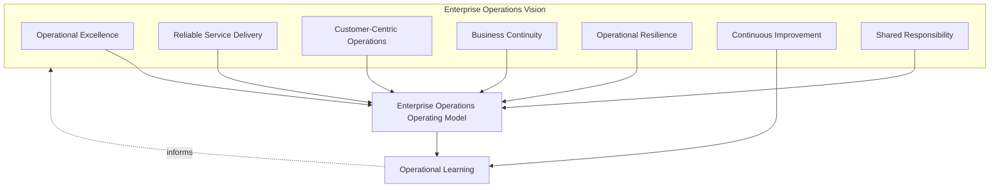
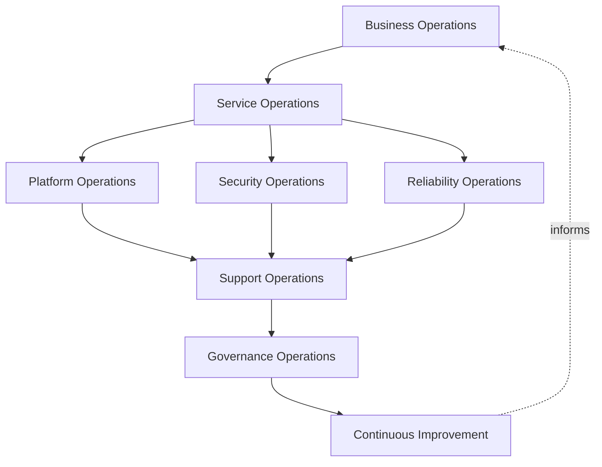
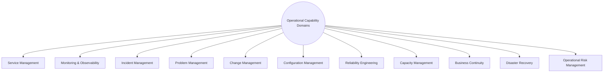
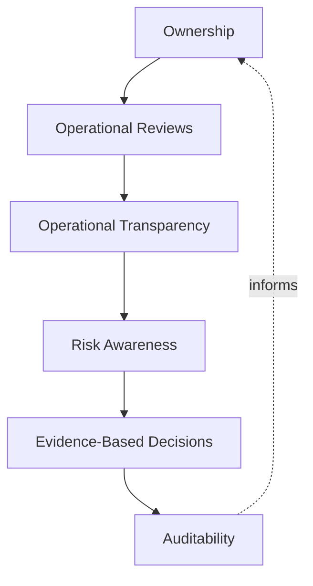
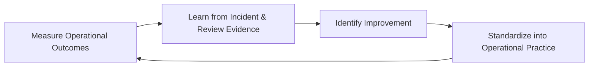

# Enterprise Operations Overview

## 1. Document Purpose

This document defines the official Enterprise Operations Overview for **StackLeo Tech Store**. It establishes the operations vision, operating model, operational lifecycle, and long-term operational excellence that apply across the entire platform — independent of any specific monitoring tool, ITSM platform, or operational software.

- **Purpose of Enterprise Operations** — operations exists to keep the platform genuinely trustworthy every day it is live, converting the architecture, quality, and security commitments established elsewhere in this repository into sustained, day-to-day customer and business outcomes.
- **Relationship with DevOps** — `07_DEVOPS` defines the architecture of delivery, reliability, and observability — the engineered target. This document, and the folder it introduces, define the daily operational discipline of running against that target: this is the foundational document `09_OPERATIONS/README.md` (Section 4) identifies as the folder's starting point.
- **Relationship with Site Reliability Engineering (SRE)** — this document assumes the reliability engineering philosophy of `07_DEVOPS/sre-strategy.md`; operations is where SRE's engineered reliability objectives are lived out daily, through monitoring, response, and continuous operational learning.
- **Relationship with Service Management** — this document introduces service-oriented thinking, consistent with ISO 20000, that the Service Management domain in `09_OPERATIONS/README.md` (Section 7) elaborates in full; the platform is understood here as a set of defined services, not merely running infrastructure.
- **Relationship with Security** — business continuity, disaster recovery, and incident response philosophy are authoritatively defined in `06_Security`; this document positions day-to-day operations as the layer that executes those philosophies continuously, not a parallel or competing discipline.
- **Relationship with Quality Assurance** — `08_QUALITY_ASSURANCE/release-quality-gates.md` governs the decision to release; this document positions operations as what happens immediately after and continuously thereafter, including the post-release validation and operational learning that feed back into future quality decisions.
- **Relationship with Business Operations** — technical operations exists in service of business operations; the reliability, continuity, and responsiveness described here are direct expressions of the trust-centered brand commitment in `01_Business/vision.md`, not ends pursued for their own sake.

This document is implementation-independent and vendor-neutral. It defines operations philosophy, operating model, lifecycle, and governance — not specific monitoring tools, ITSM platforms, cloud providers, operational software, or infrastructure configuration.

## 2. Enterprise Operations Vision

StackLeo's operations vision rests on seven principles. Each exists to produce a specific business outcome — operations is pursued deliberately because of what it protects for customers and the business, not as routine technical upkeep.

### 2.1 Operational Excellence

The platform is operated with deliberate discipline and consistent practice, not merely kept running through ad hoc effort.

- **Business Value** — consistent operational discipline produces predictable outcomes at scale, where individual heroics eventually fail to keep pace with growth.

### 2.2 Reliable Service Delivery

Customers experience the platform's services as consistently available and correct, translating the engineered reliability of `07_DEVOPS/sre-strategy.md` into a lived, daily reality.

- **Business Value** — reliability experienced consistently, not just engineered in principle, is what customers actually judge the business by.

### 2.3 Customer-Centric Operations

Operational decisions — what to monitor, how urgently to respond, what to prioritize — are made with explicit awareness of genuine customer impact.

- **Business Value** — ensures operational effort is directed toward what customers actually experience, not only what is technically convenient to observe.

### 2.4 Business Continuity

The business continues serving customers through disruption of any scale, consistent with `06_Security/business-continuity.md` and ISO 22301 thinking.

- **Business Value** — protects revenue and trust precisely when they are most at risk — during disruption — rather than only during normal operation.

### 2.5 Operational Resilience

Operations is designed to detect, absorb, and recover from adverse conditions, not merely to avoid them.

- **Business Value** — accepts that disruption is eventually inevitable and invests in the capability to withstand it, rather than assuming perfect prevention is achievable.

### 2.6 Continuous Improvement

Operational practice matures over time, informed by real operating experience, incidents, and evolving business scale.

- **Business Value** — keeps operational capability aligned with StackLeo's growth from single-market B2C retailer toward marketplace and regional expansion.

### 2.7 Shared Responsibility

Operations is owned jointly by Engineering, SRE, Security, QA, and Business stakeholders; no single function alone determines whether the platform runs well.

- **Business Value** — prevents the anti-pattern in Section 9.2, where operational ownership is unclear and consequently weak.

*Diagram 1: Enterprise Operations Vision Overview — the seven principles shape the operating model, and operational learning feeds back into the vision itself.*

## 3. Enterprise Operations Operating Model

Operations is organized across eight conceptual layers, each with a distinct role in sustaining the platform day to day.

### 3.1 Business Operations

- **Purpose** — ensure the business functions StackLeo depends on (support, fulfillment coordination, communication) operate in step with the technical platform.
- **Business Value** — prevents technically successful platform operation from being undermined by unprepared business processes.
- **Governance Objectives** — ensure business readiness is confirmed alongside technical readiness for every significant change, consistent with Business Readiness (`08_QUALITY_ASSURANCE/release-quality-gates.md`, Section 4.9).

### 3.2 Service Operations

- **Purpose** — operate the platform as a defined set of services, each with clear scope and expected performance, consistent with ISO 20000 service management thinking.
- **Business Value** — keeps operational attention organized around what the business and customers actually depend on, not around technical components in isolation.
- **Governance Objectives** — ensure every operated service has a defined owner and expected service level, elaborated in `09_OPERATIONS/README.md` (Section 7).

### 3.3 Platform Operations

- **Purpose** — sustain the underlying technical platform's health, consistent with the architecture defined in `03_System_Design` and delivered per `07_DEVOPS`.
- **Business Value** — ensures the foundation every service depends on remains sound, independent of any single service's individual health.
- **Governance Objectives** — ensure platform-level health signals are distinguished from service-level signals, so root cause is never confused with symptom.

### 3.4 Security Operations

- **Purpose** — sustain the security posture defined in `06_Security` through continuous operational vigilance, jointly with `07_DEVOPS/devsecops-strategy.md`.
- **Business Value** — protects StackLeo's core trust differentiator by ensuring security is operated continuously, not only verified at release.
- **Governance Objectives** — ensure security-relevant operational signals are routed to Security leadership with the same urgency as any other operational concern.

### 3.5 Reliability Operations

- **Purpose** — operate the platform against the reliability objectives engineered in `07_DEVOPS/sre-strategy.md`.
- **Business Value** — converts engineered reliability potential into genuinely experienced reliability.
- **Governance Objectives** — ensure reliability deviations are tracked and reviewed against defined objectives, not left to informal impression.

### 3.6 Support Operations

- **Purpose** — ensure customers and internal stakeholders receive timely, competent assistance when they need it.
- **Business Value** — protects customer trust at the exact moments it is most fragile — when something has gone wrong for that specific customer.
- **Governance Objectives** — ensure support operations have visibility into platform and service health sufficient to assist customers accurately.

### 3.7 Governance Operations

- **Purpose** — sustain the ownership, review, and accountability structures that keep every other layer coherent, per Section 8.
- **Business Value** — prevents operational practice from drifting into inconsistency as teams and scale grow.
- **Governance Objectives** — ensure every operational layer has a designated accountable owner.

### 3.8 Continuous Improvement

- **Purpose** — act on evidence and learning from every other layer to deliberately improve operational practice.
- **Business Value** — ensures operational effectiveness compounds over time rather than remaining static as the platform and business scale.
- **Governance Objectives** — ensure improvement actions arising from operational review (Section 4.6) are tracked to completion.

### Enterprise Operations Operating Model Matrix

| Layer | Purpose | Business Value | Governance Objective |
|---|---|---|---|
| Business Operations | Keep business functions in step with the technical platform | Prevents unprepared business processes undermining operation | Business readiness confirmed alongside technical readiness |
| Service Operations | Operate the platform as a defined set of services | Keeps attention organized around genuine business dependency | Every service has a defined owner and expected service level |
| Platform Operations | Sustain the underlying technical platform's health | Protects the foundation every service depends on | Platform-level signals distinguished from service-level signals |
| Security Operations | Sustain security posture through continuous vigilance | Protects the core trust differentiator continuously | Security signals routed to Security leadership with full urgency |
| Reliability Operations | Operate against engineered reliability objectives | Converts engineered potential into experienced reliability | Deviations tracked and reviewed against defined objectives |
| Support Operations | Provide timely, competent customer and stakeholder assistance | Protects trust at the customer's most fragile moment | Support has sufficient visibility to assist accurately |
| Governance Operations | Sustain ownership and accountability across all layers | Prevents drift into inconsistency as scale grows | Every layer has a designated accountable owner |
| Continuous Improvement | Act on evidence to improve operational practice | Effectiveness compounds over time | Improvement actions tracked to completion |

*Diagram 2: Enterprise Operations Operating Model — eight layers spanning business context through continuous improvement, forming a closed operational loop.*

## 4. Operations Lifecycle

The operations lifecycle is governed across eight conceptual stages, spanning from initial service readiness through continuous optimization.

### 4.1 Service Readiness

- **Purpose** — confirm a service is defined, scoped, and understood before it becomes operationally live.
- **Business Value** — ensures operational teams know what they are operating before they are asked to operate it.
- **Governance Objectives** — require a documented service definition, per `09_OPERATIONS/README.md` (Section 7), before Production Readiness (Section 4.2) is assessed.

### 4.2 Production Readiness

- **Purpose** — confirm the technical capability underlying a service has satisfied the release quality gates defined in `08_QUALITY_ASSURANCE/release-quality-gates.md`.
- **Business Value** — ensures operations inherits a genuinely verified capability, not one whose readiness is merely assumed.
- **Governance Objectives** — require confirmed passage of applicable release quality gates before a capability proceeds to Operational Readiness (Section 4.3).

### 4.3 Operational Readiness

- **Purpose** — confirm the organization is specifically prepared to operate, support, and monitor the capability, consistent with Operational Readiness Testing (`08_QUALITY_ASSURANCE/testing-strategy.md`, Section 4.7).
- **Business Value** — prevents the common failure mode where a technically correct release becomes an operational crisis due to insufficient preparation.
- **Governance Objectives** — require documented confirmation of monitoring coverage, support preparedness, and runbook availability before Live Operations begins.

### 4.4 Live Operations

- **Purpose** — sustain the capability's health, availability, and correctness while it is in active, ongoing use.
- **Business Value** — is the stage where all engineered and verified quality actually translates into genuine customer and business outcome.
- **Governance Objectives** — ensure continuous monitoring and service ownership (Section 3.2) remain active for the capability's entire operational life.

### 4.5 Incident Response Awareness

- **Purpose** — maintain constant readiness to detect and respond to disruption, consistent with `07_DEVOPS/incident-management.md`.
- **Business Value** — reduces the time between a problem occurring and the organization beginning to address it.
- **Governance Objectives** — ensure incident response readiness is a continuously sustained state, not a capability assembled only after disruption begins.

### 4.6 Operational Review

- **Purpose** — periodically evaluate the operational health, incident history, and service performance of live capability.
- **Business Value** — gives leadership an honest, evidence-based view of operational health, supporting informed investment decisions.
- **Governance Objectives** — ensure review is conducted on a regular, predictable cadence and connects to Governance Operations (Section 3.7).

### 4.7 Service Improvement

- **Purpose** — act on operational review findings to make deliberate improvements to how a service is run.
- **Business Value** — ensures operational review translates into action, not merely observation.
- **Governance Objectives** — require improvement actions arising from operational review to be documented and tracked to completion.

### 4.8 Continuous Optimization

- **Purpose** — sustain a standing discipline of improving operational efficiency and effectiveness across all services, not only in response to specific review findings.
- **Business Value** — ensures operational capability compounds in value over time as the platform and business scale.
- **Governance Objectives** — ensure optimization efforts are connected to genuine operational evidence (Section 6.5), not undertaken speculatively.

### Operations Lifecycle Matrix

| Stage | Purpose | Business Value | Governance Objective |
|---|---|---|---|
| Service Readiness | Confirm a service is defined and understood pre-launch | Ensures operators know what they're operating | Documented service definition required before production readiness |
| Production Readiness | Confirm underlying capability passed release quality gates | Operations inherits genuinely verified, not assumed, capability | Confirmed gate passage required before operational readiness |
| Operational Readiness | Confirm the organization can operate, support, monitor it | Prevents technically sound releases becoming operational crises | Documented monitoring, support, runbook confirmation required |
| Live Operations | Sustain health, availability, and correctness in active use | Where engineered quality becomes genuine outcome | Continuous monitoring and ownership sustained throughout |
| Incident Response Awareness | Maintain constant readiness to detect and respond | Reduces time between problem occurrence and response | Readiness is a continuously sustained state |
| Operational Review | Periodically evaluate operational health and performance | Gives leadership an honest, evidence-based view | Regular cadence, connected to governance operations |
| Service Improvement | Act on review findings to improve how a service is run | Translates review into action, not just observation | Improvement actions documented and tracked to completion |
| Continuous Optimization | Sustain standing discipline of operational improvement | Operational capability compounds in value over time | Optimization connected to genuine operational evidence |

*Diagram 3: Operations Lifecycle — a continuous cycle in which review and optimization directly inform the next iteration of service readiness.*

## 5. Operational Capability Domains

Operations spans eleven conceptual capability domains, each corresponding to a distinct discipline within enterprise service and reliability management.

### 5.1 Service Management

- **Purpose** — organize operational attention around defined services rather than individual technical components.
- **Scope** — service definition, ownership, and business-facing expectations, consistent with ISO 20000 and `09_OPERATIONS/README.md` (Section 7).
- **Governance Expectations** — every operated capability maps to a defined service with a named owner.
- **Business Importance** — keeps operations aligned with what the business and customers actually depend on.

### 5.2 Monitoring & Observability

- **Purpose** — maintain continuous situational awareness of platform and service health.
- **Scope** — day-to-day use of the observability architecture defined in `07_DEVOPS/observability-strategy.md`.
- **Governance Expectations** — monitoring coverage is confirmed as part of Operational Readiness (Section 4.3), not assumed.
- **Business Importance** — enables issues to be noticed before they become customer-visible.

### 5.3 Incident Management

- **Purpose** — respond to detected disruption in a coordinated, timely, and learning-oriented way.
- **Scope** — day-to-day execution of the incident lifecycle defined in `07_DEVOPS/incident-management.md`.
- **Governance Expectations** — response follows a known, practiced structure, not improvisation.
- **Business Importance** — determines how much business and customer impact a disruption ultimately causes.

### 5.4 Problem Management

- **Purpose** — identify and eliminate the recurring root causes behind multiple incidents.
- **Scope** — patterns across incident history, connecting to Root Cause Analysis and CAPA practice in `08_QUALITY_ASSURANCE/defect-management.md` (Section 5).
- **Governance Expectations** — problem management is a distinct, recurring discipline, not an incidental byproduct of individual incident resolution.
- **Business Importance** — offers the highest-leverage reduction in future incident volume of any operational capability.

### 5.5 Change Management

- **Purpose** — review and coordinate operational and business-facing changes to live services.
- **Scope** — operational-level change coordination, distinct from and complementary to the source-level discipline in `07_DEVOPS/git-strategy.md`.
- **Governance Expectations** — changes affecting live services are reviewed with awareness of their operational impact before proceeding.
- **Business Importance** — prevents uncoordinated change from becoming the cause of avoidable disruption.

### 5.6 Configuration Management

- **Purpose** — maintain accurate, current knowledge of what services and capabilities exist and how they relate.
- **Scope** — operational-level awareness of service dependencies and relationships, informed by `03_System_Design/component-architecture.md`.
- **Governance Expectations** — configuration knowledge is kept current, not allowed to drift from actual deployed reality.
- **Business Importance** — accurate configuration knowledge is a precondition for effective incident and problem management alike.

### 5.7 Reliability Engineering

- **Purpose** — sustain the platform's engineered reliability objectives in daily operation, jointly with `07_DEVOPS/sre-strategy.md`.
- **Scope** — day-to-day practice of operating against reliability objectives, not the objectives' original design.
- **Governance Expectations** — reliability performance is tracked continuously against objectives, not assessed only after a failure.
- **Business Importance** — underpins customer confidence that the platform behaves as expected every time.

### 5.8 Capacity Management

- **Purpose** — proactively plan the operational and business capacity needed to sustain service levels.
- **Scope** — business and operational capacity (support staffing, service throughput), distinct from technical capacity testing in `08_QUALITY_ASSURANCE/performance-testing.md`.
- **Governance Expectations** — capacity planning is proactive, informed by genuine growth projection, not reactive to observed strain.
- **Business Importance** — ensures the business can serve growing demand without service degradation.

### 5.9 Business Continuity

- **Purpose** — sustain the business's ability to continue operating through disruption of any scale.
- **Scope** — operational execution and testing of the philosophy defined in `06_Security/business-continuity.md`, consistent with ISO 22301.
- **Governance Expectations** — continuity plans are tested periodically to confirm they remain genuinely workable.
- **Business Importance** — protects the business's ability to continue serving customers precisely when it matters most.

### 5.10 Disaster Recovery

- **Purpose** — restore systems and infrastructure following a significant disruption.
- **Scope** — operational execution and testing of the recovery plans defined in `06_Security/disaster-recovery.md`.
- **Governance Expectations** — recovery capability is proven through periodic testing, never assumed from design intent alone.
- **Business Importance** — determines how quickly normal operation, and customer trust, can be restored after a significant event.

### 5.11 Operational Risk Management

- **Purpose** — identify, track, and manage risk arising from day-to-day operation.
- **Scope** — cross-cutting; consolidates operational risk visibility across every other capability domain in this section.
- **Governance Expectations** — accepted operational risk is always a deliberate, accountable decision, never a silent default.
- **Business Importance** — ensures the organization consciously understands, rather than unconsciously inherits, its operational risk exposure.

### Operational Capability Matrix

| Domain | Purpose | Governance Expectations | Business Importance |
|---|---|---|---|
| Service Management | Organize operations around defined services | Every capability maps to a defined service with an owner | Aligns operations with genuine business dependency |
| Monitoring & Observability | Maintain continuous situational awareness | Coverage confirmed as part of operational readiness | Enables issues to be noticed before customer impact |
| Incident Management | Respond to disruption in a coordinated way | Response follows a known, practiced structure | Determines the ultimate business/customer impact of disruption |
| Problem Management | Eliminate recurring root causes behind incidents | A distinct, recurring discipline, not incidental | Highest-leverage reduction in future incident volume |
| Change Management | Review and coordinate operational/business change | Changes reviewed for operational impact before proceeding | Prevents uncoordinated change causing avoidable disruption |
| Configuration Management | Maintain accurate knowledge of services and dependencies | Configuration knowledge kept current, not drifted | Precondition for effective incident and problem management |
| Reliability Engineering | Sustain engineered reliability objectives daily | Performance tracked continuously against objectives | Underpins confidence the platform behaves as expected |
| Capacity Management | Proactively plan operational and business capacity | Planning is proactive, informed by growth projection | Ensures growing demand is served without degradation |
| Business Continuity | Sustain ability to operate through disruption | Plans tested periodically to confirm workability | Protects the business precisely when it matters most |
| Disaster Recovery | Restore systems following significant disruption | Recovery capability proven through periodic testing | Determines speed of restoring operation and trust |
| Operational Risk Management | Identify, track, and manage day-to-day operational risk | Accepted risk is always a deliberate, accountable decision | Ensures conscious, not unconscious, risk exposure |

*Diagram 4: Operational Capability Framework — eleven domains, each independently governed but collectively forming complete operational coverage.*

## 6. Operational Governance Principles

- **Service Reliability** — governance exists to sustain reliable service delivery (Section 2.2) as a continuously verified outcome, not a one-time engineering achievement.
- **Risk Awareness** — operational governance decisions are made with explicit awareness of the risk involved, consistent with Operational Risk Management (Section 5.11).
- **Operational Transparency** — operational posture and decisions are visible to those who need to understand them, not held privately within any single function.
- **Accountability** — every operational domain and decision traces to a specific, named accountable role, never left ambiguous.
- **Evidence-Based Decisions** — operational decisions are grounded in observed telemetry and service data, consistent with `07_DEVOPS/observability-strategy.md`, rather than assumption or anecdote.
- **Auditability** — operational decisions and their outcomes can be reviewed after the fact, supporting accountability and continuous improvement.
- **Continuous Improvement** — operational governance itself matures over time, informed by what is learned from real operating experience.

### Governance Principle Matrix

| Principle | Description | Business Value |
|---|---|---|
| Service Reliability | Sustain reliable delivery as a continuously verified outcome | Keeps reliability a lived reality, not a one-time achievement |
| Risk Awareness | Make decisions with explicit awareness of operational risk | Allows deliberate, informed risk-taking rather than blind exposure |
| Operational Transparency | Keep posture and decisions visible to relevant stakeholders | Builds cross-functional confidence and informed decision-making |
| Accountability | Trace every domain and decision to a named accountable role | Prevents gaps from persisting because responsibility was unclear |
| Evidence-Based Decisions | Ground decisions in observed telemetry, not assumption | Improves accuracy and defensibility of operational decisions |
| Auditability | Ensure decisions and outcomes are reviewable after the fact | Supports accountability and confidence for partners and regulators |
| Continuous Improvement | Mature operational governance from real experience | Keeps governance aligned with organizational and platform growth |

*Diagram 5: Operations Governance Model — ownership anchors review activity, sustaining transparency, risk awareness, evidence-based decisions, and auditable outcomes as a continuous loop.*

## 7. Future Readiness

This document is designed to remain valid as StackLeo evolves in scale and architectural complexity, without requiring redefinition of its underlying philosophy.

- **Cloud-Native Platforms** — operational capability domains (Section 5) are defined independently of any specific runtime or deployment model, so they apply unchanged as infrastructure evolves, consistent with `03_System_Design/deployment-architecture.md`.
- **AI Systems** — as AI-assisted capability is introduced, Monitoring & Observability and Problem Management (Sections 5.2, 5.4) extend to cover behavioral consistency and recurring-issue investigation for AI-driven capability.
- **Marketplace Platform** — the multi-vendor marketplace model extends Service Management and Operational Risk Management (Sections 5.1, 5.11) to cover seller-facing services, applying the same operational rigor used for StackLeo's own catalog today.
- **Multi-Tenant Architecture** — where future architecture introduces tenant isolation, Configuration and Capacity Management (Sections 5.6, 5.8) extend to explicitly account for cross-tenant operational impact.
- **Continuous Delivery** — as delivery cadence accelerates per `07_DEVOPS/ci-cd-strategy.md`, Change Management (Section 5.5) adapts to coordinate more frequent operational change without reducing review discipline.
- **Global Operations** — as StackLeo expands from Bangladesh into South Asia and beyond, the operating model (Section 3) extends to coordinate operations across geographies without requiring a new governance structure.
- **Multi-Region Services** — Service Management and Business Continuity (Sections 5.1, 5.9) extend to cover region-specific service definitions and continuity planning as infrastructure becomes multi-region.
- **Enterprise Scale** — the operational capability domains and lifecycle (Sections 4–5) are defined independently of team size or organizational structure, so they remain coherent as operations scales well beyond its current footprint.

## 8. Governance

- **Ownership** — the Operations lead (or equivalent COO-accountable function) owns this document and is accountable for its consistent application across the platform, in partnership with DevOps/SRE, Security, and QA leadership, consistent with `09_OPERATIONS/README.md` (Section 12).
- **Review Process** — this document is formally reviewed whenever a material change occurs in business model (`01_Business/business-model.md`), architecture (`03_System_Design`), or delivery practice (`07_DEVOPS`), and on a regular recurring cadence independent of specific change events.
- **Operational Policies** — subordinate, practice-specific operational documents (service management, monitoring, incident, and continuity strategies within `09_OPERATIONS`) must remain consistent with the vision, operating model, and lifecycle defined here.
- **Audit Readiness** — operational records — service performance, incident history, review outcomes — are maintained in a state ready for internal or external audit at any time, without requiring advance preparation.
- **Continuous Improvement** — this document itself is subject to Continuous Improvement (Section 2.6, Section 4.8); its effectiveness is periodically assessed and revised based on genuine operational evidence.

### Governance Responsibility Matrix

| Role | Responsibility |
|---|---|
| COO / Operations Lead | Owns coherence and enforcement of this operations overview, in partnership with DevOps/SRE, Security, and QA leadership. |
| SRE Lead | Ensures Reliability Engineering (Section 5.7) and Live Operations (Section 4.4) reflect `07_DEVOPS/sre-strategy.md`. |
| Service Owners | Own individual services within Service Management (Section 5.1) and their defined operational expectations. |
| Security Lead | Ensures Security Operations (Section 3.4) remains consistent with `06_Security` philosophy. |
| QA Leadership | Ensures Production Readiness (Section 4.2) genuinely reflects passed release quality gates. |
| Support Lead | Owns Support Operations (Section 3.6) and ensures customer-facing assistance is timely and accurate. |
| Business Continuity Lead | Owns Business Continuity and Disaster Recovery (Sections 5.9–5.10) execution and testing. |
| Internal Audit / Review Function | Independently verifies that operational governance records reflect actual practice. |

*Diagram 6: Continuous Operational Improvement Cycle — operational outcomes are measured, learned from, improved upon, and standardized back into practice, on a continuing basis.*

## 9. Anti-Patterns

The following recurring failure patterns are explicitly recognized and avoided, as each one structurally undermines this document.

| Anti-Pattern | Why It's Avoided |
|---|---|
| Reactive Operations | Contradicts Operational Resilience (Section 2.5); waiting for problems to surface before acting concentrates cost and risk instead of distributing it through proactive practice. |
| Weak Service Ownership | Undermines Service Operations (Section 3.2); without a named owner per service, operational attention becomes diffuse and easily neglected. |
| Poor Operational Visibility | Undermines Monitoring & Observability (Section 5.2); without genuine situational awareness, issues are discovered by customers before the organization notices them. |
| Weak Incident Preparedness | Contradicts Incident Response Awareness (Section 4.5); assembling response capability only after disruption begins costs precious time exactly when it matters most. |
| Missing Business Continuity | Contradicts Business Continuity (Section 2.4, Section 5.9); without tested continuity plans, disruption of any real scale threatens the business itself, not merely a technical component. |
| Weak Documentation | Undermines the shared understanding every operational domain in Section 5 depends on, leaving practice inconsistent and unverifiable after the fact. |
| Poor Governance | Undermines Section 8; without clear ownership and review, operational practice drifts into inconsistency as teams and scale grow. |
| Missing Continuous Improvement | Contradicts Continuous Improvement (Section 2.6, Section 4.8); without deliberate improvement, operational capability stagnates while the platform and business continue to grow in complexity. |

## 10. Document Information

| Property | Value |
|----------|-------|
| Document | operations-overview.md |
| Version | 1.0.0 |
| Status | Active |
| Maintained By | StackLeo |
| Last Updated | 2026-07-24 |

---

© StackLeo. All Rights Reserved.
