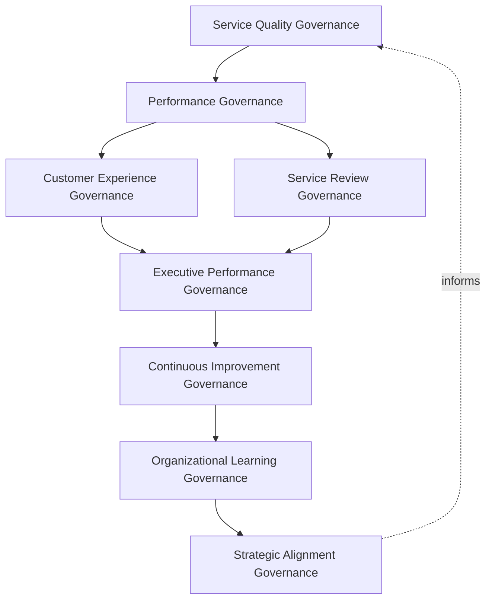
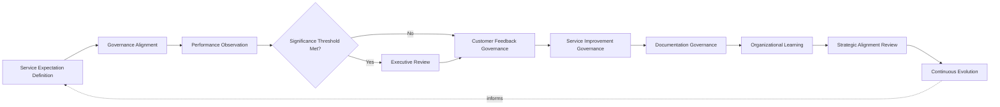
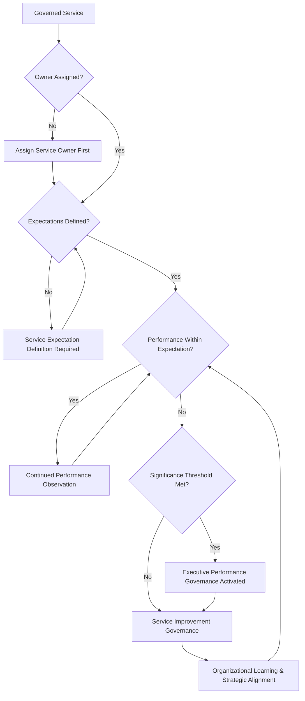
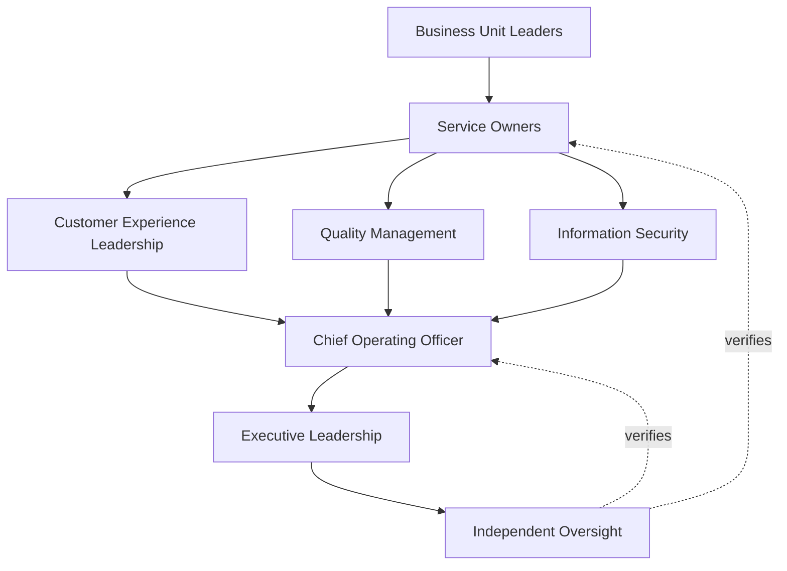
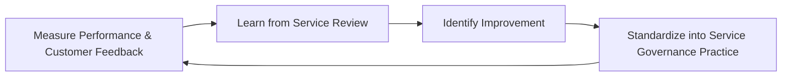
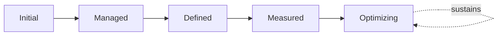

# Enterprise Service Level Governance Framework

## 1. Document Purpose

This document defines the official Enterprise Service Level Governance Framework for **StackLeo Tech Store** — the COO/CCO/CIO-owned executive charter under which service quality, service level governance, customer expectation governance, and performance governance are governed as a deliberate, accountable discipline. It establishes governance for service quality, performance, customer experience, service review, executive oversight, organizational accountability, and long-term service excellence across the StackLeo platform, consistent with ITIL 4, ISO/IEC 20000, ISO 9001, COBIT governance principles, and TOGAF enterprise architecture thinking.

`service-level-management.md` remains the operational governance framework for service level practice in this folder — the document that elaborates in full operational depth StackLeo's service level lifecycle, domains, and review discipline, itself the service-level-specific elaboration of `service-management.md` and `service-catalog.md`. This document sits above it as the highest-level executive mandate, consistent with the executive-charter relationship `incident-management-governance.md`, `problem-management-governance.md`, and `change-management-governance.md` hold over their respective operational documents: it does not restate operational measurement detail, it establishes the philosophy, organizational ownership, and executive expectations that give service level practice its authority and coherence at the level of the Board and executive leadership.

- **Purpose of Service Level Governance** — to ensure that what StackLeo promises its customers, and what it genuinely delivers, are governed as a deliberate, accountable relationship, rather than left to drift apart through unmanaged assumption on either side.
- **Relationship with Service Management** — `service-management.md` and `service-catalog.md` define the full service lifecycle and the services themselves; this strategy governs the accountability structure under which the expectations attached to those services are set, honored, and reviewed.
- **Relationship with Customer Experience** — service level governance exists to make explicit and defend what customers can genuinely expect, consistent with Customer-Centric Service Delivery in `service-management.md` (Section 2.2); a commitment that does not reflect real customer need is not meaningful, however precisely it is measured.
- **Relationship with Operations Governance** — `operations-governance-strategy.md` establishes the broader executive mandate for how StackLeo's daily operation is governed; this strategy is that mandate's specific application to the quality and performance of service actually delivered.
- **Relationship with Quality Management** — this strategy applies ISO 9001 continual improvement thinking specifically to service performance and customer expectation, coordinated with quality practice defined in `08_QUALITY_ASSURANCE`.
- **Relationship with Executive Decision-Making** — this strategy exists to give executive leadership genuine, timely visibility into whether service commitments are genuinely being honored, a visibility that directly informs decisions about investment, priority, and customer trust.
- **Relationship with Business Strategy** — sustained service excellence is a direct expression of the trust-centered brand promise in `01_Business/vision.md`; this strategy ensures service performance remains a deliberate strategic asset, not an incidental operational outcome.

This document is implementation-independent and vendor-neutral. It defines service level governance philosophy, model, domains, and lifecycle conceptually — not specific monitoring platforms, observability tools, analytics products, service desk platforms, cloud providers, consulting firms, operational products, SLA metrics, KPI thresholds, monitoring configurations, reporting workflows, infrastructure configurations, implementation roadmaps, or code.

## 2. Service Level Governance Philosophy

Service level governance at StackLeo rests on eight principles. Each exists to produce a specific business outcome — service performance is governed deliberately because it is the most direct, sustained expression of the trust customers place in StackLeo.

### 2.1 Service Excellence Builds Trust

Consistently honored service commitments are treated as a direct driver of customer trust, not merely an operational statistic.

- **Business Value** — sustained service excellence compounds into durable customer loyalty and reputation, protecting the business's long-term value.

### 2.2 Governance Before Measurement

The accountability structure — who defines expectations, who owns performance, who reviews outcomes — is established before specific measurement activity is undertaken.

- **Business Value** — ensures measurement exists because a genuine, governed decision called for it, not as disconnected data collection without accountable ownership.

### 2.3 Customer-Centric Performance

Every governance decision about service performance is made with explicit awareness of its effect on the customer, not only its internal operational convenience.

- **Business Value** — protects the trust-centered brand commitment in `01_Business/vision.md` by ensuring governance never loses sight of genuine customer impact.

### 2.4 Accountability

Every service has a specific, named owner accountable for the expectations attached to it and the performance delivered against them.

- **Business Value** — ensures no service persists without someone genuinely responsible for its performance.

### 2.5 Transparency

Service performance, customer feedback, and improvement progress are documented and visible to those who genuinely need them.

- **Business Value** — allows service performance to be scrutinized and defended, and keeps stakeholders genuinely informed.

### 2.6 Quality-Driven Culture

Service performance is treated as an organization-wide quality commitment, not the sole responsibility of a single function.

- **Business Value** — sustains service excellence as a shared organizational habit rather than a periodic, isolated initiative.

### 2.7 Business Alignment

Service level governance decisions are made in service of genuine business priority, focusing attention where service performance matters most.

- **Business Value** — ensures limited governance attention is directed toward what genuinely matters most to the business and its customers.

### 2.8 Continuous Improvement

Service level governance practice matures over time, informed by real performance, customer feedback, and the organization's growth in scale and complexity.

- **Business Value** — keeps service level governance aligned with StackLeo's growth in scale, market reach, and operational complexity.

## 3. Enterprise Service Level Governance Model

Service level governance operates across eight conceptual layers, each holding accountability for a distinct dimension of how StackLeo governs service quality. Every layer here is elaborated in full operational depth in `service-level-management.md`.

### 3.1 Service Quality Governance

- **Purpose** — own the coherence of how the organization defines and defends what genuine service quality means for each service.
- **Governance Scope** — oversight of Service Quality Governance (`service-level-management.md`, Section 5) across every domain in Section 4.
- **Business Value** — ensures quality is defined deliberately, in terms customers genuinely value, not assumed by default.
- **Executive Expectations** — leadership trusts service quality is genuinely defined, not left implicit or assumed.

### 3.2 Performance Governance

- **Purpose** — own the coherence of how actual service performance is governed against defined expectations.
- **Governance Scope** — oversight of Performance Observation (Section 5.3) across every domain in Section 4.
- **Business Value** — ensures performance is governed as a continuous accountability, not an occasional check.
- **Executive Expectations** — leadership trusts performance shortfalls are surfaced promptly, not discovered late.

### 3.3 Customer Experience Governance

- **Purpose** — own the coherence of how customer feedback and experience inform service level governance.
- **Governance Scope** — oversight of Customer Feedback Governance (Section 5.5), coordinated with Customer Experience Leadership (Section 7.4).
- **Business Value** — ensures service governance genuinely reflects the customer's actual experience, not only internal measurement.
- **Executive Expectations** — leadership expects customer feedback to be a genuine, weighted input to governance decisions.

### 3.4 Service Review Governance

- **Purpose** — own the coherence of how service performance is formally and periodically reviewed.
- **Governance Scope** — oversight of Service Review (`service-level-management.md`, Section 3.5) across every domain in Section 4.
- **Business Value** — ensures performance is genuinely scrutinized on a predictable cadence, not only when a problem is already visible.
- **Executive Expectations** — leadership trusts service review occurs consistently, regardless of whether performance happens to be favorable.

### 3.5 Executive Performance Governance

- **Purpose** — own executive-level accountability for the service performance carrying the greatest organizational consequence.
- **Governance Scope** — oversight spanning Sections 3.1–3.4 and 3.6 wherever service performance rises to genuine executive concern.
- **Business Value** — ensures the most consequential service performance is visible at the level accountable for the organization as a whole.
- **Executive Expectations** — leadership expects to be informed of, not surprised by, significant service performance shortfall.

### 3.6 Continuous Improvement Governance

- **Purpose** — own the coherence of how service performance findings are converted into deliberate improvement action.
- **Governance Scope** — oversight of Service Improvement Governance (Section 5.6) across every domain in Section 4.
- **Business Value** — ensures identified shortfalls genuinely translate into improved future performance, not merely a documented observation.
- **Executive Expectations** — leadership trusts improvement action is genuinely completed and verified, not merely proposed.

### 3.7 Organizational Learning Governance

- **Purpose** — own the coherence of how the organization converts individual service review outcomes into durable, shared organizational learning.
- **Governance Scope** — oversight of Organizational Learning (Section 5.8) across every domain in Section 4.
- **Business Value** — ensures a reviewed service's lessons strengthen the organization's broader service capability, not only that one service.
- **Executive Expectations** — leadership expects every significant service review to produce a documented, attributable lesson.

### 3.8 Strategic Alignment Governance

- **Purpose** — own the coherence of how service level governance remains connected to genuine business strategy over time.
- **Governance Scope** — oversight of Strategic Alignment Review (Section 5.9), coordinated with `01_Business/business-model.md`.
- **Business Value** — prevents service level governance from becoming an operational exercise disconnected from what the business is actually trying to achieve.
- **Executive Expectations** — leadership expects service priorities to remain genuinely aligned with evolving business strategy.

### Enterprise Service Level Governance Matrix

| Layer | Purpose | Business Value | Executive Expectations |
|---|---|---|---|
| Service Quality Governance | Own coherence of defining and defending genuine service quality | Ensures quality is defined deliberately, in customer-relevant terms | Trusts quality is genuinely defined, not assumed |
| Performance Governance | Own coherence of governing actual performance against expectation | Ensures performance is a continuous accountability | Trusts shortfalls are surfaced promptly, not discovered late |
| Customer Experience Governance | Own coherence of how feedback informs governance | Ensures governance reflects genuine customer experience | Expects feedback to be a genuine, weighted input |
| Service Review Governance | Own coherence of formal, periodic performance review | Ensures performance is scrutinized on a predictable cadence | Trusts review occurs consistently regardless of outcome |
| Executive Performance Governance | Own executive accountability for highest-consequence performance | Ensures the most consequential performance is visible to leadership | Expects leadership informed of, not surprised by, shortfall |
| Continuous Improvement Governance | Own coherence of converting findings into improvement action | Ensures shortfalls translate into genuinely improved performance | Trusts improvement action is completed and verified |
| Organizational Learning Governance | Own coherence of converting outcomes into shared learning | Strengthens the organization's broader service capability | Expects every significant review to produce a documented lesson |
| Strategic Alignment Governance | Own coherence of connecting governance to business strategy | Prevents governance from disconnecting from business intent | Expects service priorities to remain aligned with strategy |

*Diagram 1: Enterprise Service Level Governance Framework — service quality and performance governance branch into customer experience and service review governance, converging on executive performance governance before continuous improvement and organizational learning inform strategic alignment, which feeds back into the model.*

## 4. Enterprise Service Level Domains

Service level governance is governed across ten conceptual domains, each requiring a distinct governance emphasis. Every domain here is elaborated in full operational depth in `service-level-management.md`.

### 4.1 Customer Support Services

- **Purpose** — govern the expectations and performance attached to how customers are supported.
- **Governance Considerations** — governed under Customer Experience Governance (Section 3.3), given its direct effect on customer trust.
- **Business Importance** — protects the trust relationship every support interaction depends on.
- **Executive Expectations** — leadership expects support service performance to be visible in proportion to genuine customer impact.

### 4.2 Marketplace Services

- **Purpose** — govern the expectations and performance attached to listing, browsing, and transacting, including future multi-vendor marketplace activity.
- **Governance Considerations** — governed under Service Quality Governance (Section 3.1), structured ahead of the marketplace model's launch.
- **Business Importance** — protects the durability of the platform's core revenue-generating function.
- **Executive Expectations** — leadership expects marketplace service performance to receive the highest business-criticality governance priority.

### 4.3 Payment Services

- **Purpose** — govern the expectations and performance attached to payment processing and checkout completion.
- **Governance Considerations** — governed under Performance Governance (Section 3.2), given its financial and regulatory sensitivity.
- **Business Importance** — protects revenue capture and the business's standing with payment partners and regulators.
- **Executive Expectations** — leadership expects payment service performance to meet the strictest review rigor in this model.

### 4.4 Logistics & Delivery Services

- **Purpose** — govern the expectations and performance attached to order fulfillment and delivery.
- **Governance Considerations** — governed under Performance Governance (Section 3.2), given its direct role in the customer experience.
- **Business Importance** — protects the operational reliability customers directly experience after a purchase.
- **Executive Expectations** — leadership expects logistics service performance to be governed with explicit awareness of delivery partner dependency.

### 4.5 Digital Platform Services

- **Purpose** — govern the expectations and performance attached to the platform's technical availability, responsiveness, and functionality.
- **Governance Considerations** — governed under Service Quality Governance (Section 3.1), coordinated with `07_DEVOPS/sre-strategy.md`.
- **Business Importance** — protects the technical foundation every other service domain ultimately depends on.
- **Executive Expectations** — leadership expects platform service performance to be governed with consistent rigor across the stack.

### 4.6 Vendor Services

- **Purpose** — govern the expectations and performance attached to services delivered through a vendor, integration partner, or external dependency.
- **Governance Considerations** — governed under Performance Governance (Section 3.2), coordinated with `06_Security/third-party-risk-governance.md`.
- **Business Importance** — protects the business from service exposure it does not directly control but is nonetheless accountable for.
- **Executive Expectations** — leadership expects vendor service performance to be reviewed with the same rigor as internally delivered service.

### 4.7 Internal Business Services

- **Purpose** — govern the expectations and performance attached to services one internal function delivers to another.
- **Governance Considerations** — governed under Service Quality Governance (Section 3.1), coordinated with Business Unit Leaders (Section 7.6).
- **Business Importance** — protects the organization's own operating capability, which customer-facing service ultimately depends on.
- **Executive Expectations** — leadership expects internal service performance to be governed with the same discipline as customer-facing service.

### 4.8 Security & Trust Services

- **Purpose** — govern the expectations and performance attached to the security and integrity customers implicitly rely on.
- **Governance Considerations** — governed jointly with, and never superseding, `06_Security/security-governance.md`, which remains authoritative for security-specific obligations.
- **Business Importance** — protects customer data, platform integrity, and the trust foundation every service depends on.
- **Executive Expectations** — leadership expects security and trust service performance to be escalated with the urgency defined in `06_Security/security-governance.md`.

### 4.9 Compliance Services

- **Purpose** — govern the expectations and performance attached to services carrying a genuine regulatory or contractual obligation.
- **Governance Considerations** — governed under Executive Performance Governance (Section 3.5), coordinated with `06_Security/compliance-governance.md`.
- **Business Importance** — protects the business's standing with regulators and its contractual counterparties.
- **Executive Expectations** — leadership expects compliance service performance shortfalls to be escalated immediately, without exception.

### 4.10 Executive Business Services

- **Purpose** — govern the expectations and performance attached to services whose consequence extends to the organization's reputation or strategic standing.
- **Governance Considerations** — governed exclusively under Executive Performance Governance (Section 3.5).
- **Business Importance** — protects the organization's most consequential asset — its standing with customers, partners, and the market.
- **Executive Expectations** — leadership expects direct, deliberate engagement for any service genuinely rising to this category.

### Enterprise Service Level Domain Matrix

| Domain | Purpose | Business Importance | Executive Expectations |
|---|---|---|---|
| Customer Support Services | Govern expectations and performance for customer support | Protects the trust relationship every support interaction depends on | Visible in proportion to genuine customer impact |
| Marketplace Services | Govern expectations for listing, browsing, transacting | Protects the core revenue-generating function | Receives the highest business-criticality priority |
| Payment Services | Govern expectations for payment and checkout | Protects revenue capture and partner/regulator standing | Meets the strictest review rigor in this model |
| Logistics & Delivery Services | Govern expectations for fulfillment and delivery | Protects post-purchase operational reliability | Governed with explicit delivery-partner awareness |
| Digital Platform Services | Govern expectations for availability and functionality | Protects the technical foundation every domain depends on | Governed with consistent rigor across the stack |
| Vendor Services | Govern expectations for vendor-delivered service | Protects against exposure not directly controlled | Reviewed with the same rigor as internal service |
| Internal Business Services | Govern expectations between internal functions | Protects operating capability customer service depends on | Governed with the same discipline as customer-facing service |
| Security & Trust Services | Govern expectations for security and integrity | Protects data, integrity, and the trust foundation all service depends on | Escalated with urgency per `security-governance.md` |
| Compliance Services | Govern expectations with regulatory or contractual dimension | Protects standing with regulators and counterparties | Escalated immediately, without exception |
| Executive Business Services | Govern expectations affecting reputation or strategic standing | Protects the organization's standing with market and partners | Receives direct, deliberate executive engagement |

## 5. Enterprise Service Level Lifecycle

Service level governance operates across ten conceptual lifecycle stages, applicable across every domain in Section 4.

### 5.1 Service Expectation Definition

- **Purpose** — govern how genuine customer and business expectations for a service are identified and articulated.
- **Governance Objectives** — require expectations to reflect genuine customer need, consistent with Customer-Centric Performance (Section 2.3).
- **Business Value** — ensures what is governed reflects what genuinely matters to customers and the business.

### 5.2 Governance Alignment

- **Purpose** — govern how a defined expectation is assigned to the appropriate governance layer in Section 3.
- **Governance Objectives** — apply Governance Before Measurement (Section 2.2) consistently across every service.
- **Business Value** — ensures every service is governed by the function genuinely accountable for its domain.

### 5.3 Performance Observation

- **Purpose** — govern how actual performance against expectation is continuously understood.
- **Governance Objectives** — apply Performance Governance (Section 3.2) as a sustained, ongoing accountability.
- **Business Value** — ensures shortfalls are identified while they can still be addressed proactively.

### 5.4 Executive Review

- **Purpose** — govern the point at which service performance requires executive-level visibility or engagement.
- **Governance Objectives** — apply Executive Performance Governance (Section 3.5) against clearly understood significance thresholds.
- **Business Value** — ensures leadership is engaged exactly when genuinely warranted.

### 5.5 Customer Feedback Governance

- **Purpose** — govern how genuine customer feedback is captured and weighed alongside measured performance.
- **Governance Objectives** — apply Customer Experience Governance (Section 3.3) to ensure feedback is a genuine input, not a formality.
- **Business Value** — ensures governance reflects the customer's actual experience, not only internal measurement.

### 5.6 Service Improvement Governance

- **Purpose** — govern how a confirmed performance shortfall is translated into genuine improvement action.
- **Governance Objectives** — apply Continuous Improvement Governance (Section 3.6) through to verified completion.
- **Business Value** — ensures identified shortfalls genuinely lead to improved future performance.

### 5.7 Documentation Governance

- **Purpose** — govern the completeness and integrity of the service level record itself.
- **Governance Objectives** — require documentation to remain consistent with `service-level-management.md` as it evolves.
- **Business Value** — ensures the organization retains a genuine, trustworthy record of commitments made and performance delivered.

### 5.8 Organizational Learning

- **Purpose** — formally capture what a service review reveals about service level governance itself.
- **Governance Objectives** — apply Organizational Learning Governance (Section 3.7), requiring lessons to be documented and attributed.
- **Business Value** — ensures the organization genuinely learns from experience rather than repeating the same gaps.

### 5.9 Strategic Alignment Review

- **Purpose** — formally reassess whether service level priorities remain aligned with evolving business strategy.
- **Governance Objectives** — apply Strategic Alignment Governance (Section 3.8) on a periodic, predictable basis.
- **Business Value** — keeps service governance genuinely connected to what the business is trying to achieve.

### 5.10 Continuous Evolution

- **Purpose** — apply accumulated lessons and strategic realignment to strengthen future service level governance.
- **Governance Objectives** — require findings to be genuinely analyzed for recurring patterns and evolving business need.
- **Business Value** — turns each cycle of review into an input that makes future service governance genuinely stronger.

### Enterprise Service Level Lifecycle Matrix

| Stage | Purpose | Governance Objective | Business Value |
|---|---|---|---|
| Service Expectation Definition | Identify and articulate genuine expectations | Reflects genuine customer need | Ensures governance reflects what genuinely matters |
| Governance Alignment | Assign a defined expectation to the appropriate layer | Applied consistently across every service | Ensures governance by the genuinely accountable function |
| Performance Observation | Continuously understand actual performance | Sustained, ongoing accountability | Identifies shortfalls while they can still be addressed |
| Executive Review | Elevate performance requiring executive visibility | Applied against clear significance thresholds | Engages leadership exactly when warranted |
| Customer Feedback Governance | Capture and weigh genuine customer feedback | Feedback treated as a genuine input, not a formality | Reflects the customer's actual experience |
| Service Improvement Governance | Translate confirmed shortfall into improvement action | Carried through to verified completion | Ensures shortfalls lead to genuinely improved performance |
| Documentation Governance | Maintain completeness and integrity of the record | Kept consistent with subordinate documentation | Retains a genuine, trustworthy record |
| Organizational Learning | Capture governance implications from review | Documented and attributed to specific implications | Ensures genuine learning rather than repeated gaps |
| Strategic Alignment Review | Reassess alignment with evolving business strategy | Applied on a periodic, predictable basis | Keeps governance genuinely connected to business intent |
| Continuous Evolution | Apply lessons and realignment to strengthen governance | Findings genuinely analyzed for patterns and evolving need | Makes future service governance genuinely stronger |

*Diagram 2: Enterprise Service Level Lifecycle — expectation definition and governance alignment inform performance observation, escalating to executive review only where thresholds are met before customer feedback and service improvement governance, with documentation, organizational learning, and strategic alignment feeding continuous evolution back into the cycle.*

## 6. Service Level Governance Principles

- **Customer Focus** — every governance decision considers genuine customer impact, consistent with Section 2.3.
- **Accountability** — every service has a specific, named, responsible owner, consistent with Section 2.4.
- **Transparency** — performance, feedback, and improvement progress are documented and visible, consistent with Section 2.5.
- **Quality Orientation** — service performance is treated as a genuine quality commitment, consistent with Section 2.6.
- **Performance Awareness** — actual performance against expectation is continuously and honestly understood.
- **Business Alignment** — governance decisions are made in service of genuine business priority, consistent with Section 2.7.
- **Adaptability** — governance remains genuinely responsive to evolving customer need and business strategy.
- **Continuous Improvement** — governance practice matures over time, informed by real performance and feedback.

### Service Level Governance Principles Matrix

| Principle | Description | Business Value |
|---|---|---|
| Customer Focus | Governance decisions consider genuine customer impact | Protects the trust relationship every service places at risk |
| Accountability | Every service has a specific, named, responsible owner | Ensures no service drifts without genuine ownership |
| Transparency | Performance, feedback, and improvement documented and visible | Allows service performance to be scrutinized and defended |
| Quality Orientation | Performance treated as a genuine quality commitment | Sustains excellence as a shared organizational habit |
| Performance Awareness | Actual performance continuously and honestly understood | Surfaces shortfalls while they can still be addressed |
| Business Alignment | Decisions made in service of genuine business priority | Directs limited governance attention where it matters most |
| Adaptability | Remains responsive to evolving customer need and strategy | Prevents governance from becoming static or disconnected |
| Continuous Improvement | Practice matures from real performance and feedback | Keeps governance aligned with organizational growth |

*Diagram 4: Enterprise Service Level Governance Decision Flow — a governed service is checked for assigned ownership and defined expectations, with executive governance activated upon a significant performance shortfall, resolving into improvement governance and organizational learning that feed back into continued performance observation.*

## 7. Ownership & Accountability

Governance authority for service level governance is distributed deliberately across eight accountable functions, defined here at the governance-objective level, without prescribing specific operational service measurement responsibilities.

### 7.1 Executive Leadership

- **Governance Objective** — the Board and executive leadership hold ultimate accountability for how the organization governs service quality and customer expectation.
- **Business Value** — provides a single point of ultimate accountability for whether service level governance is genuinely functioning as intended.

### 7.2 Chief Operating Officer

- **Governance Objective** — the Chief Operating Officer owns the coherence and enforcement of this strategy across every domain, layer, and stage it defines.
- **Business Value** — provides a single point of specialist accountability for whether service level governance is genuinely functioning as intended.

### 7.3 Service Owners

- **Governance Objective** — each service defined in `service-catalog.md` has a specific, named owner accountable for the expectations attached to it and the performance delivered.
- **Business Value** — ensures no service persists without someone genuinely responsible for its performance.

### 7.4 Customer Experience Leadership

- **Governance Objective** — customer experience leadership owns Customer Experience Governance (Section 3.3), ensuring genuine customer feedback is represented in governance.
- **Business Value** — ensures the customer's genuine experience is represented directly in service level governance.

### 7.5 Quality Management

- **Governance Objective** — quality management owns the alignment of service level governance with ISO 9001 continual improvement obligations, consistent with `08_QUALITY_ASSURANCE` practice.
- **Business Value** — ensures service level governance genuinely functions as a continual improvement discipline.

### 7.6 Business Unit Leaders

- **Governance Objective** — business unit leaders own service level governance readiness within their own function, consistent with Internal Business Services (Section 4.7).
- **Business Value** — ensures service level governance is genuinely embedded within the functions closest to service delivery.

### 7.7 Information Security

- **Governance Objective** — information security owns Security & Trust Services (Section 4.8) jointly with `06_Security/security-governance.md`, which remains authoritative for security-specific obligations.
- **Business Value** — ensures security-relevant service performance remains integrated with, not separate from, broader service governance.

### 7.8 Independent Oversight

- **Governance Objective** — an independent function, separate from those who design and operate service level governance, periodically verifies its overall effectiveness.
- **Business Value** — prevents governance from being assumed effective on the word of the same function responsible for running it.

### Ownership & Accountability Matrix

| Role | Governance Objective | Business Value |
|---|---|---|
| Executive Leadership | Hold ultimate accountability for governing service quality and expectation | Provides a single point of ultimate accountability |
| Chief Operating Officer | Own coherence and enforcement of this strategy | Provides a single point of specialist accountability |
| Service Owners | Own expectations and performance for a specific service | Ensures no service persists without genuine accountability |
| Customer Experience Leadership | Own how customer feedback informs governance | Represents genuine customer experience in governance |
| Quality Management | Own alignment with ISO 9001 continual improvement obligations | Ensures service governance functions as genuine continual improvement |
| Business Unit Leaders | Own service level governance readiness within their function | Embeds governance closest to service delivery |
| Information Security | Own security and trust services jointly with `security-governance.md` | Keeps security performance integrated with broader governance |
| Independent Oversight | Independently verify overall governance effectiveness | Prevents self-assessed assumption of effectiveness |

*Diagram 3: Service Level Ownership & Accountability Model — accountability flows from business unit and service ownership through customer experience leadership, quality management, and security into the Chief Operating Officer, converging on executive leadership verified by independent oversight.*

## 8. Executive Oversight

- **Executive Service Reviews** — the overall coherence of service level governance is formally reviewed on a regular cadence, consistent with `operations-governance-strategy.md` (Section 8).
- **Customer Experience Reporting** — aggregated service health — performance against expectation, customer feedback trends, improvement progress — is reported to executive leadership and the Board.
- **Governance Reviews** — the governance model, domains, and lifecycle defined in this strategy (Sections 3–7) are periodically reassessed for continued fitness.
- **Service Excellence Oversight** — the organization's completion rate and quality of Service Improvement Governance (Section 3.6) is reviewed directly with executive leadership.
- **Documentation Governance** — this strategy's relationship to `service-level-management.md`, `service-management.md`, and `service-catalog.md` is kept current as those documents evolve.
- **Operational Readiness** — service level decisions, evidence, and outcomes are maintained in a state ready for internal or external audit at any time, coordinated with `06_Security/audit-governance.md`.

### Executive Oversight Matrix

| Oversight Mechanism | Purpose | Governance Role |
|---|---|---|
| Executive Service Reviews | Confirm overall service level governance coherence | Regular, predictable cadence for the strategy as a whole |
| Customer Experience Reporting | Provide leadership a single, coherent service picture | Reports performance, feedback trends, improvement progress |
| Governance Reviews | Reassess the governance model itself for continued fitness | Applies to Sections 3–7 of this strategy |
| Service Excellence Oversight | Review completion rate and quality of improvement action | Direct executive-level review of improvement follow-through |
| Documentation Governance | Keep this strategy's subordinate relationships current | Updated as related documents evolve |
| Operational Readiness | Maintain decisions and evidence ready for independent review | Continuous state, coordinated with audit governance |

### Governance Responsibility Matrix

| Role | Responsibility |
|---|---|
| Executive Leadership | Owns ultimate accountability for governing service quality and customer expectation. |
| Chief Operating Officer | Owns coherence and enforcement of this strategy, in partnership with executive leadership. |
| Service Level Governance Lead | Owns the operational service level model within `service-level-management.md`. |
| Service Owners | Own expectations and performance within their assigned service. |
| Customer Experience Leadership | Owns how customer feedback is represented in governance. |
| Quality Management | Ensures service level governance meets ISO 9001 continual improvement obligations. |
| Information Security | Owns Security & Trust Services jointly with `06_Security/security-governance.md`. |
| Independent Oversight | Independently verifies the overall effectiveness of service level governance. |

## 9. Future Readiness

This strategy is designed to remain valid as StackLeo evolves in scale, geography, and organizational complexity, without requiring redefinition of its underlying philosophy.

- **AI-Driven Service Quality Governance** — as service quality assessment increasingly incorporates AI-assisted analysis, it remains governed under Service Quality Governance (Section 3.1) at the same rigor as any other method.
- **Predictive Service Performance** — where the organization develops the capability to anticipate a performance shortfall before it materializes, that capability is governed as an extension of Performance Observation (Section 5.3), not a separate discipline.
- **Enterprise Scale** — the governance model, domains, and lifecycle defined throughout this strategy are defined independently of organizational size, so they remain coherent as StackLeo's operational complexity grows substantially.
- **Global Expansion** — Service Expectation Definition and Governance Alignment (Sections 5.1–5.2) are structured to be re-applied as StackLeo expands from Bangladesh into South Asia and global markets, each with genuinely distinct service expectations.
- **Omnichannel Customer Experience** — Customer Experience Governance (Section 3.3) is structured to extend coherently across web, future mobile app, physical store, and POS channels as they launch.
- **Intelligent Service Governance** — where governance activity increasingly draws on intelligent analysis of performance and feedback, that analysis remains subject to the same ownership and review governance as any other method.
- **Hyperautomation (conceptual only)** — where automation increasingly performs steps within Performance Observation or Service Improvement Governance (Sections 5.3, 5.6), that automation remains subject to the same accountability as any human-performed activity.
- **Future Service Ecosystems** — Strategic Alignment Governance (Section 3.8) is structured to absorb genuinely new service models — additional sales channels, multi-vendor operations, corporate and wholesale sales — without requiring this strategy to be rewritten.

## 10. Service Level Governance Maturity Model

Service level governance maturity is described across five conceptual levels, consistent with ITIL 4 and established process maturity thinking.

- **Initial** — service level governance, where it exists, is informal and inconsistent; expectations are undefined or assumed, and ownership is unclear.
- **Managed** — basic service level governance exists for individual domains, but consistency across the ten domains in Section 4 varies significantly.
- **Defined** — the governance model, domains, and lifecycle are standardized, documented, and consistently applied across the organization, consistent with the model defined throughout this strategy.
- **Measured** — service performance, customer feedback, and improvement completion are measured systematically, and decisions are grounded in genuine evidence rather than qualitative impression alone.
- **Optimizing** — service level governance is continuously and deliberately improved based on quantitative evidence and organizational learning; improvement itself is a managed, ongoing discipline rather than an occasional initiative.

### Service Level Governance Maturity Model Matrix

| Level | Characteristics | Primary Focus |
|---|---|---|
| Initial | Informal, inconsistent governance; expectations undefined or assumed | Ad hoc, individually-dependent service practice |
| Managed | Basic governance exists per domain; consistency varies | Domain-level consistency |
| Defined | Standardized governance model, domains, and lifecycle | Organization-wide consistency and clear ownership |
| Measured | Performance, feedback, and improvement measured systematically | Evidence-based service governance decisions |
| Optimizing | Practice continuously and deliberately improved from evidence | Sustained, deliberate improvement as a discipline |

*Diagram 5: Continuous Service Excellence Improvement Cycle — service performance and feedback are measured, learned from, improved upon, and standardized back into governed practice, on a continuing basis.*

*Diagram 6: Service Level Governance Maturity Progression Model — maturity advances from informal, assumption-based service practice toward standardized, measured, and continuously optimized service level governance.*

## 11. Anti-Patterns

The following recurring failure patterns are explicitly recognized and avoided, as each one structurally undermines this strategy.

### Anti-Pattern Summary

| Anti-Pattern | Why It's Avoided |
|---|---|
| Service Levels Without Governance | Contradicts Governance Before Measurement (Section 2.2); expectations that exist without genuine governance are measured without meaningful accountability. |
| Customer Expectations Ignored | Contradicts Customer-Centric Performance (Section 2.3) and Customer Experience Governance (Section 3.3); defining service quality without genuine customer input produces commitments that do not reflect real need. |
| Weak Executive Visibility | Contradicts Customer Experience Reporting (Section 8); leadership cannot govern service risk it is never shown. |
| Poor Documentation | Undermines Documentation Governance (Sections 5.7, 8) and Transparency (Section 2.5), leaving service commitments and outcomes unclear or unverifiable after the fact. |
| Quality Without Accountability | Contradicts Accountability (Section 2.4) and Service Owners (Section 7.3); quality aspiration with no named owner produces no one genuinely responsible for delivering it. |
| Reactive Service Reviews | Contradicts Service Review Governance (Section 3.4); reviewing performance only after a problem is already visible forfeits the chance to address it proactively. |
| Siloed Performance Governance | Contradicts the Enterprise Service Level Governance Model (Section 3); domain-by-domain governance that never converges leaves no coherent, organization-wide picture of service quality. |
| Missing Continuous Improvement | Contradicts Continuous Improvement (Sections 2.8, 3.6); without deliberate improvement, service level governance stagnates as the organization and customer expectation evolve. |

## 12. Document Information

| Property | Value |
|----------|-------|
| Document | service-level-governance.md |
| Version | 1.0.0 |
| Status | Active |
| Maintained By | StackLeo |
| Last Updated | 2026-07-24 |

---

© StackLeo. All Rights Reserved.
