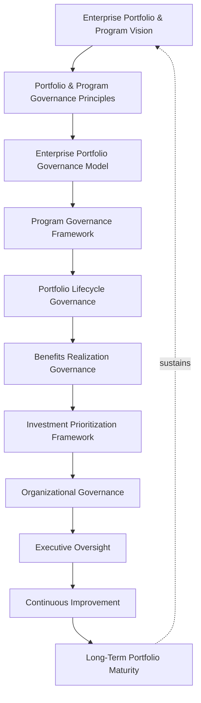
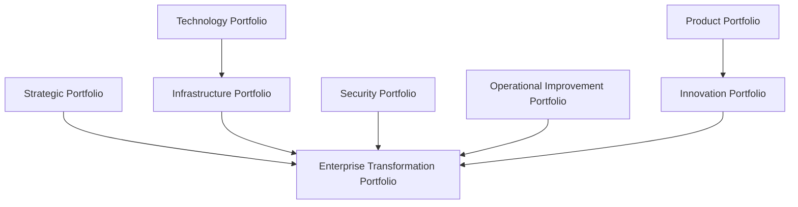
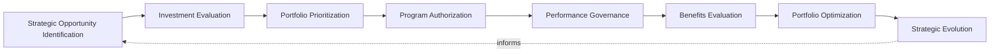
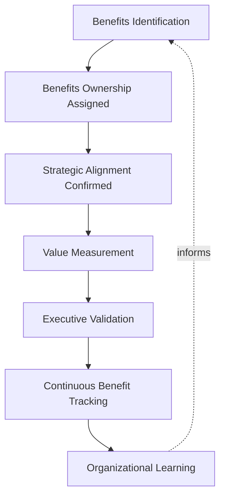
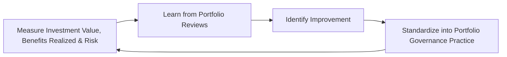
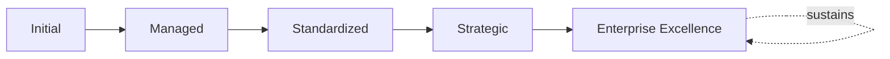

# Enterprise Portfolio & Program Governance Framework

## 1. Executive Summary

**Purpose** — This document defines the official Enterprise Portfolio & Program Governance Framework for **StackLeo Tech Store**. It establishes portfolio governance, program governance, strategic investment oversight, benefits realization, organizational accountability, executive oversight, continuous improvement, and long-term portfolio maturity as a deliberate, accountable enterprise discipline. `project-governance-strategy.md` anticipated this framework directly (Related Documents) as the dedicated governance treatment of Cross-Functional Programs (Section 4) and portfolio-level prioritization. This framework does not restate that strategy's individual project governance model. It governs the layer above a single project — how StackLeo's collection of projects is coordinated as a coherent investment portfolio, and how a group of related projects is governed together as a single program.

**Scope** — This framework applies to every category of portfolio and program at StackLeo — strategic, product, technology, innovation, infrastructure, security, operational improvement, and enterprise transformation portfolios, and their corresponding programs — coordinated with `project-governance-strategy.md`, `project-lifecycle-framework.md`, `enterprise-architecture-strategy.md`, and `01_Business/business-model.md`.

**Strategic Objectives** — To ensure StackLeo's investment across every project is genuinely coordinated as a coherent portfolio, never managed as disconnected, competing efforts; that related projects sharing a common business outcome are governed together as a single program; that investment is prioritized by genuine strategic value, not by whoever asks loudest; and that executive leadership has continuous, honest visibility into the organization's portfolio and program performance.

**Business Value** — A governed portfolio and program framework protects StackLeo from the disproportionate cost of investing in projects that compete for the same limited capacity without coordination, protects the coherence of programs whose component projects must genuinely succeed together, and gives leadership the confidence to make ambitious, coordinated investment because its governance is demonstrably sound.

**Intended Audience** — The Board of Directors, executive leadership, the Portfolio Governance Board, the Chief Technology Officer, PMO leadership, program managers, product leadership, engineering leadership, finance leadership, and business stakeholders.

## 2. Enterprise Portfolio & Program Vision

- **Portfolio Management as Strategic Capability** — the portfolio is governed as a genuine strategic capability, never merely a list of concurrently running projects.
- **Programs as Business Transformation** — a program exists to deliver a genuine, coordinated business transformation, never merely a grouping label for related projects.
- **Investment Value Optimization** — the portfolio is governed to genuinely optimize the business value StackLeo's limited investment capacity produces.
- **Strategic Alignment** — every portfolio and program remains genuinely connected to StackLeo's broader business strategy.
- **Organizational Agility** — portfolio governance enables the organization to respond quickly to genuine opportunity, never constrains it unnecessarily.
- **Sustainable Growth** — the portfolio is governed to evolve deliberately alongside the business, never allowed to accumulate unmanaged sprawl.
- **Long-Term Enterprise Success** — portfolio and program governance is pursued as a durable discipline supporting genuine, sustained enterprise success.

### Enterprise Portfolio & Program Vision Matrix

| Vision Element | Focus | Business Value |
|---|---|---|
| Portfolio Management as Strategic Capability | A genuine strategic capability, not a project list | Prevents the portfolio from being managed as disconnected work |
| Programs as Business Transformation | Delivering genuine, coordinated transformation | Prevents programs from being merely a grouping label |
| Investment Value Optimization | Genuinely optimizing the value limited capacity produces | Directs investment toward what genuinely matters most |
| Strategic Alignment | Genuinely connected to broader business strategy | Ensures investment is directed by genuine business intent |
| Organizational Agility | Enabling, not unnecessarily constraining, rapid response | Protects the business's ability to move quickly when it matters |
| Sustainable Growth | Evolving deliberately, never accumulating unmanaged sprawl | Keeps the portfolio genuinely manageable as it grows |
| Long-Term Enterprise Success | A durable discipline supporting sustained success | Converts portfolio governance into genuine competitive advantage |

*Diagram 1: Enterprise Portfolio & Program Governance Framework — the vision establishes principles and the portfolio governance model, flowing through program governance, lifecycle governance, and benefits realization into investment prioritization, organizational governance, and executive oversight, with continuous improvement driving long-term maturity that reinforces the vision itself.*

## 3. Portfolio & Program Governance Principles

Portfolio and program governance at StackLeo rests on nine principles, each producing a specific business outcome.

- **Strategic Alignment** — every portfolio investment remains genuinely connected to StackLeo's broader business strategy. *Business Value:* ensures investment capacity is spent on what genuinely matters to the business.
- **Business Value First** — a portfolio decision is justified by the genuine business value it creates, never pursued for technical interest alone. *Business Value:* prevents investment disconnected from genuine business intent.
- **Investment Discipline** — portfolio investment is deliberately, consistently governed, never allocated informally or by default. *Business Value:* protects limited investment capacity from being spent without genuine deliberation.
- **Governance Transparency** — portfolio and program decisions are documented and visible to those who genuinely need them. *Business Value:* allows decisions to be scrutinized and defended, not merely trusted on faith.
- **Executive Accountability** — the organization's most consequential portfolio decisions are made or ratified at the executive level. *Business Value:* ensures the organization's most consequential investment decisions carry commensurate scrutiny.
- **Risk-Aware Decision Making** — portfolio decisions are made with genuine, explicit awareness of the risk they carry. *Business Value:* prevents portfolio risk from accumulating unexamined.
- **Continuous Improvement** — portfolio governance practice matures over time, informed by real portfolio and program outcomes. *Business Value:* keeps governance aligned with the organization's growing scale and complexity.
- **Benefits Realization** — a portfolio investment's genuine business value is confirmed to have actually been realized, never merely assumed. *Business Value:* ensures the investment's genuine outcome is honestly assessed.
- **Enterprise Collaboration** — portfolio and program governance is genuinely coordinated across every affected business function. *Business Value:* prevents a program's component projects from succeeding individually while the program itself fails.

### Portfolio & Program Governance Principles Matrix

| Principle | Description | Business Value |
|---|---|---|
| Strategic Alignment | Every investment genuinely connected to business strategy | Ensures capacity is spent on what genuinely matters |
| Business Value First | Justified by genuine business value, not technical interest | Prevents investment disconnected from genuine business intent |
| Investment Discipline | Deliberately, consistently governed, never informal | Protects capacity from being spent without genuine deliberation |
| Governance Transparency | Decisions documented and visible to those who need them | Allows decisions to be scrutinized and defended |
| Executive Accountability | Most consequential decisions made or ratified at the top | Ensures commensurate scrutiny for consequential decisions |
| Risk-Aware Decision Making | Decisions made with explicit awareness of carried risk | Prevents portfolio risk from accumulating unexamined |
| Continuous Improvement | Practice matures from real portfolio and program outcomes | Keeps governance aligned with growing scale and complexity |
| Benefits Realization | Genuine business value confirmed as actually realized | Ensures the investment's genuine outcome is honestly assessed |
| Enterprise Collaboration | Genuinely coordinated across every affected function | Prevents individual project success while the program fails |

## 4. Enterprise Portfolio Governance Model

Portfolio governance operates across eight conceptual categories, each holding accountability for a distinct investment area.

### Strategic Portfolio

- **Purpose** — govern the collection of investments with the most consequential, long-term effect on business direction.
- **Governance Scope** — coordinated with Strategic Initiatives (`project-governance-strategy.md`, Section 4).
- **Business Value** — protects the coherence of the organization's most significant strategic bets.
- **Executive Expectations** — leadership expects the strategic portfolio to be reviewed with the highest rigor in this model.

### Product Portfolio

- **Purpose** — govern the collection of investments delivering product capability.
- **Governance Scope** — coordinated with `02_Product/product-roadmap.md`.
- **Business Value** — protects the coherence of product investment across the platform.
- **Executive Expectations** — leadership expects the product portfolio to remain genuinely connected to customer need.

### Technology Portfolio

- **Purpose** — govern the collection of investments in technology adoption, standardization, and retirement.
- **Governance Scope** — coordinated with `03_System_Design/technology-governance.md`.
- **Business Value** — protects the coherence of the organization's technology investment.
- **Executive Expectations** — leadership expects the technology portfolio to reflect deliberate, coordinated choices.

### Innovation Portfolio

- **Purpose** — govern the collection of investments in deliberate experimentation with new approaches.
- **Governance Scope** — coordinated with Innovation Governance (`03_System_Design/technology-governance.md`, Section 9).
- **Business Value** — protects the organization's ability to responsibly pursue genuine opportunity.
- **Executive Expectations** — leadership expects the innovation portfolio to be evaluated deliberately, never carelessly funded.

### Infrastructure Portfolio

- **Purpose** — govern the collection of investments affecting the platform's underlying technical foundation.
- **Governance Scope** — coordinated with `03_System_Design/enterprise-architecture-strategy.md`.
- **Business Value** — protects the foundation every other portfolio category ultimately depends on.
- **Executive Expectations** — leadership expects the infrastructure portfolio to be governed with consistent rigor regardless of scale.

### Security Portfolio

- **Purpose** — govern the collection of investments delivering security capability, jointly with, and never superseding, `security-strategy.md`.
- **Governance Scope** — coordinated with `06_Security/security-governance.md`.
- **Business Value** — protects StackLeo's core trust differentiator through genuinely governed security investment.
- **Executive Expectations** — leadership expects the security portfolio to be treated as mandatory, non-negotiable priority.

### Operational Improvement Portfolio

- **Purpose** — govern the collection of investments improving genuine day-to-day operational capability.
- **Governance Scope** — coordinated with `09_Operations/operations-strategy.md`.
- **Business Value** — protects the organization's ability to genuinely operate more effectively over time.
- **Executive Expectations** — leadership expects the operational improvement portfolio to demonstrate genuine, measurable improvement.

### Enterprise Transformation Portfolio

- **Purpose** — govern the synthesized, executive-relevant picture of the organization's most significant transformation investment across every category above.
- **Governance Scope** — oversight exclusively accountable for converging every category above into one coherent enterprise picture.
- **Business Value** — protects leadership's ability to understand overall portfolio posture as a whole.
- **Executive Expectations** — leadership expects one coherent portfolio picture, not eight disconnected category views.

### Portfolio Governance Matrix

| Domain | Purpose | Business Value | Executive Expectations |
|---|---|---|---|
| Strategic Portfolio | Govern investments with the most consequential effect | Protects coherence of the organization's most significant bets | Expects the highest rigor in this model |
| Product Portfolio | Govern investments delivering product capability | Protects coherence of product investment | Expects genuine connection to customer need |
| Technology Portfolio | Govern investments in technology adoption and retirement | Protects coherence of the organization's technology investment | Expects deliberate, coordinated choices |
| Innovation Portfolio | Govern investments in deliberate experimentation | Protects the ability to responsibly pursue opportunity | Expects deliberate, never careless, evaluation |
| Infrastructure Portfolio | Govern investments in the technical foundation | Protects the foundation every other category depends on | Expects consistent rigor regardless of scale |
| Security Portfolio | Govern investments delivering security capability | Protects StackLeo's core trust differentiator | Expects treatment as mandatory, non-negotiable priority |
| Operational Improvement Portfolio | Govern investments improving operational capability | Protects the ability to operate more effectively over time | Expects genuine, measurable improvement |
| Enterprise Transformation Portfolio | Synthesize the enterprise investment picture | Protects leadership's ability to understand posture as a whole | Expects one coherent picture, not disconnected views |

*Diagram 2: Portfolio Governance Model — strategic and technology-driven infrastructure portfolios, product and innovation portfolios, and security and operational improvement portfolios all converge on the enterprise transformation portfolio's synthesized picture.*

## 5. Program Governance Framework

Programs are governed across seven conceptual categories, each carrying a distinct governance objective. Remaining implementation independent, this framework governs how a coordinated group of projects is held accountable to a shared outcome — never how individual project tasks are scheduled.

### Strategic Programs

- **Governance Objectives** — coordinate multiple projects delivering a genuinely consequential strategic outcome together.
- **Decision Authority** — the Portfolio Governance Board, escalating to executive leadership.
- **Business Outcomes** — a coherent, genuinely realized strategic transformation.
- **Executive Oversight** — reviewed with the highest rigor in this model.

### Product Programs

- **Governance Objectives** — coordinate multiple projects delivering a genuinely coherent product capability.
- **Decision Authority** — the Portfolio Governance Board, with Product Leadership.
- **Business Outcomes** — a coherent product capability genuinely valued by customers.
- **Executive Oversight** — reviewed against genuine customer and product priority.

### Technology Programs

- **Governance Objectives** — coordinate multiple projects delivering a genuinely coherent technology change.
- **Decision Authority** — the Portfolio Governance Board, with Engineering Leadership.
- **Business Outcomes** — a coherent, genuinely adopted technology change across the portfolio.
- **Executive Oversight** — reviewed against genuine technology portfolio coherence.

### Operational Programs

- **Governance Objectives** — coordinate multiple projects delivering a genuinely coherent operational improvement.
- **Decision Authority** — the Portfolio Governance Board, with Operations Leadership.
- **Business Outcomes** — a coherent, genuinely measurable operational improvement.
- **Executive Oversight** — reviewed against genuine operational performance improvement.

### Compliance Programs

- **Governance Objectives** — coordinate multiple projects delivering genuine regulatory or contractual adherence.
- **Decision Authority** — the Portfolio Governance Board, with Compliance Functions.
- **Business Outcomes** — coherent, genuinely demonstrated compliance across affected domains.
- **Executive Oversight** — reviewed against `06_Security/compliance-governance.md` obligations.

### Transformation Programs

- **Governance Objectives** — coordinate multiple projects delivering the organization's most significant, cross-cutting change.
- **Decision Authority** — executive leadership, coordinated with the Portfolio Governance Board.
- **Business Outcomes** — genuine, sustained enterprise transformation.
- **Executive Oversight** — direct executive engagement, not merely notification.

### Cross-Functional Programs

- **Governance Objectives** — coordinate multiple projects spanning several business functions toward a shared outcome.
- **Decision Authority** — the Portfolio Governance Board, converging every affected function's perspective.
- **Business Outcomes** — a genuinely coherent outcome no single function could deliver alone.
- **Executive Oversight** — reviewed for genuine cross-functional coherence.

### Program Governance Matrix

| Category | Governance Objectives | Decision Authority | Business Outcomes | Executive Oversight |
|---|---|---|---|---|
| Strategic Programs | Coordinate projects delivering a consequential strategic outcome | Portfolio Governance Board, executive leadership | A coherent, genuinely realized strategic transformation | Reviewed with the highest rigor in this model |
| Product Programs | Coordinate projects delivering coherent product capability | Portfolio Governance Board with Product Leadership | Product capability genuinely valued by customers | Reviewed against genuine customer and product priority |
| Technology Programs | Coordinate projects delivering coherent technology change | Portfolio Governance Board with Engineering Leadership | A coherent, genuinely adopted technology change | Reviewed against genuine technology portfolio coherence |
| Operational Programs | Coordinate projects delivering coherent operational improvement | Portfolio Governance Board with Operations Leadership | A coherent, genuinely measurable improvement | Reviewed against genuine performance improvement |
| Compliance Programs | Coordinate projects delivering regulatory or contractual adherence | Portfolio Governance Board with Compliance Functions | Coherent, genuinely demonstrated compliance | Reviewed against compliance obligations |
| Transformation Programs | Coordinate projects delivering the most significant cross-cutting change | Executive leadership with the Portfolio Governance Board | Genuine, sustained enterprise transformation | Direct executive engagement, not merely notification |
| Cross-Functional Programs | Coordinate projects spanning several functions | Portfolio Governance Board converging affected functions | A coherent outcome no single function could deliver alone | Reviewed for genuine cross-functional coherence |

## 6. Portfolio Lifecycle Governance

Portfolio governance operates across eight conceptual lifecycle stages.

- **Strategic Opportunity Identification** — govern how a genuine portfolio-level opportunity is recognized.
- **Investment Evaluation** — govern how an identified opportunity's genuine investment case is evaluated.
- **Portfolio Prioritization** — govern how the organization's limited investment capacity is allocated across genuinely competing opportunities.
- **Program Authorization** — govern how a prioritized investment is formally, deliberately authorized as a program.
- **Performance Governance** — govern how an authorized program's genuine performance is continuously overseen.
- **Benefits Evaluation** — govern how a program's genuine business value realization is confirmed.
- **Portfolio Optimization** — govern how the overall portfolio composition is periodically reassessed for genuine coherence and value.
- **Strategic Evolution** — govern the periodic reassessment of whether portfolio priorities remain aligned with evolving business need.

### Portfolio Lifecycle Matrix

| Stage | Governance Objective | Business Value |
|---|---|---|
| Strategic Opportunity Identification | Recognize a genuine portfolio-level opportunity | Ensures portfolio effort is deliberately directed |
| Investment Evaluation | Evaluate an opportunity's genuine investment case | Protects capacity from being spent on unjustified investment |
| Portfolio Prioritization | Allocate capacity across genuinely competing opportunities | Directs limited investment toward what genuinely matters most |
| Program Authorization | Formally, deliberately authorize as a program | Ensures a program proceeds on a genuine, governed decision |
| Performance Governance | Continuously oversee genuine program performance | Detects delivery issues while they can still be addressed |
| Benefits Evaluation | Confirm genuine business value realization | Ensures the investment's genuine outcome is honestly assessed |
| Portfolio Optimization | Reassess overall composition for coherence and value | Keeps the portfolio genuinely manageable as it grows |
| Strategic Evolution | Reassess alignment with evolving business need | Keeps the portfolio genuinely connected to business intent |

*Diagram 3: Portfolio Lifecycle Governance — opportunity identification and investment evaluation inform portfolio prioritization and program authorization, feeding performance governance and benefits evaluation, with portfolio optimization and strategic evolution feeding lessons back into the cycle.*

## 7. Benefits Realization Governance

- **Benefits Identification** — governs how a portfolio investment's genuine expected benefit is identified before authorization.
- **Benefits Ownership** — governs every identified benefit's traceability to a specific, named, accountable owner.
- **Strategic Alignment** — governs whether an identified benefit remains genuinely connected to StackLeo's business strategy.
- **Value Measurement** — governs how a benefit's genuine realization is measured against its original expectation.
- **Executive Validation** — governs how realized benefits are formally confirmed with executive leadership.
- **Continuous Benefit Tracking** — governs the ongoing, ongoing observation of benefit realization over a program's full lifetime.
- **Organizational Learning** — governs how understanding gained from benefit realization deepens future investment decisions.

### Benefits Realization Matrix

| Governance Area | Focus | Coordination |
|---|---|---|
| Benefits Identification | Genuine expected benefit identified before authorization | Investment Evaluation (Section 6) |
| Benefits Ownership | Traceability to a specific, named, accountable owner | Executive Accountability (Section 3) |
| Strategic Alignment | A benefit remaining genuinely connected to strategy | Strategic Alignment (Section 3) |
| Value Measurement | Genuine realization measured against original expectation | Benefits Evaluation (Section 6) |
| Executive Validation | Realized benefits formally confirmed with leadership | Executive Oversight (Section 11) |
| Continuous Benefit Tracking | Ongoing observation over the program's full lifetime | Performance Governance (Section 6) |
| Organizational Learning | Understanding deepening future investment decisions | Continuous Improvement (Section 3) |

*Diagram 4: Benefits Realization Framework — identified benefits are assigned ownership and confirmed for strategic alignment, measured and validated with executive leadership, tracked continuously, and feeding organizational learning back into future benefit identification.*

## 8. Investment Prioritization Framework

- **Strategic Value** — governs how a candidate investment's genuine contribution to strategic direction is weighed.
- **Customer Value** — governs how a candidate investment's genuine value to customers is weighed.
- **Business Impact** — governs how a candidate investment's genuine business consequence is weighed.
- **Risk Profile** — governs how a candidate investment's genuine risk is weighed against its potential value.
- **Resource Availability** — governs how a candidate investment's genuine resource requirement is weighed against available capacity.
- **Enterprise Alignment** — governs how a candidate investment's genuine coherence with the broader portfolio is weighed.
- **Long-Term Sustainability** — governs how a candidate investment's genuine long-term sustainability is weighed.

### Investment Prioritization Matrix

| Prioritization Factor | Focus | Governance Coordination |
|---|---|---|
| Strategic Value | Genuine contribution to strategic direction | Strategic Portfolio (Section 4) |
| Customer Value | Genuine value to customers | Product Portfolio (Section 4) |
| Business Impact | Genuine business consequence | Business Value First (Section 3) |
| Risk Profile | Genuine risk weighed against potential value | Portfolio Risk Governance (Section 10) |
| Resource Availability | Genuine resource requirement against capacity | Investment Discipline (Section 3) |
| Enterprise Alignment | Genuine coherence with the broader portfolio | Enterprise Transformation Portfolio (Section 4) |
| Long-Term Sustainability | Genuine long-term sustainability | Sustainable Growth (Section 2) |

## 9. Organizational Governance

Governance accountability is distributed deliberately across ten organizational roles.

- **Board of Directors** — holds ultimate accountability for whether StackLeo's portfolio genuinely serves the business's long-term direction.
- **Executive Leadership** — holds accountability for whether portfolio decisions genuinely align with business strategy, in partnership with the Board.
- **Portfolio Governance Board** — owns the operational execution of Portfolio Lifecycle Governance (Section 6) and Investment Prioritization (Section 8).
- **Chief Technology Officer** — owns the coherence and enforcement of this framework across every technology-related portfolio domain.
- **PMO Leadership** — owns the coordination of Program Governance (Section 5) across the organization.
- **Program Managers** — own the day-to-day coordination of a specific program's component projects.
- **Product Leadership** — own the Product Portfolio (Section 4) alignment with genuine customer and product priority.
- **Engineering Leadership** — own the Technology and Infrastructure Portfolios (Section 4) within their accountable teams.
- **Finance Leadership** — own Investment Evaluation (Section 6) financial rigor and Resource Availability (Section 8).
- **Business Stakeholders** — own Benefits Identification (Section 7) input for portfolio investments affecting their domain.

### Organizational Responsibility Matrix

| Role | Governance Objective | Business Value |
|---|---|---|
| Board of Directors | Hold ultimate accountability for the portfolio serving business direction | Provides the highest point of ultimate accountability |
| Executive Leadership | Hold accountability for decisions aligning with business strategy | Provides a single point of executive-level accountability |
| Portfolio Governance Board | Own operational execution of lifecycle and prioritization | Provides a dedicated, cross-functional governance body |
| Chief Technology Officer | Own coherence and enforcement across technology-related domains | Provides a single point of specialist accountability |
| PMO Leadership | Own coordination of program governance | Ensures programs are genuinely, consistently coordinated |
| Program Managers | Own day-to-day coordination of program component projects | Embeds accountability closest to where programs are delivered |
| Product Leadership | Own product portfolio alignment with priority | Ensures the portfolio reflects genuine product and customer value |
| Engineering Leadership | Own technology and infrastructure portfolios | Embeds accountability closest to where technology is delivered |
| Finance Leadership | Own investment evaluation rigor and resource availability | Ensures investment decisions reflect genuine financial discipline |
| Business Stakeholders | Own benefits identification input for their domain | Connects portfolio investment to genuine business relevance |

## 10. Portfolio Risk Governance

Portfolio-related risk is governed across eight conceptual categories.

- **Investment Risks** — the risk that a portfolio investment fails to genuinely deliver its expected value.
- **Portfolio Concentration Risks** — the risk that investment capacity is genuinely over-concentrated in a single category, leaving the portfolio imbalanced.
- **Strategic Risks** — the risk that a portfolio investment fails to deliver, or actively undermines, genuine strategic value.
- **Delivery Risks** — the risk that a program cannot be adequately delivered against its authorized scope.
- **Financial Risks** — the risk that a portfolio investment's genuine cost exceeds its authorized commitment.
- **Technology Risks** — the risk that a portfolio investment's technology choices fail to genuinely serve long-term needs.
- **Dependency Risks** — the risk that a program's component projects fail to genuinely coordinate, undermining the program's shared outcome.
- **Reputation Risks** — the risk that a portfolio or program failure damages StackLeo's standing with customers, partners, or the market.

### Portfolio Risk Matrix

| Risk Category | Focus | Governance Coordination |
|---|---|---|
| Investment Risks | Failure to genuinely deliver expected value | Coordinated with Investment Evaluation (Section 6) |
| Portfolio Concentration Risks | Capacity genuinely over-concentrated in a category | Coordinated with Enterprise Alignment (Section 8) |
| Strategic Risks | Failure to deliver, or undermining, genuine strategic value | Coordinated with Strategic Portfolio (Section 4) |
| Delivery Risks | Inability to adequately deliver against authorized scope | Coordinated with Performance Governance (Section 6) |
| Financial Risks | Genuine cost exceeding authorized commitment | Coordinated with Finance Leadership (Section 9) |
| Technology Risks | Technology choices failing to serve long-term needs | Coordinated with Technology Portfolio (Section 4) |
| Dependency Risks | Component projects failing to genuinely coordinate | Coordinated with Cross-Functional Programs (Section 5) |
| Reputation Risks | Damage to standing with customers, partners, market | Coordinated with Executive Oversight (Section 11) |

## 11. Executive Oversight

- **Portfolio Reviews** — the overall coherence of the portfolio is formally reviewed on a regular cadence.
- **Program Performance Reviews** — the performance of active programs is reviewed directly with executive leadership.
- **Investment Reviews** — the organization's investment decisions are reviewed for genuine, continued justification.
- **Strategic Alignment Reviews** — the portfolio's continued alignment with genuine business strategy is periodically reviewed.
- **Benefits Realization Reviews** — the genuine business value realized by closed programs is reviewed with executive leadership.
- **Continuous Improvement Reviews** — the organization's follow-through on captured portfolio governance lessons is reviewed directly with executive leadership.

### Executive Oversight Matrix

| Oversight Mechanism | Purpose | Governance Role |
|---|---|---|
| Portfolio Reviews | Confirm overall portfolio coherence | Regular, predictable cadence for the framework as a whole |
| Program Performance Reviews | Review performance of active programs | Direct executive-level program performance review |
| Investment Reviews | Review investment decisions for continued justification | Prevents a stale investment from persisting unexamined |
| Strategic Alignment Reviews | Review continued alignment with business strategy | Periodic executive-level alignment review |
| Benefits Realization Reviews | Review genuine value realized by closed programs | Direct executive-level value realization review |
| Continuous Improvement Reviews | Review follow-through on captured lessons | Direct executive-level review of improvement completion |

## 12. Future Readiness

This framework is designed to remain valid as StackLeo evolves in scale, geography, and organizational complexity.

- **AI-Assisted Portfolio Governance** — as investment evaluation increasingly incorporates AI-assisted methods, coordinated with `04_Database/ai-governance.md`, it remains governed under Investment Evaluation (Section 6) at the same rigor as any other method.
- **Intelligent Investment Decisions** — where portfolio prioritization increasingly draws on intelligent pattern analysis, that analysis remains subject to the same Portfolio Prioritization discipline (Section 6) as any other method.
- **Predictive Portfolio Analytics** — where the organization develops the capability to anticipate a portfolio risk before it fully materializes, that capability is governed as an extension of Performance Governance (Section 6).
- **Adaptive Enterprise Programs** — where program governance increasingly adapts to genuinely changing conditions, that evolution remains governed under Continuous Improvement (Section 3) at the same rigor as any other method.
- **Digital Transformation Governance** — Transformation Programs (Section 5) remain the governed mechanism through which StackLeo's most significant digital transformation is coordinated.
- **Continuous Enterprise Evolution** — Strategic Opportunity Identification and Portfolio Optimization (Section 6) are structured to be re-applied as StackLeo expands from Bangladesh into South Asia and global markets.

## 13. Portfolio & Program Maturity Model

Portfolio and program governance maturity is described across five conceptual levels.

- **Initial** — portfolio governance, where it exists, is informal and inconsistent; investment decisions are made reactively, and ownership is unclear.
- **Managed** — basic portfolio governance exists for individual categories, but consistency across the eight domains in Section 4 varies significantly.
- **Standardized** — the governance model, domains, and lifecycle are standardized, documented, and consistently applied across the organization.
- **Strategic** — portfolio decisions are genuinely and routinely made in deliberate service of business strategy, not delivery convenience.
- **Enterprise Excellence** — portfolio governance is continuously and deliberately improved based on quantitative evidence and organizational learning; investment capability functions as a genuine, sustained source of enterprise excellence.

### Portfolio & Program Maturity Matrix

| Level | Characteristics | Primary Focus |
|---|---|---|
| Initial | Informal, inconsistent governance; decisions made reactively | Ad hoc, individually-dependent portfolio practice |
| Managed | Basic governance exists per domain; consistency varies | Domain-level consistency |
| Standardized | Standardized governance model, domains, and lifecycle | Organization-wide consistency and clear ownership |
| Strategic | Decisions genuinely and routinely made in service of strategy | Business-strategy-driven investment decision-making |
| Enterprise Excellence | Practice continuously improved; investment as competitive advantage | Sustained, deliberate, enterprise-wide investment excellence |

*Diagram 5: Continuous Portfolio Improvement Cycle — investment value, realized benefits, and risk exposure are measured, learned from, improved upon, and standardized back into governed practice, on a continuing basis.*

*Diagram 6: Portfolio & Program Maturity Progression — maturity advances from informal, reactively-decided portfolio practice toward standardized, genuinely strategy-driven, and continuously excellent enterprise portfolio and program governance.*

## 14. Portfolio & Program Anti-Patterns

- **Projects Without Portfolio Alignment** — a project pursued without genuine connection to the broader portfolio wastes investment on what does not genuinely coordinate.
- **Programs Without Governance** — a program pursued without genuine governance review accepts avoidable exposure without an accountable decision.
- **Weak Investment Discipline** — allocating capacity informally, without genuine deliberation, wastes limited investment capacity.
- **Benefits Without Ownership** — an identified benefit with no accountable owner is never genuinely confirmed as realized.
- **Poor Executive Visibility** — leadership lacking genuine portfolio visibility cannot make informed investment decisions.
- **Reactive Prioritization** — prioritizing investment only in response to pressure, without genuine deliberation, produces incoherent portfolio composition.
- **Siloed Portfolio Management** — managing portfolio categories independently, without genuine cross-domain coordination, prevents one coherent enterprise picture.
- **No Continuous Optimization** — treating current portfolio composition as permanently finished guarantees it falls behind the organization's growing scale and complexity.

### Anti-Pattern Summary

| Anti-Pattern | Organizational & Business Impact |
|---|---|
| Projects Without Portfolio Alignment | Wastes investment on what does not genuinely coordinate |
| Programs Without Governance | Accepts avoidable exposure without an accountable decision |
| Weak Investment Discipline | Wastes limited investment capacity through informal allocation |
| Benefits Without Ownership | Leaves benefits never genuinely confirmed as realized |
| Poor Executive Visibility | Prevents informed investment decisions |
| Reactive Prioritization | Produces incoherent, pressure-driven portfolio composition |
| Siloed Portfolio Management | Prevents one coherent, organization-wide investment picture |
| No Continuous Optimization | Guarantees the portfolio falls behind growing scale and complexity |

## Related Documents

| Document | Relationship |
|---|---|
| `project-governance-strategy.md` | Anticipated this framework by name; sets the individual project governance model this framework's Program Governance (Section 5) coordinates as a portfolio. |
| `project-lifecycle-framework.md` | Elaborates the phase and stage-gate discipline individual projects within a program follow. |
| `resource-capacity-governance.md` | Governs how delivery capacity is allocated across Portfolio Prioritization (Section 6). |
| `stakeholder-engagement-framework.md` | Governs stakeholder involvement across programs and the portfolio. |
| `project-risk-governance.md` | Elaborates the project-level risk this framework's Portfolio Risk Governance (Section 10) aggregates. |
| `project-maturity-framework.md` | Consolidates this framework's maturity model (Section 13) into the enterprise-wide project management maturity picture. |
| `03_System_Design/enterprise-architecture-strategy.md` | Sets the enterprise architecture direction this framework's Infrastructure and Technology Portfolios (Section 4) coordinate with. |
| `01_Business/business-model.md` | Establishes the business strategy this framework's Strategic Alignment principle (Section 3) is ultimately measured against. |

## Document Information

| Property | Value |
|----------|-------|
| Document | portfolio-program-governance.md |
| Version | 1.0.0 |
| Status | Active |
| Maintained By | StackLeo |
| Last Updated | 2026-07-29 |

---

© StackLeo. All Rights Reserved.
