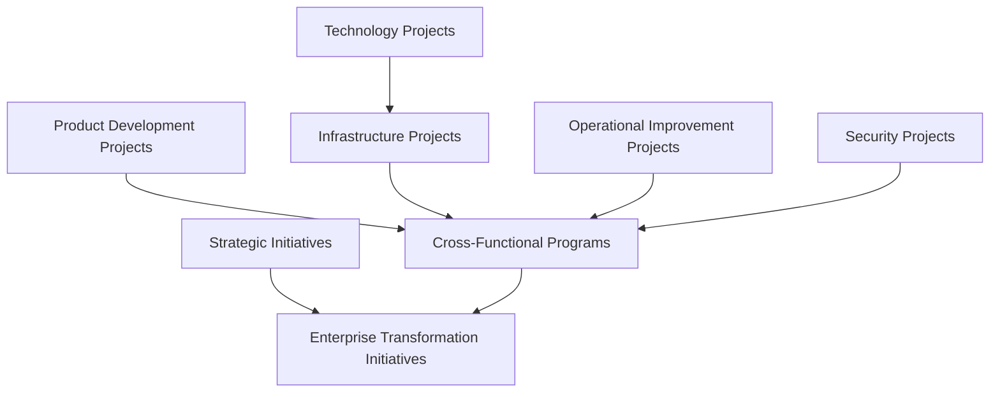
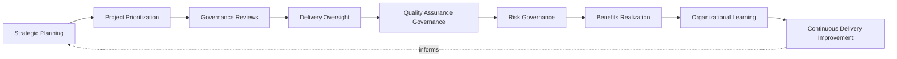
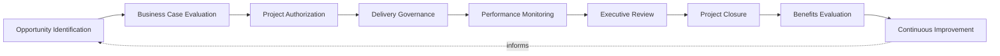
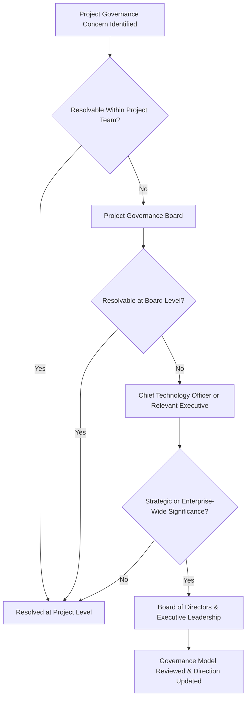
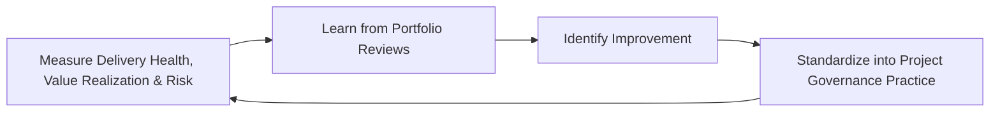
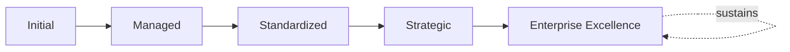

# Enterprise Project Governance Strategy

## 1. Executive Summary

**Purpose** — This document defines the official Enterprise Project Governance Strategy for **StackLeo Tech Store**. It establishes project governance, delivery strategy, organizational accountability, executive oversight, portfolio alignment, continuous improvement, and long-term project management excellence as a deliberate, accountable enterprise discipline. `project-roadmap.md` describes the platform's development phases in concrete, sequential terms; `stakeholders.md` identifies who participates in and is affected by the project. This strategy sits above both as the governance layer that ensures every project StackLeo undertakes — not only the platform's own build — is authorized, delivered, and closed with genuine accountability to business value.

**Scope** — This strategy applies to every category of project at StackLeo — strategic initiatives, product development, technology, operational improvement, security, infrastructure projects, cross-functional programs, and enterprise transformation initiatives — coordinated with `project-roadmap.md`, `stakeholders.md`, `enterprise-architecture-strategy.md`, and `operations-strategy.md`.

**Strategic Objectives** — To ensure every project begins from a genuine business case, never pursued for technical interest alone; that project decisions are made deliberately, by accountable people, against consistent governance; that project risk is proportionately managed before it materializes into delivery failure; and that executive leadership has continuous, honest visibility into the organization's project portfolio and delivery health.

**Business Value** — Governed project delivery protects StackLeo from the disproportionate cost of investment made without genuine business justification, protects the organization's limited delivery capacity from being spread across projects that do not genuinely matter, and gives leadership the confidence to invest in ambitious initiatives because their governance is demonstrably sound.

**Intended Audience** — The Board of Directors, executive leadership, the Project Governance Board, the Chief Technology Officer, product leadership, engineering leadership, operations leadership, security leadership, project leadership, and business stakeholders.

## 2. Enterprise Project Governance Vision

- **Projects as Strategic Business Investments** — every project is governed as a genuine business investment, never merely a technical or operational activity.
- **Governance-Driven Delivery** — delivery is governed deliberately, by accountable people, never left to informal or ad hoc coordination.
- **Business Value Realization** — a project's genuine success is measured by the business value it actually realizes, not merely its completion.
- **Organizational Alignment** — every project remains genuinely connected to StackLeo's broader strategic direction.
- **Customer Value Creation** — projects are ultimately judged by the genuine value they create for customers.
- **Sustainable Delivery Excellence** — delivery capability is pursued as a durable, ongoing discipline, never a one-time improvement initiative.
- **Long-Term Enterprise Growth** — project governance is structured to support StackLeo's growth from single-seller B2C retailer toward corporate sales, wholesale, and marketplace, per `02_Product/product-roadmap.md`.

### Enterprise Project Governance Vision Matrix

| Vision Element | Focus | Business Value |
|---|---|---|
| Projects as Strategic Business Investments | A genuine business investment, not a technical activity | Prevents projects from being treated as low-priority technical work |
| Governance-Driven Delivery | Delivery governed deliberately, by accountable people | Prevents delivery from drifting into informal coordination |
| Business Value Realization | Success measured by genuine value realized | Protects investment from being spent on completion without value |
| Organizational Alignment | Genuinely connected to broader strategic direction | Ensures project investment is directed by business intent |
| Customer Value Creation | Judged by genuine value created for customers | Keeps project delivery connected to what customers value |
| Sustainable Delivery Excellence | A durable discipline, not a one-time improvement | Protects delivery investment from eroding over time |
| Long-Term Enterprise Growth | Supporting growth toward marketplace scale | Ensures governance can genuinely bear future ambition |

## 3. Project Governance Principles

Project governance at StackLeo rests on nine principles, each producing a specific business outcome.

- **Business Value First** — a project is justified by the genuine business value it creates, never pursued for technical interest alone. *Business Value:* prevents project investment disconnected from genuine business intent.
- **Strategic Alignment** — every project remains genuinely connected to StackLeo's broader business strategy. *Business Value:* ensures delivery capacity is spent on what genuinely matters to the business.
- **Clear Accountability** — every project traces to a specific, named, responsible owner. *Business Value:* ensures no project drifts without someone genuinely responsible for its outcome.
- **Decision Transparency** — project decisions and their rationale are documented and visible to those who genuinely need them. *Business Value:* allows project decisions to be scrutinized and defended, not merely trusted on faith.
- **Risk-Aware Delivery** — project decisions are made with genuine, explicit awareness of the risk they carry. *Business Value:* prevents project risk from accumulating unexamined.
- **Quality Governance** — a project's genuine quality is deliberately governed, never assumed adequate by default. *Business Value:* protects the organization from the disproportionate cost of a poorly delivered project.
- **Continuous Improvement** — project governance practice matures over time, informed by real delivery outcomes. *Business Value:* keeps governance aligned with the organization's growing scale and complexity.
- **Stakeholder Engagement** — a project's genuine stakeholders are deliberately identified and engaged throughout, coordinated with `stakeholders.md`. *Business Value:* protects delivery from surprising or excluding those genuinely affected by it.
- **Governance by Evidence** — project decisions are grounded in genuine, documented evidence, not impression alone. *Business Value:* reduces the risk of decisions driven by whoever argues most persuasively rather than genuine evidence.

### Project Governance Principles Matrix

| Principle | Description | Business Value |
|---|---|---|
| Business Value First | Justified by genuine business value, not technical interest | Prevents investment disconnected from genuine business intent |
| Strategic Alignment | Genuinely connected to broader business strategy | Ensures delivery capacity is spent on what genuinely matters |
| Clear Accountability | Every project traces to a specific, responsible owner | Ensures no project drifts without genuine responsibility |
| Decision Transparency | Decisions and rationale documented and visible | Allows decisions to be scrutinized and defended |
| Risk-Aware Delivery | Decisions made with explicit awareness of carried risk | Prevents project risk from accumulating unexamined |
| Quality Governance | Genuine quality deliberately governed, not assumed | Protects against the disproportionate cost of poor delivery |
| Continuous Improvement | Practice matures from real delivery outcomes | Keeps governance aligned with growing scale and complexity |
| Stakeholder Engagement | Genuine stakeholders deliberately identified and engaged | Protects delivery from surprising or excluding those affected |
| Governance by Evidence | Grounded in genuine, documented evidence | Reduces the risk of decisions driven by persuasion alone |

## 4. Enterprise Project Governance Model

Project governance operates across eight conceptual domains, each holding accountability for a distinct category of project.

### Strategic Initiatives

- **Purpose** — govern projects with the most consequential, long-term effect on StackLeo's business direction.
- **Governance Scope** — coordinated with `01_Business/business-model.md` and `02_Product/product-roadmap.md`.
- **Business Value** — protects the coherence of the organization's most significant strategic bets.
- **Executive Expectations** — leadership expects strategic initiatives to be held to the highest governance rigor in this model.

### Product Development Projects

- **Purpose** — govern projects delivering new or enhanced product capability.
- **Governance Scope** — coordinated with `02_Product/product-roadmap.md`.
- **Business Value** — protects the organization's ability to deliver genuine, deliberate product value.
- **Executive Expectations** — leadership expects product projects to remain genuinely connected to customer need.

### Technology Projects

- **Purpose** — govern projects adopting, standardizing, or retiring technology.
- **Governance Scope** — coordinated with `03_System_Design/technology-governance.md`.
- **Business Value** — protects the coherence of the organization's technology portfolio.
- **Executive Expectations** — leadership expects technology projects to be genuinely justified before investment.

### Operational Improvement Projects

- **Purpose** — govern projects improving genuine day-to-day operational capability.
- **Governance Scope** — coordinated with `operations-strategy.md`.
- **Business Value** — protects the organization's ability to genuinely operate more effectively over time.
- **Executive Expectations** — leadership expects operational projects to demonstrate genuine, measurable improvement.

### Security Projects

- **Purpose** — govern projects delivering security capability, jointly with, and never superseding, `security-strategy.md`.
- **Governance Scope** — coordinated with `06_Security/security-governance.md`.
- **Business Value** — protects StackLeo's core trust differentiator through genuinely governed security investment.
- **Executive Expectations** — leadership expects security projects to be treated as mandatory, non-negotiable priority.

### Infrastructure Projects

- **Purpose** — govern projects affecting the platform's underlying technical foundation.
- **Governance Scope** — coordinated with `03_System_Design/enterprise-architecture-strategy.md`.
- **Business Value** — protects the foundation every other project category ultimately depends on.
- **Executive Expectations** — leadership expects infrastructure projects to be governed with consistent rigor regardless of scale.

### Cross-Functional Programs

- **Purpose** — govern a coordinated group of related projects spanning multiple business functions.
- **Governance Scope** — oversight coordinated with every affected domain above.
- **Business Value** — protects the coherence of related projects that must genuinely succeed together.
- **Executive Expectations** — leadership expects cross-functional programs to be governed as a single, coordinated whole, not disconnected projects.

### Enterprise Transformation Initiatives

- **Purpose** — govern the synthesized, executive-relevant picture of the organization's most significant transformation efforts.
- **Governance Scope** — oversight exclusively accountable for converging every category above into executive-relevant strategic view.
- **Business Value** — protects leadership's ability to understand overall transformation posture as a whole.
- **Executive Expectations** — leadership expects direct engagement in enterprise transformation, not merely notification.

### Enterprise Project Governance Matrix

| Domain | Purpose | Business Value | Executive Expectations |
|---|---|---|---|
| Strategic Initiatives | Govern projects with the most consequential business effect | Protects coherence of the organization's most significant bets | Expects the highest governance rigor in this model |
| Product Development Projects | Govern projects delivering new or enhanced product capability | Protects the ability to deliver genuine, deliberate product value | Expects genuine connection to customer need |
| Technology Projects | Govern projects adopting or retiring technology | Protects the coherence of the technology portfolio | Expects genuine justification before investment |
| Operational Improvement Projects | Govern projects improving day-to-day capability | Protects the ability to operate more effectively over time | Expects genuine, measurable improvement |
| Security Projects | Govern projects delivering security capability | Protects StackLeo's core trust differentiator | Expects treatment as mandatory, non-negotiable priority |
| Infrastructure Projects | Govern projects affecting the technical foundation | Protects the foundation every other category depends on | Expects consistent rigor regardless of scale |
| Cross-Functional Programs | Govern coordinated groups of related projects | Protects coherence of projects that must succeed together | Expects governance as a single, coordinated whole |
| Enterprise Transformation Initiatives | Synthesize the most significant transformation efforts | Protects leadership's ability to understand posture as a whole | Expects direct engagement, not merely notification |

*Diagram 1: Enterprise Project Governance Framework — strategic initiatives feed enterprise transformation initiatives directly, while product development, technology and infrastructure, operational improvement, and security projects all converge through cross-functional programs into enterprise transformation.*

## 5. Project Governance Capability Framework

Project governance capability is governed across nine conceptual domains, each requiring a distinct governance emphasis. Remaining implementation independent, these domains describe capability — never a specific methodology, tool, or workflow.

- **Strategic Planning** — governs how project investment is deliberately planned in service of genuine business strategy.
- **Project Prioritization** — governs how the organization's limited delivery capacity is allocated across genuinely competing projects.
- **Governance Reviews** — governs how a project is periodically, formally reviewed against its defined governance expectations.
- **Delivery Oversight** — governs how a project's genuine delivery progress is tracked and confirmed.
- **Quality Assurance Governance** — governs how a project's genuine quality is confirmed, coordinated with `08_Quality_Assurance/qa-governance.md`.
- **Risk Governance** — governs how a project's genuine risk is identified, weighed, and addressed.
- **Benefits Realization** — governs how a project's genuine business value is confirmed to have actually been realized.
- **Organizational Learning** — governs how understanding gained from a project deepens the organization's genuine collective capability.
- **Continuous Delivery Improvement** — governs how project delivery practice deliberately matures from real outcomes.

### Governance Capability Matrix

| Capability | Governance Focus | Coordination |
|---|---|---|
| Strategic Planning | Investment planned in service of genuine business strategy | Enterprise Project Governance Vision (Section 2) |
| Project Prioritization | Limited capacity allocated across genuinely competing projects | Strategic Alignment (Section 3) |
| Governance Reviews | Periodic, formal review against governance expectations | Project Lifecycle Governance (Section 6) |
| Delivery Oversight | Genuine delivery progress tracked and confirmed | Decision Governance Framework (Section 7) |
| Quality Assurance Governance | Genuine quality confirmed | `08_Quality_Assurance/qa-governance.md` |
| Risk Governance | Genuine risk identified, weighed, and addressed | Project Risk Governance (Section 9) |
| Benefits Realization | Genuine business value confirmed as realized | Business Value Realization (Section 2) |
| Organizational Learning | Understanding deepening genuine collective capability | Continuous Improvement (Section 3) |
| Continuous Delivery Improvement | Practice deliberately maturing from real outcomes | Continuous Delivery Improvement coordinated with Section 12 |

*Diagram 2: Project Governance Capability Model — strategic planning and prioritization inform governance reviews and delivery oversight, feeding quality assurance and risk governance, with benefits realization, organizational learning, and continuous improvement feeding lessons back into strategic planning.*

## 6. Project Lifecycle Governance

Project governance operates across nine conceptual lifecycle stages.

- **Opportunity Identification** — govern how a genuine project opportunity is recognized before it is formally proposed.
- **Business Case Evaluation** — govern how an identified opportunity's genuine business value is established.
- **Project Authorization** — govern how a justified opportunity is formally, deliberately authorized to proceed.
- **Delivery Governance** — govern how an authorized project's execution is genuinely overseen.
- **Performance Monitoring** — govern how a project's genuine progress and health are continuously observed.
- **Executive Review** — govern the point at which a project's status requires executive-level visibility.
- **Project Closure** — govern how a project is formally, deliberately closed once its work is genuinely complete.
- **Benefits Evaluation** — govern how a closed project's genuine business value realization is confirmed.
- **Continuous Improvement** — govern how project delivery practice is deliberately strengthened based on real outcomes.

### Project Lifecycle Matrix

| Stage | Governance Objective | Business Value |
|---|---|---|
| Opportunity Identification | Recognize a genuine opportunity before proposal | Ensures project effort is deliberately directed |
| Business Case Evaluation | Establish genuine business value | Protects investment from being spent on unjustified projects |
| Project Authorization | Formally, deliberately authorize to proceed | Ensures a project proceeds on a genuine, governed decision |
| Delivery Governance | Genuinely oversee execution | Protects against delivery drifting without genuine oversight |
| Performance Monitoring | Continuously observe genuine progress and health | Detects delivery issues while they can still be addressed |
| Executive Review | Elevate status requiring executive-level visibility | Engages leadership exactly when genuinely warranted |
| Project Closure | Formally, deliberately close once genuinely complete | Prevents a project from lingering without a genuine end |
| Benefits Evaluation | Confirm genuine business value realization | Ensures the investment's genuine outcome is honestly assessed |
| Continuous Improvement | Strengthen practice from real outcomes | Keeps delivery practice compounding in capability |

*Diagram 3: Project Lifecycle Governance — opportunity identification and business case evaluation inform authorization and delivery governance, feeding performance monitoring and executive review, with closure, benefits evaluation, and continuous improvement feeding lessons back into the cycle.*

## 7. Decision Governance Framework

- **Investment Decisions** — governs how a decision to commit resources to a project is made deliberately, by accountable people.
- **Scope Decisions** — governs how a decision affecting a project's defined scope is deliberately reviewed and approved.
- **Priority Decisions** — governs how a decision affecting relative project priority is made against genuine business consequence.
- **Risk Acceptance** — governs how a project's residual risk is deliberately, explicitly accepted by an accountable party.
- **Change Decisions** — governs how a decision to change an authorized project's direction is deliberately reviewed and approved.
- **Executive Escalation** — governs the threshold at which a project decision genuinely requires executive-level involvement.
- **Organizational Accountability** — governs how every decision remains genuinely traceable to the party who made it.

### Decision Governance Matrix

| Governance Area | Focus | Coordination |
|---|---|---|
| Investment Decisions | Committing resources made deliberately, by accountable people | Project Authorization (Section 6) |
| Scope Decisions | Scope changes deliberately reviewed and approved | Delivery Governance (Section 6) |
| Priority Decisions | Relative priority weighed against genuine business consequence | Project Prioritization (Section 5) |
| Risk Acceptance | Residual risk deliberately, explicitly accepted | Project Risk Governance (Section 9) |
| Change Decisions | Direction changes deliberately reviewed and approved | Delivery Governance (Section 6) |
| Executive Escalation | Threshold requiring executive-level involvement | Executive Oversight (Section 10) |
| Organizational Accountability | Every decision genuinely traceable to its maker | Clear Accountability (Section 3) |

## 8. Organizational Governance

Governance accountability is distributed deliberately across ten organizational roles.

- **Board of Directors** — holds ultimate accountability for whether StackLeo's project portfolio genuinely serves the business's long-term direction.
- **Executive Leadership** — holds accountability for whether project decisions genuinely align with business strategy, in partnership with the Board.
- **Project Governance Board** — owns the operational execution of Project Lifecycle Governance (Section 6) and Decision Governance (Section 7).
- **Chief Technology Officer** — owns the coherence and enforcement of this strategy across every technology-related project domain.
- **Product Leadership** — own Product Development Projects (Section 4) alignment with genuine customer and product priority.
- **Engineering Leadership** — own Technology and Infrastructure Projects (Section 4) within their accountable teams.
- **Operations Leadership** — own Operational Improvement Projects (Section 4) in coordination with `operations-strategy.md`.
- **Security Leadership** — own Security Projects (Section 4) jointly with `security-strategy.md`.
- **Project Leadership** — own the day-to-day Delivery Governance (Section 6) of individual projects.
- **Business Stakeholders** — own Business Case Evaluation (Section 6) input for projects affecting their domain.

### Organizational Responsibility Matrix

| Role | Governance Objective | Business Value |
|---|---|---|
| Board of Directors | Hold ultimate accountability for the portfolio serving business direction | Provides the highest point of ultimate accountability |
| Executive Leadership | Hold accountability for decisions aligning with business strategy | Provides a single point of executive-level accountability |
| Project Governance Board | Own operational execution of lifecycle and decision governance | Provides a dedicated, cross-functional governance body |
| Chief Technology Officer | Own coherence and enforcement across technology-related projects | Provides a single point of specialist accountability |
| Product Leadership | Own product development projects alignment with priority | Ensures projects reflect genuine product and customer value |
| Engineering Leadership | Own technology and infrastructure projects | Embeds accountability closest to where projects are delivered |
| Operations Leadership | Own operational improvement projects | Ensures projects genuinely support operational sustainability |
| Security Leadership | Own security projects jointly with security strategy | Ensures security investment is never treated as optional |
| Project Leadership | Own day-to-day delivery governance | Ensures projects are genuinely, continuously overseen |
| Business Stakeholders | Own business case input for projects in their domain | Connects projects to genuine business relevance |

*Diagram 4: Enterprise Project Governance Structure — a governance concern identified at the project level escalates through the Project Governance Board and relevant executive only as far as genuinely required, reaching the Board and executive leadership for strategic or enterprise-wide significance.*

## 9. Project Risk Governance

Project-related risk is governed across eight conceptual categories.

- **Strategic Risks** — the risk that a project fails to deliver, or actively undermines, genuine strategic value.
- **Delivery Risks** — the risk that a project cannot be adequately delivered against its authorized scope.
- **Budget Risks** — the risk that a project's genuine cost exceeds its authorized investment without deliberate approval.
- **Schedule Risks** — the risk that a project's genuine delivery timeline slips beyond what stakeholders were led to expect.
- **Quality Risks** — the risk that a project's output fails to meet its genuine quality expectation.
- **Technology Risks** — the risk that a project's technology choices fail to genuinely serve its long-term needs.
- **Stakeholder Risks** — the risk that a project genuinely fails to engage or satisfy the stakeholders it affects.
- **Reputation Risks** — the risk that a project's failure or mishandling damages StackLeo's standing with customers, partners, or the market.

### Project Risk Matrix

| Risk Category | Focus | Governance Coordination |
|---|---|---|
| Strategic Risks | Failure to deliver, or undermining, genuine strategic value | Coordinated with Strategic Initiatives (Section 4) |
| Delivery Risks | Inability to adequately deliver against authorized scope | Coordinated with Delivery Governance (Section 6) |
| Budget Risks | Genuine cost exceeding authorized investment | Coordinated with Investment Decisions (Section 7) |
| Schedule Risks | Delivery timeline slipping beyond stakeholder expectation | Coordinated with Performance Monitoring (Section 6) |
| Quality Risks | Output failing to meet genuine quality expectation | Coordinated with Quality Assurance Governance (Section 5) |
| Technology Risks | Technology choices failing to serve long-term needs | Coordinated with Technology Projects (Section 4) |
| Stakeholder Risks | Genuine failure to engage or satisfy affected stakeholders | Coordinated with `stakeholders.md` |
| Reputation Risks | Damage to standing with customers, partners, market | Coordinated with Executive Oversight (Section 10) |

## 10. Executive Oversight

- **Portfolio Reviews** — the overall coherence of the project portfolio is formally reviewed on a regular cadence.
- **Strategic Delivery Reviews** — the delivery of the organization's most strategic projects is reviewed directly with executive leadership.
- **Project Health Reviews** — the genuine health of active projects is reviewed as a distinct, ongoing concern.
- **Business Value Reviews** — the genuine business value realized by closed projects is reviewed with executive leadership.
- **Risk Reviews** — the organization's project-related risk posture is reviewed directly with executive leadership.
- **Continuous Improvement Reviews** — the organization's follow-through on captured project governance lessons is reviewed directly with executive leadership.

### Executive Oversight Matrix

| Oversight Mechanism | Purpose | Governance Role |
|---|---|---|
| Portfolio Reviews | Confirm overall project portfolio coherence | Regular, predictable cadence for the strategy as a whole |
| Strategic Delivery Reviews | Review delivery of the most strategic projects | Direct executive-level review of strategic delivery |
| Project Health Reviews | Review genuine health of active projects | Treats project health as ongoing, not assumed |
| Business Value Reviews | Review genuine business value realized by closed projects | Direct executive-level value realization review |
| Risk Reviews | Review project-related risk posture | Direct executive-level review of risk exposure |
| Continuous Improvement Reviews | Review follow-through on captured lessons | Direct executive-level review of improvement completion |

## 11. Future Readiness

This strategy is designed to remain valid as StackLeo evolves in scale, geography, and organizational complexity.

- **AI-Assisted Project Governance** — as delivery oversight increasingly incorporates AI-assisted methods, coordinated with `04_Database/ai-governance.md`, it remains governed under Delivery Oversight (Section 5) at the same rigor as any other method.
- **Intelligent Portfolio Decision Support** — where prioritization increasingly draws on intelligent pattern analysis, that analysis remains subject to the same Project Prioritization discipline (Section 5) as any other method.
- **Predictive Delivery Governance** — where the organization develops the capability to anticipate a delivery issue before it fully materializes, that capability is governed as an extension of Performance Monitoring (Section 6).
- **Adaptive Enterprise Delivery** — where delivery practice increasingly adapts to genuinely changing project conditions, that evolution remains governed under Continuous Improvement (Section 3) at the same rigor as any other method.
- **Global Project Governance** — Business Case Evaluation and Project Authorization (Section 6) are structured to be re-applied as StackLeo expands from Bangladesh into South Asia and global markets, each with genuinely distinct project considerations.
- **Continuous Organizational Evolution** — this strategy's governance discipline is treated as a direct, durable contributor to the organization's ability to deliver ambitious initiatives confidently over time.

## 12. Project Governance Maturity Model

Project governance maturity is described across five conceptual levels.

- **Initial** — project governance, where it exists, is informal and inconsistent; decisions are made reactively, and ownership is unclear.
- **Managed** — basic project governance exists for individual domains, but consistency across the eight domains in Section 4 varies significantly.
- **Standardized** — the governance model, domains, and lifecycle are standardized, documented, and consistently applied across the organization.
- **Strategic** — project decisions are genuinely and routinely made in deliberate service of business strategy, not delivery convenience.
- **Enterprise Excellence** — project governance is continuously and deliberately improved based on quantitative evidence and organizational learning; delivery capability functions as a genuine, sustained source of enterprise excellence.

### Project Governance Maturity Matrix

| Level | Characteristics | Primary Focus |
|---|---|---|
| Initial | Informal, inconsistent governance; decisions made reactively | Ad hoc, individually-dependent project practice |
| Managed | Basic governance exists per domain; consistency varies | Domain-level consistency |
| Standardized | Standardized governance model, domains, and lifecycle | Organization-wide consistency and clear ownership |
| Strategic | Decisions genuinely and routinely made in service of strategy | Business-strategy-driven project decision-making |
| Enterprise Excellence | Practice continuously improved; delivery as competitive advantage | Sustained, deliberate, enterprise-wide delivery excellence |

*Diagram 5: Continuous Project Improvement Cycle — delivery health, value realization, and risk exposure are measured, learned from, improved upon, and standardized back into governed practice, on a continuing basis.*

*Diagram 6: Project Governance Maturity Progression — maturity advances from informal, reactively-decided project practice toward standardized, genuinely strategy-driven, and continuously excellent enterprise project governance.*

## 13. Project Governance Anti-Patterns

- **Projects Without Governance** — a project pursued without genuine governance review accepts avoidable exposure without an accountable decision.
- **Delivery Without Strategy** — delivering a project without genuine connection to business strategy produces effort without coherent direction.
- **Weak Executive Sponsorship** — leadership disengaged from project oversight undermines the accountability this strategy depends on.
- **Poor Accountability** — a project with no accountable owner has no one genuinely responsible for its outcome.
- **Scope Without Business Value** — expanding a project's scope without genuine business justification wastes delivery capacity.
- **Reactive Decision Making** — addressing project governance only once a problem has already occurred forfeits the chance to prevent it.
- **Siloed Project Execution** — delivering a project without genuine cross-functional coordination risks a coherent outcome that never materializes.
- **No Continuous Improvement** — treating current project governance as permanently finished guarantees it falls behind the organization's growing scale and complexity.

### Anti-Pattern Summary

| Anti-Pattern | Organizational & Business Impact |
|---|---|
| Projects Without Governance | Accepts avoidable exposure without an accountable decision |
| Delivery Without Strategy | Produces effort without coherent, strategic direction |
| Weak Executive Sponsorship | Undermines the accountability this entire strategy depends on |
| Poor Accountability | Leaves no one genuinely responsible for a project's outcome |
| Scope Without Business Value | Wastes delivery capacity on unjustified expansion |
| Reactive Decision Making | Forfeits the chance to prevent a problem before it occurs |
| Siloed Project Execution | Risks a coherent outcome that never genuinely materializes |
| No Continuous Improvement | Guarantees governance falls behind growing scale and complexity |

## Related Documents

| Document | Relationship |
|---|---|
| `project-roadmap.md` | Describes the platform's concrete development phases this strategy's Project Lifecycle Governance (Section 6) applies governance discipline to. |
| `stakeholders.md` | Identifies the concrete stakeholders this strategy's Stakeholder Engagement principle (Section 3) coordinates with. |
| `project-lifecycle-framework.md` | Elaborates the specific phases and stage-gates this strategy's Project Lifecycle Governance (Section 6) defines conceptually. |
| `portfolio-program-governance.md` | Governs Cross-Functional Programs (Section 4) and portfolio-level prioritization above the individual project. |
| `resource-capacity-governance.md` | Governs how delivery capacity is allocated across Project Prioritization (Section 5). |
| `stakeholder-engagement-framework.md` | Elaborates `stakeholders.md` into this strategy's Stakeholder Engagement principle (Section 3). |
| `project-risk-governance.md` | Elaborates the risk categories this strategy defines in Section 9. |
| `project-maturity-framework.md` | Consolidates this strategy's maturity model (Section 12) into the enterprise-wide project management maturity picture. |
| `03_System_Design/enterprise-architecture-strategy.md` | Sets the enterprise architecture direction this strategy's Infrastructure Projects (Section 4) coordinate with. |
| `09_Operations/operations-strategy.md` | Provides the enterprise operations context this strategy's Operational Improvement Projects (Section 4) coordinate with. |

## Document Information

| Property | Value |
|----------|-------|
| Document | project-governance-strategy.md |
| Version | 1.0.0 |
| Status | Active |
| Maintained By | StackLeo |
| Last Updated | 2026-07-29 |

---

© StackLeo. All Rights Reserved.
