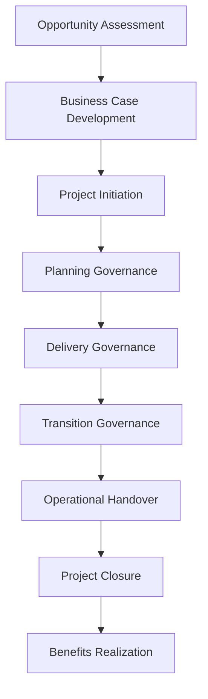
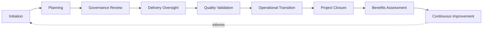
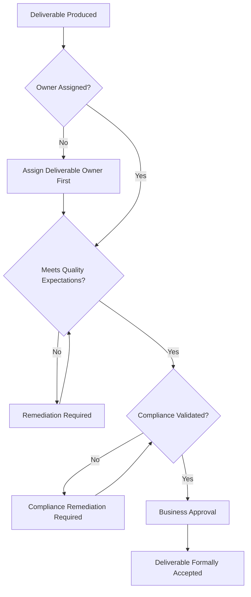
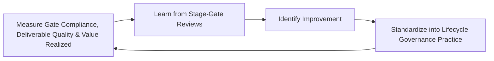
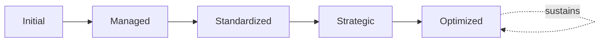

# Enterprise Project Lifecycle Framework

## 1. Executive Summary

**Purpose** — This document defines the official Enterprise Project Lifecycle Framework for **StackLeo Tech Store**. It establishes project phase governance, stage-gate governance, deliverable governance, transition governance, executive oversight, organizational accountability, continuous improvement, and long-term lifecycle maturity as a deliberate, accountable enterprise discipline. `project-governance-strategy.md` anticipated this framework directly (Related Documents) as the dedicated elaboration of the lifecycle it defines conceptually in Section 6. This framework does not restate that strategy's governance model, organizational roles, or risk categories. It elaborates the specific phases and stage-gates a project moves through — from opportunity through benefits validation — and the governance discipline applied at each.

**Scope** — This framework applies to the full lifecycle of every project category governed in `project-governance-strategy.md` — from opportunity assessment through benefits realization — coordinated with `project-governance-strategy.md`, `enterprise-architecture-strategy.md`, and `operations-strategy.md`.

**Strategic Objectives** — To ensure a project never proceeds past a genuine decision point without deliberate, evidenced approval; that every deliverable produced along the way is genuinely owned and accepted, not merely completed; that a project's transition into operation is deliberately governed, never an informal handoff; and that executive leadership has continuous, honest visibility into the organization's lifecycle governance posture.

**Business Value** — A governed project lifecycle framework protects StackLeo from the disproportionate cost of a project that proceeds past a stage it was never genuinely ready for, protects the organization's ability to trust that a delivered project is genuinely complete and operationally sound, and gives leadership confidence that project investment converts predictably into genuine business value.

**Intended Audience** — The Board of Directors, executive leadership, the Project Governance Board, the Chief Technology Officer, project leadership, product leadership, engineering leadership, operations leadership, quality leadership, and business stakeholders.

## 2. Enterprise Project Lifecycle Vision

- **Lifecycle Governance as Strategic Capability** — the project lifecycle is governed as a genuine strategic capability, never a procedural formality layered atop delivery.
- **Predictable Delivery** — lifecycle governance protects the organization's ability to genuinely predict how a project will progress and conclude.
- **Business Value Realization** — every phase exists in service of the genuine business value a project is ultimately meant to realize.
- **Governance Through Every Phase** — governance discipline is applied consistently across the full lifecycle, never concentrated only at its start or end.
- **Customer Value Protection** — lifecycle governance protects the genuine customer value a project is meant to ultimately deliver.
- **Organizational Learning** — understanding gained from a project's lifecycle deepens the organization's genuine collective delivery capability.
- **Sustainable Project Success** — lifecycle governance is pursued as a durable discipline, never a one-time process improvement.

### Enterprise Project Lifecycle Vision Matrix

| Vision Element | Focus | Business Value |
|---|---|---|
| Lifecycle Governance as Strategic Capability | A genuine strategic capability, not a procedural formality | Prevents lifecycle governance from being treated as bureaucratic overhead |
| Predictable Delivery | Genuine ability to predict progress and conclusion | Protects leadership's ability to plan around delivery |
| Business Value Realization | Every phase in service of genuine business value | Keeps the lifecycle connected to genuine business intent |
| Governance Through Every Phase | Consistent discipline across the full lifecycle | Prevents governance gaps in the middle of delivery |
| Customer Value Protection | Protects the genuine customer value ultimately delivered | Keeps the lifecycle connected to what customers value |
| Organizational Learning | Lifecycle experience deepening genuine collective capability | Converts delivery experience into durable organizational capability |
| Sustainable Project Success | A durable discipline, not a one-time improvement | Protects lifecycle investment from eroding over time |

## 3. Project Lifecycle Principles

Project lifecycle governance at StackLeo rests on nine principles, each producing a specific business outcome.

- **Governance Before Execution** — the governance structure for a project phase is established before that phase begins, never inferred after the fact. *Business Value:* ensures execution proceeds because a genuine, governed decision called for it.
- **Business Alignment** — every phase remains genuinely connected to the business case that justified the project. *Business Value:* prevents delivery from silently drifting from its original business justification.
- **Stage-Based Accountability** — every lifecycle stage traces to a specific, named, responsible owner. *Business Value:* ensures no stage drifts without someone genuinely responsible for it.
- **Deliverable Quality** — a deliverable's genuine quality is confirmed before it is accepted, never assumed adequate by default. *Business Value:* protects the organization from the disproportionate cost of an unacceptable deliverable proceeding unexamined.
- **Risk Awareness** — a lifecycle decision is made with genuine, explicit awareness of the risk it carries. *Business Value:* prevents lifecycle risk from accumulating unexamined.
- **Transparency** — a project's lifecycle status and stage-gate decisions are documented and visible to those who genuinely need them. *Business Value:* allows lifecycle governance to be scrutinized and defended, not merely trusted on faith.
- **Continuous Improvement** — lifecycle governance practice matures over time, informed by real project outcomes. *Business Value:* keeps lifecycle governance aligned with the organization's growing scale and complexity.
- **Executive Oversight** — a project's most consequential lifecycle transitions require genuine executive-level visibility. *Business Value:* ensures the organization's most consequential lifecycle decisions carry commensurate scrutiny.
- **Value-Driven Progression** — a project advances to its next phase only because genuine value justifies that progression, never by default momentum. *Business Value:* protects delivery capacity from being spent advancing a project that no longer genuinely justifies it.

### Project Lifecycle Principles Matrix

| Principle | Description | Business Value |
|---|---|---|
| Governance Before Execution | Structure established before a phase begins | Ensures execution proceeds on a genuine, governed decision |
| Business Alignment | Every phase genuinely connected to the business case | Prevents delivery from drifting from its original justification |
| Stage-Based Accountability | Every stage traces to a specific, responsible owner | Ensures no stage drifts without genuine responsibility |
| Deliverable Quality | Genuine quality confirmed before acceptance | Protects against an unacceptable deliverable proceeding |
| Risk Awareness | Decisions made with explicit awareness of carried risk | Prevents lifecycle risk from accumulating unexamined |
| Transparency | Status and decisions documented and visible | Allows lifecycle governance to be scrutinized and defended |
| Continuous Improvement | Practice matures from real project outcomes | Keeps governance aligned with growing scale and complexity |
| Executive Oversight | Consequential transitions require executive visibility | Ensures commensurate scrutiny for consequential decisions |
| Value-Driven Progression | Advances only because genuine value justifies it | Protects capacity from being spent on unjustified progression |

## 4. Enterprise Project Lifecycle Governance Model

Project lifecycle governance operates across nine conceptual domains, each holding accountability for a distinct phase of the lifecycle.

### Opportunity Assessment

- **Purpose** — govern how a genuine project opportunity is recognized and initially assessed.
- **Governance Scope** — coordinated with Opportunity Identification (`project-governance-strategy.md`, Section 6).
- **Business Value** — ensures project effort is deliberately directed at genuine opportunity.
- **Executive Expectations** — leadership expects opportunity assessment to be grounded in genuine business signal, not speculation.

### Business Case Development

- **Purpose** — govern how an assessed opportunity's genuine business value is formally developed and documented.
- **Governance Scope** — coordinated with Business Case Evaluation (`project-governance-strategy.md`, Section 6).
- **Business Value** — protects investment from being committed without genuine business justification.
- **Executive Expectations** — leadership expects the business case to withstand genuine scrutiny before authorization.

### Project Initiation

- **Purpose** — govern how an approved business case is formally, deliberately converted into an authorized project.
- **Governance Scope** — coordinated with Project Authorization (`project-governance-strategy.md`, Section 6).
- **Business Value** — ensures a project begins from a genuine, governed decision, not informal momentum.
- **Executive Expectations** — leadership expects initiation to establish genuine accountability from day one.

### Planning Governance

- **Purpose** — govern how an initiated project's genuine delivery plan is developed and reviewed.
- **Governance Scope** — coordinated with Strategic Planning (`project-governance-strategy.md`, Section 5).
- **Business Value** — protects delivery from proceeding without a genuine, deliberate plan.
- **Executive Expectations** — leadership expects planning to reflect genuine, evidenced feasibility.

### Delivery Governance

- **Purpose** — govern how a planned project's execution is genuinely overseen.
- **Governance Scope** — coordinated with Delivery Oversight (`project-governance-strategy.md`, Section 5).
- **Business Value** — protects the organization's ability to detect and address a genuine delivery issue before it compounds.
- **Executive Expectations** — leadership expects delivery governance to extend continuously, not only at milestones.

### Transition Governance

- **Purpose** — govern how a delivered project's output is deliberately prepared for genuine operational use.
- **Governance Scope** — coordinated with Operational Handover (below).
- **Business Value** — protects against a project's output being declared complete without genuine operational readiness.
- **Executive Expectations** — leadership expects transition to be governed as deliberately as delivery itself.

### Operational Handover

- **Purpose** — govern how a project's output is formally, deliberately handed to the function that will genuinely operate it.
- **Governance Scope** — coordinated with `operations-strategy.md`.
- **Business Value** — protects the organization's ability to genuinely operate what a project has delivered.
- **Executive Expectations** — leadership expects handover to confirm genuine operational readiness, not merely technical completion.

### Project Closure

- **Purpose** — govern how a project is formally, deliberately closed once its work is genuinely complete.
- **Governance Scope** — coordinated with Project Closure (`project-governance-strategy.md`, Section 6).
- **Business Value** — prevents a project from lingering without a genuine, deliberate end.
- **Executive Expectations** — leadership expects closure to be a genuine, documented event, not a quiet fade-out.

### Benefits Realization

- **Purpose** — govern how a closed project's genuine business value realization is confirmed.
- **Governance Scope** — coordinated with Benefits Evaluation (`project-governance-strategy.md`, Section 6).
- **Business Value** — ensures the investment's genuine outcome is honestly assessed, not merely assumed.
- **Executive Expectations** — leadership expects benefits realization to be confirmed with the same rigor as the original business case.

### Project Lifecycle Governance Matrix

| Domain | Purpose | Business Value | Executive Expectations |
|---|---|---|---|
| Opportunity Assessment | Recognize and initially assess a genuine opportunity | Ensures project effort is deliberately directed | Expects grounding in genuine business signal |
| Business Case Development | Formally develop an opportunity's genuine business value | Protects investment from being committed without justification | Expects the case to withstand genuine scrutiny |
| Project Initiation | Convert an approved case into an authorized project | Ensures a project begins from a genuine, governed decision | Expects genuine accountability established from day one |
| Planning Governance | Develop and review a genuine delivery plan | Protects delivery from proceeding without a deliberate plan | Expects planning reflecting genuine, evidenced feasibility |
| Delivery Governance | Genuinely oversee project execution | Protects the ability to address issues before they compound | Expects governance extending continuously, not only at milestones |
| Transition Governance | Prepare delivered output for genuine operational use | Protects against declaring completion without readiness | Expects transition governed as deliberately as delivery |
| Operational Handover | Formally hand output to the function that will operate it | Protects the ability to genuinely operate what was delivered | Expects confirmation of genuine operational readiness |
| Project Closure | Formally, deliberately close once genuinely complete | Prevents a project from lingering without a genuine end | Expects closure as a genuine, documented event |
| Benefits Realization | Confirm genuine business value realization | Ensures the investment's genuine outcome is honestly assessed | Expects rigor equal to the original business case |

*Diagram 1: Enterprise Project Lifecycle Framework — opportunity assessment and business case development inform project initiation and planning governance, flowing through delivery and transition governance into operational handover, project closure, and benefits realization.*

## 5. Stage-Gate Governance Framework

Project progression is governed through eight conceptual stage-gates, each requiring genuine, evidenced approval before the project advances. Remaining implementation independent, this framework governs the decision points — never a specific scheduling tool or workflow.

### Gate 0 – Opportunity Approval

- **Governance Objectives** — confirm a genuine opportunity warrants further investment of assessment effort.
- **Decision Authority** — the Project Governance Board.
- **Required Evidence** — a documented opportunity statement with genuine, preliminary business rationale.
- **Expected Outcomes** — authorization to proceed to Business Case Development, or deliberate rejection.

### Gate 1 – Business Case Approval

- **Governance Objectives** — confirm the developed business case genuinely justifies project investment.
- **Decision Authority** — the Project Governance Board, escalating to executive leadership for strategic initiatives.
- **Required Evidence** — a documented, evidenced business case per Business Case Development (Section 4).
- **Expected Outcomes** — authorization to proceed to Project Initiation, or deliberate rejection or deferral.

### Gate 2 – Initiation Approval

- **Governance Objectives** — confirm the project is genuinely, formally authorized with assigned accountability.
- **Decision Authority** — the Project Governance Board.
- **Required Evidence** — documented project charter with assigned ownership and authorized scope.
- **Expected Outcomes** — authorization to proceed to Planning Governance.

### Gate 3 – Delivery Readiness

- **Governance Objectives** — confirm the project's plan is genuinely sufficient to begin delivery.
- **Decision Authority** — the Project Governance Board, in coordination with Project Leadership.
- **Required Evidence** — a documented, reviewed delivery plan with genuine risk and resource assessment.
- **Expected Outcomes** — authorization to proceed to Delivery Governance.

### Gate 4 – Transition Readiness

- **Governance Objectives** — confirm delivered output is genuinely ready to begin transition toward operation.
- **Decision Authority** — the Project Governance Board, in coordination with Quality Leadership.
- **Required Evidence** — documented confirmation of Deliverable Quality (Section 7) against defined acceptance criteria.
- **Expected Outcomes** — authorization to proceed to Transition Governance.

### Gate 5 – Operational Acceptance

- **Governance Objectives** — confirm the function that will genuinely operate the output formally accepts it.
- **Decision Authority** — Operations Leadership, coordinated with `operations-strategy.md`.
- **Required Evidence** — documented operational readiness confirmation and handover record.
- **Expected Outcomes** — authorization to proceed to Project Closure.

### Gate 6 – Project Closure

- **Governance Objectives** — confirm all genuine project obligations are complete before formal closure.
- **Decision Authority** — the Project Governance Board.
- **Required Evidence** — documented confirmation every deliverable is accepted and every obligation resolved.
- **Expected Outcomes** — formal project closure and transition to Benefits Realization tracking.

### Gate 7 – Benefits Validation

- **Governance Objectives** — confirm the project's genuine business value has actually been realized.
- **Decision Authority** — the Project Governance Board, with executive leadership for strategic initiatives.
- **Required Evidence** — documented comparison of realized value against the original business case.
- **Expected Outcomes** — formal confirmation of value realization, or documented variance and lessons learned.

### Stage-Gate Governance Matrix

| Gate | Governance Objectives | Decision Authority | Required Evidence | Expected Outcomes |
|---|---|---|---|---|
| Gate 0 – Opportunity Approval | Confirm the opportunity warrants further assessment | Project Governance Board | Documented opportunity statement | Authorization to proceed or deliberate rejection |
| Gate 1 – Business Case Approval | Confirm the case genuinely justifies investment | Project Governance Board, executive leadership for strategic initiatives | Documented, evidenced business case | Authorization to initiate, or rejection/deferral |
| Gate 2 – Initiation Approval | Confirm formal authorization with assigned accountability | Project Governance Board | Project charter with assigned ownership | Authorization to proceed to planning |
| Gate 3 – Delivery Readiness | Confirm the plan is genuinely sufficient to begin delivery | Project Governance Board with Project Leadership | Reviewed delivery plan with risk and resource assessment | Authorization to proceed to delivery |
| Gate 4 – Transition Readiness | Confirm output is genuinely ready to begin transition | Project Governance Board with Quality Leadership | Deliverable quality confirmation against acceptance criteria | Authorization to proceed to transition |
| Gate 5 – Operational Acceptance | Confirm the operating function formally accepts the output | Operations Leadership | Operational readiness confirmation and handover record | Authorization to proceed to closure |
| Gate 6 – Project Closure | Confirm all obligations are complete before closure | Project Governance Board | Confirmation every deliverable is accepted | Formal closure and transition to benefits tracking |
| Gate 7 – Benefits Validation | Confirm genuine business value has been realized | Project Governance Board, executive leadership for strategic initiatives | Comparison of realized value against the business case | Confirmation of realization, or documented variance |

*Diagram 2: Stage-Gate Governance Model — a project advances sequentially through eight governed gates, from opportunity approval through business case, initiation, delivery readiness, transition readiness, operational acceptance, closure, and benefits validation.*

## 6. Project Lifecycle Governance

Project lifecycle execution operates across nine conceptual stages, coordinated with the Stage-Gate Governance Framework (Section 5).

- **Initiation** — govern how a project's authorized start is formally established.
- **Planning** — govern how a project's genuine delivery approach is developed.
- **Governance Review** — govern how a plan is reviewed against the appropriate stage-gate.
- **Delivery Oversight** — govern how execution is genuinely, continuously overseen.
- **Quality Validation** — govern how deliverables are confirmed to genuinely meet defined quality expectations.
- **Operational Transition** — govern how output is deliberately prepared for and handed to operation.
- **Project Closure** — govern how a project's work is formally, deliberately concluded.
- **Benefits Assessment** — govern how realized business value is confirmed against the original case.
- **Continuous Improvement** — govern how lifecycle practice is deliberately strengthened based on real outcomes.

### Lifecycle Risk Matrix reference is provided in Section 9; the following table addresses lifecycle execution stages themselves.

### Project Lifecycle Execution Matrix

| Stage | Governance Objective | Business Value |
|---|---|---|
| Initiation | Formally establish an authorized start | Ensures a project begins from a genuine, governed decision |
| Planning | Develop a genuine delivery approach | Protects delivery from proceeding without a deliberate plan |
| Governance Review | Review a plan against the appropriate stage-gate | Ensures review by the genuinely accountable authority |
| Delivery Oversight | Genuinely, continuously oversee execution | Protects against delivery drifting without oversight |
| Quality Validation | Confirm deliverables meet quality expectations | Protects against an unacceptable deliverable proceeding |
| Operational Transition | Deliberately prepare for and hand to operation | Protects against declaring completion without readiness |
| Project Closure | Formally, deliberately conclude the work | Prevents a project from lingering without a genuine end |
| Benefits Assessment | Confirm realized value against the original case | Ensures genuine, honest assessment of investment outcome |
| Continuous Improvement | Strengthen practice from real outcomes | Keeps lifecycle practice compounding in capability |

### Benefits Realization Matrix

| Benefits Dimension | Focus | Governance Coordination |
|---|---|---|
| Original Case Baseline | The genuine business value the case originally promised | Business Case Development (Section 4) |
| Realized Value Measurement | What the project genuinely delivered once operational | Benefits Assessment (this section) |
| Variance Analysis | The genuine gap between promised and realized value | Gate 7 – Benefits Validation (Section 5) |
| Attribution | Confirming realized value is genuinely traceable to the project | Traceability (Section 7) |
| Realization Timeline | When genuine value is expected to be, and is, realized | Continuous Review (Section 7) |
| Accountability for Realization | Who genuinely owns confirming value was realized | Benefits Realization (Section 4) |
| Lessons for Future Cases | How realization outcomes genuinely inform future business cases | Continuous Improvement (Section 3) |

*Diagram 3: Project Lifecycle Governance Flow — initiation and planning inform governance review and delivery oversight, feeding quality validation and operational transition, with closure, benefits assessment, and continuous improvement feeding lessons back into the cycle.*

## 7. Deliverable Governance

- **Deliverable Ownership** — governs every deliverable's traceability to a specific, named, accountable owner.
- **Deliverable Acceptance** — governs how a deliverable is formally, deliberately accepted against defined criteria.
- **Quality Expectations** — governs the genuine quality standard a deliverable is expected to meet.
- **Traceability** — governs whether a deliverable can be traced back to the requirement or business case that justified it.
- **Compliance Validation** — governs whether a deliverable's adherence to genuine regulatory or contractual obligation is confirmed, coordinated with `06_Security/compliance-governance.md`.
- **Business Approval** — governs how a deliverable's genuine business acceptability is confirmed by the accountable stakeholder.
- **Continuous Review** — governs the periodic, formal review of deliverable governance practice for genuine insight.

### Deliverable Governance Matrix

| Governance Area | Focus | Coordination |
|---|---|---|
| Deliverable Ownership | Traceability to a specific, named, accountable owner | Stage-Based Accountability (Section 3) |
| Deliverable Acceptance | Formal, deliberate acceptance against defined criteria | Gate 4 – Transition Readiness (Section 5) |
| Quality Expectations | The genuine quality standard expected | Deliverable Quality (Section 3) |
| Traceability | Traced back to the justifying requirement or business case | Business Case Development (Section 4) |
| Compliance Validation | Adherence to regulatory or contractual obligation confirmed | `06_Security/compliance-governance.md` |
| Business Approval | Genuine business acceptability confirmed by the stakeholder | Business Alignment (Section 3) |
| Continuous Review | Periodic, formal review for genuine insight | Continuous Improvement (Section 3) |

*Diagram 4: Deliverable Governance Structure — a produced deliverable requires assigned ownership, confirmed quality and compliance, and genuine business approval before it is formally accepted.*

## 8. Organizational Governance

Governance accountability is distributed deliberately across ten organizational roles.

- **Board of Directors** — holds ultimate accountability for whether StackLeo's project lifecycle governance genuinely protects investment.
- **Executive Leadership** — holds accountability for whether lifecycle decisions genuinely serve the business, in partnership with the Board.
- **Project Governance Board** — owns Stage-Gate Governance (Section 5) and the operational execution of Project Lifecycle Governance (Section 6).
- **Chief Technology Officer** — owns the coherence and enforcement of this framework across every technology-related lifecycle phase.
- **Project Leadership** — own day-to-day Delivery Governance (Section 4) and Delivery Oversight (Section 6) of individual projects.
- **Product Leadership** — own Deliverable Governance (Section 7) alignment with genuine product and customer priority.
- **Engineering Leadership** — own Planning Governance and Delivery Governance (Section 4) within their accountable teams.
- **Operations Leadership** — own Operational Handover (Section 4) in coordination with `operations-strategy.md`.
- **Quality Leadership** — own Quality Validation (Section 6) jointly with `08_Quality_Assurance/qa-governance.md`.
- **Business Stakeholders** — own Business Approval (Section 7) for deliverables affecting their domain.

### Organizational Responsibility Matrix

| Role | Governance Objective | Business Value |
|---|---|---|
| Board of Directors | Hold ultimate accountability for lifecycle governance protecting investment | Provides the highest point of ultimate accountability |
| Executive Leadership | Hold accountability for lifecycle decisions serving the business | Provides a single point of executive-level accountability |
| Project Governance Board | Own stage-gate governance and lifecycle execution | Provides a dedicated, cross-functional governance body |
| Chief Technology Officer | Own coherence and enforcement across technology-related phases | Provides a single point of specialist accountability |
| Project Leadership | Own day-to-day delivery governance and oversight | Ensures projects are genuinely, continuously overseen |
| Product Leadership | Own deliverable governance alignment with product priority | Ensures deliverables reflect genuine product and customer value |
| Engineering Leadership | Own planning and delivery governance | Embeds accountability closest to where projects are delivered |
| Operations Leadership | Own operational handover | Ensures projects genuinely transition into sustainable operation |
| Quality Leadership | Own quality validation jointly with QA governance | Ensures quality and lifecycle practice remain coordinated |
| Business Stakeholders | Own business approval for deliverables in their domain | Connects deliverables to genuine business relevance |

## 9. Lifecycle Risk Governance

Lifecycle-related risk is governed across eight conceptual categories.

- **Initiation Risks** — the risk that a project is authorized without genuine business justification.
- **Planning Risks** — the risk that a project proceeds to delivery without a genuinely sufficient plan.
- **Delivery Risks** — the risk that a project cannot be adequately delivered against its authorized scope.
- **Transition Risks** — the risk that a project's output is declared complete without genuine operational readiness.
- **Operational Acceptance Risks** — the risk that the operating function does not genuinely accept a project's output.
- **Business Value Risks** — the risk that a project fails to deliver the genuine business value its case promised.
- **Governance Risks** — the risk that a stage-gate is passed without genuine, evidenced justification.
- **Strategic Risks** — the risk that a project's lifecycle outcome undermines the organization's broader strategic direction.

### Lifecycle Risk Matrix

| Risk Category | Focus | Governance Coordination |
|---|---|---|
| Initiation Risks | Authorization without genuine business justification | Coordinated with Gate 1 – Business Case Approval (Section 5) |
| Planning Risks | Proceeding to delivery without a sufficient plan | Coordinated with Gate 3 – Delivery Readiness (Section 5) |
| Delivery Risks | Inability to adequately deliver against authorized scope | Coordinated with Delivery Governance (Section 4) |
| Transition Risks | Output declared complete without operational readiness | Coordinated with Gate 4 – Transition Readiness (Section 5) |
| Operational Acceptance Risks | The operating function not genuinely accepting the output | Coordinated with Gate 5 – Operational Acceptance (Section 5) |
| Business Value Risks | Failure to deliver the genuine value the case promised | Coordinated with Gate 7 – Benefits Validation (Section 5) |
| Governance Risks | A stage-gate passed without genuine, evidenced justification | Coordinated with Stage-Gate Governance Framework (Section 5) |
| Strategic Risks | A lifecycle outcome undermining strategic direction | Coordinated with `project-governance-strategy.md` (Section 9) |

## 10. Executive Oversight

- **Stage-Gate Reviews** — the organization's most consequential stage-gate decisions are reviewed directly with executive leadership.
- **Project Health Reviews** — the genuine health of active projects across their lifecycle is reviewed as a distinct, ongoing concern.
- **Delivery Readiness Reviews** — a project's readiness to proceed through Gate 3 and Gate 4 is reviewed directly with executive leadership for strategic initiatives.
- **Business Value Reviews** — the genuine business value realized through Gate 7 is reviewed with executive leadership.
- **Risk Reviews** — lifecycle risk posture is reviewed directly with executive leadership.
- **Continuous Improvement Reviews** — the organization's follow-through on captured lifecycle governance lessons is reviewed directly with executive leadership.

### Executive Oversight Matrix

| Oversight Mechanism | Purpose | Governance Role |
|---|---|---|
| Stage-Gate Reviews | Review the most consequential stage-gate decisions | Direct executive-level review of strategic gate decisions |
| Project Health Reviews | Review genuine health of active projects | Treats project health as ongoing, not assumed |
| Delivery Readiness Reviews | Review readiness through Gates 3 and 4 | Direct executive-level review for strategic initiatives |
| Business Value Reviews | Review genuine value realized through Gate 7 | Direct executive-level value realization review |
| Risk Reviews | Review lifecycle risk posture | Direct executive-level review of risk exposure |
| Continuous Improvement Reviews | Review follow-through on captured lessons | Direct executive-level review of improvement completion |

## 11. Future Readiness

This framework is designed to remain valid as StackLeo evolves in scale, geography, and organizational complexity.

- **AI-Assisted Lifecycle Governance** — as governance review increasingly incorporates AI-assisted methods, coordinated with `04_Database/ai-governance.md`, it remains governed under Governance Review (Section 6) at the same rigor as any other method.
- **Predictive Stage-Gate Intelligence** — where the organization develops the capability to anticipate a stage-gate risk before it fully materializes, that capability is governed as an extension of Delivery Oversight (Section 6).
- **Intelligent Delivery Oversight** — where delivery oversight increasingly draws on intelligent pattern analysis, that analysis remains subject to the same Delivery Governance (Section 4) as any other method.
- **Adaptive Project Governance** — where governance criteria increasingly adapt to genuinely changing project conditions, that evolution remains governed under Continuous Improvement (Section 3) at the same rigor as any other method.
- **Enterprise Delivery Evolution** — the governance model, domains, and stage-gates defined throughout this framework are defined independently of organizational size.
- **Sustainable Organizational Excellence** — this framework's governance discipline is treated as a direct, durable contributor to the organization's ability to deliver ambitious initiatives confidently over time.

## 12. Project Lifecycle Maturity Model

Project lifecycle governance maturity is described across five conceptual levels.

- **Initial** — lifecycle governance, where it exists, is informal and inconsistent; stage-gates are skipped or applied reactively, and ownership is unclear.
- **Managed** — basic lifecycle governance exists for individual domains, but consistency across the nine domains in Section 4 varies significantly.
- **Standardized** — the governance model, stage-gates, and lifecycle are standardized, documented, and consistently applied across the organization.
- **Strategic** — lifecycle decisions are genuinely and routinely made in deliberate service of business strategy, not delivery convenience.
- **Optimized** — lifecycle governance is continuously and deliberately improved based on quantitative evidence and organizational learning; improvement itself is a managed, ongoing discipline.

### Project Lifecycle Maturity Matrix

| Level | Characteristics | Primary Focus |
|---|---|---|
| Initial | Informal, inconsistent governance; gates skipped or reactive | Ad hoc, individually-dependent lifecycle practice |
| Managed | Basic governance exists per domain; consistency varies | Domain-level consistency |
| Standardized | Standardized governance model, stage-gates, and lifecycle | Organization-wide consistency and clear ownership |
| Strategic | Decisions genuinely and routinely made in service of strategy | Business-strategy-driven lifecycle decision-making |
| Optimized | Practice continuously and deliberately improved from evidence | Sustained, deliberate improvement as a discipline |

*Diagram 5: Continuous Project Lifecycle Improvement Cycle — gate compliance, deliverable quality, and realized value are measured, learned from, improved upon, and standardized back into governed practice, on a continuing basis.*

*Diagram 6: Project Lifecycle Maturity Progression — maturity advances from informal, reactively-gated lifecycle practice toward standardized, genuinely strategy-driven, and continuously optimized project lifecycle governance.*

## 13. Project Lifecycle Anti-Patterns

- **Skipping Stage Gates** — advancing a project past a gate without genuine, evidenced approval accepts avoidable exposure without an accountable decision.
- **Weak Deliverable Governance** — accepting a deliverable without genuine quality or compliance confirmation risks a foundation built on unverified work.
- **No Operational Transition** — declaring a project complete without genuine transition governance leaves the operating function unprepared.
- **Poor Closure Discipline** — allowing a project to linger without formal, deliberate closure prevents genuine accountability from ever concluding.
- **Missing Benefits Validation** — closing a project without confirming genuine business value realization leaves the investment's true outcome unknown.
- **Governance Without Evidence** — approving a stage-gate without genuine, documented evidence reduces governance to a formality.
- **Reactive Project Management** — addressing lifecycle governance only once a problem has already occurred forfeits the chance to prevent it.
- **No Continuous Improvement** — treating current lifecycle governance as permanently finished guarantees it falls behind the organization's growing scale and complexity.

### Anti-Pattern Summary

| Anti-Pattern | Organizational & Business Impact |
|---|---|
| Skipping Stage Gates | Accepts avoidable exposure without an accountable decision |
| Weak Deliverable Governance | Risks a foundation built on unverified work |
| No Operational Transition | Leaves the operating function unprepared |
| Poor Closure Discipline | Prevents genuine accountability from ever concluding |
| Missing Benefits Validation | Leaves the investment's true outcome unknown |
| Governance Without Evidence | Reduces governance to a formality |
| Reactive Project Management | Forfeits the chance to prevent a problem before it occurs |
| No Continuous Improvement | Guarantees governance falls behind growing scale and complexity |

## Related Documents

| Document | Relationship |
|---|---|
| `project-governance-strategy.md` | Anticipated this framework by name; sets the enterprise-wide governance model this framework's lifecycle and stage-gates elaborate. |
| `portfolio-program-governance.md` | Governs how multiple project lifecycles are coordinated together as a portfolio and program. |
| `resource-capacity-governance.md` | Governs how delivery capacity is allocated across Planning Governance (Section 4). |
| `stakeholder-engagement-framework.md` | Governs stakeholder involvement across this framework's lifecycle stages. |
| `project-risk-governance.md` | Elaborates the risk categories this framework defines in Section 9. |
| `project-maturity-framework.md` | Consolidates this framework's maturity model (Section 12) into the enterprise-wide project management maturity picture. |
| `03_System_Design/enterprise-architecture-strategy.md` | Sets the enterprise architecture direction this framework's technology-related deliverables coordinate with. |
| `09_Operations/operations-strategy.md` | Provides the enterprise operations context this framework's Operational Handover (Section 4) coordinates with. |

## Document Information

| Property | Value |
|----------|-------|
| Document | project-lifecycle-framework.md |
| Version | 1.0.0 |
| Status | Active |
| Maintained By | StackLeo |
| Last Updated | 2026-07-29 |

---

© StackLeo. All Rights Reserved.
