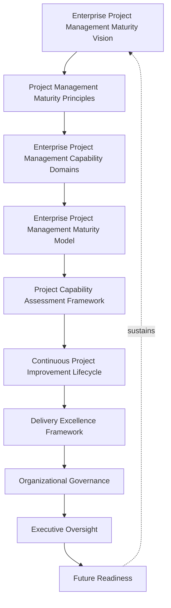
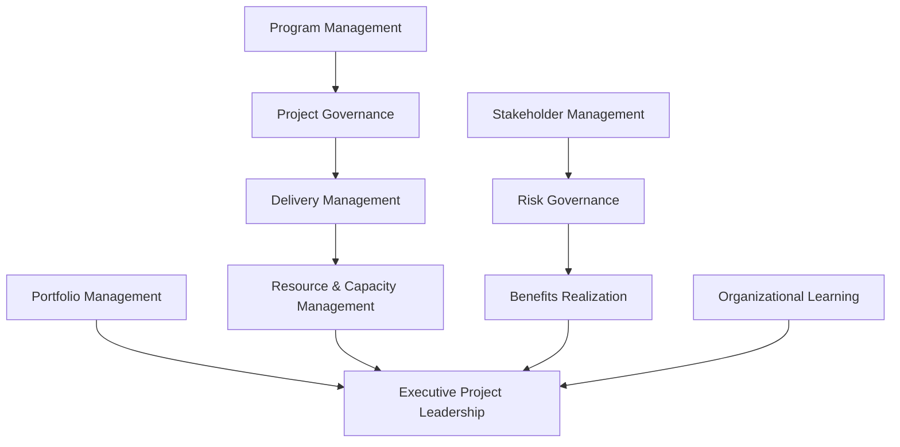
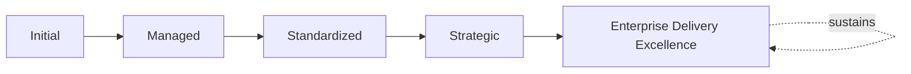
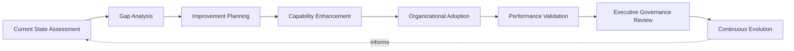
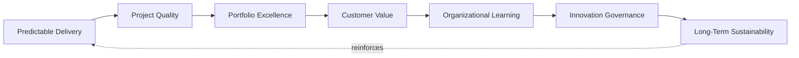
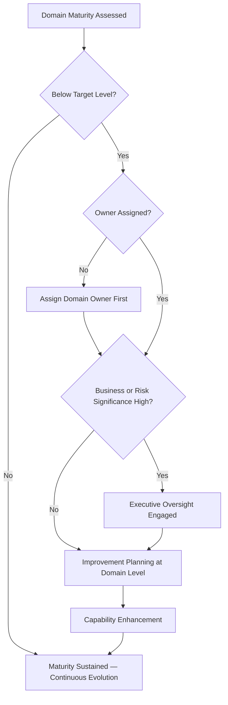

# Enterprise Project Management Maturity Framework

## 1. Executive Summary

**Purpose** — This document defines the official Enterprise Project Management Maturity Framework for **StackLeo Tech Store**. It establishes project management capability evolution, governance maturity, portfolio and program excellence, organizational delivery capability, executive oversight, continuous improvement, and long-term project management sustainability as a single, consolidated maturity lens spanning every domain governed across `00_Project_Overview`'s project governance documents. It consolidates the individual maturity models already defined within `project-governance-strategy.md`, `project-lifecycle-framework.md`, `portfolio-program-governance.md`, `resource-capacity-governance.md`, `stakeholder-engagement-framework.md`, and `project-risk-governance.md` into one coherent, cross-domain picture. It does not restate any domain's operational governance — it is the synthesis that lets leadership ask "how mature is our overall project delivery capability?" and receive one coherent answer.

**Scope** — This framework applies to every capability domain governed across StackLeo's project management discipline — portfolio management, program management, project governance, delivery management, resource and capacity management, stakeholder management, risk governance, benefits realization, organizational learning, and executive project leadership — coordinated with every domain-specific governance document referenced throughout.

**Strategic Objectives** — To ensure project management capability matures deliberately, not accidentally; that maturity is measured consistently across every domain rather than assessed unevenly; that improvement is prioritized by genuine business alignment and delivery risk; and that executive leadership has one coherent, consolidated view of the organization's overall project delivery maturity.

**Business Value** — A consolidated project management maturity framework protects delivery investment from being spent unevenly — heavily matured in one domain while another remains dangerously informal — protects leadership's ability to make proportionate investment decisions across the whole project management discipline, and gives the Board confidence that StackLeo's delivery capability is evolving deliberately alongside the business.

**Intended Audience** — The Board of Directors, executive leadership, the Project Governance Board, PMO leadership, the Chief Technology Officer, engineering leadership, product leadership, operations leadership, project managers, and business stakeholders.

## 2. Enterprise Project Management Maturity Vision

- **Project Management as Strategic Capability** — project management maturity is governed as a genuine strategic capability, never a static, one-time achievement.
- **Predictable Enterprise Delivery** — maturity is expected to genuinely deepen the organization's ability to predict how delivery will progress and conclude.
- **Business Value Realization** — mature project management genuinely converts investment into realized business value, not merely completed activity.
- **Organizational Delivery Excellence** — maturity is the organization's demonstrable evidence that it can genuinely deliver ambitious initiatives.
- **Executive Decision Confidence** — a mature delivery discipline gives leadership genuine confidence to commit to ambitious initiatives.
- **Sustainable Growth** — project management capability is governed to scale deliberately alongside the business.
- **Continuous Organizational Learning** — real delivery outcomes are genuinely converted into improved practice across the whole organization.

*Diagram 1: Enterprise Project Management Maturity Framework — the maturity vision establishes principles and capability domains, flowing through the maturity model, assessment, and improvement lifecycle into the delivery excellence framework, organizational governance, and executive oversight, with future readiness reinforcing the vision itself.*

### Enterprise Project Management Maturity Vision Matrix

| Vision Element | Focus | Business Value |
|---|---|---|
| Project Management as Strategic Capability | A genuine capability, not a one-time achievement | Prevents maturity from being treated as a completed project |
| Predictable Enterprise Delivery | Genuinely deepening the ability to predict delivery | Protects leadership's ability to plan around delivery |
| Business Value Realization | Genuinely converting investment into realized value | Keeps maturity connected to genuine business intent |
| Organizational Delivery Excellence | Demonstrable evidence of the ability to deliver | Protects confidence in the platform's delivery capability |
| Executive Decision Confidence | Genuine confidence to commit to ambitious initiatives | Supports informed, evidence-based investment commitments |
| Sustainable Growth | Capability scaling deliberately alongside the business | Keeps investment proportionate to genuine business growth |
| Continuous Organizational Learning | Real outcomes genuinely converted into improved practice | Converts delivery experience into durable capability |

## 3. Project Management Maturity Principles

Project management maturity governance at StackLeo rests on nine principles, each producing a specific business outcome.

- **Business Value Orientation** — maturity investment is justified by genuine business value, never technical or procedural interest alone. *Business Value:* prevents maturity investment disconnected from genuine business intent.
- **Governance First** — the accountability structure for maturity assessment is established before assessment begins. *Business Value:* ensures maturity claims are genuinely governed, not self-declared.
- **Strategic Alignment** — maturity evolution is paced to genuinely match the business's own strategic direction. *Business Value:* prevents delivery capability from either lagging behind or over-investing ahead of genuine need.
- **Delivery Excellence** — maturity is pursued toward a genuine standard of delivery excellence, never merely functional adequacy. *Business Value:* distinguishes StackLeo's delivery capability as a genuine competitive advantage.
- **Accountability** — every capability domain traces to a specific, named, responsible owner accountable for its maturity. *Business Value:* ensures no domain drifts without someone genuinely responsible for its evolution.
- **Risk-Aware Decision Making** — maturity investment is prioritized by genuine delivery risk. *Business Value:* directs limited maturity investment toward what genuinely matters most.
- **Continuous Improvement** — project management capability is expected to genuinely mature over time, never assumed static once initially established. *Business Value:* keeps capability aligned with the organization's growing scale and complexity.
- **Stakeholder Collaboration** — maturity is genuinely pursued in collaboration with the stakeholders delivery depends on, never in isolation. *Business Value:* ensures maturity reflects genuine, shared delivery reality.
- **Organizational Learning** — real delivery outcomes are genuinely converted into improved practice. *Business Value:* converts delivery experience into durable organizational capability.

### Project Management Maturity Principles Matrix

| Principle | Description | Business Value |
|---|---|---|
| Business Value Orientation | Justified by genuine business value, not procedural interest | Prevents investment disconnected from genuine business intent |
| Governance First | Accountability structure established before assessment begins | Ensures maturity claims are genuinely governed, not self-declared |
| Strategic Alignment | Evolution paced to genuinely match strategic direction | Prevents lagging behind or over-investing ahead of need |
| Delivery Excellence | Pursued toward genuine excellence, not mere adequacy | Distinguishes delivery capability as a genuine competitive advantage |
| Accountability | Every domain traces to a specific, responsible owner | Ensures no domain drifts without genuine responsibility |
| Risk-Aware Decision Making | Investment prioritized by genuine delivery risk | Directs limited investment toward what genuinely matters most |
| Continuous Improvement | Capability expected to genuinely mature over time | Keeps capability aligned with growing scale and complexity |
| Stakeholder Collaboration | Genuinely pursued in collaboration, never in isolation | Ensures maturity reflects genuine, shared delivery reality |
| Organizational Learning | Real outcomes genuinely converted into improved practice | Converts delivery experience into durable capability |

## 4. Enterprise Project Management Capability Domains

Project management maturity is governed across ten conceptual capability domains, each consolidating the maturity model already defined within its authoritative governance document.

### Portfolio Management

- **Purpose** — assess the maturity of overall portfolio governance coherence.
- **Maturity Expectations** — evaluated against the maturity model defined in `portfolio-program-governance.md` (Section 13).
- **Business Value** — protects the organization's ability to genuinely coordinate investment as a coherent whole.
- **Executive Expectations** — leadership expects portfolio maturity to reflect genuinely deliberate investment prioritization.

### Program Management

- **Purpose** — assess the maturity of program-level coordination across related projects.
- **Maturity Expectations** — evaluated against Program Governance Framework (`portfolio-program-governance.md`, Section 5).
- **Business Value** — protects the coherence of programs whose component projects must genuinely succeed together.
- **Executive Expectations** — leadership expects program maturity to demonstrate genuine cross-project coordination.

### Project Governance

- **Purpose** — assess the maturity of individual project governance.
- **Maturity Expectations** — evaluated against the maturity model defined in `project-governance-strategy.md` (Section 12).
- **Business Value** — protects the organization's ability to genuinely govern each project's decisions and accountability.
- **Executive Expectations** — leadership expects project governance maturity to be the foundation every other domain builds upon.

### Delivery Management

- **Purpose** — assess the maturity of project lifecycle and stage-gate delivery discipline.
- **Maturity Expectations** — evaluated against the maturity model defined in `project-lifecycle-framework.md` (Section 12).
- **Business Value** — protects the organization's ability to genuinely predict and confirm delivery.
- **Executive Expectations** — leadership expects delivery maturity to demonstrate genuine, evidenced stage-gate discipline.

### Resource & Capacity Management

- **Purpose** — assess the maturity of workforce capacity planning and allocation.
- **Maturity Expectations** — evaluated against the maturity model defined in `resource-capacity-governance.md` (Section 13).
- **Business Value** — protects the organization's ability to genuinely understand and deploy its delivery capacity.
- **Executive Expectations** — leadership expects resource maturity to demonstrate genuine capacity transparency.

### Stakeholder Management

- **Purpose** — assess the maturity of stakeholder engagement and expectation management.
- **Maturity Expectations** — evaluated against the maturity model defined in `stakeholder-engagement-framework.md` (Section 13).
- **Business Value** — protects the organization's ability to genuinely sustain the relationships delivery depends on.
- **Executive Expectations** — leadership expects stakeholder maturity to demonstrate genuine, trust-based relationships.

### Risk Governance

- **Purpose** — assess the maturity of project, program, and portfolio risk governance.
- **Maturity Expectations** — evaluated against the maturity model defined in `project-risk-governance.md` (Section 12).
- **Business Value** — protects the organization's ability to genuinely understand and manage delivery exposure.
- **Executive Expectations** — leadership expects risk maturity to demonstrate genuinely proactive risk identification.

### Benefits Realization

- **Purpose** — assess the maturity of confirming genuine business value realization.
- **Maturity Expectations** — evaluated against Benefits Realization Governance (`portfolio-program-governance.md`, Section 7).
- **Business Value** — protects the organization's ability to genuinely confirm investment paid off.
- **Executive Expectations** — leadership expects benefits realization maturity to be evidenced, not assumed.

### Organizational Learning

- **Purpose** — assess the maturity of how the organization genuinely learns from delivery experience.
- **Maturity Expectations** — evaluated against Lessons Learned (`project-risk-governance.md`, Section 5) and Continuous Improvement principles across the family.
- **Business Value** — protects the organization's ability to genuinely compound delivery capability over time.
- **Executive Expectations** — leadership expects organizational learning maturity to demonstrate genuine, durable knowledge retention.

### Executive Project Leadership

- **Purpose** — assess the maturity of executive and Board-level engagement with project delivery.
- **Maturity Expectations** — evaluated against Executive Oversight (Section 10).
- **Business Value** — protects the organization's most consequential delivery decisions with genuine leadership attention.
- **Executive Expectations** — leadership expects its own engagement to be measured with the same rigor as any delivery domain.

### Enterprise Project Capability Matrix

| Domain | Purpose | Business Value | Executive Expectations |
|---|---|---|---|
| Portfolio Management | Assess overall portfolio governance coherence maturity | Protects the ability to coordinate investment as a whole | Expects genuinely deliberate investment prioritization |
| Program Management | Assess program-level coordination maturity | Protects coherence of programs succeeding together | Expects genuine cross-project coordination |
| Project Governance | Assess individual project governance maturity | Protects the ability to govern each project's decisions | Expects governance maturity as the foundation for other domains |
| Delivery Management | Assess lifecycle and stage-gate delivery discipline maturity | Protects the ability to genuinely predict and confirm delivery | Expects genuine, evidenced stage-gate discipline |
| Resource & Capacity Management | Assess workforce capacity planning maturity | Protects the ability to understand and deploy capacity | Expects genuine capacity transparency |
| Stakeholder Management | Assess engagement and expectation management maturity | Protects the ability to sustain relationships delivery depends on | Expects genuine, trust-based relationships |
| Risk Governance | Assess project, program, and portfolio risk maturity | Protects the ability to understand and manage exposure | Expects genuinely proactive risk identification |
| Benefits Realization | Assess maturity of confirming genuine value realization | Protects the ability to confirm investment paid off | Expects evidenced, not assumed, realization |
| Organizational Learning | Assess maturity of genuine learning from delivery experience | Protects the ability to compound capability over time | Expects genuine, durable knowledge retention |
| Executive Project Leadership | Assess executive and Board engagement maturity | Protects the most consequential decisions with attention | Expects engagement measured with the same rigor as any domain |

*Diagram 2: Project Management Capability Evolution Model — portfolio and program management, project governance and delivery management, resource management, stakeholder and risk management, benefits realization, and organizational learning all consolidate into executive project leadership's overall maturity picture.*

## 5. Enterprise Project Management Maturity Model

Project management maturity is described across five conceptual levels, consistent with the maturity models already defined across every domain-specific governance document in `00_Project_Overview`.

### Level 1: Initial

Project management, where it exists, is informal and inconsistent across domains. Delivery is addressed reactively, ownership is unclear, and no consistent maturity picture exists across the organization.

### Level 2: Managed

Basic governance exists for individual domains, but consistency across the ten domains in Section 4 varies significantly. Some domains may be well-governed while others remain informal.

### Level 3: Standardized

The governance model, domains, and lifecycle are standardized, documented, and consistently applied across the organization. Every domain in Section 4 has a defined, comparable maturity baseline.

### Level 4: Strategic

Delivery decisions across every domain are genuinely and routinely made in deliberate service of business strategy, not delivery convenience. Maturity investment is prioritized consistently by genuine business alignment.

### Level 5: Enterprise Delivery Excellence

Project management capability is continuously and deliberately improved based on quantitative evidence and organizational learning across every domain. Improvement itself is a managed, ongoing, enterprise-wide discipline, and StackLeo's delivery capability functions as a genuine, sustained competitive advantage.

### Project Management Maturity Level Matrix

| Level | Characteristics | Primary Focus |
|---|---|---|
| Initial | Informal, inconsistent practice; delivery addressed reactively | Ad hoc, individually-dependent project practice |
| Managed | Basic governance exists per domain; consistency varies | Domain-level consistency |
| Standardized | Standardized governance model, domains, and lifecycle | Organization-wide consistency and clear ownership |
| Strategic | Decisions genuinely and routinely made in service of strategy | Business-strategy-driven delivery decision-making |
| Enterprise Delivery Excellence | Practice continuously improved; delivery as competitive advantage | Sustained, deliberate, enterprise-wide delivery excellence |

*Diagram 6: Project Management Maturity Progression — maturity advances from informal, reactively-addressed delivery practice toward standardized, genuinely strategy-driven, and ultimately continuously excellent enterprise-wide project management capability.*

## 6. Project Capability Assessment Framework

- **Delivery Capability Assessment** — governs how a domain's current delivery maturity is genuinely evaluated against Section 5's levels.
- **Governance Assessment** — governs how a domain's genuine governance coherence is assessed.
- **Portfolio Assessment** — governs how the overall portfolio's genuine coherence and value are assessed.
- **Resource Capability Assessment** — governs how genuine workforce capacity and skill maturity are assessed.
- **Risk Assessment** — governs how improvement effort is prioritized by genuine delivery risk.
- **Executive Review** — governs the point at which assessed maturity is reviewed with executive leadership.
- **Improvement Planning** — governs how an identified maturity gap is planned for deliberate advancement.

### Delivery Capability Assessment Matrix

| Assessment Area | Focus | Governance Coordination |
|---|---|---|
| Delivery Capability Assessment | Evaluating current maturity against defined levels | Enterprise Project Management Maturity Model (Section 5) |
| Governance Assessment | Assessing genuine governance coherence | Project Governance (Section 4) |
| Portfolio Assessment | Assessing overall portfolio coherence and value | Portfolio Management (Section 4) |
| Resource Capability Assessment | Assessing genuine capacity and skill maturity | Resource & Capacity Management (Section 4) |
| Risk Assessment | Prioritizing effort by genuine delivery risk | Risk Governance (Section 4) |
| Executive Review | Reviewing assessed maturity with leadership | Executive Oversight (Section 10) |
| Improvement Planning | Planning deliberate advancement of a gap | Continuous Project Improvement Lifecycle (Section 7) |

## 7. Continuous Project Improvement Lifecycle

Project management maturity improvement operates across eight conceptual stages.

- **Current State Assessment** — govern how a domain's genuine current maturity level is established.
- **Gap Analysis** — govern how the genuine distance between current and target maturity is identified.
- **Improvement Planning** — govern how a deliberate plan to close an identified gap is developed.
- **Capability Enhancement** — govern the oversight applied while a capability is genuinely being strengthened.
- **Organizational Adoption** — govern how an enhanced capability is genuinely adopted into organizational practice.
- **Performance Validation** — govern how an enhanced capability is confirmed to genuinely deliver its intended maturity improvement.
- **Executive Governance Review** — govern the periodic, formal review of maturity progress with executive leadership.
- **Continuous Evolution** — govern the periodic reassessment of whether target maturity itself remains aligned with evolving business need.

### Continuous Improvement Lifecycle Matrix

| Stage | Governance Objective | Business Value |
|---|---|---|
| Current State Assessment | Establish a domain's genuine current maturity | Ensures improvement begins from an accurate baseline |
| Gap Analysis | Identify the genuine distance to target maturity | Directs improvement effort toward what genuinely matters |
| Improvement Planning | Develop a deliberate plan to close the gap | Converts assessed gap into concrete, actionable steps |
| Capability Enhancement | Apply oversight while a capability is strengthened | Ensures enhancement remains within governed boundaries |
| Organizational Adoption | Adopt an enhanced capability into practice | Ensures investment converts into genuine organizational use |
| Performance Validation | Confirm the enhancement delivers genuine improvement | Protects against declaring maturity progress prematurely |
| Executive Governance Review | Periodically review progress with executive leadership | Confirms improvement investment is genuinely working |
| Continuous Evolution | Reassess whether target maturity remains aligned | Keeps maturity goals genuinely connected to business intent |

*Diagram 3: Continuous Project Improvement Lifecycle — current state assessment and gap analysis inform improvement planning and capability enhancement, feeding organizational adoption and performance validation, with executive governance review and continuous evolution feeding lessons back into the cycle.*

## 8. Delivery Excellence Framework

- **Predictable Delivery** — governs whether the organization can genuinely predict how delivery will progress and conclude.
- **Project Quality** — governs whether individual projects genuinely meet their defined quality expectation.
- **Portfolio Excellence** — governs whether the portfolio as a whole genuinely reflects deliberate, coherent investment.
- **Customer Value** — governs whether delivery excellence is genuinely reflected in the value customers actually receive.
- **Organizational Learning** — governs how real delivery experience deepens the organization's genuine collective capability.
- **Innovation Governance** — governs whether new delivery approaches are genuinely embraced within a governed structure, coordinated with `03_System_Design/technology-governance.md` (Section 9).
- **Long-Term Sustainability** — governs whether delivery excellence is pursued as a genuinely sustainable, ongoing discipline.

### Delivery Excellence Matrix

| Excellence Area | Focus | Governance Coordination |
|---|---|---|
| Predictable Delivery | Genuine ability to predict progress and conclusion | Delivery Management (Section 4) |
| Project Quality | Individual projects genuinely meeting quality expectation | Deliverable Quality (`project-lifecycle-framework.md`, Section 3) |
| Portfolio Excellence | The portfolio genuinely reflecting deliberate investment | Portfolio Management (Section 4) |
| Customer Value | Excellence genuinely reflected in customer-received value | Customer Value Creation (`project-governance-strategy.md`, Section 2) |
| Organizational Learning | Real experience deepening genuine collective capability | Organizational Learning (Section 4) |
| Innovation Governance | New approaches genuinely embraced within a governed structure | `03_System_Design/technology-governance.md` (Section 9) |
| Long-Term Sustainability | Excellence pursued as a genuinely sustainable discipline | Sustainable Growth (Section 2) |

*Diagram 5: Delivery Excellence Cycle — predictable delivery and project quality establish portfolio excellence and customer value, feeding organizational learning and innovation governance, with long-term sustainability reinforcing predictable delivery.*

## 9. Organizational Governance

Governance accountability is distributed deliberately across ten organizational roles.

- **Board of Directors** — holds ultimate accountability for StackLeo's overall project management maturity trajectory.
- **Executive Leadership** — holds accountability for whether delivery maturity genuinely keeps pace with business growth, in partnership with the Board.
- **Project Governance Board** — owns the operational maturity assessment and improvement practice across project delivery.
- **PMO Leadership** — owns the coordination of Program Management and Delivery Management maturity (Section 4).
- **Chief Technology Officer** — owns the coherence of this framework's cross-domain consolidation.
- **Engineering Leadership** — own Delivery Management maturity (Section 4) within their accountable teams.
- **Product Leadership** — own Stakeholder Management maturity (Section 4) alignment with genuine customer priority.
- **Operations Leadership** — own Resource & Capacity Management maturity (Section 4) in coordination with `resource-capacity-governance.md`.
- **Project Managers** — own day-to-day Delivery Management and Risk Governance maturity (Section 4) within their accountable projects.
- **Business Stakeholders** — own Business Value Orientation (Section 6) between maturity investment and genuine business priority.

### Organizational Responsibility Matrix

| Role | Governance Objective | Business Value |
|---|---|---|
| Board of Directors | Hold ultimate accountability for overall maturity trajectory | Provides the highest point of ultimate accountability |
| Executive Leadership | Hold accountability for maturity keeping pace with growth | Provides a single point of executive-level accountability |
| Project Governance Board | Own operational maturity assessment and improvement practice | Applies the framework to day-to-day maturity practice |
| PMO Leadership | Own coordination of program and delivery management maturity | Ensures consistent maturity practice across programs |
| Chief Technology Officer | Own coherence of this framework's cross-domain consolidation | Connects the consolidated view to authoritative sources |
| Engineering Leadership | Own delivery management maturity | Embeds accountability closest to where delivery occurs |
| Product Leadership | Own stakeholder management maturity | Ensures maturity reflects genuine customer priority |
| Operations Leadership | Own resource and capacity management maturity | Ensures resource maturity is genuinely coordinated |
| Project Managers | Own day-to-day delivery and risk governance maturity | Embeds accountability closest to individual project delivery |
| Business Stakeholders | Own business value orientation of maturity investment | Connects maturity investment to genuine business priority |

*Diagram 4: Enterprise Project Governance Structure — a domain's assessed maturity is checked against target level, escalating to executive oversight for high business or risk significance, resolving into improvement planning, capability enhancement, and sustained continuous evolution.*

## 10. Executive Oversight

- **Project Maturity Reviews** — the overall maturity picture across every domain in Section 4 is formally reviewed with executive leadership on a regular cadence.
- **Portfolio Capability Reviews** — the genuine capability of portfolio and program management is reviewed as a distinct, ongoing concern.
- **Delivery Excellence Reviews** — the organization's genuine delivery excellence, informed by maturity assessment, is reviewed directly with executive leadership.
- **Strategic Alignment Reviews** — the alignment of maturity investment with genuine business strategy is reviewed directly with executive leadership.
- **Risk Reviews** — the organization's genuine delivery risk posture, informed by maturity assessment, is reviewed directly with executive leadership.
- **Continuous Improvement Reviews** — the organization's follow-through on captured maturity improvement lessons is reviewed directly with executive leadership.

### Executive Oversight Matrix

| Oversight Mechanism | Purpose | Governance Role |
|---|---|---|
| Project Maturity Reviews | Review overall maturity picture across every domain | Regular, predictable cadence for the framework as a whole |
| Portfolio Capability Reviews | Review genuine capability of portfolio and program management | Treats capability as ongoing, not assumed |
| Delivery Excellence Reviews | Review genuine delivery excellence informed by maturity | Direct executive-level delivery excellence review |
| Strategic Alignment Reviews | Review investment alignment with business strategy | Direct executive-level strategic alignment review |
| Risk Reviews | Review genuine delivery risk posture | Direct executive-level review of risk exposure |
| Continuous Improvement Reviews | Review follow-through on captured lessons | Direct executive-level review of improvement completion |

## 11. Future Readiness

This framework is designed to remain valid as StackLeo evolves in scale, geography, and organizational complexity.

- **AI-Assisted Project Governance** — as capability assessment increasingly incorporates AI-assisted methods, coordinated with `04_Database/ai-governance.md`, it remains governed under Delivery Capability Assessment (Section 6) at the same rigor as any other method.
- **Intelligent Delivery Management** — where delivery management increasingly draws on intelligent pattern analysis, that analysis remains subject to the same Delivery Management discipline (Section 4) as any other method.
- **Predictive Portfolio Insights** — where the organization develops the capability to anticipate a portfolio maturity gap before it is exposed by a real delivery event, that capability is governed as an extension of Gap Analysis (Section 7).
- **Adaptive Enterprise Delivery** — where delivery practice increasingly adapts to genuinely changing project conditions, that evolution remains governed under Continuous Improvement (Section 3) at the same rigor as any other method.
- **Autonomous Governance Support (Conceptual)** — where automation increasingly performs steps within capability assessment or improvement planning, that automation remains subject to the same ownership and executive oversight as any human-performed activity.
- **Continuous Organizational Evolution** — Delivery Capability Assessment and Business Value Orientation (Section 6) are structured to be re-applied as StackLeo expands from Bangladesh into South Asia and global markets.

## 12. Project Management Anti-Patterns

- **Governance Without Business Value** — pursuing maturity governance without genuine connection to business value produces effort without coherent purpose.
- **Projects Without Standards** — delivering projects without genuine, standardized governance accumulates as inconsistent, incoherent practice.
- **Reactive Delivery Culture** — allowing maturity to advance only in response to a delivery failure forfeits the chance to build it deliberately.
- **Weak Executive Sponsorship** — leadership disengaged from maturity oversight undermines the accountability this entire framework depends on.
- **Poor Portfolio Alignment** — pursuing project maturity disconnected from genuine portfolio coherence wastes investment on what does not genuinely coordinate.
- **Resource Overcommitment** — allowing capacity to be genuinely, repeatedly overcommitted undermines delivery maturity's foundation.
- **Ignoring Lessons Learned** — resolving a delivery issue without capturing genuine understanding forfeits the chance to prevent its recurrence.
- **No Continuous Improvement** — treating current project management maturity as permanently finished guarantees it falls behind the organization's growing scale and complexity.

### Anti-Pattern Summary

| Anti-Pattern | Organizational & Business Impact |
|---|---|
| Governance Without Business Value | Produces maturity effort without coherent, strategic purpose |
| Projects Without Standards | Accumulates as inconsistent, incoherent delivery practice |
| Reactive Delivery Culture | Forfeits the chance to build maturity deliberately before failure |
| Weak Executive Sponsorship | Undermines the accountability this entire framework depends on |
| Poor Portfolio Alignment | Wastes investment on what does not genuinely coordinate |
| Resource Overcommitment | Undermines the foundation delivery maturity depends on |
| Ignoring Lessons Learned | Forfeits the chance to prevent a recurrence |
| No Continuous Improvement | Guarantees practice falls behind growing scale and complexity |

## Related Documents

| Document | Relationship |
|---|---|
| `project-governance-strategy.md` | Provides the domain-specific maturity model (Section 12) this framework's Project Governance (Section 4) consolidates. |
| `project-lifecycle-framework.md` | Provides the domain-specific maturity model (Section 12) this framework's Delivery Management (Section 4) consolidates. |
| `portfolio-program-governance.md` | Provides the domain-specific maturity model (Section 13) this framework's Portfolio and Program Management (Section 4) consolidate. |
| `resource-capacity-governance.md` | Provides the domain-specific maturity model (Section 13) this framework's Resource & Capacity Management (Section 4) consolidates. |
| `stakeholder-engagement-framework.md` | Provides the domain-specific maturity model (Section 13) this framework's Stakeholder Management (Section 4) consolidates. |
| `project-risk-governance.md` | Provides the domain-specific maturity model (Section 12) this framework's Risk Governance (Section 4) consolidates. |
| `03_System_Design/enterprise-architecture-strategy.md` | Sets the enterprise architecture direction this framework's technology-related delivery maturity coordinates with. |
| `09_Operations/operations-maturity-framework.md` | The analogous consolidated maturity framework for the operations domain, coordinated with this framework's Delivery Management (Section 4). |

## Document Information

| Property | Value |
|----------|-------|
| Document | project-maturity-framework.md |
| Version | 1.0.0 |
| Status | Active |
| Maintained By | StackLeo |
| Last Updated | 2026-07-29 |

---

© StackLeo. All Rights Reserved.
