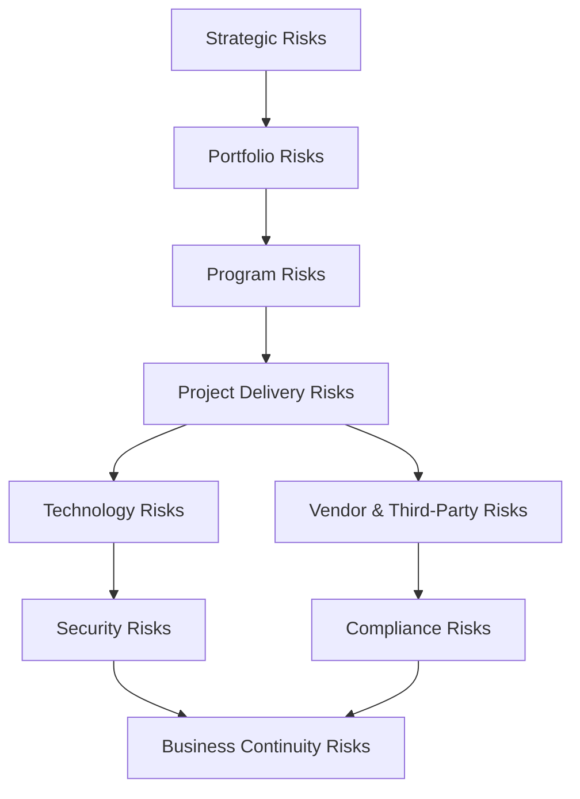
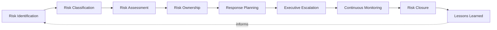
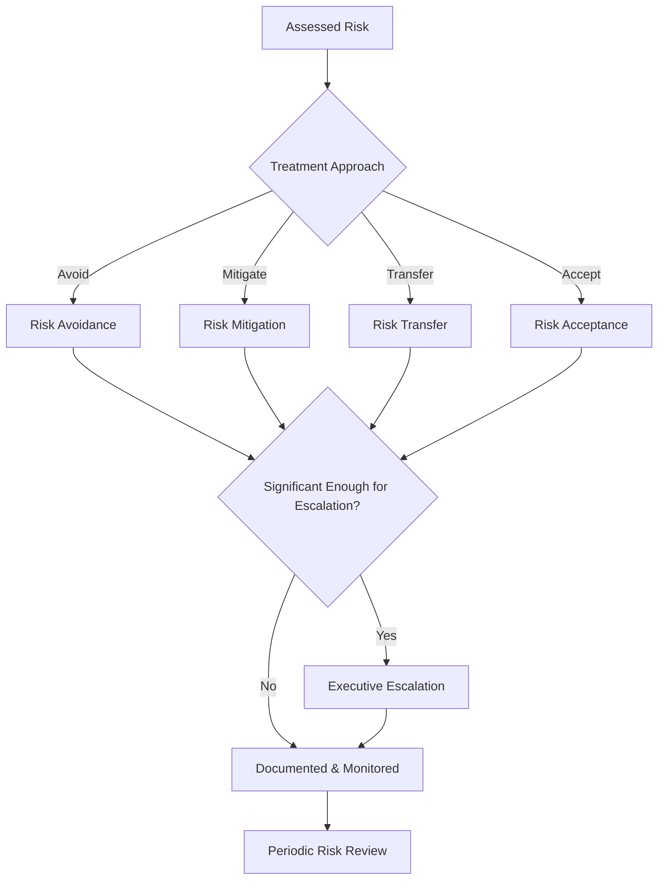
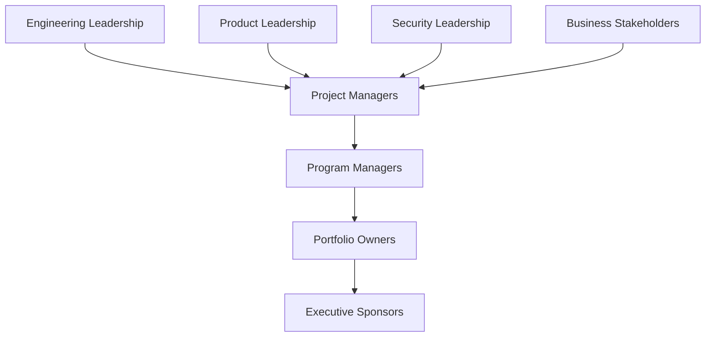
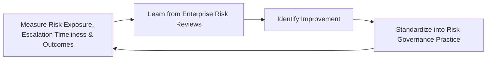
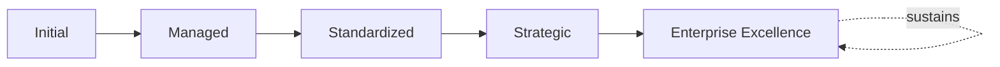

# Enterprise Project Risk Governance Framework

## 1. Executive Summary

**Purpose** — This document defines the official Enterprise Project Risk Governance Framework for **StackLeo Tech Store**. It establishes project risk governance, strategic and delivery risk oversight, risk ownership, decision governance, executive oversight, organizational accountability, continuous improvement, and long-term project risk maturity as a deliberate, accountable enterprise discipline. `project-governance-strategy.md`, `project-lifecycle-framework.md`, `portfolio-program-governance.md`, and `stakeholder-engagement-framework.md` each anticipated this framework directly as the dedicated elaboration of the risk categories they define at their own level. This framework does not restate any of their risk lists. It governs the discipline behind project risk itself — how a risk is identified, owned, decided upon, and escalated, consistently across every project, program, and portfolio at StackLeo.

**Scope** — This framework applies to every category of project-related risk at StackLeo — strategic, portfolio, program, project delivery, technology, security, vendor and third-party, compliance, and business continuity risk — coordinated with `project-governance-strategy.md`, `project-lifecycle-framework.md`, `portfolio-program-governance.md`, `stakeholder-engagement-framework.md`, and `06_Security/enterprise-risk-management-strategy.md`.

**Strategic Objectives** — To ensure a project risk is genuinely identified as early as possible, never discovered only once it has already caused harm; that every identified risk traces to a genuinely accountable owner; that a risk decision — acceptance, mitigation, avoidance, transfer — is made deliberately, never left as a silent default; and that executive leadership has continuous, honest visibility into the organization's project risk posture.

**Business Value** — A governed project risk framework protects StackLeo from the disproportionate cost of a risk that was known but never acted upon, protects delivery confidence by ensuring risk is confronted rather than ignored, and gives leadership the confidence to pursue ambitious initiatives because their risk is demonstrably, deliberately managed.

**Intended Audience** — The Board of Directors, executive leadership, the Project Governance Board, the Chief Technology Officer, risk leadership, engineering leadership, product leadership, operations leadership, security leadership, and business stakeholders.

## 2. Enterprise Project Risk Vision

- **Risk Governance as Strategic Capability** — project risk governance is treated as a genuine strategic capability, never a procedural formality layered atop delivery.
- **Proactive Risk Awareness** — risk is surfaced genuinely early, never left to be discovered only once it has already caused harm.
- **Business Value Protection** — risk governance exists to protect the genuine business value a project is meant to deliver.
- **Delivery Confidence** — risk governance gives the organization genuine confidence that delivery can proceed with known, managed exposure.
- **Organizational Resilience** — risk governance protects the organization's ability to withstand and recover from a project-level disruption.
- **Informed Decision Making** — risk decisions are made with genuine, evidenced understanding, never on impression alone.
- **Sustainable Project Success** — risk governance is pursued as a durable discipline, never a one-time risk workshop.

### Enterprise Project Risk Vision Matrix

| Vision Element | Focus | Business Value |
|---|---|---|
| Risk Governance as Strategic Capability | A genuine strategic capability, not a procedural formality | Prevents risk governance from being treated as bureaucratic overhead |
| Proactive Risk Awareness | Surfaced genuinely early, never discovered too late | Protects the window in which a risk can still be addressed cheaply |
| Business Value Protection | Protects the genuine business value a project is meant to deliver | Keeps risk governance connected to genuine business intent |
| Delivery Confidence | Genuine confidence delivery proceeds with managed exposure | Supports informed, evidence-based delivery commitments |
| Organizational Resilience | Protects the ability to withstand a project-level disruption | Sustains reliability through active, ongoing delivery |
| Informed Decision Making | Decisions made with genuine, evidenced understanding | Reduces the risk of decisions driven by impression alone |
| Sustainable Project Success | A durable discipline, not a one-time workshop | Protects risk governance investment from eroding over time |

## 3. Project Risk Governance Principles

Project risk governance at StackLeo rests on nine principles, each producing a specific business outcome.

- **Business Value First** — a risk is weighed first by its genuine effect on business value, never by technical severity alone. *Business Value:* keeps risk governance connected to genuine business consequence.
- **Early Risk Identification** — a risk is identified as early as genuinely possible, never left to be discovered under delivery pressure. *Business Value:* protects the window in which a risk can still be addressed cheaply.
- **Shared Accountability** — risk ownership is genuinely shared across every function that touches a project, never concentrated in a single risk team. *Business Value:* ensures risk is genuinely owned by those closest to it.
- **Evidence-Based Decisions** — a risk decision is grounded in genuine, documented evidence, not impression. *Business Value:* protects the credibility and defensibility of every risk decision.
- **Transparency** — risk status and decisions are documented and visible to those who genuinely need them. *Business Value:* allows risk governance to be scrutinized and defended, not merely trusted on faith.
- **Proportional Governance** — the scrutiny a risk receives is proportionate to its genuine potential consequence. *Business Value:* directs governance attention where a risk would matter most.
- **Continuous Monitoring** — a risk's genuine status is observed continuously, never confirmed once and assumed to remain valid. *Business Value:* keeps risk understanding current as delivery evolves.
- **Continuous Improvement** — risk governance practice matures over time, informed by real project outcomes. *Business Value:* keeps governance aligned with the organization's growing scale and complexity.
- **Executive Visibility** — the organization's most consequential risks are genuinely visible to executive leadership. *Business Value:* protects leadership from being surprised by a risk that was known but never escalated.

### Project Risk Governance Principles Matrix

| Principle | Description | Business Value |
|---|---|---|
| Business Value First | Weighed first by genuine effect on business value | Keeps governance connected to genuine business consequence |
| Early Risk Identification | Identified as early as genuinely possible | Protects the window in which a risk can be addressed cheaply |
| Shared Accountability | Genuinely shared across every touching function | Ensures risk is genuinely owned by those closest to it |
| Evidence-Based Decisions | Grounded in genuine, documented evidence | Protects credibility and defensibility of decisions |
| Transparency | Status and decisions documented and visible | Allows governance to be scrutinized and defended |
| Proportional Governance | Scrutiny proportionate to genuine potential consequence | Directs attention where a risk would matter most |
| Continuous Monitoring | Genuine status observed continuously | Keeps risk understanding current as delivery evolves |
| Continuous Improvement | Practice matures from real project outcomes | Keeps governance aligned with growing scale and complexity |
| Executive Visibility | Most consequential risks genuinely visible to leadership | Protects leadership from being surprised by a known risk |

## 4. Enterprise Project Risk Governance Model

Project risk governance operates across nine conceptual domains, each holding accountability for a distinct category of risk.

### Strategic Risks

- **Purpose** — govern risk affecting the most consequential, long-term project and program decisions.
- **Governance Scope** — coordinated with Strategic Initiatives (`project-governance-strategy.md`, Section 4).
- **Business Value** — protects the coherence of the organization's most significant strategic bets.
- **Executive Expectations** — leadership expects strategic risk to be reviewed with the highest rigor in this model.

### Portfolio Risks

- **Purpose** — govern risk affecting the coherence and value of the overall project portfolio.
- **Governance Scope** — coordinated with `portfolio-program-governance.md` (Section 10).
- **Business Value** — protects the organization's investment capacity from being spent on a poorly balanced portfolio.
- **Executive Expectations** — leadership expects portfolio risk to be reviewed alongside individual project risk.

### Program Risks

- **Purpose** — govern risk affecting a coordinated group of projects sharing a common business outcome.
- **Governance Scope** — coordinated with Program Governance Framework (`portfolio-program-governance.md`, Section 5).
- **Business Value** — protects the coherence of a program's component projects that must genuinely succeed together.
- **Executive Expectations** — leadership expects program risk to be reviewed as a coordinated whole, not fragmented across component projects.

### Project Delivery Risks

- **Purpose** — govern risk affecting a single project's ability to genuinely deliver against its authorized scope.
- **Governance Scope** — coordinated with Delivery Governance (`project-lifecycle-framework.md`, Section 4).
- **Business Value** — protects the organization's ability to detect and address a genuine delivery issue before it compounds.
- **Executive Expectations** — leadership expects delivery risk to be visible continuously, not only at milestones.

### Technology Risks

- **Purpose** — govern risk arising from a project's technology choices.
- **Governance Scope** — coordinated with `03_System_Design/technology-governance.md` (Section 11).
- **Business Value** — protects the coherence of the organization's technology investment.
- **Executive Expectations** — leadership expects technology risk to be evaluated before genuine commitment.

### Security Risks

- **Purpose** — govern risk arising from a project's security implications, jointly with, and never superseding, `security-strategy.md`.
- **Governance Scope** — coordinated with `06_Security/security-risk-management.md`.
- **Business Value** — protects StackLeo's core trust differentiator through genuine security risk discipline.
- **Executive Expectations** — leadership expects security risk to be treated as mandatory, non-negotiable.

### Vendor & Third-Party Risks

- **Purpose** — govern risk introduced through a project's dependency on a vendor or integration partner.
- **Governance Scope** — coordinated with `06_Security/third-party-risk-governance.md`.
- **Business Value** — protects the organization from disruption it does not directly cause but remains responsible for managing.
- **Executive Expectations** — leadership expects vendor risk to be evaluated before onboarding, not only after a problem occurs.

### Compliance Risks

- **Purpose** — govern risk that a project fails to meet a genuine regulatory or contractual obligation.
- **Governance Scope** — coordinated with `06_Security/compliance-governance.md`.
- **Business Value** — protects the organization's standing with regulators and counterparties.
- **Executive Expectations** — leadership expects compliance risk to be evaluated proactively, never discovered reactively.

### Business Continuity Risks

- **Purpose** — govern risk that a project failure escalates into a genuine threat to business continuity.
- **Governance Scope** — coordinated with `09_Operations/business-continuity-framework.md`.
- **Business Value** — protects the business precisely when disruption is most consequential.
- **Executive Expectations** — leadership expects continuity risk to be evaluated for the organization's most critical projects.

### Project Risk Governance Matrix

| Domain | Purpose | Business Value | Executive Expectations |
|---|---|---|---|
| Strategic Risks | Govern risk affecting the most consequential decisions | Protects coherence of the organization's most significant bets | Expects the highest rigor in this model |
| Portfolio Risks | Govern risk affecting overall portfolio coherence and value | Protects investment capacity from a poorly balanced portfolio | Expects review alongside individual project risk |
| Program Risks | Govern risk affecting a coordinated group of projects | Protects coherence of projects that must succeed together | Expects review as a coordinated whole |
| Project Delivery Risks | Govern risk affecting a single project's delivery | Protects the ability to address issues before they compound | Expects visibility continuously, not only at milestones |
| Technology Risks | Govern risk from a project's technology choices | Protects coherence of the technology investment | Expects evaluation before genuine commitment |
| Security Risks | Govern risk from a project's security implications | Protects StackLeo's core trust differentiator | Expects treatment as mandatory, non-negotiable |
| Vendor & Third-Party Risks | Govern risk from vendor or partner dependency | Protects against disruption not directly caused but managed | Expects evaluation before onboarding |
| Compliance Risks | Govern risk of failing regulatory obligation | Protects standing with regulators and counterparties | Expects proactive, never reactive, evaluation |
| Business Continuity Risks | Govern risk escalating into a continuity threat | Protects the business when disruption is most consequential | Expects evaluation for the most critical projects |

*Diagram 1: Enterprise Project Risk Governance Framework — strategic risk flows through portfolio and program risk into project delivery risk, which feeds technology, security, vendor, and compliance risk, all converging on business continuity risk for the organization's most critical projects.*

## 5. Project Risk Lifecycle Framework

Project risk governance operates across nine conceptual lifecycle stages, remaining implementation independent throughout.

### Risk Identification

- **Governance Objectives** — recognize a genuine risk before it materializes into harm.
- **Decision Authority** — any project team member or stakeholder, formally logged by Project Leadership.
- **Expected Outcomes** — a documented, genuine risk statement.
- **Review Requirements** — reviewed at the point of identification for genuine relevance.

### Risk Classification

- **Governance Objectives** — assign an identified risk to the appropriate domain in Section 4.
- **Decision Authority** — Project Leadership, coordinated with Risk Leadership.
- **Expected Outcomes** — a risk correctly categorized for consistent governance treatment.
- **Review Requirements** — reviewed if the risk's genuine nature evolves.

### Risk Assessment

- **Governance Objectives** — understand a classified risk's genuine business consequence and likelihood.
- **Decision Authority** — Project Leadership, escalating to the Project Governance Board for significant risk.
- **Expected Outcomes** — a documented, evidenced assessment sufficient to support a decision.
- **Review Requirements** — reviewed periodically as circumstances evolve.

### Risk Ownership

- **Governance Objectives** — assign an assessed risk to a specific, named, accountable owner.
- **Decision Authority** — the Project Governance Board or Project Leadership, per Risk Ownership Framework (Section 8).
- **Expected Outcomes** — a risk with genuine, unambiguous ownership.
- **Review Requirements** — reviewed whenever ownership circumstances change.

### Response Planning

- **Governance Objectives** — determine the genuine treatment approach for an owned risk, per Risk Decision Governance (Section 6).
- **Decision Authority** — the risk owner, coordinated with the Project Governance Board.
- **Expected Outcomes** — a documented, deliberate response plan.
- **Review Requirements** — reviewed for continued genuine adequacy.

### Executive Escalation

- **Governance Objectives** — elevate a risk requiring genuine executive-level visibility or decision.
- **Decision Authority** — the Project Governance Board, escalating to executive leadership.
- **Expected Outcomes** — appropriate executive engagement proportionate to genuine significance.
- **Review Requirements** — reviewed at the point of escalation and periodically thereafter.

### Continuous Monitoring

- **Governance Objectives** — observe a risk's genuine status on an ongoing basis.
- **Decision Authority** — the risk owner.
- **Expected Outcomes** — current, genuinely accurate risk status.
- **Review Requirements** — reviewed on a recurring, defined cadence.

### Risk Closure

- **Governance Objectives** — formally, deliberately close a risk once it is genuinely no longer relevant.
- **Decision Authority** — the risk owner, confirmed by the Project Governance Board.
- **Expected Outcomes** — a documented, genuine closure decision.
- **Review Requirements** — confirmed before formal closure is recorded.

### Lessons Learned

- **Governance Objectives** — capture understanding gained from a risk's realization or successful mitigation.
- **Decision Authority** — Project Leadership, coordinated with Risk Leadership.
- **Expected Outcomes** — durable organizational knowledge informing future risk governance.
- **Review Requirements** — reviewed as part of Continuous Improvement (Section 3).

### Risk Lifecycle Matrix

| Stage | Governance Objectives | Decision Authority | Expected Outcomes | Review Requirements |
|---|---|---|---|---|
| Risk Identification | Recognize a genuine risk before it materializes | Any team member, logged by Project Leadership | A documented, genuine risk statement | Reviewed at identification for relevance |
| Risk Classification | Assign to the appropriate domain | Project Leadership with Risk Leadership | A correctly categorized risk | Reviewed if nature evolves |
| Risk Assessment | Understand genuine consequence and likelihood | Project Leadership, escalating for significant risk | A documented, evidenced assessment | Reviewed periodically |
| Risk Ownership | Assign to a specific, accountable owner | Project Governance Board or Project Leadership | Genuine, unambiguous ownership | Reviewed when circumstances change |
| Response Planning | Determine genuine treatment approach | Risk owner with the Project Governance Board | A documented, deliberate response plan | Reviewed for continued adequacy |
| Executive Escalation | Elevate risk requiring executive visibility | Project Governance Board, escalating to executives | Appropriate, proportionate engagement | Reviewed at escalation and periodically |
| Continuous Monitoring | Observe genuine status on an ongoing basis | The risk owner | Current, genuinely accurate status | Reviewed on a recurring, defined cadence |
| Risk Closure | Formally close once genuinely no longer relevant | Risk owner, confirmed by the Project Governance Board | A documented, genuine closure decision | Confirmed before closure is recorded |
| Lessons Learned | Capture understanding from realization or mitigation | Project Leadership with Risk Leadership | Durable organizational knowledge | Reviewed as part of Continuous Improvement |

*Diagram 2: Project Risk Lifecycle — identification and classification inform assessment and ownership, feeding response planning and executive escalation, with continuous monitoring, closure, and lessons learned feeding lessons back into the cycle.*

## 6. Risk Decision Governance

Risk decision governance operates across eight conceptual disciplines.

- **Risk Acceptance** — governs how a risk is deliberately, explicitly accepted as-is by an accountable owner.
- **Risk Mitigation** — governs how a risk's likelihood or consequence is deliberately reduced.
- **Risk Avoidance** — governs how the activity creating a risk is deliberately not pursued, where genuine alternatives exist.
- **Risk Transfer** — governs how responsibility for a risk's consequence is deliberately shared or shifted to another party.
- **Executive Escalation** — governs the threshold at which a risk decision genuinely requires executive-level involvement.
- **Exception Governance** — governs how a genuine, justified deviation from standard risk treatment is reviewed and approved.
- **Periodic Risk Review** — governs the recurring, formal review of a decided risk's continued genuine validity.
- **Continuous Improvement** — governs how risk decision practice is deliberately strengthened based on real outcomes.

### Risk Decision Matrix

| Discipline | Governance Objective | Business Value |
|---|---|---|
| Risk Acceptance | Deliberately, explicitly accepted by an accountable owner | Ensures acceptance is a genuine, conscious decision |
| Risk Mitigation | Likelihood or consequence deliberately reduced | Protects against avoidable escalation of a manageable risk |
| Risk Avoidance | The creating activity deliberately not pursued | Removes exposure where genuine alternatives exist |
| Risk Transfer | Consequence responsibility deliberately shared or shifted | Distributes risk where genuinely appropriate |
| Executive Escalation | Threshold requiring executive-level involvement | Ensures commensurate scrutiny for consequential decisions |
| Exception Governance | Justified deviations reviewed and approved | Prevents standard treatment from being silently bypassed |
| Periodic Risk Review | Recurring review of continued genuine validity | Prevents a stale decision from persisting unexamined |
| Continuous Improvement | Practice strengthened from real outcomes | Keeps decision governance compounding in capability |

*Diagram 3: Risk Decision Governance Model — an assessed risk is routed through avoidance, mitigation, transfer, or acceptance, escalated to executive leadership where genuinely significant, and resolved into documented, continuously reviewed monitoring.*

## 7. Risk Reporting & Oversight Framework

- **Executive Risk Reporting** — governs how aggregated project risk posture is genuinely, honestly reported to executive leadership.
- **Portfolio Risk Visibility** — governs how risk across the entire portfolio is made genuinely visible, not only at the individual project level.
- **Delivery Risk Reporting** — governs how genuine delivery risk is reported through routine project reporting channels.
- **Strategic Risk Communication** — governs how the organization's most consequential risks are communicated to those who genuinely need to know.
- **Stakeholder Risk Communication** — governs how genuine risk is communicated to affected stakeholders, coordinated with `stakeholder-engagement-framework.md`.
- **Governance Review** — governs the periodic, formal review of risk reporting practice itself.
- **Continuous Risk Transparency** — governs whether risk reporting genuinely remains honest and complete, never selectively favorable.

### Risk Reporting Matrix

| Reporting Area | Focus | Governance Coordination |
|---|---|---|
| Executive Risk Reporting | Aggregated posture genuinely, honestly reported | Executive Oversight (Section 10) |
| Portfolio Risk Visibility | Risk across the entire portfolio genuinely visible | `portfolio-program-governance.md` (Section 10) |
| Delivery Risk Reporting | Genuine delivery risk through routine channels | Project Delivery Risks (Section 4) |
| Strategic Risk Communication | Most consequential risks communicated to those who need them | Strategic Risks (Section 4) |
| Stakeholder Risk Communication | Genuine risk communicated to affected stakeholders | `stakeholder-engagement-framework.md` (Section 7) |
| Governance Review | Periodic, formal review of reporting practice itself | Continuous Improvement (Section 3) |
| Continuous Risk Transparency | Reporting remaining genuinely honest and complete | Transparency (Section 3) |

## 8. Risk Ownership Framework

### Executive Sponsors

- **Accountability** — genuinely accountable for the risk posture of the strategic initiative they sponsor.
- **Decision Authority** — authority over risk acceptance for their sponsored initiative's most significant risks.
- **Escalation Responsibility** — escalate genuinely enterprise-wide risk to the Board.
- **Review Expectations** — reviewed at Strategic Risk Reviews (Section 10).

### Portfolio Owners

- **Accountability** — genuinely accountable for portfolio-level risk coherence.
- **Decision Authority** — authority over portfolio-level risk balancing decisions.
- **Escalation Responsibility** — escalate portfolio-significant risk to executive leadership.
- **Review Expectations** — reviewed at Portfolio Risk Reviews (Section 10).

### Program Managers

- **Accountability** — genuinely accountable for risk affecting a program's component projects together.
- **Decision Authority** — authority over program-level risk decisions within delegated limits.
- **Escalation Responsibility** — escalate program-significant risk to the Portfolio Governance Board.
- **Review Expectations** — reviewed at routine program governance cadence.

### Project Managers

- **Accountability** — genuinely accountable for their project's day-to-day risk management.
- **Decision Authority** — authority over project-level risk decisions within delegated limits.
- **Escalation Responsibility** — escalate project-significant risk to Program Managers or the Project Governance Board.
- **Review Expectations** — reviewed at routine project governance cadence.

### Engineering Leadership

- **Accountability** — genuinely accountable for technology risk within their teams.
- **Decision Authority** — authority over technology risk treatment within delegated limits.
- **Escalation Responsibility** — escalate genuinely significant technology risk to Project Leadership.
- **Review Expectations** — reviewed jointly with Technology Risk reviews (Section 4).

### Product Leadership

- **Accountability** — genuinely accountable for risk affecting product direction and customer value.
- **Decision Authority** — authority over product-related risk treatment.
- **Escalation Responsibility** — escalate genuinely significant product risk to the Project Governance Board.
- **Review Expectations** — reviewed jointly with product governance cadence.

### Security Leadership

- **Accountability** — genuinely accountable for security risk jointly with `security-strategy.md`.
- **Decision Authority** — authority over security risk treatment, coordinated with `06_Security/security-risk-management.md`.
- **Escalation Responsibility** — escalate genuinely significant security risk per `06_Security/security-governance.md`.
- **Review Expectations** — reviewed jointly with security risk governance cadence.

### Business Stakeholders

- **Accountability** — genuinely accountable for surfacing risk affecting their business domain.
- **Decision Authority** — input authority into risk assessment for their domain.
- **Escalation Responsibility** — escalate genuinely significant business risk to Project Leadership.
- **Review Expectations** — reviewed as part of Stakeholder Risk Communication (Section 7).

### Risk Ownership Matrix

| Role | Accountability | Decision Authority | Escalation Responsibility | Review Expectations |
|---|---|---|---|---|
| Executive Sponsors | Risk posture of the sponsored initiative | Acceptance for the most significant sponsored risks | Escalate enterprise-wide risk to the Board | Strategic Risk Reviews |
| Portfolio Owners | Portfolio-level risk coherence | Portfolio-level risk balancing decisions | Escalate portfolio-significant risk to executives | Portfolio Risk Reviews |
| Program Managers | Risk across a program's component projects | Program-level decisions within delegated limits | Escalate program-significant risk to the Portfolio Governance Board | Routine program governance cadence |
| Project Managers | Day-to-day project risk management | Project-level decisions within delegated limits | Escalate project-significant risk to Program Managers or the Board | Routine project governance cadence |
| Engineering Leadership | Technology risk within their teams | Technology risk treatment within delegated limits | Escalate significant technology risk to Project Leadership | Joint with Technology Risk reviews |
| Product Leadership | Risk affecting product direction and customer value | Product-related risk treatment | Escalate significant product risk to the Project Governance Board | Joint with product governance cadence |
| Security Leadership | Security risk jointly with security strategy | Security risk treatment, coordinated with security risk management | Escalate per security governance | Joint with security risk governance cadence |
| Business Stakeholders | Surfacing risk affecting their business domain | Input authority into domain risk assessment | Escalate significant business risk to Project Leadership | Stakeholder Risk Communication |

*Diagram 4: Risk Ownership Structure — engineering, product, security, and business stakeholders surface risk to project managers, escalating through program managers and portfolio owners to executive sponsors for the organization's most significant risks.*

## 9. Organizational Governance

Governance accountability is distributed deliberately across ten organizational roles.

- **Board of Directors** — holds ultimate accountability for whether StackLeo's project risk posture genuinely protects the business.
- **Executive Leadership** — holds accountability for whether risk decisions genuinely serve the business, in partnership with the Board.
- **Project Governance Board** — owns the operational execution of the Project Risk Lifecycle (Section 5) and Risk Decision Governance (Section 6).
- **Chief Technology Officer** — owns the coherence and enforcement of this framework across every technology-related risk domain.
- **Risk Leadership** — owns the coordination of risk governance practice across every project, program, and portfolio.
- **Engineering Leadership** — own Technology Risks (Section 4) within their accountable teams.
- **Product Leadership** — own risk affecting product direction and customer value.
- **Operations Leadership** — own Business Continuity Risks (Section 4) in coordination with `09_Operations/business-continuity-framework.md`.
- **Security Leadership** — own Security Risks (Section 4) jointly with `security-strategy.md`.
- **Business Stakeholders** — own surfacing genuine business risk affecting their domain.

### Organizational Responsibility Matrix

| Role | Governance Objective | Business Value |
|---|---|---|
| Board of Directors | Hold ultimate accountability for project risk posture | Provides the highest point of ultimate accountability |
| Executive Leadership | Hold accountability for decisions serving the business | Provides a single point of executive-level accountability |
| Project Governance Board | Own operational execution of lifecycle and decision governance | Provides a dedicated, cross-functional governance body |
| Chief Technology Officer | Own coherence and enforcement across technology-related domains | Provides a single point of specialist accountability |
| Risk Leadership | Own coordination of risk governance across the organization | Ensures consistent risk practice across every project |
| Engineering Leadership | Own technology risks | Embeds accountability closest to where risk is technical |
| Product Leadership | Own risk affecting product direction and customer value | Ensures risk reflects genuine product and customer priority |
| Operations Leadership | Own business continuity risks | Ensures risk genuinely supports operational sustainability |
| Security Leadership | Own security risks jointly with security strategy | Ensures security risk is never treated as optional |
| Business Stakeholders | Own surfacing genuine business risk | Connects risk governance to genuine business relevance |

## 10. Executive Oversight

- **Enterprise Risk Reviews** — the overall coherence of project risk governance is formally reviewed on a regular cadence.
- **Portfolio Risk Reviews** — the aggregated risk posture across the entire portfolio is reviewed directly with executive leadership.
- **Project Health Reviews** — the genuine risk-informed health of active projects is reviewed as a distinct, ongoing concern.
- **Strategic Risk Reviews** — the organization's most consequential risks are reviewed directly with executive leadership.
- **Governance Effectiveness Reviews** — the genuine effectiveness of risk governance practice itself is reviewed.
- **Continuous Improvement Reviews** — the organization's follow-through on captured risk governance lessons is reviewed directly with executive leadership.

### Executive Oversight Matrix

| Oversight Mechanism | Purpose | Governance Role |
|---|---|---|
| Enterprise Risk Reviews | Confirm overall project risk governance coherence | Regular, predictable cadence for the framework as a whole |
| Portfolio Risk Reviews | Review aggregated posture across the entire portfolio | Direct executive-level portfolio risk review |
| Project Health Reviews | Review genuine risk-informed health of active projects | Treats project health as ongoing, not assumed |
| Strategic Risk Reviews | Review the organization's most consequential risks | Direct executive-level review of strategic risk |
| Governance Effectiveness Reviews | Review the genuine effectiveness of risk governance | Treats effectiveness as ongoing, not assumed |
| Continuous Improvement Reviews | Review follow-through on captured lessons | Direct executive-level review of improvement completion |

## 11. Future Readiness

This framework is designed to remain valid as StackLeo evolves in scale, geography, and organizational complexity.

- **AI-Assisted Risk Intelligence** — as risk identification and assessment increasingly incorporate AI-assisted methods, coordinated with `04_Database/ai-governance.md`, they remain governed under Risk Identification and Risk Assessment (Section 5) at the same rigor as any other method.
- **Predictive Project Risk Analytics** — where the organization develops the capability to anticipate a risk before it fully materializes, that capability is governed as an extension of Continuous Monitoring (Section 5).
- **Adaptive Risk Governance** — where risk governance criteria increasingly adapt to genuinely changing project conditions, that evolution remains governed under Continuous Improvement (Section 3) at the same rigor as any other method.
- **Enterprise Decision Intelligence** — where risk decisions increasingly draw on intelligent pattern analysis across the portfolio, that analysis remains subject to the same Risk Decision Governance (Section 6) as any other method.
- **Digital Risk Visibility** — Executive Risk Reporting and Portfolio Risk Visibility (Section 7) are structured to be re-applied as StackLeo expands from Bangladesh into South Asia and global markets.
- **Sustainable Governance Evolution** — this framework's governance discipline is treated as a direct, durable contributor to the organization's ability to deliver ambitious initiatives confidently over time.

## 12. Project Risk Maturity Model

Project risk governance maturity is described across five conceptual levels.

- **Initial** — risk governance, where it exists, is informal and inconsistent; risks are addressed reactively, and ownership is unclear.
- **Managed** — basic risk governance exists for individual domains, but consistency across the nine domains in Section 4 varies significantly.
- **Standardized** — the governance model, lifecycle, and decision framework are standardized, documented, and consistently applied across the organization.
- **Strategic** — risk decisions are genuinely and routinely made in deliberate service of business strategy, not delivery convenience.
- **Enterprise Excellence** — risk governance is continuously and deliberately improved based on quantitative evidence and organizational learning; risk discipline functions as a genuine, sustained source of enterprise excellence.

### Project Risk Maturity Matrix

| Level | Characteristics | Primary Focus |
|---|---|---|
| Initial | Informal, inconsistent governance; risks addressed reactively | Ad hoc, individually-dependent risk practice |
| Managed | Basic governance exists per domain; consistency varies | Domain-level consistency |
| Standardized | Standardized governance model, lifecycle, and decision framework | Organization-wide consistency and clear ownership |
| Strategic | Decisions genuinely and routinely made in service of strategy | Business-strategy-driven risk decision-making |
| Enterprise Excellence | Practice continuously improved; risk discipline as advantage | Sustained, deliberate, enterprise-wide risk excellence |

*Diagram 5: Continuous Project Risk Improvement Cycle — risk exposure, escalation timeliness, and outcomes are measured, learned from, improved upon, and standardized back into governed practice, on a continuing basis.*

*Diagram 6: Project Risk Maturity Progression — maturity advances from informal, reactively-addressed risk practice toward standardized, genuinely strategy-driven, and continuously excellent enterprise project risk governance.*

## 13. Project Risk Governance Anti-Patterns

- **Risks Without Ownership** — a risk with no accountable owner has no one genuinely responsible for its treatment.
- **Reactive Risk Management** — addressing a risk only once it has already caused harm forfeits the chance to prevent it.
- **Hidden Project Risks** — a genuine risk known but never documented or escalated leaves the organization unknowingly exposed.
- **Weak Executive Visibility** — leadership lacking genuine risk visibility undermines the accountability this framework depends on.
- **Ignoring Early Warning Signals** — dismissing a genuine early indicator forfeits the cheapest opportunity to address a risk.
- **Risk Governance Without Accountability** — pursuing risk governance without genuine, traceable ownership reduces it to a formality.
- **Siloed Risk Decisions** — making risk decisions within a single domain without genuine cross-domain coordination leaves no coherent enterprise picture.
- **No Continuous Learning** — treating current risk governance as permanently finished guarantees it falls behind the organization's growing scale and complexity.

### Anti-Pattern Summary

| Anti-Pattern | Organizational & Business Impact |
|---|---|
| Risks Without Ownership | Leaves no one genuinely responsible for a risk's treatment |
| Reactive Risk Management | Forfeits the chance to prevent harm before it occurs |
| Hidden Project Risks | Leaves the organization unknowingly exposed |
| Weak Executive Visibility | Undermines the accountability this entire framework depends on |
| Ignoring Early Warning Signals | Forfeits the cheapest opportunity to address a risk |
| Risk Governance Without Accountability | Reduces governance to a formality |
| Siloed Risk Decisions | Leaves no coherent, organization-wide risk picture |
| No Continuous Learning | Guarantees governance falls behind growing scale and complexity |

## Related Documents

| Document | Relationship |
|---|---|
| `project-governance-strategy.md` | Anticipated this framework by name; consumes this framework's risk categories as an elaboration of Project Risk Governance (Section 9). |
| `project-lifecycle-framework.md` | Anticipated this framework by name; consumes this framework's Risk Lifecycle (Section 5) as an elaboration of its own Lifecycle Risk Governance. |
| `portfolio-program-governance.md` | Anticipated this framework by name; consumes this framework's Portfolio Risks (Section 4) as an elaboration of its own Portfolio Risk Governance. |
| `resource-capacity-governance.md` | Coordinates with this framework's risk categories for genuine capacity-related risk. |
| `stakeholder-engagement-framework.md` | Anticipated this framework by name; consumes this framework's risk categories as an elaboration of its own Stakeholder Risk Governance. |
| `project-maturity-framework.md` | Consolidates this framework's maturity model (Section 12) into the enterprise-wide project management maturity picture. |
| `06_Security/enterprise-risk-management-strategy.md` | Governs the enterprise-wide risk discipline this framework's project-specific risk governance is an instantiation of. |
| `09_Operations/business-continuity-framework.md` | Elaborates the continuity discipline this framework's Business Continuity Risks (Section 4) coordinate with. |

## Document Information

| Property | Value |
|----------|-------|
| Document | project-risk-governance.md |
| Version | 1.0.0 |
| Status | Active |
| Maintained By | StackLeo |
| Last Updated | 2026-07-29 |

---

© StackLeo. All Rights Reserved.
