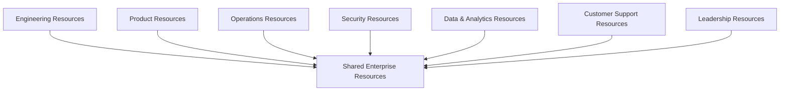
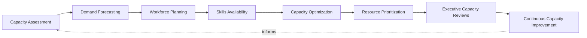
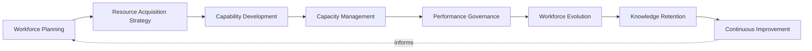
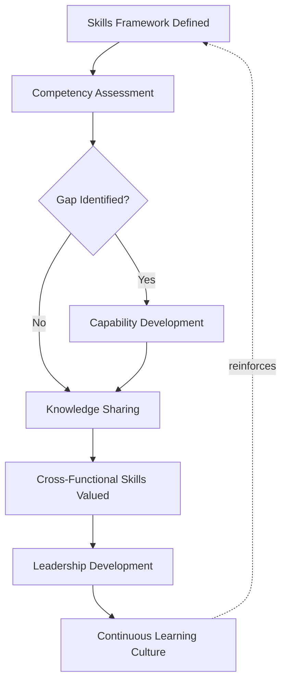
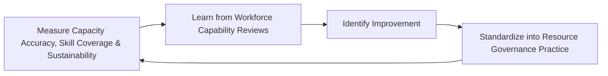
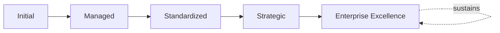

# Enterprise Resource & Capacity Governance Framework

## 1. Executive Summary

**Purpose** — This document defines the official Enterprise Resource & Capacity Governance Framework for **StackLeo Tech Store**. It establishes workforce governance, capacity planning governance, capability management, skills governance, organizational accountability, executive oversight, continuous improvement, and long-term resource maturity as a deliberate, accountable enterprise discipline. `project-governance-strategy.md` and `project-lifecycle-framework.md` each anticipated this framework directly as the dedicated governance treatment of how delivery capacity is allocated across Project Prioritization and Planning Governance. This framework does not restate either. It governs the organization's people and capacity as a genuine, deliberately managed asset — how much capacity StackLeo genuinely has, what skills that capacity carries, and how it is deliberately allocated across competing demand.

**Scope** — This framework applies to every category of workforce resource at StackLeo — engineering, product, operations, security, data and analytics, customer support, leadership, and shared enterprise resources — coordinated with `project-governance-strategy.md`, `project-lifecycle-framework.md`, `portfolio-program-governance.md`, and `01_Business/business-model.md`.

**Strategic Objectives** — To ensure resource capacity is genuinely understood before it is committed, never assumed available by default; that critical skills are deliberately protected and developed, never left exposed to a single point of dependency; that capacity is allocated by genuine business priority, never by whoever asks loudest; and that executive leadership has continuous, honest visibility into the organization's workforce capability and capacity posture.

**Business Value** — A governed resource and capacity framework protects StackLeo from the disproportionate cost of chronic overallocation and burnout, protects the organization's ability to sustain delivery even as key individuals move on, and gives leadership the confidence to commit to ambitious delivery because the capacity behind it is genuinely, honestly understood.

**Intended Audience** — The Board of Directors, executive leadership, Human Resources leadership, the Chief Technology Officer, engineering leadership, product leadership, operations leadership, security leadership, resource managers, and business stakeholders.

## 2. Enterprise Resource & Capacity Vision

- **People as Strategic Assets** — StackLeo's workforce is governed as a genuine strategic asset, never merely a cost to be minimized.
- **Workforce Capability as Business Advantage** — the organization's genuine skill and capability is treated as a source of durable competitive advantage.
- **Sustainable Capacity Planning** — capacity is planned deliberately and sustainably, never assumed elastic without genuine limit.
- **Organizational Agility** — resource governance enables the organization to respond quickly to genuine opportunity, never constrains it unnecessarily.
- **Skills Development** — the organization's genuine skill base is deliberately, continuously developed, never left to develop by accident.
- **Business Continuity Support** — resource governance protects the organization's ability to sustain operation even through workforce change.
- **Long-Term Workforce Excellence** — workforce capability is pursued as a durable discipline, never a one-time hiring exercise.

### Enterprise Resource & Capacity Vision Matrix

| Vision Element | Focus | Business Value |
|---|---|---|
| People as Strategic Assets | A genuine strategic asset, not merely a cost | Prevents workforce decisions from being treated as pure cost-cutting |
| Workforce Capability as Business Advantage | Genuine skill as a source of durable advantage | Connects capability investment to genuine competitive edge |
| Sustainable Capacity Planning | Deliberate, sustainable planning, never assumed elastic | Protects the organization from chronic overcommitment |
| Organizational Agility | Enabling, not unnecessarily constraining, rapid response | Protects the business's ability to move quickly when it matters |
| Skills Development | Genuine skill base deliberately, continuously developed | Prevents capability gaps from accumulating unnoticed |
| Business Continuity Support | Protects the ability to sustain operation through change | Protects against disruption from individual departure |
| Long-Term Workforce Excellence | A durable discipline, not a one-time hiring exercise | Protects workforce investment from eroding over time |

## 3. Resource & Capacity Governance Principles

Resource and capacity governance at StackLeo rests on nine principles, each producing a specific business outcome.

- **Business-Driven Resource Planning** — resource decisions are justified by genuine business need, never pursued by default or convenience. *Business Value:* prevents resource investment disconnected from genuine business intent.
- **Capacity Transparency** — the organization's genuine available capacity is documented and visible to those who genuinely need it. *Business Value:* allows capacity commitments to be scrutinized and defended, not merely assumed.
- **Skills-Based Workforce Planning** — resource planning accounts for genuine skill, not only headcount. *Business Value:* protects the organization from a capacity plan that looks sufficient but lacks the genuine capability required.
- **Accountability** — every resource domain traces to a specific, named, responsible owner. *Business Value:* ensures no domain drifts without someone genuinely responsible for it.
- **Fair Resource Distribution** — capacity is allocated deliberately and fairly, never concentrated disproportionately on a single individual by default. *Business Value:* protects against the burnout risk of chronic overallocation.
- **Continuous Learning** — the organization's genuine skill base is continuously developed, coordinated with Skills & Competency Governance (Section 7). *Business Value:* keeps workforce capability aligned with the organization's evolving needs.
- **Strategic Workforce Alignment** — resource planning remains genuinely connected to StackLeo's broader business strategy. *Business Value:* ensures workforce investment is directed by genuine business intent.
- **Sustainable Growth** — workforce capacity is governed to scale deliberately alongside the business, never lagging behind or over-hiring ahead of genuine need. *Business Value:* keeps workforce investment proportionate to genuine business growth.
- **Continuous Improvement** — resource governance practice matures over time, informed by real capacity and delivery outcomes. *Business Value:* keeps governance aligned with the organization's growing scale and complexity.

### Resource & Capacity Governance Principles Matrix

| Principle | Description | Business Value |
|---|---|---|
| Business-Driven Resource Planning | Justified by genuine business need, not default | Prevents investment disconnected from genuine business intent |
| Capacity Transparency | Genuine available capacity documented and visible | Allows commitments to be scrutinized and defended |
| Skills-Based Workforce Planning | Accounts for genuine skill, not only headcount | Protects against a plan that looks sufficient but lacks capability |
| Accountability | Every domain traces to a specific, responsible owner | Ensures no domain drifts without genuine responsibility |
| Fair Resource Distribution | Allocated deliberately and fairly, not concentrated | Protects against the burnout risk of chronic overallocation |
| Continuous Learning | Genuine skill base continuously developed | Keeps capability aligned with evolving organizational needs |
| Strategic Workforce Alignment | Genuinely connected to broader business strategy | Ensures investment is directed by genuine business intent |
| Sustainable Growth | Scaling deliberately, never lagging or over-hiring | Keeps investment proportionate to genuine business growth |
| Continuous Improvement | Practice matures from real capacity and delivery outcomes | Keeps governance aligned with growing scale and complexity |

## 4. Enterprise Resource Governance Model

Resource governance operates across eight conceptual domains, each holding accountability for a distinct category of workforce capacity.

### Engineering Resources

- **Purpose** — govern the capacity and skill of the engineering workforce building and maintaining the platform.
- **Governance Scope** — coordinated with `07_DevOps/devops-governance-framework.md`.
- **Business Value** — protects the organization's ability to genuinely deliver and sustain the platform.
- **Executive Expectations** — leadership expects engineering resource governance to reflect genuine delivery velocity needs.

### Product Resources

- **Purpose** — govern the capacity and skill of the workforce defining and shaping product direction.
- **Governance Scope** — coordinated with `02_Product/product-roadmap.md`.
- **Business Value** — protects the organization's ability to genuinely understand and serve customer need.
- **Executive Expectations** — leadership expects product resource governance to remain connected to genuine customer priority.

### Operations Resources

- **Purpose** — govern the capacity and skill of the workforce sustaining genuine day-to-day operation.
- **Governance Scope** — coordinated with `09_Operations/operations-strategy.md`.
- **Business Value** — protects the organization's ability to genuinely operate what it has built.
- **Executive Expectations** — leadership expects operations resource governance to extend genuinely beyond deployment.

### Security Resources

- **Purpose** — govern the capacity and skill of the workforce protecting the platform, jointly with, and never superseding, `security-strategy.md`.
- **Governance Scope** — coordinated with `06_Security/security-governance.md`.
- **Business Value** — protects StackLeo's core trust differentiator through genuinely sufficient security capacity.
- **Executive Expectations** — leadership expects security resource governance to be treated as mandatory, non-negotiable priority.

### Data & Analytics Resources

- **Purpose** — govern the capacity and skill of the workforce managing and analyzing platform data.
- **Governance Scope** — coordinated with `04_Database/data-governance.md` and `04_Database/analytics-strategy.md`.
- **Business Value** — protects the organization's ability to genuinely understand its own data.
- **Executive Expectations** — leadership expects data and analytics resource governance to keep pace with growing data complexity.

### Customer Support Resources

- **Purpose** — govern the capacity and skill of the workforce resolving genuine customer issues.
- **Governance Scope** — coordinated with Support Operations (`09_Operations/operations-strategy.md`, Section 4).
- **Business Value** — protects the customer's confidence that a genuine problem will be genuinely resolved.
- **Executive Expectations** — leadership expects customer support resource governance to scale with genuine customer volume.

### Leadership Resources

- **Purpose** — govern the capacity and skill of the organization's leadership bench.
- **Governance Scope** — coordinated with Leadership Development (Section 7).
- **Business Value** — protects the organization's ability to genuinely lead through growth and disruption.
- **Executive Expectations** — leadership expects leadership resource governance to include genuine succession readiness.

### Shared Enterprise Resources

- **Purpose** — govern the capacity and skill of workforce shared and consumed across multiple domains.
- **Governance Scope** — oversight exclusively accountable for converging cross-domain capacity demand.
- **Business Value** — ensures shared capacity is never claimed disproportionately by a single domain.
- **Executive Expectations** — leadership expects shared enterprise resources to be governed with awareness of their broad demand footprint.

### Enterprise Resource Governance Matrix

| Domain | Purpose | Business Value | Executive Expectations |
|---|---|---|---|
| Engineering Resources | Govern capacity and skill building and maintaining the platform | Protects the ability to genuinely deliver and sustain the platform | Expects reflection of genuine delivery velocity needs |
| Product Resources | Govern capacity and skill shaping product direction | Protects the ability to genuinely understand customer need | Expects connection to genuine customer priority |
| Operations Resources | Govern capacity and skill sustaining day-to-day operation | Protects the ability to genuinely operate what is built | Expects extension genuinely beyond deployment |
| Security Resources | Govern capacity and skill protecting the platform | Protects StackLeo's core trust differentiator | Expects treatment as mandatory, non-negotiable priority |
| Data & Analytics Resources | Govern capacity and skill managing and analyzing data | Protects the ability to genuinely understand its own data | Expects pace with growing data complexity |
| Customer Support Resources | Govern capacity and skill resolving customer issues | Protects confidence a genuine problem will be resolved | Expects scaling with genuine customer volume |
| Leadership Resources | Govern capacity and skill of the leadership bench | Protects the ability to genuinely lead through growth | Expects genuine succession readiness |
| Shared Enterprise Resources | Govern capacity shared across multiple domains | Ensures capacity is never claimed disproportionately | Expects awareness of broad demand footprint |

*Diagram 1: Enterprise Resource & Capacity Governance Framework — engineering, product, operations, security, data and analytics, customer support, and leadership resources all draw upon and converge through shared enterprise resources' cross-domain governance.*

## 5. Capacity Planning Governance Framework

Capacity planning governance operates across eight conceptual disciplines, remaining implementation independent throughout.

- **Capacity Assessment** — governs how the organization's genuine current capacity is established.
- **Demand Forecasting** — governs how genuine future capacity demand is anticipated.
- **Workforce Planning** — governs how a deliberate plan to meet forecasted demand is developed.
- **Skills Availability** — governs how the genuine availability of specific, required skills is assessed.
- **Capacity Optimization** — governs how existing capacity is deliberately allocated for genuine maximum value.
- **Resource Prioritization** — governs how limited capacity is allocated across genuinely competing demand.
- **Executive Capacity Reviews** — governs the point at which capacity posture requires executive-level visibility.
- **Continuous Capacity Improvement** — governs how capacity planning practice deliberately matures from real outcomes.

### Capacity Planning Matrix

| Discipline | Governance Objective | Business Value |
|---|---|---|
| Capacity Assessment | Establish genuine current capacity | Ensures planning begins from an accurate baseline |
| Demand Forecasting | Anticipate genuine future demand | Prevents capacity shortfalls from being discovered too late |
| Workforce Planning | Develop a deliberate plan to meet demand | Converts forecast into concrete, actionable steps |
| Skills Availability | Assess genuine availability of required skills | Protects against a plan that overlooks a genuine skill gap |
| Capacity Optimization | Allocate existing capacity for maximum value | Directs limited capacity toward what genuinely matters most |
| Resource Prioritization | Allocate limited capacity across competing demand | Ensures capacity is spent deliberately, not by default |
| Executive Capacity Reviews | Elevate capacity posture requiring visibility | Engages leadership exactly when genuinely warranted |
| Continuous Capacity Improvement | Deliberately mature practice from real outcomes | Keeps capacity planning compounding in capability |

*Diagram 2: Capacity Planning Governance Model — capacity assessment and demand forecasting inform workforce planning and skills availability, feeding capacity optimization and resource prioritization, with executive capacity reviews and continuous improvement feeding lessons back into the cycle.*

## 6. Resource Lifecycle Governance

Resource governance operates across eight conceptual lifecycle stages.

- **Workforce Planning** — govern how the organization's genuine future workforce need is deliberately planned.
- **Resource Acquisition Strategy** — govern how a genuine capacity gap is deliberately addressed through acquisition.
- **Capability Development** — govern how existing workforce capability is deliberately developed over time.
- **Capacity Management** — govern how genuine, ongoing capacity is deliberately allocated and tracked.
- **Performance Governance** — govern how workforce performance is genuinely assessed against expectation.
- **Workforce Evolution** — govern how the workforce's composition evolves alongside genuine business need.
- **Knowledge Retention** — govern how genuine organizational knowledge is preserved as the workforce changes.
- **Continuous Improvement** — govern how resource lifecycle practice is deliberately strengthened based on real outcomes.

### Resource Lifecycle Matrix

| Stage | Governance Objective | Business Value |
|---|---|---|
| Workforce Planning | Deliberately plan genuine future workforce need | Ensures resource effort is deliberately directed |
| Resource Acquisition Strategy | Deliberately address a genuine capacity gap | Protects against reactive, unplanned acquisition |
| Capability Development | Deliberately develop existing workforce capability | Converts existing workforce into a genuinely growing asset |
| Capacity Management | Deliberately allocate and track ongoing capacity | Ensures capacity commitments remain genuinely accurate |
| Performance Governance | Genuinely assess performance against expectation | Protects the credibility of workforce investment decisions |
| Workforce Evolution | Evolve composition alongside genuine business need | Keeps the workforce genuinely connected to business intent |
| Knowledge Retention | Preserve genuine organizational knowledge through change | Protects against knowledge loss when individuals depart |
| Continuous Improvement | Strengthen practice from real outcomes | Keeps resource lifecycle practice compounding in capability |

*Diagram 3: Resource Lifecycle Governance — workforce planning and acquisition strategy inform capability development and capacity management, feeding performance governance and workforce evolution, with knowledge retention and continuous improvement feeding lessons back into the cycle.*

## 7. Skills & Competency Governance

- **Skills Framework** — governs how the organization's genuinely required skills are deliberately defined and catalogued.
- **Competency Assessment** — governs how an individual's or team's genuine competency against the skills framework is assessed.
- **Capability Development** — governs how identified capability gaps are deliberately addressed through development.
- **Leadership Development** — governs how the organization's future leadership capability is deliberately cultivated.
- **Knowledge Sharing** — governs how genuine expertise is deliberately shared across the organization, never siloed within an individual.
- **Cross-Functional Skills** — governs how skill that genuinely spans multiple functions is deliberately developed and valued.
- **Continuous Learning Culture** — governs whether the organization genuinely, continuously invests in learning, not only when a gap becomes urgent.

### Skills & Competency Matrix

| Governance Area | Focus | Coordination |
|---|---|---|
| Skills Framework | Genuinely required skills deliberately defined | Skills Availability (Section 5) |
| Competency Assessment | Genuine competency assessed against the framework | Performance Governance (Section 6) |
| Capability Development | Identified gaps deliberately addressed | Capability Development (Section 6) |
| Leadership Development | Future leadership capability deliberately cultivated | Leadership Resources (Section 4) |
| Knowledge Sharing | Genuine expertise deliberately shared, never siloed | Knowledge Retention (Section 6) |
| Cross-Functional Skills | Skill spanning multiple functions deliberately valued | Shared Enterprise Resources (Section 4) |
| Continuous Learning Culture | Genuine, continuous investment in learning | Continuous Learning (Section 3) |

*Diagram 4: Skills & Competency Framework — a defined skills framework informs competency assessment, addressing identified gaps through capability development, feeding knowledge sharing, cross-functional skill valuation, and leadership development, sustained by a continuous learning culture.*

## 8. Resource Optimization Framework

- **Strategic Resource Allocation** — governs how capacity is deliberately allocated toward genuinely strategic priority.
- **Capacity Balancing** — governs how capacity is deliberately balanced across competing domains to avoid genuine imbalance.
- **Critical Skill Protection** — governs how a genuinely critical, scarce skill is deliberately protected from over-concentration or loss.
- **Business Priority Alignment** — governs how resource optimization decisions remain genuinely connected to business priority.
- **Productivity Governance** — governs how genuine workforce productivity is understood without reducing people to a mechanical output measure.
- **Workforce Sustainability** — governs whether resource allocation genuinely protects the workforce from unsustainable, chronic strain.
- **Organizational Flexibility** — governs whether the organization retains genuine flexibility to redeploy capacity as priority shifts.

### Resource Optimization Matrix

| Optimization Area | Focus | Governance Coordination |
|---|---|---|
| Strategic Resource Allocation | Capacity allocated toward genuinely strategic priority | Strategic Workforce Alignment (Section 3) |
| Capacity Balancing | Capacity deliberately balanced across domains | Resource Prioritization (Section 5) |
| Critical Skill Protection | A genuinely critical, scarce skill deliberately protected | Critical Skill Gaps (Section 10) |
| Business Priority Alignment | Decisions genuinely connected to business priority | Business-Driven Resource Planning (Section 3) |
| Productivity Governance | Genuine productivity understood responsibly | Performance Governance (Section 6) |
| Workforce Sustainability | Allocation genuinely protecting against chronic strain | Fair Resource Distribution (Section 3) |
| Organizational Flexibility | Genuine flexibility to redeploy as priority shifts | Organizational Agility (Section 2) |

## 9. Organizational Governance

Governance accountability is distributed deliberately across ten organizational roles.

- **Board of Directors** — holds ultimate accountability for whether StackLeo's workforce capacity genuinely serves the business's long-term direction.
- **Executive Leadership** — holds accountability for whether resource decisions genuinely align with business strategy, in partnership with the Board.
- **Human Resources Leadership** — owns the operational execution of Resource Lifecycle Governance (Section 6) and Skills & Competency Governance (Section 7).
- **Chief Technology Officer** — owns the coherence and enforcement of this framework across every technology-related resource domain.
- **Engineering Leadership** — own Engineering Resources (Section 4) within their accountable teams.
- **Product Leadership** — own Product Resources (Section 4) alignment with genuine customer and product priority.
- **Operations Leadership** — own Operations and Customer Support Resources (Section 4) in coordination with `operations-strategy.md`.
- **Security Leadership** — own Security Resources (Section 4) jointly with `security-strategy.md`.
- **Resource Managers** — own day-to-day Capacity Management (Section 6) within their accountable domain.
- **Business Stakeholders** — own Business Priority Alignment (Section 8) input for resource decisions affecting their domain.

### Organizational Responsibility Matrix

| Role | Governance Objective | Business Value |
|---|---|---|
| Board of Directors | Hold ultimate accountability for workforce capacity serving direction | Provides the highest point of ultimate accountability |
| Executive Leadership | Hold accountability for decisions aligning with business strategy | Provides a single point of executive-level accountability |
| Human Resources Leadership | Own operational execution of lifecycle and skills governance | Applies governance to day-to-day resource practice |
| Chief Technology Officer | Own coherence and enforcement across technology-related domains | Provides a single point of specialist accountability |
| Engineering Leadership | Own engineering resources | Embeds accountability closest to where capacity is consumed |
| Product Leadership | Own product resources alignment with priority | Ensures resources reflect genuine product and customer value |
| Operations Leadership | Own operations and customer support resources | Ensures resources genuinely support operational sustainability |
| Security Leadership | Own security resources jointly with security strategy | Ensures security capacity is never treated as optional |
| Resource Managers | Own day-to-day capacity management | Ensures capacity is genuinely, continuously tracked |
| Business Stakeholders | Own business priority alignment input for their domain | Connects resource decisions to genuine business relevance |

## 10. Resource & Capacity Risk Governance

Resource-related risk is governed across eight conceptual categories.

- **Capacity Shortages** — the risk that genuine demand exceeds available capacity without deliberate mitigation.
- **Critical Skill Gaps** — the risk that a genuinely necessary skill is unavailable when needed.
- **Workforce Dependency Risks** — the risk that critical knowledge or capability depends on a single individual.
- **Knowledge Loss Risks** — the risk that genuine organizational knowledge is lost when an individual departs.
- **Burnout Risks** — the risk that chronic overallocation genuinely harms workforce sustainability.
- **Succession Risks** — the risk that the organization lacks genuine readiness to replace a departing leader.
- **Operational Risks** — the risk that insufficient capacity genuinely undermines the organization's ability to operate.
- **Strategic Risks** — the risk that a resource decision forecloses a genuinely important future business opportunity.

### Resource Risk Matrix

| Risk Category | Focus | Governance Coordination |
|---|---|---|
| Capacity Shortages | Genuine demand exceeding available capacity | Coordinated with Capacity Assessment (Section 5) |
| Critical Skill Gaps | A genuinely necessary skill unavailable when needed | Coordinated with Skills Availability (Section 5) |
| Workforce Dependency Risks | Critical knowledge depending on a single individual | Coordinated with Critical Skill Protection (Section 8) |
| Knowledge Loss Risks | Genuine organizational knowledge lost upon departure | Coordinated with Knowledge Retention (Section 6) |
| Burnout Risks | Chronic overallocation genuinely harming sustainability | Coordinated with Fair Resource Distribution (Section 3) |
| Succession Risks | Lack of genuine readiness to replace a departing leader | Coordinated with Leadership Development (Section 7) |
| Operational Risks | Insufficient capacity undermining the ability to operate | Coordinated with `operations-strategy.md` |
| Strategic Risks | A decision foreclosing a genuinely important opportunity | Coordinated with Strategic Resource Allocation (Section 8) |

## 11. Executive Oversight

- **Workforce Capability Reviews** — the organization's overall workforce capability is formally reviewed on a regular cadence.
- **Capacity Planning Reviews** — genuine capacity posture against forecasted demand is reviewed directly with executive leadership.
- **Skills Readiness Reviews** — the organization's genuine skills readiness is reviewed as a distinct, ongoing concern.
- **Leadership Reviews** — the organization's leadership bench and succession readiness are reviewed directly with executive leadership.
- **Strategic Workforce Reviews** — workforce investment priorities are reviewed directly with executive leadership against genuine business direction.
- **Continuous Improvement Reviews** — the organization's follow-through on captured resource governance lessons is reviewed directly with executive leadership.

### Executive Oversight Matrix

| Oversight Mechanism | Purpose | Governance Role |
|---|---|---|
| Workforce Capability Reviews | Confirm overall workforce capability | Regular, predictable cadence for the framework as a whole |
| Capacity Planning Reviews | Review genuine capacity posture against demand | Direct executive-level capacity review |
| Skills Readiness Reviews | Review genuine skills readiness | Treats skills readiness as ongoing, not assumed |
| Leadership Reviews | Review leadership bench and succession readiness | Direct executive-level succession review |
| Strategic Workforce Reviews | Review investment priorities against business direction | Direct executive-level strategic alignment review |
| Continuous Improvement Reviews | Review follow-through on captured lessons | Direct executive-level review of improvement completion |

## 12. Future Readiness

This framework is designed to remain valid as StackLeo evolves in scale, geography, and organizational complexity.

- **AI-Assisted Workforce Planning** — as demand forecasting increasingly incorporates AI-assisted methods, coordinated with `04_Database/ai-governance.md`, it remains governed under Demand Forecasting (Section 5) at the same rigor as any other method.
- **Intelligent Capacity Forecasting** — where capacity forecasting increasingly draws on intelligent pattern analysis, that analysis remains subject to the same Capacity Assessment discipline (Section 5) as any other method.
- **Adaptive Skills Development** — where skills development increasingly adapts to genuinely changing capability needs, that evolution remains governed under Capability Development (Section 7) at the same rigor as any other method.
- **Future Workforce Models** — where the organization's workforce composition evolves toward genuinely new models of engagement, that evolution remains governed under Workforce Evolution (Section 6) at the same rigor as any other stage.
- **Enterprise Talent Evolution** — Workforce Planning and Resource Acquisition Strategy (Section 6) are structured to be re-applied as StackLeo expands from Bangladesh into South Asia and global markets.
- **Sustainable Organizational Growth** — this framework's governance discipline is treated as a direct, durable contributor to the organization's ability to grow its workforce responsibly over time.

## 13. Resource & Capacity Maturity Model

Resource and capacity governance maturity is described across five conceptual levels.

- **Initial** — resource governance, where it exists, is informal and inconsistent; capacity decisions are made reactively, and ownership is unclear.
- **Managed** — basic resource governance exists for individual domains, but consistency across the eight domains in Section 4 varies significantly.
- **Standardized** — the governance model, domains, and lifecycle are standardized, documented, and consistently applied across the organization.
- **Strategic** — resource decisions are genuinely and routinely made in deliberate service of business strategy, not staffing convenience.
- **Enterprise Excellence** — resource governance is continuously and deliberately improved based on quantitative evidence and organizational learning; workforce capability functions as a genuine, sustained source of enterprise excellence.

### Resource & Capacity Maturity Matrix

| Level | Characteristics | Primary Focus |
|---|---|---|
| Initial | Informal, inconsistent governance; decisions made reactively | Ad hoc, individually-dependent resource practice |
| Managed | Basic governance exists per domain; consistency varies | Domain-level consistency |
| Standardized | Standardized governance model, domains, and lifecycle | Organization-wide consistency and clear ownership |
| Strategic | Decisions genuinely and routinely made in service of strategy | Business-strategy-driven resource decision-making |
| Enterprise Excellence | Practice continuously improved; capability as competitive advantage | Sustained, deliberate, enterprise-wide workforce excellence |

*Diagram 5: Continuous Workforce Improvement Cycle — capacity accuracy, skill coverage, and workforce sustainability are measured, learned from, improved upon, and standardized back into governed practice, on a continuing basis.*

*Diagram 6: Resource & Capacity Maturity Progression — maturity advances from informal, reactively-decided resource practice toward standardized, genuinely strategy-driven, and continuously excellent enterprise resource and capacity governance.*

## 14. Resource & Capacity Anti-Patterns

- **Resource Planning Without Strategy** — planning capacity without genuine connection to business strategy produces effort without coherent direction.
- **Reactive Hiring** — acquiring resource only once a shortage has already caused delivery harm forfeits the chance to prevent it.
- **Chronic Overallocation** — allowing capacity to be genuinely, repeatedly overcommitted risks workforce sustainability.
- **Ignoring Skill Gaps** — proceeding without genuine skills availability assessment risks a plan that looks sufficient but lacks capability.
- **Knowledge Silos** — allowing genuine expertise to remain concentrated in a single individual creates unmanaged dependency risk.
- **Weak Succession Planning** — lacking genuine readiness to replace a departing leader leaves the organization exposed.
- **Capacity Without Visibility** — making resource decisions without genuine capacity transparency prevents informed prioritization.
- **No Continuous Workforce Development** — treating current workforce capability as permanently finished guarantees it falls behind the organization's growing scale and complexity.

### Anti-Pattern Summary

| Anti-Pattern | Organizational & Business Impact |
|---|---|
| Resource Planning Without Strategy | Produces effort without coherent, strategic direction |
| Reactive Hiring | Forfeits the chance to prevent delivery harm before it occurs |
| Chronic Overallocation | Risks workforce sustainability through repeated overcommitment |
| Ignoring Skill Gaps | Risks a plan that looks sufficient but lacks genuine capability |
| Knowledge Silos | Creates unmanaged dependency risk on a single individual |
| Weak Succession Planning | Leaves the organization exposed when a leader departs |
| Capacity Without Visibility | Prevents informed prioritization of limited capacity |
| No Continuous Workforce Development | Guarantees capability falls behind growing scale and complexity |

## Related Documents

| Document | Relationship |
|---|---|
| `project-governance-strategy.md` | Anticipated this framework by name; consumes this framework's Resource Prioritization (Section 5) as an input to Project Prioritization. |
| `project-lifecycle-framework.md` | Anticipated this framework by name; consumes this framework's Capacity Planning Governance (Section 5) as an input to Planning Governance. |
| `portfolio-program-governance.md` | Consumes this framework's Resource Optimization Framework (Section 8) as an input to Resource Availability (Section 8, Investment Prioritization). |
| `stakeholder-engagement-framework.md` | Governs stakeholder involvement in workforce and capacity decisions. |
| `project-risk-governance.md` | Elaborates the project-level risk this framework's Resource & Capacity Risk Governance (Section 10) coordinates with. |
| `project-maturity-framework.md` | Consolidates this framework's maturity model (Section 13) into the enterprise-wide project management maturity picture. |
| Organizational Governance (conceptual future companion) | An anticipated dedicated governance treatment of the broader organizational structure this framework's workforce resources operate within. |
| `01_Business/business-model.md` | Establishes the business strategy this framework's Strategic Workforce Alignment principle (Section 3) is ultimately measured against. |

## Document Information

| Property | Value |
|----------|-------|
| Document | resource-capacity-governance.md |
| Version | 1.0.0 |
| Status | Active |
| Maintained By | StackLeo |
| Last Updated | 2026-07-29 |

---

© StackLeo. All Rights Reserved.
