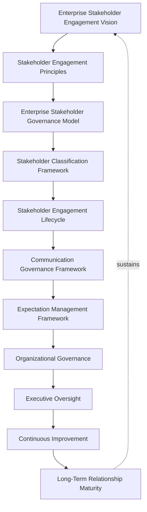
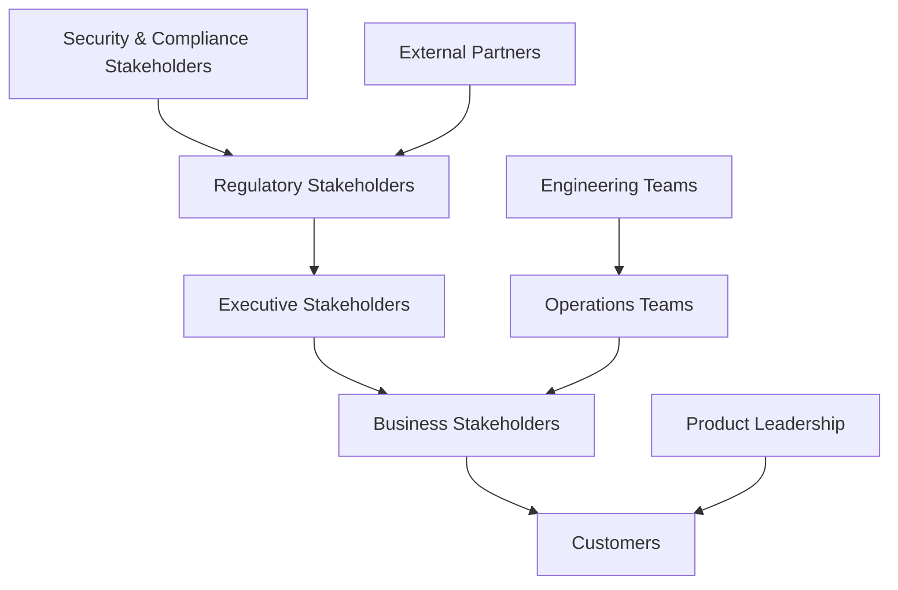
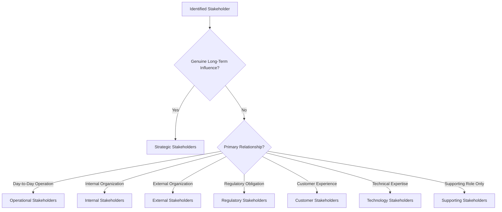
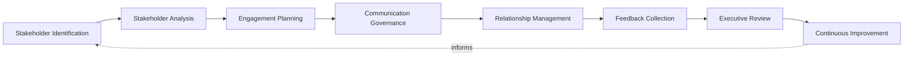
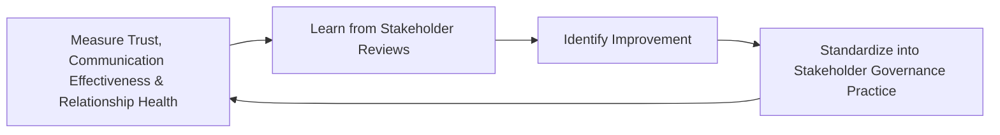
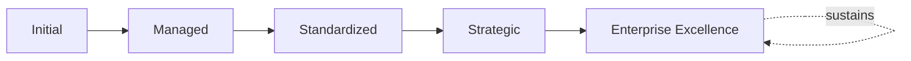

# Enterprise Stakeholder Engagement Framework

## 1. Executive Summary

**Purpose** — This document defines the official Enterprise Stakeholder Engagement Framework for **StackLeo Tech Store**. It establishes stakeholder governance, stakeholder identification and classification, engagement strategy, communication governance, expectation management, organizational accountability, executive oversight, continuous improvement, and long-term stakeholder relationship maturity as a deliberate, accountable enterprise discipline. `stakeholders.md` identifies the concrete stakeholders in StackLeo's project — who they are, their interests, and their influence. This framework does not restate that inventory. It governs how stakeholders are engaged deliberately throughout the project and portfolio lifecycle — how their expectations are managed, how they are communicated with, and how the organization remains genuinely accountable to the relationships it depends on.

**Scope** — This framework applies to every category of stakeholder at StackLeo — executive, business, customer, product, engineering, operations, security and compliance, external partner, and regulatory stakeholders — coordinated with `stakeholders.md`, `project-governance-strategy.md`, `project-lifecycle-framework.md`, `portfolio-program-governance.md`, and `resource-capacity-governance.md`.

**Strategic Objectives** — To ensure every genuine stakeholder is deliberately identified and engaged, never overlooked or surprised by a decision that affects them; that expectations are managed honestly and consistently, never allowed to silently diverge from reality; that communication reaches the right stakeholder at the right time, proportionate to genuine relevance; and that executive leadership has continuous, honest visibility into the organization's stakeholder relationship health.

**Business Value** — A governed stakeholder engagement framework protects StackLeo from the disproportionate cost of a stakeholder relationship that erodes through neglect, protects delivery from being derailed by resistance that genuine early engagement could have prevented, and gives leadership the confidence to pursue ambitious initiatives because the relationships they depend on are demonstrably well managed.

**Intended Audience** — The Board of Directors, executive leadership, the Project Governance Board, product leadership, engineering leadership, operations leadership, security leadership, customer success leadership, business stakeholders, and external stakeholders.

## 2. Enterprise Stakeholder Engagement Vision

- **Stakeholders as Strategic Partners** — every genuine stakeholder is governed as a strategic partner in StackLeo's success, never merely a party to be informed.
- **Trust-Based Relationships** — stakeholder engagement is governed to build and sustain genuine, earned trust over time.
- **Business Value Through Collaboration** — engagement exists to create genuine business value through collaboration, never merely to satisfy a procedural requirement.
- **Transparent Communication** — stakeholders receive honest, genuinely accurate information, never a curated or misleading picture.
- **Long-Term Organizational Success** — stakeholder relationships are governed as a durable asset supporting genuine, sustained organizational success.
- **Sustainable Engagement** — engagement is pursued as an ongoing discipline, never a one-time outreach exercise.
- **Shared Accountability** — stakeholders and StackLeo hold genuine, mutual accountability for the relationship's success.

### Enterprise Stakeholder Engagement Vision Matrix

| Vision Element | Focus | Business Value |
|---|---|---|
| Stakeholders as Strategic Partners | Genuine strategic partners, not merely informed parties | Prevents stakeholder engagement from being treated as a formality |
| Trust-Based Relationships | Building and sustaining genuine, earned trust | Protects the foundation every stakeholder relationship depends on |
| Business Value Through Collaboration | Genuine value created through collaboration | Connects engagement to genuine business outcome |
| Transparent Communication | Honest, genuinely accurate information | Protects trust from the corrosive effect of a curated picture |
| Long-Term Organizational Success | A durable asset supporting sustained success | Converts relationship investment into genuine competitive advantage |
| Sustainable Engagement | An ongoing discipline, not a one-time exercise | Protects engagement investment from eroding over time |
| Shared Accountability | Genuine, mutual accountability for relationship success | Prevents the relationship from depending on one side alone |

*Diagram 1: Enterprise Stakeholder Engagement Framework — the vision establishes principles and the governance model, flowing through classification, engagement lifecycle, communication, and expectation management into organizational governance and executive oversight, with continuous improvement driving long-term relationship maturity that reinforces the vision itself.*

## 3. Stakeholder Engagement Principles

Stakeholder engagement governance at StackLeo rests on nine principles, each producing a specific business outcome.

- **Business Value First** — engagement is justified by the genuine business value it creates, never pursued as a procedural formality. *Business Value:* prevents engagement effort from being spent without genuine purpose.
- **Transparency** — stakeholder-facing information is honest and genuinely accurate, never curated to mislead. *Business Value:* protects trust from the corrosive effect of a misleading picture.
- **Mutual Accountability** — both StackLeo and its stakeholders hold genuine accountability for the relationship's success. *Business Value:* prevents the relationship from depending unfairly on one side alone.
- **Inclusive Decision Making** — genuine stakeholders are included in decisions that affect them, never excluded by default. *Business Value:* protects decisions from being made without genuinely relevant perspective.
- **Timely Communication** — stakeholders are informed without avoidable delay. *Business Value:* prevents stakeholders from being surprised by a decision they were never told about.
- **Trust and Integrity** — engagement is conducted with genuine integrity, never through manipulation or omission. *Business Value:* protects the durable trust every stakeholder relationship ultimately depends on.
- **Continuous Engagement** — stakeholder relationships are genuinely, continuously maintained, never allowed to lapse between major events. *Business Value:* prevents relationships from eroding through neglect.
- **Evidence-Based Governance** — engagement decisions are grounded in genuine, documented evidence, not impression. *Business Value:* protects the credibility and defensibility of engagement decisions.
- **Continuous Improvement** — engagement governance practice matures over time, informed by real relationship outcomes. *Business Value:* keeps engagement aligned with the organization's growing scale and complexity.

### Stakeholder Engagement Principles Matrix

| Principle | Description | Business Value |
|---|---|---|
| Business Value First | Justified by genuine business value, not procedural formality | Prevents engagement effort spent without genuine purpose |
| Transparency | Honest, genuinely accurate information | Protects trust from a curated or misleading picture |
| Mutual Accountability | Genuine accountability held by both sides | Prevents the relationship depending unfairly on one side |
| Inclusive Decision Making | Genuine stakeholders included in decisions affecting them | Protects decisions from missing genuinely relevant perspective |
| Timely Communication | Informed without avoidable delay | Prevents stakeholders being surprised by untold decisions |
| Trust and Integrity | Conducted with genuine integrity, never manipulation | Protects the durable trust relationships depend on |
| Continuous Engagement | Genuinely, continuously maintained, never lapsing | Prevents relationships eroding through neglect |
| Evidence-Based Governance | Grounded in genuine, documented evidence | Protects credibility and defensibility of decisions |
| Continuous Improvement | Practice matures from real relationship outcomes | Keeps engagement aligned with growing scale and complexity |

## 4. Enterprise Stakeholder Governance Model

Stakeholder governance operates across nine conceptual domains, each holding accountability for a distinct stakeholder category.

### Executive Stakeholders

- **Purpose** — govern engagement with StackLeo's own executive leadership and Board.
- **Governance Scope** — coordinated with Executive Oversight (Section 11).
- **Business Value** — protects leadership's ability to genuinely understand and shape strategic direction.
- **Executive Expectations** — leadership expects to be engaged as genuine decision-makers, not merely informed after the fact.

### Business Stakeholders

- **Purpose** — govern engagement with the business functions a project or program genuinely affects.
- **Governance Scope** — coordinated with Business Stakeholders (`project-governance-strategy.md`, Section 8).
- **Business Value** — protects the organization's ability to deliver genuine value to the functions it serves.
- **Executive Expectations** — leadership expects business stakeholders to be genuinely consulted, not merely notified.

### Customers

- **Purpose** — govern engagement with StackLeo's customers, directly or through representative research.
- **Governance Scope** — coordinated with `01_Business/vision.md`'s trust-centered brand commitment.
- **Business Value** — protects the trust relationship every customer interaction depends on.
- **Executive Expectations** — leadership expects customer engagement to genuinely inform product and service direction.

### Product Leadership

- **Purpose** — govern engagement with the leadership shaping product direction.
- **Governance Scope** — coordinated with `02_Product/product-roadmap.md`.
- **Business Value** — protects the coherence between product direction and genuine stakeholder need.
- **Executive Expectations** — leadership expects product leadership engagement to remain genuinely connected to delivery reality.

### Engineering Teams

- **Purpose** — govern engagement with the teams building and maintaining the platform.
- **Governance Scope** — coordinated with `project-lifecycle-framework.md` (Delivery Governance).
- **Business Value** — protects the coherence between what is promised and what is genuinely deliverable.
- **Executive Expectations** — leadership expects engineering engagement to surface genuine delivery risk honestly.

### Operations Teams

- **Purpose** — govern engagement with the teams operating the platform day to day.
- **Governance Scope** — coordinated with `09_Operations/operations-strategy.md`.
- **Business Value** — protects the coherence between delivered capability and genuine operational readiness.
- **Executive Expectations** — leadership expects operations engagement to confirm genuine readiness before commitment.

### Security & Compliance Stakeholders

- **Purpose** — govern engagement with the functions protecting the platform and confirming genuine regulatory adherence, jointly with, and never superseding, `security-strategy.md` and `06_Security/compliance-governance.md`.
- **Governance Scope** — oversight ensuring security and compliance engagement meets the rigor those frameworks require.
- **Business Value** — protects StackLeo's core trust differentiator through genuine security and compliance engagement.
- **Executive Expectations** — leadership expects security and compliance engagement to be treated as mandatory, non-negotiable.

### External Partners

- **Purpose** — govern engagement with vendors, wholesale partners, and future marketplace sellers.
- **Governance Scope** — coordinated with `06_Security/third-party-risk-governance.md`.
- **Business Value** — protects the coherence of relationships StackLeo depends on but does not directly control.
- **Executive Expectations** — leadership expects external partner engagement to be governed with elevated scrutiny given reduced direct oversight.

### Regulatory Stakeholders

- **Purpose** — govern engagement with regulators and bodies whose obligation StackLeo must genuinely satisfy.
- **Governance Scope** — coordinated with `06_Security/compliance-governance.md`.
- **Business Value** — protects the organization's standing with regulators as its business expands.
- **Executive Expectations** — leadership expects regulatory engagement to be proactive, never reactive to a finding.

### Stakeholder Governance Matrix

| Domain | Purpose | Business Value | Executive Expectations |
|---|---|---|---|
| Executive Stakeholders | Govern engagement with StackLeo's own leadership and Board | Protects leadership's ability to shape strategic direction | Expects engagement as genuine decision-makers |
| Business Stakeholders | Govern engagement with genuinely affected business functions | Protects the ability to deliver genuine value to those served | Expects genuine consultation, not mere notification |
| Customers | Govern engagement with StackLeo's customers | Protects the trust relationship every interaction depends on | Expects engagement genuinely informing direction |
| Product Leadership | Govern engagement with leadership shaping product direction | Protects coherence between direction and stakeholder need | Expects connection to genuine delivery reality |
| Engineering Teams | Govern engagement with teams building the platform | Protects coherence between promise and deliverability | Expects genuine delivery risk surfaced honestly |
| Operations Teams | Govern engagement with teams operating the platform | Protects coherence between capability and readiness | Expects genuine readiness confirmed before commitment |
| Security & Compliance Stakeholders | Govern engagement with protective and regulatory functions | Protects StackLeo's core trust differentiator | Expects treatment as mandatory, non-negotiable |
| External Partners | Govern engagement with vendors and partners | Protects relationships depended on but not directly controlled | Expects elevated scrutiny given reduced direct oversight |
| Regulatory Stakeholders | Govern engagement with regulators and obligated bodies | Protects the organization's standing as it expands | Expects proactive, never reactive, engagement |

*Diagram 2: Stakeholder Governance Model — executive and business stakeholders converge with customers through product leadership, engineering and operations teams remain coordinated together, and security, compliance, and external partner engagement resolve into regulatory stakeholders, which feed back to executive stakeholder visibility.*

## 5. Stakeholder Classification Framework

Stakeholders are governed across eight conceptual classifications, each carrying a distinct governance objective. Remaining implementation independent, this framework classifies stakeholders by their genuine relationship to StackLeo — never by a specific CRM field or contact list.

### Strategic Stakeholders

- **Classification Purpose** — stakeholders whose genuine influence shapes StackLeo's long-term direction.
- **Governance Expectations** — engaged with the highest rigor in this model.
- **Engagement Priority** — highest; engaged proactively and continuously.
- **Review Requirements** — reviewed on a recurring, predictable executive cadence.

### Operational Stakeholders

- **Classification Purpose** — stakeholders whose genuine involvement sustains day-to-day operation.
- **Governance Expectations** — engaged consistently through routine operational practice.
- **Engagement Priority** — high; engaged continuously through operational channels.
- **Review Requirements** — reviewed at routine operational cadence.

### Internal Stakeholders

- **Classification Purpose** — stakeholders genuinely internal to StackLeo's own organization.
- **Governance Expectations** — engaged through internal governance structures.
- **Engagement Priority** — proportionate to genuine role and influence.
- **Review Requirements** — reviewed through internal organizational governance.

### External Stakeholders

- **Classification Purpose** — stakeholders genuinely external to StackLeo's organization.
- **Governance Expectations** — engaged with elevated deliberateness given reduced direct oversight.
- **Engagement Priority** — proportionate to genuine dependency and influence.
- **Review Requirements** — reviewed periodically for continued relationship health.

### Regulatory Stakeholders

- **Classification Purpose** — stakeholders whose genuine obligation StackLeo must satisfy.
- **Governance Expectations** — engaged proactively, coordinated with `06_Security/compliance-governance.md`.
- **Engagement Priority** — mandatory, non-negotiable.
- **Review Requirements** — reviewed as regulatory obligation evolves.

### Customer Stakeholders

- **Classification Purpose** — stakeholders whose genuine experience the platform exists to serve.
- **Governance Expectations** — engaged with heightened trust and privacy sensitivity.
- **Engagement Priority** — high; engagement genuinely informs product and service direction.
- **Review Requirements** — reviewed against genuine customer trust and satisfaction indicators.

### Technology Stakeholders

- **Classification Purpose** — stakeholders whose genuine expertise shapes technical direction.
- **Governance Expectations** — engaged in coordination with `03_System_Design/enterprise-architecture-strategy.md`.
- **Engagement Priority** — high for decisions with genuine technical consequence.
- **Review Requirements** — reviewed at defined architectural and delivery milestones.

### Supporting Stakeholders

- **Classification Purpose** — stakeholders whose genuine involvement supports, but does not drive, a decision.
- **Governance Expectations** — engaged proportionate to their genuine, supporting role.
- **Engagement Priority** — lower; engaged as relevant to specific decisions.
- **Review Requirements** — reviewed as part of routine engagement practice.

### Stakeholder Classification Matrix

| Classification | Classification Purpose | Governance Expectations | Engagement Priority | Review Requirements |
|---|---|---|---|---|
| Strategic Stakeholders | Genuine influence over long-term direction | Highest rigor in this model | Highest; proactive and continuous | Recurring, predictable executive cadence |
| Operational Stakeholders | Genuine involvement sustaining day-to-day operation | Consistent through routine practice | High; continuous through operational channels | Routine operational cadence |
| Internal Stakeholders | Genuinely internal to StackLeo's organization | Engaged through internal governance | Proportionate to genuine role and influence | Internal organizational governance |
| External Stakeholders | Genuinely external to StackLeo's organization | Elevated deliberateness given reduced oversight | Proportionate to genuine dependency and influence | Periodic relationship health review |
| Regulatory Stakeholders | Genuine obligation StackLeo must satisfy | Proactive, coordinated with compliance governance | Mandatory, non-negotiable | Reviewed as obligation evolves |
| Customer Stakeholders | Genuine experience the platform exists to serve | Heightened trust and privacy sensitivity | High; genuinely informs product direction | Genuine trust and satisfaction indicators |
| Technology Stakeholders | Genuine expertise shaping technical direction | Coordinated with enterprise architecture strategy | High for decisions with technical consequence | Defined architectural and delivery milestones |
| Supporting Stakeholders | Genuine involvement supporting, not driving, decisions | Proportionate to genuine supporting role | Lower; engaged as relevant | Routine engagement practice |

*Diagram 4: Stakeholder Classification Structure — an identified stakeholder is classified first by genuine long-term influence into strategic stakeholders, then by primary relationship into operational, internal, external, regulatory, customer, technology, or supporting stakeholders.*

## 6. Stakeholder Engagement Lifecycle

Stakeholder engagement governance operates across eight conceptual lifecycle stages.

- **Stakeholder Identification** — govern how a genuine stakeholder is recognized before engagement begins.
- **Stakeholder Analysis** — govern how an identified stakeholder's genuine interest and influence are understood.
- **Engagement Planning** — govern how a deliberate engagement approach is developed for an analyzed stakeholder.
- **Communication Governance** — govern how a planned engagement's communication is deliberately executed, coordinated with Section 7.
- **Relationship Management** — govern the genuine, ongoing management of a stakeholder relationship over time.
- **Feedback Collection** — govern how genuine stakeholder feedback is deliberately gathered and understood.
- **Executive Review** — govern the point at which stakeholder relationship status requires executive-level visibility.
- **Continuous Improvement** — govern how engagement practice is deliberately strengthened based on real relationship outcomes.

### Engagement Lifecycle Matrix

| Stage | Governance Objective | Business Value |
|---|---|---|
| Stakeholder Identification | Recognize a genuine stakeholder before engagement | Ensures engagement effort is deliberately directed |
| Stakeholder Analysis | Understand genuine interest and influence | Ensures engagement is proportionate to genuine relevance |
| Engagement Planning | Develop a deliberate engagement approach | Prevents engagement from proceeding without genuine intent |
| Communication Governance | Deliberately execute planned communication | Protects stakeholders from being surprised or excluded |
| Relationship Management | Genuinely, ongoingly manage the relationship | Prevents relationships from eroding through neglect |
| Feedback Collection | Deliberately gather and understand genuine feedback | Ensures engagement genuinely informs organizational practice |
| Executive Review | Elevate status requiring executive-level visibility | Engages leadership exactly when genuinely warranted |
| Continuous Improvement | Strengthen practice from real relationship outcomes | Keeps engagement practice compounding in capability |

*Diagram 3: Stakeholder Engagement Lifecycle — identification and analysis inform engagement planning and communication governance, feeding relationship management and feedback collection, with executive review and continuous improvement feeding lessons back into the cycle.*

## 7. Communication Governance Framework

- **Executive Communication** — governs how and when executive leadership genuinely receives stakeholder-relevant information.
- **Strategic Communication** — governs how genuinely strategic information is communicated to stakeholders whose direction it affects.
- **Operational Communication** — governs how genuine day-to-day operational information reaches relevant stakeholders.
- **Risk Communication** — governs how genuine risk is honestly communicated to stakeholders affected by it.
- **Change Communication** — governs how a genuine change is deliberately communicated to those it affects before it takes effect.
- **Escalation Communication** — governs how a genuinely urgent matter reaches the appropriate stakeholder without avoidable delay.
- **Feedback Governance** — governs how stakeholder feedback is genuinely received, acknowledged, and acted upon.

### Communication Governance Matrix

| Communication Area | Focus | Governance Coordination |
|---|---|---|
| Executive Communication | Leadership genuinely receiving relevant information | Executive Stakeholders (Section 4) |
| Strategic Communication | Strategic information reaching affected stakeholders | Strategic Stakeholders (Section 5) |
| Operational Communication | Day-to-day information reaching relevant stakeholders | Operational Stakeholders (Section 5) |
| Risk Communication | Genuine risk honestly communicated to those affected | Stakeholder Risk Governance (Section 10) |
| Change Communication | Genuine change communicated before it takes effect | Change Expectations (Section 8) |
| Escalation Communication | Urgent matters reaching stakeholders without delay | Timely Communication (Section 3) |
| Feedback Governance | Feedback genuinely received, acknowledged, acted upon | Feedback Collection (Section 6) |

## 8. Expectation Management Framework

- **Business Expectations** — governs how a stakeholder's genuine business expectation is understood and managed.
- **Delivery Expectations** — governs how a stakeholder's genuine delivery expectation remains connected to genuine delivery reality.
- **Risk Expectations** — governs how a stakeholder's genuine understanding of risk is honestly maintained.
- **Change Expectations** — governs how a stakeholder's expectation is deliberately updated as genuine circumstances change.
- **Quality Expectations** — governs how a stakeholder's genuine quality expectation is understood and confirmed.
- **Decision Transparency** — governs how a decision's genuine rationale is made visible to affected stakeholders.
- **Relationship Sustainability** — governs whether expectation management genuinely protects the relationship's long-term health.

### Expectation Management Matrix

| Expectation Area | Focus | Governance Coordination |
|---|---|---|
| Business Expectations | Genuine business expectation understood and managed | Business Value First (Section 3) |
| Delivery Expectations | Expectation remaining connected to delivery reality | `project-lifecycle-framework.md` (Delivery Governance) |
| Risk Expectations | Genuine understanding of risk honestly maintained | Stakeholder Risk Governance (Section 10) |
| Change Expectations | Expectation deliberately updated as circumstances change | Change Communication (Section 7) |
| Quality Expectations | Genuine quality expectation understood and confirmed | Deliverable Governance coordinated with `project-lifecycle-framework.md` |
| Decision Transparency | Genuine decision rationale made visible | Transparency (Section 3) |
| Relationship Sustainability | Expectation management protecting long-term health | Sustainable Engagement (Section 2) |

## 9. Organizational Governance

Governance accountability is distributed deliberately across ten organizational roles.

- **Board of Directors** — holds ultimate accountability for whether StackLeo's stakeholder relationships genuinely serve the business's long-term direction.
- **Executive Leadership** — holds accountability for whether engagement decisions genuinely align with business strategy, in partnership with the Board.
- **Project Governance Board** — owns Stakeholder Analysis and Engagement Planning (Section 6) for project and program-level stakeholders.
- **Product Leadership** — own Customer and Product Leadership engagement (Section 4) alignment with genuine product priority.
- **Engineering Leadership** — own Engineering Teams engagement (Section 4) within their accountable teams.
- **Operations Leadership** — own Operations Teams engagement (Section 4) in coordination with `operations-strategy.md`.
- **Security Leadership** — own Security & Compliance Stakeholders engagement (Section 4) jointly with `security-strategy.md`.
- **Customer Success Leadership** — own Customer Stakeholders (Section 5) relationship health and feedback governance.
- **Business Stakeholders** — own their own genuine, honest participation in Inclusive Decision Making (Section 3).
- **External Stakeholders** — own their own genuine, honest participation in Mutual Accountability (Section 3).

### Organizational Responsibility Matrix

| Role | Governance Objective | Business Value |
|---|---|---|
| Board of Directors | Hold ultimate accountability for relationships serving direction | Provides the highest point of ultimate accountability |
| Executive Leadership | Hold accountability for decisions aligning with business strategy | Provides a single point of executive-level accountability |
| Project Governance Board | Own stakeholder analysis and engagement planning | Provides a dedicated, cross-functional governance body |
| Product Leadership | Own customer and product leadership engagement | Ensures engagement reflects genuine product and customer value |
| Engineering Leadership | Own engineering teams engagement | Embeds accountability closest to where delivery occurs |
| Operations Leadership | Own operations teams engagement | Ensures engagement genuinely supports operational sustainability |
| Security Leadership | Own security and compliance stakeholder engagement | Ensures engagement is never treated as optional |
| Customer Success Leadership | Own customer stakeholder relationship health | Ensures accountability extends into genuine customer trust |
| Business Stakeholders | Own genuine, honest participation in decisions | Connects engagement to genuine business relevance |
| External Stakeholders | Own genuine, honest participation in the relationship | Ensures mutual accountability is genuinely upheld |

## 10. Stakeholder Risk Governance

Stakeholder-related risk is governed across eight conceptual categories.

- **Misaligned Expectations** — the risk that a stakeholder's genuine expectation diverges from what StackLeo can actually deliver.
- **Communication Failures** — the risk that genuinely relevant information fails to reach a stakeholder who needed it.
- **Stakeholder Resistance** — the risk that a genuine change is resisted because affected stakeholders were never genuinely engaged.
- **Trust Erosion** — the risk that a stakeholder's genuine trust in StackLeo erodes over time.
- **Decision Delays** — the risk that a decision is genuinely delayed by inadequate or poorly governed stakeholder consultation.
- **Governance Risks** — the risk that engagement is pursued without genuine governance oversight.
- **Reputation Risks** — the risk that poor stakeholder management damages StackLeo's standing with customers, partners, or the market.
- **Strategic Risks** — the risk that a deteriorated stakeholder relationship undermines the organization's broader strategic direction.

### Stakeholder Risk Matrix

| Risk Category | Focus | Governance Coordination |
|---|---|---|
| Misaligned Expectations | A stakeholder's expectation diverging from genuine deliverability | Coordinated with Expectation Management Framework (Section 8) |
| Communication Failures | Genuinely relevant information failing to reach a stakeholder | Coordinated with Communication Governance Framework (Section 7) |
| Stakeholder Resistance | A change resisted due to inadequate genuine engagement | Coordinated with Inclusive Decision Making (Section 3) |
| Trust Erosion | Genuine trust eroding over time | Coordinated with Trust and Integrity (Section 3) |
| Decision Delays | A decision delayed by inadequate consultation | Coordinated with Engagement Planning (Section 6) |
| Governance Risks | Engagement pursued without genuine governance oversight | Coordinated with Enterprise Stakeholder Governance Model (Section 4) |
| Reputation Risks | Poor management damaging standing | Coordinated with Executive Oversight (Section 11) |
| Strategic Risks | A deteriorated relationship undermining strategic direction | Coordinated with `project-governance-strategy.md` (Section 9) |

## 11. Executive Oversight

- **Stakeholder Reviews** — the overall coherence of stakeholder governance is formally reviewed on a regular cadence.
- **Engagement Effectiveness Reviews** — the genuine effectiveness of engagement practice is reviewed as a distinct, ongoing concern.
- **Executive Communication Reviews** — the quality and honesty of executive-facing stakeholder communication is periodically reviewed.
- **Strategic Alignment Reviews** — stakeholder relationships' continued alignment with genuine business strategy is periodically reviewed.
- **Relationship Health Reviews** — the genuine health of the organization's most significant stakeholder relationships is reviewed directly with executive leadership.
- **Continuous Improvement Reviews** — the organization's follow-through on captured stakeholder engagement lessons is reviewed directly with executive leadership.

### Executive Oversight Matrix

| Oversight Mechanism | Purpose | Governance Role |
|---|---|---|
| Stakeholder Reviews | Confirm overall stakeholder governance coherence | Regular, predictable cadence for the framework as a whole |
| Engagement Effectiveness Reviews | Review genuine effectiveness of engagement practice | Treats effectiveness as ongoing, not assumed |
| Executive Communication Reviews | Review quality and honesty of executive communication | Periodic executive-level communication review |
| Strategic Alignment Reviews | Review continued alignment with business strategy | Periodic executive-level alignment review |
| Relationship Health Reviews | Review genuine health of significant relationships | Direct executive-level relationship health review |
| Continuous Improvement Reviews | Review follow-through on captured lessons | Direct executive-level review of improvement completion |

## 12. Future Readiness

This framework is designed to remain valid as StackLeo evolves in scale, geography, and organizational complexity.

- **AI-Assisted Stakeholder Intelligence** — as stakeholder analysis increasingly incorporates AI-assisted methods, coordinated with `04_Database/ai-governance.md`, it remains governed under Stakeholder Analysis (Section 6) at the same rigor as any other method.
- **Predictive Engagement Insights** — where the organization develops the capability to anticipate a relationship risk before it fully materializes, that capability is governed as an extension of Relationship Management (Section 6).
- **Adaptive Communication Governance** — where communication increasingly adapts to genuinely changing stakeholder conditions, that evolution remains governed under Continuous Improvement (Section 3) at the same rigor as any other method.
- **Digital Collaboration Evolution** — as the mechanisms through which stakeholders genuinely collaborate evolve, that evolution remains governed under Engagement Planning (Section 6) at the same rigor as any other method.
- **Enterprise Relationship Intelligence** — where relationship health increasingly draws on intelligent pattern analysis, that analysis remains subject to the same Relationship Health Reviews (Section 11) as any other method.
- **Sustainable Stakeholder Partnerships** — Stakeholder Identification and Engagement Planning (Section 6) are structured to be re-applied as StackLeo expands from Bangladesh into South Asia and global markets, each with genuinely distinct stakeholder considerations.

## 13. Stakeholder Engagement Maturity Model

Stakeholder engagement governance maturity is described across five conceptual levels.

- **Initial** — engagement, where it exists, is informal and inconsistent; stakeholders are engaged reactively, and ownership is unclear.
- **Managed** — basic engagement governance exists for individual domains, but consistency across the nine domains in Section 4 varies significantly.
- **Standardized** — the governance model, classifications, and lifecycle are standardized, documented, and consistently applied across the organization.
- **Strategic** — engagement decisions are genuinely and routinely made in deliberate service of business strategy, not procedural convenience.
- **Enterprise Excellence** — stakeholder engagement governance is continuously and deliberately improved based on quantitative evidence and organizational learning; relationship capability functions as a genuine, sustained source of enterprise excellence.

### Stakeholder Engagement Maturity Matrix

| Level | Characteristics | Primary Focus |
|---|---|---|
| Initial | Informal, inconsistent engagement; stakeholders engaged reactively | Ad hoc, individually-dependent engagement practice |
| Managed | Basic governance exists per domain; consistency varies | Domain-level consistency |
| Standardized | Standardized governance model, classifications, and lifecycle | Organization-wide consistency and clear ownership |
| Strategic | Decisions genuinely and routinely made in service of strategy | Business-strategy-driven engagement decision-making |
| Enterprise Excellence | Practice continuously improved; relationships as competitive advantage | Sustained, deliberate, enterprise-wide relationship excellence |

*Diagram 5: Continuous Stakeholder Improvement Cycle — trust, communication effectiveness, and relationship health are measured, learned from, improved upon, and standardized back into governed practice, on a continuing basis.*

*Diagram 6: Stakeholder Engagement Maturity Progression — maturity advances from informal, reactively-engaged stakeholder practice toward standardized, genuinely strategy-driven, and continuously excellent enterprise stakeholder engagement governance.*

## 14. Stakeholder Engagement Anti-Patterns

- **Stakeholders Without Governance** — engaging stakeholders without genuine governance structure accepts avoidable relationship risk without an accountable decision.
- **Reactive Communication** — communicating with a stakeholder only once a problem has already occurred forfeits the chance to prevent it.
- **Poor Expectation Management** — allowing a stakeholder's expectation to silently diverge from reality guarantees eventual disappointment.
- **Weak Executive Visibility** — leadership disengaged from stakeholder relationship health undermines the accountability this framework depends on.
- **Ignoring Stakeholder Feedback** — collecting feedback without genuinely acting on it wastes the investment feedback collection represents.
- **One-Way Communication** — informing stakeholders without genuinely listening in return prevents a true relationship from forming.
- **Siloed Relationships** — managing stakeholder relationships independently by team, without genuine coordination, prevents one coherent enterprise picture.
- **No Continuous Improvement** — treating current engagement practice as permanently finished guarantees it falls behind the organization's growing scale and complexity.

### Anti-Pattern Summary

| Anti-Pattern | Organizational & Business Impact |
|---|---|
| Stakeholders Without Governance | Accepts avoidable relationship risk without an accountable decision |
| Reactive Communication | Forfeits the chance to prevent a problem before it occurs |
| Poor Expectation Management | Guarantees eventual disappointment from silent divergence |
| Weak Executive Visibility | Undermines the accountability this entire framework depends on |
| Ignoring Stakeholder Feedback | Wastes the investment feedback collection represents |
| One-Way Communication | Prevents a true relationship from ever forming |
| Siloed Relationships | Prevents one coherent, organization-wide relationship picture |
| No Continuous Improvement | Guarantees practice falls behind growing scale and complexity |

## Related Documents

| Document | Relationship |
|---|---|
| `stakeholders.md` | Identifies the concrete stakeholders this framework's engagement lifecycle and classification are applied to. |
| `project-governance-strategy.md` | Anticipated this framework by name; consumes this framework's engagement discipline as an input to Stakeholder Engagement (Section 3). |
| `project-lifecycle-framework.md` | Consumes this framework's Expectation Management (Section 8) as an input to Deliverable Governance. |
| `portfolio-program-governance.md` | Consumes this framework's engagement discipline as an input to Benefits Identification (Section 7). |
| `resource-capacity-governance.md` | Coordinates with this framework's Business Stakeholders engagement (Section 4) for Business Priority Alignment. |
| `project-risk-governance.md` | Elaborates the project-level risk this framework's Stakeholder Risk Governance (Section 10) coordinates with. |
| `project-maturity-framework.md` | Consolidates this framework's maturity model (Section 13) into the enterprise-wide project management maturity picture. |
| Organizational Governance (conceptual future companion) | An anticipated dedicated governance treatment of the broader organizational structure this framework's internal stakeholders operate within. |
| `01_Business/business-model.md` | Establishes the business strategy this framework's Business Value First principle (Section 3) is ultimately measured against. |

## Document Information

| Property | Value |
|----------|-------|
| Document | stakeholder-engagement-framework.md |
| Version | 1.0.0 |
| Status | Active |
| Maintained By | StackLeo |
| Last Updated | 2026-07-29 |

---

© StackLeo. All Rights Reserved.
