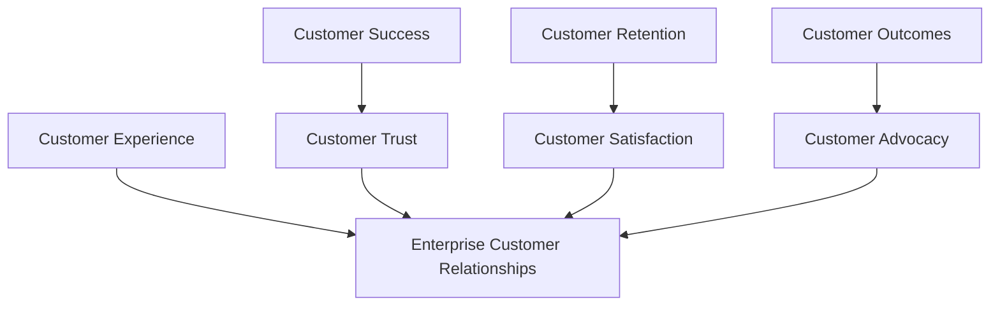
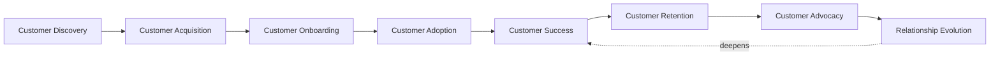
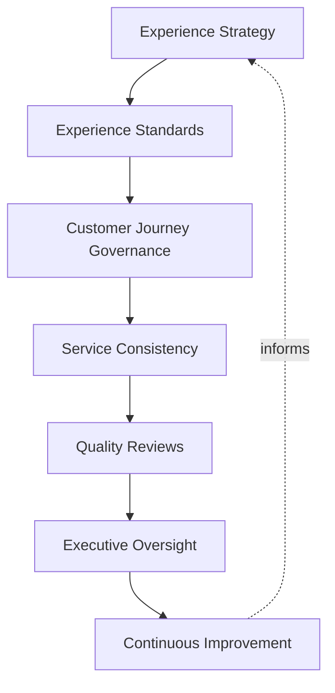
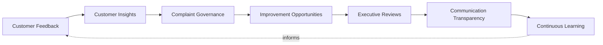
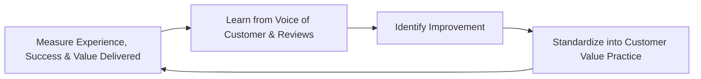
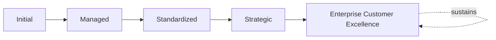

# Enterprise Customer Value Governance Framework

## 1. Executive Summary

**Purpose** — This document defines the official Enterprise Customer Value Governance Framework for **StackLeo Tech Store**. It establishes customer value strategy, customer experience governance, value realization, customer outcome governance, executive oversight, organizational accountability, continuous improvement, and long-term customer value excellence as a deliberate, accountable enterprise discipline. `product-governance-strategy.md`, `product-lifecycle-framework.md`, `product-roadmap-governance.md`, and `product-portfolio-governance.md` each anticipated this framework directly as the dedicated elaboration of their respective Customer Value First and customer-facing principles. This framework does not restate any of them. It governs the customer-facing dimension those frameworks each touch but do not themselves fully elaborate — how StackLeo deliberately governs the value it creates for its customers, across the full relationship.

**Scope** — This framework applies to every dimension of customer value at StackLeo — customer experience, customer success, customer trust, customer retention, customer satisfaction, customer outcomes, customer advocacy, and enterprise customer relationships — coordinated with `product-governance-strategy.md`, `product-lifecycle-framework.md`, `product-roadmap-governance.md`, `product-portfolio-governance.md`, and `00_Project_Overview/stakeholder-engagement-framework.md`.

**Strategic Objectives** — To ensure customer value is governed as a genuine, deliberate enterprise discipline, never left to individual teams' informal judgment; that customer outcomes, not merely product output, are what StackLeo's governance ultimately measures; that the voice of the customer genuinely and continuously informs enterprise decisions; and that customer trust and loyalty are treated as assets requiring deliberate, ongoing stewardship.

**Business Value** — A governed customer value framework protects StackLeo from the disproportionate cost of losing customer trust through inconsistent experience, protects the organization from optimizing for output metrics that do not reflect genuine customer benefit, and gives leadership the confidence to pursue ambitious customer-centric investment because its governance is demonstrably sound.

**Intended Audience** — The Board of Directors, executive leadership, the Chief Product Officer (or equivalent), Customer Success leadership, product leadership, engineering leadership, marketing leadership, operations leadership, support leadership, and business stakeholders.

## 2. Enterprise Customer Value Vision

- **Customer Value as Strategic Advantage** — the value StackLeo creates for its customers is governed as a genuine strategic advantage, never merely a support function's concern.
- **Customer-Centric Organization** — the organization is governed to genuinely orient its decisions around customer benefit, not internal convenience.
- **Sustainable Customer Relationships** — customer relationships are governed for genuine, long-term durability, never optimized for short-term transaction alone.
- **Business Value Through Customer Success** — StackLeo's own business value is governed as genuinely inseparable from the success it creates for its customers.
- **Trust and Brand Loyalty** — customer trust and loyalty are governed as deliberate, cultivated outcomes, never assumed as a byproduct.
- **Continuous Customer Value Creation** — the value created for customers is governed to continuously deepen, never treated as fixed once delivered.
- **Long-Term Enterprise Growth** — customer value governance is pursued as a durable discipline supporting genuine, sustained enterprise growth.

### Enterprise Customer Value Vision Matrix

| Vision Element | Focus | Business Value |
|---|---|---|
| Customer Value as Strategic Advantage | A genuine strategic advantage, not a support concern | Elevates customer value to genuine enterprise priority |
| Customer-Centric Organization | Genuinely orienting decisions around customer benefit | Prevents decisions optimized for internal convenience |
| Sustainable Customer Relationships | Governed for genuine, long-term durability | Protects against short-term transactional thinking |
| Business Value Through Customer Success | StackLeo's value genuinely inseparable from customer success | Aligns business incentive directly with customer benefit |
| Trust and Brand Loyalty | Deliberate, cultivated outcomes, never assumed | Protects the organization's most durable competitive asset |
| Continuous Customer Value Creation | Value continuously deepened, never treated as fixed | Keeps customer relationships genuinely growing |
| Long-Term Enterprise Growth | A durable discipline supporting sustained growth | Converts customer value governance into lasting advantage |

## 3. Customer Value Governance Principles

Customer value governance at StackLeo rests on nine principles, each producing a specific business outcome.

- **Customer First** — every governance decision genuinely weighs customer benefit as a primary consideration. *Business Value:* prevents decisions that quietly deprioritize customer interest.
- **Outcome Over Output** — customer value is judged by genuine outcomes achieved, not activity or feature volume delivered. *Business Value:* protects the organization from mistaking busyness for genuine value.
- **Evidence-Based Decisions** — a customer value decision is grounded in genuine, documented evidence, not assumption. *Business Value:* protects the credibility and defensibility of customer-facing decisions.
- **Transparency** — customer value governance and its outcomes are documented and visible to those who genuinely need them. *Business Value:* allows customer value claims to be scrutinized and defended, not merely trusted on faith.
- **Continuous Feedback** — the voice of the customer genuinely and continuously informs governance, never solicited only sporadically. *Business Value:* keeps governance connected to genuine, current customer reality.
- **Service Excellence** — every customer-facing interaction is governed to a genuinely high, consistent standard. *Business Value:* protects the trust relationship every interaction either reinforces or erodes.
- **Long-Term Relationship Building** — customer value governance favors genuine, durable relationships over short-term transactional gain. *Business Value:* protects the compounding value of long-term customer loyalty.
- **Continuous Improvement** — customer value governance practice matures over time, informed by real outcomes. *Business Value:* keeps governance aligned with the organization's growing scale and complexity.
- **Sustainable Value Creation** — customer value is created in a manner genuinely sustainable for both the customer and the business. *Business Value:* protects against value creation that quietly erodes long-term viability.

### Customer Value Governance Matrix

| Principle | Description | Business Value |
|---|---|---|
| Customer First | Every decision genuinely weighs customer benefit | Prevents decisions that quietly deprioritize customer interest |
| Outcome Over Output | Judged by genuine outcomes, not activity volume | Protects against mistaking busyness for genuine value |
| Evidence-Based Decisions | Grounded in genuine, documented evidence | Protects credibility and defensibility of decisions |
| Transparency | Governance and outcomes documented and visible | Allows claims to be scrutinized and defended |
| Continuous Feedback | Voice of the customer continuously informs governance | Keeps governance connected to genuine, current reality |
| Service Excellence | Every interaction governed to a high, consistent standard | Protects the trust relationship every interaction affects |
| Long-Term Relationship Building | Favors genuine, durable relationships over short-term gain | Protects the compounding value of long-term loyalty |
| Continuous Improvement | Practice matures from real outcomes | Keeps governance aligned with growing scale and complexity |
| Sustainable Value Creation | Created in a manner sustainable for customer and business | Protects against value creation that erodes long-term viability |

## 4. Enterprise Customer Value Governance Model

Customer value governance operates across eight conceptual categories, each holding accountability for a distinct dimension of the customer relationship.

### Customer Experience

- **Purpose** — govern the genuine quality and consistency of every customer-facing interaction.
- **Governance Scope** — coordinated with Customer Experience Governance (Section 6).
- **Business Value** — protects the trust relationship every interaction either reinforces or erodes.
- **Executive Expectations** — leadership expects experience to be governed as a deliberate, measured discipline.

### Customer Success

- **Purpose** — govern whether customers genuinely achieve the outcomes they sought from StackLeo.
- **Governance Scope** — coordinated with Customer Success Outcomes (Section 7).
- **Business Value** — protects the genuine value proposition underlying every customer relationship.
- **Executive Expectations** — leadership expects success to be measured by genuine customer outcomes, not internal activity.

### Customer Trust

- **Purpose** — govern the genuine trust customers place in StackLeo, coordinated with, and never superseding, `06_Security/data-privacy-framework.md`.
- **Governance Scope** — oversight ensuring trust-affecting decisions meet the rigor those frameworks require.
- **Business Value** — protects StackLeo's most durable, hardest-to-rebuild asset.
- **Executive Expectations** — leadership expects trust-affecting decisions to receive elevated, deliberate scrutiny.

### Customer Retention

- **Purpose** — govern whether customers genuinely choose to continue their relationship with StackLeo.
- **Governance Scope** — coordinated with Relationship Evolution (Section 5).
- **Business Value** — protects the compounding value of a durable, retained customer base.
- **Executive Expectations** — leadership expects retention to be understood through genuine cause, not treated as a lagging surprise.

### Customer Satisfaction

- **Purpose** — govern whether customers are genuinely satisfied with their experience of StackLeo.
- **Governance Scope** — coordinated with Voice of Customer Governance (Section 8).
- **Business Value** — protects an early, honest signal of genuine relationship health.
- **Executive Expectations** — leadership expects satisfaction signals to be genuinely and continuously monitored, not assumed.

### Customer Outcomes

- **Purpose** — govern whether the business and customer-success outcomes customers seek are genuinely being achieved.
- **Governance Scope** — coordinated with Customer Outcome Governance (Section 7).
- **Business Value** — protects the fundamental premise that StackLeo's products deliver genuine benefit.
- **Executive Expectations** — leadership expects outcomes to be validated with genuine evidence, not presumed from delivery.

### Customer Advocacy

- **Purpose** — govern whether customers genuinely advocate for StackLeo based on real experience.
- **Governance Scope** — coordinated with Customer Advocacy (Section 5, Customer Value Lifecycle Framework).
- **Business Value** — protects the organic trust advocacy creates, which paid channels cannot replicate.
- **Executive Expectations** — leadership expects advocacy to be earned through genuine value, never engineered artificially.

### Enterprise Customer Relationships

- **Purpose** — govern the synthesized, executive-relevant picture of StackLeo's overall customer relationship health across every category above.
- **Governance Scope** — oversight exclusively accountable for converging every category into one coherent enterprise picture.
- **Business Value** — protects leadership's ability to understand overall customer relationship health as a whole.
- **Executive Expectations** — leadership expects one coherent relationship picture, not eight disconnected category views.

### Customer Value Governance Matrix

| Domain | Purpose | Business Value | Executive Expectations |
|---|---|---|---|
| Customer Experience | Govern quality and consistency of every interaction | Protects the trust relationship every interaction affects | Expects experience governed as a deliberate, measured discipline |
| Customer Success | Govern whether customers genuinely achieve sought outcomes | Protects the genuine value proposition of every relationship | Expects success measured by genuine outcomes, not activity |
| Customer Trust | Govern the genuine trust customers place in StackLeo | Protects StackLeo's most durable, hardest-to-rebuild asset | Expects elevated, deliberate scrutiny for trust-affecting decisions |
| Customer Retention | Govern whether customers genuinely continue the relationship | Protects the compounding value of a retained customer base | Expects retention understood through genuine cause |
| Customer Satisfaction | Govern whether customers are genuinely satisfied | Protects an early, honest signal of relationship health | Expects continuous monitoring, never assumption |
| Customer Outcomes | Govern whether sought outcomes are genuinely achieved | Protects the premise that products deliver genuine benefit | Expects outcomes validated with genuine evidence |
| Customer Advocacy | Govern whether customers genuinely advocate for StackLeo | Protects organic trust paid channels cannot replicate | Expects advocacy earned through genuine value |
| Enterprise Customer Relationships | Synthesize overall relationship health picture | Protects leadership's ability to understand health as a whole | Expects one coherent picture, not disconnected views |

*Diagram 1: Enterprise Customer Value Governance Framework — experience, success and trust, retention and satisfaction, and outcomes and advocacy each converge into the enterprise customer relationships' synthesized picture.*

## 5. Customer Value Lifecycle Framework

The customer value lifecycle is governed across eight conceptual stages, remaining implementation independent throughout.

### Customer Discovery

- **Governance Objectives** — confirm a prospective customer's genuine needs are understood before engagement begins.
- **Decision Authority** — Marketing Leadership, coordinated with Product Leadership.
- **Expected Outcomes** — a genuinely informed basis for subsequent acquisition.
- **Review Requirements** — periodic review of discovery insight quality.

### Customer Acquisition

- **Governance Objectives** — confirm a new customer relationship is established on a genuinely honest, well-matched basis.
- **Decision Authority** — Marketing Leadership, coordinated with Customer Success Leadership.
- **Expected Outcomes** — customer relationships genuinely likely to succeed.
- **Review Requirements** — review of acquisition-to-success correlation.

### Customer Onboarding

- **Governance Objectives** — confirm a new customer is genuinely equipped to realize value quickly.
- **Decision Authority** — Customer Success Leadership.
- **Expected Outcomes** — customers reaching genuine early value with minimal friction.
- **Review Requirements** — review of onboarding experience quality.

### Customer Adoption

- **Governance Objectives** — confirm a customer genuinely incorporates StackLeo's products into their ongoing use.
- **Decision Authority** — Customer Success Leadership, coordinated with Product Leadership.
- **Expected Outcomes** — genuine, sustained product adoption.
- **Review Requirements** — review of adoption depth and breadth.

### Customer Success

- **Governance Objectives** — confirm a customer genuinely achieves the outcome they sought.
- **Decision Authority** — Customer Success Leadership.
- **Expected Outcomes** — validated, genuine customer success.
- **Review Requirements** — review per Customer Outcome Governance (Section 7).

### Customer Retention

- **Governance Objectives** — confirm a successful customer genuinely chooses to continue the relationship.
- **Decision Authority** — Customer Success Leadership, escalating to executive leadership for significant risk.
- **Expected Outcomes** — a genuinely durable, retained relationship.
- **Review Requirements** — review of retention health and risk signals.

### Customer Advocacy

- **Governance Objectives** — confirm a genuinely satisfied customer's willingness to advocate is recognized and, where appropriate, invited.
- **Decision Authority** — Marketing Leadership, coordinated with Customer Success Leadership.
- **Expected Outcomes** — organic advocacy grounded in genuine experience.
- **Review Requirements** — review of advocacy authenticity and quality.

### Relationship Evolution

- **Governance Objectives** — confirm the relationship's ongoing evolution genuinely continues to serve both customer and business.
- **Decision Authority** — Customer Success Leadership, coordinated with executive leadership for strategic accounts.
- **Expected Outcomes** — a relationship that deepens deliberately over time.
- **Review Requirements** — periodic strategic relationship review.

### Customer Lifecycle Matrix

| Stage | Governance Objectives | Decision Authority | Expected Outcomes | Review Requirements |
|---|---|---|---|---|
| Customer Discovery | Confirm genuine needs understood before engagement | Marketing Leadership with Product Leadership | A genuinely informed acquisition basis | Periodic discovery insight review |
| Customer Acquisition | Confirm relationship established on a genuine, honest basis | Marketing Leadership with Customer Success Leadership | Relationships genuinely likely to succeed | Acquisition-to-success correlation review |
| Customer Onboarding | Confirm customer genuinely equipped for quick value | Customer Success Leadership | Genuine early value with minimal friction | Onboarding experience quality review |
| Customer Adoption | Confirm genuine incorporation into ongoing use | Customer Success Leadership with Product Leadership | Genuine, sustained product adoption | Adoption depth and breadth review |
| Customer Success | Confirm genuine achievement of sought outcome | Customer Success Leadership | Validated, genuine customer success | Review per Customer Outcome Governance |
| Customer Retention | Confirm genuine choice to continue the relationship | Customer Success Leadership, executive leadership for significant risk | A genuinely durable, retained relationship | Retention health and risk signal review |
| Customer Advocacy | Confirm genuine willingness to advocate is recognized | Marketing Leadership with Customer Success Leadership | Organic advocacy grounded in genuine experience | Advocacy authenticity and quality review |
| Relationship Evolution | Confirm ongoing evolution genuinely serves both parties | Customer Success Leadership, executive leadership for strategic accounts | A relationship that deepens deliberately over time | Periodic strategic relationship review |

*Diagram 2: Customer Value Lifecycle — discovery and acquisition lead into onboarding and adoption, resolving into success, retention, and advocacy, with relationship evolution deepening the relationship back through continued success.*

## 6. Customer Experience Governance

- **Experience Strategy** — governs the organization's overall, deliberate approach to customer experience.
- **Experience Standards** — governs the genuine, consistent standard every customer-facing interaction is held to.
- **Customer Journey Governance** — governs how the customer's genuine end-to-end journey is deliberately understood and shaped.
- **Service Consistency** — governs whether customer experience remains genuinely consistent across every channel and touchpoint.
- **Quality Reviews** — governs how customer experience quality is deliberately, periodically reviewed.
- **Executive Oversight** — governs the point at which customer experience findings genuinely require executive attention.
- **Continuous Improvement** — governs how customer experience practice deliberately matures from real outcomes.

### Customer Experience Governance Matrix

| Governance Area | Focus | Coordination |
|---|---|---|
| Experience Strategy | Overall, deliberate approach to customer experience | Customer Experience (Section 4) |
| Experience Standards | Genuine, consistent standard for every interaction | Service Excellence (Section 3) |
| Customer Journey Governance | Genuine end-to-end journey deliberately understood | Customer Value Lifecycle Framework (Section 5) |
| Service Consistency | Genuine consistency across every channel and touchpoint | Experience Standards (this section) |
| Quality Reviews | Experience quality deliberately, periodically reviewed | Executive Oversight (Section 10) |
| Executive Oversight | Point requiring genuine executive attention | Customer Experience Reviews (Section 10) |
| Continuous Improvement | Practice deliberately maturing from real outcomes | Continuous Improvement (Section 3) |

*Diagram 3: Customer Experience Governance Model — experience strategy and standards inform journey governance and service consistency, feeding quality reviews and executive oversight, with continuous improvement feeding lessons back into strategy.*

## 7. Customer Outcome Governance

- **Business Outcomes** — governs whether StackLeo's own business benefits from customer value delivered.
- **Customer Success Outcomes** — governs whether the customer genuinely achieves the outcome they sought.
- **Value Measurement** — governs how genuine customer value delivered is deliberately measured.
- **Benefit Validation** — governs how a claimed customer benefit is deliberately validated as genuinely realized.
- **Strategic Alignment** — governs whether customer outcome governance remains genuinely connected to business strategy.
- **Continuous Optimization** — governs how customer outcome practice deliberately improves from real results.
- **Organizational Learning** — governs how understanding gained from outcome governance deepens future decisions.

### Customer Outcome Matrix

| Governance Area | Focus | Coordination |
|---|---|---|
| Business Outcomes | Whether StackLeo's own business benefits | Business Value Through Customer Success (Section 2) |
| Customer Success Outcomes | Whether the customer genuinely achieves the sought outcome | Customer Success (Section 4) |
| Value Measurement | Genuine customer value delivered deliberately measured | Outcome Over Output (Section 3) |
| Benefit Validation | Claimed benefit deliberately validated as genuinely realized | Evidence-Based Decisions (Section 3) |
| Strategic Alignment | Governance remaining genuinely connected to strategy | `01_Business/business-model.md` |
| Continuous Optimization | Practice deliberately improving from real results | Continuous Improvement (Section 3) |
| Organizational Learning | Understanding deepening future decisions | Continuous Improvement Reviews (Section 10) |

## 8. Voice of Customer Governance

- **Customer Feedback** — governs how customer feedback is deliberately, continuously solicited and captured.
- **Customer Insights** — governs how captured feedback is deliberately synthesized into genuine insight.
- **Complaint Governance** — governs how a customer complaint is deliberately received, addressed, and learned from.
- **Improvement Opportunities** — governs how insight and complaints deliberately surface genuine improvement opportunities.
- **Executive Reviews** — governs how the voice of the customer is deliberately surfaced to executive leadership.
- **Communication Transparency** — governs how the organization deliberately communicates back to customers on action taken.
- **Continuous Learning** — governs how voice-of-customer practice deliberately matures from real experience.

### Voice of Customer Matrix

| Governance Area | Focus | Coordination |
|---|---|---|
| Customer Feedback | Deliberately, continuously solicited and captured | Continuous Feedback (Section 3) |
| Customer Insights | Feedback deliberately synthesized into genuine insight | Customer Satisfaction (Section 4) |
| Complaint Governance | Deliberately received, addressed, and learned from | Service Excellence (Section 3) |
| Improvement Opportunities | Insight and complaints surfacing genuine opportunity | Continuous Improvement (Section 6) |
| Executive Reviews | Voice of the customer deliberately surfaced to leadership | Customer Value Reviews (Section 10) |
| Communication Transparency | Organization communicating back on action taken | Transparency (Section 3) |
| Continuous Learning | Practice deliberately maturing from real experience | Organizational Learning (Section 7) |

*Diagram 4: Voice of Customer Framework — feedback and insights inform complaint governance and improvement opportunities, feeding executive reviews and transparent communication, with continuous learning feeding lessons back into feedback capture.*

## 9. Organizational Governance

Governance accountability is distributed deliberately across ten organizational roles.

- **Board of Directors** — holds ultimate accountability for whether StackLeo's customer relationships genuinely serve the business's long-term direction.
- **Executive Leadership** — holds accountability for whether customer value decisions genuinely align with business strategy, in partnership with the Board.
- **Chief Product Officer (or equivalent)** — owns the coherence and enforcement of this framework across every customer value domain.
- **Customer Success Leadership** — owns the operational execution of the Customer Value Lifecycle Framework (Section 5) and Customer Outcome Governance (Section 7).
- **Product Leadership** — own Customer Adoption (Section 5) and Customer Outcomes (Section 4) within their accountable product categories.
- **Engineering Leadership** — own the technical reliability underlying Customer Experience (Section 4).
- **Marketing Leadership** — own Customer Discovery, Acquisition, and Advocacy (Section 5).
- **Operations Leadership** — own Service Consistency (Section 6) in coordination with `09_Operations/service-management-framework.md`.
- **Support Leadership** — own Complaint Governance (Section 8) and day-to-day service quality.
- **Business Stakeholders** — own Business Outcomes (Section 7) input for customer relationships affecting their domain.

### Organizational Responsibility Matrix

| Role | Governance Objective | Business Value |
|---|---|---|
| Board of Directors | Hold ultimate accountability for relationships serving direction | Provides the highest point of ultimate accountability |
| Executive Leadership | Hold accountability for decisions aligning with business strategy | Provides a single point of executive-level accountability |
| Chief Product Officer | Own coherence and enforcement across every customer value domain | Provides a single point of specialist accountability |
| Customer Success Leadership | Own operational execution of lifecycle and outcome governance | Provides a dedicated point of customer success accountability |
| Product Leadership | Own adoption and outcomes within accountable categories | Embeds accountability closest to where products are shaped |
| Engineering Leadership | Own technical reliability underlying experience | Embeds accountability closest to where technology is delivered |
| Marketing Leadership | Own discovery, acquisition, and advocacy | Ensures the relationship begins and grows on a genuine basis |
| Operations Leadership | Own service consistency | Ensures experience remains genuinely consistent operationally |
| Support Leadership | Own complaint governance and day-to-day service quality | Ensures issues are genuinely addressed and learned from |
| Business Stakeholders | Own business outcomes input for their domain | Connects customer value decisions to genuine business relevance |

## 10. Executive Oversight

- **Customer Value Reviews** — the overall coherence of customer value strategy is formally reviewed on a regular cadence.
- **Customer Experience Reviews** — customer experience quality and consistency are reviewed directly with executive leadership.
- **Customer Success Reviews** — genuine customer success outcomes are reviewed as a distinct, ongoing concern.
- **Strategic Alignment Reviews** — customer value governance's genuine connection to business strategy is reviewed with executive leadership.
- **Risk Reviews** — the organization's customer-relationship-related risk posture is reviewed directly with executive leadership.
- **Continuous Improvement Reviews** — the organization's follow-through on captured customer value lessons is reviewed directly with executive leadership.

### Executive Oversight Matrix

| Oversight Mechanism | Purpose | Governance Role |
|---|---|---|
| Customer Value Reviews | Confirm overall customer value strategy coherence | Regular, predictable cadence for the framework as a whole |
| Customer Experience Reviews | Review experience quality and consistency | Direct executive-level experience review |
| Customer Success Reviews | Review genuine customer success outcomes | Treats success as ongoing, not assumed |
| Strategic Alignment Reviews | Review genuine connection to business strategy | Direct executive-level strategic alignment review |
| Risk Reviews | Review customer-relationship-related risk posture | Direct executive-level review of risk exposure |
| Continuous Improvement Reviews | Review follow-through on captured lessons | Direct executive-level review of improvement completion |

## 11. Future Readiness

This framework is designed to remain valid as StackLeo evolves in scale, geography, and organizational complexity.

- **AI-Assisted Customer Insights** — as customer insight generation increasingly incorporates AI-assisted methods, coordinated with `04_Database/ai-governance.md`, it remains governed under Customer Insights (Section 8) at the same rigor as any other method.
- **Predictive Customer Success** — where the organization develops the capability to anticipate customer success or risk before it fully materializes, that capability is governed as an extension of Customer Success Outcomes (Section 7).
- **Intelligent Experience Governance** — where experience quality increasingly draws on intelligent pattern analysis, that analysis remains subject to the same Customer Experience Governance (Section 6) as any other method.
- **Adaptive Customer Engagement** — where engagement increasingly adapts to genuinely changing customer preference, that evolution remains governed under Continuous Improvement (Section 3) at the same rigor as any other method.
- **Digital Customer Value Evolution** — new customer engagement channels are adopted only in a manner consistent with Customer First (Section 3), never at its expense.
- **Sustainable Customer Relationships** — Customer Discovery and Customer Acquisition (Section 5) are structured to be re-applied as StackLeo expands from Bangladesh into South Asia and global markets.

## 12. Customer Value Maturity Model

Customer value governance maturity is described across five conceptual levels.

- **Initial** — customer value governance, where it exists, is informal and inconsistent; decisions are made reactively, and ownership is unclear.
- **Managed** — basic customer value governance exists for individual domains, but consistency across the eight domains in Section 4 varies significantly.
- **Standardized** — the governance model, lifecycle framework, and outcome governance are standardized, documented, and consistently applied across the organization.
- **Strategic** — customer value decisions are genuinely and routinely made in deliberate service of business strategy, not activity convenience.
- **Enterprise Customer Excellence** — customer value governance is continuously and deliberately improved based on quantitative evidence and organizational learning; customer value capability functions as a genuine, sustained source of enterprise excellence.

### Customer Value Maturity Matrix

| Level | Characteristics | Primary Focus |
|---|---|---|
| Initial | Informal, inconsistent governance; decisions made reactively | Ad hoc, individually-dependent customer value practice |
| Managed | Basic governance exists per domain; consistency varies | Domain-level consistency |
| Standardized | Standardized governance model, lifecycle, and outcome governance | Organization-wide consistency and clear ownership |
| Strategic | Decisions genuinely and routinely made in service of strategy | Business-strategy-driven customer value decision-making |
| Enterprise Customer Excellence | Practice continuously improved; customer value as competitive advantage | Sustained, deliberate, enterprise-wide customer excellence |

*Diagram 5: Continuous Customer Value Improvement Cycle — experience, success, and delivered value are measured, learned from through the voice of the customer and executive reviews, improved upon, and standardized back into governed practice, on a continuing basis.*

*Diagram 6: Customer Value Maturity Progression — maturity advances from informal, reactively-decided customer value practice toward standardized, genuinely strategy-driven, and continuously excellent enterprise customer value governance.*

## 13. Customer Value Anti-Patterns

- **Product-Centric Thinking** — governing customer value around product feature delivery rather than genuine customer outcome produces effort without genuine benefit.
- **Ignoring Customer Feedback** — allowing captured feedback to go unaddressed wastes the organization's clearest signal of genuine customer need.
- **Reactive Customer Support** — addressing customer concerns only after they escalate erodes trust that proactive attention would have preserved.
- **Weak Customer Ownership** — allowing no genuine owner for the end-to-end customer relationship produces disjointed, inconsistent experience.
- **Inconsistent Customer Experience** — allowing experience quality to vary unpredictably across channels erodes the trust consistency builds.
- **Short-Term Value Focus** — optimizing for immediate transaction at the expense of long-term relationship value undermines sustainable growth.
- **Siloed Customer Decisions** — making customer-affecting decisions within a single function without genuine cross-functional coordination prevents one coherent relationship picture.
- **No Continuous Improvement** — treating current customer value practice as permanently finished guarantees it falls behind evolving customer expectation.

### Anti-Pattern Summary

| Anti-Pattern | Organizational & Business Impact |
|---|---|
| Product-Centric Thinking | Produces effort without genuine customer benefit |
| Ignoring Customer Feedback | Wastes the clearest signal of genuine customer need |
| Reactive Customer Support | Erodes trust that proactive attention would have preserved |
| Weak Customer Ownership | Produces disjointed, inconsistent experience |
| Inconsistent Customer Experience | Erodes the trust that consistency builds |
| Short-Term Value Focus | Undermines sustainable, long-term relationship growth |
| Siloed Customer Decisions | Prevents one coherent, organization-wide relationship picture |
| No Continuous Improvement | Guarantees practice falls behind evolving customer expectation |

## Related Documents

| Document | Relationship |
|---|---|
| `product-governance-strategy.md` | Anticipated this framework by name; sets the individual product governance model this framework's customer value domains connect to. |
| `product-lifecycle-framework.md` | Establishes the stage-gate discipline through which customer value is delivered by individual products. |
| `product-roadmap-governance.md` | Consumes this framework's Customer Outcome Governance (Section 7) as an input to Customer Experience Roadmaps. |
| `product-portfolio-governance.md` | Anticipated this framework by name; consumes this framework's principles as an input to Customer Experience Portfolio balancing. |
| `product-risk-governance.md` | Provides a deeper elaboration of customer-relationship-related risk (Section 10). |
| `product-maturity-framework.md` | Consolidates the maturity model this framework defines in Section 12 into the enterprise-wide product maturity picture. |
| `01_Business/business-model.md` | Establishes the business strategy this framework's Strategic Alignment (Section 7) is ultimately measured against. |
| `00_Project_Overview/stakeholder-engagement-framework.md` | Establishes the broader stakeholder engagement discipline this framework's customer-specific governance specializes. |

## Document Information

| Property | Value |
|----------|-------|
| Document | customer-value-governance.md |
| Version | 1.0.0 |
| Status | Active |
| Maintained By | StackLeo |
| Last Updated | 2026-07-29 |

---

© StackLeo. All Rights Reserved.
