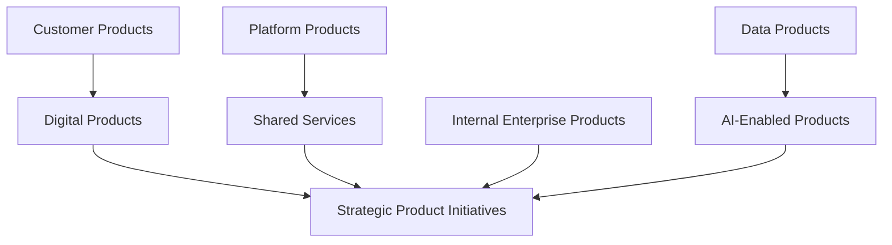
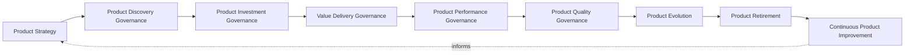
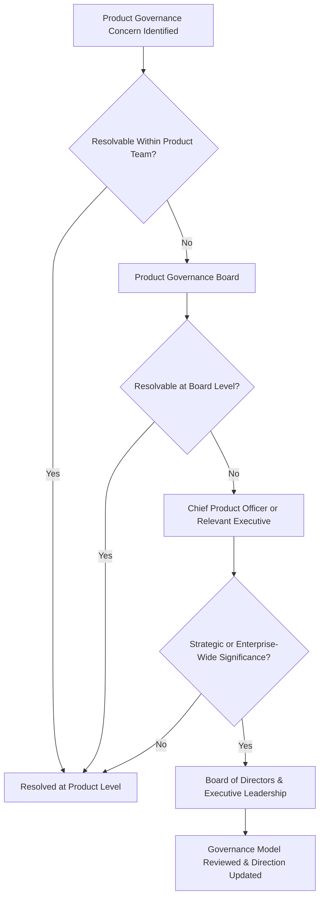
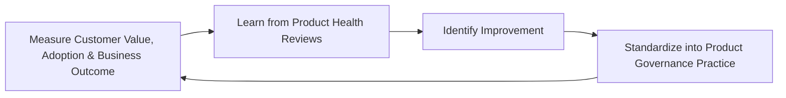
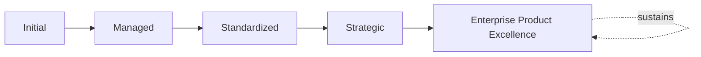

# Enterprise Product Governance Strategy

## 1. Executive Summary

**Purpose** — This document defines the official Enterprise Product Governance Strategy for **StackLeo Tech Store**. It establishes product governance, product strategy, value delivery governance, organizational accountability, executive oversight, portfolio alignment, continuous improvement, and long-term product excellence as a deliberate, accountable enterprise discipline. `product-roadmap.md` and `product-overview.md` describe the platform's concrete product direction and current state. This strategy sits above both as the governance layer that ensures every product decision — what StackLeo builds, invests in, and eventually retires — is made deliberately, by accountable people, in genuine service of customer and business value.

**Scope** — This strategy applies to every category of product at StackLeo — customer, digital, platform, internal enterprise, shared services, data, AI-enabled products, and strategic product initiatives — coordinated with `product-roadmap.md`, `01_Business/business-model.md`, and `03_System_Design/enterprise-architecture-strategy.md`.

**Strategic Objectives** — To ensure every product decision begins from genuine customer value, never technology convenience alone; that product investment is prioritized by genuine business and customer consequence; that product decisions are made deliberately, by accountable people, against consistent governance; and that executive leadership has continuous, honest visibility into the organization's product portfolio and value delivery health.

**Business Value** — Governed product strategy protects StackLeo from the disproportionate cost of building what does not genuinely serve customers or the business, protects the coherence of the product portfolio as it grows from single-seller retail toward corporate sales, wholesale, and marketplace, and gives leadership the confidence to invest in ambitious product direction because its governance is demonstrably sound.

**Intended Audience** — The Board of Directors, executive leadership, the Chief Product Officer (or equivalent), the Chief Technology Officer, the Product Governance Board, product leadership, engineering leadership, design leadership, operations leadership, and business stakeholders.

## 2. Enterprise Product Governance Vision

- **Products as Strategic Business Assets** — every product is governed as a genuine strategic business asset, never merely a collection of features.
- **Customer Value First** — product decisions are ultimately judged by the genuine value they create for customers.
- **Sustainable Product Growth** — the product portfolio is governed to evolve deliberately alongside the business, never allowed to accumulate unmanaged sprawl.
- **Product Governance as Competitive Advantage** — deliberate, disciplined product governance is treated as a genuine source of durable competitive advantage.
- **Long-Term Product Evolution** — products are governed to evolve deliberately over their full lifetime, never frozen at initial launch.
- **Business–Technology Alignment** — product direction remains genuinely connected to both business strategy and technical architecture.
- **Organizational Product Excellence** — product governance reflects the same discipline and excellence StackLeo expects of every other business function.

### Enterprise Product Governance Vision Matrix

| Vision Element | Focus | Business Value |
|---|---|---|
| Products as Strategic Business Assets | A genuine strategic asset, not a feature collection | Prevents products from being managed as disconnected technical output |
| Customer Value First | Decisions judged by genuine value created for customers | Keeps product direction connected to what customers value |
| Sustainable Product Growth | Evolving deliberately, never accumulating unmanaged sprawl | Keeps the portfolio genuinely manageable as it grows |
| Product Governance as Competitive Advantage | Disciplined governance as a genuine source of advantage | Converts governance investment into genuine market differentiation |
| Long-Term Product Evolution | Evolving deliberately over the full lifetime | Protects products from becoming frozen and outdated |
| Business–Technology Alignment | Genuinely connected to strategy and architecture | Ensures product investment is directed by coherent intent |
| Organizational Product Excellence | Reflecting the same discipline expected of any function | Protects product governance's credibility as a genuine discipline |

## 3. Product Governance Principles

Product governance at StackLeo rests on nine principles, each producing a specific business outcome.

- **Customer Value First** — a product decision is justified by the genuine value it creates for customers, never pursued for technical interest alone. *Business Value:* prevents product investment disconnected from genuine customer need.
- **Business Alignment** — every product decision remains genuinely connected to StackLeo's broader business strategy. *Business Value:* ensures product investment is spent on what genuinely matters to the business.
- **Product Ownership Accountability** — every product traces to a specific, named, responsible owner. *Business Value:* ensures no product drifts without someone genuinely responsible for it.
- **Evidence-Based Decisions** — product decisions are grounded in genuine, documented evidence, not impression. *Business Value:* protects the credibility and defensibility of every product decision.
- **Strategic Prioritization** — product investment is prioritized by genuine strategic value, never by whoever asks loudest. *Business Value:* directs limited product investment toward what genuinely matters most.
- **Transparency** — product decisions and their rationale are documented and visible to those who genuinely need them. *Business Value:* allows product decisions to be scrutinized and defended, not merely trusted on faith.
- **Continuous Improvement** — product governance practice matures over time, informed by real product outcomes. *Business Value:* keeps governance aligned with the organization's growing scale and complexity.
- **Innovation Governance** — new product approaches are embraced deliberately, within a genuinely governed structure. *Business Value:* balances genuine innovation against the risk of ungoverned experimentation.
- **Product Sustainability** — a product is governed to be genuinely sustainable to operate and evolve, never built without regard for its long-term cost. *Business Value:* protects the organization from the disproportionate cost of an unsustainable product.

### Product Governance Principles Matrix

| Principle | Description | Business Value |
|---|---|---|
| Customer Value First | Justified by genuine value created for customers | Prevents investment disconnected from genuine customer need |
| Business Alignment | Genuinely connected to broader business strategy | Ensures investment is spent on what genuinely matters |
| Product Ownership Accountability | Every product traces to a specific, responsible owner | Ensures no product drifts without genuine responsibility |
| Evidence-Based Decisions | Grounded in genuine, documented evidence | Protects credibility and defensibility of decisions |
| Strategic Prioritization | Prioritized by genuine strategic value | Directs limited investment toward what genuinely matters most |
| Transparency | Decisions and rationale documented and visible | Allows decisions to be scrutinized and defended |
| Continuous Improvement | Practice matures from real product outcomes | Keeps governance aligned with growing scale and complexity |
| Innovation Governance | New approaches embraced within a governed structure | Balances innovation benefit against ungoverned experimentation |
| Product Sustainability | Genuinely sustainable to operate and evolve | Protects against the disproportionate cost of an unsustainable product |

## 4. Enterprise Product Governance Model

Product governance operates across eight conceptual categories, each holding accountability for a distinct product type.

### Customer Products

- **Purpose** — govern products customers directly interact with and depend upon.
- **Governance Scope** — coordinated with `01_Business/vision.md`'s trust-centered brand commitment.
- **Business Value** — protects the most direct point of customer encounter with StackLeo.
- **Executive Expectations** — leadership expects customer products to be held to elevated rigor given direct customer exposure.

### Digital Products

- **Purpose** — govern the digital channels through which StackLeo delivers value — web today, mobile and future channels.
- **Governance Scope** — coordinated with `02_Product/product-roadmap.md`.
- **Business Value** — protects the platform's evolving digital footprint as a coherent, governed whole.
- **Executive Expectations** — leadership expects digital product governance to remain consistent as new channels emerge.

### Platform Products

- **Purpose** — govern shared platform capability consumed across multiple customer-facing products.
- **Governance Scope** — coordinated with `07_DevOps/platform-engineering.md`.
- **Business Value** — ensures a platform-level product failure is never treated as a single team's isolated concern.
- **Executive Expectations** — leadership expects platform products to be governed with awareness of their broad dependency footprint.

### Internal Enterprise Products

- **Purpose** — govern products used internally by StackLeo employees to conduct business.
- **Governance Scope** — coordinated with `identity-access-governance.md` (Workforce Identity).
- **Business Value** — protects employees' ability to genuinely rely on internal capability.
- **Executive Expectations** — leadership expects internal products to be governed to the same standard as customer-facing products.

### Shared Services

- **Purpose** — govern service capability shared and consumed across multiple products.
- **Governance Scope** — coordinated with `service-management-framework.md`.
- **Business Value** — protects the coherence of capability multiple products genuinely depend on.
- **Executive Expectations** — leadership expects shared services to be governed as deliberately as any customer-facing product.

### Data Products

- **Purpose** — govern products delivering data and analytical capability.
- **Governance Scope** — coordinated with `04_Database/analytics-strategy.md` and `04_Database/business-intelligence-framework.md`.
- **Business Value** — protects the trustworthiness of the data-derived value the organization delivers.
- **Executive Expectations** — leadership expects data products to be governed proportionate to data sensitivity.

### AI-Enabled Products

- **Purpose** — govern products incorporating AI or ML capability, jointly with, and never superseding, `04_Database/ai-governance.md` and `04_Database/ml-governance.md`.
- **Governance Scope** — oversight ensuring AI-enabled products meet the rigor those frameworks require.
- **Business Value** — protects StackLeo's core trust differentiator through genuinely governed AI product capability.
- **Executive Expectations** — leadership expects AI-enabled products to be treated with elevated, deliberate scrutiny.

### Strategic Product Initiatives

- **Purpose** — govern the synthesized, executive-relevant picture of the organization's most significant product investment across every category above.
- **Governance Scope** — oversight exclusively accountable for converging every category into one coherent enterprise picture.
- **Business Value** — protects leadership's ability to understand overall product posture as a whole.
- **Executive Expectations** — leadership expects one coherent product picture, not eight disconnected category views.

### Enterprise Product Governance Matrix

| Domain | Purpose | Business Value | Executive Expectations |
|---|---|---|---|
| Customer Products | Govern products customers directly interact with | Protects the most direct point of customer encounter | Expects elevated rigor given direct customer exposure |
| Digital Products | Govern digital delivery channels | Protects the evolving digital footprint as a coherent whole | Expects consistency as new channels emerge |
| Platform Products | Govern shared platform capability | Ensures a failure is never one team's isolated concern | Expects awareness of broad dependency footprint |
| Internal Enterprise Products | Govern products used by employees | Protects employees' ability to genuinely rely on capability | Expects the same standard as customer-facing products |
| Shared Services | Govern service capability shared across products | Protects coherence of capability multiple products depend on | Expects governance as deliberate as any customer-facing product |
| Data Products | Govern products delivering data and analytical capability | Protects trustworthiness of data-derived value | Expects governance proportionate to data sensitivity |
| AI-Enabled Products | Govern products incorporating AI or ML capability | Protects StackLeo's core trust differentiator | Expects elevated, deliberate scrutiny |
| Strategic Product Initiatives | Synthesize the enterprise product investment picture | Protects leadership's ability to understand posture as a whole | Expects one coherent picture, not disconnected views |

*Diagram 1: Enterprise Product Governance Framework — customer and digital products, platform products and shared services, internal enterprise products, and data and AI-enabled products all converge on strategic product initiatives' synthesized enterprise picture.*

## 5. Product Governance Capability Framework

Product governance capability is governed across nine conceptual domains, each requiring a distinct governance emphasis. Remaining implementation independent, these domains describe capability — never a specific methodology, tool, or workflow.

- **Product Strategy** — governs how product direction is deliberately planned in service of genuine business and customer value.
- **Product Discovery Governance** — governs how a genuine customer or market opportunity is deliberately investigated before commitment.
- **Product Investment Governance** — governs how product investment is deliberately allocated across genuinely competing opportunity.
- **Value Delivery Governance** — governs how a product's genuine delivery of intended value is confirmed.
- **Product Performance Governance** — governs how a product's genuine performance against expectation is continuously assessed.
- **Product Quality Governance** — governs how a product's genuine quality is confirmed, coordinated with `08_Quality_Assurance/qa-governance.md`.
- **Product Evolution** — governs how a product's design deliberately evolves alongside genuine customer and business need.
- **Product Retirement** — governs how a product no longer delivering genuine value is deliberately retired.
- **Continuous Product Improvement** — governs how product governance practice deliberately matures from real outcomes.

### Product Governance Capability Matrix

| Capability | Governance Focus | Coordination |
|---|---|---|
| Product Strategy | Direction planned in service of genuine business and customer value | Enterprise Product Governance Vision (Section 2) |
| Product Discovery Governance | Genuine opportunity deliberately investigated before commitment | Market Opportunity Identification (Section 6) |
| Product Investment Governance | Investment deliberately allocated across competing opportunity | Strategic Prioritization (Section 3) |
| Value Delivery Governance | Genuine delivery of intended value confirmed | Value Delivery Governance coordinated with Section 6 |
| Product Performance Governance | Genuine performance against expectation continuously assessed | Product Growth and Optimization (Section 6) |
| Product Quality Governance | Genuine quality confirmed | `08_Quality_Assurance/qa-governance.md` |
| Product Evolution | Design deliberately evolving alongside genuine need | Product Growth (Section 6) |
| Product Retirement | Products no longer delivering value deliberately retired | Product Retirement (Section 6) |
| Continuous Product Improvement | Practice deliberately maturing from real outcomes | Continuous Improvement (Section 3) |

*Diagram 2: Product Governance Capability Model — product strategy and discovery inform investment and value delivery governance, feeding performance and quality governance, with product evolution, retirement, and continuous improvement feeding lessons back into strategy.*

## 6. Product Lifecycle Governance

Product governance operates across nine conceptual lifecycle stages.

- **Market Opportunity Identification** — govern how a genuine market or customer opportunity is recognized before a product is pursued.
- **Product Strategy** — govern how a recognized opportunity's genuine strategic direction is deliberately defined.
- **Product Validation** — govern how a strategic direction is genuinely validated against real customer and market evidence before investment.
- **Product Development Governance** — govern the oversight applied while a validated product is genuinely built, without prescribing the technical method.
- **Product Launch Readiness** — govern how a developed product's genuine readiness for launch is confirmed.
- **Product Growth** — govern how a launched product's genuine adoption and value are deliberately grown.
- **Product Optimization** — govern how a growing product is deliberately refined based on genuine performance evidence.
- **Product Retirement** — govern how a product no longer delivering genuine value is deliberately retired.
- **Organizational Learning** — govern how understanding gained across a product's lifecycle deepens the organization's genuine collective capability.

### Product Lifecycle Matrix

| Stage | Governance Objective | Business Value |
|---|---|---|
| Market Opportunity Identification | Recognize a genuine opportunity before pursuit | Ensures product effort is deliberately directed |
| Product Strategy | Deliberately define genuine strategic direction | Prevents a product proceeding without genuine intent |
| Product Validation | Validate direction against real customer and market evidence | Protects investment from being committed on assumption alone |
| Product Development Governance | Apply oversight during genuine development | Ensures development remains within governed boundaries |
| Product Launch Readiness | Confirm genuine readiness for launch | Prevents declaring a product ready prematurely |
| Product Growth | Deliberately grow genuine adoption and value | Converts launch into genuine, sustained business outcome |
| Product Optimization | Deliberately refine based on genuine performance evidence | Keeps the product genuinely aligned with real usage |
| Product Retirement | Deliberately retire products no longer delivering value | Prevents accumulation of stale, unjustified products |
| Organizational Learning | Deepen genuine collective capability across the lifecycle | Converts product experience into durable organizational insight |

*Diagram 3: Product Lifecycle Governance — opportunity identification and product strategy inform validation and development governance, feeding launch readiness and growth, with optimization, retirement, and organizational learning feeding lessons back into the cycle.*

## 7. Product Decision Governance

- **Strategic Product Decisions** — governs how a genuinely consequential product decision is made deliberately, by accountable people.
- **Investment Decisions** — governs how a decision to commit resources to a product is deliberately, formally approved.
- **Priority Decisions** — governs how a decision affecting relative product priority is made against genuine business and customer consequence.
- **Customer Value Decisions** — governs how a product decision is deliberately weighed against its genuine effect on customer value.
- **Risk Acceptance** — governs how a product's residual risk is deliberately, explicitly accepted by an accountable party.
- **Executive Escalation** — governs the threshold at which a product decision genuinely requires executive-level involvement.
- **Organizational Accountability** — governs how every product decision remains genuinely traceable to the party who made it.

### Product Decision Governance Matrix

| Governance Area | Focus | Coordination |
|---|---|---|
| Strategic Product Decisions | Decisions made deliberately, by accountable people | Strategic Product Initiatives (Section 4) |
| Investment Decisions | Committing resources deliberately, formally approved | Product Investment Governance (Section 5) |
| Priority Decisions | Relative priority weighed against genuine consequence | Strategic Prioritization (Section 3) |
| Customer Value Decisions | Decisions weighed against genuine customer value effect | Customer Value First (Section 3) |
| Risk Acceptance | Residual risk deliberately, explicitly accepted | Product Risk Governance (Section 9) |
| Executive Escalation | Threshold requiring executive-level involvement | Executive Oversight (Section 10) |
| Organizational Accountability | Every decision genuinely traceable to its maker | Product Ownership Accountability (Section 3) |

## 8. Organizational Governance

Governance accountability is distributed deliberately across ten organizational roles.

- **Board of Directors** — holds ultimate accountability for whether StackLeo's product portfolio genuinely serves the business's long-term direction.
- **Executive Leadership** — holds accountability for whether product decisions genuinely align with business strategy, in partnership with the Board.
- **Chief Product Officer (or equivalent)** — owns the coherence and enforcement of this strategy across every product domain and governance layer it defines.
- **Chief Technology Officer** — owns the technical feasibility and architectural coherence of product direction, coordinated with `03_System_Design/enterprise-architecture-strategy.md`.
- **Product Governance Board** — owns the operational execution of Product Lifecycle Governance (Section 6) and Product Decision Governance (Section 7).
- **Product Leadership** — own the day-to-day strategy and prioritization of individual products.
- **Engineering Leadership** — own Product Development Governance (Section 6) within their accountable teams.
- **Design Leadership** — own the genuine customer experience quality of every product.
- **Operations Leadership** — own Product Launch Readiness (Section 6) in coordination with `09_Operations/operations-strategy.md`.
- **Business Stakeholders** — own Business Alignment (Section 3) input for products affecting their domain.

### Organizational Responsibility Matrix

| Role | Governance Objective | Business Value |
|---|---|---|
| Board of Directors | Hold ultimate accountability for the portfolio serving direction | Provides the highest point of ultimate accountability |
| Executive Leadership | Hold accountability for decisions aligning with business strategy | Provides a single point of executive-level accountability |
| Chief Product Officer | Own coherence and enforcement of this strategy | Provides a single point of specialist accountability |
| Chief Technology Officer | Own technical feasibility and architectural coherence | Connects product direction to genuine technical reality |
| Product Governance Board | Own operational execution of lifecycle and decision governance | Provides a dedicated, cross-functional governance body |
| Product Leadership | Own day-to-day strategy and prioritization | Embeds accountability closest to where products are shaped |
| Engineering Leadership | Own product development governance | Embeds accountability closest to where products are built |
| Design Leadership | Own genuine customer experience quality | Ensures products reflect genuine customer usability |
| Operations Leadership | Own product launch readiness | Ensures products genuinely transition into sustainable operation |
| Business Stakeholders | Own business alignment input for their domain | Connects products to genuine business relevance |

*Diagram 4: Enterprise Product Governance Structure — a governance concern identified at the product level escalates through the Product Governance Board and relevant executive only as far as genuinely required, reaching the Board and executive leadership for strategic or enterprise-wide significance.*

## 9. Product Risk Governance

Product-related risk is governed across eight conceptual categories.

- **Strategic Product Risks** — the risk that a product fails to deliver, or actively undermines, genuine strategic value.
- **Market Risks** — the risk that a genuine market shift undermines a product's continued relevance.
- **Customer Adoption Risks** — the risk that customers fail to genuinely adopt or value a product as expected.
- **Delivery Risks** — the risk that a product cannot be adequately delivered against its authorized scope.
- **Technology Risks** — the risk that a product's technology choices fail to genuinely serve its long-term needs.
- **Operational Risks** — the risk that a product cannot be adequately operated, supported, or sustained once live.
- **Compliance Risks** — the risk that a product fails to meet a genuine regulatory or contractual obligation.
- **Reputation Risks** — the risk that a product failure damages StackLeo's standing with customers, partners, or the market.

### Product Risk Matrix

| Risk Category | Focus | Governance Coordination |
|---|---|---|
| Strategic Product Risks | Failure to deliver, or undermining, genuine strategic value | Coordinated with Strategic Product Initiatives (Section 4) |
| Market Risks | A genuine market shift undermining continued relevance | Coordinated with Product Discovery Governance (Section 5) |
| Customer Adoption Risks | Customers failing to genuinely adopt or value a product | Coordinated with Customer Value First (Section 3) |
| Delivery Risks | Inability to adequately deliver against authorized scope | Coordinated with Product Development Governance (Section 6) |
| Technology Risks | Technology choices failing to serve long-term needs | Coordinated with `03_System_Design/technology-governance.md` |
| Operational Risks | Inadequate ability to operate, support, or sustain | Coordinated with `09_Operations/operations-strategy.md` |
| Compliance Risks | Failure to meet regulatory or contractual obligation | Coordinated with `06_Security/compliance-governance.md` |
| Reputation Risks | Damage to standing with customers, partners, market | Coordinated with Executive Oversight (Section 10) |

## 10. Executive Oversight

- **Product Strategy Reviews** — the overall coherence of product strategy is formally reviewed on a regular cadence.
- **Product Portfolio Reviews** — the coherence and value of the overall product portfolio is reviewed directly with executive leadership.
- **Customer Value Reviews** — the genuine customer value delivered by the product portfolio is reviewed as a distinct, ongoing concern.
- **Product Health Reviews** — the genuine health of active products is reviewed directly with executive leadership.
- **Risk Reviews** — the organization's product-related risk posture is reviewed directly with executive leadership.
- **Continuous Improvement Reviews** — the organization's follow-through on captured product governance lessons is reviewed directly with executive leadership.

### Executive Oversight Matrix

| Oversight Mechanism | Purpose | Governance Role |
|---|---|---|
| Product Strategy Reviews | Confirm overall product strategy coherence | Regular, predictable cadence for the strategy as a whole |
| Product Portfolio Reviews | Review coherence and value of the overall portfolio | Direct executive-level portfolio review |
| Customer Value Reviews | Review genuine customer value delivered | Treats value delivery as ongoing, not assumed |
| Product Health Reviews | Review genuine health of active products | Direct executive-level product health review |
| Risk Reviews | Review product-related risk posture | Direct executive-level review of risk exposure |
| Continuous Improvement Reviews | Review follow-through on captured lessons | Direct executive-level review of improvement completion |

## 11. Future Readiness

This strategy is designed to remain valid as StackLeo evolves in scale, geography, and organizational complexity.

- **AI-Assisted Product Governance** — as product discovery and performance assessment increasingly incorporate AI-assisted methods, coordinated with `04_Database/ai-governance.md`, they remain governed under Product Discovery Governance and Product Performance Governance (Section 5) at the same rigor as any other method.
- **Intelligent Product Decision Support** — where product prioritization increasingly draws on intelligent pattern analysis, that analysis remains subject to the same Strategic Prioritization discipline (Section 3) as any other method.
- **Adaptive Product Organizations** — where the product organization increasingly adapts to genuinely changing market conditions, that evolution remains governed under Continuous Improvement (Section 3) at the same rigor as any other method.
- **Continuous Innovation Governance** — new product approaches are adopted only in a manner consistent with Innovation Governance (Section 3), never at its expense.
- **Digital Product Evolution** — Market Opportunity Identification and Product Strategy (Section 6) are structured to be re-applied as StackLeo expands from Bangladesh into South Asia and global markets.
- **Sustainable Enterprise Growth** — this strategy's governance discipline is treated as a direct, durable contributor to the organization's ability to grow its product portfolio responsibly over time.

## 12. Product Governance Maturity Model

Product governance maturity is described across five conceptual levels.

- **Initial** — product governance, where it exists, is informal and inconsistent; decisions are made reactively, and ownership is unclear.
- **Managed** — basic product governance exists for individual categories, but consistency across the eight domains in Section 4 varies significantly.
- **Standardized** — the governance model, domains, and lifecycle are standardized, documented, and consistently applied across the organization.
- **Strategic** — product decisions are genuinely and routinely made in deliberate service of business strategy, not feature convenience.
- **Enterprise Product Excellence** — product governance is continuously and deliberately improved based on quantitative evidence and organizational learning; product capability functions as a genuine, sustained source of enterprise excellence.

### Product Governance Maturity Matrix

| Level | Characteristics | Primary Focus |
|---|---|---|
| Initial | Informal, inconsistent governance; decisions made reactively | Ad hoc, individually-dependent product practice |
| Managed | Basic governance exists per category; consistency varies | Category-level consistency |
| Standardized | Standardized governance model, domains, and lifecycle | Organization-wide consistency and clear ownership |
| Strategic | Decisions genuinely and routinely made in service of strategy | Business-strategy-driven product decision-making |
| Enterprise Product Excellence | Practice continuously improved; product as competitive advantage | Sustained, deliberate, enterprise-wide product excellence |

*Diagram 5: Continuous Product Improvement Cycle — customer value, adoption, and business outcome are measured, learned from, improved upon, and standardized back into governed practice, on a continuing basis.*

*Diagram 6: Product Governance Maturity Progression — maturity advances from informal, reactively-decided product practice toward standardized, genuinely strategy-driven, and continuously excellent enterprise product governance.*

## 13. Product Governance Anti-Patterns

- **Products Without Strategy** — building a product without genuine connection to business strategy produces effort without coherent direction.
- **Feature-Driven Decision Making** — deciding by feature convenience rather than genuine customer or business value inverts Customer Value First (Section 3).
- **Weak Customer Focus** — evaluating a product purely by internal technical measures, without genuine customer awareness, misjudges its true value.
- **Poor Executive Sponsorship** — leadership disengaged from product oversight undermines the accountability this strategy depends on.
- **Reactive Prioritization** — prioritizing product investment only in response to pressure, without genuine deliberation, produces incoherent product direction.
- **Product Silos** — governing products independently by team, without genuine cross-domain coordination, prevents one coherent enterprise picture.
- **Innovation Without Governance** — pursuing new product approaches without genuine governance review accepts avoidable exposure without an accountable decision.
- **No Continuous Product Improvement** — treating current product governance as permanently finished guarantees it falls behind the organization's growing scale and complexity.

### Anti-Pattern Summary

| Anti-Pattern | Organizational & Business Impact |
|---|---|
| Products Without Strategy | Produces effort without coherent, strategic direction |
| Feature-Driven Decision Making | Inverts customer-value-first decision making |
| Weak Customer Focus | Misjudges a product's true value by internal measures alone |
| Poor Executive Sponsorship | Undermines the accountability this entire strategy depends on |
| Reactive Prioritization | Produces incoherent, pressure-driven product direction |
| Product Silos | Prevents one coherent, organization-wide product picture |
| Innovation Without Governance | Accepts avoidable exposure without an accountable decision |
| No Continuous Product Improvement | Guarantees governance falls behind growing scale and complexity |

## Related Documents

| Document | Relationship |
|---|---|
| `product-roadmap.md` | Describes the platform's concrete product direction this strategy's Product Lifecycle Governance (Section 6) applies governance discipline to. |
| `product-overview.md` | Describes the platform's current product state this strategy's governance model (Section 4) organizes into governed categories. |
| `product-lifecycle-framework.md` | Elaborates the specific stages and stage-gates this strategy's Product Lifecycle Governance (Section 6) defines conceptually. |
| `product-roadmap-governance.md` | Governs how the concrete roadmap is formally planned, prioritized, and changed. |
| `product-portfolio-governance.md` | Governs Strategic Product Initiatives (Section 4) and portfolio-level prioritization across the product portfolio. |
| `customer-value-governance.md` | Provides a deeper elaboration of the Customer Value First principle (Section 3). |
| `product-risk-governance.md` | Provides a deeper elaboration of the risk categories this strategy defines in Section 9. |
| `product-maturity-framework.md` | Consolidates the maturity model this strategy defines in Section 12 into the enterprise-wide product maturity picture. |
| `01_Business/business-model.md` | Establishes the business strategy this strategy's Business Alignment principle (Section 3) is ultimately measured against. |
| `03_System_Design/enterprise-architecture-strategy.md` | Sets the enterprise architecture direction this strategy's technology-related product decisions coordinate with. |

## Document Information

| Property | Value |
|----------|-------|
| Document | product-governance-strategy.md |
| Version | 1.0.0 |
| Status | Active |
| Maintained By | StackLeo |
| Last Updated | 2026-07-29 |

---

© StackLeo. All Rights Reserved.
