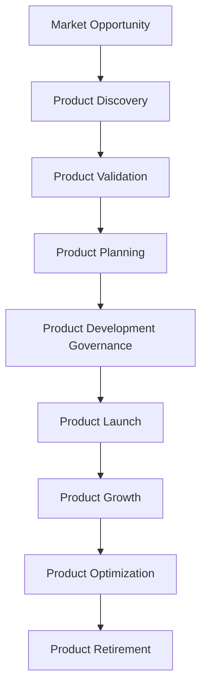
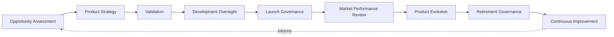
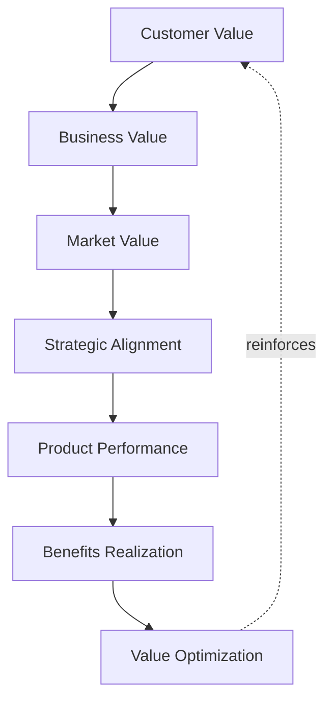
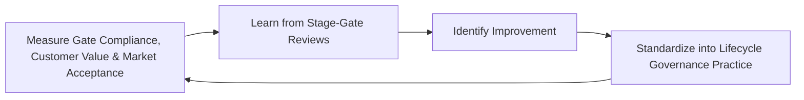
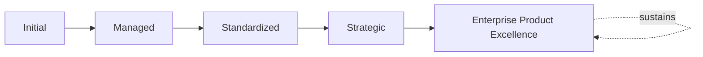

# Enterprise Product Lifecycle Framework

## 1. Executive Summary

**Purpose** — This document defines the official Enterprise Product Lifecycle Framework for **StackLeo Tech Store**. It establishes product lifecycle governance, stage-gate governance, product launch governance, product growth governance, value realization, executive oversight, organizational accountability, continuous improvement, and long-term product lifecycle maturity as a deliberate, accountable enterprise discipline. `product-governance-strategy.md` anticipated this framework directly (Related Documents) as the dedicated elaboration of the lifecycle it defines conceptually in Section 6. This framework does not restate that strategy's governance model, organizational roles, or risk categories. It elaborates the specific stages and stage-gates a product moves through — from market opportunity through retirement — and the governance discipline applied at each.

**Scope** — This framework applies to the full lifecycle of every product category governed in `product-governance-strategy.md` — from market opportunity through retirement — coordinated with `product-governance-strategy.md`, `project-governance-strategy.md`, and `01_Business/business-model.md`.

**Strategic Objectives** — To ensure a product never proceeds past a genuine decision point without deliberate, evidenced approval; that customer and business value is confirmed at every stage, never merely assumed; that a product's launch and transition into growth is deliberately governed, never an informal handoff; and that executive leadership has continuous, honest visibility into the organization's product lifecycle governance posture.

**Business Value** — A governed product lifecycle framework protects StackLeo from the disproportionate cost of a product that proceeds past a stage it was never genuinely ready for, protects the organization's ability to trust that a launched product is genuinely validated and market-ready, and gives leadership confidence that product investment converts predictably into genuine customer and business value.

**Intended Audience** — The Board of Directors, executive leadership, the Chief Product Officer (or equivalent), the Product Governance Board, product leadership, engineering leadership, design leadership, operations leadership, marketing leadership, and business stakeholders.

## 2. Enterprise Product Lifecycle Vision

- **Product Lifecycle as Strategic Capability** — the product lifecycle is governed as a genuine strategic capability, never a procedural formality layered atop feature delivery.
- **Customer Value Throughout the Lifecycle** — customer value is confirmed and protected at every stage, never assumed only at launch.
- **Sustainable Product Evolution** — a product evolves deliberately over its full lifetime, never frozen at initial launch or left to drift without direction.
- **Predictable Product Delivery** — lifecycle governance protects the organization's ability to genuinely predict how a product will progress and conclude.
- **Organizational Learning** — understanding gained from a product's lifecycle deepens the organization's genuine collective capability.
- **Business Growth** — the product lifecycle is governed to support StackLeo's growth from single-seller B2C retailer toward corporate sales, wholesale, and marketplace.
- **Long-Term Product Excellence** — lifecycle governance is pursued as a durable discipline, never a one-time process improvement.

### Enterprise Product Lifecycle Vision Matrix

| Vision Element | Focus | Business Value |
|---|---|---|
| Product Lifecycle as Strategic Capability | A genuine strategic capability, not a procedural formality | Prevents lifecycle governance from being treated as bureaucratic overhead |
| Customer Value Throughout the Lifecycle | Confirmed and protected at every stage | Keeps the lifecycle connected to what customers genuinely value |
| Sustainable Product Evolution | Evolving deliberately over the full lifetime | Protects products from becoming frozen and outdated |
| Predictable Product Delivery | Genuine ability to predict progress and conclusion | Protects leadership's ability to plan around product delivery |
| Organizational Learning | Lifecycle experience deepening genuine collective capability | Converts product experience into durable organizational capability |
| Business Growth | Supporting growth toward marketplace scale | Ensures the lifecycle can genuinely bear future ambition |
| Long-Term Product Excellence | A durable discipline, not a one-time improvement | Protects lifecycle investment from eroding over time |

## 3. Product Lifecycle Principles

Product lifecycle governance at StackLeo rests on nine principles, each producing a specific business outcome.

- **Customer Value First** — every lifecycle stage is judged by the genuine value it confirms or delivers for customers. *Business Value:* keeps the lifecycle connected to what customers genuinely value.
- **Lifecycle Governance** — the governance structure for a product stage is established before that stage begins, never inferred after the fact. *Business Value:* ensures progression proceeds because a genuine, governed decision called for it.
- **Evidence-Based Decisions** — a stage-gate decision is grounded in genuine, documented evidence, not impression. *Business Value:* protects the credibility and defensibility of every lifecycle decision.
- **Stage-Based Accountability** — every lifecycle stage traces to a specific, named, responsible owner. *Business Value:* ensures no stage drifts without someone genuinely responsible for it.
- **Continuous Innovation** — the lifecycle is governed to genuinely accommodate new approaches, never rigidly resistant to change. *Business Value:* protects the organization's ability to respond to genuine market opportunity.
- **Business Alignment** — every lifecycle stage remains genuinely connected to StackLeo's broader business strategy. *Business Value:* ensures product investment is directed by genuine business intent.
- **Quality by Design** — product quality is considered from the outset of the lifecycle, never retrofitted after launch. *Business Value:* prevents the disproportionate cost of remediating quality after a product is already live.
- **Continuous Improvement** — lifecycle governance practice matures over time, informed by real product outcomes. *Business Value:* keeps lifecycle governance aligned with the organization's growing scale and complexity.
- **Sustainable Product Evolution** — a product's evolution is governed to remain genuinely sustainable, never pursued without regard for long-term cost. *Business Value:* protects the organization from the disproportionate cost of unsustainable product growth.

### Product Lifecycle Principles Matrix

| Principle | Description | Business Value |
|---|---|---|
| Customer Value First | Every stage judged by genuine value confirmed or delivered | Keeps the lifecycle connected to what customers genuinely value |
| Lifecycle Governance | Structure established before a stage begins | Ensures progression proceeds on a genuine, governed decision |
| Evidence-Based Decisions | Grounded in genuine, documented evidence | Protects credibility and defensibility of decisions |
| Stage-Based Accountability | Every stage traces to a specific, responsible owner | Ensures no stage drifts without genuine responsibility |
| Continuous Innovation | Genuinely accommodating new approaches | Protects the ability to respond to genuine market opportunity |
| Business Alignment | Every stage genuinely connected to business strategy | Ensures investment is directed by genuine business intent |
| Quality by Design | Considered from the outset, never retrofitted | Prevents the disproportionate cost of after-launch remediation |
| Continuous Improvement | Practice matures from real product outcomes | Keeps governance aligned with growing scale and complexity |
| Sustainable Product Evolution | Evolution governed to remain genuinely sustainable | Protects against the disproportionate cost of unsustainable growth |

## 4. Enterprise Product Lifecycle Governance Model

Product lifecycle governance operates across nine conceptual domains, each holding accountability for a distinct phase of the lifecycle.

### Market Opportunity

- **Purpose** — govern how a genuine market or customer opportunity is recognized and initially assessed.
- **Governance Scope** — coordinated with Product Discovery Governance (`product-governance-strategy.md`, Section 5).
- **Business Value** — ensures product effort is deliberately directed at genuine opportunity.
- **Executive Expectations** — leadership expects market opportunity assessment to be grounded in genuine customer and market signal.

### Product Discovery

- **Purpose** — govern how an assessed opportunity's genuine customer need is deliberately investigated.
- **Governance Scope** — coordinated with Product Discovery Governance (`product-governance-strategy.md`, Section 5).
- **Business Value** — protects investment from being committed without genuine understanding of customer need.
- **Executive Expectations** — leadership expects discovery to withstand genuine scrutiny before commitment.

### Product Validation

- **Purpose** — govern how a discovered opportunity is genuinely validated against real customer and market evidence.
- **Governance Scope** — coordinated with Product Validation (Section 6).
- **Business Value** — protects investment from being committed on assumption rather than evidence.
- **Executive Expectations** — leadership expects validation to be genuinely evidenced, not merely asserted.

### Product Planning

- **Purpose** — govern how a validated opportunity's genuine delivery plan is developed.
- **Governance Scope** — coordinated with Product Investment Governance (`product-governance-strategy.md`, Section 5).
- **Business Value** — protects delivery from proceeding without a genuine, deliberate plan.
- **Executive Expectations** — leadership expects planning to reflect genuine, evidenced feasibility.

### Product Development Governance

- **Purpose** — govern how a planned product's execution is genuinely overseen.
- **Governance Scope** — coordinated with Product Development Governance (`product-governance-strategy.md`, Section 5).
- **Business Value** — protects the organization's ability to detect and address a genuine development issue before it compounds.
- **Executive Expectations** — leadership expects development governance to extend continuously, not only at milestones.

### Product Launch

- **Purpose** — govern how a developed product's genuine readiness for market launch is confirmed and executed.
- **Governance Scope** — coordinated with Product Launch & Transition Governance (Section 8).
- **Business Value** — protects against a product's launch being declared ready without genuine market and operational preparedness.
- **Executive Expectations** — leadership expects launch to be governed as deliberately as development itself.

### Product Growth

- **Purpose** — govern how a launched product's genuine adoption and value are deliberately grown.
- **Governance Scope** — coordinated with Product Value Governance (Section 7).
- **Business Value** — converts launch into genuine, sustained business outcome.
- **Executive Expectations** — leadership expects growth to be measured against genuine, evidenced adoption.

### Product Optimization

- **Purpose** — govern how a growing product is deliberately refined based on genuine performance evidence.
- **Governance Scope** — coordinated with Market Performance Review (Section 6).
- **Business Value** — keeps the product genuinely aligned with real customer usage and market condition.
- **Executive Expectations** — leadership expects optimization to be evidence-driven, not speculative.

### Product Retirement

- **Purpose** — govern how a product no longer delivering genuine value is deliberately retired.
- **Governance Scope** — coordinated with Retirement Governance (Section 6).
- **Business Value** — prevents a product from lingering without genuine business justification.
- **Executive Expectations** — leadership expects retirement to be a genuine, deliberate, documented decision.

### Product Lifecycle Governance Matrix

| Domain | Purpose | Business Value | Executive Expectations |
|---|---|---|---|
| Market Opportunity | Recognize and initially assess a genuine opportunity | Ensures product effort is deliberately directed | Expects grounding in genuine customer and market signal |
| Product Discovery | Investigate genuine customer need | Protects investment from lacking genuine understanding | Expects discovery to withstand genuine scrutiny |
| Product Validation | Validate against real customer and market evidence | Protects investment from being committed on assumption | Expects genuine evidence, not mere assertion |
| Product Planning | Develop a genuine delivery plan | Protects delivery from proceeding without a deliberate plan | Expects planning reflecting genuine, evidenced feasibility |
| Product Development Governance | Genuinely oversee product execution | Protects the ability to address issues before they compound | Expects governance extending continuously, not only at milestones |
| Product Launch | Confirm and execute genuine market readiness | Protects against declaring readiness without preparedness | Expects launch governed as deliberately as development |
| Product Growth | Deliberately grow genuine adoption and value | Converts launch into genuine, sustained business outcome | Expects growth measured against genuine, evidenced adoption |
| Product Optimization | Deliberately refine based on performance evidence | Keeps the product genuinely aligned with real usage | Expects evidence-driven, not speculative, optimization |
| Product Retirement | Deliberately retire products no longer delivering value | Prevents a product lingering without genuine justification | Expects a genuine, deliberate, documented decision |

*Diagram 1: Enterprise Product Lifecycle Framework — market opportunity and product discovery inform validation and planning, flowing through development governance into launch, growth, optimization, and eventual retirement.*

## 5. Product Stage-Gate Governance Framework

Product progression is governed through eight conceptual stage-gates, each requiring genuine, evidenced approval before the product advances. Remaining implementation independent, this framework governs the decision points — never a specific scheduling tool or workflow.

### Gate 0 – Opportunity Validation

- **Governance Objectives** — confirm a genuine market opportunity warrants further discovery investment.
- **Decision Authority** — the Product Governance Board.
- **Required Evidence** — a documented opportunity statement with genuine, preliminary customer and market rationale.
- **Expected Outcomes** — authorization to proceed to Product Discovery, or deliberate rejection.

### Gate 1 – Product Strategy Approval

- **Governance Objectives** — confirm the discovered opportunity's genuine strategic direction is sound.
- **Decision Authority** — the Product Governance Board, escalating to executive leadership for strategic initiatives.
- **Required Evidence** — a documented, evidenced product strategy per Product Discovery (Section 4).
- **Expected Outcomes** — authorization to proceed to Product Validation, or deliberate rejection or deferral.

### Gate 2 – Product Planning Approval

- **Governance Objectives** — confirm the validated opportunity's genuine delivery plan is sound.
- **Decision Authority** — the Product Governance Board.
- **Required Evidence** — a documented, reviewed product plan with genuine resource and risk assessment.
- **Expected Outcomes** — authorization to proceed to Product Development Governance.

### Gate 3 – Development Readiness

- **Governance Objectives** — confirm the product is genuinely ready to begin development.
- **Decision Authority** — the Product Governance Board, in coordination with Engineering Leadership.
- **Required Evidence** — documented confirmation of planning completeness and technical feasibility.
- **Expected Outcomes** — authorization to proceed to development execution.

### Gate 4 – Launch Readiness

- **Governance Objectives** — confirm the developed product is genuinely ready for market launch.
- **Decision Authority** — the Product Governance Board, in coordination with Operations and Marketing Leadership.
- **Required Evidence** — documented confirmation of Launch Readiness (Section 8) across business, operational, and customer dimensions.
- **Expected Outcomes** — authorization to proceed to Product Launch.

### Gate 5 – Market Acceptance

- **Governance Objectives** — confirm the launched product achieves genuine market acceptance.
- **Decision Authority** — the Product Governance Board, informed by Post-Launch Review (Section 8).
- **Required Evidence** — documented evidence of genuine customer adoption against expected targets.
- **Expected Outcomes** — authorization to proceed to Product Growth, or a documented remediation plan.

### Gate 6 – Product Optimization

- **Governance Objectives** — confirm continued genuine investment in refining the product is justified.
- **Decision Authority** — the Product Governance Board, informed by Market Performance Review (Section 6).
- **Required Evidence** — documented performance evidence supporting continued optimization investment.
- **Expected Outcomes** — authorization to continue optimization, or transition toward retirement consideration.

### Gate 7 – Product Retirement

- **Governance Objectives** — confirm a product genuinely no longer justifies continued investment.
- **Decision Authority** — the Product Governance Board, with executive leadership for strategically significant products.
- **Required Evidence** — documented comparison of continued value against genuine cost of continued operation.
- **Expected Outcomes** — formal, deliberate retirement decision and transition plan.

### Product Stage-Gate Matrix

| Gate | Governance Objectives | Decision Authority | Required Evidence | Expected Outcomes |
|---|---|---|---|---|
| Gate 0 – Opportunity Validation | Confirm the opportunity warrants discovery investment | Product Governance Board | Documented opportunity statement | Authorization to proceed or deliberate rejection |
| Gate 1 – Product Strategy Approval | Confirm the strategic direction is sound | Product Governance Board, executive leadership for strategic initiatives | Documented, evidenced product strategy | Authorization to validate, or rejection/deferral |
| Gate 2 – Product Planning Approval | Confirm the delivery plan is sound | Product Governance Board | Reviewed plan with resource and risk assessment | Authorization to proceed to development governance |
| Gate 3 – Development Readiness | Confirm genuine readiness to begin development | Product Governance Board with Engineering Leadership | Planning completeness and technical feasibility confirmation | Authorization to proceed to development execution |
| Gate 4 – Launch Readiness | Confirm genuine readiness for market launch | Product Governance Board with Operations and Marketing Leadership | Launch readiness confirmation across all dimensions | Authorization to proceed to launch |
| Gate 5 – Market Acceptance | Confirm genuine market acceptance | Product Governance Board, informed by post-launch review | Evidence of genuine adoption against targets | Authorization to proceed to growth, or remediation plan |
| Gate 6 – Product Optimization | Confirm continued investment is justified | Product Governance Board, informed by performance review | Performance evidence supporting investment | Authorization to continue, or transition toward retirement |
| Gate 7 – Product Retirement | Confirm a product no longer justifies investment | Product Governance Board, executive leadership for significant products | Comparison of continued value against cost | Formal retirement decision and transition plan |

*Diagram 2: Product Stage-Gate Governance Model — a product advances sequentially through eight governed gates, from opportunity validation through strategy, planning, development readiness, launch readiness, market acceptance, optimization, and retirement.*

## 6. Product Lifecycle Governance

Product lifecycle execution operates across nine conceptual stages, coordinated with the Product Stage-Gate Governance Framework (Section 5).

- **Opportunity Assessment** — govern how a genuine market opportunity is formally assessed.
- **Product Strategy** — govern how a genuine product strategy is deliberately developed.
- **Validation** — govern how a strategy is genuinely validated against real customer and market evidence.
- **Development Oversight** — govern how execution is genuinely, continuously overseen.
- **Launch Governance** — govern how a product's transition into the market is deliberately governed.
- **Market Performance Review** — govern how a launched product's genuine market performance is continuously reviewed.
- **Product Evolution** — govern how a product's design deliberately evolves alongside genuine need.
- **Retirement Governance** — govern how a product's retirement is formally, deliberately governed.
- **Continuous Improvement** — govern how lifecycle practice is deliberately strengthened based on real outcomes.

### Product Lifecycle Execution Matrix

| Stage | Governance Objective | Business Value |
|---|---|---|
| Opportunity Assessment | Formally assess a genuine market opportunity | Ensures product effort is deliberately directed |
| Product Strategy | Deliberately develop a genuine strategy | Prevents a product proceeding without genuine intent |
| Validation | Validate against real customer and market evidence | Protects investment from being committed on assumption |
| Development Oversight | Genuinely, continuously oversee execution | Protects against development drifting without oversight |
| Launch Governance | Deliberately govern market transition | Protects against a launch proceeding without genuine readiness |
| Market Performance Review | Continuously review genuine market performance | Keeps understanding of product success current |
| Product Evolution | Deliberately evolve design alongside genuine need | Keeps the product genuinely connected to evolving intent |
| Retirement Governance | Formally, deliberately govern retirement | Prevents a product lingering without genuine justification |
| Continuous Improvement | Strengthen practice from real outcomes | Keeps lifecycle practice compounding in capability |

*Diagram 3: Product Lifecycle Governance Flow — opportunity assessment and product strategy inform validation and development oversight, feeding launch governance and market performance review, with product evolution, retirement governance, and continuous improvement feeding lessons back into the cycle.*

## 7. Product Value Governance

- **Customer Value** — governs how a product's genuine value to customers is confirmed throughout the lifecycle.
- **Business Value** — governs how a product's genuine value to the business is confirmed throughout the lifecycle.
- **Market Value** — governs how a product's genuine value relative to market condition is understood.
- **Strategic Alignment** — governs whether a product's value remains genuinely connected to StackLeo's business strategy.
- **Product Performance** — governs how a product's genuine performance against expectation is measured.
- **Benefits Realization** — governs how a product's genuine business value is confirmed to have actually been realized.
- **Value Optimization** — governs how a product's genuine value delivery is deliberately improved over time.

### Product Value Governance Matrix

| Governance Area | Focus | Coordination |
|---|---|---|
| Customer Value | Genuine value to customers confirmed throughout | Customer Value First (Section 3) |
| Business Value | Genuine value to the business confirmed throughout | Business Alignment (Section 3) |
| Market Value | Genuine value relative to market condition | Market Performance Review (Section 6) |
| Strategic Alignment | Value remaining genuinely connected to strategy | `product-governance-strategy.md` (Section 3) |
| Product Performance | Genuine performance against expectation measured | Gate 5 – Market Acceptance (Section 5) |
| Benefits Realization | Genuine business value confirmed as realized | Product Benefits Realization Matrix (below) |
| Value Optimization | Value delivery deliberately improved over time | Product Optimization (Section 4) |

### Product Benefits Realization Matrix

| Benefits Dimension | Focus | Governance Coordination |
|---|---|---|
| Original Case Baseline | The genuine customer and business value originally promised | Gate 1 – Product Strategy Approval (Section 5) |
| Realized Value Measurement | What the product genuinely delivered once live | Market Performance Review (Section 6) |
| Variance Analysis | The genuine gap between promised and realized value | Gate 5 – Market Acceptance (Section 5) |
| Attribution | Confirming realized value is genuinely traceable to the product | Product Performance (above) |
| Realization Timeline | When genuine value is expected to be, and is, realized | Product Growth (Section 4) |
| Accountability for Realization | Who genuinely owns confirming value was realized | Stage-Based Accountability (Section 3) |
| Lessons for Future Products | How realization outcomes genuinely inform future strategy | Continuous Improvement (Section 3) |

*Diagram 4: Product Value Governance Framework — customer and business value inform market value and strategic alignment, feeding product performance and benefits realization, with value optimization reinforcing customer value.*

## 8. Product Launch & Transition Governance

- **Launch Readiness** — governs whether a product is genuinely, technically ready for market launch.
- **Business Readiness** — governs whether the business functions supporting a product are genuinely ready.
- **Operational Readiness** — governs whether operations can genuinely support a launched product, coordinated with `09_Operations/operations-strategy.md`.
- **Customer Readiness** — governs whether customers are genuinely prepared to adopt a launched product.
- **Executive Approval** — governs the point at which product launch requires genuine executive-level approval.
- **Post-Launch Review** — governs the formal, structured review of a product's genuine performance after launch.
- **Continuous Improvement** — governs how launch governance practice is deliberately strengthened based on real outcomes.

### Product Launch Governance Matrix

| Governance Area | Focus | Coordination |
|---|---|---|
| Launch Readiness | Genuine technical readiness for market launch | Gate 4 – Launch Readiness (Section 5) |
| Business Readiness | Business functions genuinely ready | Organizational Governance (Section 9) |
| Operational Readiness | Operations genuinely able to support the product | `09_Operations/operations-strategy.md` |
| Customer Readiness | Customers genuinely prepared to adopt | Customer Value (Section 7) |
| Executive Approval | Point requiring genuine executive-level approval | Executive Oversight (Section 10) |
| Post-Launch Review | Formal, structured review of genuine performance | Gate 5 – Market Acceptance (Section 5) |
| Continuous Improvement | Practice strengthened from real outcomes | Continuous Improvement (Section 3) |

## 9. Organizational Governance

Governance accountability is distributed deliberately across ten organizational roles.

- **Board of Directors** — holds ultimate accountability for whether StackLeo's product lifecycle governance genuinely protects investment.
- **Executive Leadership** — holds accountability for whether lifecycle decisions genuinely serve the business, in partnership with the Board.
- **Chief Product Officer (or equivalent)** — owns the coherence and enforcement of this framework across every product lifecycle domain.
- **Product Governance Board** — owns Stage-Gate Governance (Section 5) and the operational execution of Product Lifecycle Governance (Section 6).
- **Product Leadership** — own day-to-day Product Discovery and Development Oversight (Section 4) of individual products.
- **Engineering Leadership** — own Product Development Governance (Section 4) within their accountable teams.
- **Design Leadership** — own the genuine customer experience quality confirmed at Launch Readiness (Section 8).
- **Operations Leadership** — own Operational Readiness (Section 8) in coordination with `09_Operations/operations-strategy.md`.
- **Marketing Leadership** — own Customer Readiness (Section 8) and market communication for launch.
- **Business Stakeholders** — own Business Readiness (Section 8) for products affecting their domain.

### Organizational Responsibility Matrix

| Role | Governance Objective | Business Value |
|---|---|---|
| Board of Directors | Hold ultimate accountability for lifecycle governance protecting investment | Provides the highest point of ultimate accountability |
| Executive Leadership | Hold accountability for lifecycle decisions serving the business | Provides a single point of executive-level accountability |
| Chief Product Officer | Own coherence and enforcement across every lifecycle domain | Provides a single point of specialist accountability |
| Product Governance Board | Own stage-gate governance and lifecycle execution | Provides a dedicated, cross-functional governance body |
| Product Leadership | Own day-to-day discovery and development oversight | Embeds accountability closest to where products are shaped |
| Engineering Leadership | Own product development governance | Embeds accountability closest to where products are built |
| Design Leadership | Own genuine customer experience quality | Ensures products reflect genuine customer usability |
| Operations Leadership | Own operational readiness | Ensures products genuinely transition into sustainable operation |
| Marketing Leadership | Own customer readiness and launch communication | Ensures customers are genuinely prepared to adopt |
| Business Stakeholders | Own business readiness for their domain | Connects launch readiness to genuine business relevance |

## 10. Executive Oversight

- **Product Lifecycle Reviews** — the overall coherence of this framework is formally reviewed on a regular cadence.
- **Stage-Gate Reviews** — the organization's most consequential stage-gate decisions are reviewed directly with executive leadership.
- **Product Health Reviews** — the genuine health of active products across their lifecycle is reviewed as a distinct, ongoing concern.
- **Customer Value Reviews** — the genuine customer value delivered across the product lifecycle is reviewed with executive leadership.
- **Strategic Reviews** — a product's readiness through Gates 1 and 4 is reviewed directly with executive leadership for strategic initiatives.
- **Continuous Improvement Reviews** — the organization's follow-through on captured lifecycle governance lessons is reviewed directly with executive leadership.

### Executive Oversight Matrix

| Oversight Mechanism | Purpose | Governance Role |
|---|---|---|
| Product Lifecycle Reviews | Confirm overall consolidated framework coherence | Regular, predictable cadence for the framework as a whole |
| Stage-Gate Reviews | Review the most consequential stage-gate decisions | Direct executive-level review of strategic gate decisions |
| Product Health Reviews | Review genuine health of active products | Treats product health as ongoing, not assumed |
| Customer Value Reviews | Review genuine customer value delivered | Direct executive-level customer value review |
| Strategic Reviews | Review readiness through Gates 1 and 4 | Direct executive-level review for strategic initiatives |
| Continuous Improvement Reviews | Review follow-through on captured lessons | Direct executive-level review of improvement completion |

## 11. Future Readiness

This framework is designed to remain valid as StackLeo evolves in scale, geography, and organizational complexity.

- **AI-Assisted Product Lifecycle Governance** — as validation and performance review increasingly incorporate AI-assisted methods, coordinated with `04_Database/ai-governance.md`, they remain governed under Validation and Market Performance Review (Section 6) at the same rigor as any other method.
- **Intelligent Product Evolution** — where product evolution increasingly draws on intelligent pattern analysis, that analysis remains subject to the same Product Evolution discipline (Section 6) as any other method.
- **Predictive Product Performance** — where the organization develops the capability to anticipate a product performance issue before it fully materializes, that capability is governed as an extension of Market Performance Review (Section 6).
- **Adaptive Product Governance** — where lifecycle governance criteria increasingly adapt to genuinely changing market conditions, that evolution remains governed under Continuous Improvement (Section 3) at the same rigor as any other method.
- **Digital Product Innovation** — new product lifecycle approaches are adopted only in a manner consistent with Continuous Innovation (Section 3), never at the expense of governance discipline.
- **Sustainable Product Excellence** — Market Opportunity and Product Discovery (Section 4) are structured to be re-applied as StackLeo expands from Bangladesh into South Asia and global markets.

## 12. Product Lifecycle Maturity Model

Product lifecycle governance maturity is described across five conceptual levels.

- **Initial** — lifecycle governance, where it exists, is informal and inconsistent; stage-gates are skipped or applied reactively, and ownership is unclear.
- **Managed** — basic lifecycle governance exists for individual domains, but consistency across the nine domains in Section 4 varies significantly.
- **Standardized** — the governance model, stage-gates, and lifecycle are standardized, documented, and consistently applied across the organization.
- **Strategic** — lifecycle decisions are genuinely and routinely made in deliberate service of business strategy, not feature convenience.
- **Enterprise Product Excellence** — lifecycle governance is continuously and deliberately improved based on quantitative evidence and organizational learning; improvement itself is a managed, ongoing discipline.

### Product Lifecycle Maturity Matrix

| Level | Characteristics | Primary Focus |
|---|---|---|
| Initial | Informal, inconsistent governance; gates skipped or reactive | Ad hoc, individually-dependent lifecycle practice |
| Managed | Basic governance exists per domain; consistency varies | Domain-level consistency |
| Standardized | Standardized governance model, stage-gates, and lifecycle | Organization-wide consistency and clear ownership |
| Strategic | Decisions genuinely and routinely made in service of strategy | Business-strategy-driven lifecycle decision-making |
| Enterprise Product Excellence | Practice continuously improved; lifecycle as competitive advantage | Sustained, deliberate, enterprise-wide product excellence |

*Diagram 5: Continuous Product Lifecycle Improvement Cycle — gate compliance, customer value, and market acceptance are measured, learned from, improved upon, and standardized back into governed practice, on a continuing basis.*

*Diagram 6: Product Lifecycle Maturity Progression — maturity advances from informal, reactively-gated lifecycle practice toward standardized, genuinely strategy-driven, and continuously excellent enterprise product lifecycle governance.*

## 13. Product Lifecycle Anti-Patterns

- **Launch Without Validation** — launching a product without genuine, evidenced validation accepts avoidable exposure without an accountable decision.
- **Weak Stage-Gate Governance** — advancing a product past a gate without genuine, evidenced approval reduces governance to a formality.
- **Feature-Driven Evolution** — evolving a product by feature convenience rather than genuine customer or market evidence inverts Customer Value First (Section 3).
- **Poor Product Retirement** — allowing a product to linger without formal, deliberate retirement prevents genuine accountability from ever concluding.
- **Ignoring Customer Feedback** — proceeding through the lifecycle without genuinely incorporating customer feedback risks a product disconnected from real need.
- **Reactive Product Decisions** — addressing lifecycle governance only once a problem has already occurred forfeits the chance to prevent it.
- **Product Lifecycle Silos** — governing lifecycle stages independently by team, without genuine cross-domain coordination, prevents one coherent lifecycle picture.
- **No Continuous Improvement** — treating current lifecycle governance as permanently finished guarantees it falls behind the organization's growing scale and complexity.

### Anti-Pattern Summary

| Anti-Pattern | Organizational & Business Impact |
|---|---|
| Launch Without Validation | Accepts avoidable exposure without an accountable decision |
| Weak Stage-Gate Governance | Reduces governance to a formality |
| Feature-Driven Evolution | Inverts customer-value-first evolution |
| Poor Product Retirement | Prevents genuine accountability from ever concluding |
| Ignoring Customer Feedback | Risks a product disconnected from real customer need |
| Reactive Product Decisions | Forfeits the chance to prevent a problem before it occurs |
| Product Lifecycle Silos | Prevents one coherent, organization-wide lifecycle picture |
| No Continuous Improvement | Guarantees governance falls behind growing scale and complexity |

## Related Documents

| Document | Relationship |
|---|---|
| `product-governance-strategy.md` | Anticipated this framework by name; sets the enterprise-wide governance model this framework's lifecycle and stage-gates elaborate. |
| `product-roadmap-governance.md` | Governs how the concrete roadmap tracks lifecycle progression and formal change. |
| `product-portfolio-governance.md` | Governs how multiple product lifecycles are coordinated as a portfolio. |
| `customer-value-governance.md` | Provides a deeper elaboration of Customer Value (Section 7). |
| `product-risk-governance.md` | Provides a deeper elaboration of risk across the product lifecycle. |
| `product-maturity-framework.md` | Consolidates the maturity model this framework defines in Section 12 into the enterprise-wide product maturity picture. |
| `01_Business/business-model.md` | Establishes the business strategy this framework's Business Alignment principle (Section 3) is ultimately measured against. |
| `00_Project_Overview/project-governance-strategy.md` | The analogous project-level lifecycle governance this framework's product-specific stage-gates parallel. |

## Document Information

| Property | Value |
|----------|-------|
| Document | product-lifecycle-framework.md |
| Version | 1.0.0 |
| Status | Active |
| Maintained By | StackLeo |
| Last Updated | 2026-07-29 |

---

© StackLeo. All Rights Reserved.
