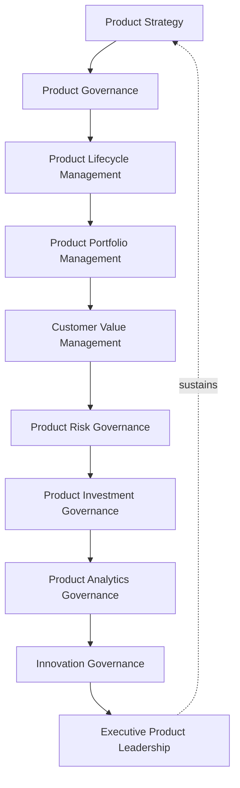
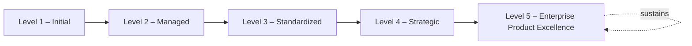
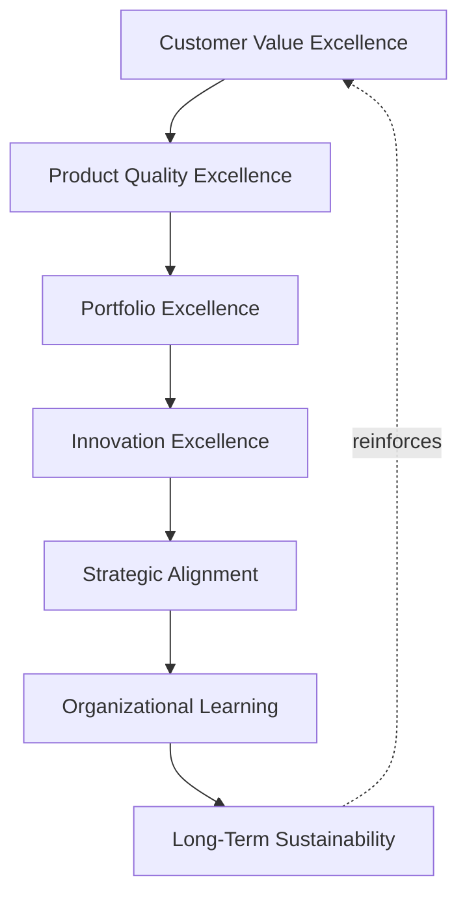

# Enterprise Product Management Maturity Framework

## 1. Executive Summary

**Purpose** — This document defines the official Enterprise Product Management Maturity Framework for **StackLeo Tech Store**. It establishes product management capability evolution, governance maturity, product portfolio excellence, customer value optimization, executive oversight, continuous improvement, and long-term product management sustainability as a deliberate, accountable enterprise discipline. `product-governance-strategy.md`, `product-lifecycle-framework.md`, `product-roadmap-governance.md`, `product-portfolio-governance.md`, `customer-value-governance.md`, and `product-risk-governance.md` each anticipated this framework directly as the dedicated, consolidated maturity treatment of their respective domains. This framework does not restate any of them. It is the capstone of the product governance family — the single, enterprise-wide picture of how genuinely mature StackLeo's overall product management capability is, synthesized from every domain those frameworks each govern individually.

**Scope** — This framework applies to the full breadth of StackLeo's product management capability — strategy, governance, lifecycle management, portfolio management, customer value management, risk governance, investment governance, analytics governance, innovation governance, and executive product leadership — coordinated with every document in the `02_Product` family and with `00_Project_Overview/project-maturity-framework.md` as its organizational-project-level counterpart.

**Strategic Objectives** — To ensure StackLeo genuinely understands how mature its product management capability is, never assumed from confidence alone; that maturity is measured consistently across every capability domain, never assessed unevenly; that the path from current maturity to genuine product excellence is deliberately planned, never left to chance; and that executive leadership has one coherent, honest picture of overall product management maturity.

**Business Value** — A governed product maturity framework protects StackLeo from the disproportionate cost of product management capability that quietly stagnates, protects the organization from assessing its own capability inconsistently across domains, and gives leadership the confidence to make ambitious product investment decisions because the organization's underlying capability is demonstrably understood.

**Intended Audience** — The Board of Directors, executive leadership, the Chief Product Officer, the Product Governance Board, product leadership, engineering leadership, design leadership, marketing leadership, operations leadership, and business stakeholders.

## 2. Enterprise Product Management Maturity Vision

- **Product Management as Strategic Capability** — product management is governed as a genuine, strategic organizational capability, never merely an operational function.
- **Sustainable Product Excellence** — product excellence is pursued as a genuinely sustainable, ongoing pursuit, never a one-time achievement.
- **Customer-Centric Innovation** — the organization's product innovation capability is governed to remain genuinely centered on customer benefit.
- **Predictable Product Evolution** — how StackLeo's products evolve is governed to be genuinely predictable in its discipline, even where outcomes are not.
- **Business Value Optimization** — product management maturity is governed to genuinely optimize the business value the organization's product investment produces.
- **Executive Decision Confidence** — a mature product management capability gives executive leadership genuine confidence in the decisions built upon it.
- **Continuous Organizational Learning** — product management maturity is governed to continuously deepen through genuine organizational learning.

### Enterprise Product Management Maturity Vision Matrix

| Vision Element | Focus | Business Value |
|---|---|---|
| Product Management as Strategic Capability | A genuine strategic capability, not an operational function | Elevates product management to genuine enterprise priority |
| Sustainable Product Excellence | A genuinely sustainable, ongoing pursuit | Protects against excellence treated as a one-time achievement |
| Customer-Centric Innovation | Innovation capability remaining genuinely customer-centered | Keeps innovation connected to genuine customer benefit |
| Predictable Product Evolution | Genuinely predictable discipline, even where outcomes are not | Builds organizational confidence in how products evolve |
| Business Value Optimization | Genuinely optimizing the value investment produces | Directs maturity investment toward what genuinely matters |
| Executive Decision Confidence | Genuine confidence in decisions built upon capability | Protects the credibility of product-related executive decisions |
| Continuous Organizational Learning | Maturity continuously deepening through genuine learning | Keeps capability aligned with growing scale and complexity |

## 3. Product Management Maturity Principles

Product management maturity at StackLeo rests on nine principles, each producing a specific business outcome.

- **Customer Value First** — maturity is ultimately judged by the genuine customer value the organization's product capability produces. *Business Value:* keeps maturity assessment connected to genuine customer benefit, not internal process alone.
- **Governance First** — genuine governance discipline is treated as a prerequisite for product management maturity, not an afterthought. *Business Value:* protects the credibility of every capability built upon it.
- **Strategic Alignment** — product management maturity remains genuinely connected to business strategy. *Business Value:* ensures maturity investment reflects genuine business priority.
- **Evidence-Based Product Decisions** — a product decision at any maturity level is grounded in genuine, documented evidence, not assumption. *Business Value:* protects the credibility and defensibility of product decisions.
- **Accountability** — maturity ownership is genuinely clear across every capability domain. *Business Value:* prevents maturity gaps from being deprioritized for lack of an owner.
- **Continuous Innovation** — mature product management genuinely sustains the organization's capacity for innovation, never suppresses it. *Business Value:* protects the organization's long-term competitive relevance.
- **Continuous Improvement** — product management maturity practice matures over time, informed by real outcomes. *Business Value:* keeps capability aligned with the organization's growing scale and complexity.
- **Cross-Functional Collaboration** — genuine product management maturity depends on collaboration across functions, never one function alone. *Business Value:* prevents maturity gaps hidden by siloed success in a single function.
- **Organizational Learning** — understanding gained from product management practice genuinely deepens future capability. *Business Value:* compounds the value of the organization's accumulated product experience.

### Enterprise Product Capability Matrix

| Principle | Description | Business Value |
|---|---|---|
| Customer Value First | Maturity judged by genuine customer value produced | Keeps assessment connected to genuine customer benefit |
| Governance First | Genuine governance treated as a maturity prerequisite | Protects the credibility of capability built upon it |
| Strategic Alignment | Maturity remaining genuinely connected to business strategy | Ensures investment reflects genuine business priority |
| Evidence-Based Product Decisions | Grounded in genuine, documented evidence | Protects credibility and defensibility of decisions |
| Accountability | Maturity ownership genuinely clear across domains | Prevents gaps deprioritized for lack of an owner |
| Continuous Innovation | Genuinely sustaining, never suppressing, innovation capacity | Protects long-term competitive relevance |
| Continuous Improvement | Practice matures from real outcomes | Keeps capability aligned with growing scale and complexity |
| Cross-Functional Collaboration | Depends on collaboration across functions | Prevents gaps hidden by siloed single-function success |
| Organizational Learning | Understanding genuinely deepening future capability | Compounds the value of accumulated product experience |

## 4. Enterprise Product Management Capability Domains

Product management maturity is governed across ten conceptual capability domains, each synthesizing maturity from its corresponding sibling framework.

### Product Strategy

- **Purpose** — govern the maturity of how deliberately StackLeo's overall product strategy is set and sustained.
- **Maturity Expectations** — coordinated with `product-governance-strategy.md` (Sections 2–3).
- **Business Value** — protects the coherence of every downstream product decision.
- **Executive Expectations** — leadership expects product strategy maturity to be reviewed at the same rigor as business strategy.

### Product Governance

- **Purpose** — govern the maturity of the organization's overall product governance model.
- **Maturity Expectations** — coordinated with `product-governance-strategy.md` (Section 4).
- **Business Value** — protects the coherence of accountability across every product domain.
- **Executive Expectations** — leadership expects governance maturity to be assessed as a distinct, foundational concern.

### Product Lifecycle Management

- **Purpose** — govern the maturity of how consistently the stage-gate discipline is applied.
- **Maturity Expectations** — coordinated with `product-lifecycle-framework.md`.
- **Business Value** — protects the discipline every product's development ultimately depends on.
- **Executive Expectations** — leadership expects lifecycle maturity to be evidenced by gate compliance, not assumed.

### Product Portfolio Management

- **Purpose** — govern the maturity of how deliberately the overall product portfolio is coordinated and balanced.
- **Maturity Expectations** — coordinated with `product-portfolio-governance.md`.
- **Business Value** — protects the coherence of the organization's collective product investment.
- **Executive Expectations** — leadership expects portfolio maturity to be reviewed alongside investment performance.

### Customer Value Management

- **Purpose** — govern the maturity of how genuinely customer value is understood, delivered, and measured.
- **Maturity Expectations** — coordinated with `customer-value-governance.md`.
- **Business Value** — protects the fundamental premise that StackLeo's products deliver genuine benefit.
- **Executive Expectations** — leadership expects customer value maturity to be evidenced by genuine outcome data.

### Product Risk Governance

- **Purpose** — govern the maturity of how deliberately product-related risk is identified and owned.
- **Maturity Expectations** — coordinated with `product-risk-governance.md`.
- **Business Value** — protects the organization from risk maturity gaps going unnoticed.
- **Executive Expectations** — leadership expects risk governance maturity to be reviewed with elevated scrutiny.

### Product Investment Governance

- **Purpose** — govern the maturity of how deliberately product investment decisions are made and tracked.
- **Maturity Expectations** — coordinated with `product-portfolio-governance.md` (Section 5).
- **Business Value** — protects the discipline underlying every product funding decision.
- **Executive Expectations** — leadership expects investment governance maturity to be reviewed alongside financial performance.

### Product Analytics Governance

- **Purpose** — govern the maturity of how genuinely product decisions are grounded in evidence and analysis, coordinated with, and never superseding, `04_Database/analytics-strategy.md`.
- **Maturity Expectations** — oversight ensuring product analytics practice meets the rigor that framework requires.
- **Business Value** — protects the credibility of evidence underlying product decisions.
- **Executive Expectations** — leadership expects analytics maturity to be assessed jointly with data governance leadership.

### Innovation Governance

- **Purpose** — govern the maturity of how deliberately the organization pursues and evaluates genuine innovation.
- **Maturity Expectations** — coordinated with Innovation Portfolio (`product-portfolio-governance.md`, Section 4).
- **Business Value** — protects the organization's ability to responsibly pursue genuine opportunity.
- **Executive Expectations** — leadership expects innovation governance maturity to be evidenced, not assumed from activity.

### Executive Product Leadership

- **Purpose** — govern the maturity of how deliberately executive leadership engages with product management as a discipline.
- **Maturity Expectations** — coordinated with Executive Oversight (Section 10).
- **Business Value** — protects the organization's overall product management maturity from the top down.
- **Executive Expectations** — leadership expects its own engagement to be held to the same maturity standard it expects of the organization.

### Product Management Domain Maturity Matrix

| Domain | Purpose | Business Value | Executive Expectations |
|---|---|---|---|
| Product Strategy | Govern maturity of how strategy is set and sustained | Protects the coherence of every downstream decision | Expects review at the rigor of business strategy |
| Product Governance | Govern maturity of the overall governance model | Protects coherence of accountability across domains | Expects assessment as a distinct, foundational concern |
| Product Lifecycle Management | Govern maturity of stage-gate discipline consistency | Protects the discipline development depends on | Expects maturity evidenced by gate compliance |
| Product Portfolio Management | Govern maturity of portfolio coordination and balance | Protects coherence of collective product investment | Expects review alongside investment performance |
| Customer Value Management | Govern maturity of customer value understanding | Protects the premise that products deliver genuine benefit | Expects maturity evidenced by genuine outcome data |
| Product Risk Governance | Govern maturity of deliberate risk identification | Protects against risk maturity gaps going unnoticed | Expects review with elevated scrutiny |
| Product Investment Governance | Govern maturity of investment decision discipline | Protects the discipline underlying funding decisions | Expects review alongside financial performance |
| Product Analytics Governance | Govern maturity of evidence-grounded decisions | Protects the credibility of decision evidence | Expects joint assessment with data governance leadership |
| Innovation Governance | Govern maturity of deliberate innovation pursuit | Protects the ability to responsibly pursue opportunity | Expects maturity evidenced, not assumed from activity |
| Executive Product Leadership | Govern maturity of executive engagement with product | Protects overall maturity from the top down | Expects its own engagement held to the same standard |

*Diagram 1: Enterprise Product Management Maturity Framework — the ten capability domains connect from product strategy and governance through lifecycle, portfolio, and customer value management, into risk, investment, analytics, and innovation governance, sustained by executive product leadership feeding back into strategy.*

## 5. Enterprise Product Management Maturity Model

### Level 1 – Initial

Product management capability, where it exists, is informal and inconsistent. Decisions are made reactively by individuals rather than through deliberate governance. Ownership across the ten domains in Section 4 is unclear, and outcomes depend heavily on individual initiative rather than organizational discipline.

### Level 2 – Managed

Basic product management practice exists for individual domains, but consistency across the ten domains in Section 4 varies significantly. Some governance exists, but it is not yet standardized or consistently applied across the organization.

### Level 3 – Standardized

The governance model, capability domains, and assessment framework are standardized, documented, and consistently applied across the organization. Product decisions follow a genuinely repeatable, evidenced discipline regardless of which team or individual is involved.

### Level 4 – Strategic

Product management decisions are genuinely and routinely made in deliberate service of business strategy, not feature convenience or individual preference. Maturity across domains is actively monitored, and gaps are deliberately closed rather than tolerated.

### Level 5 – Enterprise Product Excellence

Product management maturity is continuously and deliberately improved based on quantitative evidence and organizational learning. Product management capability functions as a genuine, sustained source of enterprise competitive advantage, and the organization's product decisions are trusted precisely because the discipline behind them is demonstrably mature.

### Product Management Maturity Matrix

| Level | Characteristics | Primary Focus |
|---|---|---|
| Level 1 – Initial | Informal, inconsistent; decisions made reactively by individuals | Ad hoc, individually-dependent product practice |
| Level 2 – Managed | Basic practice exists per domain; consistency varies | Domain-level consistency |
| Level 3 – Standardized | Standardized governance model, domains, and assessment | Organization-wide consistency and repeatable discipline |
| Level 4 – Strategic | Decisions genuinely and routinely made in service of strategy | Business-strategy-driven product decision-making |
| Level 5 – Enterprise Product Excellence | Practice continuously improved; capability as competitive advantage | Sustained, deliberate, enterprise-wide product excellence |

*Diagram 6: Product Management Maturity Progression — maturity advances from informal, individually-dependent product practice toward standardized, genuinely strategy-driven, and continuously excellent enterprise product management.*

## 6. Product Capability Assessment Framework

- **Product Strategy Assessment** — governs how genuinely the organization's product strategy maturity is assessed.
- **Governance Assessment** — governs how genuinely the organization's product governance maturity is assessed.
- **Lifecycle Assessment** — governs how genuinely stage-gate discipline consistency is assessed.
- **Portfolio Assessment** — governs how genuinely portfolio coordination maturity is assessed.
- **Customer Value Assessment** — governs how genuinely customer value management maturity is assessed.
- **Risk Assessment** — governs how genuinely product risk governance maturity is assessed.
- **Executive Review** — governs how assessment findings are deliberately brought to executive leadership.
- **Improvement Planning** — governs how assessment findings are deliberately converted into a genuine improvement plan.

### Product Capability Assessment Matrix

| Governance Area | Focus | Coordination |
|---|---|---|
| Product Strategy Assessment | Genuine assessment of strategy maturity | Product Strategy (Section 4) |
| Governance Assessment | Genuine assessment of governance maturity | Product Governance (Section 4) |
| Lifecycle Assessment | Genuine assessment of stage-gate consistency | Product Lifecycle Management (Section 4) |
| Portfolio Assessment | Genuine assessment of portfolio coordination | Product Portfolio Management (Section 4) |
| Customer Value Assessment | Genuine assessment of customer value maturity | Customer Value Management (Section 4) |
| Risk Assessment | Genuine assessment of risk governance maturity | Product Risk Governance (Section 4) |
| Executive Review | Findings deliberately brought to leadership | Executive Oversight (Section 10) |
| Improvement Planning | Findings converted into a genuine improvement plan | Continuous Product Improvement Lifecycle (Section 7) |

## 7. Continuous Product Improvement Lifecycle

- **Current State Assessment** — governs how the organization's genuine, current product management maturity is established as a baseline.
- **Gap Analysis** — governs how the genuine distance between current and desired maturity is identified.
- **Improvement Planning** — governs how a deliberate plan to close identified gaps is developed.
- **Capability Enhancement** — governs how planned improvement is deliberately carried out.
- **Organizational Adoption** — governs how enhanced capability is genuinely adopted across the organization, not left isolated to a single team.
- **Performance Validation** — governs how genuinely the enhanced capability's effect is validated.
- **Executive Governance Review** — governs how improvement outcomes are deliberately reviewed with executive leadership.
- **Continuous Evolution** — governs how the improvement lifecycle itself deliberately repeats and matures.

### Continuous Product Improvement Matrix

| Stage | Focus | Coordination |
|---|---|---|
| Current State Assessment | Genuine, current maturity established as baseline | Product Capability Assessment Framework (Section 6) |
| Gap Analysis | Genuine distance between current and desired maturity | Enterprise Product Management Maturity Model (Section 5) |
| Improvement Planning | Deliberate plan to close identified gaps | Improvement Planning (Section 6) |
| Capability Enhancement | Planned improvement deliberately carried out | Product Excellence Framework (Section 8) |
| Organizational Adoption | Enhanced capability genuinely adopted organization-wide | Cross-Functional Collaboration (Section 3) |
| Performance Validation | Genuine validation of enhancement effect | Evidence-Based Product Decisions (Section 3) |
| Executive Governance Review | Improvement outcomes reviewed with leadership | Continuous Improvement Reviews (Section 10) |
| Continuous Evolution | Improvement lifecycle deliberately repeats and matures | Organizational Learning (Section 3) |

*Diagram 3: Continuous Product Improvement Lifecycle — current state assessment and gap analysis inform improvement planning and capability enhancement, resolving through organizational adoption and performance validation into executive review, with continuous evolution repeating the cycle.*

## 8. Product Excellence Framework

- **Customer Value Excellence** — governs whether the organization's customer value delivery genuinely reaches an excellent standard, coordinated with `customer-value-governance.md`.
- **Product Quality Excellence** — governs whether the genuine quality of StackLeo's products reaches an excellent standard.
- **Portfolio Excellence** — governs whether the organization's portfolio coordination genuinely reaches an excellent standard, coordinated with `product-portfolio-governance.md`.
- **Innovation Excellence** — governs whether the organization's innovation practice genuinely reaches an excellent standard.
- **Strategic Alignment** — governs whether product excellence remains genuinely connected to business strategy.
- **Organizational Learning** — governs how understanding gained from pursuing excellence deepens future capability.
- **Long-Term Sustainability** — governs whether product excellence is pursued in a manner genuinely sustainable over time.

### Product Excellence Matrix

| Excellence Area | Focus | Coordination |
|---|---|---|
| Customer Value Excellence | Customer value delivery reaching an excellent standard | `customer-value-governance.md` |
| Product Quality Excellence | Genuine product quality reaching an excellent standard | Product Lifecycle Management (Section 4) |
| Portfolio Excellence | Portfolio coordination reaching an excellent standard | `product-portfolio-governance.md` |
| Innovation Excellence | Innovation practice reaching an excellent standard | Innovation Governance (Section 4) |
| Strategic Alignment | Excellence remaining genuinely connected to strategy | `01_Business/business-model.md` |
| Organizational Learning | Understanding deepening future capability | Continuous Product Improvement Lifecycle (Section 7) |
| Long-Term Sustainability | Excellence pursued in a genuinely sustainable manner | Sustainable Product Excellence (Section 2) |

*Diagram 5: Product Excellence Cycle — customer value, product quality, portfolio, and innovation excellence resolve through strategic alignment and organizational learning into long-term sustainability, reinforcing customer value excellence in turn.*

## 9. Organizational Governance

Governance accountability is distributed deliberately across ten organizational roles.

- **Board of Directors** — holds ultimate accountability for whether StackLeo's product management maturity genuinely serves the business's long-term direction.
- **Executive Leadership** — holds accountability for whether product maturity investment genuinely aligns with business strategy, in partnership with the Board.
- **Chief Product Officer** — owns the coherence and enforcement of this framework across every capability domain.
- **Product Governance Board** — owns the operational execution of the Product Capability Assessment Framework (Section 6) and Continuous Product Improvement Lifecycle (Section 7).
- **Product Leadership** — own maturity within their accountable product categories across the domains in Section 4.
- **Engineering Leadership** — own the technical capability underlying Product Lifecycle Management and Product Analytics Governance (Section 4).
- **Design Leadership** — own the experiential capability underlying Customer Value Management (Section 4).
- **Marketing Leadership** — own the market-facing capability underlying Product Strategy (Section 4).
- **Operations Leadership** — own the operational capability underlying sustained product delivery, coordinated with `09_Operations/operations-strategy.md`.
- **Business Stakeholders** — own business-context input into maturity assessment for their domain.

### Organizational Responsibility Matrix

| Role | Governance Objective | Business Value |
|---|---|---|
| Board of Directors | Hold ultimate accountability for maturity serving direction | Provides the highest point of ultimate accountability |
| Executive Leadership | Hold accountability for investment aligning with strategy | Provides a single point of executive-level accountability |
| Chief Product Officer | Own coherence and enforcement across every capability domain | Provides a single point of specialist accountability |
| Product Governance Board | Own operational execution of assessment and improvement | Provides a dedicated, cross-functional governance body |
| Product Leadership | Own maturity within accountable product categories | Embeds accountability closest to where products are shaped |
| Engineering Leadership | Own technical capability underlying lifecycle and analytics | Embeds accountability closest to where technology is delivered |
| Design Leadership | Own experiential capability underlying customer value | Ensures maturity reflects genuine customer experience quality |
| Marketing Leadership | Own market-facing capability underlying strategy | Ensures maturity reflects genuine market understanding |
| Operations Leadership | Own operational capability underlying sustained delivery | Ensures maturity genuinely supports operational sustainability |
| Business Stakeholders | Own business-context input into assessment | Connects maturity assessment to genuine business relevance |

## 10. Executive Oversight

- **Product Maturity Reviews** — the overall coherence of product management maturity is formally reviewed on a regular cadence.
- **Product Portfolio Reviews** — portfolio management maturity is reviewed directly with executive leadership.
- **Customer Value Reviews** — customer value management maturity is reviewed as a distinct, ongoing concern.
- **Product Excellence Reviews** — genuine progress toward product excellence is reviewed with executive leadership.
- **Strategic Alignment Reviews** — product management maturity's genuine connection to business strategy is reviewed with executive leadership.
- **Continuous Improvement Reviews** — the organization's follow-through on captured maturity improvement plans is reviewed directly with executive leadership.

### Executive Oversight Matrix

| Oversight Mechanism | Purpose | Governance Role |
|---|---|---|
| Product Maturity Reviews | Confirm overall product management maturity coherence | Regular, predictable cadence for the framework as a whole |
| Product Portfolio Reviews | Review portfolio management maturity | Direct executive-level portfolio maturity review |
| Customer Value Reviews | Review customer value management maturity | Treats customer value maturity as ongoing, not assumed |
| Product Excellence Reviews | Review genuine progress toward product excellence | Direct executive-level excellence review |
| Strategic Alignment Reviews | Review genuine connection to business strategy | Direct executive-level strategic alignment review |
| Continuous Improvement Reviews | Review follow-through on captured improvement plans | Direct executive-level review of improvement completion |

## 11. Future Readiness

This framework is designed to remain valid as StackLeo evolves in scale, geography, and organizational complexity.

- **AI-Assisted Product Governance** — as product governance activity increasingly incorporates AI-assisted methods, coordinated with `04_Database/ai-governance.md`, it remains governed under Product Governance (Section 4) at the same rigor as any other method.
- **Intelligent Product Strategy** — where product strategy increasingly draws on intelligent pattern analysis, that analysis remains subject to the same Product Strategy domain (Section 4) as any other method.
- **Predictive Customer Value Insights** — where the organization develops the capability to anticipate customer value shifts before they fully materialize, that capability is governed as an extension of Customer Value Management (Section 4).
- **Adaptive Product Organizations** — where the product organization increasingly adapts its structure to genuinely changing market conditions, that evolution remains governed under Continuous Improvement (Section 3) at the same rigor as any other method.
- **Autonomous Governance Support (Conceptual)** — where governance activity is conceptually assisted by autonomous methods in the future, such assistance remains subject to the same executive oversight and accountability structures this framework defines, never a substitute for them.
- **Continuous Enterprise Product Evolution** — Current State Assessment and Gap Analysis (Section 7) are structured to be re-applied as StackLeo expands from Bangladesh into South Asia and global markets.

## 12. Product Management Anti-Patterns

- **Products Without Governance** — allowing a product to exist without genuine governance produces decisions with no accountable owner.
- **Feature Factory Culture** — measuring product success by feature output rather than genuine customer outcome produces effort without genuine value.
- **Weak Product Ownership** — allowing no genuine end-to-end owner for a product produces disjointed, inconsistent decision-making.
- **Poor Customer Understanding** — allowing product decisions to proceed without genuine customer understanding wastes investment on unwanted capability.
- **Short-Term Product Thinking** — optimizing for immediate delivery at the expense of long-term product health undermines sustainable growth.
- **Reactive Product Decisions** — making product decisions only after a problem has already materialized wastes the value of proactive maturity.
- **Siloed Product Organizations** — allowing product decisions to be made within a single function without genuine cross-functional collaboration prevents one coherent product picture.
- **No Continuous Improvement** — treating current product management maturity as permanently finished guarantees it falls behind the organization's growing scale and complexity.

### Anti-Pattern Summary

| Anti-Pattern | Organizational & Business Impact |
|---|---|
| Products Without Governance | Produces decisions with no accountable owner |
| Feature Factory Culture | Produces effort without genuine customer value |
| Weak Product Ownership | Produces disjointed, inconsistent decision-making |
| Poor Customer Understanding | Wastes investment on unwanted capability |
| Short-Term Product Thinking | Undermines sustainable, long-term product health |
| Reactive Product Decisions | Wastes the value proactive maturity would have provided |
| Siloed Product Organizations | Prevents one coherent, organization-wide product picture |
| No Continuous Improvement | Guarantees maturity falls behind growing scale and complexity |

## Enterprise Product Evolution Roadmap Matrix

| Maturity Transition | Primary Enabler | Executive Signal |
|---|---|---|
| Level 1 → Level 2 | Basic governance established per domain | Individual domains begin showing consistent ownership |
| Level 2 → Level 3 | Governance model and domains standardized organization-wide | Product decisions follow a repeatable, evidenced discipline |
| Level 3 → Level 4 | Maturity actively monitored and connected to strategy | Product decisions routinely and visibly serve business strategy |
| Level 4 → Level 5 | Continuous, evidence-based improvement institutionalized | Product management functions as a demonstrated competitive advantage |

## Related Documents

| Document | Relationship |
|---|---|
| `product-governance-strategy.md` | Anticipated this framework by name; sets the individual product governance model this framework's Product Governance domain (Section 4) consolidates. |
| `product-lifecycle-framework.md` | Anticipated this framework by name; supplies the maturity model this framework's Product Lifecycle Management domain (Section 4) consolidates. |
| `product-roadmap-governance.md` | Supplies the maturity model this framework's Product Strategy domain (Section 4) draws upon. |
| `product-portfolio-governance.md` | Anticipated this framework by name; supplies the maturity model this framework's Product Portfolio Management domain (Section 4) consolidates. |
| `customer-value-governance.md` | Anticipated this framework by name; supplies the maturity model this framework's Customer Value Management domain (Section 4) consolidates. |
| `product-risk-governance.md` | Anticipated this framework by name; supplies the maturity model this framework's Product Risk Governance domain (Section 4) consolidates. |
| `01_Business/business-model.md` | Establishes the business strategy this framework's Strategic Alignment principle (Section 3) is ultimately measured against. |
| `00_Project_Overview/project-maturity-framework.md` | The analogous organizational-project-level maturity capstone this framework's product-specific maturity parallels. |

## Document Information

| Property | Value |
|----------|-------|
| Document | product-maturity-framework.md |
| Version | 1.0.0 |
| Status | Active |
| Maintained By | StackLeo |
| Last Updated | 2026-07-29 |

---

© StackLeo. All Rights Reserved.
