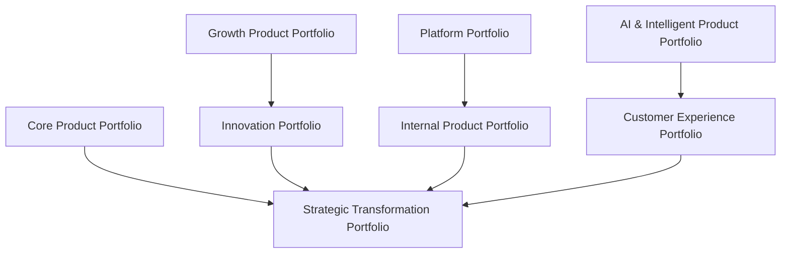
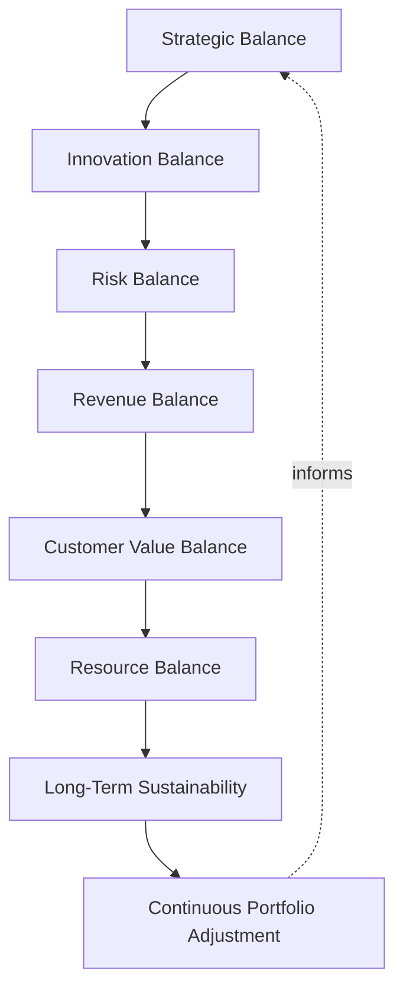
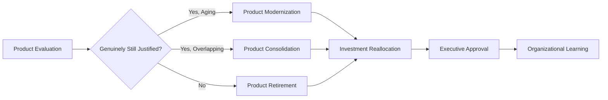
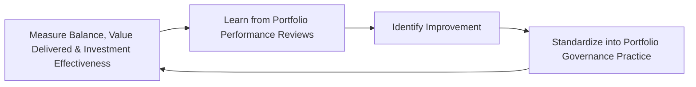
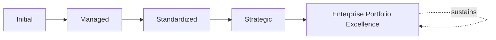

# Enterprise Product Portfolio Governance Framework

## 1. Executive Summary

**Purpose** — This document defines the official Enterprise Product Portfolio Governance Framework for **StackLeo Tech Store**. It establishes product portfolio governance, investment governance, portfolio balancing, product rationalization, value optimization, executive oversight, organizational accountability, continuous improvement, and long-term portfolio maturity as a deliberate, accountable enterprise discipline. `product-governance-strategy.md` and `product-roadmap-governance.md` each anticipated this framework directly as the dedicated governance treatment of Strategic Product Initiatives and portfolio-level roadmap alignment. This framework does not restate either. It governs the layer above a single product or roadmap — how StackLeo's collection of products is coordinated as a coherent investment portfolio, deliberately balanced, and rationalized over time.

**Scope** — This framework applies to every category of product portfolio at StackLeo — core, growth, innovation, platform, internal, AI and intelligent, customer experience, and strategic transformation portfolios — coordinated with `product-governance-strategy.md`, `product-lifecycle-framework.md`, `product-roadmap-governance.md`, and `00_Project_Overview/portfolio-program-governance.md`.

**Strategic Objectives** — To ensure StackLeo's product investment is genuinely coordinated as a coherent portfolio, never managed as disconnected, competing efforts; that the portfolio remains genuinely balanced across strategic priority, innovation, and risk; that a product no longer justifying its place is deliberately rationalized, never left to linger; and that executive leadership has continuous, honest visibility into the organization's product portfolio health.

**Business Value** — A governed product portfolio framework protects StackLeo from the disproportionate cost of investing in products that compete for the same limited capacity without coordination, protects the organization from an overcrowded, unbalanced portfolio that dilutes genuine focus, and gives leadership the confidence to make ambitious, coordinated product investment because its governance is demonstrably sound.

**Intended Audience** — The Board of Directors, executive leadership, the Chief Product Officer (or equivalent), the Product Portfolio Board, product leadership, finance leadership, engineering leadership, marketing leadership, operations leadership, and business stakeholders.

## 2. Enterprise Product Portfolio Vision

- **Product Portfolio as Strategic Business Asset** — the product portfolio is governed as a genuine strategic business asset, never merely a list of concurrently running products.
- **Investment Optimization** — the portfolio is governed to genuinely optimize the business value StackLeo's limited product investment produces.
- **Customer Value Maximization** — portfolio decisions are ultimately judged by the genuine customer value the portfolio as a whole maximizes.
- **Sustainable Portfolio Growth** — the portfolio is governed to evolve deliberately alongside the business, never allowed to accumulate unmanaged sprawl.
- **Innovation Portfolio Balance** — the portfolio deliberately balances proven, revenue-generating products against genuine innovation investment.
- **Business–Technology Alignment** — the portfolio remains genuinely connected to both business strategy and technical architecture.
- **Long-Term Enterprise Value Creation** — portfolio governance is pursued as a durable discipline supporting genuine, sustained enterprise value.

### Enterprise Product Portfolio Vision Matrix

| Vision Element | Focus | Business Value |
|---|---|---|
| Product Portfolio as Strategic Business Asset | A genuine strategic asset, not a product list | Prevents the portfolio from being managed as disconnected work |
| Investment Optimization | Genuinely optimizing the value limited investment produces | Directs investment toward what genuinely matters most |
| Customer Value Maximization | Decisions judged by genuine customer value maximized | Keeps the portfolio connected to what customers value |
| Sustainable Portfolio Growth | Evolving deliberately, never accumulating unmanaged sprawl | Keeps the portfolio genuinely manageable as it grows |
| Innovation Portfolio Balance | Balancing proven products against genuine innovation | Protects against over-investing in either extreme |
| Business–Technology Alignment | Genuinely connected to strategy and architecture | Ensures investment is directed by coherent intent |
| Long-Term Enterprise Value Creation | A durable discipline supporting sustained value | Converts portfolio governance into genuine competitive advantage |

## 3. Product Portfolio Governance Principles

Product portfolio governance at StackLeo rests on nine principles, each producing a specific business outcome.

- **Strategic Alignment** — every portfolio investment remains genuinely connected to StackLeo's broader business strategy. *Business Value:* ensures investment capacity is spent on what genuinely matters to the business.
- **Customer Value First** — a portfolio decision is justified by the genuine value it creates for customers. *Business Value:* prevents portfolio investment disconnected from genuine customer need.
- **Balanced Investments** — the portfolio deliberately balances investment across strategic priority, risk, and innovation. *Business Value:* protects the organization from over-concentration in a single category.
- **Portfolio Transparency** — portfolio composition and decisions are documented and visible to those who genuinely need them. *Business Value:* allows the portfolio to be scrutinized and defended, not merely trusted on faith.
- **Evidence-Based Decisions** — a portfolio decision is grounded in genuine, documented evidence, not impression. *Business Value:* protects the credibility and defensibility of portfolio decisions.
- **Executive Accountability** — the organization's most consequential portfolio decisions are made or ratified at the executive level. *Business Value:* ensures the organization's most consequential investment decisions carry commensurate scrutiny.
- **Sustainable Innovation** — innovation investment is governed to remain genuinely sustainable, never pursued without regard for long-term cost. *Business Value:* protects the organization from unsustainable innovation spending.
- **Continuous Optimization** — portfolio governance practice matures over time, informed by real portfolio outcomes. *Business Value:* keeps governance aligned with the organization's growing scale and complexity.
- **Long-Term Portfolio Health** — the portfolio's overall health is governed as a genuine, ongoing concern, never assessed only at a single point in time. *Business Value:* protects the organization from portfolio decay going unnoticed.

### Product Portfolio Governance Principles Matrix

| Principle | Description | Business Value |
|---|---|---|
| Strategic Alignment | Every investment genuinely connected to business strategy | Ensures capacity is spent on what genuinely matters |
| Customer Value First | Justified by genuine value created for customers | Prevents investment disconnected from genuine customer need |
| Balanced Investments | Deliberately balanced across priority, risk, and innovation | Protects against over-concentration in a single category |
| Portfolio Transparency | Composition and decisions documented and visible | Allows the portfolio to be scrutinized and defended |
| Evidence-Based Decisions | Grounded in genuine, documented evidence | Protects credibility and defensibility of decisions |
| Executive Accountability | Most consequential decisions made or ratified at the top | Ensures commensurate scrutiny for consequential decisions |
| Sustainable Innovation | Governed to remain genuinely sustainable | Protects against unsustainable innovation spending |
| Continuous Optimization | Practice matures from real portfolio outcomes | Keeps governance aligned with growing scale and complexity |
| Long-Term Portfolio Health | Governed as a genuine, ongoing concern | Protects against portfolio decay going unnoticed |

## 4. Enterprise Product Portfolio Governance Model

Portfolio governance operates across eight conceptual categories, each holding accountability for a distinct investment area.

### Core Product Portfolio

- **Purpose** — govern the collection of proven, revenue-generating products central to StackLeo's business.
- **Governance Scope** — coordinated with `01_Business/business-model.md`.
- **Business Value** — protects the coherence of the organization's most commercially significant products.
- **Executive Expectations** — leadership expects the core portfolio to be reviewed with the highest rigor in this model.

### Growth Product Portfolio

- **Purpose** — govern the collection of products with genuine, demonstrated growth potential.
- **Governance Scope** — coordinated with Product Growth (`product-lifecycle-framework.md`, Section 4).
- **Business Value** — protects investment directed at products genuinely poised for expanded value.
- **Executive Expectations** — leadership expects growth portfolio decisions to be grounded in genuine, evidenced momentum.

### Innovation Portfolio

- **Purpose** — govern the collection of products in deliberate experimentation with new approaches.
- **Governance Scope** — coordinated with Innovation Roadmaps (`product-roadmap-governance.md`, Section 4).
- **Business Value** — protects the organization's ability to responsibly pursue genuine opportunity.
- **Executive Expectations** — leadership expects the innovation portfolio to be evaluated deliberately, never carelessly funded.

### Platform Portfolio

- **Purpose** — govern the collection of shared platform capability consumed across multiple products.
- **Governance Scope** — coordinated with Platform Products (`product-governance-strategy.md`, Section 4).
- **Business Value** — protects the foundation every other portfolio category ultimately depends on.
- **Executive Expectations** — leadership expects the platform portfolio to be governed with consistent rigor regardless of scale.

### Internal Product Portfolio

- **Purpose** — govern the collection of products used internally by StackLeo employees.
- **Governance Scope** — coordinated with Internal Enterprise Products (`product-governance-strategy.md`, Section 4).
- **Business Value** — protects employees' ability to genuinely rely on internal capability.
- **Executive Expectations** — leadership expects internal products to be governed to the same standard as customer-facing products.

### AI & Intelligent Product Portfolio

- **Purpose** — govern the collection of products incorporating AI or ML capability, jointly with, and never superseding, `04_Database/ai-governance.md` and `04_Database/ml-governance.md`.
- **Governance Scope** — oversight ensuring AI-enabled products meet the rigor those frameworks require.
- **Business Value** — protects StackLeo's core trust differentiator through genuinely governed AI portfolio investment.
- **Executive Expectations** — leadership expects the AI portfolio to be treated with elevated, deliberate scrutiny.

### Customer Experience Portfolio

- **Purpose** — govern the collection of products and initiatives improving genuine customer-facing experience.
- **Governance Scope** — coordinated with Customer Experience Roadmaps (`product-roadmap-governance.md`, Section 4).
- **Business Value** — protects the trust relationship every customer interaction depends on.
- **Executive Expectations** — leadership expects the customer experience portfolio to be weighted alongside revenue-generating priority.

### Strategic Transformation Portfolio

- **Purpose** — govern the synthesized, executive-relevant picture of the organization's most significant product investment across every category above.
- **Governance Scope** — oversight exclusively accountable for converging every category into one coherent enterprise picture.
- **Business Value** — protects leadership's ability to understand overall product portfolio posture as a whole.
- **Executive Expectations** — leadership expects one coherent portfolio picture, not eight disconnected category views.

### Product Portfolio Governance Matrix

| Domain | Purpose | Business Value | Executive Expectations |
|---|---|---|---|
| Core Product Portfolio | Govern proven, revenue-generating products | Protects the most commercially significant products | Expects the highest rigor in this model |
| Growth Product Portfolio | Govern products with genuine growth potential | Protects investment toward genuinely poised products | Expects grounding in genuine, evidenced momentum |
| Innovation Portfolio | Govern products in deliberate experimentation | Protects the ability to responsibly pursue opportunity | Expects deliberate, never careless, evaluation |
| Platform Portfolio | Govern shared platform capability | Protects the foundation every other category depends on | Expects consistent rigor regardless of scale |
| Internal Product Portfolio | Govern products used by employees | Protects employees' ability to genuinely rely on capability | Expects the same standard as customer-facing products |
| AI & Intelligent Product Portfolio | Govern products incorporating AI or ML capability | Protects StackLeo's core trust differentiator | Expects elevated, deliberate scrutiny |
| Customer Experience Portfolio | Govern initiatives improving customer experience | Protects the trust relationship every interaction depends on | Expects weighting alongside revenue-generating priority |
| Strategic Transformation Portfolio | Synthesize the enterprise investment picture | Protects leadership's ability to understand posture as a whole | Expects one coherent picture, not disconnected views |

*Diagram 1: Enterprise Product Portfolio Governance Framework — core and growth portfolios feed innovation, platform and internal product portfolios converge, and AI and customer experience portfolios connect, all resolving into the strategic transformation portfolio's synthesized picture.*

## 5. Product Investment Governance Framework

Product investment governance is governed across eight conceptual disciplines, remaining implementation independent throughout.

### Investment Strategy

- **Governance Objectives** — determine the organization's overall approach and priority toward product investment.
- **Decision Authority** — the Chief Product Officer, coordinated with executive leadership.
- **Required Evidence** — a documented investment strategy grounded in genuine business priority.
- **Expected Outcomes** — a deliberate, coherent basis for every subsequent investment decision.

### Product Evaluation

- **Governance Objectives** — genuinely assess a candidate or existing product against portfolio criteria.
- **Decision Authority** — the Product Portfolio Board.
- **Required Evidence** — a documented, evidenced product evaluation.
- **Expected Outcomes** — a genuinely informed basis for prioritization.

### Portfolio Prioritization

- **Governance Objectives** — allocate the organization's limited investment capacity across genuinely competing products.
- **Decision Authority** — the Product Portfolio Board.
- **Required Evidence** — documented prioritization evidence per Portfolio Balancing Governance (Section 6).
- **Expected Outcomes** — a genuinely prioritized portfolio.

### Funding Governance

- **Governance Objectives** — confirm a prioritized product's funding is deliberately, formally allocated.
- **Decision Authority** — the Product Portfolio Board, with Finance Leadership.
- **Required Evidence** — a documented funding decision reflecting genuine resource availability.
- **Expected Outcomes** — a genuinely fundable portfolio.

### Executive Approval

- **Governance Objectives** — confirm the organization's most consequential investment decisions are genuinely approved.
- **Decision Authority** — executive leadership.
- **Required Evidence** — a documented executive review and approval record.
- **Expected Outcomes** — formally authorized portfolio investment.

### Value Tracking

- **Governance Objectives** — confirm a funded product's genuine value delivery is continuously tracked.
- **Decision Authority** — the Product Portfolio Board.
- **Required Evidence** — documented, ongoing value tracking evidence.
- **Expected Outcomes** — genuine, current visibility into investment performance.

### Portfolio Optimization

- **Governance Objectives** — confirm the overall portfolio composition is deliberately optimized for genuine value.
- **Decision Authority** — the Product Portfolio Board.
- **Required Evidence** — documented optimization analysis.
- **Expected Outcomes** — a genuinely optimized portfolio composition.

### Investment Review

- **Governance Objectives** — confirm existing investment decisions remain genuinely justified.
- **Decision Authority** — the Product Portfolio Board, escalating to executive leadership for significant findings.
- **Required Evidence** — documented periodic review findings.
- **Expected Outcomes** — continued authorization, reallocation, or deliberate divestment.

### Product Investment Governance Matrix

| Discipline | Governance Objectives | Decision Authority | Required Evidence | Expected Outcomes |
|---|---|---|---|---|
| Investment Strategy | Determine overall approach and priority | Chief Product Officer with executive leadership | Documented investment strategy | A deliberate, coherent investment basis |
| Product Evaluation | Genuinely assess against portfolio criteria | Product Portfolio Board | Documented, evidenced evaluation | A genuinely informed prioritization basis |
| Portfolio Prioritization | Allocate capacity across competing products | Product Portfolio Board | Documented prioritization evidence | A genuinely prioritized portfolio |
| Funding Governance | Confirm deliberate, formal fund allocation | Product Portfolio Board with Finance Leadership | Documented funding decision | A genuinely fundable portfolio |
| Executive Approval | Confirm genuine approval of consequential decisions | Executive leadership | Documented executive review and approval | Formally authorized portfolio investment |
| Value Tracking | Confirm genuine, continuous value delivery tracking | Product Portfolio Board | Documented, ongoing value tracking | Genuine, current visibility into performance |
| Portfolio Optimization | Confirm deliberate optimization for genuine value | Product Portfolio Board | Documented optimization analysis | A genuinely optimized portfolio composition |
| Investment Review | Confirm existing decisions remain genuinely justified | Product Portfolio Board, executive leadership for significant findings | Documented periodic review findings | Continued authorization, reallocation, or divestment |

*Diagram 2: Product Investment Governance Model — investment strategy and product evaluation inform portfolio prioritization and funding governance, feeding executive approval and value tracking, with portfolio optimization and investment review feeding lessons back into the cycle.*

## 6. Portfolio Balancing Governance

Portfolio balancing governance operates across eight conceptual dimensions.

- **Strategic Balance** — governs whether the portfolio deliberately balances investment across genuinely strategic priorities.
- **Innovation Balance** — governs whether the portfolio deliberately balances proven products against genuine innovation investment.
- **Risk Balance** — governs whether the portfolio deliberately balances genuine risk exposure across categories.
- **Revenue Balance** — governs whether the portfolio deliberately balances revenue-generating and growth-oriented investment.
- **Customer Value Balance** — governs whether the portfolio deliberately balances investment across genuinely distinct customer needs.
- **Resource Balance** — governs whether the portfolio's genuine resource demand remains within available capacity.
- **Long-Term Sustainability** — governs whether portfolio balance remains genuinely sustainable over time.
- **Continuous Portfolio Adjustment** — governs how the portfolio's balance is deliberately revisited as genuine circumstances change.

### Portfolio Balancing Matrix

| Dimension | Governance Focus | Coordination |
|---|---|---|
| Strategic Balance | Investment deliberately balanced across priorities | Strategic Alignment (Section 3) |
| Innovation Balance | Proven products balanced against innovation | Sustainable Innovation (Section 3) |
| Risk Balance | Genuine risk exposure balanced across categories | Product Risk Governance coordinated with `product-governance-strategy.md` |
| Revenue Balance | Revenue-generating balanced against growth-oriented investment | Core and Growth Product Portfolios (Section 4) |
| Customer Value Balance | Investment balanced across distinct customer needs | Customer Value First (Section 3) |
| Resource Balance | Genuine resource demand within available capacity | `00_Project_Overview/resource-capacity-governance.md` |
| Long-Term Sustainability | Balance remaining genuinely sustainable over time | Long-Term Portfolio Health (Section 3) |
| Continuous Portfolio Adjustment | Balance deliberately revisited as circumstances change | Continuous Optimization (Section 3) |

*Diagram 3: Portfolio Balancing Framework — strategic and innovation balance inform risk and revenue balance, feeding customer value and resource balance, with long-term sustainability and continuous adjustment feeding lessons back into strategic balance.*

## 7. Product Rationalization Governance

- **Product Evaluation** — governs how an existing product's genuine, continued justification is assessed.
- **Product Consolidation** — governs how genuinely overlapping products are deliberately consolidated.
- **Product Retirement** — governs how a product no longer delivering genuine value is deliberately retired, coordinated with `product-lifecycle-framework.md` (Section 4).
- **Product Modernization** — governs how a product with continued genuine value but aging foundation is deliberately modernized.
- **Investment Reallocation** — governs how capacity freed by rationalization is deliberately redirected to genuinely higher-value investment.
- **Executive Approval** — governs the point at which a rationalization decision genuinely requires executive-level approval.
- **Organizational Learning** — governs how understanding gained from rationalization deepens future portfolio decisions.

### Product Rationalization Matrix

| Governance Area | Focus | Coordination |
|---|---|---|
| Product Evaluation | Assessing genuine, continued justification | Investment Review (Section 5) |
| Product Consolidation | Genuinely overlapping products deliberately consolidated | Strategic Balance (Section 6) |
| Product Retirement | Products no longer delivering value deliberately retired | `product-lifecycle-framework.md` (Section 4) |
| Product Modernization | Continued-value products with aging foundation modernized | `03_System_Design/technology-governance.md` (Section 7) |
| Investment Reallocation | Freed capacity redirected to higher-value investment | Portfolio Optimization (Section 5) |
| Executive Approval | Point requiring genuine executive-level approval | Executive Oversight (Section 10) |
| Organizational Learning | Understanding deepening future portfolio decisions | Continuous Optimization (Section 3) |

*Diagram 4: Product Rationalization Lifecycle — an evaluated product is routed to modernization, consolidation, or retirement based on genuine continued justification, resolving into investment reallocation, executive approval, and organizational learning.*

## 8. Product Value Optimization Framework

- **Customer Value Optimization** — governs how the portfolio's genuine customer value delivery is deliberately improved over time.
- **Business Value Optimization** — governs how the portfolio's genuine business value delivery is deliberately improved over time.
- **Portfolio Performance** — governs how the portfolio's genuine overall performance is continuously measured.
- **Strategic Alignment** — governs whether portfolio value optimization remains genuinely connected to business strategy.
- **Investment Effectiveness** — governs how genuinely effectively portfolio investment converts into realized value.
- **Continuous Improvement** — governs how value optimization practice deliberately matures from real outcomes.
- **Enterprise Value Growth** — governs how portfolio optimization contributes to StackLeo's genuine, sustained enterprise value.

### Product Value Optimization Matrix

| Optimization Area | Focus | Governance Coordination |
|---|---|---|
| Customer Value Optimization | Genuine customer value delivery deliberately improved | Customer Value First (Section 3) |
| Business Value Optimization | Genuine business value delivery deliberately improved | Investment Optimization (Section 2) |
| Portfolio Performance | Genuine overall performance continuously measured | Value Tracking (Section 5) |
| Strategic Alignment | Optimization remaining genuinely connected to strategy | Strategic Alignment (Section 3) |
| Investment Effectiveness | Genuine effectiveness of value conversion | Investment Review (Section 5) |
| Continuous Improvement | Practice deliberately maturing from real outcomes | Continuous Optimization (Section 3) |
| Enterprise Value Growth | Contribution to genuine, sustained enterprise value | Long-Term Enterprise Value Creation (Section 2) |

## 9. Organizational Governance

Governance accountability is distributed deliberately across ten organizational roles.

- **Board of Directors** — holds ultimate accountability for whether StackLeo's product portfolio genuinely serves the business's long-term direction.
- **Executive Leadership** — holds accountability for whether portfolio decisions genuinely align with business strategy, in partnership with the Board.
- **Chief Product Officer (or equivalent)** — owns the coherence and enforcement of this framework across every portfolio category.
- **Product Portfolio Board** — owns the operational execution of Product Investment Governance (Section 5) and Product Rationalization Governance (Section 7).
- **Product Leadership** — own day-to-day Product Evaluation (Section 5) within their accountable product categories.
- **Finance Leadership** — own Funding Governance (Section 5) rigor.
- **Engineering Leadership** — own Platform Portfolio (Section 4) alignment and technical feasibility of investment decisions.
- **Marketing Leadership** — own Customer Experience Portfolio (Section 4) alignment with genuine customer priority.
- **Operations Leadership** — own Product Modernization (Section 7) in coordination with `09_Operations/operations-strategy.md`.
- **Business Stakeholders** — own Business Value Optimization (Section 8) input for products affecting their domain.

### Organizational Responsibility Matrix

| Role | Governance Objective | Business Value |
|---|---|---|
| Board of Directors | Hold ultimate accountability for the portfolio serving direction | Provides the highest point of ultimate accountability |
| Executive Leadership | Hold accountability for decisions aligning with business strategy | Provides a single point of executive-level accountability |
| Chief Product Officer | Own coherence and enforcement across every portfolio category | Provides a single point of specialist accountability |
| Product Portfolio Board | Own operational execution of investment and rationalization governance | Provides a dedicated, cross-functional governance body |
| Product Leadership | Own day-to-day product evaluation | Embeds accountability closest to where products are shaped |
| Finance Leadership | Own funding governance rigor | Ensures investment decisions reflect genuine financial discipline |
| Engineering Leadership | Own platform portfolio and technical feasibility | Embeds accountability closest to where technology is delivered |
| Marketing Leadership | Own customer experience portfolio alignment | Ensures the portfolio reflects genuine customer priority |
| Operations Leadership | Own product modernization | Ensures the portfolio genuinely supports operational sustainability |
| Business Stakeholders | Own business value optimization input for their domain | Connects portfolio decisions to genuine business relevance |

## 10. Executive Oversight

- **Portfolio Strategy Reviews** — the overall coherence of the product portfolio strategy is formally reviewed on a regular cadence.
- **Investment Reviews** — portfolio investment commitments are reviewed directly with executive leadership.
- **Portfolio Performance Reviews** — the genuine performance of the overall portfolio is reviewed as a distinct, ongoing concern.
- **Product Value Reviews** — the genuine customer and business value delivered by the portfolio is reviewed with executive leadership.
- **Risk Reviews** — the organization's portfolio-related risk posture is reviewed directly with executive leadership.
- **Continuous Improvement Reviews** — the organization's follow-through on captured portfolio governance lessons is reviewed directly with executive leadership.

### Executive Oversight Matrix

| Oversight Mechanism | Purpose | Governance Role |
|---|---|---|
| Portfolio Strategy Reviews | Confirm overall portfolio strategy coherence | Regular, predictable cadence for the framework as a whole |
| Investment Reviews | Review portfolio investment commitments | Direct executive-level investment review |
| Portfolio Performance Reviews | Review genuine performance of the overall portfolio | Treats performance as ongoing, not assumed |
| Product Value Reviews | Review genuine customer and business value delivered | Direct executive-level value review |
| Risk Reviews | Review portfolio-related risk posture | Direct executive-level review of risk exposure |
| Continuous Improvement Reviews | Review follow-through on captured lessons | Direct executive-level review of improvement completion |

## 11. Future Readiness

This framework is designed to remain valid as StackLeo evolves in scale, geography, and organizational complexity.

- **AI-Assisted Portfolio Optimization** — as product evaluation and optimization increasingly incorporate AI-assisted methods, coordinated with `04_Database/ai-governance.md`, they remain governed under Product Evaluation and Portfolio Optimization (Section 5) at the same rigor as any other method.
- **Intelligent Investment Governance** — where investment decisions increasingly draw on intelligent pattern analysis, that analysis remains subject to the same Product Investment Governance Framework (Section 5) as any other method.
- **Predictive Portfolio Insights** — where the organization develops the capability to anticipate a portfolio imbalance before it fully materializes, that capability is governed as an extension of Continuous Portfolio Adjustment (Section 6).
- **Adaptive Product Portfolios** — where portfolio balance increasingly adapts to genuinely changing market conditions, that evolution remains governed under Continuous Optimization (Section 3) at the same rigor as any other method.
- **Continuous Innovation Management** — new portfolio approaches are adopted only in a manner consistent with Sustainable Innovation (Section 3), never at its expense.
- **Sustainable Enterprise Portfolio Evolution** — Investment Strategy and Portfolio Prioritization (Section 5) are structured to be re-applied as StackLeo expands from Bangladesh into South Asia and global markets.

## 12. Product Portfolio Maturity Model

Product portfolio governance maturity is described across five conceptual levels.

- **Initial** — portfolio governance, where it exists, is informal and inconsistent; investment decisions are made reactively, and ownership is unclear.
- **Managed** — basic portfolio governance exists for individual categories, but consistency across the eight domains in Section 4 varies significantly.
- **Standardized** — the governance model, domains, and investment framework are standardized, documented, and consistently applied across the organization.
- **Strategic** — portfolio decisions are genuinely and routinely made in deliberate service of business strategy, not feature convenience.
- **Enterprise Portfolio Excellence** — portfolio governance is continuously and deliberately improved based on quantitative evidence and organizational learning; portfolio capability functions as a genuine, sustained source of enterprise excellence.

### Product Portfolio Maturity Matrix

| Level | Characteristics | Primary Focus |
|---|---|---|
| Initial | Informal, inconsistent governance; decisions made reactively | Ad hoc, individually-dependent portfolio practice |
| Managed | Basic governance exists per category; consistency varies | Category-level consistency |
| Standardized | Standardized governance model, domains, and investment framework | Organization-wide consistency and clear ownership |
| Strategic | Decisions genuinely and routinely made in service of strategy | Business-strategy-driven portfolio decision-making |
| Enterprise Portfolio Excellence | Practice continuously improved; portfolio as competitive advantage | Sustained, deliberate, enterprise-wide portfolio excellence |

*Diagram 5: Continuous Portfolio Optimization Cycle — portfolio balance, delivered value, and investment effectiveness are measured, learned from, improved upon, and standardized back into governed practice, on a continuing basis.*

*Diagram 6: Product Portfolio Maturity Progression — maturity advances from informal, reactively-decided portfolio practice toward standardized, genuinely strategy-driven, and continuously excellent enterprise product portfolio governance.*

## 13. Product Portfolio Anti-Patterns

- **Portfolio Without Strategy** — investing across the portfolio without genuine connection to business strategy produces effort without coherent direction.
- **Unbalanced Investments** — allowing the portfolio to concentrate disproportionately in a single category risks genuine strategic exposure.
- **Duplicate Products** — allowing genuinely overlapping products to persist wastes investment on redundant capability.
- **Weak Portfolio Visibility** — leadership lacking genuine portfolio visibility cannot make informed investment decisions.
- **Overcrowded Portfolio** — allowing the portfolio to accumulate more products than the organization can genuinely support dilutes focus.
- **Ignoring Product Retirement** — allowing a product with no genuine remaining value to persist wastes ongoing investment.
- **Siloed Investment Decisions** — making investment decisions within a single category without genuine cross-portfolio coordination prevents one coherent picture.
- **No Continuous Optimization** — treating current portfolio composition as permanently finished guarantees it falls behind the organization's growing scale and complexity.

### Anti-Pattern Summary

| Anti-Pattern | Organizational & Business Impact |
|---|---|
| Portfolio Without Strategy | Produces effort without coherent, strategic direction |
| Unbalanced Investments | Risks genuine strategic exposure from over-concentration |
| Duplicate Products | Wastes investment on redundant capability |
| Weak Portfolio Visibility | Prevents informed investment decisions |
| Overcrowded Portfolio | Dilutes focus across more products than can be genuinely supported |
| Ignoring Product Retirement | Wastes ongoing investment on products with no remaining value |
| Siloed Investment Decisions | Prevents one coherent, organization-wide portfolio picture |
| No Continuous Optimization | Guarantees the portfolio falls behind growing scale and complexity |

## Related Documents

| Document | Relationship |
|---|---|
| `product-governance-strategy.md` | Anticipated this framework by name; sets the individual product governance model this framework's portfolio categories coordinate. |
| `product-lifecycle-framework.md` | Elaborates the stage-gate discipline individual products within the portfolio follow. |
| `product-roadmap-governance.md` | Anticipated this framework by name; consumes this framework's Portfolio Prioritization (Section 5) as an input to roadmap prioritization. |
| `customer-value-governance.md` | Provides a deeper elaboration of the Customer Value First principle (Section 3). |
| `product-risk-governance.md` | Provides a deeper elaboration of portfolio-level risk. |
| `product-maturity-framework.md` | Consolidates the maturity model this framework defines in Section 12 into the enterprise-wide product maturity picture. |
| `00_Project_Overview/portfolio-program-governance.md` | The analogous project-level portfolio governance this framework's product-specific portfolio parallels. |
| `01_Business/business-model.md` | Establishes the business strategy this framework's Strategic Alignment principle (Section 3) is ultimately measured against. |

## Document Information

| Property | Value |
|----------|-------|
| Document | product-portfolio-governance.md |
| Version | 1.0.0 |
| Status | Active |
| Maintained By | StackLeo |
| Last Updated | 2026-07-29 |

---

© StackLeo. All Rights Reserved.
