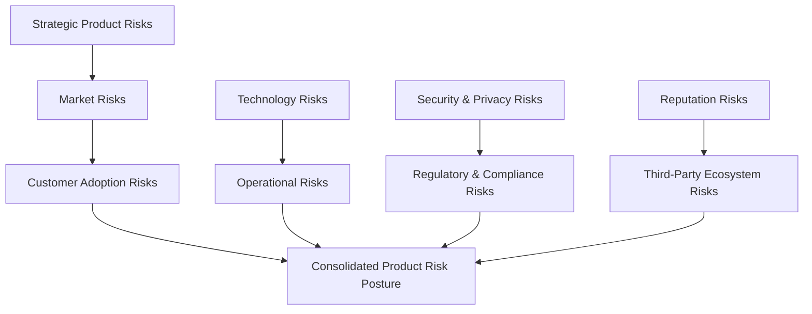
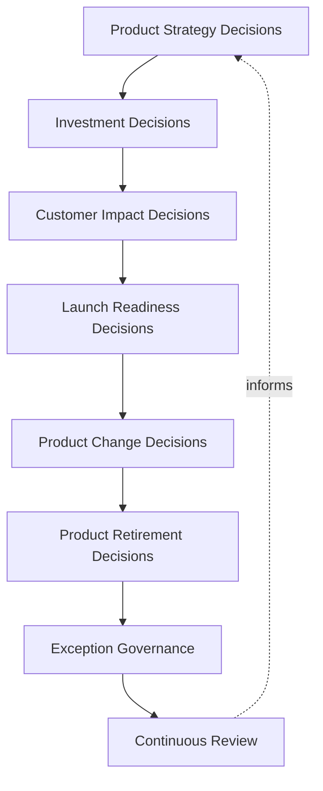
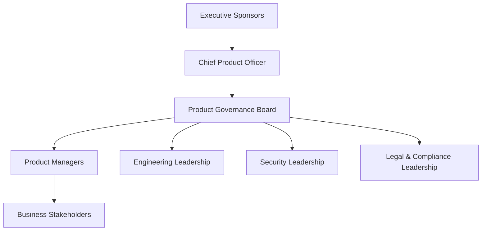
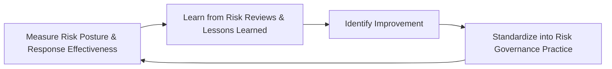
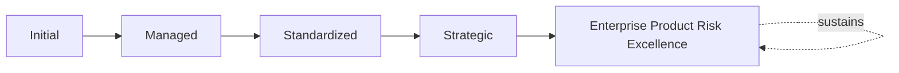

# Enterprise Product Risk Governance Framework

## 1. Executive Summary

**Purpose** — This document defines the official Enterprise Product Risk Governance Framework for **StackLeo Tech Store**. It establishes product risk governance, strategic and operational product risks, the product risk lifecycle, risk ownership, executive oversight, organizational accountability, continuous improvement, and long-term product risk maturity as a deliberate, accountable enterprise discipline. `product-governance-strategy.md`, `product-lifecycle-framework.md`, `product-portfolio-governance.md`, and `customer-value-governance.md` each anticipated this framework directly as the dedicated elaboration of product-related risk. This framework does not restate any of them, nor does it restate `06_Security/enterprise-risk-management-strategy.md` or `09_Operations/business-continuity-framework.md`. It governs the risk dimension specific to product decisions — the strategic, market, adoption, and decision-level risk a product organization must deliberately own, distinct from enterprise-wide security or continuity risk.

**Scope** — This framework applies to every category of product-related risk at StackLeo — strategic, market, customer adoption, technology, operational, security and privacy, regulatory and compliance, reputation, and third-party ecosystem risk — coordinated with `product-governance-strategy.md`, `product-lifecycle-framework.md`, `product-roadmap-governance.md`, `product-portfolio-governance.md`, `customer-value-governance.md`, `06_Security/enterprise-risk-management-strategy.md`, and `09_Operations/business-continuity-framework.md`.

**Strategic Objectives** — To ensure product-related risk is identified and owned deliberately, never discovered only after harm has occurred; that every consequential product decision genuinely accounts for its risk before being made; that risk ownership is genuinely clear at every stage, never left ambiguous; and that executive leadership has continuous, honest visibility into the organization's product risk posture.

**Business Value** — A governed product risk framework protects StackLeo from the disproportionate cost of a product decision made without genuine risk awareness, protects the organization's customer trust from being eroded by an unmanaged product risk, and gives leadership the confidence to pursue ambitious product investment because its risk governance is demonstrably sound.

**Intended Audience** — The Board of Directors, executive leadership, the Chief Product Officer, the Chief Technology Officer, the Product Governance Board, product managers, engineering leadership, security leadership, legal and compliance leadership, and business stakeholders.

## 2. Enterprise Product Risk Vision

- **Risk-Aware Product Organizations** — every part of the product organization is governed to genuinely understand the risk its decisions carry.
- **Customer Trust Protection** — product risk governance exists foremost to protect the genuine trust customers place in StackLeo.
- **Sustainable Product Growth** — product risk is governed so that growth remains genuinely sustainable, never pursued at unmanaged risk.
- **Business Continuity** — product-related risk is governed to protect StackLeo's continued ability to operate, coordinated with `09_Operations/business-continuity-framework.md`.
- **Informed Product Decisions** — every consequential product decision is governed to be genuinely informed by known risk, never made blind to it.
- **Product Resilience** — products are governed to withstand and recover from genuine risk events, not merely avoid them.
- **Long-Term Enterprise Success** — product risk governance is pursued as a durable discipline supporting genuine, sustained enterprise success.

### Enterprise Product Risk Vision Matrix

| Vision Element | Focus | Business Value |
|---|---|---|
| Risk-Aware Product Organizations | Genuine understanding of the risk decisions carry | Embeds risk awareness throughout the product organization |
| Customer Trust Protection | Governance existing foremost to protect customer trust | Anchors risk governance to its most important stakeholder |
| Sustainable Product Growth | Growth remaining genuinely sustainable | Protects against growth pursued at unmanaged risk |
| Business Continuity | Protecting StackLeo's continued ability to operate | Connects product risk to enterprise continuity |
| Informed Product Decisions | Every decision genuinely informed by known risk | Prevents decisions made blind to their consequences |
| Product Resilience | Withstanding and recovering from risk events | Protects continuity of value even when risk materializes |
| Long-Term Enterprise Success | A durable discipline supporting sustained success | Converts product risk governance into lasting advantage |

## 3. Product Risk Governance Principles

Product risk governance at StackLeo rests on nine principles, each producing a specific business outcome.

- **Customer Trust First** — every risk decision genuinely weighs its effect on customer trust as a primary consideration. *Business Value:* prevents risk decisions that quietly erode the organization's most durable asset.
- **Proactive Risk Management** — risk is genuinely identified and addressed before it materializes, not after. *Business Value:* protects against the disproportionate cost of reactive risk response.
- **Evidence-Based Decisions** — a risk decision is grounded in genuine, documented evidence, not assumption. *Business Value:* protects the credibility and defensibility of risk decisions.
- **Shared Accountability** — risk ownership is genuinely distributed and clear, never left to a single overloaded function. *Business Value:* prevents risk from being deprioritized because no one genuinely owns it.
- **Transparency** — product risk and its governance are documented and visible to those who genuinely need them. *Business Value:* allows risk posture to be scrutinized and defended, not merely trusted on faith.
- **Strategic Alignment** — risk governance decisions remain genuinely connected to business strategy. *Business Value:* ensures risk tolerance reflects genuine business priority, not arbitrary caution.
- **Continuous Monitoring** — product risk is genuinely and continuously monitored, never assessed only at a single point in time. *Business Value:* keeps risk understanding current as products and markets evolve.
- **Continuous Improvement** — product risk governance practice matures over time, informed by real outcomes. *Business Value:* keeps governance aligned with the organization's growing scale and complexity.
- **Executive Visibility** — the organization's most consequential product risks are genuinely visible at the executive level. *Business Value:* ensures the organization's most significant exposures receive commensurate attention.

### Product Risk Governance Matrix

| Principle | Description | Business Value |
|---|---|---|
| Customer Trust First | Every decision genuinely weighs effect on customer trust | Prevents decisions that quietly erode the most durable asset |
| Proactive Risk Management | Risk genuinely identified and addressed before it materializes | Protects against the disproportionate cost of reactive response |
| Evidence-Based Decisions | Grounded in genuine, documented evidence | Protects credibility and defensibility of decisions |
| Shared Accountability | Ownership genuinely distributed and clear | Prevents risk being deprioritized for lack of an owner |
| Transparency | Risk and governance documented and visible | Allows posture to be scrutinized and defended |
| Strategic Alignment | Decisions remaining genuinely connected to strategy | Ensures risk tolerance reflects genuine business priority |
| Continuous Monitoring | Risk genuinely and continuously monitored | Keeps understanding current as products and markets evolve |
| Continuous Improvement | Practice matures from real outcomes | Keeps governance aligned with growing scale and complexity |
| Executive Visibility | Most consequential risks genuinely visible at the top | Ensures significant exposures receive commensurate attention |

## 4. Enterprise Product Risk Governance Model

Product risk governance operates across nine conceptual categories, each holding accountability for a distinct source of exposure.

### Strategic Product Risks

- **Purpose** — govern the risk that a product's overall strategic direction proves genuinely misaligned with the business.
- **Governance Scope** — coordinated with Product Strategy Decisions (Section 6).
- **Business Value** — protects the organization from investing heavily in a strategically unsound direction.
- **Executive Expectations** — leadership expects strategic product risk to be reviewed at the same rigor as any major business decision.

### Market Risks

- **Purpose** — govern the risk that genuine market conditions shift in ways a product fails to anticipate.
- **Governance Scope** — coordinated with `product-roadmap-governance.md` (Strategic Roadmap Planning Framework).
- **Business Value** — protects investment from being outpaced by genuine market change.
- **Executive Expectations** — leadership expects market risk to be monitored continuously, not assessed only at launch.

### Customer Adoption Risks

- **Purpose** — govern the risk that customers genuinely fail to adopt a product as intended.
- **Governance Scope** — coordinated with `customer-value-governance.md` (Customer Value Lifecycle Framework).
- **Business Value** — protects investment from being spent on a product customers do not genuinely embrace.
- **Executive Expectations** — leadership expects adoption risk to be evidenced, not assumed away by enthusiasm.

### Technology Risks

- **Purpose** — govern the risk that a product's underlying technology genuinely fails to support its intended use.
- **Governance Scope** — coordinated with `03_System_Design/technology-governance.md`.
- **Business Value** — protects the technical foundation every product ultimately depends on.
- **Executive Expectations** — leadership expects technology risk to be assessed jointly with engineering leadership.

### Operational Risks

- **Purpose** — govern the risk that a product genuinely cannot be operated reliably once delivered.
- **Governance Scope** — coordinated with `09_Operations/operations-strategy.md`.
- **Business Value** — protects the organization's ability to sustain what it delivers.
- **Executive Expectations** — leadership expects operational risk to be assessed before, not after, launch.

### Security & Privacy Risks

- **Purpose** — govern the risk that a product genuinely compromises security or customer privacy, coordinated with, and never superseding, `06_Security/security-strategy.md` and `06_Security/data-privacy-framework.md`.
- **Governance Scope** — oversight ensuring product decisions meet the rigor those frameworks require.
- **Business Value** — protects StackLeo's core trust differentiator from product-level compromise.
- **Executive Expectations** — leadership expects security and privacy risk to receive elevated, deliberate scrutiny.

### Regulatory & Compliance Risks

- **Purpose** — govern the risk that a product genuinely fails to meet applicable regulatory or compliance obligation, coordinated with `06_Security/compliance-governance.md`.
- **Governance Scope** — oversight ensuring product decisions meet the rigor that framework requires.
- **Business Value** — protects the organization from the disproportionate cost of regulatory non-compliance.
- **Executive Expectations** — leadership expects compliance risk to be assessed before a product reaches customers.

### Reputation Risks

- **Purpose** — govern the risk that a product decision genuinely damages StackLeo's public standing or brand.
- **Governance Scope** — coordinated with Customer Impact Decisions (Section 6).
- **Business Value** — protects the organization's hardest-to-rebuild asset.
- **Executive Expectations** — leadership expects reputation risk to be considered explicitly, not as an afterthought.

### Third-Party Ecosystem Risks

- **Purpose** — govern the risk introduced by a product's genuine dependency on third-party capability, coordinated with `06_Security/third-party-risk-governance.md`.
- **Governance Scope** — oversight ensuring product decisions meet the rigor that framework requires.
- **Business Value** — protects the organization from exposure it does not directly control.
- **Executive Expectations** — leadership expects third-party dependency risk to be explicitly identified, not assumed benign.

### Product Risk Governance Matrix

| Domain | Purpose | Business Value | Executive Expectations |
|---|---|---|---|
| Strategic Product Risks | Govern risk of misaligned strategic direction | Protects against heavy investment in unsound direction | Expects review at the rigor of any major business decision |
| Market Risks | Govern risk of unanticipated market shift | Protects investment from being outpaced by market change | Expects continuous monitoring, not only assessment at launch |
| Customer Adoption Risks | Govern risk of customers failing to adopt | Protects investment from products not genuinely embraced | Expects adoption risk evidenced, not assumed |
| Technology Risks | Govern risk of technology failing to support use | Protects the technical foundation products depend on | Expects joint assessment with engineering leadership |
| Operational Risks | Govern risk of unreliable operation once delivered | Protects the ability to sustain what is delivered | Expects assessment before, not after, launch |
| Security & Privacy Risks | Govern risk of compromised security or privacy | Protects StackLeo's core trust differentiator | Expects elevated, deliberate scrutiny |
| Regulatory & Compliance Risks | Govern risk of failing regulatory obligation | Protects against the cost of non-compliance | Expects assessment before reaching customers |
| Reputation Risks | Govern risk of damaged public standing or brand | Protects the organization's hardest-to-rebuild asset | Expects explicit consideration, not an afterthought |
| Third-Party Ecosystem Risks | Govern risk from third-party dependency | Protects against exposure not directly controlled | Expects explicit identification, never assumed benign |

*Diagram 1: Enterprise Product Risk Governance Framework — strategic and market risks feed adoption risk, technology and operational risks connect, security, compliance, reputation, and third-party risks converge, all resolving into one consolidated product risk posture.*

## 5. Product Risk Lifecycle Framework

The product risk lifecycle is governed across ten conceptual stages, remaining implementation independent throughout.

### Risk Identification

- **Governance Objectives** — confirm a product risk is genuinely surfaced as early as possible.
- **Decision Authority** — Product Managers, coordinated with the Product Governance Board.
- **Expected Outcomes** — a genuinely early, complete inventory of known risk.
- **Review Requirements** — periodic review of identification completeness.

### Risk Classification

- **Governance Objectives** — confirm an identified risk is genuinely categorized against the domains in Section 4.
- **Decision Authority** — the Product Governance Board.
- **Expected Outcomes** — risk genuinely routed to the correct governance domain.
- **Review Requirements** — review of classification accuracy.

### Risk Assessment

- **Governance Objectives** — confirm a classified risk's genuine likelihood and impact are evaluated.
- **Decision Authority** — the Product Governance Board, coordinated with domain specialists per Section 4.
- **Expected Outcomes** — a genuinely evidenced understanding of risk severity.
- **Review Requirements** — review of assessment rigor and evidence quality.

### Risk Ownership

- **Governance Objectives** — confirm every assessed risk has a genuine, accountable owner.
- **Decision Authority** — the Product Governance Board, per the Risk Ownership Framework (Section 8).
- **Expected Outcomes** — no risk left genuinely unowned.
- **Review Requirements** — periodic ownership audit.

### Response Planning

- **Governance Objectives** — confirm an owned risk has a genuine, deliberate response plan.
- **Decision Authority** — the risk owner, coordinated with the Product Governance Board.
- **Expected Outcomes** — a documented, actionable response plan.
- **Review Requirements** — review of response plan adequacy.

### Executive Escalation

- **Governance Objectives** — confirm a risk genuinely exceeding defined tolerance reaches executive attention.
- **Decision Authority** — the Chief Product Officer, escalating to executive leadership.
- **Expected Outcomes** — no significant risk withheld from executive visibility.
- **Review Requirements** — review of escalation timeliness.

### Continuous Monitoring

- **Governance Objectives** — confirm an owned risk's genuine status is continuously tracked.
- **Decision Authority** — the risk owner.
- **Expected Outcomes** — current, accurate risk status at all times.
- **Review Requirements** — ongoing monitoring cadence review.

### Risk Validation

- **Governance Objectives** — confirm a risk's response is genuinely validated as effective.
- **Decision Authority** — the Product Governance Board.
- **Expected Outcomes** — evidenced confirmation of response effectiveness.
- **Review Requirements** — review of validation evidence.

### Risk Closure

- **Governance Objectives** — confirm a validated, resolved risk is genuinely and formally closed.
- **Decision Authority** — the Product Governance Board.
- **Expected Outcomes** — a clean, accurate record of resolved risk.
- **Review Requirements** — review of closure completeness.

### Lessons Learned

- **Governance Objectives** — confirm understanding gained from a closed risk genuinely informs future governance.
- **Decision Authority** — the Product Governance Board.
- **Expected Outcomes** — deepened organizational risk understanding.
- **Review Requirements** — periodic review of lessons-learned application.

### Product Risk Lifecycle Matrix

| Stage | Governance Objectives | Decision Authority | Expected Outcomes | Review Requirements |
|---|---|---|---|---|
| Risk Identification | Confirm risk genuinely surfaced early | Product Managers with Product Governance Board | A genuinely early, complete risk inventory | Identification completeness review |
| Risk Classification | Confirm risk genuinely categorized correctly | Product Governance Board | Risk genuinely routed to correct domain | Classification accuracy review |
| Risk Assessment | Confirm genuine likelihood and impact evaluated | Product Governance Board with domain specialists | Genuinely evidenced severity understanding | Assessment rigor and evidence review |
| Risk Ownership | Confirm every risk has a genuine, accountable owner | Product Governance Board | No risk left genuinely unowned | Periodic ownership audit |
| Response Planning | Confirm owned risk has a genuine response plan | Risk owner with Product Governance Board | A documented, actionable response plan | Response plan adequacy review |
| Executive Escalation | Confirm risk exceeding tolerance reaches executives | Chief Product Officer, executive leadership | No significant risk withheld from visibility | Escalation timeliness review |
| Continuous Monitoring | Confirm genuine status continuously tracked | Risk owner | Current, accurate risk status at all times | Ongoing monitoring cadence review |
| Risk Validation | Confirm response genuinely validated as effective | Product Governance Board | Evidenced confirmation of effectiveness | Validation evidence review |
| Risk Closure | Confirm resolved risk genuinely, formally closed | Product Governance Board | A clean, accurate record of resolved risk | Closure completeness review |
| Lessons Learned | Confirm understanding genuinely informs future governance | Product Governance Board | Deepened organizational risk understanding | Lessons-learned application review |

```mermaid
flowchart LR
    Identification[Risk Identification] --> Classification[Risk Classification]
    Classification --> Assessment2[Risk Assessment]
    Assessment2 --> Ownership2[Risk Ownership]
    Ownership2 --> ResponsePlan[Response Planning]
    ResponsePlan --> Escalation2[Executive Escalation]
    Escalation2 --> Monitoring2[Continuous Monitoring]
    Monitoring2 --> Validation2[Risk Validation]
    Validation2 --> Closure2[Risk Closure]
    Closure2 --> Lessons2[Lessons Learned]
    Lessons2 -.informs.-> Identification
```

*Diagram 2: Product Risk Lifecycle — identification and classification lead into assessment and ownership, resolving through response planning, executive escalation, and continuous monitoring, into validation, closure, and lessons learned feeding back into identification.*

## 6. Product Decision Risk Governance

- **Product Strategy Decisions** — governs how genuine strategic risk is weighed before a product strategy is set.
- **Investment Decisions** — governs how genuine risk is weighed before product investment is committed, coordinated with `product-portfolio-governance.md` (Product Investment Governance Framework).
- **Customer Impact Decisions** — governs how genuine risk to customers is weighed before a decision affecting them is made.
- **Launch Readiness Decisions** — governs how genuine risk is weighed before a product is deemed ready for launch, coordinated with `product-lifecycle-framework.md`.
- **Product Change Decisions** — governs how genuine risk is weighed before a significant product change is made.
- **Product Retirement Decisions** — governs how genuine risk is weighed before a product is retired, coordinated with `product-portfolio-governance.md` (Product Rationalization Governance).
- **Exception Governance** — governs how a deliberate exception to normal risk tolerance is formally reviewed and approved.
- **Continuous Review** — governs how product decision risk practice deliberately matures from real outcomes.

### Product Decision Risk Matrix

| Governance Area | Focus | Coordination |
|---|---|---|
| Product Strategy Decisions | Genuine strategic risk weighed before strategy is set | Strategic Product Risks (Section 4) |
| Investment Decisions | Genuine risk weighed before investment is committed | `product-portfolio-governance.md` (Section 5) |
| Customer Impact Decisions | Genuine customer risk weighed before deciding | Reputation Risks (Section 4) |
| Launch Readiness Decisions | Genuine risk weighed before launch readiness | `product-lifecycle-framework.md` |
| Product Change Decisions | Genuine risk weighed before significant change | Continuous Monitoring (Section 5) |
| Product Retirement Decisions | Genuine risk weighed before retirement | `product-portfolio-governance.md` (Section 7) |
| Exception Governance | Deliberate exceptions formally reviewed and approved | Executive Escalation (Section 5) |
| Continuous Review | Practice deliberately maturing from real outcomes | Continuous Improvement (Section 3) |

*Diagram 3: Product Decision Risk Governance Model — strategy and investment decisions inform customer impact and launch readiness decisions, resolving through change and retirement decisions, with exception governance and continuous review feeding lessons back into strategy.*

## 7. Product Risk Reporting Framework

- **Executive Risk Reporting** — governs how consolidated product risk posture is deliberately reported to executive leadership.
- **Product Portfolio Risk Visibility** — governs how risk across the entire product portfolio is deliberately made visible, coordinated with `product-portfolio-governance.md`.
- **Customer Impact Reporting** — governs how genuine customer-affecting risk is deliberately, transparently reported.
- **Market Risk Reporting** — governs how genuine market-related risk is deliberately reported to relevant leadership.
- **Strategic Risk Communication** — governs how the organization's most consequential risks are deliberately communicated across leadership.
- **Continuous Governance Reviews** — governs how the reporting framework itself is deliberately, periodically reviewed.
- **Organizational Learning** — governs how understanding gained from reporting deepens future risk governance.

### Product Risk Reporting Matrix

| Governance Area | Focus | Coordination |
|---|---|---|
| Executive Risk Reporting | Consolidated posture deliberately reported to leadership | Executive Visibility (Section 3) |
| Product Portfolio Risk Visibility | Risk across the portfolio deliberately made visible | `product-portfolio-governance.md` |
| Customer Impact Reporting | Customer-affecting risk deliberately, transparently reported | Customer Trust First (Section 3) |
| Market Risk Reporting | Market-related risk deliberately reported | Market Risks (Section 4) |
| Strategic Risk Communication | Most consequential risks deliberately communicated | Strategic Risk Reviews (Section 10) |
| Continuous Governance Reviews | Reporting framework itself deliberately reviewed | Continuous Improvement (Section 3) |
| Organizational Learning | Understanding deepening future risk governance | Lessons Learned (Section 5) |

## 8. Risk Ownership Framework

- **Executive Sponsors** — accountable for ensuring the most significant product risks receive genuine executive attention; hold ultimate decision authority for escalated risk; are responsible for escalation to the Board where warranted; are expected to review consolidated risk posture regularly.
- **Chief Product Officer** — accountable for the coherence and enforcement of product risk governance overall; holds decision authority for cross-portfolio risk tolerance; is responsible for escalating significant risk to Executive Sponsors; is expected to review risk posture on a regular cadence.
- **Product Governance Board** — accountable for the operational execution of the Product Risk Lifecycle Framework (Section 5); holds decision authority for risk classification, assessment, and closure; is responsible for escalating risk exceeding tolerance; is expected to review the full risk register regularly.
- **Product Managers** — accountable for genuine risk identification within their accountable products; hold decision authority for day-to-day risk response within delegated tolerance; are responsible for escalating risk beyond their authority; are expected to review their product's risk status continuously.
- **Engineering Leadership** — accountable for genuine technology risk assessment; hold decision authority for technical risk mitigation approach; are responsible for escalating technology risk beyond their authority; are expected to review technology risk regularly.
- **Security Leadership** — accountable for genuine security and privacy risk assessment, coordinated with `06_Security/security-strategy.md`; hold decision authority for security risk mitigation approach; are responsible for escalating security risk beyond their authority; are expected to review security risk regularly.
- **Legal & Compliance Leadership** — accountable for genuine regulatory and compliance risk assessment; hold decision authority for compliance risk mitigation approach; are responsible for escalating compliance risk beyond their authority; are expected to review compliance risk regularly.
- **Business Stakeholders** — accountable for surfacing genuine business-context risk affecting their domain; hold input authority, not decision authority, over product risk tolerance; are responsible for raising concerns to Product Managers or the Product Governance Board; are expected to participate in relevant risk reviews.

### Product Risk Ownership Matrix

| Role | Accountability | Decision Authority | Escalation Responsibility | Review Expectations |
|---|---|---|---|---|
| Executive Sponsors | Ensure significant risks receive executive attention | Ultimate authority for escalated risk | Escalate to the Board where warranted | Regular review of consolidated posture |
| Chief Product Officer | Coherence and enforcement of governance overall | Cross-portfolio risk tolerance | Escalate significant risk to Executive Sponsors | Regular cadence review of risk posture |
| Product Governance Board | Operational execution of the risk lifecycle | Classification, assessment, and closure | Escalate risk exceeding tolerance | Regular review of the full risk register |
| Product Managers | Genuine risk identification within their products | Day-to-day response within delegated tolerance | Escalate risk beyond their authority | Continuous review of product risk status |
| Engineering Leadership | Genuine technology risk assessment | Technical mitigation approach | Escalate technology risk beyond authority | Regular review of technology risk |
| Security Leadership | Genuine security and privacy risk assessment | Security mitigation approach | Escalate security risk beyond authority | Regular review of security risk |
| Legal & Compliance Leadership | Genuine regulatory and compliance risk assessment | Compliance mitigation approach | Escalate compliance risk beyond authority | Regular review of compliance risk |
| Business Stakeholders | Surfacing genuine business-context risk | Input authority, not decision authority | Raise concerns to Product Managers or the Board | Participation in relevant risk reviews |

*Diagram 4: Product Risk Ownership Structure — executive sponsors and the Chief Product Officer hold ultimate accountability, the Product Governance Board coordinates specialist leadership, and product managers connect ownership to business stakeholder input.*

## 9. Organizational Governance

Governance accountability is distributed deliberately across ten organizational roles.

- **Board of Directors** — holds ultimate accountability for whether StackLeo's product risk posture genuinely protects the business's long-term direction.
- **Executive Leadership** — holds accountability for whether product risk decisions genuinely align with business strategy, in partnership with the Board.
- **Chief Product Officer** — owns the coherence and enforcement of this framework across every product risk domain.
- **Chief Technology Officer** — owns coordination of Technology Risks (Section 4) with `03_System_Design/technology-governance.md`.
- **Product Governance Board** — owns the operational execution of the Product Risk Lifecycle Framework (Section 5) and Product Decision Risk Governance (Section 6).
- **Engineering Leadership** — own Technology Risks and Operational Risks (Section 4) within their accountable systems.
- **Security Leadership** — own Security & Privacy Risks (Section 4) in coordination with `06_Security/security-strategy.md`.
- **Operations Leadership** — own Operational Risks (Section 4) in coordination with `09_Operations/operations-strategy.md`.
- **Legal & Compliance Leadership** — own Regulatory & Compliance Risks (Section 4) in coordination with `06_Security/compliance-governance.md`.
- **Business Stakeholders** — own surfacing business-context risk affecting their domain.

### Organizational Responsibility Matrix

| Role | Governance Objective | Business Value |
|---|---|---|
| Board of Directors | Hold ultimate accountability for risk posture protecting direction | Provides the highest point of ultimate accountability |
| Executive Leadership | Hold accountability for decisions aligning with business strategy | Provides a single point of executive-level accountability |
| Chief Product Officer | Own coherence and enforcement across every risk domain | Provides a single point of specialist accountability |
| Chief Technology Officer | Own coordination of technology risk | Ensures technology risk connects to architecture governance |
| Product Governance Board | Own operational execution of lifecycle and decision governance | Provides a dedicated, cross-functional governance body |
| Engineering Leadership | Own technology and operational risks | Embeds accountability closest to where systems are built |
| Security Leadership | Own security and privacy risks | Ensures product risk meets enterprise security rigor |
| Operations Leadership | Own operational risks | Ensures product risk connects to operational sustainability |
| Legal & Compliance Leadership | Own regulatory and compliance risks | Ensures product risk meets enterprise compliance rigor |
| Business Stakeholders | Own surfacing business-context risk | Connects risk governance to genuine business relevance |

## 10. Executive Oversight

- **Product Risk Reviews** — the overall coherence of product risk governance is formally reviewed on a regular cadence.
- **Product Portfolio Risk Reviews** — risk across the entire product portfolio is reviewed directly with executive leadership.
- **Launch Readiness Reviews** — genuine risk readiness is reviewed before a significant product launch.
- **Customer Impact Reviews** — genuine risk to customers is reviewed as a distinct, ongoing concern.
- **Strategic Risk Reviews** — the organization's most consequential product risks are reviewed directly with executive leadership.
- **Continuous Improvement Reviews** — the organization's follow-through on captured product risk lessons is reviewed directly with executive leadership.

### Executive Oversight Matrix

| Oversight Mechanism | Purpose | Governance Role |
|---|---|---|
| Product Risk Reviews | Confirm overall product risk governance coherence | Regular, predictable cadence for the framework as a whole |
| Product Portfolio Risk Reviews | Review risk across the entire product portfolio | Direct executive-level portfolio risk review |
| Launch Readiness Reviews | Review genuine risk readiness before launch | Direct executive-level launch risk review |
| Customer Impact Reviews | Review genuine risk to customers | Treats customer impact as ongoing, not assumed |
| Strategic Risk Reviews | Review the organization's most consequential risks | Direct executive-level strategic risk review |
| Continuous Improvement Reviews | Review follow-through on captured lessons | Direct executive-level review of improvement completion |

## 11. Future Readiness

This framework is designed to remain valid as StackLeo evolves in scale, geography, and organizational complexity.

- **AI-Assisted Product Risk Intelligence** — as risk identification and classification increasingly incorporate AI-assisted methods, coordinated with `04_Database/ai-governance.md`, they remain governed under Risk Identification and Risk Classification (Section 5) at the same rigor as any other method.
- **Predictive Product Risk Analytics** — where the organization develops the capability to anticipate a product risk before it fully materializes, that capability is governed as an extension of Continuous Monitoring (Section 5).
- **Adaptive Risk Governance** — where risk tolerance increasingly adapts to genuinely changing business conditions, that evolution remains governed under Continuous Improvement (Section 3) at the same rigor as any other method.
- **Intelligent Product Decision Support** — where product decisions increasingly draw on intelligent risk analysis, that analysis remains subject to the same Product Decision Risk Governance (Section 6) as any other method.
- **Digital Risk Visibility** — new risk visibility approaches are adopted only in a manner consistent with Transparency (Section 3), never at its expense.
- **Sustainable Product Evolution** — Risk Identification and Risk Assessment (Section 5) are structured to be re-applied as StackLeo expands from Bangladesh into South Asia and global markets.

## 12. Product Risk Maturity Model

Product risk governance maturity is described across five conceptual levels.

- **Initial** — product risk governance, where it exists, is informal and inconsistent; risk is identified reactively, and ownership is unclear.
- **Managed** — basic risk governance exists for individual domains, but consistency across the nine domains in Section 4 varies significantly.
- **Standardized** — the governance model, lifecycle, and ownership framework are standardized, documented, and consistently applied across the organization.
- **Strategic** — product risk decisions are genuinely and routinely made in deliberate service of business strategy, not convenience.
- **Enterprise Product Risk Excellence** — product risk governance is continuously and deliberately improved based on quantitative evidence and organizational learning; risk capability functions as a genuine, sustained source of enterprise excellence.

### Product Risk Maturity Matrix

| Level | Characteristics | Primary Focus |
|---|---|---|
| Initial | Informal, inconsistent governance; risk identified reactively | Ad hoc, individually-dependent risk practice |
| Managed | Basic governance exists per domain; consistency varies | Domain-level consistency |
| Standardized | Standardized governance model, lifecycle, and ownership | Organization-wide consistency and clear ownership |
| Strategic | Decisions genuinely and routinely made in service of strategy | Business-strategy-driven risk decision-making |
| Enterprise Product Risk Excellence | Practice continuously improved; risk governance as advantage | Sustained, deliberate, enterprise-wide risk excellence |

*Diagram 5: Continuous Product Risk Improvement Cycle — risk posture and response effectiveness are measured, learned from through reviews and lessons learned, improved upon, and standardized back into governed practice, on a continuing basis.*

*Diagram 6: Product Risk Maturity Progression — maturity advances from informal, reactively-identified risk practice toward standardized, genuinely strategy-driven, and continuously excellent enterprise product risk governance.*

## 13. Product Risk Governance Anti-Patterns

- **Risks Without Ownership** — allowing an identified risk to have no genuine owner guarantees it is neither monitored nor resolved.
- **Launching Without Risk Validation** — allowing a product to launch without genuine risk validation exposes customers and the business to unassessed exposure.
- **Ignoring Customer Impact** — allowing a decision to proceed without genuinely weighing customer impact erodes the trust every decision should protect.
- **Weak Executive Visibility** — allowing significant risk to go unseen by executive leadership prevents genuinely informed strategic decisions.
- **Reactive Product Decisions** — making product decisions only after risk has already materialized wastes the value of proactive governance.
- **Siloed Risk Management** — managing risk within a single function without genuine cross-functional coordination prevents one coherent risk picture.
- **Governance Without Evidence** — treating risk assessment as a formality without genuine evidence undermines the credibility of every decision built on it.
- **No Continuous Learning** — treating current risk governance practice as permanently finished guarantees it falls behind the organization's growing scale and complexity.

### Anti-Pattern Summary

| Anti-Pattern | Organizational & Business Impact |
|---|---|
| Risks Without Ownership | Guarantees risk is neither monitored nor resolved |
| Launching Without Risk Validation | Exposes customers and the business to unassessed exposure |
| Ignoring Customer Impact | Erodes the trust every decision should protect |
| Weak Executive Visibility | Prevents genuinely informed strategic decisions |
| Reactive Product Decisions | Wastes the value proactive governance would have provided |
| Siloed Risk Management | Prevents one coherent, organization-wide risk picture |
| Governance Without Evidence | Undermines the credibility of decisions built on it |
| No Continuous Learning | Guarantees practice falls behind growing scale and complexity |

## Related Documents

| Document | Relationship |
|---|---|
| `product-governance-strategy.md` | Anticipated this framework by name; sets the individual product governance model this framework's risk domains connect to. |
| `product-lifecycle-framework.md` | Anticipated this framework by name; consumes this framework's Launch Readiness Decisions (Section 6) as an input to stage-gate governance. |
| `product-roadmap-governance.md` | Consumes this framework's Strategic Product Risks and Market Risks (Section 4) as an input to roadmap planning. |
| `product-portfolio-governance.md` | Anticipated this framework by name; consumes this framework's Product Risk Reporting Framework (Section 7) as an input to portfolio risk visibility. |
| `customer-value-governance.md` | Anticipated this framework by name; consumes this framework's Customer Adoption Risks (Section 4) as an input to relationship health. |
| `product-maturity-framework.md` | Consolidates the maturity model this framework defines in Section 12 into the enterprise-wide product maturity picture. |
| `06_Security/enterprise-risk-management-strategy.md` | Establishes the enterprise-wide risk management discipline this framework's product-specific risk governance specializes. |
| `09_Operations/business-continuity-framework.md` | Establishes the business continuity discipline this framework's Operational Risks (Section 4) coordinate with. |

## Document Information

| Property | Value |
|----------|-------|
| Document | product-risk-governance.md |
| Version | 1.0.0 |
| Status | Active |
| Maintained By | StackLeo |
| Last Updated | 2026-07-29 |

---

© StackLeo. All Rights Reserved.
