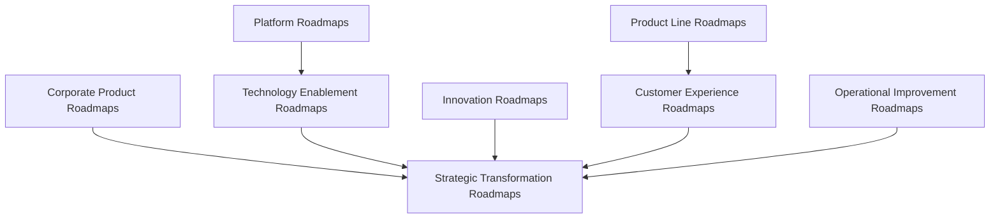
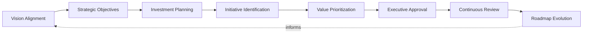
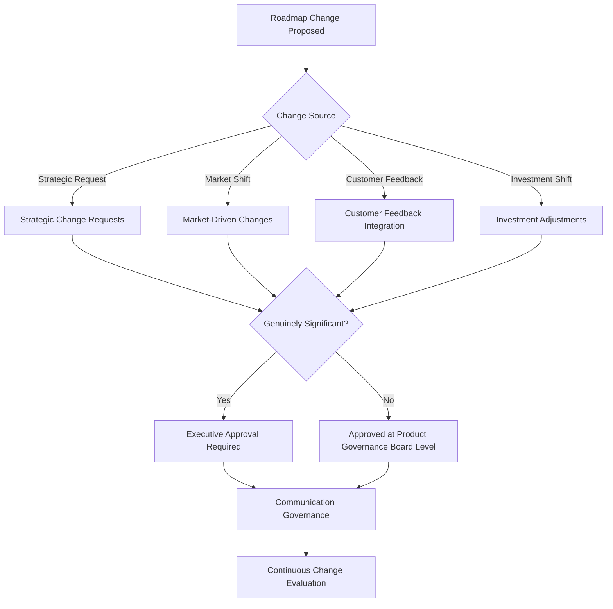
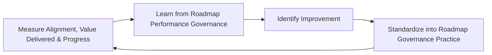
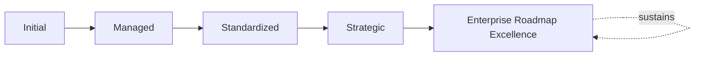

# Enterprise Product Roadmap Governance Framework

## 1. Executive Summary

**Purpose** — This document defines the official Enterprise Product Roadmap Governance Framework for **StackLeo Tech Store**. It establishes strategic roadmap governance, investment alignment, prioritization governance, roadmap change governance, executive oversight, organizational accountability, continuous improvement, and long-term roadmap maturity as a deliberate, accountable enterprise discipline. `product-roadmap.md` describes StackLeo's concrete, sequential development phases. This framework does not restate that content. It governs the discipline behind the roadmap itself — how roadmap direction is deliberately planned, how initiatives are prioritized, how changes to committed direction are deliberately governed, and how executive leadership maintains genuine confidence in the roadmap's alignment with business strategy.

**Scope** — This framework applies to every category of roadmap at StackLeo — corporate, product line, platform, technology enablement, innovation, customer experience, operational improvement, and strategic transformation roadmaps — coordinated with `product-roadmap.md`, `product-governance-strategy.md`, `product-lifecycle-framework.md`, and `00_Project_Overview/portfolio-program-governance.md`.

**Strategic Objectives** — To ensure roadmap direction is genuinely grounded in business strategy, never assembled from whoever's request is loudest; that roadmap initiatives are prioritized by genuine strategic and customer value; that a change to committed roadmap direction is deliberately governed, never made informally; and that executive leadership has continuous, honest visibility into the roadmap's alignment with genuine business intent.

**Business Value** — A governed roadmap framework protects StackLeo from the disproportionate cost of a roadmap that drifts from genuine business strategy, protects stakeholder trust by ensuring roadmap commitments are honored or deliberately, transparently changed, and gives leadership the confidence to communicate roadmap direction externally because its governance is demonstrably sound.

**Intended Audience** — The Board of Directors, executive leadership, the Chief Product Officer (or equivalent), the Product Governance Board, product leadership, engineering leadership, finance leadership, marketing leadership, operations leadership, and business stakeholders.

## 2. Enterprise Product Roadmap Vision

- **Roadmaps as Strategic Business Instruments** — a roadmap is governed as a genuine strategic business instrument, never merely a feature schedule.
- **Long-Term Product Direction** — the roadmap protects the organization's ability to communicate genuine, deliberate long-term direction.
- **Customer-Centric Innovation** — roadmap direction remains genuinely grounded in customer need, never technology convenience alone.
- **Business–Technology Alignment** — the roadmap remains genuinely connected to both business strategy and technical architecture.
- **Sustainable Investment** — roadmap commitments are governed to remain genuinely sustainable, never overextending investment capacity.
- **Organizational Transparency** — roadmap direction and its rationale are genuinely visible to those who need them.
- **Continuous Product Evolution** — the roadmap is governed to evolve deliberately, never frozen once initially published.

### Enterprise Product Roadmap Vision Matrix

| Vision Element | Focus | Business Value |
|---|---|---|
| Roadmaps as Strategic Business Instruments | A genuine strategic instrument, not a feature schedule | Prevents the roadmap from being treated as purely tactical |
| Long-Term Product Direction | Genuine, deliberate long-term direction communicated | Supports confident, informed stakeholder expectation |
| Customer-Centric Innovation | Grounded in genuine customer need | Keeps roadmap direction connected to what customers value |
| Business–Technology Alignment | Genuinely connected to strategy and architecture | Ensures roadmap investment is directed by coherent intent |
| Sustainable Investment | Genuinely sustainable, never overextended | Protects the organization from unsustainable commitment |
| Organizational Transparency | Direction and rationale genuinely visible | Allows the roadmap to be scrutinized and defended |
| Continuous Product Evolution | Evolving deliberately, never frozen | Keeps the roadmap genuinely connected to evolving reality |

## 3. Product Roadmap Governance Principles

Product roadmap governance at StackLeo rests on nine principles, each producing a specific business outcome.

- **Strategic Alignment** — every roadmap initiative remains genuinely connected to StackLeo's broader business strategy. *Business Value:* ensures roadmap investment is directed by genuine business intent.
- **Customer Value First** — a roadmap initiative is justified by the genuine value it creates for customers. *Business Value:* prevents roadmap investment disconnected from genuine customer need.
- **Outcome-Oriented Planning** — the roadmap is planned around genuine business and customer outcomes, never around output volume alone. *Business Value:* keeps roadmap planning connected to what genuinely matters.
- **Evidence-Based Prioritization** — a roadmap priority decision is grounded in genuine, documented evidence, not impression. *Business Value:* protects the credibility and defensibility of prioritization decisions.
- **Transparency** — roadmap direction and its rationale are documented and visible to those who genuinely need them. *Business Value:* allows the roadmap to be scrutinized and defended, not merely trusted on faith.
- **Executive Accountability** — the organization's most consequential roadmap decisions are made or ratified at the executive level. *Business Value:* ensures the organization's most consequential roadmap decisions carry commensurate scrutiny.
- **Controlled Change** — a change to committed roadmap direction proceeds only as a deliberate, governed decision. *Business Value:* protects stakeholder trust from being eroded by unexplained roadmap shifts.
- **Continuous Improvement** — roadmap governance practice matures over time, informed by real roadmap outcomes. *Business Value:* keeps governance aligned with the organization's growing scale and complexity.
- **Long-Term Sustainability** — roadmap commitments remain genuinely sustainable within the organization's investment capacity. *Business Value:* protects the organization from the disproportionate cost of an overcommitted roadmap.

### Product Roadmap Governance Principles Matrix

| Principle | Description | Business Value |
|---|---|---|
| Strategic Alignment | Every initiative genuinely connected to business strategy | Ensures investment is directed by genuine business intent |
| Customer Value First | Justified by genuine value created for customers | Prevents investment disconnected from genuine customer need |
| Outcome-Oriented Planning | Planned around genuine outcomes, not output volume | Keeps planning connected to what genuinely matters |
| Evidence-Based Prioritization | Grounded in genuine, documented evidence | Protects credibility and defensibility of decisions |
| Transparency | Direction and rationale documented and visible | Allows the roadmap to be scrutinized and defended |
| Executive Accountability | Most consequential decisions made or ratified at the top | Ensures commensurate scrutiny for consequential decisions |
| Controlled Change | Change proceeds only as a deliberate, governed decision | Protects stakeholder trust from unexplained shifts |
| Continuous Improvement | Practice matures from real roadmap outcomes | Keeps governance aligned with growing scale and complexity |
| Long-Term Sustainability | Commitments remaining within genuine investment capacity | Protects against the cost of an overcommitted roadmap |

## 4. Enterprise Product Roadmap Governance Model

Roadmap governance operates across eight conceptual categories, each holding accountability for a distinct roadmap type.

### Corporate Product Roadmaps

- **Purpose** — govern the enterprise-wide roadmap synthesizing direction across every product category.
- **Governance Scope** — coordinated with `01_Business/business-model.md`.
- **Business Value** — protects leadership's ability to understand overall product direction as a whole.
- **Executive Expectations** — leadership expects the corporate roadmap to be reviewed with the highest rigor in this model.

### Product Line Roadmaps

- **Purpose** — govern the roadmap for a specific product line or customer-facing product category.
- **Governance Scope** — coordinated with Customer Products (`product-governance-strategy.md`, Section 4).
- **Business Value** — protects the coherence of direction within a specific product line.
- **Executive Expectations** — leadership expects product line roadmaps to remain genuinely connected to customer need.

### Platform Roadmaps

- **Purpose** — govern the roadmap for shared platform capability.
- **Governance Scope** — coordinated with Platform Products (`product-governance-strategy.md`, Section 4).
- **Business Value** — protects the foundation every other roadmap category ultimately depends on.
- **Executive Expectations** — leadership expects platform roadmaps to be governed with awareness of their broad dependency footprint.

### Technology Enablement Roadmaps

- **Purpose** — govern the roadmap for technology capability enabling future product direction.
- **Governance Scope** — coordinated with `03_System_Design/technology-governance.md`.
- **Business Value** — protects the organization's ability to genuinely enable future product ambition.
- **Executive Expectations** — leadership expects technology enablement roadmaps to precede, not lag behind, product need.

### Innovation Roadmaps

- **Purpose** — govern the roadmap for deliberate experimentation with new product approaches.
- **Governance Scope** — coordinated with Innovation Governance (`product-governance-strategy.md`, Section 3).
- **Business Value** — protects the organization's ability to responsibly pursue genuine opportunity.
- **Executive Expectations** — leadership expects innovation roadmaps to be evaluated deliberately, never carelessly funded.

### Customer Experience Roadmaps

- **Purpose** — govern the roadmap for genuine improvement in customer-facing experience.
- **Governance Scope** — coordinated with `01_Business/vision.md`'s trust-centered brand commitment.
- **Business Value** — protects the trust relationship every customer interaction depends on.
- **Executive Expectations** — leadership expects customer experience roadmaps to be weighted alongside internal technical priority.

### Operational Improvement Roadmaps

- **Purpose** — govern the roadmap for genuine improvement in operational capability.
- **Governance Scope** — coordinated with `09_Operations/operations-strategy.md`.
- **Business Value** — protects the organization's ability to genuinely operate more effectively over time.
- **Executive Expectations** — leadership expects operational improvement roadmaps to demonstrate genuine, measurable improvement.

### Strategic Transformation Roadmaps

- **Purpose** — govern the synthesized roadmap for the organization's most significant, cross-cutting transformation.
- **Governance Scope** — oversight exclusively accountable for converging every category above into executive-relevant strategic view.
- **Business Value** — protects leadership's ability to understand overall transformation direction as a whole.
- **Executive Expectations** — leadership expects direct engagement in strategic transformation roadmaps, not merely notification.

### Product Roadmap Governance Matrix

| Domain | Purpose | Business Value | Executive Expectations |
|---|---|---|---|
| Corporate Product Roadmaps | Govern the enterprise-wide synthesized roadmap | Protects understanding of overall direction as a whole | Expects the highest rigor in this model |
| Product Line Roadmaps | Govern the roadmap for a specific product line | Protects coherence of direction within a product line | Expects genuine connection to customer need |
| Platform Roadmaps | Govern the roadmap for shared platform capability | Protects the foundation every other category depends on | Expects awareness of broad dependency footprint |
| Technology Enablement Roadmaps | Govern the roadmap enabling future product direction | Protects the ability to genuinely enable future ambition | Expects preceding, not lagging, product need |
| Innovation Roadmaps | Govern the roadmap for deliberate experimentation | Protects the ability to responsibly pursue opportunity | Expects deliberate, never careless, evaluation |
| Customer Experience Roadmaps | Govern the roadmap for customer-facing improvement | Protects the trust relationship every interaction depends on | Expects weighting alongside internal technical priority |
| Operational Improvement Roadmaps | Govern the roadmap for operational capability improvement | Protects the ability to operate more effectively over time | Expects genuine, measurable improvement |
| Strategic Transformation Roadmaps | Synthesize the most significant transformation direction | Protects understanding of transformation direction as a whole | Expects direct engagement, not merely notification |

*Diagram 1: Enterprise Product Roadmap Governance Framework — corporate roadmaps feed strategic transformation roadmaps directly, while product line and customer experience roadmaps, platform and technology enablement roadmaps, innovation roadmaps, and operational improvement roadmaps all converge on strategic transformation.*

## 5. Strategic Roadmap Planning Framework

Strategic roadmap planning is governed across eight conceptual disciplines, remaining implementation independent throughout.

### Vision Alignment

- **Governance Objectives** — confirm roadmap direction remains genuinely aligned with `01_Business/vision.md`.
- **Decision Authority** — the Chief Product Officer, coordinated with executive leadership.
- **Required Evidence** — documented alignment between roadmap themes and genuine business vision.
- **Expected Outcomes** — a roadmap genuinely grounded in organizational vision.

### Strategic Objectives

- **Governance Objectives** — confirm roadmap initiatives genuinely serve StackLeo's defined strategic objectives.
- **Decision Authority** — the Product Governance Board.
- **Required Evidence** — documented mapping of initiatives to genuine strategic objectives.
- **Expected Outcomes** — a roadmap with genuine, traceable strategic purpose.

### Investment Planning

- **Governance Objectives** — confirm roadmap commitments remain within genuine investment capacity.
- **Decision Authority** — the Product Governance Board, with Finance Leadership.
- **Required Evidence** — documented investment plan reflecting genuine resource availability.
- **Expected Outcomes** — a roadmap that is genuinely fundable.

### Initiative Identification

- **Governance Objectives** — recognize genuine candidate initiatives for roadmap inclusion.
- **Decision Authority** — Product Leadership, coordinated with the Product Governance Board.
- **Required Evidence** — a documented, genuine initiative statement.
- **Expected Outcomes** — a pool of genuinely candidate initiatives for prioritization.

### Value Prioritization

- **Governance Objectives** — confirm initiatives are prioritized by genuine strategic and customer value.
- **Decision Authority** — the Product Governance Board.
- **Required Evidence** — documented prioritization evidence per Roadmap Prioritization Governance (Section 6).
- **Expected Outcomes** — a genuinely prioritized set of roadmap initiatives.

### Executive Approval

- **Governance Objectives** — confirm the organization's most consequential roadmap commitments are genuinely approved.
- **Decision Authority** — executive leadership.
- **Required Evidence** — documented executive review and approval record.
- **Expected Outcomes** — a formally authorized roadmap.

### Continuous Review

- **Governance Objectives** — confirm the roadmap's continued genuine relevance on a recurring basis.
- **Decision Authority** — the Product Governance Board.
- **Required Evidence** — documented periodic review findings.
- **Expected Outcomes** — a roadmap genuinely kept current.

### Roadmap Evolution

- **Governance Objectives** — confirm the roadmap deliberately evolves alongside genuine business and market change.
- **Decision Authority** — the Product Governance Board, escalating to executive leadership for significant evolution.
- **Required Evidence** — documented rationale for genuine evolution.
- **Expected Outcomes** — a roadmap that remains genuinely connected to evolving reality.

### Strategic Roadmap Planning Matrix

| Discipline | Governance Objectives | Decision Authority | Required Evidence | Expected Outcomes |
|---|---|---|---|---|
| Vision Alignment | Confirm alignment with genuine business vision | Chief Product Officer with executive leadership | Documented alignment between themes and vision | A roadmap genuinely grounded in vision |
| Strategic Objectives | Confirm initiatives serve defined objectives | Product Governance Board | Documented mapping to strategic objectives | A roadmap with genuine, traceable purpose |
| Investment Planning | Confirm commitments within genuine capacity | Product Governance Board with Finance Leadership | Documented investment plan | A genuinely fundable roadmap |
| Initiative Identification | Recognize genuine candidate initiatives | Product Leadership with the Product Governance Board | A documented, genuine initiative statement | A pool of genuinely candidate initiatives |
| Value Prioritization | Confirm prioritization by genuine value | Product Governance Board | Documented prioritization evidence | A genuinely prioritized initiative set |
| Executive Approval | Confirm genuine approval of consequential commitments | Executive leadership | Documented executive review and approval | A formally authorized roadmap |
| Continuous Review | Confirm continued genuine relevance | Product Governance Board | Documented periodic review findings | A roadmap genuinely kept current |
| Roadmap Evolution | Confirm deliberate evolution alongside change | Product Governance Board, executive leadership for significant evolution | Documented rationale for evolution | A roadmap genuinely connected to evolving reality |

*Diagram 2: Strategic Roadmap Planning Model — vision alignment and strategic objectives inform investment planning and initiative identification, feeding value prioritization and executive approval, with continuous review and roadmap evolution feeding lessons back into the cycle.*

## 6. Roadmap Prioritization Governance

Roadmap prioritization governance operates across eight conceptual disciplines.

- **Strategic Value** — governs how a candidate initiative's genuine contribution to strategic direction is weighed.
- **Customer Value** — governs how a candidate initiative's genuine value to customers is weighed.
- **Business Impact** — governs how a candidate initiative's genuine business consequence is weighed.
- **Risk Considerations** — governs how a candidate initiative's genuine risk is weighed against its potential value.
- **Investment Alignment** — governs how a candidate initiative's genuine resource requirement is weighed against available investment.
- **Organizational Capacity** — governs how a candidate initiative's genuine capacity requirement is weighed against available delivery capacity.
- **Executive Decision Governance** — governs how the most consequential prioritization decisions are made or ratified at the executive level.
- **Continuous Reprioritization** — governs how the roadmap's priority order is deliberately revisited as genuine circumstances change.

### Roadmap Prioritization Matrix

| Prioritization Factor | Focus | Governance Coordination |
|---|---|---|
| Strategic Value | Genuine contribution to strategic direction | Strategic Objectives (Section 5) |
| Customer Value | Genuine value to customers | Customer Value First (Section 3) |
| Business Impact | Genuine business consequence | Outcome-Oriented Planning (Section 3) |
| Risk Considerations | Genuine risk weighed against potential value | Product Risk Governance coordinated with `product-governance-strategy.md` |
| Investment Alignment | Genuine resource requirement against investment | Investment Planning (Section 5) |
| Organizational Capacity | Genuine capacity requirement against delivery capacity | `00_Project_Overview/resource-capacity-governance.md` |
| Executive Decision Governance | Most consequential decisions made at the executive level | Executive Accountability (Section 3) |
| Continuous Reprioritization | Priority order deliberately revisited as circumstances change | Continuous Review (Section 5) |

## 7. Roadmap Change Governance

Roadmap change governance operates across seven conceptual disciplines.

- **Strategic Change Requests** — governs how a genuine, deliberate request to change roadmap direction is formally submitted.
- **Market-Driven Changes** — governs how a genuine market shift is deliberately evaluated for roadmap impact.
- **Customer Feedback Integration** — governs how genuine customer feedback is deliberately incorporated into roadmap change consideration.
- **Investment Adjustments** — governs how a genuine change in investment capacity is reflected in roadmap adjustment.
- **Executive Approval** — governs the point at which a roadmap change genuinely requires executive-level approval.
- **Communication Governance** — governs how a genuine roadmap change is deliberately communicated to affected stakeholders.
- **Continuous Change Evaluation** — governs how the organization's roadmap change practice itself is periodically reviewed.

### Roadmap Change Governance Matrix

| Governance Area | Focus | Coordination |
|---|---|---|
| Strategic Change Requests | A genuine, deliberate request formally submitted | Controlled Change (Section 3) |
| Market-Driven Changes | A genuine market shift deliberately evaluated | Roadmap Prioritization Governance (Section 6) |
| Customer Feedback Integration | Genuine feedback deliberately incorporated | Customer Value First (Section 3) |
| Investment Adjustments | A genuine capacity change reflected in adjustment | Investment Planning (Section 5) |
| Executive Approval | Point requiring genuine executive-level approval | Executive Oversight (Section 10) |
| Communication Governance | A genuine change deliberately communicated | `00_Project_Overview/stakeholder-engagement-framework.md` |
| Continuous Change Evaluation | Change practice itself periodically reviewed | Continuous Improvement (Section 3) |

*Diagram 4: Roadmap Change Governance Lifecycle — a proposed change is classified by source, evaluated for genuine significance, approved at the executive or board level accordingly, and resolved into deliberate communication and continuous change evaluation.*

## 8. Roadmap Performance Governance

Roadmap performance governance operates across seven conceptual disciplines.

- **Strategic Alignment Reviews** — governs the periodic, formal review of the roadmap's continued genuine alignment with strategy.
- **Value Delivery Reviews** — governs the periodic, formal review of genuine value delivered by completed roadmap initiatives.
- **Roadmap Progress Reviews** — governs the periodic, formal review of genuine progress against roadmap commitment.
- **Business Outcome Reviews** — governs the periodic, formal review of genuine business outcomes attributable to the roadmap.
- **Executive Visibility** — governs how roadmap performance is made genuinely visible to executive leadership.
- **Continuous Optimization** — governs how roadmap governance practice is deliberately refined based on real performance outcomes.
- **Organizational Learning** — governs how understanding gained from roadmap performance deepens the organization's genuine collective capability.

### Roadmap Performance Matrix

| Governance Area | Focus | Coordination |
|---|---|---|
| Strategic Alignment Reviews | Continued genuine alignment with strategy | Strategic Objectives (Section 5) |
| Value Delivery Reviews | Genuine value delivered by completed initiatives | `product-lifecycle-framework.md` (Section 7, Benefits Realization) |
| Roadmap Progress Reviews | Genuine progress against roadmap commitment | Continuous Review (Section 5) |
| Business Outcome Reviews | Genuine business outcomes attributable to the roadmap | Business Impact (Section 6) |
| Executive Visibility | Performance made genuinely visible to leadership | Executive Oversight (Section 10) |
| Continuous Optimization | Practice deliberately refined from real outcomes | Continuous Improvement (Section 3) |
| Organizational Learning | Understanding deepening genuine collective capability | Continuous Improvement (Section 3) |

## 9. Organizational Governance

Governance accountability is distributed deliberately across ten organizational roles.

- **Board of Directors** — holds ultimate accountability for whether StackLeo's roadmap genuinely serves the business's long-term direction.
- **Executive Leadership** — holds accountability for whether roadmap decisions genuinely align with business strategy, in partnership with the Board.
- **Chief Product Officer (or equivalent)** — owns the coherence and enforcement of this framework across every roadmap category.
- **Product Governance Board** — owns the operational execution of Strategic Roadmap Planning (Section 5) and Roadmap Change Governance (Section 7).
- **Product Leadership** — own day-to-day Initiative Identification (Section 5) within their accountable product categories.
- **Engineering Leadership** — own Technology Enablement Roadmaps (Section 4) within their accountable teams.
- **Finance Leadership** — own Investment Planning (Section 5) rigor.
- **Marketing Leadership** — own Customer Experience Roadmaps (Section 4) and roadmap communication.
- **Operations Leadership** — own Operational Improvement Roadmaps (Section 4) in coordination with `09_Operations/operations-strategy.md`.
- **Business Stakeholders** — own Business Impact input (Section 6) for initiatives affecting their domain.

### Organizational Responsibility Matrix

| Role | Governance Objective | Business Value |
|---|---|---|
| Board of Directors | Hold ultimate accountability for the roadmap serving direction | Provides the highest point of ultimate accountability |
| Executive Leadership | Hold accountability for decisions aligning with business strategy | Provides a single point of executive-level accountability |
| Chief Product Officer | Own coherence and enforcement across every roadmap category | Provides a single point of specialist accountability |
| Product Governance Board | Own operational execution of planning and change governance | Provides a dedicated, cross-functional governance body |
| Product Leadership | Own day-to-day initiative identification | Embeds accountability closest to where roadmaps are shaped |
| Engineering Leadership | Own technology enablement roadmaps | Embeds accountability closest to where technology is delivered |
| Finance Leadership | Own investment planning rigor | Ensures roadmap commitments reflect genuine financial discipline |
| Marketing Leadership | Own customer experience roadmaps and communication | Ensures customers are genuinely informed of direction |
| Operations Leadership | Own operational improvement roadmaps | Ensures roadmaps genuinely support operational sustainability |
| Business Stakeholders | Own business impact input for their domain | Connects roadmap decisions to genuine business relevance |

## 10. Executive Oversight

- **Strategic Roadmap Reviews** — the overall coherence of the roadmap is formally reviewed on a regular cadence.
- **Investment Reviews** — roadmap investment commitments are reviewed directly with executive leadership.
- **Portfolio Alignment Reviews** — the roadmap's coherence with `00_Project_Overview/portfolio-program-governance.md` is periodically reviewed.
- **Product Outcome Reviews** — the genuine business outcomes attributable to the roadmap are reviewed with executive leadership.
- **Risk Reviews** — the organization's roadmap-related risk posture is reviewed directly with executive leadership.
- **Continuous Improvement Reviews** — the organization's follow-through on captured roadmap governance lessons is reviewed directly with executive leadership.

### Executive Oversight Matrix

| Oversight Mechanism | Purpose | Governance Role |
|---|---|---|
| Strategic Roadmap Reviews | Confirm overall roadmap coherence | Regular, predictable cadence for the framework as a whole |
| Investment Reviews | Review roadmap investment commitments | Direct executive-level investment review |
| Portfolio Alignment Reviews | Review coherence with the broader portfolio | Periodic executive-level portfolio alignment review |
| Product Outcome Reviews | Review genuine business outcomes attributable to the roadmap | Direct executive-level outcome review |
| Risk Reviews | Review roadmap-related risk posture | Direct executive-level review of risk exposure |
| Continuous Improvement Reviews | Review follow-through on captured lessons | Direct executive-level review of improvement completion |

## 11. Future Readiness

This framework is designed to remain valid as StackLeo evolves in scale, geography, and organizational complexity.

- **AI-Assisted Roadmap Planning** — as initiative identification and prioritization increasingly incorporate AI-assisted methods, coordinated with `04_Database/ai-governance.md`, they remain governed under Initiative Identification and Value Prioritization (Section 5) at the same rigor as any other method.
- **Predictive Investment Prioritization** — where prioritization increasingly draws on intelligent pattern analysis, that analysis remains subject to the same Roadmap Prioritization Governance (Section 6) as any other method.
- **Adaptive Strategic Roadmaps** — where roadmap direction increasingly adapts to genuinely changing market conditions, that evolution remains governed under Roadmap Evolution (Section 5) at the same rigor as any other discipline.
- **Intelligent Product Portfolio Alignment** — where roadmap alignment with the broader portfolio increasingly draws on intelligent analysis, that analysis remains subject to the same Portfolio Alignment Reviews (Section 10) as any other method.
- **Enterprise Innovation Governance** — new roadmap planning approaches are adopted only in a manner consistent with this framework's principles (Section 3), never at their expense.
- **Sustainable Product Evolution** — Vision Alignment and Strategic Objectives (Section 5) are structured to be re-applied as StackLeo expands from Bangladesh into South Asia and global markets.

## 12. Product Roadmap Maturity Model

Product roadmap governance maturity is described across five conceptual levels.

- **Initial** — roadmap governance, where it exists, is informal and inconsistent; direction is set reactively, and ownership is unclear.
- **Managed** — basic roadmap governance exists for individual categories, but consistency across the eight domains in Section 4 varies significantly.
- **Standardized** — the governance model, planning framework, and lifecycle are standardized, documented, and consistently applied across the organization.
- **Strategic** — roadmap decisions are genuinely and routinely made in deliberate service of business strategy, not feature convenience.
- **Enterprise Roadmap Excellence** — roadmap governance is continuously and deliberately improved based on quantitative evidence and organizational learning; roadmap discipline functions as a genuine, sustained source of enterprise excellence.

### Product Roadmap Maturity Matrix

| Level | Characteristics | Primary Focus |
|---|---|---|
| Initial | Informal, inconsistent governance; direction set reactively | Ad hoc, individually-dependent roadmap practice |
| Managed | Basic governance exists per category; consistency varies | Category-level consistency |
| Standardized | Standardized governance model, planning framework, and lifecycle | Organization-wide consistency and clear ownership |
| Strategic | Decisions genuinely and routinely made in service of strategy | Business-strategy-driven roadmap decision-making |
| Enterprise Roadmap Excellence | Practice continuously improved; roadmap as competitive advantage | Sustained, deliberate, enterprise-wide roadmap excellence |

*Diagram 5: Continuous Roadmap Improvement Cycle — strategic alignment, value delivered, and progress are measured, learned from, improved upon, and standardized back into governed practice, on a continuing basis.*

*Diagram 6: Product Roadmap Maturity Progression — maturity advances from informal, reactively-set roadmap practice toward standardized, genuinely strategy-driven, and continuously excellent enterprise product roadmap governance.*

## 13. Product Roadmap Anti-Patterns

- **Roadmaps Without Strategy** — building a roadmap without genuine connection to business strategy produces effort without coherent direction.
- **Feature-Driven Planning** — planning by feature convenience rather than genuine strategic or customer value inverts Outcome-Oriented Planning (Section 3).
- **Weak Investment Alignment** — committing roadmap direction without genuine investment planning risks a roadmap that cannot genuinely be funded.
- **Constant Reactive Changes** — changing roadmap direction only in response to pressure, without genuine deliberation, erodes stakeholder trust.
- **Poor Executive Visibility** — leadership lacking genuine roadmap visibility cannot make informed strategic decisions.
- **Ignoring Customer Value** — prioritizing a roadmap without genuine customer value consideration misdirects investment.
- **Siloed Roadmap Planning** — planning roadmap categories independently, without genuine cross-domain coordination, prevents one coherent enterprise picture.
- **No Continuous Review** — treating the current roadmap as permanently finished guarantees it falls behind genuinely evolving business and market reality.

### Anti-Pattern Summary

| Anti-Pattern | Organizational & Business Impact |
|---|---|
| Roadmaps Without Strategy | Produces effort without coherent, strategic direction |
| Feature-Driven Planning | Inverts outcome-oriented planning, favoring convenience |
| Weak Investment Alignment | Risks a roadmap that cannot genuinely be funded |
| Constant Reactive Changes | Erodes stakeholder trust through unexplained shifts |
| Poor Executive Visibility | Prevents informed strategic decisions |
| Ignoring Customer Value | Misdirects investment away from genuine customer need |
| Siloed Roadmap Planning | Prevents one coherent, organization-wide roadmap picture |
| No Continuous Review | Guarantees the roadmap falls behind evolving reality |

## Related Documents

| Document | Relationship |
|---|---|
| `product-roadmap.md` | Describes the platform's concrete, sequential roadmap this framework governs the accountability structure for. |
| `product-governance-strategy.md` | Sets the enterprise-wide product governance model this framework's roadmap categories elaborate. |
| `product-lifecycle-framework.md` | Elaborates the stage-gate discipline individual roadmap initiatives follow once authorized. |
| `product-portfolio-governance.md` | Governs how multiple product roadmaps are coordinated as a portfolio. |
| `customer-value-governance.md` | Provides a deeper elaboration of the Customer Value First principle (Section 3). |
| `product-risk-governance.md` | Provides a deeper elaboration of roadmap-related risk. |
| `product-maturity-framework.md` | Consolidates the maturity model this framework defines in Section 12 into the enterprise-wide product maturity picture. |
| `01_Business/business-model.md` | Establishes the business strategy this framework's Strategic Alignment principle (Section 3) is ultimately measured against. |
| `00_Project_Overview/portfolio-program-governance.md` | The analogous portfolio governance this framework's roadmap-level prioritization coordinates with. |

## Document Information

| Property | Value |
|----------|-------|
| Document | product-roadmap-governance.md |
| Version | 1.0.0 |
| Status | Active |
| Maintained By | StackLeo |
| Last Updated | 2026-07-29 |

---

© StackLeo. All Rights Reserved.
