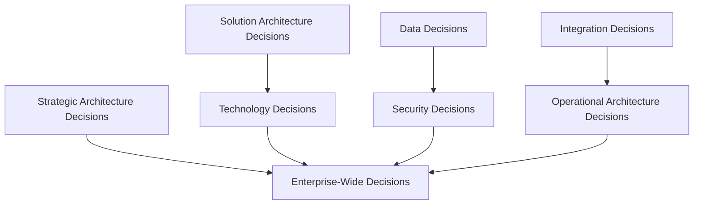
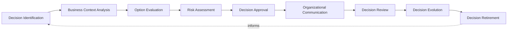
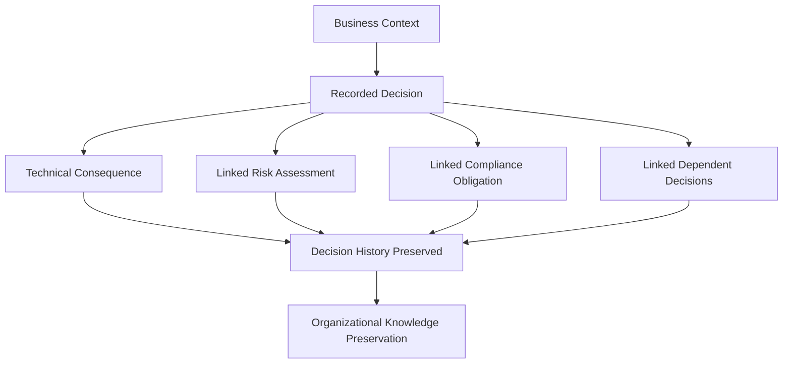
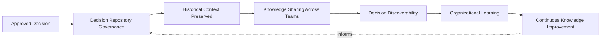
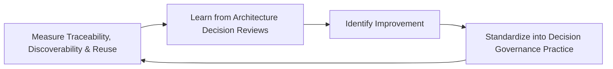
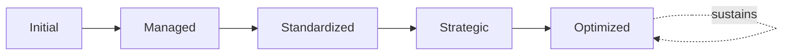

# Enterprise Architecture Decision Records Framework

## 1. Executive Summary

**Purpose** — This document defines the official Enterprise Architecture Decision Records (ADR) Framework for **StackLeo Tech Store**. It establishes decision governance, decision ownership, architectural traceability, organizational knowledge management, executive oversight, continuous improvement, and long-term decision maturity as a deliberate, accountable enterprise discipline. `architecture-decisions.md` remains the concrete ADR log — the document that records each individual architectural decision's context, alternatives, and consequences. This framework does not restate that log's content. It governs the discipline behind it: who owns a decision, how a decision's genuine business rationale is traced over time, and how the organization's accumulated architectural knowledge is preserved and genuinely used rather than forgotten.

**Scope** — This framework applies to every category of architectural decision at StackLeo — strategic, solution, technology, data, security, integration, operational, and enterprise-wide decisions — coordinated with `architecture-decisions.md`, `enterprise-architecture-strategy.md`, `solution-architecture-framework.md`, `technology-governance.md`, and `architecture-review-board.md`.

**Strategic Objectives** — To ensure every consequential architectural decision is genuinely traceable to the business context that prompted it, never left as an unrecorded assumption; that decisions are owned by an accountable party throughout their lifetime, not only at the moment of approval; that the organization's accumulated architectural knowledge genuinely compounds rather than is repeatedly rediscovered; and that executive leadership has continuous, honest visibility into the organization's decision governance posture.

**Business Value** — A governed decision records framework protects StackLeo from the cost of re-litigating settled architectural questions or blindly preserving decisions that no longer fit, protects new architects and engineers from having to guess whether a past constraint remains valid, and gives leadership confidence that the organization's architectural history is a genuine, usable asset rather than a scattered, forgotten record.

**Intended Audience** — The Board of Directors, executive leadership, the Chief Technology Officer, the enterprise architecture team, the Architecture Review Board, solution architects, engineering leadership, security leadership, product leadership, and business stakeholders.

## 2. Enterprise Decision Governance Vision

- **Architecture Decisions as Enterprise Knowledge** — architectural decisions are governed as a genuine enterprise knowledge asset, never merely a byproduct of the decision-making moment.
- **Strategic Decision Transparency** — a decision's genuine rationale is documented and visible to those who genuinely need to understand it.
- **Long-Term Decision Traceability** — a decision remains genuinely traceable to its original business context for as long as it remains in effect.
- **Organizational Learning** — understanding gained from past decisions deepens the organization's genuine collective architectural capability.
- **Business Alignment** — every decision remains genuinely connected to the business need that justified it.
- **Sustainable Technology Evolution** — decision governance protects the organization's ability to evolve its architecture deliberately, informed by genuine history.
- **Continuous Improvement** — decision governance practice matures over time, informed by real decision outcomes.

### Enterprise Decision Governance Vision Matrix

| Vision Element | Focus | Business Value |
|---|---|---|
| Architecture Decisions as Enterprise Knowledge | A genuine knowledge asset, not a decision-moment byproduct | Prevents decision rationale from being lost after the decision is made |
| Strategic Decision Transparency | Rationale documented and visible to those who need it | Allows decisions to be scrutinized and defended |
| Long-Term Decision Traceability | Genuinely traceable to original context for as long as it applies | Lets the organization revisit context deliberately, not blindly |
| Organizational Learning | Past decisions deepening genuine collective capability | Converts decision history into durable organizational capability |
| Business Alignment | Every decision genuinely connected to its justifying need | Keeps the decision record connected to genuine business intent |
| Sustainable Technology Evolution | Protects the ability to evolve deliberately, informed by history | Prevents re-litigating settled questions unnecessarily |
| Continuous Improvement | Practice matures from real decision outcomes | Keeps decision governance aligned with growing scale and complexity |

## 3. Architecture Decision Principles

Architecture decision governance at StackLeo rests on nine principles, each producing a specific business outcome.

- **Business Value First** — a decision's genuine business value is the primary consideration, never technical interest alone. *Business Value:* prevents decisions disconnected from genuine business intent.
- **Evidence-Based Decisions** — a decision is grounded in genuine, documented evidence and alternatives considered, not impression. *Business Value:* protects the credibility and defensibility of every recorded decision.
- **Transparency** — a decision's context, alternatives, and rationale are documented and visible to those who genuinely need them. *Business Value:* allows decisions to be scrutinized and defended, not merely trusted on faith.
- **Accountability** — every decision traces to a specific, named, responsible owner. *Business Value:* ensures no decision drifts without someone genuinely responsible for its continued relevance.
- **Traceability** — every decision can be traced from its business context through to its genuine technical consequence. *Business Value:* supports confident, informed re-evaluation of any past decision.
- **Simplicity** — a decision record captures what is genuinely necessary to understand it, never burdened with excessive detail. *Business Value:* protects the decision record's genuine usability over time.
- **Risk Awareness** — a decision's genuine risk is explicitly documented as part of its record. *Business Value:* ensures future readers understand the risk a decision genuinely accepted.
- **Reusability of Knowledge** — a documented decision is governed to be genuinely reusable by future architects facing a similar question. *Business Value:* protects the organization from repeatedly re-deriving the same answer.
- **Continuous Learning** — understanding gained from a decision's real outcome deepens future decision quality. *Business Value:* converts decision experience into durable organizational capability.

### Architecture Decision Principles Matrix

| Principle | Description | Business Value |
|---|---|---|
| Business Value First | Genuine business value is the primary consideration | Prevents decisions disconnected from genuine business intent |
| Evidence-Based Decisions | Grounded in genuine, documented evidence and alternatives | Protects credibility and defensibility of recorded decisions |
| Transparency | Context, alternatives, and rationale documented and visible | Allows decisions to be scrutinized and defended |
| Accountability | Every decision traces to a specific, responsible owner | Ensures no decision drifts without genuine responsibility |
| Traceability | Traceable from business context to genuine technical consequence | Supports confident, informed re-evaluation of past decisions |
| Simplicity | Captures what is genuinely necessary, never excessive | Protects the decision record's genuine usability over time |
| Risk Awareness | Genuine risk explicitly documented as part of the record | Ensures future readers understand the risk genuinely accepted |
| Reusability of Knowledge | Genuinely reusable by future architects facing similar questions | Protects against repeatedly re-deriving the same answer |
| Continuous Learning | Real outcomes deepening future decision quality | Converts decision experience into durable organizational capability |

## 4. Enterprise Architecture Decision Governance Model

Decision governance operates across eight conceptual domains, each holding accountability for a distinct category of architectural decision.

### Strategic Architecture Decisions

- **Purpose** — govern decisions with the most consequential, long-term effect on enterprise architecture direction.
- **Governance Scope** — coordinated with Strategic Architecture Reviews (`architecture-review-board.md`, Section 4).
- **Business Value** — protects the coherence of the enterprise's overall architectural direction.
- **Executive Expectations** — leadership expects strategic decisions to be held to the highest governance rigor in this model.

### Solution Architecture Decisions

- **Purpose** — govern decisions made within the design of a specific solution.
- **Governance Scope** — coordinated with `solution-architecture-framework.md` (Section 6, Solution Lifecycle Governance).
- **Business Value** — protects the coherence of individual solutions with the broader enterprise architecture.
- **Executive Expectations** — leadership expects solution decisions to be genuinely traceable to their originating requirement.

### Technology Decisions

- **Purpose** — govern decisions to adopt, standardize, or retire a technology.
- **Governance Scope** — coordinated with `technology-governance.md` (Section 7, Technology Lifecycle Governance).
- **Business Value** — protects the coherence of the organization's technology portfolio.
- **Executive Expectations** — leadership expects technology decisions to be genuinely justified before enterprise adoption.

### Data Decisions

- **Purpose** — govern decisions affecting the structure, flow, or governance of platform data.
- **Governance Scope** — coordinated with `04_Database/data-governance.md`.
- **Business Value** — protects the trustworthiness and coherence of the data every business decision depends on.
- **Executive Expectations** — leadership expects data decisions to be documented proportionate to genuine data sensitivity.

### Security Decisions

- **Purpose** — govern decisions affecting the platform's security architecture, jointly with, and never superseding, `security-strategy.md`.
- **Governance Scope** — coordinated with `06_Security/security-architecture.md`.
- **Business Value** — protects StackLeo's core trust differentiator through genuinely documented security rationale.
- **Executive Expectations** — leadership expects security decisions to be treated as mandatory, non-negotiable documentation.

### Integration Decisions

- **Purpose** — govern decisions affecting how the platform's components and external partners connect.
- **Governance Scope** — coordinated with `03_System_Design/integration-architecture.md`.
- **Business Value** — protects the coherence of the platform's boundary-crossing interactions.
- **Executive Expectations** — leadership expects integration decisions to remain traceable as partner relationships grow.

### Operational Architecture Decisions

- **Purpose** — govern decisions affecting how the platform is architected to be genuinely operated.
- **Governance Scope** — coordinated with `operations-strategy.md`.
- **Business Value** — protects the organization's ability to genuinely operate what it has built.
- **Executive Expectations** — leadership expects operational decisions to extend genuinely beyond deployment.

### Enterprise-Wide Decisions

- **Purpose** — govern the synthesized, executive-relevant picture of decisions spanning multiple domains above.
- **Governance Scope** — oversight exclusively accountable for converging every domain into one coherent enterprise picture.
- **Business Value** — protects leadership's ability to understand overall decision posture as a whole, not domain by domain.
- **Executive Expectations** — leadership expects one coherent decision picture, not eight disconnected domain views.

### Architecture Decision Governance Matrix

| Domain | Purpose | Business Value | Executive Expectations |
|---|---|---|---|
| Strategic Architecture Decisions | Govern the most consequential, long-term decisions | Protects coherence of enterprise architectural direction | Expects the highest governance rigor in this model |
| Solution Architecture Decisions | Govern decisions within a specific solution's design | Protects coherence of solutions with the enterprise | Expects genuine traceability to originating requirement |
| Technology Decisions | Govern decisions to adopt, standardize, or retire | Protects coherence of the technology portfolio | Expects genuine justification before enterprise adoption |
| Data Decisions | Govern decisions affecting data structure and flow | Protects trustworthiness and coherence of business data | Expects documentation proportionate to data sensitivity |
| Security Decisions | Govern decisions affecting security architecture | Protects StackLeo's core trust differentiator | Expects treatment as mandatory, non-negotiable documentation |
| Integration Decisions | Govern decisions affecting boundary-crossing connections | Protects coherence of boundary-crossing interactions | Expects traceability as partner relationships grow |
| Operational Architecture Decisions | Govern decisions affecting genuine operability | Protects the ability to genuinely operate what is built | Expects decisions extending genuinely beyond deployment |
| Enterprise-Wide Decisions | Synthesize the enterprise decision picture | Protects leadership's ability to understand posture as a whole | Expects one coherent picture, not disconnected views |

*Diagram 1: Enterprise Architecture Decision Governance Framework — strategic decisions feed enterprise-wide decisions directly, while solution and technology decisions, data and security decisions, and integration and operational decisions each converge on the enterprise-wide decision picture.*

## 5. Architecture Decision Classification Framework

Decisions are governed across seven conceptual classifications, each carrying a distinct governance objective. Remaining implementation independent, this framework classifies decisions by their nature and durability — never by tool, template, or repository structure.

### Strategic Decisions

- **Purpose** — decisions with the most consequential, long-term effect on enterprise direction.
- **Governance Expectations** — held to the highest documentation and review rigor in this model.
- **Decision Authority** — executive leadership, coordinated with `architecture-review-board.md` (Strategic Architecture Reviews).
- **Review Requirements** — formally reviewed on a recurring, predictable cadence.

### Tactical Decisions

- **Purpose** — decisions with a genuine, but bounded and mid-term, effect on architecture.
- **Governance Expectations** — documented with sufficient rationale to support future re-evaluation.
- **Decision Authority** — the Enterprise Architecture Team or Architecture Review Board.
- **Review Requirements** — reviewed at defined architectural milestones.

### Operational Decisions

- **Purpose** — decisions supporting genuine day-to-day architectural execution.
- **Governance Expectations** — documented proportionate to their genuine, bounded consequence.
- **Decision Authority** — solution architects or engineering leadership within their accountable scope.
- **Review Requirements** — reviewed as part of routine Governance Review.

### Temporary Decisions

- **Purpose** — decisions genuinely intended to apply only for a bounded period.
- **Governance Expectations** — documented with an explicit, genuine expiration or review trigger.
- **Decision Authority** — proportionate to the decision's underlying category.
- **Review Requirements** — reviewed at or before the decision's genuine expiration point.

### Permanent Decisions

- **Purpose** — decisions genuinely intended to remain in effect indefinitely.
- **Governance Expectations** — documented with the rigor appropriate to a lasting architectural commitment.
- **Decision Authority** — proportionate to the decision's underlying category, typically elevated.
- **Review Requirements** — reviewed periodically to confirm continued genuine relevance.

### Exception Decisions

- **Purpose** — decisions that genuinely deviate from established architecture standards.
- **Governance Expectations** — coordinated with Exception Governance (`architecture-review-board.md`, Section 8).
- **Decision Authority** — proportionate to the exception's genuine risk, per Decision Authority Framework (`architecture-review-board.md`, Section 6).
- **Review Requirements** — reviewed within the exception's genuine, bounded validity period.

### Innovation Decisions

- **Purpose** — decisions to deliberately experiment with a genuinely new architectural or technology approach.
- **Governance Expectations** — coordinated with Innovation Governance (`technology-governance.md`, Section 9).
- **Decision Authority** — the Enterprise Architecture Team, with escalation for enterprise-wide adoption.
- **Review Requirements** — reviewed against genuine business validation before broader adoption.

### Decision Classification Matrix

| Classification | Purpose | Decision Authority | Review Requirements |
|---|---|---|---|
| Strategic Decisions | Most consequential, long-term effect on direction | Executive leadership, with the Architecture Review Board | Formally reviewed on a recurring, predictable cadence |
| Tactical Decisions | Genuine, bounded, mid-term effect | Enterprise Architecture Team or Architecture Review Board | Reviewed at defined architectural milestones |
| Operational Decisions | Genuine day-to-day architectural execution | Solution architects or engineering leadership | Reviewed as part of routine Governance Review |
| Temporary Decisions | Genuinely intended for a bounded period | Proportionate to the decision's underlying category | Reviewed at or before genuine expiration |
| Permanent Decisions | Genuinely intended to remain in effect indefinitely | Proportionate to category, typically elevated | Reviewed periodically for continued relevance |
| Exception Decisions | Genuine deviation from established standards | Proportionate to the exception's genuine risk | Reviewed within the exception's bounded validity |
| Innovation Decisions | Deliberate experimentation with a new approach | Enterprise Architecture Team, with escalation | Reviewed against genuine business validation |

## 6. Architecture Decision Lifecycle Governance

Architecture decision governance operates across nine conceptual lifecycle stages.

- **Decision Identification** — govern how a genuine architectural decision point is recognized.
- **Business Context Analysis** — govern how the genuine business context prompting a decision is understood.
- **Option Evaluation** — govern how genuine alternatives are identified and weighed.
- **Risk Assessment** — govern how a decision's genuine risk is evaluated proportionate to its consequence.
- **Decision Approval** — govern how a decision is formally, deliberately approved by the accountable authority.
- **Organizational Communication** — govern how an approved decision is genuinely communicated to those who need to know it.
- **Decision Review** — govern the periodic, formal review of a decision's continued genuine relevance.
- **Decision Evolution** — govern how a decision is deliberately updated as genuine circumstances change.
- **Decision Retirement** — govern how a decision no longer genuinely relevant is deliberately retired.

### Decision Lifecycle Matrix

| Stage | Governance Objective | Business Value |
|---|---|---|
| Decision Identification | Recognize a genuine architectural decision point | Ensures decision effort is deliberately directed |
| Business Context Analysis | Understand the genuine business context prompting it | Keeps the decision connected to genuine business intent |
| Option Evaluation | Identify and weigh genuine alternatives | Protects against a decision made without genuine consideration |
| Risk Assessment | Evaluate genuine risk proportionate to consequence | Directs scrutiny toward what genuinely matters most |
| Decision Approval | Formally, deliberately approve by accountable authority | Ensures decisions can be genuinely defended |
| Organizational Communication | Communicate to those who genuinely need to know | Prevents a decision from being unknowingly violated |
| Decision Review | Periodically review continued genuine relevance | Prevents a stale decision from misdirecting future practice |
| Decision Evolution | Deliberately update as genuine circumstances change | Keeps the decision genuinely connected to current reality |
| Decision Retirement | Deliberately retire decisions no longer relevant | Prevents accumulation of obsolete, misleading decisions |

*Diagram 2: Architecture Decision Lifecycle — identification and business context analysis inform option evaluation and risk assessment, feeding approval and organizational communication, with decision review, evolution, and retirement feeding lessons back into the cycle.*

## 7. Decision Traceability Framework

- **Business Traceability** — governs whether a decision can be traced back to the genuine business need that prompted it.
- **Technical Traceability** — governs whether a decision can be traced forward to its genuine technical consequence and dependent decisions.
- **Risk Traceability** — governs whether a decision's genuine risk assessment remains linked to the decision itself.
- **Compliance Traceability** — governs whether a decision's adherence to genuine regulatory or contractual obligation is traceable, coordinated with `06_Security/compliance-governance.md`.
- **Dependency Traceability** — governs whether a decision's genuine dependency on, or relationship to, other decisions is traceable.
- **Decision History** — governs whether a decision's full history — original approval, subsequent evolution, eventual retirement — remains genuinely accessible.
- **Organizational Knowledge Preservation** — governs how a decision's genuine context is preserved even after the individuals involved have moved on.

### Decision Traceability Matrix

| Traceability Area | Focus | Governance Coordination |
|---|---|---|
| Business Traceability | Traced back to the genuine business need | Business Context Analysis (Section 6) |
| Technical Traceability | Traced forward to genuine technical consequence | `architecture-decisions.md` |
| Risk Traceability | Risk assessment remaining linked to the decision | Risk Assessment (Section 6) |
| Compliance Traceability | Adherence to regulatory or contractual obligation traceable | `06_Security/compliance-governance.md` |
| Dependency Traceability | Genuine dependency on or relationship to other decisions | Enterprise Architecture Decision Governance Model (Section 4) |
| Decision History | Full history remaining genuinely accessible | Decision Repository Governance (Section 8) |
| Organizational Knowledge Preservation | Context preserved beyond involved individuals | Knowledge Management Governance (Section 8) |

*Diagram 3: Decision Traceability Model — business context anchors a recorded decision, which links forward to technical consequence, risk assessment, compliance obligation, and dependent decisions, all preserved together as decision history feeding organizational knowledge preservation.*

## 8. Knowledge Management Governance

- **Organizational Learning** — governs how understanding gained from past decisions genuinely deepens collective architectural capability.
- **Decision Repository Governance** — governs the accountability structure for the accumulated body of recorded decisions.
- **Historical Context** — governs whether a decision's genuine historical context remains available to future readers.
- **Knowledge Sharing** — governs how decision knowledge is genuinely shared across teams, not siloed within the team that made it.
- **Decision Discoverability** — governs whether a relevant past decision can genuinely be found when a similar question arises.
- **Continuous Knowledge Improvement** — governs how the organization's knowledge management practice itself deliberately matures.

### Knowledge Management Matrix

| Governance Area | Focus | Coordination |
|---|---|---|
| Organizational Learning | Past decisions deepening genuine collective capability | Continuous Learning (Section 3) |
| Decision Repository Governance | Accountability for the accumulated body of decisions | `architecture-decisions.md` |
| Historical Context | Genuine historical context available to future readers | Decision History (Section 7) |
| Knowledge Sharing | Genuinely shared across teams, not siloed | Reusability of Knowledge (Section 3) |
| Decision Discoverability | A relevant past decision can genuinely be found | Enterprise Architecture Decision Governance Model (Section 4) |
| Continuous Knowledge Improvement | Practice itself deliberately maturing | Continuous Improvement (Section 3) |

*Diagram 4: Architecture Knowledge Management Flow — an approved decision enters the repository, preserving historical context, shared across teams, and made discoverable, feeding organizational learning and continuous knowledge improvement back into repository governance.*

## 9. Organizational Governance

Governance accountability is distributed deliberately across ten organizational roles.

- **Board of Directors** — holds ultimate accountability for whether StackLeo's architectural decisions genuinely serve coherent, traceable enterprise direction.
- **Executive Leadership** — holds accountability for whether decision governance genuinely serves the business, in partnership with the Board.
- **Chief Technology Officer** — owns the coherence and enforcement of this framework across every decision domain and governance layer it defines.
- **Enterprise Architecture Team** — owns alignment of this framework with `enterprise-architecture-strategy.md` and the accumulated decision repository.
- **Architecture Review Board** — owns Decision Approval (Section 6) for decisions within its review authority, coordinated with `architecture-review-board.md`.
- **Solution Architects** — own Solution Architecture Decisions (Section 4) for the solutions they design.
- **Engineering Leadership** — own Technology and Operational Architecture Decisions (Section 4) within their accountable teams.
- **Security Leadership** — own Security Decisions (Section 4) jointly with `security-strategy.md`.
- **Product Leadership** — own the business context accuracy of decisions affecting their product domain.
- **Business Stakeholders** — own Business Context Analysis (Section 6) input for decisions affecting their domain.

### Organizational Responsibility Matrix

| Role | Governance Objective | Business Value |
|---|---|---|
| Board of Directors | Hold ultimate accountability for coherent, traceable decisions | Provides the highest point of ultimate accountability |
| Executive Leadership | Hold accountability for decision governance serving the business | Provides a single point of executive-level accountability |
| Chief Technology Officer | Own coherence and enforcement of this framework | Provides a single point of specialist accountability |
| Enterprise Architecture Team | Own alignment with enterprise strategy and the decision repository | Connects decision governance to enterprise-wide direction |
| Architecture Review Board | Own decision approval within its review authority | Ensures decisions are genuinely, formally approved |
| Solution Architects | Own solution architecture decisions for their designs | Embeds accountability closest to where solutions are built |
| Engineering Leadership | Own technology and operational architecture decisions | Embeds accountability closest to where decisions are executed |
| Security Leadership | Own security decisions jointly with security strategy | Ensures decisions never create an ungoverned attack surface |
| Product Leadership | Own business context accuracy for their product domain | Ensures decisions reflect genuine product and customer context |
| Business Stakeholders | Own business context input for decisions in their domain | Connects decisions to genuine business relevance |

## 10. Executive Oversight

- **Strategic Decision Reviews** — the organization's most consequential architectural decisions are reviewed directly with executive leadership.
- **Architecture Decision Reviews** — the overall coherence of decision governance is formally reviewed on a regular cadence.
- **Business Alignment Reviews** — decisions' continued alignment with genuine business direction is periodically reviewed.
- **Risk Reviews** — the organization's decision-related risk posture is reviewed directly with executive leadership.
- **Knowledge Governance Reviews** — the genuine usability and completeness of the decision knowledge base is reviewed as a distinct, ongoing concern.
- **Continuous Improvement Reviews** — the organization's follow-through on captured decision governance lessons is reviewed directly with executive leadership.

### Executive Oversight Matrix

| Oversight Mechanism | Purpose | Governance Role |
|---|---|---|
| Strategic Decision Reviews | Review the most consequential architectural decisions | Direct executive-level review of strategic decisions |
| Architecture Decision Reviews | Confirm overall decision governance coherence | Regular, predictable cadence for the framework as a whole |
| Business Alignment Reviews | Review continued alignment with business direction | Periodic executive-level alignment review |
| Risk Reviews | Review decision-related risk posture | Direct executive-level review of risk exposure |
| Knowledge Governance Reviews | Review usability and completeness of the knowledge base | Treats knowledge quality as ongoing, not assumed |
| Continuous Improvement Reviews | Review follow-through on captured lessons | Direct executive-level review of improvement completion |

## 11. Future Readiness

This framework is designed to remain valid as StackLeo evolves in scale, geography, and organizational complexity.

- **AI-Assisted Decision Intelligence** — as option evaluation increasingly incorporates AI-assisted methods, coordinated with `04_Database/ai-governance.md`, it remains governed under Option Evaluation (Section 6) at the same rigor as any other method.
- **Intelligent Knowledge Discovery** — where decision discoverability increasingly draws on intelligent pattern analysis, that capability remains governed under Decision Discoverability (Section 8) at the same rigor as any other method.
- **Predictive Architecture Decisions** — where the organization develops the capability to anticipate a genuine future decision need, that capability is governed as an extension of Decision Identification (Section 6).
- **Enterprise Knowledge Graphs (Conceptual)** — where decision relationships increasingly connect through structured knowledge representation, that capability remains governed under Dependency Traceability (Section 7) at the same rigor as any other method.
- **Adaptive Decision Governance** — where governance criteria increasingly adapt to genuinely changing architectural conditions, that evolution remains governed under Continuous Improvement (Section 3) at the same rigor as any other method.
- **Continuous Digital Evolution** — this framework's governance discipline is treated as a direct, durable contributor to the platform's ability to evolve confidently over time.

## 12. Architecture Decision Records Maturity Model

Architecture decision records governance maturity is described across five conceptual levels.

- **Initial** — decisions, where they are recorded, are informal and inconsistent; documentation is reactive, and ownership is unclear.
- **Managed** — basic decision governance exists for individual domains, but consistency across the eight domains in Section 4 varies significantly.
- **Standardized** — the governance model, classifications, and lifecycle are standardized, documented, and consistently applied across the organization.
- **Strategic** — decisions are genuinely and routinely documented and traced in deliberate service of business strategy, not procedural convenience.
- **Optimized** — decision governance is continuously and deliberately improved based on quantitative evidence and organizational learning; improvement itself is a managed, ongoing discipline.

### ADR Maturity Matrix

| Level | Characteristics | Primary Focus |
|---|---|---|
| Initial | Informal, inconsistent recording; documentation reactive | Ad hoc, individually-dependent decision practice |
| Managed | Basic governance exists per domain; consistency varies | Domain-level consistency |
| Standardized | Standardized governance model, classifications, and lifecycle | Organization-wide consistency and clear ownership |
| Strategic | Decisions genuinely and routinely documented in service of strategy | Business-strategy-driven decision governance |
| Optimized | Practice continuously and deliberately improved from evidence | Sustained, deliberate improvement as a discipline |

*Diagram 5: Continuous Decision Improvement Cycle — traceability, discoverability, and knowledge reuse are measured, learned from, improved upon, and standardized back into governed practice, on a continuing basis.*

*Diagram 6: ADR Maturity Progression — maturity advances from informal, reactively-recorded decision practice toward standardized, genuinely strategy-driven, and continuously optimized architecture decision records governance.*

## 13. Architecture Decision Anti-Patterns

- **Decisions Without Documentation** — a genuine architectural decision made without any record leaves future readers guessing at its rationale.
- **Missing Business Context** — a decision recorded without genuine business rationale fails to explain why it was genuinely made.
- **No Ownership** — a decision with no accountable owner has no one genuinely responsible for its continued relevance.
- **Weak Traceability** — a decision that cannot be traced to its business context or technical consequence loses its genuine value as a record.
- **Repeated Decision Making** — re-deriving an answer already settled in a past decision wastes effort the record should have prevented.
- **Knowledge Silos** — decision knowledge held within a single team, never genuinely shared, prevents the organization from benefiting from it.
- **Ignoring Historical Decisions** — proceeding without genuinely consulting relevant past decisions risks contradicting settled, still-valid rationale.
- **No Continuous Review** — treating current decision governance as permanently finished guarantees it falls behind the organization's growing scale and complexity.

### Anti-Pattern Summary

| Anti-Pattern | Organizational & Business Impact |
|---|---|
| Decisions Without Documentation | Leaves future readers guessing at a decision's rationale |
| Missing Business Context | Fails to explain why a decision was genuinely made |
| No Ownership | Leaves no one genuinely responsible for continued relevance |
| Weak Traceability | Loses the decision's genuine value as a usable record |
| Repeated Decision Making | Wastes effort the record should have genuinely prevented |
| Knowledge Silos | Prevents the organization from benefiting from decision knowledge |
| Ignoring Historical Decisions | Risks contradicting settled, still-valid rationale |
| No Continuous Review | Guarantees governance falls behind growing scale and complexity |

## Related Documents

| Document | Relationship |
|---|---|
| `architecture-decisions.md` | The concrete ADR log this framework governs the ownership, traceability, and knowledge management discipline for, without restating its content. |
| `enterprise-architecture-strategy.md` | Sets the enterprise-wide governance model this framework's Strategic Architecture Decisions (Section 4) elaborate. |
| `architecture-principles.md` | The normative, engineering-facing reference every recorded decision is evaluated against. |
| `solution-architecture-framework.md` | Consumes this framework's Solution Architecture Decisions (Section 4) as an input to Solution Lifecycle Governance. |
| `technology-governance.md` | Consumes this framework's Technology Decisions (Section 4) as an input to Technology Lifecycle Governance. |
| `architecture-review-board.md` | Provides the Decision Authority (Section 6) this framework's Decision Approval (Section 6) relies on. |
| `architecture-maturity-framework.md` | Consolidates this framework's ADR Maturity Model (Section 12) into the enterprise-wide architecture maturity picture. |
| `security-strategy.md` | Sets the enterprise-wide security strategic direction this framework's Security Decisions (Section 4) coordinate with. |
| `06_Security/compliance-governance.md` | Elaborates the compliance discipline this framework's Compliance Traceability (Section 7) coordinates with. |

## Document Information

| Property | Value |
|----------|-------|
| Document | architecture-decision-records.md |
| Version | 1.0.0 |
| Status | Active |
| Maintained By | StackLeo |
| Last Updated | 2026-07-29 |

---

© StackLeo. All Rights Reserved.
