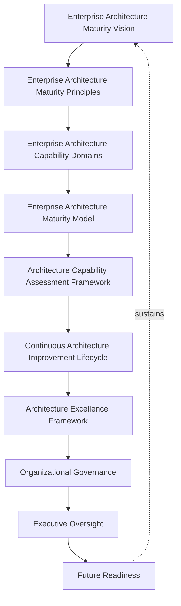
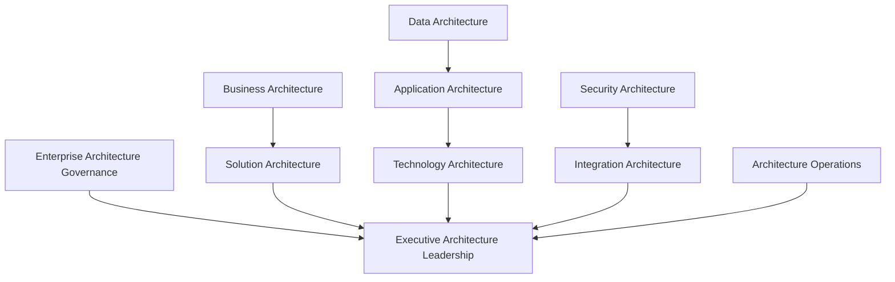
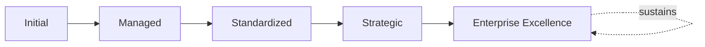
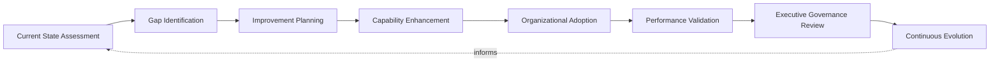
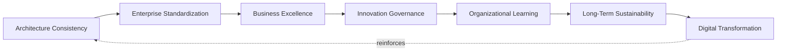
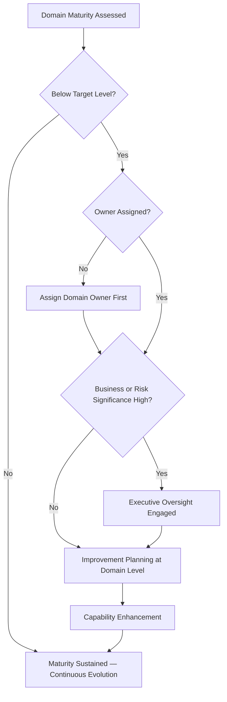

# Enterprise Architecture Maturity Framework

## 1. Executive Summary

**Purpose** — This document defines the official Enterprise Architecture Maturity Framework for **StackLeo Tech Store**. It establishes enterprise architecture capability evolution, governance maturity, business-technology alignment, architecture excellence, organizational accountability, executive oversight, continuous improvement, and long-term architectural sustainability as a single, consolidated maturity lens spanning every domain governed across `03_System_Design`'s governance documents. It consolidates the individual maturity models already defined within `enterprise-architecture-strategy.md`, `solution-architecture-framework.md`, `technology-governance.md`, `architecture-review-board.md`, and `architecture-decision-records.md` into one coherent, cross-domain picture. It does not restate any domain's operational governance — it is the synthesis that lets leadership ask "how mature is our overall enterprise architecture capability?" and receive one coherent answer.

**Scope** — This framework applies to every capability domain governed across enterprise architecture at StackLeo — enterprise architecture governance, business architecture, solution architecture, data architecture, application architecture, technology architecture, security architecture, integration architecture, architecture operations, and executive architecture leadership — coordinated with every domain-specific governance document referenced throughout.

**Strategic Objectives** — To ensure enterprise architecture capability matures deliberately, not accidentally; that maturity is measured consistently across every domain rather than assessed unevenly; that improvement is prioritized by genuine business-technology alignment and risk; and that executive leadership has one coherent, consolidated view of the organization's overall architectural maturity.

**Business Value** — A consolidated architecture maturity framework protects architectural investment from being spent unevenly — heavily matured in one domain while another remains dangerously informal — protects leadership's ability to make proportionate investment decisions across the whole architecture portfolio, and gives the Board confidence that StackLeo's architecture capability is evolving deliberately alongside the business.

**Intended Audience** — The Board of Directors, executive leadership, the Chief Technology Officer, enterprise architecture leadership, enterprise architects, solution architects, engineering leadership, security leadership, operations leadership, product leadership, and business stakeholders.

## 2. Enterprise Architecture Maturity Vision

- **Enterprise Architecture as Strategic Capability** — architectural maturity is governed as a genuine strategic capability, never a static, one-time achievement.
- **Business–Technology Alignment** — architecture capability is expected to genuinely deepen the alignment between business strategy and technology direction.
- **Organizational Agility** — a maturing architecture posture protects the organization's ability to respond quickly to genuine opportunity.
- **Sustainable Digital Transformation** — architecture maturity is pursued as a durable, ongoing discipline supporting genuine digital transformation, never a one-time modernization project.
- **Architecture Excellence** — architecture maturity is the organization's demonstrable evidence that its technology foundation is genuinely sound.
- **Long-Term Enterprise Evolution** — architecture maturity is governed to compound over time into genuine, sustained enterprise evolution.
- **Continuous Organizational Learning** — real architectural outcomes are genuinely converted into improved practice across the whole organization.

*Diagram 1: Enterprise Architecture Maturity Framework — the maturity vision establishes principles and capability domains, flowing through the maturity model, assessment, and improvement lifecycle into the excellence framework, organizational governance, and executive oversight, with future readiness reinforcing the vision itself.*

### Enterprise Architecture Maturity Vision Matrix

| Vision Element | Focus | Business Value |
|---|---|---|
| Enterprise Architecture as Strategic Capability | A genuine capability, not a one-time achievement | Prevents maturity from being treated as a completed project |
| Business–Technology Alignment | Deepening alignment between strategy and technology | Ensures technology investment is directed by business intent |
| Organizational Agility | Protects the ability to respond quickly to opportunity | Protects the business's ability to move quickly when it matters |
| Sustainable Digital Transformation | A durable discipline, not a one-time modernization project | Protects transformation investment from eroding over time |
| Architecture Excellence | Demonstrable evidence the technology foundation is sound | Protects confidence in the platform's structural integrity |
| Long-Term Enterprise Evolution | Maturity compounding into sustained enterprise evolution | Protects the long-term return on architectural investment |
| Continuous Organizational Learning | Real outcomes genuinely converted into improved practice | Converts architectural experience into durable capability |

## 3. Enterprise Architecture Maturity Principles

Enterprise architecture maturity governance at StackLeo rests on nine principles, each producing a specific business outcome.

- **Business Value Orientation** — maturity investment is justified by genuine business value, never technical interest alone. *Business Value:* prevents architectural investment disconnected from genuine business intent.
- **Governance First** — the accountability structure for maturity assessment is established before assessment begins. *Business Value:* ensures maturity claims are genuinely governed, not self-declared.
- **Enterprise Standardization** — maturity is assessed against consistent, governed criteria across every domain. *Business Value:* allows domains to be compared fairly and investment prioritized accordingly.
- **Strategic Alignment** — maturity evolution is paced to genuinely match the business's own strategic direction. *Business Value:* prevents architecture from either lagging behind or over-investing ahead of genuine need.
- **Risk-Aware Decision Making** — maturity investment is prioritized by genuine architectural risk. *Business Value:* directs limited maturity investment toward what genuinely matters most.
- **Continuous Improvement** — architecture capability is expected to genuinely mature over time, never assumed static once initially established. *Business Value:* keeps capability aligned with the organization's growing scale and complexity.
- **Innovation with Governance** — new architectural approaches are embraced deliberately, within a genuinely governed structure. *Business Value:* balances genuine innovation against the risk of ungoverned adoption.
- **Organizational Accountability** — every capability domain traces to a specific, named, responsible owner accountable for its maturity. *Business Value:* ensures no domain drifts without someone genuinely responsible for its evolution.
- **Architecture Sustainability** — maturity is pursued as a genuinely sustainable, long-term discipline, never a short-lived initiative. *Business Value:* protects architectural investment from eroding once initial attention fades.

### Enterprise Architecture Maturity Principles Matrix

| Principle | Description | Business Value |
|---|---|---|
| Business Value Orientation | Justified by genuine business value, not technical interest | Prevents investment disconnected from genuine business intent |
| Governance First | Accountability structure established before assessment begins | Ensures maturity claims are genuinely governed, not self-declared |
| Enterprise Standardization | Assessed against consistent, governed criteria | Allows domains to be compared fairly and prioritized |
| Strategic Alignment | Evolution paced to genuinely match strategic direction | Prevents lagging behind or over-investing ahead of need |
| Risk-Aware Decision Making | Investment prioritized by genuine architectural risk | Directs limited investment toward what genuinely matters most |
| Continuous Improvement | Capability expected to genuinely mature over time | Keeps capability aligned with growing scale and complexity |
| Innovation with Governance | New approaches embraced within a genuinely governed structure | Balances innovation benefit against ungoverned adoption risk |
| Organizational Accountability | Every domain traces to a specific, responsible owner | Ensures no domain drifts without genuine responsibility |
| Architecture Sustainability | Pursued as a genuinely sustainable, long-term discipline | Protects investment from eroding once initial attention fades |

## 4. Enterprise Architecture Capability Domains

Enterprise architecture maturity is governed across ten conceptual capability domains, each consolidating the maturity model already defined within its authoritative governance document.

### Enterprise Architecture Governance

- **Purpose** — assess the maturity of overall enterprise architecture governance coherence.
- **Maturity Expectations** — evaluated against the maturity model defined in `enterprise-architecture-strategy.md` (Section 12).
- **Business Value** — protects the organization's ability to genuinely govern architecture as a coherent discipline.
- **Executive Expectations** — leadership expects architecture governance maturity to be the foundation every other domain builds upon.

### Business Architecture

- **Purpose** — assess the maturity of how business capabilities inform architecture decisions.
- **Maturity Expectations** — evaluated against Business Architecture (`enterprise-architecture-strategy.md`, Section 4).
- **Business Value** — protects confidence that architecture remains genuinely grounded in business reality.
- **Executive Expectations** — leadership expects business architecture maturity to anchor every other domain.

### Solution Architecture

- **Purpose** — assess the maturity of solution-level architecture governance.
- **Maturity Expectations** — evaluated against the maturity model defined in `solution-architecture-framework.md` (Section 13).
- **Business Value** — protects individual solutions from drifting incoherent with the enterprise.
- **Executive Expectations** — leadership expects solution maturity to reflect genuine, evidenced quality.

### Data Architecture

- **Purpose** — assess the maturity of data architecture governance.
- **Maturity Expectations** — evaluated jointly with `04_Database/data-governance.md` and `04_Database/data-quality-framework.md`.
- **Business Value** — protects the trustworthiness and coherence of business data.
- **Executive Expectations** — leadership expects data architecture maturity proportionate to data sensitivity.

### Application Architecture

- **Purpose** — assess the maturity of application architecture governance.
- **Maturity Expectations** — evaluated jointly with `03_System_Design/component-architecture.md` and `03_System_Design/service-architecture.md`.
- **Business Value** — protects the coherence of the software layer customers directly depend on.
- **Executive Expectations** — leadership expects application maturity to remain modular and maintainable as it grows.

### Technology Architecture

- **Purpose** — assess the maturity of technology portfolio governance.
- **Maturity Expectations** — evaluated against the maturity model defined in `technology-governance.md` (Section 14).
- **Business Value** — protects the foundation every other architecture domain ultimately depends on.
- **Executive Expectations** — leadership expects technology maturity to reflect deliberate, not accidental, choices.

### Security Architecture

- **Purpose** — assess the maturity of security architecture governance.
- **Maturity Expectations** — evaluated jointly with `06_Security/security-maturity-framework.md`.
- **Business Value** — protects StackLeo's core trust differentiator through genuinely mature security architecture.
- **Executive Expectations** — leadership expects security architecture maturity to be treated as foundational.

### Integration Architecture

- **Purpose** — assess the maturity of integration architecture governance.
- **Maturity Expectations** — evaluated jointly with `03_System_Design/integration-architecture.md`.
- **Business Value** — protects the coherence of the platform's boundary-crossing interactions.
- **Executive Expectations** — leadership expects integration maturity to remain consistent as partner relationships grow.

### Architecture Operations

- **Purpose** — assess the maturity of how architecture governance is genuinely operated day to day, including decision records and review board practice.
- **Maturity Expectations** — evaluated against the maturity models defined in `architecture-review-board.md` (Section 12) and `architecture-decision-records.md` (Section 12).
- **Business Value** — protects the genuine, ongoing enforcement of architecture governance, not merely its documentation.
- **Executive Expectations** — leadership expects architecture operations maturity to demonstrate genuine, consistent enforcement.

### Executive Architecture Leadership

- **Purpose** — assess the maturity of executive and Board-level engagement with enterprise architecture.
- **Maturity Expectations** — evaluated against Executive Oversight (Section 10).
- **Business Value** — protects the organization's most consequential architecture decisions with genuine leadership attention.
- **Executive Expectations** — leadership expects its own engagement to be measured with the same rigor as any operational domain.

### Enterprise Architecture Capability Matrix

| Domain | Purpose | Business Value | Executive Expectations |
|---|---|---|---|
| Enterprise Architecture Governance | Assess overall governance coherence maturity | Protects the ability to govern architecture as a coherent discipline | Expects governance maturity as the foundation for other domains |
| Business Architecture | Assess maturity of business capabilities informing decisions | Protects confidence architecture remains grounded in business reality | Expects business architecture maturity to anchor other domains |
| Solution Architecture | Assess solution-level architecture governance maturity | Protects solutions from drifting incoherent with the enterprise | Expects maturity reflecting genuine, evidenced quality |
| Data Architecture | Assess data architecture governance maturity | Protects trustworthiness and coherence of business data | Expects maturity proportionate to data sensitivity |
| Application Architecture | Assess application architecture governance maturity | Protects coherence of the software layer depended upon | Expects maturity remaining modular and maintainable |
| Technology Architecture | Assess technology portfolio governance maturity | Protects the foundation every other domain depends on | Expects maturity reflecting deliberate, not accidental, choices |
| Security Architecture | Assess security architecture governance maturity | Protects StackLeo's core trust differentiator | Expects treatment as foundational |
| Integration Architecture | Assess integration architecture governance maturity | Protects coherence of boundary-crossing interactions | Expects consistency as partner relationships grow |
| Architecture Operations | Assess maturity of day-to-day governance operation | Protects genuine, ongoing enforcement of governance | Expects demonstrated genuine, consistent enforcement |
| Executive Architecture Leadership | Assess executive and Board engagement maturity | Protects the most consequential decisions with leadership attention | Expects engagement measured with the same rigor as any domain |

*Diagram 2: Enterprise Architecture Capability Evolution Model — governance and business architecture, solution architecture, data and application and technology architecture, security and integration architecture, and architecture operations all consolidate into executive architecture leadership's overall maturity picture.*

## 5. Enterprise Architecture Maturity Model

Enterprise architecture maturity is described across five conceptual levels, consistent with the maturity models already defined across every domain-specific governance document in `03_System_Design`.

### Level 1: Initial

Architecture, where it exists, is informal and inconsistent across domains. Practice is addressed reactively, ownership is unclear, and no consistent maturity picture exists across the organization.

### Level 2: Managed

Basic governance exists for individual domains, but consistency across the ten domains in Section 4 varies significantly. Some domains may be well-governed while others remain informal.

### Level 3: Standardized

The governance model, domains, and lifecycle are standardized, documented, and consistently applied across the organization. Every domain in Section 4 has a defined, comparable maturity baseline.

### Level 4: Strategic

Architecture decisions across every domain are genuinely and routinely made in deliberate service of business strategy, not technical convenience. Maturity investment is prioritized consistently by genuine business-technology alignment.

### Level 5: Enterprise Excellence

Architecture capability is continuously and deliberately improved based on quantitative evidence and organizational learning across every domain. Improvement itself is a managed, ongoing, enterprise-wide discipline, and StackLeo's architecture capability functions as a genuine, sustained source of enterprise excellence.

### Enterprise Architecture Maturity Level Matrix

| Level | Characteristics | Primary Focus |
|---|---|---|
| Initial | Informal, inconsistent practice; addressed reactively | Ad hoc, individually-dependent architectural practice |
| Managed | Basic governance exists per domain; consistency varies | Domain-level consistency |
| Standardized | Standardized governance model, domains, and lifecycle | Organization-wide consistency and clear ownership |
| Strategic | Decisions genuinely and routinely made in service of strategy | Business-strategy-driven architecture decision-making |
| Enterprise Excellence | Practice continuously improved; capability as enterprise excellence | Sustained, deliberate, enterprise-wide excellence |

*Diagram 6: Enterprise Architecture Maturity Progression — maturity advances from informal, reactively-addressed practice toward standardized, genuinely strategy-driven, and ultimately continuously excellent enterprise-wide architecture capability.*

## 6. Architecture Capability Assessment Framework

- **Capability Assessment** — governs how a domain's current maturity is genuinely evaluated against Section 5's levels.
- **Business Alignment Assessment** — governs how a domain's genuine alignment with business strategy is assessed.
- **Governance Assessment** — governs how a domain's genuine governance coherence is assessed.
- **Risk Assessment** — governs how improvement effort is prioritized by genuine architectural risk.
- **Performance Assessment** — governs the periodic, formal assessment of maturity across every domain in Section 4.
- **Executive Review** — governs the point at which assessed maturity is reviewed with executive leadership.
- **Improvement Planning** — governs how an identified maturity gap is planned for deliberate advancement.

### Architecture Capability Assessment Matrix

| Assessment Area | Focus | Governance Coordination |
|---|---|---|
| Capability Assessment | Evaluating current maturity against defined levels | Enterprise Architecture Maturity Model (Section 5) |
| Business Alignment Assessment | Assessing genuine alignment with business strategy | Strategic Alignment (Section 3) |
| Governance Assessment | Assessing genuine governance coherence | Enterprise Architecture Governance (Section 4) |
| Risk Assessment | Prioritizing effort by genuine architectural risk | Risk-Aware Decision Making (Section 3) |
| Performance Assessment | Periodic, formal assessment across every domain | Enterprise Architecture Capability Domains (Section 4) |
| Executive Review | Reviewing assessed maturity with leadership | Executive Oversight (Section 10) |
| Improvement Planning | Planning deliberate advancement of a gap | Continuous Architecture Improvement Lifecycle (Section 7) |

## 7. Continuous Architecture Improvement Lifecycle

Enterprise architecture maturity improvement operates across eight conceptual stages.

- **Current State Assessment** — govern how a domain's genuine current maturity level is established.
- **Gap Identification** — govern how the genuine distance between current and target maturity is identified.
- **Improvement Planning** — govern how a deliberate plan to close an identified gap is developed.
- **Capability Enhancement** — govern the oversight applied while a capability is genuinely being strengthened.
- **Organizational Adoption** — govern how an enhanced capability is genuinely adopted into organizational practice.
- **Performance Validation** — govern how an enhanced capability is confirmed to genuinely deliver its intended maturity improvement.
- **Executive Governance Review** — govern the periodic, formal review of maturity progress with executive leadership.
- **Continuous Evolution** — govern the periodic reassessment of whether target maturity itself remains aligned with evolving business need.

### Continuous Improvement Lifecycle Matrix

| Stage | Governance Objective | Business Value |
|---|---|---|
| Current State Assessment | Establish a domain's genuine current maturity | Ensures improvement begins from an accurate baseline |
| Gap Identification | Identify the genuine distance to target maturity | Directs improvement effort toward what genuinely matters |
| Improvement Planning | Develop a deliberate plan to close the gap | Converts assessed gap into concrete, actionable steps |
| Capability Enhancement | Apply oversight while a capability is strengthened | Ensures enhancement remains within governed boundaries |
| Organizational Adoption | Adopt an enhanced capability into practice | Ensures investment converts into genuine organizational use |
| Performance Validation | Confirm the enhancement delivers genuine improvement | Protects against declaring maturity progress prematurely |
| Executive Governance Review | Periodically review progress with executive leadership | Confirms improvement investment is genuinely working |
| Continuous Evolution | Reassess whether target maturity remains aligned | Keeps maturity goals genuinely connected to business intent |

*Diagram 3: Continuous Architecture Improvement Lifecycle — current state assessment and gap identification inform improvement planning and capability enhancement, feeding organizational adoption and performance validation, with executive governance review and continuous evolution feeding lessons back into the cycle.*

## 8. Architecture Excellence Framework

- **Business Excellence** — governs whether architecture genuinely delivers a standard of excellence that serves the business.
- **Architecture Consistency** — governs whether architecture remains genuinely consistent across every domain and team.
- **Innovation Governance** — governs whether new architectural approaches are genuinely embraced within a governed structure, coordinated with `technology-governance.md` (Section 9).
- **Organizational Learning** — governs how real architectural experience deepens the organization's genuine collective capability.
- **Enterprise Standardization** — governs whether architectural standards are genuinely applied consistently enterprise-wide.
- **Long-Term Sustainability** — governs whether architecture excellence is pursued as a genuinely sustainable, ongoing discipline.
- **Digital Transformation** — governs how architecture excellence genuinely supports the organization's broader digital transformation.

### Architecture Excellence Matrix

| Excellence Area | Focus | Governance Coordination |
|---|---|---|
| Business Excellence | Genuine standard of excellence serving the business | Business Value Orientation (Section 3) |
| Architecture Consistency | Genuinely consistent across every domain and team | Enterprise Standardization (Section 3) |
| Innovation Governance | New approaches genuinely embraced within a governed structure | `technology-governance.md` (Section 9) |
| Organizational Learning | Real experience deepening genuine collective capability | Continuous Improvement (Section 3) |
| Enterprise Standardization | Standards genuinely applied consistently enterprise-wide | Architecture Consistency (above) |
| Long-Term Sustainability | Excellence pursued as a genuinely sustainable discipline | Architecture Sustainability (Section 3) |
| Digital Transformation | Excellence genuinely supporting broader transformation | Future Readiness (Section 11) |

*Diagram 5: Architecture Excellence Cycle — architecture consistency and enterprise standardization establish business excellence, feeding innovation governance and organizational learning, with long-term sustainability and digital transformation reinforcing consistency.*

## 9. Organizational Governance

Governance accountability is distributed deliberately across eleven organizational roles.

- **Board of Directors** — holds ultimate accountability for StackLeo's overall enterprise architecture maturity trajectory.
- **Executive Leadership** — holds accountability for whether architecture maturity genuinely keeps pace with business growth, in partnership with the Board.
- **Chief Technology Officer** — owns the coherence of this framework's consolidation across every domain-specific maturity model.
- **Enterprise Architecture Leadership** — owns the operational maturity assessment and improvement practice across enterprise architecture.
- **Enterprise Architects** — own Enterprise Architecture Governance and Business Architecture maturity (Section 4) within their accountable scope.
- **Solution Architects** — own Solution Architecture maturity (Section 4) for the solutions they design.
- **Engineering Leadership** — own Application and Technology Architecture maturity (Section 4) within their accountable teams.
- **Security Leadership** — own Security Architecture maturity (Section 4) jointly with `06_Security/security-maturity-framework.md`.
- **Operations Leadership** — own Architecture Operations maturity (Section 4) jointly with `09_Operations/operations-maturity-framework.md`.
- **Product Leadership** — own Business Architecture maturity (Section 4) alignment with genuine product priority.
- **Business Stakeholders** — own Business Alignment Assessment (Section 6) between maturity investment and genuine business priority.

### Organizational Responsibility Matrix

| Role | Governance Objective | Business Value |
|---|---|---|
| Board of Directors | Hold ultimate accountability for overall maturity trajectory | Provides the highest point of ultimate accountability |
| Executive Leadership | Hold accountability for maturity keeping pace with growth | Provides a single point of executive-level accountability |
| Chief Technology Officer | Own coherence of this framework's cross-domain consolidation | Connects the consolidated view to authoritative sources |
| Enterprise Architecture Leadership | Own operational maturity assessment and improvement practice | Applies the framework to day-to-day maturity practice |
| Enterprise Architects | Own governance and business architecture maturity | Embeds accountability at the enterprise-wide level |
| Solution Architects | Own solution architecture maturity for their designs | Embeds accountability closest to where solutions are built |
| Engineering Leadership | Own application and technology architecture maturity | Embeds accountability closest to where these domains are built |
| Security Leadership | Own security architecture maturity jointly with security maturity | Ensures security maturity is genuinely coordinated |
| Operations Leadership | Own architecture operations maturity jointly with operations maturity | Ensures operations maturity is genuinely coordinated |
| Product Leadership | Own business architecture maturity alignment | Ensures maturity reflects genuine product priority |
| Business Stakeholders | Own business alignment of maturity investment | Connects maturity investment to genuine business priority |

*Diagram 4: Enterprise Architecture Governance Structure — a domain's assessed maturity is checked against target level, escalating to executive oversight for high business or risk significance, resolving into improvement planning, capability enhancement, and sustained continuous evolution.*

## 10. Executive Oversight

- **Enterprise Architecture Maturity Reviews** — the overall maturity picture across every domain in Section 4 is formally reviewed with executive leadership on a regular cadence.
- **Strategic Alignment Reviews** — the alignment of architecture maturity investment with genuine business strategy is reviewed directly with executive leadership.
- **Architecture Capability Reviews** — the genuine capability of each architecture domain is reviewed as a distinct, ongoing concern.
- **Governance Reviews** — the framework's own governance model, domains, and lifecycle are periodically reassessed for continued fitness.
- **Risk Reviews** — the organization's genuine architectural risk posture, informed by maturity assessment, is reviewed directly with executive leadership.
- **Continuous Improvement Reviews** — the organization's follow-through on captured maturity improvement lessons is reviewed directly with executive leadership.

### Executive Oversight Matrix

| Oversight Mechanism | Purpose | Governance Role |
|---|---|---|
| Enterprise Architecture Maturity Reviews | Review overall maturity picture across every domain | Regular, predictable cadence for the framework as a whole |
| Strategic Alignment Reviews | Review investment alignment with business strategy | Direct executive-level strategic alignment review |
| Architecture Capability Reviews | Review genuine capability of each architecture domain | Treats capability as ongoing, not assumed |
| Governance Reviews | Reassess the governance model itself for continued fitness | Applies to Sections 4–9 of this framework |
| Risk Reviews | Review genuine architectural risk posture | Direct executive-level review of risk exposure |
| Continuous Improvement Reviews | Review follow-through on captured lessons | Direct executive-level review of improvement completion |

## 11. Future Readiness

This framework is designed to remain valid as StackLeo evolves in scale, geography, and organizational complexity.

- **AI-Driven Enterprise Architecture** — as capability assessment increasingly incorporates AI-assisted methods, coordinated with `04_Database/ai-governance.md`, it remains governed under Performance Assessment (Section 6) at the same rigor as any other method.
- **Intelligent Governance Models** — where governance assessment increasingly draws on intelligent pattern analysis, that analysis remains subject to the same Governance Assessment (Section 6) as any other method.
- **Adaptive Enterprise Architecture** — where architecture increasingly adapts its own structure to changing demand, that capability remains governed under Technology Architecture (Section 4) at the same rigor as any other domain.
- **Composable Enterprise Platforms** — where architecture increasingly assembles from genuinely reusable, composable capability, that approach remains governed under Enterprise Standardization (Section 3) at the same rigor as any other principle.
- **Digital Enterprise Evolution** — Capability Assessment and Business Alignment Assessment (Section 6) are structured to be re-applied as StackLeo expands from Bangladesh into South Asia and global markets, each with genuinely distinct architectural considerations.
- **Sustainable Innovation Governance** — new architectural capability is adopted only in a manner consistent with this framework's principles (Section 3), never at their expense.

## 12. Enterprise Architecture Anti-Patterns

- **Architecture Without Governance** — pursuing architecture maturity without genuine connection to governing frameworks produces effort without coherent purpose.
- **Business–Technology Misalignment** — allowing architecture to drift from genuine business strategy wastes investment on what does not genuinely matter.
- **Siloed Architecture** — governing maturity independently by team, without genuine cross-domain coordination, prevents one coherent enterprise picture.
- **Weak Executive Sponsorship** — leadership disengaged from maturity oversight undermines the accountability this entire framework depends on.
- **Excessive Complexity** — architecture more complex than genuine requirements justify burdens every team that must work within it.
- **Ignoring Technical Debt** — allowing deferred architectural decisions to accumulate unaddressed guarantees a genuine, compounding future burden.
- **Static Architecture** — treating architecture as permanently finished forfeits the ability to evolve alongside genuine business need.
- **No Continuous Improvement** — treating current maturity as permanently finished guarantees it falls behind the organization's growing scale and complexity.

### Anti-Pattern Summary

| Anti-Pattern | Organizational & Business Impact |
|---|---|
| Architecture Without Governance | Produces maturity effort without coherent, governed purpose |
| Business–Technology Misalignment | Wastes investment on what does not genuinely matter |
| Siloed Architecture | Prevents one coherent, organization-wide maturity picture |
| Weak Executive Sponsorship | Undermines the accountability this entire framework depends on |
| Excessive Complexity | Burdens every team that must work within the architecture |
| Ignoring Technical Debt | Guarantees a genuine, compounding future burden |
| Static Architecture | Forfeits the ability to evolve alongside genuine business need |
| No Continuous Improvement | Guarantees maturity falls behind growing scale and complexity |

## Related Documents

| Document | Relationship |
|---|---|
| `enterprise-architecture-strategy.md` | Provides the domain-specific maturity model (Section 12) this framework's Enterprise Architecture Governance (Section 4) consolidates. |
| `architecture-principles.md` | The normative, engineering-facing reference this framework's maturity assessment is ultimately evaluated against. |
| `solution-architecture-framework.md` | Provides the domain-specific maturity model (Section 13) this framework's Solution Architecture (Section 4) consolidates. |
| `technology-governance.md` | Provides the domain-specific maturity model (Section 14) this framework's Technology Architecture (Section 4) consolidates. |
| `architecture-review-board.md` | Provides the domain-specific maturity model (Section 12) this framework's Architecture Operations (Section 4) consolidates. |
| `architecture-decision-records.md` | Provides the domain-specific maturity model (Section 12) this framework's Architecture Operations (Section 4) consolidates. |
| `06_Security/security-maturity-framework.md` | The analogous consolidated maturity framework for the security domain, coordinated with this framework's Security Architecture (Section 4). |
| `09_Operations/operations-maturity-framework.md` | The analogous consolidated maturity framework for the operations domain, coordinated with this framework's Architecture Operations (Section 4). |

## Document Information

| Property | Value |
|----------|-------|
| Document | architecture-maturity-framework.md |
| Version | 1.0.0 |
| Status | Active |
| Maintained By | StackLeo |
| Last Updated | 2026-07-29 |

---

© StackLeo. All Rights Reserved.
