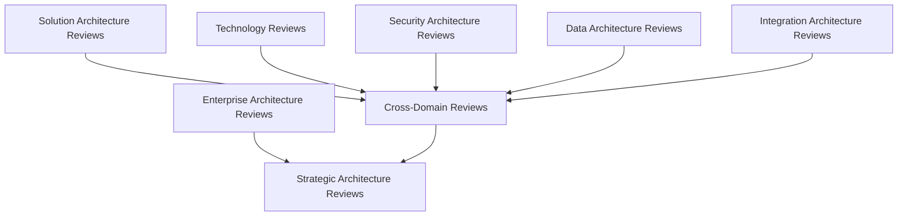
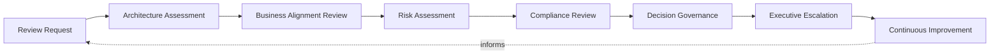
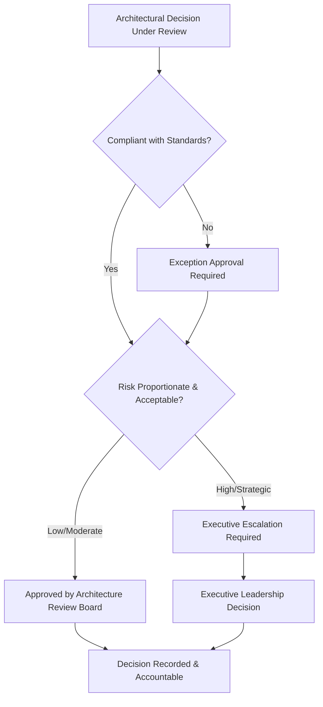
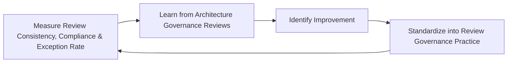
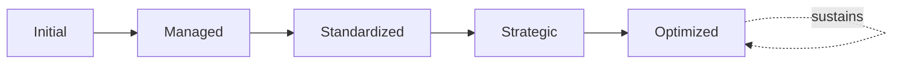

# Enterprise Architecture Review Board Framework

## 1. Executive Summary

**Purpose** — This document defines the official Enterprise Architecture Review Board (ARB) Framework for **StackLeo Tech Store**. It establishes architecture governance, review governance, decision authority, compliance oversight, exception management, organizational accountability, executive oversight, and long-term review board maturity as a deliberate, accountable enterprise discipline. `enterprise-architecture-strategy.md`, `solution-architecture-framework.md`, and `technology-governance.md` each anticipated this framework directly as the formal governance body their Governance Review, Architecture Review, and Standards Approval stages depend on. This framework does not restate any of their domain content. It is the dedicated governance treatment of the review body itself — its authority, decision rights, compliance oversight, and exception management — that makes architecture, solution, and technology review genuinely enforceable rather than aspirational.

**Scope** — This framework applies to every category of architecture review at StackLeo — enterprise architecture, solution architecture, technology, security architecture, data architecture, integration architecture, cross-domain, and strategic architecture reviews — coordinated with `enterprise-architecture-strategy.md`, `solution-architecture-framework.md`, `technology-governance.md`, `security-strategy.md`, and `compliance-governance.md`.

**Strategic Objectives** — To ensure architecture decisions are reviewed consistently, by an accountable body with genuine decision authority, never left to informal or ad hoc approval; that a review's outcome is grounded in genuine evidence, not opinion; that exceptions to standard architecture are deliberately justified and time-bound, never silently permanent; and that executive leadership has continuous, honest visibility into the organization's architecture governance posture.

**Business Value** — A governed architecture review board protects the organization from the disproportionate cost of an architectural decision made without genuine scrutiny, protects the coherence of the enterprise architecture strategy every review decision either upholds or erodes, and gives leadership confidence that architecture governance is genuinely enforced, not merely documented.

**Intended Audience** — The Board of Directors, executive leadership, the Chief Technology Officer, the Enterprise Architecture Board, enterprise architects, solution architects, engineering leadership, security leadership, product leadership, and business stakeholders.

## 2. Enterprise Architecture Review Vision

- **Architecture Governance as Strategic Capability** — architecture review is governed as a genuine strategic capability, never a procedural formality.
- **Consistent Enterprise Decision Making** — architecture decisions are reviewed against the same standards regardless of team or domain.
- **Business Alignment** — every review confirms a decision's genuine alignment with business strategy, not only its technical soundness.
- **Technology Quality** — review protects the genuine quality of every architectural and technology decision that passes through it.
- **Risk Reduction** — review exists to genuinely reduce the organization's exposure to avoidable architectural risk.
- **Organizational Accountability** — every review decision traces to a genuinely accountable body, never an anonymous or informal approval.
- **Long-Term Enterprise Sustainability** — review protects the coherence and sustainability of the enterprise architecture over time.

### Enterprise Architecture Review Vision Matrix

| Vision Element | Focus | Business Value |
|---|---|---|
| Architecture Governance as Strategic Capability | A genuine strategic capability, not a procedural formality | Prevents review from being treated as a low-value checkbox |
| Consistent Enterprise Decision Making | Same standards regardless of team or domain | Reduces variance that undermines genuine architectural coherence |
| Business Alignment | Confirms genuine alignment with business strategy | Ensures architecture decisions serve genuine business intent |
| Technology Quality | Protects the genuine quality of every decision | Protects the organization from avoidable technical shortfall |
| Risk Reduction | Genuinely reduces exposure to avoidable risk | Directs scrutiny toward what genuinely matters most |
| Organizational Accountability | Every decision traces to a genuinely accountable body | Ensures decisions can be genuinely defended |
| Long-Term Enterprise Sustainability | Protects coherence of the architecture over time | Protects the platform's ability to evolve confidently |

## 3. Architecture Review Principles

Architecture review governance at StackLeo rests on nine principles, each producing a specific business outcome.

- **Business Value First** — a review's central question is whether a decision genuinely serves business value, not only whether it is technically sound. *Business Value:* keeps review connected to genuine business intent.
- **Independent Governance** — the review body evaluates a decision with genuine independence from the team proposing it. *Business Value:* protects review integrity from being compromised by proposer self-interest.
- **Evidence-Based Decisions** — a review decision is grounded in genuine, documented evidence, not impression. *Business Value:* protects the credibility and defensibility of every review outcome.
- **Transparency** — review criteria, decisions, and rationale are documented and visible to those who genuinely need them. *Business Value:* allows review outcomes to be scrutinized and defended, not merely trusted on faith.
- **Accountability** — every review decision traces to the specific, accountable body or person who made it. *Business Value:* ensures decisions can be genuinely defended, not merely assumed reasonable.
- **Consistency** — review criteria are applied consistently across every domain and team. *Business Value:* prevents the same proposal receiving different treatment depending on who reviews it.
- **Risk Awareness** — a review weighs a decision's genuine risk proportionate to its consequence. *Business Value:* directs review scrutiny toward what genuinely matters most.
- **Continuous Improvement** — review practice matures over time, informed by real review and outcome data. *Business Value:* keeps review aligned with the organization's growing scale and complexity.
- **Enterprise Standardization** — review decisions reinforce, rather than erode, the organization's genuine architectural standards. *Business Value:* protects the coherence every other architecture governance document depends on.

### Architecture Review Principles Matrix

| Principle | Description | Business Value |
|---|---|---|
| Business Value First | Central question is genuine business value, not only soundness | Keeps review connected to genuine business intent |
| Independent Governance | Evaluated with genuine independence from the proposer | Protects integrity from proposer self-interest |
| Evidence-Based Decisions | Grounded in genuine, documented evidence | Protects credibility and defensibility of outcomes |
| Transparency | Criteria, decisions, and rationale documented and visible | Allows outcomes to be scrutinized and defended |
| Accountability | Every decision traces to the accountable body or person | Ensures decisions can be genuinely defended |
| Consistency | Criteria applied consistently across domains and teams | Prevents inconsistent treatment by reviewer |
| Risk Awareness | Weighs genuine risk proportionate to consequence | Directs scrutiny toward what genuinely matters most |
| Continuous Improvement | Practice matures from real review and outcome data | Keeps review aligned with growing scale and complexity |
| Enterprise Standardization | Reinforces, rather than erodes, architectural standards | Protects the coherence every governance document depends on |

## 4. Architecture Review Board Governance Model

Architecture review operates across eight conceptual categories, each holding accountability for a distinct review scope.

### Enterprise Architecture Reviews

- **Purpose** — govern review of decisions affecting the overall enterprise architecture.
- **Governance Scope** — coordinated with `enterprise-architecture-strategy.md` (Section 6, Governance Review).
- **Business Value** — protects the coherence of the enterprise's overall architectural direction.
- **Executive Expectations** — leadership expects enterprise architecture reviews to be held to the highest rigor in this model.

### Solution Architecture Reviews

- **Purpose** — govern review of a specific solution's architecture.
- **Governance Scope** — coordinated with `solution-architecture-framework.md` (Section 8, Solution Review Governance).
- **Business Value** — protects individual solutions from drifting incoherent with the broader enterprise architecture.
- **Executive Expectations** — leadership expects every solution to pass genuine review before adoption.

### Technology Reviews

- **Purpose** — govern review of a candidate or standardized technology decision.
- **Governance Scope** — coordinated with `technology-governance.md` (Section 6, Technology Standards Governance).
- **Business Value** — protects the coherence of the organization's technology portfolio.
- **Executive Expectations** — leadership expects technology decisions to be reviewed before genuine enterprise adoption.

### Security Architecture Reviews

- **Purpose** — govern review of a decision's security architecture implications, jointly with, and never superseding, `security-strategy.md`.
- **Governance Scope** — coordinated with `06_Security/security-architecture.md`.
- **Business Value** — protects StackLeo's core trust differentiator through genuine security scrutiny.
- **Executive Expectations** — leadership expects security architecture review to be treated as mandatory, non-negotiable.

### Data Architecture Reviews

- **Purpose** — govern review of a decision's data architecture implications.
- **Governance Scope** — coordinated with `04_Database/data-governance.md`.
- **Business Value** — protects the trustworthiness and coherence of the data every business decision depends on.
- **Executive Expectations** — leadership expects data architecture review to be proportionate to genuine data sensitivity.

### Integration Architecture Reviews

- **Purpose** — govern review of a decision's integration architecture implications.
- **Governance Scope** — coordinated with `03_System_Design/integration-architecture.md`.
- **Business Value** — protects the coherence of the platform's boundary-crossing interactions.
- **Executive Expectations** — leadership expects integration review to remain consistent as partner relationships grow.

### Cross-Domain Reviews

- **Purpose** — govern review of a decision spanning multiple architecture domains simultaneously.
- **Governance Scope** — coordinated with Cross-Domain Architecture Alignment (`solution-architecture-framework.md`, Section 7).
- **Business Value** — protects against a decision's cross-domain consequence going unexamined by a single-domain review.
- **Executive Expectations** — leadership expects cross-domain reviews to converge every affected domain's perspective.

### Strategic Architecture Reviews

- **Purpose** — govern review of the organization's most consequential, strategically significant architectural decisions.
- **Governance Scope** — oversight exclusively accountable for converging every category above into executive-relevant strategic review.
- **Business Value** — protects leadership's ability to review the architecture decisions that matter most to the business.
- **Executive Expectations** — leadership expects direct engagement in strategic architecture reviews, not merely notification.

### Architecture Review Governance Matrix

| Domain | Purpose | Business Value | Executive Expectations |
|---|---|---|---|
| Enterprise Architecture Reviews | Govern review of overall enterprise architecture decisions | Protects coherence of the enterprise's architectural direction | Expects the highest rigor in this model |
| Solution Architecture Reviews | Govern review of a specific solution's architecture | Protects solutions from drifting incoherent with the enterprise | Expects every solution to pass genuine review |
| Technology Reviews | Govern review of a candidate or standardized technology | Protects the coherence of the technology portfolio | Expects review before genuine enterprise adoption |
| Security Architecture Reviews | Govern review of security architecture implications | Protects StackLeo's core trust differentiator | Expects treatment as mandatory, non-negotiable |
| Data Architecture Reviews | Govern review of data architecture implications | Protects trustworthiness and coherence of business data | Expects proportionality to genuine data sensitivity |
| Integration Architecture Reviews | Govern review of integration architecture implications | Protects coherence of boundary-crossing interactions | Expects consistency as partner relationships grow |
| Cross-Domain Reviews | Govern review spanning multiple domains simultaneously | Protects against unexamined cross-domain consequence | Expects convergence of every affected domain's perspective |
| Strategic Architecture Reviews | Synthesize the most consequential decisions for review | Protects leadership's ability to review what matters most | Expects direct engagement, not merely notification |

*Diagram 1: Enterprise Architecture Review Board Framework — enterprise architecture reviews feed strategic architecture reviews directly, while solution, technology, security, data, and integration reviews converge into cross-domain reviews, which likewise resolve into strategic architecture review.*

## 5. Architecture Review Lifecycle

Architecture review governance operates across eight conceptual lifecycle stages.

- **Review Request** — govern how a genuine review need is formally submitted to the review body.
- **Architecture Assessment** — govern how a submitted decision's architectural soundness is genuinely assessed.
- **Business Alignment Review** — govern how a decision's genuine alignment with business strategy is confirmed.
- **Risk Assessment** — govern how a decision's genuine risk is evaluated proportionate to its consequence.
- **Compliance Review** — govern how a decision's adherence to established architecture standards is confirmed.
- **Decision Governance** — govern how the review body reaches and records a genuine, accountable decision.
- **Executive Escalation** — govern the point at which a decision requires executive-level involvement.
- **Continuous Improvement** — govern how review practice is deliberately strengthened based on real outcomes.

### Review Lifecycle Matrix

| Stage | Governance Objective | Business Value |
|---|---|---|
| Review Request | Formally submit a genuine review need | Ensures review effort is deliberately directed |
| Architecture Assessment | Genuinely assess architectural soundness | Protects against an unsound decision proceeding unexamined |
| Business Alignment Review | Confirm genuine alignment with business strategy | Keeps review connected to genuine business intent |
| Risk Assessment | Evaluate genuine risk proportionate to consequence | Directs scrutiny toward what genuinely matters most |
| Compliance Review | Confirm adherence to established standards | Protects the coherence architecture standards depend on |
| Decision Governance | Reach and record a genuine, accountable decision | Ensures decisions can be genuinely defended |
| Executive Escalation | Elevate decisions requiring executive involvement | Engages leadership exactly when genuinely warranted |
| Continuous Improvement | Strengthen practice from real outcomes | Keeps review practice compounding in capability |

*Diagram 3: Architecture Review Lifecycle — review request and architecture assessment inform business alignment and risk assessment, feeding compliance review and decision governance, with executive escalation and continuous improvement feeding lessons back into the cycle.*

## 6. Decision Authority Framework

- **Strategic Decisions** — governs who genuinely holds authority over the organization's most consequential architectural decisions.
- **Standards Compliance** — governs who genuinely holds authority to confirm a decision's adherence to established standards.
- **Exception Approval** — governs who genuinely holds authority to approve a deviation from standard architecture.
- **Risk Acceptance** — governs who genuinely holds authority to accept a decision's residual architectural risk.
- **Business Alignment** — governs who genuinely holds authority to confirm a decision's business alignment.
- **Executive Escalation** — governs the threshold at which decision authority genuinely shifts to executive leadership.
- **Accountability** — governs how every decision authority holder remains genuinely traceable and answerable for their decisions.

### Decision Authority Matrix

| Authority Area | Focus | Governance Coordination |
|---|---|---|
| Strategic Decisions | Authority over the most consequential decisions | Strategic Architecture Reviews (Section 4) |
| Standards Compliance | Authority to confirm adherence to standards | `technology-governance.md` (Section 6) |
| Exception Approval | Authority to approve a deviation from standard architecture | Exception Governance (Section 8) |
| Risk Acceptance | Authority to accept residual architectural risk | Risk Assessment (Section 5) |
| Business Alignment | Authority to confirm genuine business alignment | Business Alignment Review (Section 5) |
| Executive Escalation | Threshold at which authority shifts to executive leadership | Executive Oversight (Section 10) |
| Accountability | Every authority holder remaining traceable and answerable | Accountability (Section 3) |

*Diagram 4: Decision Authority Structure — a decision under review is checked for standards compliance, routed through exception approval where it deviates, weighed for proportionate risk, and resolved at the board or executive level according to its genuine significance, with every outcome recorded and accountable.*

## 7. Architecture Compliance Governance

- **Compliance Expectations** — governs the genuine standard every architectural decision is expected to meet before adoption.
- **Review Consistency** — governs how compliance is confirmed consistently across every review category in Section 4.
- **Exception Governance** — governs how a genuine, justified deviation is reviewed, coordinated with Section 8.
- **Organizational Accountability** — governs how compliance responsibility traces to a specific, accountable party.
- **Improvement Recommendations** — governs how a review's findings genuinely inform future architectural practice.
- **Continuous Compliance** — governs how compliance is confirmed on an ongoing basis, never assumed to persist after a single review.

### Compliance Governance Matrix

| Governance Area | Focus | Coordination |
|---|---|---|
| Compliance Expectations | The genuine standard a decision must meet | Enterprise Standardization (Section 3) |
| Review Consistency | Compliance confirmed consistently across categories | Architecture Review Governance Matrix (Section 4) |
| Exception Governance | Genuine, justified deviations reviewed | Exception Governance (Section 8) |
| Organizational Accountability | Responsibility traces to a specific, accountable party | Organizational Governance (Section 9) |
| Improvement Recommendations | Findings genuinely informing future practice | Continuous Improvement (Section 5) |
| Continuous Compliance | Confirmed on an ongoing basis, never assumed | Compliance Review (Section 5) |

## 8. Exception Governance

- **Exception Identification** — governs how a genuine need to deviate from standard architecture is recognized.
- **Business Justification** — governs how an identified exception's genuine business rationale is documented.
- **Risk Evaluation** — governs how an exception's genuine risk is evaluated before approval.
- **Approval Authority** — governs who genuinely holds authority to approve a specific exception, proportionate to its risk.
- **Review Period** — governs the genuine, bounded duration for which an exception remains valid.
- **Exception Retirement** — governs how an exception is deliberately closed once its justification no longer applies.
- **Organizational Learning** — governs how understanding gained from an exception deepens the organization's genuine collective capability.

### Exception Governance Matrix

| Governance Area | Focus | Coordination |
|---|---|---|
| Exception Identification | Recognizing a genuine need to deviate | Compliance Review (Section 5) |
| Business Justification | Documenting the genuine business rationale | Business Value First (Section 3) |
| Risk Evaluation | Evaluating genuine risk before approval | Risk Assessment (Section 5) |
| Approval Authority | Authority proportionate to the exception's risk | Decision Authority Framework (Section 6) |
| Review Period | A genuine, bounded duration of validity | Continuous Compliance (Section 7) |
| Exception Retirement | Deliberate closure once justification no longer applies | Continuous Improvement (Section 5) |
| Organizational Learning | Understanding deepening genuine collective capability | Organizational Learning coordinated with Section 11 |

## 9. Organizational Governance

Governance accountability is distributed deliberately across ten organizational roles.

- **Board of Directors** — holds ultimate accountability for whether StackLeo's architecture governance genuinely protects enterprise coherence.
- **Executive Leadership** — holds accountability for whether review decisions genuinely serve the business, in partnership with the Board.
- **Chief Technology Officer** — owns the coherence and enforcement of this framework across every review category and governance layer it defines.
- **Enterprise Architecture Board** — owns the operational execution of Architecture Review Lifecycle (Section 5) and Decision Authority (Section 6).
- **Enterprise Architects** — own Enterprise and Strategic Architecture Reviews (Section 4) within their accountable scope.
- **Solution Architects** — own Solution Architecture Reviews (Section 4) for the solutions they design.
- **Engineering Leadership** — own Technology and Integration Architecture Reviews (Section 4) within their accountable teams.
- **Security Leadership** — own Security Architecture Reviews (Section 4) jointly with `security-strategy.md`.
- **Product Leadership** — own the business alignment perspective within Cross-Domain Reviews (Section 4).
- **Business Stakeholders** — own Business Alignment Review (Section 5) input for decisions affecting their domain.

### Organizational Responsibility Matrix

| Role | Governance Objective | Business Value |
|---|---|---|
| Board of Directors | Hold ultimate accountability for architecture governance | Provides the highest point of ultimate accountability |
| Executive Leadership | Hold accountability for review decisions serving the business | Provides a single point of executive-level accountability |
| Chief Technology Officer | Own coherence and enforcement of this framework | Provides a single point of specialist accountability |
| Enterprise Architecture Board | Own operational execution of lifecycle and decision authority | Provides a dedicated, cross-functional review body |
| Enterprise Architects | Own enterprise and strategic architecture reviews | Embeds accountability at the enterprise-wide level |
| Solution Architects | Own solution architecture reviews for their designs | Embeds accountability closest to where solutions are built |
| Engineering Leadership | Own technology and integration architecture reviews | Embeds accountability closest to where technology is used |
| Security Leadership | Own security architecture reviews jointly with security strategy | Ensures architecture is never a novel, ungoverned attack surface |
| Product Leadership | Own the business alignment perspective in cross-domain reviews | Ensures reviews reflect genuine product and customer priority |
| Business Stakeholders | Own business alignment input for decisions in their domain | Connects review to genuine business relevance |

## 10. Executive Oversight

- **Architecture Governance Reviews** — the overall coherence of this framework is formally reviewed on a regular cadence.
- **Compliance Reviews** — the organization's genuine adherence to architecture standards is reviewed directly with executive leadership.
- **Strategic Architecture Reviews** — the most consequential architectural decisions are reviewed directly with executive leadership.
- **Exception Reviews** — the organization's active exceptions are reviewed for continued genuine justification.
- **Risk Reviews** — architecture review risk posture is reviewed directly with executive leadership.
- **Continuous Improvement Reviews** — the organization's follow-through on captured review governance lessons is reviewed directly with executive leadership.

### Executive Oversight Matrix

| Oversight Mechanism | Purpose | Governance Role |
|---|---|---|
| Architecture Governance Reviews | Confirm overall framework coherence | Regular, predictable cadence for the framework as a whole |
| Compliance Reviews | Review genuine adherence to architecture standards | Direct executive-level compliance review |
| Strategic Architecture Reviews | Review the most consequential decisions | Direct executive-level review of strategic decisions |
| Exception Reviews | Review active exceptions for continued justification | Prevents an exception from silently becoming permanent |
| Risk Reviews | Review architecture review risk posture | Direct executive-level review of risk exposure |
| Continuous Improvement Reviews | Review follow-through on captured lessons | Direct executive-level review of improvement completion |

## 11. Future Readiness

This framework is designed to remain valid as StackLeo evolves in scale, geography, and organizational complexity.

- **AI-Assisted Architecture Reviews** — as architecture assessment increasingly incorporates AI-assisted methods, coordinated with `04_Database/ai-governance.md`, it remains governed under Architecture Assessment (Section 5) at the same rigor as any other method.
- **Intelligent Governance Support** — where decision governance increasingly draws on intelligent pattern analysis, that analysis remains subject to the same Decision Governance (Section 5) as any other method.
- **Automated Compliance Insights (Conceptual)** — where automation increasingly performs steps within compliance review, that automation remains subject to the same ownership and executive oversight as any human-performed activity.
- **Adaptive Review Governance** — where review criteria increasingly adapt to genuinely changing architectural conditions, that evolution remains governed under Continuous Improvement (Section 5) at the same rigor as any other method.
- **Enterprise-Scale Architecture Governance** — the governance model, domains, and lifecycle defined throughout this framework are defined independently of organizational size.
- **Continuous Digital Transformation** — this framework's governance discipline is treated as a direct, durable contributor to the platform's ability to evolve confidently over time.

## 12. Architecture Review Board Maturity Model

Architecture review board governance maturity is described across five conceptual levels.

- **Initial** — review, where it exists, is informal and inconsistent; decisions are approved reactively, and ownership is unclear.
- **Managed** — basic review governance exists for individual categories, but consistency across the eight categories in Section 4 varies significantly.
- **Standardized** — the governance model, categories, and lifecycle are standardized, documented, and consistently applied across the organization.
- **Strategic** — review decisions are genuinely and routinely made in deliberate service of business strategy, not procedural convenience.
- **Optimized** — architecture review governance is continuously and deliberately improved based on quantitative evidence and organizational learning; improvement itself is a managed, ongoing discipline.

### Architecture Review Board Maturity Matrix

| Level | Characteristics | Primary Focus |
|---|---|---|
| Initial | Informal, inconsistent review; decisions approved reactively | Ad hoc, individually-dependent review practice |
| Managed | Basic governance exists per category; consistency varies | Category-level consistency |
| Standardized | Standardized governance model, categories, and lifecycle | Organization-wide consistency and clear ownership |
| Strategic | Decisions genuinely and routinely made in service of strategy | Business-strategy-driven review decision-making |
| Optimized | Practice continuously and deliberately improved from evidence | Sustained, deliberate improvement as a discipline |

*Diagram 5: Continuous Architecture Review Improvement Cycle — review consistency, compliance, and exception rate are measured, learned from, improved upon, and standardized back into governed practice, on a continuing basis.*

*Diagram 6: Architecture Review Board Maturity Progression — maturity advances from informal, reactively-approved review practice toward standardized, genuinely strategy-driven, and continuously optimized architecture review board governance.*

## 13. Architecture Review Board Anti-Patterns

- **Reviews Without Standards** — conducting review without genuine, established standards to evaluate against produces inconsistent, indefensible outcomes.
- **Architecture Without Governance** — allowing architectural decisions to proceed without genuine review accepts avoidable exposure without an accountable decision.
- **Rubber-Stamp Approvals** — approving a decision without genuine, independent scrutiny defeats the purpose review exists to serve.
- **Weak Decision Authority** — a review body without genuine authority to enforce its decisions provides governance in name only.
- **Excessive Bureaucracy** — review process disproportionate to a decision's genuine risk burdens teams without corresponding benefit.
- **Ignoring Business Context** — evaluating a decision purely on technical merit, without genuine business alignment review, misjudges its true value.
- **Poor Exception Management** — allowing an exception to persist without genuine review lets a temporary deviation become a permanent, ungoverned gap.
- **No Continuous Improvement** — treating current review practice as permanently finished guarantees it falls behind the organization's growing scale and complexity.

### Anti-Pattern Summary

| Anti-Pattern | Organizational & Business Impact |
|---|---|
| Reviews Without Standards | Produces inconsistent, indefensible review outcomes |
| Architecture Without Governance | Accepts avoidable exposure without an accountable decision |
| Rubber-Stamp Approvals | Defeats the genuine purpose review exists to serve |
| Weak Decision Authority | Provides governance in name only |
| Excessive Bureaucracy | Burdens teams disproportionate to genuine risk |
| Ignoring Business Context | Misjudges a decision's true value by technical merit alone |
| Poor Exception Management | Lets a temporary deviation become a permanent, ungoverned gap |
| No Continuous Improvement | Guarantees practice falls behind growing scale and complexity |

## Related Documents

| Document | Relationship |
|---|---|
| `enterprise-architecture-strategy.md` | Anticipated this framework by name; this framework provides the formal review body its Governance Review (Section 6) depends on. |
| `architecture-principles.md` | The normative, engineering-facing reference this framework's Architecture Assessment (Section 5) evaluates decisions against. |
| `solution-architecture-framework.md` | Anticipated this framework by name; consumes this framework's Solution Architecture Reviews (Section 4) for Solution Review Governance. |
| `technology-governance.md` | Anticipated this framework by name; consumes this framework's Technology Reviews (Section 4) for Standards Approval. |
| `architecture-decisions.md` | Elaborates the specific decision record this framework's Decision Governance (Section 5) formalizes. |
| `architecture-decision-records.md` | Governs the ownership, traceability, and knowledge management discipline behind this framework's reviewed decisions. |
| `architecture-maturity-framework.md` | Consolidates this framework's Architecture Review Board Maturity Model (Section 12) into the enterprise-wide architecture maturity picture. |
| `security-strategy.md` | Sets the enterprise-wide security strategic direction this framework's Security Architecture Reviews (Section 4) coordinate with. |
| `06_Security/compliance-governance.md` | Elaborates the compliance discipline this framework's Architecture Compliance Governance (Section 7) coordinates with. |

## Document Information

| Property | Value |
|----------|-------|
| Document | architecture-review-board.md |
| Version | 1.0.0 |
| Status | Active |
| Maintained By | StackLeo |
| Last Updated | 2026-07-29 |

---

© StackLeo. All Rights Reserved.
