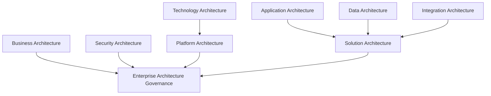
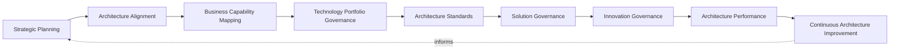
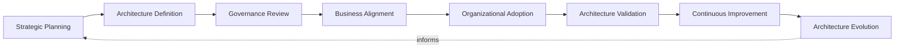
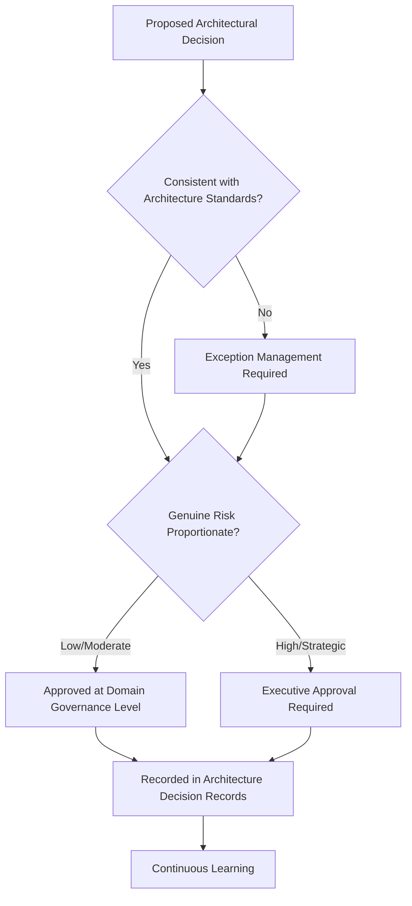
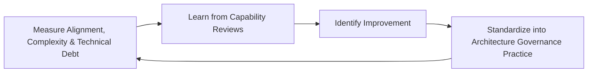
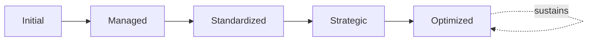

# Enterprise Architecture Strategy Framework

## 1. Executive Summary

**Purpose** — This document defines the official Enterprise Architecture Strategy Framework for **StackLeo Tech Store**. It establishes enterprise architecture vision, governance, business-technology alignment, architectural principles, organizational accountability, executive oversight, continuous evolution, and long-term architecture maturity as a deliberate, accountable enterprise discipline. `architecture-principles.md` remains the normative, engineering-facing reference against which specific architectural decisions in `03_System_Design` are evaluated — modularity, maintainability, scalability, security, observability, testability. This framework does not restate those principles. It sits above them as the governance layer that connects architecture decisions to genuine business strategy, organizes architecture into governed domains, and gives executive leadership a coherent view of how technology and business direction remain aligned over time.

**Scope** — This framework applies to every architecture domain at StackLeo — business, application, data, technology, security, integration, solution, and platform architecture — across the full platform lifecycle, coordinated with `architecture-principles.md`, `architecture-decisions.md`, `security-strategy.md`, and `operations-strategy.md`.

**Strategic Objectives** — To ensure architecture decisions genuinely serve business strategy, never pursued as a technical exercise disconnected from it; that architecture remains coherent and governed as the platform grows in scale and complexity; that architectural risk — complexity, technical debt, vendor dependency — is deliberately managed; and that executive leadership has continuous, honest visibility into whether technology and business direction remain genuinely aligned.

**Business Value** — A governed enterprise architecture strategy protects StackLeo from the disproportionate cost of architectural decisions made without genuine business justification, protects the platform's ability to evolve confidently as the business grows from single-seller retail toward corporate sales, wholesale, and marketplace, and gives leadership the confidence to invest in technology because its direction is demonstrably aligned with where the business is going.

**Intended Audience** — The Board of Directors, executive leadership, the Chief Technology Officer, enterprise architecture leadership, engineering leadership, product leadership, security leadership, operations leadership, and business stakeholders.

## 2. Enterprise Architecture Vision

- **Enterprise Architecture as Strategic Capability** — architecture is governed as a genuine strategic capability, never merely a technical concern beneath executive attention.
- **Business and Technology Alignment** — architecture exists to serve `01_Business/business-model.md` and `01_Business/vision.md` directly, never pursued for its own sake.
- **Sustainable Technology Evolution** — architecture evolves deliberately alongside the business, never lagging behind or over-investing ahead of genuine need.
- **Business Agility** — architecture is governed to enable the business to respond quickly to genuine opportunity, not to constrain it.
- **Customer Value Creation** — architecture decisions are ultimately judged by the genuine value they enable for customers.
- **Organizational Excellence** — architecture governance reflects the same discipline and excellence StackLeo expects of every other business function.
- **Long-Term Enterprise Growth** — architecture is governed to support StackLeo's growth from single-seller B2C retailer toward corporate sales, wholesale, and marketplace, per `02_Product/product-roadmap.md`.

### Enterprise Architecture Vision Matrix

| Vision Element | Focus | Business Value |
|---|---|---|
| Enterprise Architecture as Strategic Capability | A genuine strategic capability, not a background technical concern | Prevents architecture from being treated as a low-priority afterthought |
| Business and Technology Alignment | Existing to serve genuine business strategy | Ensures technology investment is directed by business intent |
| Sustainable Technology Evolution | Evolving deliberately alongside the business | Keeps technology from lagging behind or over-investing ahead |
| Business Agility | Enabling, not constraining, rapid response to opportunity | Protects the business's ability to move quickly when it matters |
| Customer Value Creation | Decisions judged by genuine customer value enabled | Keeps architecture connected to what customers actually value |
| Organizational Excellence | Reflecting the same discipline expected of any function | Protects architecture's credibility as a genuine business discipline |
| Long-Term Enterprise Growth | Supporting growth from single-seller toward marketplace scale | Ensures the architecture can genuinely bear future ambition |

## 3. Enterprise Architecture Principles

Enterprise architecture governance at StackLeo rests on nine principles, each producing a specific business outcome.

- **Business-Driven Architecture** — every architectural decision is justified by a genuine, concrete business need, consistent with `architecture-principles.md` (Section 2). *Business Value:* prevents technology investment disconnected from genuine business intent.
- **Simplicity** — architecture favors the simplest solution that genuinely satisfies a real requirement, never complexity for its own sake. *Business Value:* protects the organization from the disproportionate cost of unnecessary complexity.
- **Standardization** — architecture follows consistent, governed patterns across domains and teams. *Business Value:* reduces the variance that makes cross-system understanding and integration difficult.
- **Reusability** — architecture favors genuinely reusable capability over redundant, duplicated construction. *Business Value:* protects engineering investment from being spent rebuilding what already exists.
- **Scalability** — architecture is governed to genuinely absorb the business's anticipated growth, per `02_Product/product-roadmap.md`. *Business Value:* protects the platform from being outgrown by its own business success.
- **Security by Design** — security is considered from the outset of every architectural decision, coordinated with `security-strategy.md`. *Business Value:* prevents the disproportionate cost of retrofitting security after architecture is already built.
- **Governance First** — the accountability structure for an architectural decision is established before the decision is made, never inferred after the fact. *Business Value:* ensures architecture decisions are made deliberately, by accountable people.
- **Technology Independence** — architecture principles remain valid regardless of the specific technology, vendor, or platform chosen to implement them. *Business Value:* protects the organization from vendor lock-in and premature technology commitment.
- **Continuous Evolution** — architecture governance matures over time, informed by real operational and business outcomes. *Business Value:* keeps architecture aligned with the organization's growing scale and complexity.

### Enterprise Architecture Principles Matrix

| Principle | Description | Business Value |
|---|---|---|
| Business-Driven Architecture | Justified by a genuine, concrete business need | Prevents investment disconnected from genuine business intent |
| Simplicity | The simplest solution that genuinely satisfies a real requirement | Protects against the disproportionate cost of unnecessary complexity |
| Standardization | Consistent, governed patterns across domains and teams | Reduces variance that complicates cross-system understanding |
| Reusability | Genuinely reusable capability over redundant construction | Protects investment from being spent rebuilding what exists |
| Scalability | Governed to genuinely absorb anticipated business growth | Protects the platform from being outgrown by its own success |
| Security by Design | Considered from the outset of every decision | Prevents the disproportionate cost of retrofitted security |
| Governance First | Accountability established before the decision is made | Ensures decisions are made deliberately, by accountable people |
| Technology Independence | Valid regardless of specific technology or vendor | Protects against vendor lock-in and premature commitment |
| Continuous Evolution | Practice matures from real operational and business outcomes | Keeps architecture aligned with growing scale and complexity |

## 4. Enterprise Architecture Governance Model

Enterprise architecture governance operates across nine conceptual domains, each holding accountability for a distinct dimension of architecture.

### Business Architecture

- **Purpose** — govern how the business's genuine capabilities, processes, and strategy are represented and used to inform technology decisions.
- **Governance Scope** — coordinated with `01_Business/business-model.md` and Business Capability Mapping (Section 5).
- **Business Value** — ensures technology architecture remains genuinely grounded in business reality.
- **Executive Expectations** — leadership expects business architecture to be the starting point for every other architecture domain.

### Application Architecture

- **Purpose** — govern the structure and behavior of the platform's application layer.
- **Governance Scope** — coordinated with `03_System_Design/component-architecture.md` and `03_System_Design/service-architecture.md`.
- **Business Value** — protects the coherence of the software layer customers and the business directly depend on.
- **Executive Expectations** — leadership expects application architecture to remain modular and maintainable as it grows.

### Data Architecture

- **Purpose** — govern the structure and flow of the platform's data.
- **Governance Scope** — coordinated with `04_Database/data-governance.md` and `03_System_Design/data-flow.md`.
- **Business Value** — protects the trustworthiness and coherence of the data every business decision depends on.
- **Executive Expectations** — leadership expects data architecture to remain coherent as data volume and variety grow.

### Technology Architecture

- **Purpose** — govern the platform's underlying technology stack and its evolution.
- **Governance Scope** — coordinated with `03_System_Design/technology-stack.md`.
- **Business Value** — protects the technical foundation every other architecture domain ultimately depends on.
- **Executive Expectations** — leadership expects technology architecture to remain deliberately, not accidentally, chosen.

### Security Architecture

- **Purpose** — govern the structural security model applied across the platform, jointly with, and never superseding, `security-strategy.md`.
- **Governance Scope** — coordinated with `06_Security/security-architecture.md`.
- **Business Value** — protects StackLeo's core trust differentiator through genuinely secure architectural structure.
- **Executive Expectations** — leadership expects security architecture to be treated as foundational, not incidental.

### Integration Architecture

- **Purpose** — govern how the platform's components and external partners genuinely connect and interoperate.
- **Governance Scope** — coordinated with `03_System_Design/integration-architecture.md`.
- **Business Value** — protects the coherence of the platform's boundary-crossing interactions.
- **Executive Expectations** — leadership expects integration architecture to remain consistent as partner relationships grow.

### Solution Architecture

- **Purpose** — govern how a specific business problem's technical solution is architected within enterprise architecture's broader boundaries.
- **Governance Scope** — coordinated with Solution Governance (Section 5).
- **Business Value** — protects individual solutions from drifting incoherent with the broader enterprise architecture.
- **Executive Expectations** — leadership expects every solution to be genuinely justified within enterprise architectural context.

### Platform Architecture

- **Purpose** — govern the shared platform capability consumed across multiple applications and services.
- **Governance Scope** — coordinated with `07_DevOps/platform-engineering.md`.
- **Business Value** — ensures a platform-level architectural decision is never treated as a single team's isolated concern.
- **Executive Expectations** — leadership expects platform architecture to be governed with awareness of its broad dependency footprint.

### Enterprise Architecture Governance

- **Purpose** — govern the synthesized, executive-relevant picture of architecture posture across every domain above.
- **Governance Scope** — oversight exclusively accountable for converging every domain into one coherent enterprise picture.
- **Business Value** — protects leadership's ability to understand overall architecture posture as a whole, not domain by domain.
- **Executive Expectations** — leadership expects one coherent architecture picture, not nine disconnected domain views.

### Enterprise Architecture Governance Matrix

| Domain | Purpose | Business Value | Executive Expectations |
|---|---|---|---|
| Business Architecture | Govern how business capabilities inform technology decisions | Ensures architecture remains genuinely grounded in business reality | Expects it to be the starting point for every other domain |
| Application Architecture | Govern the structure and behavior of the application layer | Protects the coherence of the software layer depended upon | Expects architecture to remain modular and maintainable |
| Data Architecture | Govern the structure and flow of platform data | Protects trustworthiness and coherence of business data | Expects coherence as data volume and variety grow |
| Technology Architecture | Govern the underlying technology stack and its evolution | Protects the foundation every other domain depends on | Expects technology to remain deliberately, not accidentally, chosen |
| Security Architecture | Govern the structural security model | Protects StackLeo's core trust differentiator | Expects treatment as foundational, not incidental |
| Integration Architecture | Govern connection and interoperation across boundaries | Protects coherence of boundary-crossing interactions | Expects consistency as partner relationships grow |
| Solution Architecture | Govern specific solutions within enterprise boundaries | Protects solutions from drifting incoherent with the whole | Expects every solution genuinely justified in enterprise context |
| Platform Architecture | Govern shared platform capability | Ensures a decision is never one team's isolated concern | Expects awareness of broad dependency footprint |
| Enterprise Architecture Governance | Synthesize the enterprise architecture picture | Protects leadership's ability to understand posture as a whole | Expects one coherent picture, not disconnected views |

*Diagram 1: Enterprise Architecture Governance Framework — business architecture anchors the model, with application, data, and integration architecture converging into solution architecture, technology architecture feeding platform architecture, and security, platform, and solution architecture all resolving into enterprise architecture governance's coherent picture.*

## 5. Enterprise Architecture Capability Framework

Enterprise architecture capability is governed across nine conceptual domains, each requiring a distinct governance emphasis. Remaining implementation independent, these domains describe capability — never a specific framework, modeling notation, or tool.

- **Strategic Planning** — governs how architecture direction is deliberately planned in service of genuine business strategy.
- **Architecture Alignment** — governs how ongoing architectural work remains genuinely aligned with strategic direction.
- **Business Capability Mapping** — governs how the business's genuine capabilities are understood and connected to supporting architecture.
- **Technology Portfolio Governance** — governs how the organization's technology investments are managed as a coherent, deliberate portfolio.
- **Architecture Standards** — governs how consistent architectural patterns are defined and applied across domains.
- **Solution Governance** — governs how individual solutions are evaluated for genuine coherence with enterprise architecture.
- **Innovation Governance** — governs how new architectural approaches are deliberately evaluated and adopted.
- **Architecture Performance** — governs how genuine architectural effectiveness is measured.
- **Continuous Architecture Improvement** — governs how architecture practice deliberately matures from real outcomes.

### Architecture Capability Matrix

| Capability | Governance Focus | Coordination |
|---|---|---|
| Strategic Planning | Direction planned in service of genuine business strategy | Enterprise Architecture Vision (Section 2) |
| Architecture Alignment | Ongoing work remaining genuinely aligned with direction | Business-Driven Architecture (Section 3) |
| Business Capability Mapping | Business capabilities connected to supporting architecture | Business Architecture (Section 4) |
| Technology Portfolio Governance | Technology investments managed as a coherent portfolio | Technology Architecture (Section 4) |
| Architecture Standards | Consistent patterns defined and applied across domains | Standardization (Section 3) |
| Solution Governance | Solutions evaluated for genuine enterprise coherence | Solution Architecture (Section 4) |
| Innovation Governance | New approaches deliberately evaluated and adopted | Future Readiness (Section 11) |
| Architecture Performance | Genuine architectural effectiveness measured | Executive Oversight (Section 10) |
| Continuous Architecture Improvement | Practice deliberately maturing from real outcomes | Continuous Evolution (Section 3) |

*Diagram 2: Enterprise Architecture Capability Model — strategic planning and alignment inform business capability mapping and technology portfolio governance, feeding architecture standards and solution governance, with innovation governance, performance measurement, and continuous improvement feeding lessons back into strategic planning.*

## 6. Enterprise Architecture Lifecycle Governance

Enterprise architecture governance operates across eight conceptual lifecycle stages.

- **Strategic Planning** — govern how the organization determines its overall architectural direction in service of business strategy.
- **Architecture Definition** — govern how a specific architectural approach is defined for a genuine business or technical need.
- **Governance Review** — govern how a defined architecture is reviewed against the appropriate domain in Section 4.
- **Business Alignment** — govern how a reviewed architecture's continued alignment with business strategy is confirmed.
- **Organizational Adoption** — govern how an approved architecture is genuinely adopted into organizational practice.
- **Architecture Validation** — govern how an adopted architecture is confirmed to genuinely deliver its intended outcome.
- **Continuous Improvement** — govern how architecture practice is deliberately strengthened based on real outcomes.
- **Architecture Evolution** — govern the periodic reassessment of whether architecture priorities remain aligned with evolving business need.

### Enterprise Architecture Lifecycle Matrix

| Stage | Governance Objective | Business Value |
|---|---|---|
| Strategic Planning | Determine architectural direction in service of strategy | Ensures architecture effort is deliberately directed |
| Architecture Definition | Define a specific approach for a genuine need | Prevents ambiguity in what an architecture is meant to achieve |
| Governance Review | Review against the appropriate domain | Ensures review by the genuinely accountable function |
| Business Alignment | Confirm continued alignment with business strategy | Prevents architecture from silently drifting from business intent |
| Organizational Adoption | Adopt an approved architecture into practice | Ensures investment converts into genuine organizational use |
| Architecture Validation | Confirm genuine delivery of intended outcome | Protects against declaring success prematurely |
| Continuous Improvement | Strengthen practice from real outcomes | Keeps architecture practice compounding in capability |
| Architecture Evolution | Reassess alignment with evolving business need | Keeps architecture genuinely connected to business intent |

*Diagram 3: Enterprise Architecture Lifecycle — strategic planning and architecture definition inform governance review and business alignment, feeding organizational adoption and validation, with continuous improvement and architecture evolution feeding lessons back into the cycle.*

## 7. Architecture Decision Governance

- **Strategic Decision Making** — governs how a genuinely consequential architectural decision is made deliberately, by accountable people.
- **Architecture Standards** — governs how a decision is evaluated against established, consistent architectural patterns.
- **Design Consistency** — governs how a decision remains genuinely coherent with the broader architecture it operates within.
- **Exception Management** — governs how a genuine, justified deviation from standard architecture is deliberately reviewed and approved.
- **Risk-Based Decisions** — governs how a decision's genuine risk is weighed proportionate to its consequence.
- **Executive Approval** — governs the point at which an architectural decision requires executive-level approval.
- **Continuous Learning** — governs how understanding gained from a real architectural decision's outcome deepens future decision quality.

### Architecture Decision Governance Matrix

| Governance Area | Focus | Coordination |
|---|---|---|
| Strategic Decision Making | Decisions made deliberately, by accountable people | Governance First (Section 3) |
| Architecture Standards | Evaluated against established, consistent patterns | Architecture Standards (Section 5) |
| Design Consistency | Remaining genuinely coherent with broader architecture | Enterprise Architecture Governance (Section 4) |
| Exception Management | Genuine, justified deviations deliberately reviewed | `03_System_Design/architecture-decisions.md` |
| Risk-Based Decisions | Genuine risk weighed proportionate to consequence | Enterprise Architecture Risk Governance (Section 9) |
| Executive Approval | Point requiring executive-level approval | Executive Oversight (Section 10) |
| Continuous Learning | Real outcomes deepening future decision quality | Continuous Evolution (Section 3) |

*Diagram 4: Enterprise Architecture Governance Structure — a proposed decision is checked against architecture standards, routed through exception management where it deviates, weighed for genuine risk, and approved at the domain or executive level proportionate to its consequence, resolving into a recorded decision and continuous learning.*

## 8. Organizational Governance

Governance accountability is distributed deliberately across nine organizational roles.

- **Board of Directors** — holds ultimate accountability for whether StackLeo's technology architecture genuinely serves the business's long-term direction.
- **Executive Leadership** — holds accountability for whether architecture decisions genuinely align with business strategy, in partnership with the Board.
- **Chief Technology Officer** — owns the coherence and enforcement of this framework across every architecture domain and governance layer it defines.
- **Enterprise Architecture Leadership** — owns the operational governance defined in `architecture-principles.md` and applies this framework's direction to day-to-day architecture practice.
- **Engineering Leadership** — own Application and Platform Architecture (Section 4) within their accountable teams.
- **Product Leadership** — own Business Architecture (Section 4) alignment with genuine product and customer priority.
- **Security Leadership** — own Security Architecture (Section 4) jointly with `security-strategy.md`, which remains authoritative for security-specific obligations.
- **Operations Leadership** — own Technology and Platform Architecture (Section 4) alignment with `operations-strategy.md`.
- **Business Stakeholders** — own Business Architecture (Section 4) alignment with genuine business priority.

### Organizational Responsibility Matrix

| Role | Governance Objective | Business Value |
|---|---|---|
| Board of Directors | Hold ultimate accountability for architecture serving business direction | Provides the highest point of ultimate accountability |
| Executive Leadership | Hold accountability for decisions aligning with business strategy | Provides a single point of executive-level accountability |
| Chief Technology Officer | Own coherence and enforcement of this framework | Provides a single point of specialist accountability |
| Enterprise Architecture Leadership | Own operational governance, applying this framework's direction | Applies governance to day-to-day architecture practice |
| Engineering Leadership | Own application and platform architecture | Embeds accountability closest to where architecture is built |
| Product Leadership | Own business architecture alignment with product priority | Ensures architecture reflects genuine product and customer value |
| Security Leadership | Own security architecture jointly with security strategy | Ensures architecture is never a novel, ungoverned attack surface |
| Operations Leadership | Own technology and platform architecture alignment | Ensures architecture supports genuine operational sustainability |
| Business Stakeholders | Own business architecture alignment with priority | Connects architecture to genuine business relevance |

## 9. Enterprise Architecture Risk Governance

Enterprise architecture-related risk is governed across eight conceptual categories.

- **Technology Risks** — the risk that a chosen technology fails to genuinely serve the platform's long-term needs.
- **Architectural Complexity** — the risk that architecture becomes more complex than a genuine requirement justifies.
- **Technical Debt** — the risk that deferred architectural decisions accumulate into a genuine, compounding burden.
- **Vendor Dependency** — the risk that architecture becomes genuinely locked into a single vendor or provider.
- **Integration Risks** — the risk that boundary-crossing interactions introduce genuine fragility or inconsistency.
- **Scalability Risks** — the risk that architecture cannot genuinely absorb anticipated business growth.
- **Business Alignment Risks** — the risk that architecture drifts away from genuine business strategy over time.
- **Strategic Risks** — the risk that architectural decisions foreclose a genuinely important future business opportunity.

### Enterprise Architecture Risk Matrix

| Risk Category | Focus | Governance Coordination |
|---|---|---|
| Technology Risks | A chosen technology failing to serve long-term needs | Coordinated with Technology Architecture (Section 4) |
| Architectural Complexity | Complexity exceeding what a genuine requirement justifies | Coordinated with Simplicity (Section 3) |
| Technical Debt | Deferred decisions accumulating into a compounding burden | Coordinated with Continuous Architecture Improvement (Section 5) |
| Vendor Dependency | Genuine lock-in to a single vendor or provider | Coordinated with Technology Independence (Section 3) |
| Integration Risks | Boundary-crossing interactions introducing fragility | Coordinated with Integration Architecture (Section 4) |
| Scalability Risks | Architecture failing to absorb anticipated growth | Coordinated with Scalability (Section 3) |
| Business Alignment Risks | Architecture drifting from genuine business strategy | Coordinated with Architecture Alignment (Section 5) |
| Strategic Risks | Decisions foreclosing a genuinely important opportunity | Coordinated with Strategic Planning (Section 5) |

## 10. Executive Oversight

- **Enterprise Architecture Reviews** — the overall coherence of enterprise architecture governance is formally reviewed on a regular cadence.
- **Strategic Technology Reviews** — technology direction is reviewed directly with executive leadership against genuine business strategy.
- **Business Alignment Reviews** — architecture's continued alignment with business direction is periodically reviewed.
- **Architecture Risk Reviews** — enterprise architecture risk posture is reviewed directly with executive leadership.
- **Capability Reviews** — the genuine capability of each architecture domain is reviewed as a distinct, ongoing concern.
- **Continuous Improvement Reviews** — the organization's follow-through on captured architecture governance lessons is reviewed directly with executive leadership.

### Executive Oversight Matrix

| Oversight Mechanism | Purpose | Governance Role |
|---|---|---|
| Enterprise Architecture Reviews | Confirm overall architecture governance coherence | Regular, predictable cadence for the framework as a whole |
| Strategic Technology Reviews | Review technology direction against business strategy | Direct executive-level strategic alignment review |
| Business Alignment Reviews | Review continued alignment with business direction | Periodic executive-level alignment review |
| Architecture Risk Reviews | Review enterprise architecture risk posture | Direct executive-level review of risk exposure |
| Capability Reviews | Review genuine capability of each architecture domain | Treats capability as ongoing, not assumed |
| Continuous Improvement Reviews | Review follow-through on captured lessons | Direct executive-level review of improvement completion |

## 11. Future Readiness

This framework is designed to remain valid as StackLeo evolves in scale, geography, and organizational complexity.

- **AI-Enabled Enterprise Architecture** — as AI capability is adopted, coordinated with `04_Database/ai-governance.md`, its architectural dimension remains governed under Application and Data Architecture (Section 4) at the same rigor as any other domain.
- **Intelligent Architecture Governance** — where governance review increasingly draws on intelligent pattern analysis, that analysis remains subject to the same Governance Review (Section 6) as any other method.
- **Adaptive Enterprise Platforms** — where the platform increasingly adapts its own structure to changing demand, that capability remains governed under Platform Architecture (Section 4) at the same rigor as any other domain.
- **Composable Enterprise Architecture** — where architecture increasingly assembles from genuinely reusable, composable capability, that approach remains governed under Reusability (Section 3) at the same rigor as any other principle.
- **Global Digital Enterprise** — Strategic Planning and Business Alignment (Section 6) are structured to be re-applied as StackLeo expands from Bangladesh into South Asia and global markets, each with genuinely distinct architectural considerations.
- **Continuous Technology Evolution** — this framework's governance discipline is treated as a direct, durable contributor to the platform's ability to evolve confidently over time.

## 12. Enterprise Architecture Maturity Model

Enterprise architecture governance maturity is described across five conceptual levels.

- **Initial** — architecture, where it exists, is informal and inconsistent; decisions are made reactively, and ownership is unclear.
- **Managed** — basic architecture governance exists for individual domains, but consistency across the nine domains in Section 4 varies significantly.
- **Standardized** — the governance model, domains, and lifecycle are standardized, documented, and consistently applied across the organization.
- **Strategic** — architecture decisions are genuinely and routinely made in deliberate service of business strategy, not technical convenience.
- **Optimized** — enterprise architecture governance is continuously and deliberately improved based on quantitative evidence and organizational learning; improvement itself is a managed, ongoing discipline.

### Enterprise Architecture Maturity Matrix

| Level | Characteristics | Primary Focus |
|---|---|---|
| Initial | Informal, inconsistent architecture; decisions made reactively | Ad hoc, individually-dependent architecture practice |
| Managed | Basic governance exists per domain; consistency varies | Domain-level consistency |
| Standardized | Standardized governance model, domains, and lifecycle | Organization-wide consistency and clear ownership |
| Strategic | Decisions genuinely and routinely made in service of strategy | Business-strategy-driven architecture decision-making |
| Optimized | Practice continuously and deliberately improved from evidence | Sustained, deliberate improvement as a discipline |

*Diagram 5: Continuous Enterprise Architecture Improvement Cycle — business alignment, architectural complexity, and technical debt are measured, learned from, improved upon, and standardized back into governed practice, on a continuing basis.*

*Diagram 6: Enterprise Architecture Maturity Progression — maturity advances from informal, reactively-decided architecture practice toward standardized, genuinely strategy-driven, and continuously optimized enterprise architecture governance.*

## 13. Enterprise Architecture Anti-Patterns

- **Architecture Without Strategy** — pursuing architectural change without genuine connection to business strategy produces effort without coherent direction.
- **Technology-First Decisions** — choosing a technology before genuinely understanding the business need it should serve inverts Business-Driven Architecture (Section 3).
- **Siloed Architectures** — architecture decided independently by team, without genuine cross-domain coordination, prevents one coherent enterprise picture.
- **Excessive Complexity** — architecture more complex than a genuine requirement justifies burdens every team that must work within it.
- **Weak Governance** — architectural decisions made without genuine governance review accumulate as ungoverned, incoherent sprawl.
- **Ignoring Technical Debt** — allowing deferred architectural decisions to accumulate unaddressed guarantees a genuine, compounding future burden.
- **Lack of Business Alignment** — architecture disconnected from genuine business strategy wastes investment on what does not genuinely matter.
- **No Continuous Evolution** — treating current architecture as permanently finished guarantees it falls behind the organization's growing scale and complexity.

### Anti-Pattern Summary

| Anti-Pattern | Organizational & Business Impact |
|---|---|
| Architecture Without Strategy | Produces effort without coherent, strategic direction |
| Technology-First Decisions | Inverts business-driven architecture, choosing tools before need |
| Siloed Architectures | Prevents one coherent, organization-wide architecture picture |
| Excessive Complexity | Burdens every team that must work within the architecture |
| Weak Governance | Accumulates as ungoverned, incoherent architectural sprawl |
| Ignoring Technical Debt | Guarantees a genuine, compounding future burden |
| Lack of Business Alignment | Wastes investment on what does not genuinely matter |
| No Continuous Evolution | Guarantees architecture falls behind growing scale and complexity |

## Related Documents

| Document | Relationship |
|---|---|
| `architecture-principles.md` | The normative, engineering-facing reference this framework's governance layer sits above without restating. |
| `architecture-decisions.md` | Elaborates the specific decision record this framework's Architecture Decision Governance (Section 7) formalizes. |
| `architecture-decision-records.md` | Governs the ownership, traceability, and knowledge management discipline behind this framework's Strategic Architecture Decisions. |
| `solution-architecture-framework.md` | Governs solution-level architecture design, quality attributes, and cross-domain alignment for this framework's Solution Architecture domain (Section 4). |
| `technology-governance.md` | Governs the technology portfolio, standards, and technical debt for this framework's Technology Architecture domain (Section 4). |
| `architecture-review-board.md` | The formal governance body this framework's Governance Review (Section 6) and Exception Management (Section 7) rely on. |
| `architecture-maturity-framework.md` | Consolidates this framework's Enterprise Architecture Maturity Model (Section 12) into the enterprise-wide architecture maturity picture. |
| `security-strategy.md` | Sets the enterprise-wide security strategic direction this framework's Security Architecture domain (Section 4) elaborates. |
| `operations-strategy.md` | Provides the enterprise operations context this framework's Technology and Platform Architecture (Section 4) coordinate with. |

## Document Information

| Property | Value |
|----------|-------|
| Document | enterprise-architecture-strategy.md |
| Version | 1.0.0 |
| Status | Active |
| Maintained By | StackLeo |
| Last Updated | 2026-07-29 |

---

© StackLeo. All Rights Reserved.
