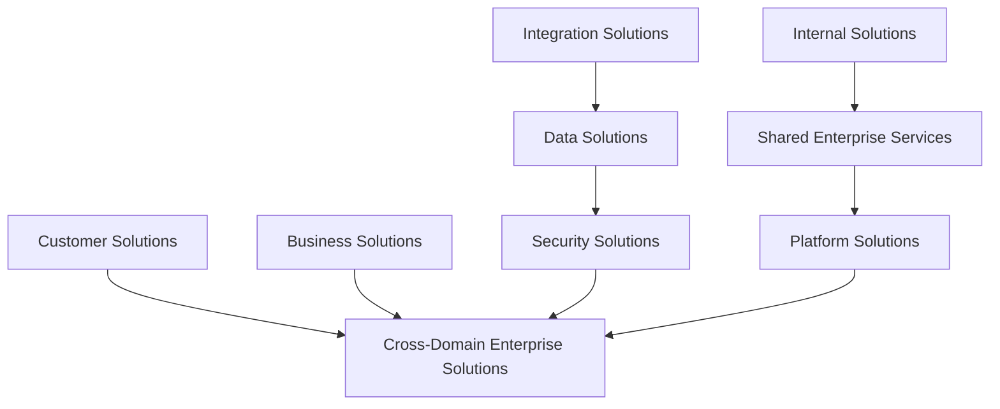
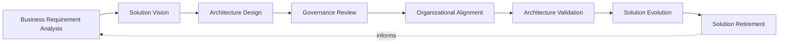
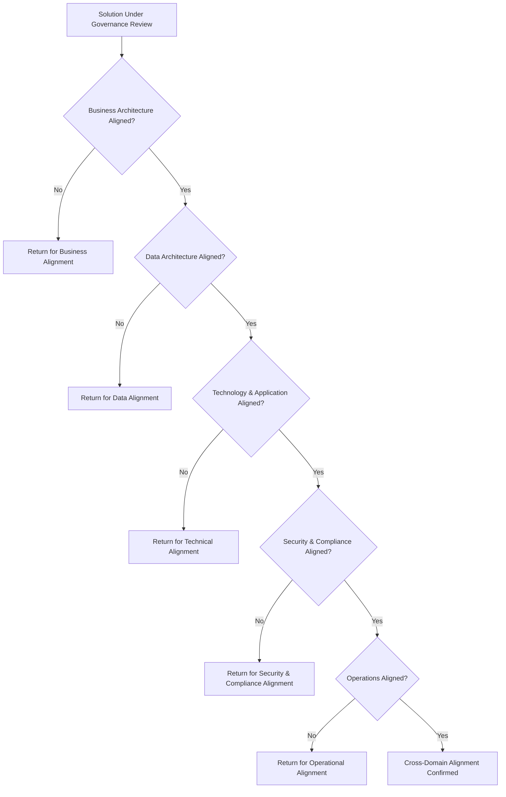
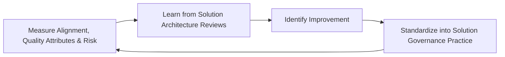
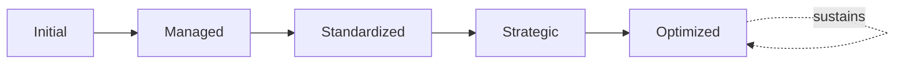

# Enterprise Solution Architecture Framework

## 1. Executive Summary

**Purpose** — This document defines the official Enterprise Solution Architecture Framework for **StackLeo Tech Store**. It establishes solution governance, solution design principles, architecture quality attributes, lifecycle governance, organizational accountability, executive oversight, continuous improvement, and long-term solution architecture maturity as a deliberate, accountable enterprise discipline. `enterprise-architecture-strategy.md` anticipated this framework directly (Related Documents) as the dedicated governance treatment of solution-level architecture within enterprise architecture's broader boundaries. This framework does not restate that strategy's enterprise-wide governance model. It governs the point at which a specific business problem's technical solution is designed, reviewed, and evolved — ensuring every individual solution remains genuinely coherent with the enterprise architecture it operates within.

**Scope** — This framework applies to every category of solution at StackLeo — customer, business, internal, shared enterprise services, platform, integration, data, security, and cross-domain enterprise solutions — coordinated with `enterprise-architecture-strategy.md`, `architecture-principles.md`, `security-strategy.md`, and `operations-strategy.md`.

**Strategic Objectives** — To ensure every solution begins from a genuine business requirement, never from technology convenience; that a solution's design quality — availability, reliability, scalability, security — is deliberately governed, not assumed; that solutions remain genuinely coherent with the broader enterprise architecture rather than accumulating as disconnected, siloed builds; and that executive leadership has continuous, honest visibility into the organization's solution architecture posture.

**Business Value** — A governed solution architecture framework protects StackLeo from the disproportionate cost of a solution built well in isolation but incoherent with everything around it, protects genuine quality attributes customers and the business depend on, and gives leadership confidence that individual solution investment genuinely serves the enterprise's coherent, long-term direction.

**Intended Audience** — The Board of Directors, executive leadership, the Chief Technology Officer, the enterprise architecture team, solution architects, engineering leadership, product leadership, security leadership, operations leadership, and business stakeholders.

## 2. Enterprise Solution Architecture Vision

- **Solution Architecture as Business Capability** — solution architecture is governed as a genuine business capability, never merely a technical design exercise.
- **Business and Technology Alignment** — every solution exists to serve a genuine business requirement, never technology convenience.
- **Sustainable Solution Design** — solutions are designed to be genuinely sustainable over their operational lifetime, not merely functional at launch.
- **Customer Value Creation** — a solution's design is ultimately judged by the genuine value it creates for the customer it serves.
- **Enterprise Consistency** — solutions remain genuinely coherent with the broader enterprise architecture, never designed in isolation.
- **Organizational Agility** — solution architecture enables the organization to respond quickly to genuine opportunity, never constrains it unnecessarily.
- **Continuous Solution Evolution** — solutions evolve deliberately alongside genuine business and technical need, never frozen at their initial design.

### Enterprise Solution Architecture Vision Matrix

| Vision Element | Focus | Business Value |
|---|---|---|
| Solution Architecture as Business Capability | A genuine business capability, not a technical exercise | Prevents solution design from being treated as purely technical |
| Business and Technology Alignment | Every solution serving a genuine business requirement | Ensures solution investment is directed by business intent |
| Sustainable Solution Design | Genuinely sustainable over the operational lifetime | Protects against solutions that work only at launch |
| Customer Value Creation | Judged by genuine value created for the customer | Keeps solution design connected to what customers value |
| Enterprise Consistency | Genuinely coherent with the broader architecture | Prevents solutions accumulating as disconnected sprawl |
| Organizational Agility | Enabling, not unnecessarily constraining, response | Protects the business's ability to move quickly when it matters |
| Continuous Solution Evolution | Evolving deliberately alongside genuine need | Keeps solutions from becoming frozen and outdated |

## 3. Solution Architecture Principles

Solution architecture governance at StackLeo rests on nine principles, each producing a specific business outcome.

- **Business Value First** — a solution's design is justified by the genuine business value it creates, never pursued for technical interest alone. *Business Value:* prevents solution investment disconnected from genuine business intent.
- **Simplicity** — a solution favors the simplest design that genuinely satisfies its real requirement. *Business Value:* protects against the disproportionate cost of unnecessary solution complexity.
- **Modularity** — a solution is designed as coherent, independently evolvable components. *Business Value:* protects the organization's ability to change one part of a solution without destabilizing another.
- **Scalability** — a solution is designed to genuinely absorb its anticipated growth in demand. *Business Value:* protects the solution from being outgrown by its own success.
- **Reliability** — a solution is designed to genuinely perform consistently under both normal and unexpected conditions. *Business Value:* protects confidence that a solution can be depended upon.
- **Maintainability** — a solution is designed to be genuinely sustainable to operate and evolve over time. *Business Value:* protects the organization from the disproportionate cost of a solution that becomes unmaintainable.
- **Security by Design** — security is considered from the outset of solution design, coordinated with `security-strategy.md`. *Business Value:* prevents the disproportionate cost of retrofitting security after a solution is already built.
- **Interoperability** — a solution is designed to genuinely and consistently interoperate with the rest of the enterprise architecture. *Business Value:* prevents a solution from becoming an isolated, incompatible island.
- **Continuous Improvement** — solution architecture practice matures over time, informed by real operational and design outcomes. *Business Value:* keeps solution design aligned with the organization's growing scale and complexity.

### Solution Architecture Principles Matrix

| Principle | Description | Business Value |
|---|---|---|
| Business Value First | Justified by genuine business value, not technical interest | Prevents investment disconnected from genuine business intent |
| Simplicity | The simplest design that genuinely satisfies the requirement | Protects against the disproportionate cost of unnecessary complexity |
| Modularity | Coherent, independently evolvable components | Protects the ability to change one part without destabilizing another |
| Scalability | Genuinely absorbing anticipated growth in demand | Protects the solution from being outgrown by its own success |
| Reliability | Genuinely consistent performance under all conditions | Protects confidence that a solution can be depended upon |
| Maintainability | Genuinely sustainable to operate and evolve | Protects against the cost of an unmaintainable solution |
| Security by Design | Considered from the outset of design | Prevents the disproportionate cost of retrofitted security |
| Interoperability | Genuinely and consistently interoperating with the enterprise | Prevents a solution becoming an isolated, incompatible island |
| Continuous Improvement | Practice matures from real operational and design outcomes | Keeps design aligned with growing scale and complexity |

## 4. Enterprise Solution Governance Model

Solution governance operates across nine conceptual categories, each holding accountability for a distinct solution type.

### Customer Solutions

- **Purpose** — govern solutions customers directly interact with and depend upon.
- **Governance Scope** — coordinated with Customer Applications (`07_DevOps/application-security-framework.md`, Section 4).
- **Business Value** — protects the most direct point of customer encounter with StackLeo.
- **Executive Expectations** — leadership expects customer solutions to be held to elevated design rigor given direct customer exposure.

### Business Solutions

- **Purpose** — govern solutions directly supporting business operation and revenue.
- **Governance Scope** — coordinated with `01_Business/business-model.md`.
- **Business Value** — protects the solutions the business's commercial operation directly depends on.
- **Executive Expectations** — leadership expects business solution governance to reflect genuine commercial consequence.

### Internal Solutions

- **Purpose** — govern solutions used internally by StackLeo employees.
- **Governance Scope** — coordinated with `identity-access-governance.md` (Workforce Identity).
- **Business Value** — protects employees' ability to genuinely rely on internal capability.
- **Executive Expectations** — leadership expects internal solutions to be governed to the same standard as customer-facing solutions.

### Shared Enterprise Services

- **Purpose** — govern solution capability shared and consumed across multiple other solutions.
- **Governance Scope** — coordinated with `07_DevOps/platform-engineering.md`.
- **Business Value** — ensures a shared solution failure is never treated as a single team's isolated concern.
- **Executive Expectations** — leadership expects shared services to be governed with awareness of their broad dependency footprint.

### Platform Solutions

- **Purpose** — govern solutions delivered as underlying platform capability.
- **Governance Scope** — coordinated with Platform Architecture (`enterprise-architecture-strategy.md`, Section 4).
- **Business Value** — protects the foundation every other solution category ultimately depends on.
- **Executive Expectations** — leadership expects platform solutions to be governed with consistent rigor regardless of scale.

### Integration Solutions

- **Purpose** — govern solutions connecting the platform's internal components and external partners.
- **Governance Scope** — coordinated with `03_System_Design/integration-architecture.md`.
- **Business Value** — protects the coherence of the platform's boundary-crossing interactions.
- **Executive Expectations** — leadership expects integration solutions to remain consistent as partner relationships grow.

### Data Solutions

- **Purpose** — govern solutions handling the platform's data storage, processing, and flow.
- **Governance Scope** — coordinated with `04_Database/data-governance.md`.
- **Business Value** — protects the trustworthiness of the data every business decision depends on.
- **Executive Expectations** — leadership expects data solutions to be governed proportionate to data sensitivity.

### Security Solutions

- **Purpose** — govern solutions specifically delivering security capability, jointly with, and never superseding, `security-strategy.md`.
- **Governance Scope** — coordinated with `06_Security/security-architecture.md`.
- **Business Value** — protects StackLeo's core trust differentiator through genuinely secure solution design.
- **Executive Expectations** — leadership expects security solutions to be treated as mandatory, non-negotiable.

### Cross-Domain Enterprise Solutions

- **Purpose** — govern the synthesized, executive-relevant picture of solutions spanning multiple domains above.
- **Governance Scope** — oversight exclusively accountable for converging every category into one coherent enterprise picture.
- **Business Value** — protects leadership's ability to understand overall solution posture as a whole, not category by category.
- **Executive Expectations** — leadership expects one coherent solution picture, not nine disconnected category views.

### Solution Governance Matrix

| Domain | Purpose | Business Value | Executive Expectations |
|---|---|---|---|
| Customer Solutions | Govern solutions customers directly interact with | Protects the most direct point of customer encounter | Expects elevated design rigor given direct exposure |
| Business Solutions | Govern solutions supporting operation and revenue | Protects solutions commercial operation depends on | Expects governance reflecting genuine commercial consequence |
| Internal Solutions | Govern solutions used by employees | Protects employees' ability to genuinely rely on capability | Expects the same standard as customer-facing solutions |
| Shared Enterprise Services | Govern capability shared across multiple solutions | Ensures failure is never one team's isolated concern | Expects awareness of broad dependency footprint |
| Platform Solutions | Govern solutions delivering platform capability | Protects the foundation every other category depends on | Expects consistent rigor regardless of scale |
| Integration Solutions | Govern solutions connecting components and partners | Protects coherence of boundary-crossing interactions | Expects consistency as partner relationships grow |
| Data Solutions | Govern solutions handling data storage and flow | Protects trustworthiness of data decisions depend on | Expects governance proportionate to data sensitivity |
| Security Solutions | Govern solutions delivering security capability | Protects StackLeo's core trust differentiator | Expects treatment as mandatory, non-negotiable |
| Cross-Domain Enterprise Solutions | Synthesize the enterprise solution picture | Protects leadership's ability to understand posture as a whole | Expects one coherent picture, not disconnected views |

*Diagram 1: Enterprise Solution Architecture Framework — customer and business solutions, internal and shared enterprise services feeding platform solutions, and integration, data, and security solutions all converge on cross-domain enterprise solutions' synthesized picture.*

## 5. Solution Quality Attribute Framework

Solution quality is governed across nine conceptual attributes, each carrying a distinct governance objective. Remaining implementation independent, this framework governs what quality means for a solution — never which specific pattern or technology delivers it.

- **Availability** — governs whether a solution is genuinely accessible and usable when needed.
- **Reliability** — governs whether a solution performs genuinely consistently under normal and unexpected conditions.
- **Scalability** — governs whether a solution can genuinely absorb growth in demand without degrading.
- **Performance** — governs whether a solution genuinely responds within its expected timeframe.
- **Security** — governs whether a solution genuinely protects the data and access it is responsible for.
- **Maintainability** — governs whether a solution remains genuinely sustainable to operate and evolve.
- **Usability** — governs whether a solution is genuinely usable by the people who depend on it.
- **Extensibility** — governs whether a solution can genuinely accommodate a new, related requirement without redesign.
- **Interoperability** — governs whether a solution genuinely and consistently interoperates with the rest of the enterprise.

### Solution Quality Attribute Matrix

| Quality Attribute | Governance Objective | Coordination |
|---|---|---|
| Availability | Genuinely accessible and usable when needed | `09_Operations/availability-management.md` |
| Reliability | Genuinely consistent under normal and unexpected conditions | `07_DevOps/reliability-engineering-framework.md` |
| Scalability | Genuinely absorbing growth without degrading | Scalability (Section 3) |
| Performance | Genuinely responding within expected timeframe | `03_System_Design/quality-attributes.md` |
| Security | Genuinely protecting data and access it is responsible for | `security-strategy.md` |
| Maintainability | Genuinely sustainable to operate and evolve | Maintainability (Section 3) |
| Usability | Genuinely usable by those who depend on it | Customer Value Creation (Section 2) |
| Extensibility | Genuinely accommodating new requirements without redesign | Modularity (Section 3) |
| Interoperability | Genuinely and consistently interoperating with the enterprise | Interoperability (Section 3) |

## 6. Solution Lifecycle Governance

Solution architecture governance operates across eight conceptual lifecycle stages.

- **Business Requirement Analysis** — govern how a genuine business requirement is understood before a solution is designed.
- **Solution Vision** — govern how a solution's genuine purpose and value proposition are defined.
- **Architecture Design** — govern how a solution's architecture is designed to genuinely satisfy its defined requirement.
- **Governance Review** — govern how a designed solution is reviewed against the appropriate domain in Section 4 and quality attributes in Section 5.
- **Organizational Alignment** — govern how a reviewed solution's alignment with the broader enterprise architecture is confirmed.
- **Architecture Validation** — govern how an aligned solution is confirmed to genuinely deliver its intended outcome.
- **Solution Evolution** — govern how a solution's design evolves alongside genuine business and technical need.
- **Solution Retirement** — govern how a solution's architectural obligations are formally closed out when it is genuinely retired.

### Solution Lifecycle Matrix

| Stage | Governance Objective | Business Value |
|---|---|---|
| Business Requirement Analysis | Understand genuine requirement before design | Ensures solution effort is deliberately directed |
| Solution Vision | Define genuine purpose and value proposition | Prevents a solution proceeding without genuine value clarity |
| Architecture Design | Design to genuinely satisfy the defined requirement | Ensures design remains grounded in genuine need |
| Governance Review | Review against domain and quality attribute standards | Ensures review by the genuinely accountable function |
| Organizational Alignment | Confirm alignment with broader enterprise architecture | Prevents a solution from becoming an isolated island |
| Architecture Validation | Confirm genuine delivery of intended outcome | Protects against declaring success prematurely |
| Solution Evolution | Evolve design alongside genuine business and technical need | Keeps the solution genuinely connected to evolving intent |
| Solution Retirement | Formally close out obligations when genuinely retired | Prevents a retired solution from persisting as unmanaged risk |

*Diagram 3: Solution Lifecycle Governance — requirement analysis and solution vision inform architecture design and governance review, feeding organizational alignment and validation, with solution evolution and retirement feeding lessons back into the cycle.*

## 7. Cross-Domain Architecture Alignment

- **Business Architecture Alignment** — governs how a solution's design remains genuinely aligned with `enterprise-architecture-strategy.md`'s Business Architecture domain.
- **Data Architecture Alignment** — governs how a solution's data handling remains genuinely aligned with `enterprise-architecture-strategy.md`'s Data Architecture domain.
- **Application Architecture Alignment** — governs how a solution remains genuinely coherent with the broader application architecture it operates within.
- **Technology Architecture Alignment** — governs how a solution's technology choices remain genuinely aligned with the organization's governed technology portfolio.
- **Security Architecture Alignment** — governs how a solution's security design remains genuinely aligned with `security-strategy.md` and `06_Security/security-architecture.md`.
- **Operations Alignment** — governs how a solution's operational model remains genuinely aligned with `operations-strategy.md`.
- **Compliance Alignment** — governs how a solution's design remains genuinely aligned with `06_Security/compliance-governance.md`.

### Cross-Domain Alignment Matrix

| Alignment Area | Focus | Coordination |
|---|---|---|
| Business Architecture Alignment | Design aligned with the Business Architecture domain | `enterprise-architecture-strategy.md` (Section 4) |
| Data Architecture Alignment | Data handling aligned with the Data Architecture domain | `enterprise-architecture-strategy.md` (Section 4) |
| Application Architecture Alignment | Coherence with the broader application architecture | `03_System_Design/component-architecture.md` |
| Technology Architecture Alignment | Technology choices aligned with the governed portfolio | `03_System_Design/technology-stack.md` |
| Security Architecture Alignment | Security design aligned with security strategy | `security-strategy.md` |
| Operations Alignment | Operational model aligned with operations strategy | `operations-strategy.md` |
| Compliance Alignment | Design aligned with compliance governance | `06_Security/compliance-governance.md` |

*Diagram 4: Cross-Domain Architecture Alignment — a solution under governance review is checked in sequence against business, data, technology and application, security and compliance, and operational alignment, proceeding to confirmed cross-domain alignment only once every dimension is genuinely satisfied.*

## 8. Solution Review Governance

- **Architecture Review** — governs the formal, structured review of a solution's overall architectural soundness.
- **Design Consistency Review** — governs whether a solution's design remains genuinely consistent with established architecture standards.
- **Business Alignment Review** — governs whether a solution's continued alignment with genuine business need is confirmed.
- **Risk Review** — governs how a solution's genuine architectural risk is evaluated before approval.
- **Quality Review** — governs how a solution's genuine adherence to the Quality Attribute Framework (Section 5) is confirmed.
- **Executive Approval** — governs the point at which a solution requires executive-level approval.
- **Continuous Improvement** — governs how solution review practice is deliberately strengthened based on real outcomes.

### Solution Review Matrix

| Review Area | Focus | Governance Coordination |
|---|---|---|
| Architecture Review | Formal review of overall architectural soundness | Governance Review (Section 6) |
| Design Consistency Review | Consistency with established architecture standards | `architecture-principles.md` |
| Business Alignment Review | Continued alignment with genuine business need | Business Architecture Alignment (Section 7) |
| Risk Review | Genuine architectural risk evaluated before approval | Solution Risk Governance (Section 10) |
| Quality Review | Adherence to the Quality Attribute Framework | Solution Quality Attribute Framework (Section 5) |
| Executive Approval | Point requiring executive-level approval | Executive Oversight (Section 11) |
| Continuous Improvement | Practice strengthened from real outcomes | Continuous Improvement (Section 3) |

## 9. Organizational Governance

Governance accountability is distributed deliberately across ten organizational roles.

- **Board of Directors** — holds ultimate accountability for whether StackLeo's solutions genuinely serve coherent enterprise direction.
- **Executive Leadership** — holds accountability for whether solution investment genuinely aligns with business strategy, in partnership with the Board.
- **Chief Technology Officer** — owns the coherence and enforcement of this framework across every solution category and governance layer it defines.
- **Enterprise Architecture Team** — owns the coherence of this framework's alignment with `enterprise-architecture-strategy.md`.
- **Solution Architects** — own the day-to-day design and Governance Review (Section 6) of individual solutions.
- **Engineering Leadership** — own Platform and Shared Enterprise Services solutions (Section 4) within their accountable teams.
- **Product Leadership** — own Customer Solutions (Section 4) alignment with genuine product priority.
- **Security Leadership** — own Security Solutions (Section 4) jointly with `security-strategy.md`.
- **Operations Leadership** — own Operations Alignment (Section 7) in coordination with `operations-strategy.md`.
- **Business Stakeholders** — own Business Solutions (Section 4) alignment with genuine business priority.

### Organizational Responsibility Matrix

| Role | Governance Objective | Business Value |
|---|---|---|
| Board of Directors | Hold ultimate accountability for solutions serving enterprise direction | Provides the highest point of ultimate accountability |
| Executive Leadership | Hold accountability for solution investment aligning with strategy | Provides a single point of executive-level accountability |
| Chief Technology Officer | Own coherence and enforcement of this framework | Provides a single point of specialist accountability |
| Enterprise Architecture Team | Own coherence with `enterprise-architecture-strategy.md` | Connects solution governance to enterprise-wide direction |
| Solution Architects | Own day-to-day design and governance review | Ensures solutions are genuinely, continuously governed |
| Engineering Leadership | Own platform and shared enterprise services | Embeds accountability closest to where solutions are built |
| Product Leadership | Own customer solutions alignment with product priority | Ensures solutions reflect genuine product and customer value |
| Security Leadership | Own security solutions jointly with security strategy | Ensures solutions are never a novel, ungoverned attack surface |
| Operations Leadership | Own operations alignment | Ensures solutions genuinely support operational sustainability |
| Business Stakeholders | Own business solutions alignment with priority | Connects solutions to genuine business relevance |

## 10. Solution Risk Governance

Solution architecture-related risk is governed across eight conceptual categories.

- **Architecture Complexity Risks** — the risk that a solution's design becomes more complex than a genuine requirement justifies.
- **Business Alignment Risks** — the risk that a solution drifts away from the genuine business need it was built to serve.
- **Scalability Risks** — the risk that a solution cannot genuinely absorb its anticipated growth in demand.
- **Integration Risks** — the risk that a solution's boundary-crossing interactions introduce genuine fragility.
- **Technology Risks** — the risk that a solution's chosen technology fails to genuinely serve its long-term needs.
- **Operational Risks** — the risk that a solution cannot be adequately operated, monitored, or recovered once live.
- **Compliance Risks** — the risk that a solution fails to meet a genuine regulatory or contractual obligation.
- **Strategic Risks** — the risk that a solution decision forecloses a genuinely important future business opportunity.

### Solution Risk Matrix

| Risk Category | Focus | Governance Coordination |
|---|---|---|
| Architecture Complexity Risks | Design more complex than a genuine requirement justifies | Coordinated with Simplicity (Section 3) |
| Business Alignment Risks | A solution drifting from the genuine need it was built for | Coordinated with Business Alignment Review (Section 8) |
| Scalability Risks | Inability to absorb anticipated growth in demand | Coordinated with Scalability (Section 5) |
| Integration Risks | Boundary-crossing interactions introducing fragility | Coordinated with Integration Solutions (Section 4) |
| Technology Risks | A chosen technology failing to serve long-term needs | Coordinated with Technology Architecture Alignment (Section 7) |
| Operational Risks | Inadequate ability to operate, monitor, or recover | Coordinated with Operations Alignment (Section 7) |
| Compliance Risks | Failure to meet regulatory or contractual obligation | Coordinated with `06_Security/compliance-governance.md` |
| Strategic Risks | A decision foreclosing a genuinely important opportunity | Coordinated with Cross-Domain Enterprise Solutions (Section 4) |

## 11. Executive Oversight

- **Solution Architecture Reviews** — the overall coherence of solution architecture governance is formally reviewed on a regular cadence.
- **Business Alignment Reviews** — solutions' continued alignment with genuine business direction is periodically reviewed.
- **Quality Reviews** — solution adherence to the Quality Attribute Framework (Section 5) is reviewed as a distinct, ongoing concern.
- **Risk Reviews** — solution architecture risk posture is reviewed directly with executive leadership.
- **Executive Governance Reviews** — the framework's own governance model, domains, and lifecycle are periodically reassessed for continued fitness.
- **Continuous Improvement Reviews** — the organization's follow-through on captured solution architecture lessons is reviewed directly with executive leadership.

### Executive Oversight Matrix

| Oversight Mechanism | Purpose | Governance Role |
|---|---|---|
| Solution Architecture Reviews | Confirm overall solution governance coherence | Regular, predictable cadence for the framework as a whole |
| Business Alignment Reviews | Review continued alignment with business direction | Periodic executive-level alignment review |
| Quality Reviews | Review adherence to the Quality Attribute Framework | Direct executive-level quality review |
| Risk Reviews | Review solution architecture risk posture | Direct executive-level review of risk exposure |
| Executive Governance Reviews | Reassess the governance model for continued fitness | Applies to Sections 4–9 of this framework |
| Continuous Improvement Reviews | Review follow-through on captured lessons | Direct executive-level review of improvement completion |

## 12. Future Readiness

This framework is designed to remain valid as StackLeo evolves in scale, geography, and organizational complexity.

- **AI-Driven Solution Architecture** — as AI capability is adopted, coordinated with `04_Database/ai-governance.md`, its solution-level dimension remains governed under Data and Security Solutions (Section 4) at the same rigor as any other category.
- **Intelligent Design Governance** — where governance review increasingly draws on intelligent pattern analysis, that analysis remains subject to the same Governance Review (Section 6) as any other method.
- **Adaptive Enterprise Solutions** — where a solution increasingly adapts its own structure to changing demand, that capability remains governed under Scalability (Section 5) at the same rigor as any other quality attribute.
- **Composable Solution Architecture** — where solutions increasingly assemble from genuinely reusable, composable capability, that approach remains governed under Modularity (Section 3) at the same rigor as any other principle.
- **Enterprise Digital Innovation** — new solution approaches are adopted only in a manner consistent with this framework's principles (Section 3), never at their expense.
- **Long-Term Architecture Evolution** — Solution Vision and Organizational Alignment (Section 6) are structured to be re-applied as StackLeo expands from Bangladesh into South Asia and global markets, each with genuinely distinct solution considerations.

## 13. Solution Architecture Maturity Model

Solution architecture governance maturity is described across five conceptual levels.

- **Initial** — solution architecture, where it exists, is informal and inconsistent; designs are made reactively, and ownership is unclear.
- **Managed** — basic solution governance exists for individual categories, but consistency across the nine domains in Section 4 varies significantly.
- **Standardized** — the governance model, domains, and lifecycle are standardized, documented, and consistently applied across the organization.
- **Strategic** — solution decisions are genuinely and routinely made in deliberate service of business strategy, not technical convenience.
- **Optimized** — solution architecture governance is continuously and deliberately improved based on quantitative evidence and organizational learning; improvement itself is a managed, ongoing discipline.

### Solution Architecture Maturity Matrix

| Level | Characteristics | Primary Focus |
|---|---|---|
| Initial | Informal, inconsistent solutions; designs made reactively | Ad hoc, individually-dependent solution practice |
| Managed | Basic governance exists per category; consistency varies | Category-level consistency |
| Standardized | Standardized governance model, domains, and lifecycle | Organization-wide consistency and clear ownership |
| Strategic | Decisions genuinely and routinely made in service of strategy | Business-strategy-driven solution decision-making |
| Optimized | Practice continuously and deliberately improved from evidence | Sustained, deliberate improvement as a discipline |

*Diagram 5: Continuous Solution Improvement Cycle — business alignment, quality attribute adherence, and risk exposure are measured, learned from, improved upon, and standardized back into governed practice, on a continuing basis.*

*Diagram 6: Solution Architecture Maturity Progression — maturity advances from informal, reactively-designed solution practice toward standardized, genuinely strategy-driven, and continuously optimized solution architecture governance.*

## 14. Solution Architecture Anti-Patterns

- **Solutions Without Governance** — a solution built without genuine governance review accumulates as ungoverned, incoherent sprawl.
- **Technology-Driven Design** — choosing a technology before genuinely understanding the business need it should serve inverts Business Value First (Section 3).
- **Over-Engineering** — designing a solution more complex than its genuine requirement justifies burdens every team that must work within it.
- **Siloed Solutions** — a solution designed without genuine cross-domain alignment prevents one coherent enterprise picture.
- **Weak Business Alignment** — a solution disconnected from genuine business strategy wastes investment on what does not genuinely matter.
- **Ignoring Quality Attributes** — a solution evaluated without genuine regard for the Quality Attribute Framework (Section 5) risks failing the people who depend on it.
- **Architecture Drift** — allowing a solution to silently diverge from enterprise architecture over time forfeits the coherence this framework depends on.
- **No Continuous Improvement** — treating current solution architecture practice as permanently finished guarantees it falls behind the organization's growing scale and complexity.

### Anti-Pattern Summary

| Anti-Pattern | Organizational & Business Impact |
|---|---|
| Solutions Without Governance | Accumulates as ungoverned, incoherent sprawl |
| Technology-Driven Design | Inverts business-value-first design, choosing tools before need |
| Over-Engineering | Burdens every team that must work within the solution |
| Siloed Solutions | Prevents one coherent, organization-wide architecture picture |
| Weak Business Alignment | Wastes investment on what does not genuinely matter |
| Ignoring Quality Attributes | Risks failing the people who depend on the solution |
| Architecture Drift | Forfeits the coherence this framework depends on |
| No Continuous Improvement | Guarantees practice falls behind growing scale and complexity |

## Related Documents

| Document | Relationship |
|---|---|
| `enterprise-architecture-strategy.md` | Anticipated this framework by name; sets the enterprise-wide governance model this framework's Solution Architecture domain elaborates. |
| `architecture-principles.md` | The normative, engineering-facing reference this framework's Design Consistency Review (Section 8) coordinates with. |
| `technology-governance.md` | Governs the technology portfolio this framework's Technology Architecture Alignment (Section 7) coordinates with. |
| `architecture-review-board.md` | The formal governance body this framework's Architecture Review (Section 8) relies on. |
| Architecture Decision Records (`architecture-decisions.md`) | Elaborates the specific decision record this framework's Governance Review (Section 6) formalizes. |
| `architecture-decision-records.md` | Governs the ownership, traceability, and knowledge management discipline behind this framework's Solution Architecture Decisions. |
| `architecture-maturity-framework.md` | Consolidates this framework's Solution Architecture Maturity Model (Section 13) into the enterprise-wide architecture maturity picture. |
| `security-strategy.md` | Sets the enterprise-wide security strategic direction this framework's Security Architecture Alignment (Section 7) coordinates with. |
| `operations-strategy.md` | Provides the enterprise operations context this framework's Operations Alignment (Section 7) coordinates with. |

## Document Information

| Property | Value |
|----------|-------|
| Document | solution-architecture-framework.md |
| Version | 1.0.0 |
| Status | Active |
| Maintained By | StackLeo |
| Last Updated | 2026-07-29 |

---

© StackLeo. All Rights Reserved.
