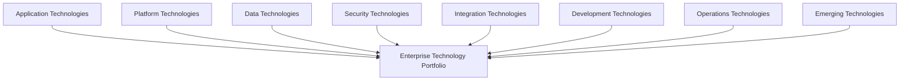
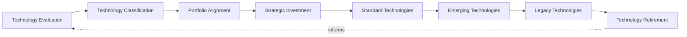
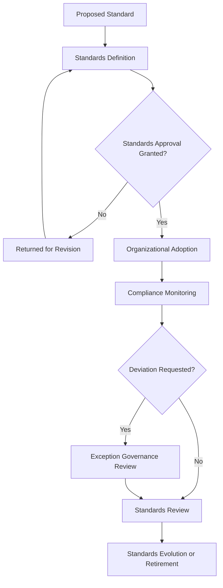
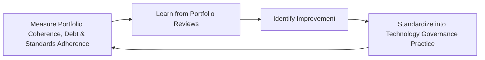
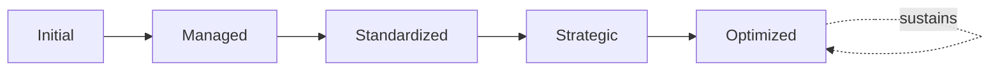

# Enterprise Technology Governance Framework

## 1. Executive Summary

**Purpose** — This document defines the official Enterprise Technology Governance Framework for **StackLeo Tech Store**. It establishes technology strategy, technology portfolio governance, standards governance, innovation governance, technical debt governance, organizational accountability, executive oversight, continuous improvement, and long-term technology maturity as a deliberate, accountable enterprise discipline. `enterprise-architecture-strategy.md` and `solution-architecture-framework.md` each anticipated this framework directly as the dedicated governance treatment of the technology portfolio their Technology Architecture and Technology Architecture Alignment domains govern conceptually. This framework does not restate either. It governs technology as a managed enterprise portfolio — what technology StackLeo adopts, standardizes, retires, and experiments with, and why.

**Scope** — This framework applies to every category of technology at StackLeo — application, platform, data, security, integration, development, operations, and emerging technologies — coordinated with `enterprise-architecture-strategy.md`, `solution-architecture-framework.md`, `architecture-principles.md`, `security-strategy.md`, and `operations-strategy.md`.

**Strategic Objectives** — To ensure technology adoption is genuinely justified by business need, never pursued for technical interest alone; that the technology portfolio remains coherent and standardized, not fragmented; that technical debt is deliberately tracked and prioritized rather than silently accumulated; and that executive leadership has continuous, honest visibility into the organization's technology portfolio posture.

**Business Value** — A governed technology strategy protects StackLeo from the disproportionate cost of fragmented, redundant, or poorly justified technology adoption, protects the organization's ability to sustain confident delivery over years rather than a single release, and gives leadership the confidence to invest in technology because its direction is demonstrably coherent and business-aligned.

**Intended Audience** — The Board of Directors, executive leadership, the Chief Technology Officer, the enterprise architecture team, the Technology Governance Board, engineering leadership, security leadership, operations leadership, product leadership, and business stakeholders.

## 2. Enterprise Technology Vision

- **Technology as a Business Enabler** — technology is governed as a genuine enabler of business ambition, never pursued as a technical exercise disconnected from it.
- **Sustainable Technology Evolution** — the technology portfolio evolves deliberately alongside the business, never lagging behind or over-investing ahead of genuine need.
- **Enterprise Agility** — technology governance enables the organization to respond quickly to genuine opportunity, never constrains it unnecessarily.
- **Customer Value Creation** — technology decisions are ultimately judged by the genuine value they enable for customers.
- **Innovation with Governance** — new technology is embraced deliberately, within a genuinely governed structure, never adopted carelessly.
- **Long-Term Maintainability** — the technology portfolio is governed to remain genuinely sustainable for the current and foreseeable engineering team.
- **Strategic Technology Alignment** — every technology decision remains genuinely connected to StackLeo's business strategy.

### Enterprise Technology Vision Matrix

| Vision Element | Focus | Business Value |
|---|---|---|
| Technology as a Business Enabler | A genuine enabler of business ambition | Prevents technology decisions disconnected from business intent |
| Sustainable Technology Evolution | Evolving deliberately alongside the business | Keeps technology from lagging behind or over-investing ahead |
| Enterprise Agility | Enabling, not unnecessarily constraining, rapid response | Protects the business's ability to move quickly when it matters |
| Customer Value Creation | Decisions judged by genuine customer value enabled | Keeps technology connected to what customers actually value |
| Innovation with Governance | New technology embraced within a genuinely governed structure | Balances genuine innovation against careless, ungoverned adoption |
| Long-Term Maintainability | Genuinely sustainable for the current and foreseeable team | Protects confident delivery over years, not a single release |
| Strategic Technology Alignment | Every decision genuinely connected to business strategy | Ensures technology investment is directed by business intent |

## 3. Technology Governance Principles

Technology governance at StackLeo rests on nine principles, each producing a specific business outcome.

- **Business-Driven Technology** — every technology decision is justified by a genuine, concrete business need. *Business Value:* prevents technology investment disconnected from genuine business intent.
- **Standardization** — technology follows consistent, governed patterns across domains and teams. *Business Value:* reduces the variance that makes cross-system understanding and support difficult.
- **Simplicity** — technology favors the simplest option that genuinely satisfies a real requirement. *Business Value:* protects against the disproportionate cost of unnecessary technical complexity.
- **Sustainability** — technology is chosen for its genuine, long-term supportability, not only its immediate convenience. *Business Value:* protects confident delivery over years, not just at initial adoption.
- **Scalability** — technology is governed to genuinely absorb the business's anticipated growth. *Business Value:* protects the platform from being outgrown by its own business success.
- **Security by Design** — security is considered from the outset of every technology decision, coordinated with `security-strategy.md`. *Business Value:* prevents the disproportionate cost of retrofitting security after adoption.
- **Vendor Neutrality** — technology principles remain valid regardless of the specific vendor or provider chosen. *Business Value:* protects the organization from vendor lock-in and premature commitment.
- **Innovation with Control** — new technology is evaluated and adopted deliberately, never embraced without genuine governance. *Business Value:* balances the benefit of innovation against the risk of ungoverned adoption.
- **Continuous Improvement** — technology governance practice matures over time, informed by real operational and business outcomes. *Business Value:* keeps technology governance aligned with the organization's growing scale and complexity.

### Technology Governance Principles Matrix

| Principle | Description | Business Value |
|---|---|---|
| Business-Driven Technology | Justified by a genuine, concrete business need | Prevents investment disconnected from genuine business intent |
| Standardization | Consistent, governed patterns across domains and teams | Reduces variance that complicates cross-system support |
| Simplicity | The simplest option that genuinely satisfies the requirement | Protects against the disproportionate cost of unnecessary complexity |
| Sustainability | Chosen for genuine, long-term supportability | Protects confident delivery over years, not just adoption |
| Scalability | Governed to genuinely absorb anticipated growth | Protects the platform from being outgrown by its own success |
| Security by Design | Considered from the outset of every decision | Prevents the disproportionate cost of retrofitted security |
| Vendor Neutrality | Valid regardless of specific vendor or provider | Protects against vendor lock-in and premature commitment |
| Innovation with Control | Evaluated and adopted deliberately, never carelessly | Balances innovation benefit against ungoverned adoption risk |
| Continuous Improvement | Practice matures from real operational and business outcomes | Keeps governance aligned with growing scale and complexity |

## 4. Enterprise Technology Governance Model

Technology governance operates across nine conceptual domains, each holding accountability for a distinct category of technology.

### Enterprise Technology Portfolio

- **Purpose** — govern the synthesized, executive-relevant picture of the organization's overall technology holdings.
- **Governance Scope** — oversight exclusively accountable for converging every domain below into one coherent enterprise picture.
- **Business Value** — protects leadership's ability to understand overall technology posture as a whole, not domain by domain.
- **Executive Expectations** — leadership expects one coherent technology picture, not eight disconnected domain views.

### Application Technologies

- **Purpose** — govern the technology categories underlying the platform's application layer.
- **Governance Scope** — coordinated with `03_System_Design/technology-stack.md`.
- **Business Value** — protects the coherence of the software layer customers and the business directly depend on.
- **Executive Expectations** — leadership expects application technology to remain deliberately, not accidentally, standardized.

### Platform Technologies

- **Purpose** — govern the technology categories underlying shared platform capability.
- **Governance Scope** — coordinated with `07_DevOps/platform-engineering.md`.
- **Business Value** — protects the foundation every other technology domain ultimately depends on.
- **Executive Expectations** — leadership expects platform technology to be governed with consistent rigor regardless of scale.

### Data Technologies

- **Purpose** — govern the technology categories underlying the platform's data storage and processing.
- **Governance Scope** — coordinated with `04_Database/data-governance.md`.
- **Business Value** — protects the trustworthiness and coherence of the data every business decision depends on.
- **Executive Expectations** — leadership expects data technology to be governed proportionate to data sensitivity.

### Security Technologies

- **Purpose** — govern the technology categories underlying the platform's security controls, jointly with, and never superseding, `security-strategy.md`.
- **Governance Scope** — coordinated with `06_Security/security-architecture.md`.
- **Business Value** — protects StackLeo's core trust differentiator through genuinely governed security technology.
- **Executive Expectations** — leadership expects security technology to be treated as mandatory, non-negotiable.

### Integration Technologies

- **Purpose** — govern the technology categories connecting the platform's internal components and external partners.
- **Governance Scope** — coordinated with `03_System_Design/integration-architecture.md`.
- **Business Value** — protects the coherence of the platform's boundary-crossing interactions.
- **Executive Expectations** — leadership expects integration technology to remain consistent as partner relationships grow.

### Development Technologies

- **Purpose** — govern the technology categories used to build and deliver the platform.
- **Governance Scope** — coordinated with `07_DevOps/devops-governance-framework.md`.
- **Business Value** — protects engineering's ability to deliver confidently and consistently.
- **Executive Expectations** — leadership expects development technology to support genuine delivery velocity without sacrificing quality.

### Operations Technologies

- **Purpose** — govern the technology categories sustaining genuine day-to-day operation.
- **Governance Scope** — coordinated with `operations-strategy.md`.
- **Business Value** — protects the organization's ability to genuinely operate what it has built.
- **Executive Expectations** — leadership expects operations technology to extend genuinely beyond deployment.

### Emerging Technologies

- **Purpose** — govern the deliberate evaluation and controlled adoption of genuinely new technology categories.
- **Governance Scope** — coordinated with Innovation Governance (Section 9).
- **Business Value** — protects the organization's ability to responsibly pursue genuine technological opportunity.
- **Executive Expectations** — leadership expects emerging technology to be evaluated deliberately, never adopted carelessly.

### Technology Governance Matrix

| Domain | Purpose | Business Value | Executive Expectations |
|---|---|---|---|
| Enterprise Technology Portfolio | Synthesize the enterprise technology picture | Protects leadership's ability to understand posture as a whole | Expects one coherent picture, not disconnected views |
| Application Technologies | Govern technology underlying the application layer | Protects coherence of the software layer depended upon | Expects deliberate, not accidental, standardization |
| Platform Technologies | Govern technology underlying shared platform capability | Protects the foundation every other domain depends on | Expects consistent rigor regardless of scale |
| Data Technologies | Govern technology underlying data storage and processing | Protects trustworthiness and coherence of business data | Expects governance proportionate to data sensitivity |
| Security Technologies | Govern technology underlying security controls | Protects StackLeo's core trust differentiator | Expects treatment as mandatory, non-negotiable |
| Integration Technologies | Govern technology connecting components and partners | Protects coherence of boundary-crossing interactions | Expects consistency as partner relationships grow |
| Development Technologies | Govern technology used to build and deliver the platform | Protects engineering's ability to deliver confidently | Expects support for velocity without sacrificing quality |
| Operations Technologies | Govern technology sustaining day-to-day operation | Protects the ability to genuinely operate what is built | Expects extension genuinely beyond deployment |
| Emerging Technologies | Govern deliberate evaluation of genuinely new categories | Protects the ability to responsibly pursue opportunity | Expects deliberate, never careless, evaluation |

*Diagram 1: Enterprise Technology Governance Framework — application, platform, data, security, integration, development, operations, and emerging technologies all converge on the enterprise technology portfolio's synthesized picture.*

## 5. Technology Portfolio Governance

Technology portfolio governance operates across eight conceptual disciplines, remaining implementation independent throughout.

- **Technology Evaluation** — governs how a candidate technology is genuinely assessed against Section 3's principles before adoption.
- **Technology Classification** — governs how an evaluated technology is assigned to the appropriate category in Section 4 and lifecycle stage.
- **Portfolio Alignment** — governs how the overall technology portfolio remains genuinely coherent and non-redundant.
- **Strategic Investment** — governs how technology investment is prioritized by genuine business and architectural value.
- **Standard Technologies** — governs the deliberate designation of a technology as the organization's genuine, preferred standard.
- **Emerging Technologies** — governs the controlled, deliberate evaluation of a technology not yet adopted as standard.
- **Legacy Technologies** — governs the deliberate management of a technology still in use but no longer preferred.
- **Technology Retirement** — governs how a technology no longer justified is deliberately retired from the portfolio.

### Technology Portfolio Matrix

| Discipline | Governance Objective | Business Value |
|---|---|---|
| Technology Evaluation | Assess a candidate against governing principles | Ensures adoption is deliberate, not incidental |
| Technology Classification | Assign to the appropriate category and lifecycle stage | Ensures consistent treatment across the portfolio |
| Portfolio Alignment | Keep the overall portfolio genuinely coherent | Prevents redundant, fragmented technology adoption |
| Strategic Investment | Prioritize investment by genuine business and architectural value | Directs limited investment toward what genuinely matters most |
| Standard Technologies | Deliberately designate a genuine, preferred standard | Reduces variance that complicates cross-system support |
| Emerging Technologies | Control the evaluation of not-yet-adopted technology | Balances genuine innovation against premature commitment |
| Legacy Technologies | Deliberately manage technology no longer preferred | Prevents legacy technology from silently accumulating risk |
| Technology Retirement | Deliberately retire technology no longer justified | Prevents accumulation of stale, unjustified technology |

*Diagram 2: Technology Portfolio Governance Model — evaluation and classification inform portfolio alignment and strategic investment, feeding standard and emerging technology governance, with legacy management and retirement feeding lessons back into evaluation.*

## 6. Technology Standards Governance

Technology standards governance operates across eight conceptual stages.

- **Standards Definition** — govern how a specific technology standard is deliberately defined.
- **Standards Approval** — govern how a defined standard is reviewed and formally approved.
- **Organizational Adoption** — govern how an approved standard is genuinely adopted into organizational practice.
- **Compliance Monitoring** — govern how genuine adherence to an adopted standard is observed.
- **Exception Governance** — govern how a genuine, justified deviation from a standard is deliberately reviewed and approved.
- **Standards Review** — govern the periodic, formal review of a standard's continued genuine relevance.
- **Standards Evolution** — govern how a standard is deliberately updated as genuine need evolves.
- **Retirement of Standards** — govern how a standard no longer genuinely relevant is deliberately retired.

### Technology Standards Matrix

| Stage | Governance Objective | Business Value |
|---|---|---|
| Standards Definition | Deliberately define a specific standard | Ensures standards reflect genuine, deliberate intent |
| Standards Approval | Review and formally approve a defined standard | Ensures approval by the genuinely accountable function |
| Organizational Adoption | Adopt an approved standard into practice | Ensures standards convert into genuine organizational use |
| Compliance Monitoring | Observe genuine adherence to an adopted standard | Confirms standards are genuinely followed, not merely declared |
| Exception Governance | Review and approve genuine, justified deviations | Prevents deviations from silently undermining standardization |
| Standards Review | Periodically review continued genuine relevance | Prevents a stale standard from misdirecting practice |
| Standards Evolution | Deliberately update as genuine need evolves | Keeps standards genuinely connected to evolving need |
| Retirement of Standards | Deliberately retire standards no longer relevant | Prevents accumulation of obsolete, unused standards |

*Diagram 4: Technology Standards Governance Flow — a proposed standard moves through definition and approval into organizational adoption and compliance monitoring, with genuine deviations reviewed through exception governance, resolving into periodic review and deliberate evolution or retirement.*

## 7. Technology Lifecycle Governance

Technology governance operates across eight conceptual lifecycle stages.

- **Technology Identification** — govern how a genuine candidate technology is recognized before it is evaluated.
- **Evaluation** — govern how an identified technology is genuinely assessed against governing principles.
- **Controlled Adoption** — govern how an evaluated technology is deliberately, incrementally adopted.
- **Enterprise Standardization** — govern how an adopted technology becomes a genuine, organization-wide standard.
- **Operational Maturity** — govern how a standardized technology's genuine operational readiness is confirmed.
- **Continuous Review** — govern the periodic, formal review of a technology's continued genuine relevance.
- **Technology Modernization** — govern how a mature technology is deliberately kept current and supportable.
- **Retirement** — govern how a technology no longer justified is deliberately retired.

### Technology Lifecycle Matrix

| Stage | Governance Objective | Business Value |
|---|---|---|
| Technology Identification | Recognize a genuine candidate before evaluation | Ensures technology effort is deliberately directed |
| Evaluation | Genuinely assess against governing principles | Ensures adoption decisions are evidence-based, not incidental |
| Controlled Adoption | Deliberately, incrementally adopt | Limits the risk of a single, uncontrolled adoption decision |
| Enterprise Standardization | Become a genuine, organization-wide standard | Reduces variance that complicates cross-system support |
| Operational Maturity | Confirm genuine operational readiness | Protects against declaring a technology production-ready prematurely |
| Continuous Review | Periodically review continued genuine relevance | Prevents a stale technology choice from persisting unexamined |
| Technology Modernization | Deliberately keep current and supportable | Protects against silent technology obsolescence |
| Retirement | Deliberately retire technology no longer justified | Prevents accumulation of stale, unmanaged technology |

*Diagram 3: Technology Lifecycle Governance — identification and evaluation inform controlled adoption and enterprise standardization, feeding operational maturity and continuous review, with modernization and retirement feeding lessons back into the cycle.*

## 8. Technical Debt Governance

- **Technical Debt Awareness** — governs whether technical debt is genuinely and explicitly recognized, not silently accumulated.
- **Debt Classification** — governs how identified technical debt is categorized by genuine severity and consequence.
- **Business Impact Assessment** — governs how technical debt's genuine business consequence is assessed.
- **Prioritization Governance** — governs how debt reduction effort is prioritized by genuine business impact.
- **Ownership** — governs every category of technical debt's traceability to a specific, named, responsible owner.
- **Executive Visibility** — governs how technical debt posture is made visible to executive leadership.
- **Continuous Reduction Strategy** — governs the organization's deliberate, ongoing strategy for reducing technical debt over time.

### Technical Debt Governance Matrix

| Governance Area | Focus | Coordination |
|---|---|---|
| Technical Debt Awareness | Genuine, explicit recognition, not silent accumulation | Technology Portfolio Governance (Section 5) |
| Debt Classification | Categorized by genuine severity and consequence | Technology Risk Governance (Section 11) |
| Business Impact Assessment | Genuine business consequence assessed | Business-Driven Technology (Section 3) |
| Prioritization Governance | Reduction effort prioritized by genuine impact | Strategic Investment (Section 5) |
| Ownership | Traceability to a specific, named, responsible owner | Organizational Governance (Section 10) |
| Executive Visibility | Posture made visible to executive leadership | Executive Oversight (Section 12) |
| Continuous Reduction Strategy | Deliberate, ongoing reduction strategy | Continuous Improvement (Section 3) |

## 9. Innovation Governance

- **Innovation Strategy** — governs how the organization determines its overall approach and priority toward technology innovation.
- **Emerging Technology Assessment** — governs how a genuinely new technology category is deliberately assessed for potential value.
- **Controlled Experimentation** — governs how an assessed technology is deliberately, safely experimented with before broader adoption.
- **Business Validation** — governs how an experiment's genuine business value is confirmed before enterprise adoption.
- **Risk Awareness** — governs how innovation decisions are made with genuine, explicit awareness of the risk they carry.
- **Enterprise Adoption** — governs how a validated innovation is deliberately adopted into the standard technology portfolio.
- **Innovation Measurement** — governs how the genuine value realized from innovation investment is measured.

### Innovation Governance Matrix

| Governance Area | Focus | Coordination |
|---|---|---|
| Innovation Strategy | Overall approach and priority toward innovation | Enterprise Technology Vision (Section 2) |
| Emerging Technology Assessment | Deliberate assessment of genuinely new categories | Emerging Technologies (Section 4) |
| Controlled Experimentation | Deliberate, safe experimentation before adoption | Innovation with Control (Section 3) |
| Business Validation | Genuine business value confirmed before adoption | Business Impact Assessment (Section 8) |
| Risk Awareness | Explicit awareness of the risk innovation carries | Technology Risk Governance (Section 11) |
| Enterprise Adoption | Deliberate adoption into the standard portfolio | Standard Technologies (Section 5) |
| Innovation Measurement | Genuine value realized from investment measured | Executive Oversight (Section 12) |

## 10. Organizational Governance

Governance accountability is distributed deliberately across ten organizational roles.

- **Board of Directors** — holds ultimate accountability for StackLeo's overall technology portfolio posture.
- **Executive Leadership** — holds accountability for whether technology decisions genuinely align with business strategy, in partnership with the Board.
- **Chief Technology Officer** — owns the coherence and enforcement of this framework across every technology domain and governance layer it defines.
- **Enterprise Architecture Team** — owns alignment of this framework with `enterprise-architecture-strategy.md`.
- **Technology Governance Board** — owns the operational review of technology evaluation, standardization, and retirement decisions.
- **Engineering Leadership** — own Application and Development Technologies (Section 4) within their accountable teams.
- **Security Leadership** — own Security Technologies (Section 4) jointly with `security-strategy.md`.
- **Operations Leadership** — own Operations Technologies (Section 4) alignment with `operations-strategy.md`.
- **Product Leadership** — own technology decisions' alignment with genuine product and customer priority.
- **Business Stakeholders** — own Strategic Investment (Section 5) alignment with genuine business priority.

### Organizational Responsibility Matrix

| Role | Governance Objective | Business Value |
|---|---|---|
| Board of Directors | Hold ultimate accountability for overall portfolio posture | Provides the highest point of ultimate accountability |
| Executive Leadership | Hold accountability for decisions aligning with strategy | Provides a single point of executive-level accountability |
| Chief Technology Officer | Own coherence and enforcement of this framework | Provides a single point of specialist accountability |
| Enterprise Architecture Team | Own alignment with `enterprise-architecture-strategy.md` | Connects technology governance to enterprise-wide direction |
| Technology Governance Board | Own operational review of evaluation and standardization | Provides a dedicated, cross-functional review body |
| Engineering Leadership | Own application and development technologies | Embeds accountability closest to where technology is used |
| Security Leadership | Own security technologies jointly with security strategy | Ensures technology is never a novel, ungoverned attack surface |
| Operations Leadership | Own operations technologies alignment | Ensures technology genuinely supports operational sustainability |
| Product Leadership | Own alignment with product and customer priority | Ensures technology reflects genuine product and customer value |
| Business Stakeholders | Own strategic investment alignment with priority | Connects technology investment to genuine business relevance |

## 11. Technology Risk Governance

Technology-related risk is governed across eight conceptual categories.

- **Technology Obsolescence** — the risk that a technology becomes genuinely unsupported or unsupportable over time.
- **Vendor Dependency** — the risk that the organization becomes genuinely locked into a single vendor or provider.
- **Architecture Drift** — the risk that technology choices silently diverge from the governed enterprise architecture.
- **Technical Debt Risks** — the risk that accumulated technical debt genuinely compounds into a significant future burden.
- **Operational Risks** — the risk that a technology cannot be adequately operated, monitored, or supported.
- **Security Risks** — the risk that a technology introduces or is exploited as a genuine security weakness.
- **Compliance Risks** — the risk that a technology fails to meet a genuine regulatory or contractual obligation.
- **Strategic Risks** — the risk that a technology decision forecloses a genuinely important future business opportunity.

### Technology Risk Matrix

| Risk Category | Focus | Governance Coordination |
|---|---|---|
| Technology Obsolescence | A technology becoming genuinely unsupported over time | Coordinated with Technology Modernization (Section 7) |
| Vendor Dependency | Genuine lock-in to a single vendor or provider | Coordinated with Vendor Neutrality (Section 3) |
| Architecture Drift | Technology silently diverging from governed architecture | Coordinated with `enterprise-architecture-strategy.md` |
| Technical Debt Risks | Accumulated debt compounding into a future burden | Coordinated with Technical Debt Governance (Section 8) |
| Operational Risks | Inadequate ability to operate, monitor, or support | Coordinated with Operations Technologies (Section 4) |
| Security Risks | A technology introducing or exploited as a weakness | Coordinated with `security-strategy.md` |
| Compliance Risks | Failure to meet regulatory or contractual obligation | Coordinated with `06_Security/compliance-governance.md` |
| Strategic Risks | A decision foreclosing a genuinely important opportunity | Coordinated with Strategic Investment (Section 5) |

## 12. Executive Oversight

- **Technology Portfolio Reviews** — the overall coherence of the technology portfolio is formally reviewed on a regular cadence.
- **Standards Reviews** — technology standards adherence and relevance are reviewed directly with executive leadership.
- **Innovation Reviews** — the genuine value realized from innovation investment is reviewed as a distinct, ongoing concern.
- **Technical Debt Reviews** — the organization's technical debt posture is reviewed directly with executive leadership.
- **Strategic Technology Reviews** — technology direction is reviewed directly with executive leadership against genuine business strategy.
- **Continuous Improvement Reviews** — the organization's follow-through on captured technology governance lessons is reviewed directly with executive leadership.

### Executive Oversight Matrix

| Oversight Mechanism | Purpose | Governance Role |
|---|---|---|
| Technology Portfolio Reviews | Confirm overall portfolio coherence | Regular, predictable cadence for the framework as a whole |
| Standards Reviews | Review standards adherence and relevance | Direct executive-level standards review |
| Innovation Reviews | Review genuine value realized from innovation | Treats innovation value as ongoing, not assumed |
| Technical Debt Reviews | Review organizational technical debt posture | Direct executive-level debt review |
| Strategic Technology Reviews | Review technology direction against business strategy | Direct executive-level strategic alignment review |
| Continuous Improvement Reviews | Review follow-through on captured lessons | Direct executive-level review of improvement completion |

## 13. Future Readiness

This framework is designed to remain valid as StackLeo evolves in scale, geography, and organizational complexity.

- **AI-Driven Technology Governance** — as AI capability is adopted, coordinated with `04_Database/ai-governance.md`, its technology-portfolio dimension remains governed under Emerging Technologies (Section 4) at the same rigor as any other category.
- **Intelligent Technology Portfolio Management** — where portfolio alignment increasingly draws on intelligent pattern analysis, that capability remains governed under Portfolio Alignment (Section 5) at the same rigor as any other method.
- **Adaptive Technology Standards** — where standards increasingly adapt to genuinely changing technical conditions, that evolution remains governed under Standards Evolution (Section 6) at the same rigor as any other method.
- **Composable Enterprise Technology** — where technology increasingly assembles from genuinely reusable, composable capability, that approach remains governed under Standardization (Section 3) at the same rigor as any other principle.
- **Sustainable Digital Innovation** — new technology capability is adopted only in a manner consistent with this framework's principles (Section 3), never at their expense.
- **Global Technology Evolution** — Technology Evaluation and Portfolio Alignment (Section 5) are structured to be re-applied as StackLeo expands from Bangladesh into South Asia and global markets, each with genuinely distinct technology considerations.

## 14. Technology Maturity Model

Technology governance maturity is described across five conceptual levels.

- **Initial** — technology, where it is managed, is informal and inconsistent; decisions are made reactively, and ownership is unclear.
- **Managed** — basic technology governance exists for individual domains, but consistency across the nine domains in Section 4 varies significantly.
- **Standardized** — the governance model, domains, and lifecycle are standardized, documented, and consistently applied across the organization.
- **Strategic** — technology decisions are genuinely and routinely made in deliberate service of business strategy, not technical convenience.
- **Optimized** — technology governance is continuously and deliberately improved based on quantitative evidence and organizational learning; improvement itself is a managed, ongoing discipline.

### Technology Maturity Matrix

| Level | Characteristics | Primary Focus |
|---|---|---|
| Initial | Informal, inconsistent management; decisions made reactively | Ad hoc, individually-dependent technology practice |
| Managed | Basic governance exists per domain; consistency varies | Domain-level consistency |
| Standardized | Standardized governance model, domains, and lifecycle | Organization-wide consistency and clear ownership |
| Strategic | Decisions genuinely and routinely made in service of strategy | Business-strategy-driven technology decision-making |
| Optimized | Practice continuously and deliberately improved from evidence | Sustained, deliberate improvement as a discipline |

*Diagram 5: Continuous Technology Improvement Cycle — portfolio coherence, technical debt, and standards adherence are measured, learned from, improved upon, and standardized back into governed practice, on a continuing basis.*

*Diagram 6: Technology Maturity Progression — maturity advances from informal, reactively-managed technology practice toward standardized, genuinely strategy-driven, and continuously optimized technology governance.*

## 15. Technology Governance Anti-Patterns

- **Technology Without Strategy** — adopting technology without genuine connection to business strategy produces investment without coherent direction.
- **Tool-First Decisions** — choosing a technology before genuinely understanding the business need it should serve inverts Business-Driven Technology (Section 3).
- **Excessive Technology Diversity** — allowing redundant technology to accumulate without genuine portfolio governance burdens every team that must support it.
- **Weak Standards** — standards that exist without genuine enforcement fail to deliver the consistency they were meant to provide.
- **Ignoring Technical Debt** — allowing technical debt to accumulate unaddressed guarantees a genuine, compounding future burden.
- **Uncontrolled Innovation** — adopting new technology without genuine governance review accepts avoidable exposure without an accountable decision.
- **Reactive Governance** — addressing technology governance only once a problem has already occurred forfeits the chance to prevent it.
- **No Continuous Modernization** — treating current technology as permanently finished guarantees it falls behind the organization's growing scale and complexity.

### Anti-Pattern Summary

| Anti-Pattern | Organizational & Business Impact |
|---|---|
| Technology Without Strategy | Produces investment without coherent, strategic direction |
| Tool-First Decisions | Inverts business-driven technology, choosing tools before need |
| Excessive Technology Diversity | Burdens every team that must support redundant technology |
| Weak Standards | Fails to deliver the consistency standards were meant to provide |
| Ignoring Technical Debt | Guarantees a genuine, compounding future burden |
| Uncontrolled Innovation | Accepts avoidable exposure without an accountable decision |
| Reactive Governance | Forfeits the chance to prevent a problem before it occurs |
| No Continuous Modernization | Guarantees practice falls behind growing scale and complexity |

## Related Documents

| Document | Relationship |
|---|---|
| `enterprise-architecture-strategy.md` | Anticipated this framework by name; sets the enterprise-wide governance model this framework's Technology Architecture domain elaborates. |
| `architecture-principles.md` | The normative, engineering-facing reference this framework's technology evaluation coordinates with. |
| `solution-architecture-framework.md` | Anticipated this framework by name; consumes this framework's Technology Portfolio Governance (Section 5) for Technology Architecture Alignment. |
| `architecture-review-board.md` | The formal governance body this framework's Standards Approval (Section 6) relies on. |
| `architecture-decisions.md` | Elaborates the specific decision record this framework's Technology Evaluation (Section 5) formalizes. |
| `architecture-decision-records.md` | Governs the ownership, traceability, and knowledge management discipline behind this framework's Technology Decisions. |
| `architecture-maturity-framework.md` | Consolidates this framework's Technology Maturity Model (Section 14) into the enterprise-wide architecture maturity picture. |
| `security-strategy.md` | Sets the enterprise-wide security strategic direction this framework's Security Technologies domain (Section 4) coordinates with. |
| `operations-strategy.md` | Provides the enterprise operations context this framework's Operations Technologies domain (Section 4) coordinates with. |

## Document Information

| Property | Value |
|----------|-------|
| Document | technology-governance.md |
| Version | 1.0.0 |
| Status | Active |
| Maintained By | StackLeo |
| Last Updated | 2026-07-29 |

---

© StackLeo. All Rights Reserved.
