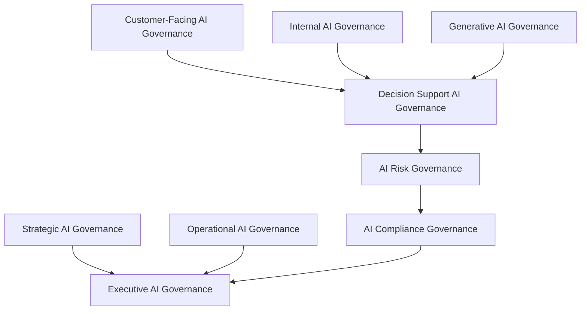
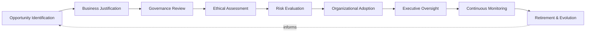
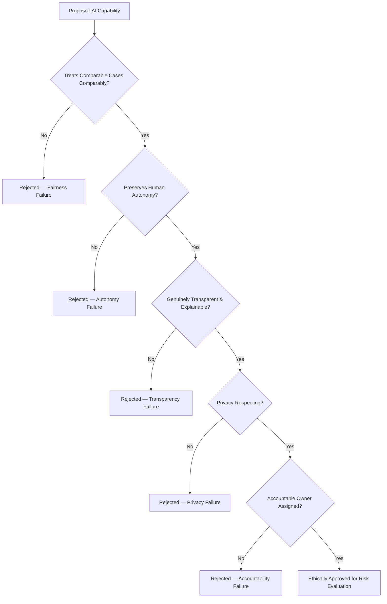
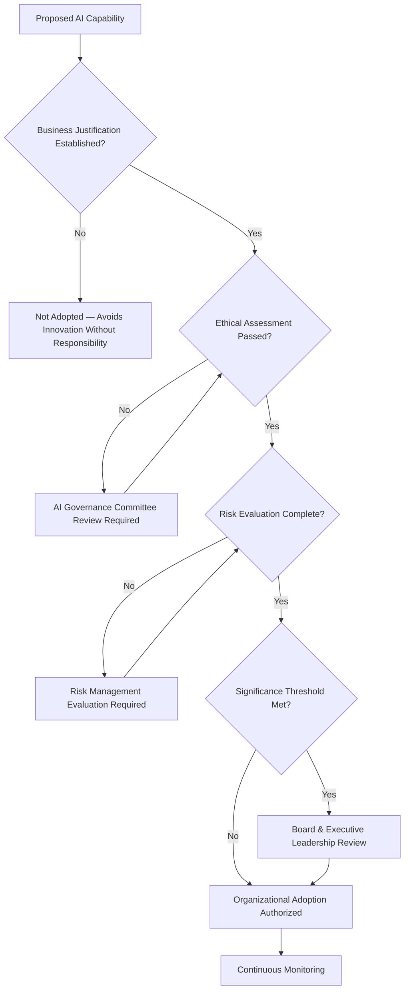
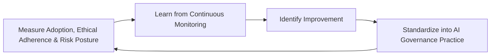
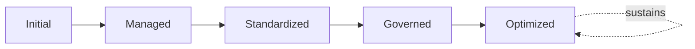

# Enterprise Artificial Intelligence Governance Framework

## 1. Executive Summary

**Purpose** — This document defines the official Enterprise Artificial Intelligence Governance Framework for **StackLeo Tech Store**. It establishes responsible AI, AI ethics, organizational accountability, human oversight, AI lifecycle governance, regulatory readiness, executive oversight, and long-term AI maturity as a deliberate, accountable enterprise discipline. `analytics-strategy.md` and `business-intelligence-framework.md` each anticipated this framework directly, as the dedicated governance treatment of AI-augmented capability referenced in their respective Future Readiness sections. This framework does not restate either. It is the enterprise-wide charter governing how StackLeo introduces, uses, and remains accountable for artificial intelligence across every business function — never a technical specification of a model, algorithm, or platform.

**Scope** — This framework applies to every category of artificial intelligence capability at StackLeo — strategic, operational, customer-facing, internal, decision support, and generative AI — across every business function, coordinated with `data-governance.md`, `analytics-strategy.md`, `business-intelligence-framework.md`, `06_Security/security-governance.md`, `06_Security/privacy-governance.md`, and `06_Security/enterprise-risk-management-strategy.md`.

**Strategic Objectives** — To ensure AI is adopted at StackLeo only where it is genuinely justified by business value; that every AI-influenced outcome remains subject to genuine, meaningful human oversight; that AI is used fairly, transparently, and safely; and that executive leadership and the Board have continuous, honest visibility into the organization's AI posture and accountability.

**Business Value** — Governed AI protects the organization from the disproportionate cost of an ungoverned or unethical AI failure, protects customer and stakeholder trust from opaque or unaccountable automated decisions, and gives leadership the confidence to pursue genuine AI-driven advantage without unknowingly accepting ungoverned risk.

**Intended Audience** — The Board of Directors, executive leadership, the Chief Technology Officer, the AI Governance Committee, engineering leadership, security leadership, legal and compliance functions, risk management, and business stakeholders.

## 2. Enterprise AI Vision

- **AI as Strategic Business Capability** — AI is governed as a genuine strategic capability, deliberately adopted for its business value, never pursued for its own sake.
- **Responsible Innovation** — AI capability is pursued only in a manner consistent with StackLeo's ethical and risk obligations, never at the expense of them.
- **Human-Centered AI** — AI is governed to augment genuine human judgment and capability, never to replace meaningful human accountability.
- **Trusted AI** — AI is governed so that its outcomes are genuinely trustworthy to the customers, employees, and stakeholders who rely on them.
- **Ethical Decision Support** — where AI informs a decision, it is governed to do so ethically, transparently, and in a manner its recipient can genuinely understand.
- **Sustainable Competitive Advantage** — AI, governed and matured responsibly over time, becomes a genuine, durable source of competitive differentiation.
- **Long-Term Organizational Value** — AI investment is governed to produce lasting organizational capability, not merely short-term novelty.

### Enterprise AI Vision Matrix

| Vision Element | Focus | Business Value |
|---|---|---|
| AI as Strategic Business Capability | Deliberately adopted for genuine business value | Prevents AI adoption for its own sake |
| Responsible Innovation | Pursued only consistent with ethical and risk obligations | Protects the organization from avoidable AI-related harm |
| Human-Centered AI | Augments human judgment, never replaces accountability | Preserves genuine human ownership of AI-influenced outcomes |
| Trusted AI | Outcomes genuinely trustworthy to those who rely on them | Protects the trust relationship every AI-touched interaction depends on |
| Ethical Decision Support | Informs decisions ethically, transparently, and understandably | Ensures AI support strengthens, not undermines, sound decisions |
| Sustainable Competitive Advantage | A durable source of differentiation over time | Converts responsible AI maturity into genuine market advantage |
| Long-Term Organizational Value | Produces lasting capability, not short-term novelty | Protects AI investment from being spent on fleeting trends |

## 3. Responsible AI Principles

Responsible AI governance at StackLeo rests on ten principles, each producing a specific business outcome.

- **Human Oversight** — a genuinely accountable human remains able to review, question, and override an AI-influenced outcome. *Business Value:* prevents AI from becoming an unaccountable decision-maker in its own right.
- **Fairness** — AI is governed to treat comparable individuals and situations comparably, without unjustified disparate impact. *Business Value:* protects customer and employee trust from discriminatory or inequitable outcomes.
- **Transparency** — the existence, purpose, and general operation of an AI capability are disclosed to those genuinely affected by it. *Business Value:* protects trust from the corrosive effect of undisclosed automated decision-making.
- **Explainability** — an AI-influenced outcome can be genuinely explained in terms its recipient can understand. *Business Value:* supports confident investigation, dispute resolution, and accountability.
- **Accountability** — every AI capability traces to a specific, named, responsible owner. *Business Value:* ensures no AI capability operates without someone genuinely responsible for it.
- **Privacy by Design** — AI capability is governed to use the minimum necessary personal data, coordinated with `06_Security/privacy-governance.md`. *Business Value:* protects customer trust and regulatory standing from careless data use.
- **Security by Design** — AI capability is governed with security embedded from the outset, coordinated with `06_Security/security-governance.md`. *Business Value:* protects AI capability from becoming a novel attack surface.
- **Safety** — AI capability is governed to avoid genuine harm to people, the business, or the platform, even under unexpected conditions. *Business Value:* protects the organization from the disproportionate cost of an unsafe AI failure.
- **Reliability** — AI capability is governed to perform genuinely consistently within its defined and disclosed scope. *Business Value:* protects confidence that AI-influenced outcomes can be depended upon.
- **Continuous Improvement** — AI governance practice matures over time, informed by real operational and ethical outcomes. *Business Value:* keeps AI governance aligned with the organization's growing scale and the technology's own evolution.

### Responsible AI Principles Matrix

| Principle | Description | Business Value |
|---|---|---|
| Human Oversight | A genuinely accountable human can review and override outcomes | Prevents AI from becoming an unaccountable decision-maker |
| Fairness | Comparable individuals and situations treated comparably | Protects trust from discriminatory or inequitable outcomes |
| Transparency | Existence, purpose, and operation disclosed to those affected | Protects trust from undisclosed automated decision-making |
| Explainability | Outcomes explainable in terms the recipient can understand | Supports confident investigation and accountability |
| Accountability | Every capability traces to a specific, named, responsible owner | Ensures no capability operates without genuine responsibility |
| Privacy by Design | Minimum necessary personal data used | Protects customer trust and regulatory standing |
| Security by Design | Security embedded from the outset | Protects AI capability from becoming a novel attack surface |
| Safety | Avoids genuine harm even under unexpected conditions | Protects against the disproportionate cost of an unsafe failure |
| Reliability | Performs genuinely consistently within defined scope | Protects confidence that outcomes can be depended upon |
| Continuous Improvement | Practice matures from real operational and ethical outcomes | Keeps governance aligned with growing scale and technology evolution |

## 4. Enterprise AI Governance Model

AI governance operates across nine conceptual domains, each holding accountability for a distinct category of AI capability.

### Strategic AI Governance

- **Purpose** — govern AI capability adopted in pursuit of StackLeo's long-term strategic direction.
- **Governance Scope** — oversight coordinated with `01_Business/objectives.md` and Strategic Intelligence (`business-intelligence-framework.md`, Section 4).
- **Business Value** — ensures strategic AI investment is genuinely connected to organizational direction.
- **Executive Expectations** — leadership expects strategic AI governance to be reviewed with the same rigor as any other strategic investment.

### Operational AI Governance

- **Purpose** — govern AI capability supporting genuine day-to-day operational activity.
- **Governance Scope** — oversight coordinated with Operational Intelligence (`business-intelligence-framework.md`, Section 4).
- **Business Value** — protects the organization's ability to genuinely operate AI-touched processes reliably.
- **Executive Expectations** — leadership expects operational AI to be governed with the same rigor as any operational system.

### Customer-Facing AI Governance

- **Purpose** — govern AI capability that genuinely interacts with, or influences an outcome for, a customer.
- **Governance Scope** — oversight held to elevated rigor given direct customer impact, coordinated with `01_Business/vision.md`.
- **Business Value** — protects the trust relationship every customer interaction depends on.
- **Executive Expectations** — leadership expects customer-facing AI to be transparent, fair, and genuinely explainable to the customer it affects.

### Internal AI Governance

- **Purpose** — govern AI capability used internally to support employees and business functions.
- **Governance Scope** — oversight coordinated with the accountable business function for each internal use.
- **Business Value** — protects employees from opaque or unaccountable internal automated decisions.
- **Executive Expectations** — leadership expects internal AI to be governed to the same standard as customer-facing AI.

### Decision Support AI Governance

- **Purpose** — govern AI capability that informs, without independently making, a genuinely consequential human decision.
- **Governance Scope** — oversight coordinated with Executive Decision Support (`business-intelligence-framework.md`, Section 5).
- **Business Value** — protects the integrity of decisions AI is used to inform.
- **Executive Expectations** — leadership expects decision support AI to remain genuinely advisory, never a substitute for accountable judgment.

### Generative AI Governance

- **Purpose** — govern AI capability that generates genuinely novel content, text, or recommendation.
- **Governance Scope** — oversight held to elevated rigor given the distinct risk of generative inaccuracy or inappropriate output.
- **Business Value** — protects the organization from the reputational and factual risk of ungoverned generated content.
- **Executive Expectations** — leadership expects generated content to be genuinely reviewed before it reaches a customer or a consequential decision.

### AI Risk Governance

- **Purpose** — own the coherence of how AI-specific risk, defined in Section 9, is identified and governed.
- **Governance Scope** — oversight spanning every domain above, coordinated with `06_Security/enterprise-risk-management-strategy.md`.
- **Business Value** — ensures AI risk is governed as a single coherent discipline, not fragmented across use cases.
- **Executive Expectations** — leadership trusts no AI risk exists outside this framework's visibility.

### AI Compliance Governance

- **Purpose** — govern AI capability's adherence to genuine regulatory and contractual obligation.
- **Governance Scope** — oversight coordinated with `06_Security/compliance-governance.md` and Legal & Compliance (Section 8).
- **Business Value** — protects the organization's standing with regulators as AI-specific regulation matures.
- **Executive Expectations** — leadership expects AI compliance posture to be genuinely current, not merely historically accurate.

### Executive AI Governance

- **Purpose** — govern the synthesized, executive- and Board-relevant picture of AI posture across every domain above.
- **Governance Scope** — oversight exclusively accountable for converging every domain into one coherent enterprise picture.
- **Business Value** — protects leadership's and the Board's ability to understand overall AI posture as a whole.
- **Executive Expectations** — leadership expects one coherent AI governance picture, not nine disconnected domain views.

### AI Governance Matrix

| Domain | Purpose | Business Value | Executive Expectations |
|---|---|---|---|
| Strategic AI Governance | Govern AI in pursuit of long-term strategic direction | Ensures investment is genuinely connected to direction | Expects rigor equal to any strategic investment |
| Operational AI Governance | Govern AI supporting day-to-day operational activity | Protects the ability to reliably operate AI-touched processes | Expects rigor equal to any operational system |
| Customer-Facing AI Governance | Govern AI that interacts with or affects a customer | Protects the trust relationship every interaction depends on | Expects transparency, fairness, and explainability |
| Internal AI Governance | Govern AI supporting employees and business functions | Protects employees from opaque, unaccountable decisions | Expects the same standard as customer-facing AI |
| Decision Support AI Governance | Govern AI informing, not making, consequential decisions | Protects the integrity of decisions AI is used to inform | Expects AI to remain genuinely advisory |
| Generative AI Governance | Govern AI generating genuinely novel content | Protects against reputational and factual risk | Expects genuine review before customer or decision reach |
| AI Risk Governance | Own coherence of AI-specific risk identification | Ensures AI risk is a single coherent discipline | Trusts no AI risk exists outside this framework |
| AI Compliance Governance | Govern AI adherence to regulatory obligation | Protects standing with regulators as regulation matures | Expects genuinely current compliance posture |
| Executive AI Governance | Synthesize the enterprise AI posture picture | Protects leadership's and the Board's ability to understand posture | Expects one coherent picture, not nine disconnected views |

*Diagram 1: Enterprise AI Governance Framework — strategic and operational AI governance, customer-facing, internal, and generative AI governance converge through decision support AI governance into AI risk and compliance governance, resolving into executive AI governance's single enterprise picture.*

## 5. AI Capability Domains

AI capability is governed across nine conceptual domains, each requiring a distinct governance emphasis. Remaining implementation independent, these domains describe what AI is used for — never which model, algorithm, or platform provides it.

- **Decision Intelligence** — governs AI capability that informs a genuine business decision, coordinated with `business-intelligence-framework.md`.
- **Knowledge Assistance** — governs AI capability that helps a human genuinely locate or synthesize organizational knowledge.
- **Process Automation** — governs AI capability that performs a genuinely repeatable business process on a human's behalf.
- **Customer Experience Enhancement** — governs AI capability that genuinely improves the customer's experience of the platform.
- **Business Intelligence Augmentation** — governs AI capability that extends the analytical and reporting capability governed in `analytics-strategy.md` and `reporting-governance.md`.
- **Risk Intelligence** — governs AI capability that supports genuine understanding of organizational risk exposure.
- **Operational Intelligence** — governs AI capability that supports genuine day-to-day operational understanding.
- **Innovation Enablement** — governs AI capability that surfaces genuine new opportunity for the business.
- **Organizational Learning** — governs AI capability that deepens the organization's genuine collective understanding over time.

### AI Capability Matrix

| Capability | Governance Focus | Coordination |
|---|---|---|
| Decision Intelligence | Informing a genuine business decision | `business-intelligence-framework.md` |
| Knowledge Assistance | Helping a human locate or synthesize knowledge | Internal AI Governance (Section 4) |
| Process Automation | Performing a repeatable business process | Operational AI Governance (Section 4) |
| Customer Experience Enhancement | Genuinely improving customer platform experience | Customer-Facing AI Governance (Section 4) |
| Business Intelligence Augmentation | Extending analytical and reporting capability | `analytics-strategy.md`, `reporting-governance.md` |
| Risk Intelligence | Supporting understanding of risk exposure | AI Risk Governance (Section 4) |
| Operational Intelligence | Supporting day-to-day operational understanding | Operational AI Governance (Section 4) |
| Innovation Enablement | Surfacing genuine new business opportunity | Strategic AI Governance (Section 4) |
| Organizational Learning | Deepening collective understanding over time | Continuous Improvement (Section 3) |

## 6. AI Lifecycle Governance

AI governance operates across nine conceptual lifecycle stages.

- **Opportunity Identification** — govern how a genuine AI opportunity is recognized before capability is pursued.
- **Business Justification** — govern how an identified opportunity's genuine business value is established.
- **Governance Review** — govern how a justified opportunity is reviewed against the appropriate domain in Section 4.
- **Ethical Assessment** — govern how a reviewed capability is assessed against the AI Ethics Framework (Section 7).
- **Risk Evaluation** — govern how a capability's genuine risk exposure is evaluated before adoption.
- **Organizational Adoption** — govern how an approved capability is genuinely adopted into organizational practice.
- **Executive Oversight** — govern the point at which a capability requires executive- or Board-level visibility.
- **Continuous Monitoring** — govern how an adopted capability is continuously observed for genuine performance and ethical alignment.
- **Retirement & Evolution** — govern the periodic reassessment of whether a capability remains genuinely justified, and its deliberate retirement when it no longer is.

### AI Lifecycle Matrix

| Stage | Governance Objective | Business Value |
|---|---|---|
| Opportunity Identification | Recognize a genuine AI opportunity | Ensures AI effort is deliberately directed |
| Business Justification | Establish genuine business value | Protects investment from being spent on unjustified adoption |
| Governance Review | Review against the appropriate domain | Ensures review by the genuinely accountable function |
| Ethical Assessment | Assess against the AI Ethics Framework | Prevents ethically unsound capability from proceeding unexamined |
| Risk Evaluation | Evaluate genuine risk exposure before adoption | Ensures risk is deliberately weighed, not silently accepted |
| Organizational Adoption | Adopt an approved capability into practice | Ensures investment converts into genuine organizational use |
| Executive Oversight | Elevate capability requiring executive or Board visibility | Engages leadership exactly when genuinely warranted |
| Continuous Monitoring | Observe performance and ethical alignment continuously | Detects drift while it can still be addressed |
| Retirement & Evolution | Reassess justification and retire deliberately | Prevents accumulation of stale or unjustified capability |

*Diagram 2: AI Lifecycle Governance Model — opportunity identification and business justification inform governance review, ethical assessment, and risk evaluation, feeding organizational adoption and executive oversight, with continuous monitoring and deliberate retirement feeding lessons back into the cycle.*

## 7. AI Ethics Framework

- **Fairness** — govern AI capability to treat comparable individuals and situations comparably, without unjustified disparate impact.
- **Bias Awareness** — govern explicit, ongoing awareness of the potential for an AI capability's training basis or design to produce a distorted outcome.
- **Human Autonomy** — govern AI capability to preserve, never erode, the genuine autonomy of the humans it affects.
- **Transparency** — govern the disclosure of an AI capability's existence, purpose, and general operation to those genuinely affected by it.
- **Explainability** — govern an AI-influenced outcome's ability to be genuinely explained in terms its recipient can understand.
- **Privacy** — govern AI capability's use of personal data to the minimum genuinely necessary, coordinated with `06_Security/privacy-governance.md`.
- **Accountability** — govern every AI capability's traceability to a specific, named, responsible owner.
- **Responsible Innovation** — govern the adoption of new AI capability only in a manner consistent with this ethics framework, never at its expense.
- **Social Responsibility** — govern AI capability with explicit awareness of its broader effect on employees, customers, and the community StackLeo serves.

### AI Ethics Matrix

| Ethics Area | Governance Objective | Coordination |
|---|---|---|
| Fairness | Comparable individuals and situations treated comparably | Fairness (Section 3) |
| Bias Awareness | Ongoing awareness of the potential for distorted outcomes | Ethical Assessment (Section 6) |
| Human Autonomy | Preserves, never erodes, the autonomy of those affected | Human Oversight (Section 3) |
| Transparency | Existence, purpose, and operation disclosed | Transparency (Section 3) |
| Explainability | Outcomes explainable in terms the recipient can understand | Explainability (Section 3) |
| Privacy | Minimum genuinely necessary personal data use | `06_Security/privacy-governance.md` |
| Accountability | Traceability to a specific, named, responsible owner | Accountability (Section 3) |
| Responsible Innovation | Adoption consistent with this ethics framework | Opportunity Identification (Section 6) |
| Social Responsibility | Awareness of broader effect on employees, customers, community | Executive AI Governance (Section 4) |

*Diagram 3: Responsible AI Governance Structure — a proposed AI capability is evaluated in sequence against fairness, human autonomy, transparency and explainability, privacy, and assigned accountability, proceeding to risk evaluation only once every ethical criterion is genuinely satisfied.*

## 8. Organizational Governance

Governance accountability is distributed deliberately across nine organizational roles.

- **Board of Directors** — holds ultimate accountability for StackLeo's overall AI posture and its alignment with organizational values.
- **Executive Leadership** — holds accountability for whether AI genuinely serves the business responsibly, in partnership with the Board.
- **Chief Technology Officer** — owns the coherence and enforcement of this framework across every AI domain and governance layer it defines.
- **AI Governance Committee** — owns the operational review of AI capability against Sections 4, 6, and 7 of this framework.
- **Engineering Leadership** — owns Operational and Internal AI Governance (Section 4) within their accountable teams.
- **Security Leadership** — owns Security by Design (Section 3) jointly with `06_Security/security-governance.md`, which remains authoritative for security-specific obligations.
- **Legal & Compliance** — own AI Compliance Governance (Section 4) jointly with `06_Security/compliance-governance.md`.
- **Risk Management** — owns AI Risk Governance (Section 4) jointly with `06_Security/enterprise-risk-management-strategy.md`.
- **Business Stakeholders** — own the business justification and adoption of AI capability within their accountable domain.

### Organizational Responsibility Matrix

| Role | Governance Objective | Business Value |
|---|---|---|
| Board of Directors | Hold ultimate accountability for overall AI posture | Provides the highest point of ultimate accountability |
| Executive Leadership | Hold accountability for AI serving the business responsibly | Provides a single point of executive-level accountability |
| Chief Technology Officer | Own coherence and enforcement of this framework | Provides a single point of specialist accountability |
| AI Governance Committee | Own operational review against Sections 4, 6, and 7 | Provides a dedicated, cross-functional review body |
| Engineering Leadership | Own operational and internal AI governance | Embeds accountability closest to where capability is built |
| Security Leadership | Own security by design jointly with security governance | Ensures AI is never a novel, ungoverned attack surface |
| Legal & Compliance | Own AI compliance governance | Ensures AI genuinely meets regulatory obligation |
| Risk Management | Own AI risk governance | Ensures AI risk is genuinely identified and weighed |
| Business Stakeholders | Own business justification and adoption within their domain | Connects AI capability to genuine business relevance |

*Diagram 4: AI Decision Oversight Flow — a proposed AI capability is checked for business justification, ethical assessment, and risk evaluation, escalating to Board and executive leadership review where significance thresholds are met, resolving into authorized adoption and continuous monitoring.*

## 9. AI Risk Governance

AI-related risk is governed across eight conceptual categories.

- **Ethical Risks** — the risk that an AI capability produces a genuinely unethical outcome despite passing formal review.
- **Bias Risks** — the risk that an AI capability's basis or design produces a systematically distorted outcome for a particular group.
- **Privacy Risks** — the risk that an AI capability uses or exposes personal data beyond what is genuinely necessary.
- **Security Risks** — the risk that an AI capability introduces or is exploited as a novel security weakness.
- **Compliance Risks** — the risk that an AI capability fails to meet a genuine, and increasingly evolving, regulatory or contractual obligation.
- **Operational Risks** — the risk that an AI capability behaves unreliably or unpredictably in genuine production conditions.
- **Reputational Risks** — the risk that an AI-related failure or controversy damages StackLeo's standing with customers, partners, or the market.
- **Strategic Risks** — the risk that the organization either over-adopts AI without genuine justification, or under-adopts it and forfeits genuine competitive advantage.

### AI Risk Governance Matrix

| Risk Category | Focus | Governance Coordination |
|---|---|---|
| Ethical Risks | Genuinely unethical outcome despite formal review | Coordinated with AI Ethics Framework (Section 7) |
| Bias Risks | Systematically distorted outcome for a particular group | Coordinated with Fairness and Bias Awareness (Section 7) |
| Privacy Risks | Personal data used or exposed beyond genuine necessity | Coordinated with `06_Security/privacy-governance.md` |
| Security Risks | AI introducing or exploited as a novel weakness | Coordinated with `06_Security/security-governance.md` |
| Compliance Risks | Failure to meet evolving regulatory obligation | Coordinated with `06_Security/compliance-governance.md` |
| Operational Risks | Unreliable or unpredictable production behavior | Coordinated with Reliability (Section 3) |
| Reputational Risks | Damage to standing with customers, partners, market | Coordinated with Executive AI Governance (Section 4) |
| Strategic Risks | Over-adoption without justification, or under-adoption | Coordinated with Strategic AI Governance (Section 4) |

## 10. Executive Oversight

- **Executive AI Reviews** — the overall coherence of AI governance is formally reviewed directly with executive leadership and the Board on a regular cadence.
- **AI Ethics Reviews** — AI capability's adherence to the Ethics Framework (Section 7) is periodically reviewed with executive leadership.
- **AI Risk Reviews** — AI-specific risk posture is reviewed directly with executive leadership and risk management.
- **Governance Reporting** — aggregated AI governance health — adoption, ethical adherence, risk posture — is reported to executive leadership and the Board.
- **Business Value Reviews** — the genuine business value realized from AI investment is periodically reviewed with executive leadership.
- **Continuous Improvement Reviews** — the organization's follow-through on captured AI governance lessons is reviewed directly with executive leadership.

### Executive Oversight Matrix

| Oversight Mechanism | Purpose | Governance Role |
|---|---|---|
| Executive AI Reviews | Confirm overall AI governance coherence | Regular, predictable cadence for the framework as a whole |
| AI Ethics Reviews | Review adherence to the AI Ethics Framework | Periodic executive-level ethical adherence review |
| AI Risk Reviews | Review AI-specific risk posture | Direct executive-level and risk management review |
| Governance Reporting | Provide leadership a single, coherent AI governance picture | Reports adoption, ethical adherence, risk posture |
| Business Value Reviews | Review genuine business value realized from investment | Periodic executive-level value review |
| Continuous Improvement Reviews | Review follow-through on captured lessons | Direct executive-level review of improvement completion |

## 11. Future Readiness

This framework is designed to remain valid as StackLeo evolves in scale, geography, and organizational complexity.

- **Enterprise AI at Scale** — the governance model, domains, and lifecycle defined throughout this framework are defined independently of organizational size or the volume of AI capability adopted.
- **Multi-Agent Governance (Conceptual)** — where AI capability increasingly operates as multiple coordinating agents rather than a single system, that capability remains governed under Generative and Decision Support AI Governance (Section 4) at the same rigor as any other capability.
- **AI-Assisted Decision Making** — as decision support capability matures, it remains governed under Decision Support AI Governance (Section 4), never permitted to substitute for genuine human accountability.
- **Autonomous Enterprise Functions (Conceptual)** — where automation increasingly performs steps within a broader business function, that automation remains subject to the same Human Oversight principle (Section 3) as any other AI capability.
- **Global Regulatory Readiness** — AI Compliance Governance (Section 4) is structured to be re-applied as StackLeo expands from Bangladesh into South Asia and global markets, each with genuinely distinct and evolving AI-specific regulation.
- **Responsible Innovation** — new AI capability is adopted only in a manner consistent with the AI Ethics Framework (Section 7), never at its expense.
- **Sustainable AI Governance** — this framework's governance discipline is treated as a direct, durable contributor to the digital trust customers, partners, and regulators extend to StackLeo.

## 12. AI Governance Maturity Model

AI governance maturity is described across five conceptual levels.

- **Initial** — AI adoption, where it exists, is informal and inconsistent; capability is introduced reactively, and ownership is unclear.
- **Managed** — basic AI governance exists for individual domains, but consistency across the nine domains in Section 4 varies significantly.
- **Standardized** — the governance model, domains, and lifecycle are standardized, documented, and consistently applied across the organization.
- **Governed** — AI capability is consistently and rigorously governed across ethics, risk, and compliance, with genuine executive and Board visibility.
- **Optimized** — AI governance is continuously and deliberately improved based on quantitative evidence and organizational learning; improvement itself is a managed, ongoing discipline.

### AI Governance Maturity Matrix

| Level | Characteristics | Primary Focus |
|---|---|---|
| Initial | Informal, inconsistent adoption; capability introduced reactively | Ad hoc, individually-dependent AI practice |
| Managed | Basic governance exists per domain; consistency varies | Domain-level consistency |
| Standardized | Standardized governance model, domains, and lifecycle | Organization-wide consistency and clear ownership |
| Governed | Rigorous governance across ethics, risk, and compliance | Genuine executive and Board visibility |
| Optimized | Practice continuously and deliberately improved from evidence | Sustained, deliberate improvement as a discipline |

*Diagram 5: Continuous AI Governance Improvement Cycle — adoption, ethical adherence, and risk posture are measured, learned from, improved upon, and standardized back into governed practice, on a continuing basis.*

*Diagram 6: AI Governance Maturity Progression — maturity advances from informal, reactively-introduced AI practice toward standardized, rigorously governed, and continuously optimized AI governance.*

## 13. AI Governance Anti-Patterns

- **AI Without Governance** — adopting AI capability without genuine governance review accepts avoidable exposure without an accountable decision behind it.
- **AI Without Human Oversight** — allowing an AI-influenced outcome to proceed without a genuinely accountable human able to review or override it forfeits the Human Oversight principle entirely.
- **Black-Box Decision Making** — deploying AI capability whose outcomes cannot be genuinely explained undermines accountability and trust.
- **Uncontrolled AI Adoption** — allowing AI capability to be introduced outside this framework's review accumulates as ungoverned, unaccountable sprawl.
- **Weak Accountability** — an AI capability with no accountable owner has no one genuinely responsible for its outcomes.
- **Ethical Blind Spots** — evaluating AI capability purely on technical or business grounds, without genuine ethical assessment, produces decisions disconnected from real consequence.
- **Compliance Neglect** — failing to track evolving AI-specific regulatory obligation leaves the organization exposed as regulation matures.
- **Innovation Without Responsibility** — pursuing AI capability for competitive advantage without proportionate governance trades away durable trust for short-term novelty.

### Anti-Pattern Summary

| Anti-Pattern | Organizational & Business Impact |
|---|---|
| AI Without Governance | Accepts avoidable exposure without any accountable decision behind it |
| AI Without Human Oversight | Forfeits the Human Oversight principle entirely |
| Black-Box Decision Making | Undermines accountability and trust in AI-influenced outcomes |
| Uncontrolled AI Adoption | Accumulates as ungoverned, unaccountable sprawl |
| Weak Accountability | Leaves no one genuinely responsible for AI outcomes |
| Ethical Blind Spots | Produces decisions disconnected from real ethical consequence |
| Compliance Neglect | Leaves the organization exposed as regulation matures |
| Innovation Without Responsibility | Trades away durable trust for short-term novelty |

## Related Documents

| Document | Relationship |
|---|---|
| `data-governance.md` | Governs the ownership, classification, and quality of the data this framework's AI capability is ultimately built upon. |
| `analytics-strategy.md` | Anticipated this framework's governance of AI-augmented analytics; this framework governs that capability's ethics, risk, and oversight. |
| `reporting-governance.md` | Governs the distributed report form through which AI-assisted reporting, anticipated in its Future Readiness, is delivered. |
| `business-intelligence-framework.md` | Anticipated this framework's governance of AI-augmented business intelligence; consumes Decision Intelligence (Section 5) as an input. |
| `ml-governance.md` | The model-specific elaboration of this framework, applying its ethics and oversight structure with model risk, validation, and documentation rigor. |
| `data-quality-framework.md` | Governs the AI/ML Data Quality this framework's Risk Evaluation (Section 6) coordinates with, alongside `04_Database/data-quality-governance.md`. |
| `06_Security/privacy-governance.md` | Governs the privacy discipline this framework's Privacy by Design principle (Section 3) depends on. |
| `06_Security/security-governance.md` | Governs the security discipline this framework's Security by Design principle (Section 3) depends on. |
| `06_Security/enterprise-risk-management-strategy.md` | Governs the enterprise risk discipline this framework's AI Risk Governance (Section 4) is the AI-specific instantiation of. |

## Document Information

| Property | Value |
|----------|-------|
| Document | ai-governance.md |
| Version | 1.0.0 |
| Status | Active |
| Maintained By | StackLeo |
| Last Updated | 2026-07-28 |

---

© StackLeo. All Rights Reserved.
