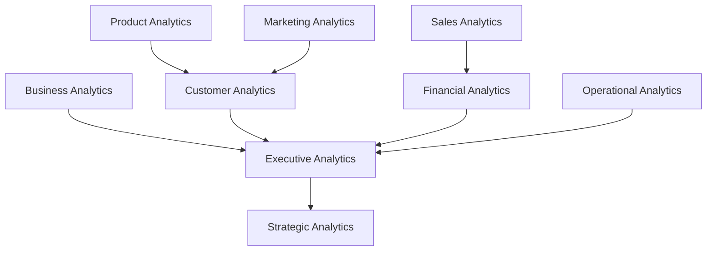
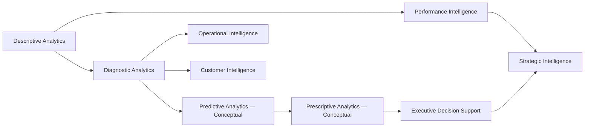
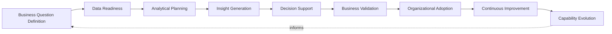
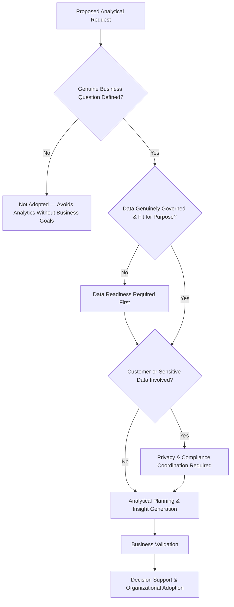
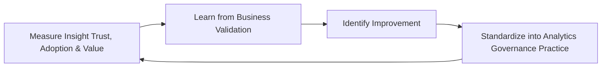
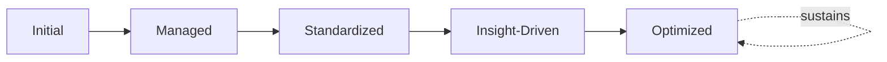

# Enterprise Analytics Strategy

## 1. Executive Summary

**Purpose** — This document defines the official Enterprise Analytics Strategy for **StackLeo Tech Store**. It establishes analytics governance, decision intelligence, business value realization, analytical capabilities, organizational accountability, executive oversight, and long-term analytics maturity as a deliberate, accountable enterprise discipline. `data-governance.md` governs the data analytics ultimately depends on — ownership, classification, quality, and lifecycle. `metrics-governance.md` governs the individual metric as a unit of measurement. This strategy sits above both, at the point where governed data and governed metrics are converted into genuine business insight and decision intelligence. It does not restate data governance or metrics governance — it is the strategy for how StackLeo converts what it measures into what it decides.

**Scope** — This strategy applies to every category of analytics produced or consumed across StackLeo — business, product, customer, sales, marketing, financial, operational, executive, and strategic analytics — across every business function, coordinated with `data-governance.md`, `data-quality-governance.md`, and `metrics-governance.md`.

**Strategic Objectives** — To ensure analytics genuinely begins from a real business question, not from whatever data happens to be available; that insight produced is trustworthy, actionable, and free of misleading distortion; that analytical investment demonstrably informs genuine decisions; and that executive leadership has continuous, honest visibility into the value analytics delivers to the business.

**Business Value** — Governed analytics protects the organization's ability to make decisions grounded in genuine evidence rather than impression, protects analytical investment from being spent on insight no one acts upon, and gives leadership confidence that reported intelligence is trustworthy, ethically produced, and genuinely informs how StackLeo competes.

**Intended Audience** — Executive leadership, the Chief Technology Officer, business leadership, product leadership, engineering leadership, analytics leadership, business stakeholders, and compliance leadership.

## 2. Enterprise Analytics Vision

- **Analytics as Strategic Capability** — analytics is governed as a genuine strategic capability, never merely a technical or reporting convenience.
- **Data-Driven Decision Making** — analytics exists to be acted upon; strategy ensures every analytical investment genuinely informs a decision someone is accountable for making.
- **Business Performance Optimization** — analytics gives the organization the evidence to understand and improve genuine business performance.
- **Customer Intelligence** — analytics deepens the organization's genuine understanding of customer behavior, need, and experience.
- **Operational Excellence** — analytics gives operational leadership the evidence-based understanding day-to-day excellence depends on.
- **Innovation Enablement** — analytics surfaces the genuine opportunity and evidence that responsible innovation depends on.
- **Sustainable Competitive Advantage** — analytics, governed and matured over time, becomes a genuine, durable source of competitive differentiation.

### Enterprise Analytics Vision Matrix

| Vision Element | Focus | Business Value |
|---|---|---|
| Analytics as Strategic Capability | Genuine strategic capability, not a reporting convenience | Prevents analytics from being treated as a low-priority afterthought |
| Data-Driven Decision Making | Every investment genuinely informs an accountable decision | Converts analytical effort into genuine decision value |
| Business Performance Optimization | Evidence to understand and improve genuine performance | Connects analytics directly to measurable business outcome |
| Customer Intelligence | Deepens genuine understanding of customer behavior and need | Keeps analytics grounded in what customers actually experience |
| Operational Excellence | Evidence-based understanding for day-to-day excellence | Supports genuinely informed operational decisions |
| Innovation Enablement | Surfaces genuine opportunity and evidence | Supports responsible, evidence-grounded innovation |
| Sustainable Competitive Advantage | A durable source of differentiation over time | Converts analytics maturity into genuine market advantage |

## 3. Analytics Principles

Analytics governance at StackLeo rests on nine principles, each producing a specific business outcome.

- **Business-First Analytics** — analytical work begins from a genuine business question, never from data availability alone. *Business Value:* ensures analytical effort is spent on what genuinely matters to the business.
- **Trusted Insights** — an insight is trusted to genuinely and reliably reflect what the underlying data shows. *Business Value:* protects the credibility of every decision that relies on it.
- **Actionable Intelligence** — analytics is governed to produce insight leading to genuine action, not passive observation alone. *Business Value:* ensures analytical investment converts into genuine organizational response.
- **Transparency** — analytical methods, data sources, and assumptions are documented and visible to those who genuinely need them. *Business Value:* allows reported insight to be scrutinized and defended, not merely trusted on faith.
- **Accountability** — every analytics domain traces to a specific, named, responsible owner. *Business Value:* ensures no analytics domain drifts without someone genuinely responsible for it.
- **Consistency** — analytical definitions and methods mean the same thing wherever they are applied, coordinated with `metrics-governance.md`. *Business Value:* prevents the same label from concealing incompatible analysis.
- **Ethical Analytics** — analytics is governed with explicit awareness of its potential for bias, misuse, or unintended harm. *Business Value:* protects customer trust and the organization's standing from irresponsible analytical practice.
- **Continuous Learning** — every analytical effort, whether it confirms or challenges expectation, deepens the organization's genuine collective understanding. *Business Value:* converts analytical experience into durable organizational capability.
- **Continuous Improvement** — analytics governance practice matures over time, informed by real decision and business outcomes. *Business Value:* keeps analytics aligned with the organization's growing scale and complexity.

### Analytics Principles Matrix

| Principle | Description | Business Value |
|---|---|---|
| Business-First Analytics | Begins from a genuine business question, not data availability | Ensures effort is spent on what genuinely matters to the business |
| Trusted Insights | Genuinely and reliably reflects what the underlying data shows | Protects credibility of every decision relying on it |
| Actionable Intelligence | Produces insight leading to genuine action | Ensures investment converts into genuine organizational response |
| Transparency | Methods, sources, and assumptions documented and visible | Allows reported insight to be scrutinized and defended |
| Accountability | Every domain traces to a specific, named, responsible owner | Ensures no domain drifts without genuine responsibility |
| Consistency | Definitions and methods mean the same thing wherever applied | Prevents the same label from concealing incompatible analysis |
| Ethical Analytics | Explicit awareness of bias, misuse, or unintended harm | Protects customer trust and the organization's standing |
| Continuous Learning | Every effort deepens genuine collective understanding | Converts analytical experience into durable capability |
| Continuous Improvement | Practice matures from real decision and business outcomes | Keeps analytics aligned with growing scale and complexity |

## 4. Enterprise Analytics Governance Model

Analytics governance operates across nine conceptual domains, each holding accountability for a distinct category of business insight.

### Business Analytics

- **Purpose** — govern analysis of overall commercial and business-model performance.
- **Governance Scope** — oversight coordinated with `01_Business/business-model.md` and `01_Business/objectives.md`.
- **Business Value** — connects analytical insight directly to genuine business consequence.
- **Executive Expectations** — leadership expects business analytics to answer genuine business questions, not proxy for them.

### Product Analytics

- **Purpose** — govern analysis of how the product is genuinely adopted, used, and valued.
- **Governance Scope** — oversight coordinated with Product Metrics (`metrics-governance.md`, Section 4).
- **Business Value** — protects the ability to understand whether the product is genuinely succeeding with customers.
- **Executive Expectations** — leadership expects product analytics to reflect genuine usage and value.

### Customer Analytics

- **Purpose** — govern analysis of genuine customer behavior, need, and experience.
- **Governance Scope** — oversight coordinated with `06_Security/privacy-governance.md`, given the sensitivity of customer-level analysis.
- **Business Value** — deepens the organization's genuine understanding of the customer relationship.
- **Executive Expectations** — leadership expects customer analytics to balance genuine insight against privacy responsibility.

### Sales Analytics

- **Purpose** — govern analysis of genuine sales performance and commercial trend.
- **Governance Scope** — oversight coordinated with Business Analytics (above) and Financial Analytics (below).
- **Business Value** — protects confidence in the organization's understanding of its own revenue drivers.
- **Executive Expectations** — leadership expects sales analytics to explain genuine performance, not merely report volume.

### Marketing Analytics

- **Purpose** — govern analysis of genuine marketing effectiveness and customer acquisition.
- **Governance Scope** — oversight coordinated with Customer Analytics (above).
- **Business Value** — protects the organization's ability to invest marketing spend where it is genuinely effective.
- **Executive Expectations** — leadership expects marketing analytics to demonstrate genuine return, not only activity.

### Financial Analytics

- **Purpose** — govern analysis of genuine financial performance and business health.
- **Governance Scope** — oversight held to the highest integrity standard in this model, coordinated with finance function accountability.
- **Business Value** — protects the trustworthiness of the organization's most consequential business decisions.
- **Executive Expectations** — leadership expects financial analytics to be unimpeachably accurate and independently defensible.

### Operational Analytics

- **Purpose** — govern analysis of genuine day-to-day operational performance.
- **Governance Scope** — oversight coordinated with Operational Metrics (`metrics-governance.md`, Section 4).
- **Business Value** — protects the organization's ability to genuinely understand how it operates.
- **Executive Expectations** — leadership expects operational analytics to support timely, informed operational decisions.

### Executive Analytics

- **Purpose** — govern the synthesized, executive-relevant picture of analytical insight across every domain in this model.
- **Governance Scope** — oversight exclusively accountable for converging every domain into one coherent enterprise picture.
- **Business Value** — protects leadership's ability to understand overall business performance as a whole, not domain by domain.
- **Executive Expectations** — leadership expects one coherent analytical picture, not nine disconnected domain views.

### Strategic Analytics

- **Purpose** — govern analysis supporting StackLeo's long-term strategic direction and competitive position.
- **Governance Scope** — oversight coordinated with Executive Analytics (above) and `01_Business/objectives.md`.
- **Business Value** — connects day-to-day analytical work to genuine long-term organizational direction.
- **Executive Expectations** — leadership expects strategic analytics to be reviewed with the same rigor as quarterly business performance.

### Analytics Governance Matrix

| Domain | Purpose | Business Value | Executive Expectations |
|---|---|---|---|
| Business Analytics | Govern analysis of commercial and business-model performance | Connects analytical insight to genuine business consequence | Expects analytics to answer genuine business questions |
| Product Analytics | Govern analysis of product adoption, usage, and value | Protects ability to understand genuine product success | Expects reflection of genuine usage and value |
| Customer Analytics | Govern analysis of customer behavior, need, and experience | Deepens genuine understanding of the customer relationship | Expects balance against privacy responsibility |
| Sales Analytics | Govern analysis of sales performance and commercial trend | Protects confidence in understanding revenue drivers | Expects explanation of performance, not just volume |
| Marketing Analytics | Govern analysis of marketing effectiveness and acquisition | Protects ability to invest spend where genuinely effective | Expects demonstrated return, not only activity |
| Financial Analytics | Govern analysis of financial performance and business health | Protects trustworthiness of the most consequential decisions | Expects unimpeachable accuracy and defensibility |
| Operational Analytics | Govern analysis of day-to-day operational performance | Protects the ability to genuinely understand operations | Expects support for timely, informed decisions |
| Executive Analytics | Synthesize the enterprise analytical picture | Protects leadership's ability to understand performance as a whole | Expects one coherent picture, not nine disconnected views |
| Strategic Analytics | Govern analysis supporting long-term strategic direction | Connects analytical work to genuine long-term direction | Expects rigor equal to quarterly business performance |

*Diagram 1: Enterprise Analytics Strategy Framework — business analytics converges with product and customer analytics, sales and marketing analytics feed financial and customer analytics, and financial and operational analytics converge on executive analytics, which synthesizes every domain into StackLeo's strategic analytics picture.*

## 5. Analytics Capability Framework

Analytics capability is governed across nine conceptual categories, each requiring a distinct governance emphasis. Remaining implementation independent, this framework classifies analytical capability by the question it answers — never by tool, platform, or algorithm.

- **Descriptive Analytics** — governs analysis answering what genuinely happened.
- **Diagnostic Analytics** — governs analysis answering why something genuinely happened.
- **Predictive Analytics (Conceptual)** — governs analysis answering what is genuinely likely to happen, as this capability matures.
- **Prescriptive Analytics (Conceptual)** — governs analysis answering what should genuinely be done in response, as this capability matures.
- **Executive Decision Support** — governs how analytical capability is converged into support for leadership's most consequential decisions.
- **Operational Intelligence** — governs how analytical capability supports genuine day-to-day operational decision-making.
- **Customer Intelligence** — governs how analytical capability deepens genuine understanding of customer behavior and need.
- **Performance Intelligence** — governs how analytical capability supports genuine understanding of organizational performance, coordinated with `metrics-governance.md`.
- **Strategic Intelligence** — governs how analytical capability supports genuine long-term strategic direction.

### Analytics Capability Matrix

| Capability | Governance Focus | Coordination |
|---|---|---|
| Descriptive Analytics | Answering what genuinely happened | Business and Operational Analytics (Section 4) |
| Diagnostic Analytics | Answering why something genuinely happened | Cross-domain analysis coordinated with Section 4 |
| Predictive Analytics (Conceptual) | Answering what is genuinely likely to happen | Future Readiness (Section 10) |
| Prescriptive Analytics (Conceptual) | Answering what should genuinely be done | Future Readiness (Section 10) |
| Executive Decision Support | Converging capability into leadership decision support | Executive Analytics (Section 4) |
| Operational Intelligence | Supporting genuine day-to-day operational decisions | Operational Analytics (Section 4) |
| Customer Intelligence | Deepening genuine understanding of customer behavior | Customer Analytics (Section 4) |
| Performance Intelligence | Supporting genuine understanding of organizational performance | `metrics-governance.md` |
| Strategic Intelligence | Supporting genuine long-term strategic direction | Strategic Analytics (Section 4) |

*Diagram 2: Analytics Capability Model — descriptive and diagnostic analytics form the foundation for conceptual predictive and prescriptive capability, feeding operational and customer intelligence, with performance intelligence and executive decision support converging on strategic intelligence.*

## 6. Analytics Lifecycle Governance

Analytics governance operates across nine conceptual lifecycle stages.

- **Business Question Definition** — govern how a genuine business question is identified and framed before analysis begins.
- **Data Readiness** — govern confirmation that the data required to answer the question is genuinely governed and fit for purpose, coordinated with `data-governance.md`.
- **Analytical Planning** — govern how the appropriate analytical approach is deliberately selected for the question at hand.
- **Insight Generation** — govern how analysis is genuinely conducted and insight produced.
- **Decision Support** — govern how generated insight is presented to support a genuine, accountable decision.
- **Business Validation** — govern how an insight is confirmed to genuinely and accurately reflect business reality before being acted upon.
- **Organizational Adoption** — govern how a validated insight is genuinely adopted into organizational decision-making practice.
- **Continuous Improvement** — govern how analytics practice is deliberately strengthened based on real decision outcomes.
- **Capability Evolution** — govern the periodic reassessment of whether analytical capability remains aligned with evolving business need.

### Analytics Lifecycle Matrix

| Stage | Governance Objective | Business Value |
|---|---|---|
| Business Question Definition | Identify and frame a genuine business question | Ensures analytical effort is deliberately directed |
| Data Readiness | Confirm data is genuinely governed and fit for purpose | Protects the credibility of the resulting insight |
| Analytical Planning | Deliberately select the appropriate analytical approach | Ensures the method genuinely fits the question |
| Insight Generation | Conduct analysis and produce genuine insight | Converts data into decision-relevant understanding |
| Decision Support | Present insight to support a genuine, accountable decision | Ensures insight reaches the decision it was meant to inform |
| Business Validation | Confirm insight genuinely reflects business reality | Protects decisions from acting on a flawed insight |
| Organizational Adoption | Adopt validated insight into decision-making practice | Ensures analytical investment produces genuine change |
| Continuous Improvement | Strengthen practice from real decision outcomes | Keeps analytics practice compounding in capability |
| Capability Evolution | Reassess alignment with evolving business need | Keeps analytics genuinely connected to business intent |

*Diagram 3: Analytics Lifecycle Governance — business question definition and data readiness inform analytical planning and insight generation, feeding decision support and business validation, with organizational adoption, continuous improvement, and capability evolution feeding lessons back into the cycle.*

## 7. Organizational Governance

Governance accountability is distributed deliberately across nine organizational roles.

- **Executive Leadership** — holds ultimate accountability for whether StackLeo's analytics genuinely informs decisions.
- **Chief Technology Officer** — owns the coherence and enforcement of this strategy across every analytics domain and governance layer it defines.
- **Data Governance Council** — owns alignment of this strategy with `data-governance.md`, ensuring analytics is never built on ungoverned data.
- **Business Leadership** — owns Business and Strategic Analytics (Section 4) alignment with genuine business priority.
- **Product Leadership** — owns Product Analytics (Section 4) alignment with genuine customer and product value.
- **Engineering Leadership** — owns Operational Analytics (Section 4) within their accountable teams.
- **Analytics Leadership** — owns the analytical capability defined in Section 5, applying this strategy's governance to day-to-day analytical practice.
- **Business Stakeholders** — own Sales and Marketing Analytics (Section 4) alignment with genuine commercial priority.
- **Compliance Leadership** — owns alignment of Customer Analytics (Section 4) with `06_Security/privacy-governance.md` and `06_Security/compliance-governance.md`.

### Organizational Responsibility Matrix

| Role | Governance Objective | Business Value |
|---|---|---|
| Executive Leadership | Hold ultimate accountability for decision-informing analytics | Provides a single point of ultimate accountability |
| Chief Technology Officer | Own coherence and enforcement of this strategy | Provides a single point of specialist accountability |
| Data Governance Council | Own alignment with `data-governance.md` | Ensures analytics is never built on ungoverned data |
| Business Leadership | Own business and strategic analytics alignment | Ensures analytics reflects genuine business priority |
| Product Leadership | Own product analytics alignment with customer value | Ensures product measurement reflects genuine value |
| Engineering Leadership | Own operational analytics | Embeds analytics accountability closest to operations |
| Analytics Leadership | Own analytical capability across the organization | Applies governance to day-to-day analytical practice |
| Business Stakeholders | Own sales and marketing analytics alignment | Connects analytics to genuine commercial priority |
| Compliance Leadership | Own customer analytics alignment with privacy and compliance | Ensures analytics genuinely meets regulatory obligation |

### Governance Responsibility Matrix

| Role | Responsibility |
|---|---|
| Executive Leadership | Owns ultimate accountability for whether analytics genuinely informs decisions. |
| Chief Technology Officer | Owns coherence and enforcement of this strategy, in partnership with executive leadership. |
| Data Governance Council | Owns alignment of this strategy with `data-governance.md`. |
| Business Leadership | Owns business and strategic analytics alignment with genuine business priority. |
| Product Leadership | Owns product analytics alignment with genuine customer and product value. |
| Engineering Leadership | Owns operational analytics within accountable teams. |
| Analytics Leadership | Owns analytical capability defined in Section 5. |
| Business Stakeholders | Owns sales and marketing analytics alignment with genuine commercial priority. |
| Compliance Leadership | Owns customer analytics alignment with `06_Security/privacy-governance.md`. |

*Diagram 4: Decision Intelligence Flow — a proposed analytical request is checked for a genuine business question and governed, fit-for-purpose data, with privacy and compliance coordination applied where sensitive customer data is involved, resolving into validated insight and organizational adoption.*

## 8. Analytics Risk Governance

Analytics-related risk is governed across eight conceptual categories.

- **Misleading Insights** — the risk that an insight, though produced correctly, creates a genuinely false impression of business reality.
- **Poor Data Quality** — the risk that analysis is built on inaccurate, incomplete, or stale underlying data.
- **Bias in Analysis** — the risk that an analytical method or its interpretation systematically favors a distorted conclusion.
- **Privacy Risks** — the risk that customer-level analysis exposes sensitive or personal information without adequate protection.
- **Compliance Risks** — the risk that analytical practice fails to meet a genuine regulatory or contractual obligation.
- **Decision Risks** — the risk that a flawed insight drives a genuinely consequential decision in the wrong direction.
- **Misinterpretation Risks** — the risk that a genuinely accurate insight is misunderstood or misapplied by its recipient.
- **Strategic Risks** — the risk that analytical blind spots leave the organization genuinely unaware of a significant strategic threat or opportunity.

### Analytics Risk Matrix

| Risk Category | Focus | Governance Coordination |
|---|---|---|
| Misleading Insights | Correctly produced insight creating a false impression | Coordinated with Trusted Insights (Section 3) |
| Poor Data Quality | Analysis built on inaccurate or incomplete data | Coordinated with `data-quality-governance.md` |
| Bias in Analysis | Method or interpretation systematically distorted | Coordinated with Ethical Analytics (Section 3) |
| Privacy Risks | Customer-level analysis exposing sensitive information | Coordinated with `06_Security/privacy-governance.md` |
| Compliance Risks | Analytical practice failing regulatory obligation | Coordinated with `06_Security/compliance-governance.md` |
| Decision Risks | A flawed insight driving a consequential decision astray | Coordinated with Decision Support (Section 6) |
| Misinterpretation Risks | An accurate insight misunderstood or misapplied | Coordinated with Transparency (Section 3) |
| Strategic Risks | Blind spots leaving the organization unaware of threat or opportunity | Coordinated with Strategic Analytics (Section 4) |

## 9. Executive Oversight

- **Executive Analytics Reviews** — the analytics genuinely warranting executive attention are formally reviewed directly with executive leadership on a regular cadence.
- **Business Performance Reviews** — analytical evidence of genuine business performance is reviewed directly with executive leadership.
- **Strategic Decision Reviews** — the role analytics played in the organization's most significant recent decisions is reviewed as a distinct, ongoing concern.
- **Governance Reporting** — aggregated analytics health — coverage, trust, adoption — is reported to executive leadership and the Board.
- **Analytics Value Reviews** — the genuine business value realized from analytical investment is periodically reviewed with executive leadership.
- **Continuous Improvement Reviews** — the organization's follow-through on captured analytics governance lessons is reviewed directly with executive leadership.

### Executive Oversight Matrix

| Oversight Mechanism | Purpose | Governance Role |
|---|---|---|
| Executive Analytics Reviews | Review analytics genuinely warranting executive attention | Direct executive-level review of the most consequential insight |
| Business Performance Reviews | Review analytical evidence of genuine business performance | Direct executive-level performance review |
| Strategic Decision Reviews | Review the role analytics played in significant decisions | Treats decision influence as ongoing, not assumed |
| Governance Reporting | Provide leadership a single, coherent analytics picture | Reports coverage, trust, and adoption |
| Analytics Value Reviews | Review genuine business value realized from investment | Periodic executive-level value review |
| Continuous Improvement Reviews | Review follow-through on captured lessons | Direct executive-level review of improvement completion |

## 10. Future Readiness

This strategy is designed to remain valid as StackLeo evolves in scale, geography, and organizational complexity.

- **AI-Augmented Analytics** — as insight generation increasingly incorporates AI-assisted methods, they remain governed under Insight Generation (Section 6) at the same rigor as any other method.
- **Intelligent Decision Support** — where decision support increasingly draws on intelligent pattern analysis, that analysis remains subject to the same Business Validation (Section 6) as any other method.
- **Real-Time Business Intelligence (Conceptual)** — where analytical capability increasingly incorporates genuinely real-time insight, that capability remains governed under Operational Intelligence (Section 5) at the same rigor as any other method.
- **Enterprise Analytics at Scale** — the governance model, domains, and lifecycle defined throughout this strategy are defined independently of organizational size.
- **Global Analytics Operations** — Business Question Definition and Data Readiness (Section 6) are structured to be re-applied as StackLeo expands from Bangladesh into South Asia and global markets, each with genuinely distinct business and regulatory considerations.
- **Responsible Innovation** — new analytical capability is adopted only in a manner consistent with Ethical Analytics (Section 3), never at the expense of it.
- **Digital Enterprise Intelligence** — this strategy's governance discipline is treated as a direct contributor to the digital trust customers, partners, and regulators extend to StackLeo.

## 11. Analytics Maturity Model

Analytics governance maturity is described across five conceptual levels.

- **Initial** — analytics, where it exists, is informal and inconsistent; analysis is performed reactively, and ownership is unclear.
- **Managed** — basic analytics governance exists for individual domains, but consistency across the nine domains in Section 4 varies significantly.
- **Standardized** — the governance model, domains, and lifecycle are standardized, documented, and consistently applied across the organization.
- **Insight-Driven** — decisions across the organization are genuinely and routinely grounded in governed analytical insight.
- **Optimized** — analytics governance is continuously and deliberately improved based on quantitative evidence and organizational learning; improvement itself is a managed, ongoing discipline.

### Analytics Maturity Matrix

| Level | Characteristics | Primary Focus |
|---|---|---|
| Initial | Informal, inconsistent analytics; analysis performed reactively | Ad hoc, individually-dependent analytical practice |
| Managed | Basic governance exists per domain; consistency varies | Domain-level consistency |
| Standardized | Standardized governance model, domains, and lifecycle | Organization-wide consistency and clear ownership |
| Insight-Driven | Decisions genuinely and routinely grounded in governed insight | Evidence-based decision-making as the organizational norm |
| Optimized | Practice continuously and deliberately improved from evidence | Sustained, deliberate improvement as a discipline |

*Diagram 5: Continuous Analytics Improvement Cycle — insight trust, adoption, and realized value are measured, learned from, improved upon, and standardized back into governed practice, on a continuing basis.*

*Diagram 6: Analytics Maturity Progression — maturity advances from informal, reactively-performed analytical practice toward standardized, genuinely insight-driven, and continuously optimized analytics governance.*

## 12. Analytics Anti-Patterns

- **Analytics Without Business Goals** — producing analysis without a genuine, governed business question produces activity without direction.
- **Data Without Context** — presenting data without genuine business interpretation fails to inform a real decision.
- **Vanity Reporting** — reporting figures that look favorable without genuinely informing a decision misleads rather than guides.
- **Siloed Analytics** — analysis conducted independently by team, without genuine cross-domain coordination, prevents one coherent enterprise picture.
- **Weak Governance** — analytics introduced without genuine governance review accumulates as an ungoverned, untrustworthy sprawl.
- **Poor Data Literacy** — an organization that cannot genuinely interpret the analytics it receives derives no real value from it.
- **Reactive Decision Making** — making significant decisions without consulting available analytical evidence forfeits the value analytics was built to provide.
- **Ignoring Continuous Improvement** — treating current analytics practice as permanently finished guarantees it falls behind the organization's growing scale and complexity.

### Anti-Pattern Summary

| Anti-Pattern | Organizational & Business Impact |
|---|---|
| Analytics Without Business Goals | Produces activity without direction, wasting analytical investment |
| Data Without Context | Fails to inform a real decision |
| Vanity Reporting | Misleads decisions rather than genuinely guiding them |
| Siloed Analytics | Prevents one coherent, organization-wide business picture |
| Weak Governance | Accumulates as an ungoverned, untrustworthy sprawl of analysis |
| Poor Data Literacy | Derives no real value from available analytics |
| Reactive Decision Making | Forfeits the value analytics was built to provide |
| Ignoring Continuous Improvement | Guarantees practice falls behind growing scale and complexity |

## Related Documents

| Document | Relationship |
|---|---|
| `data-governance.md` | Governs the ownership, classification, and quality of the data this strategy's analytics are built upon. |
| `reporting-governance.md` | Governs how this strategy's validated insight is converted into a formal, distributed report. |
| `business-intelligence-framework.md` | Consumes this strategy's validated insight, synthesizing it into organizational intelligence. |
| `ai-governance.md` | Governs the ethics, risk, and oversight of the AI-augmented analytics anticipated in this strategy's Section 10. |
| `ml-governance.md` | Governs the model risk, validation, and documentation discipline behind the predictive and prescriptive capability anticipated in this strategy's Section 5. |
| `data-quality-governance.md` | Governs the data quality discipline this strategy's Data Readiness (Section 6) depends on. |
| `metrics-governance.md` | Governs the individual metric this strategy converts into synthesized business insight. |

## Document Information

| Property | Value |
|----------|-------|
| Document | analytics-strategy.md |
| Version | 1.0.0 |
| Status | Active |
| Maintained By | StackLeo |
| Last Updated | 2026-07-28 |

---

© StackLeo. All Rights Reserved.
