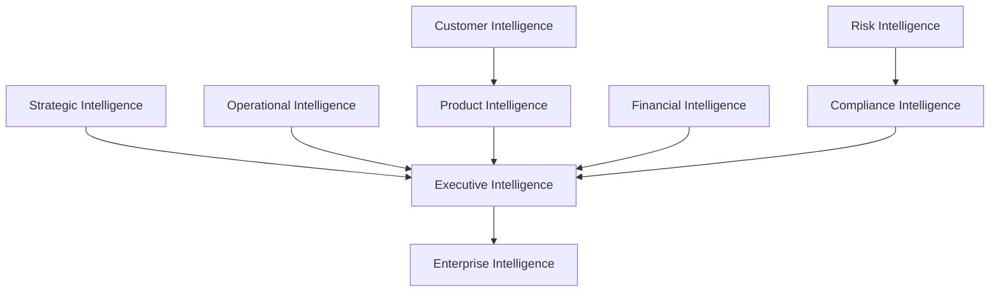
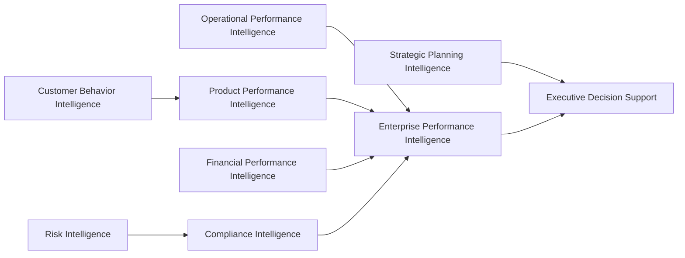
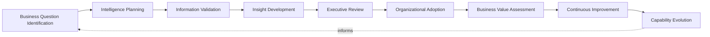
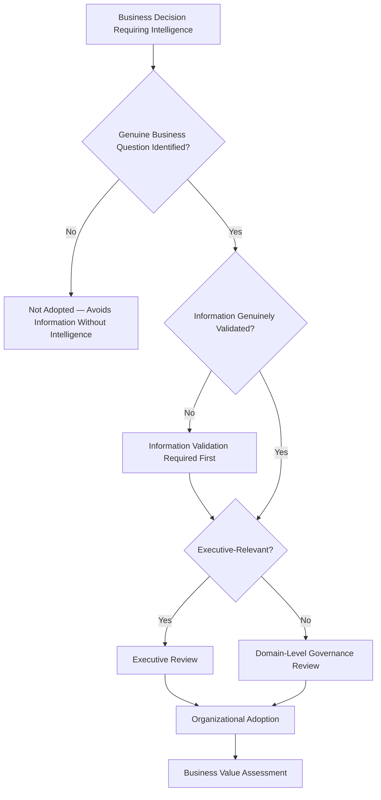
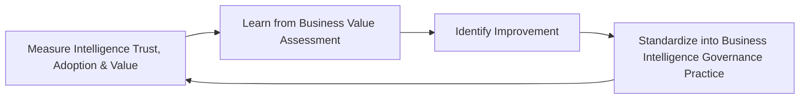
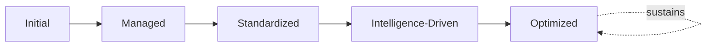

# Enterprise Business Intelligence Framework

## 1. Executive Summary

**Purpose** — This document defines the official Enterprise Business Intelligence Framework for **StackLeo Tech Store**. It establishes business intelligence governance, decision intelligence, executive insight, organizational intelligence, information consumption governance, analytical excellence, and long-term BI maturity as a deliberate, accountable enterprise discipline. `analytics-strategy.md` governs how governed data and metrics are converted into validated insight; `reporting-governance.md` governs how that insight is packaged and distributed as a report. This framework sits above both, at the point where distributed reports and validated insight are synthesized into genuine organizational intelligence — the coherent, decision-ready understanding an executive or business leader actually consumes. It does not restate analytics or reporting governance; it governs the consumption, synthesis, and organizational use of intelligence itself.

**Scope** — This framework applies to every category of business intelligence produced or consumed across StackLeo — executive, strategic, operational, customer, product, financial, risk, compliance, and enterprise intelligence — across every business function, coordinated with `data-governance.md`, `analytics-strategy.md`, `reporting-governance.md`, and `metrics-governance.md`.

**Strategic Objectives** — To ensure StackLeo's leadership genuinely thinks and decides with intelligence, not merely receives information; that intelligence is trusted, consistent, and free of fragmentation across the organization; that decision-making is demonstrably informed by governed intelligence rather than isolated impression; and that executive leadership has continuous, honest confidence in the organizational intelligence it governs with.

**Business Value** — Governed business intelligence protects the organization's ability to make its most consequential decisions from a coherent, trustworthy understanding of itself, protects leadership attention from the fragmentation of disconnected reports and dashboards, and gives the Board and executive leadership confidence that StackLeo's intelligence genuinely reflects organizational reality.

**Intended Audience** — Executive leadership, the Board and executive committees, the Chief Technology Officer, business leadership, analytics leadership, the Data Governance Council, engineering leadership, compliance leadership, and business stakeholders.

## 2. Enterprise Business Intelligence Vision

- **Intelligence as Strategic Capability** — business intelligence is governed as a genuine strategic capability, never merely an accumulation of reports and dashboards.
- **Enterprise Decision Excellence** — intelligence exists to make every consequential organizational decision demonstrably better informed.
- **Business Transparency** — intelligence gives the organization an honest, coherent view of its own genuine performance and condition.
- **Performance Visibility** — intelligence connects organizational activity directly to a synthesized, understood picture of business performance.
- **Customer Intelligence** — intelligence deepens the organization's genuine, synthesized understanding of customer behavior and need.
- **Operational Intelligence** — intelligence gives operational leadership a coherent, evidence-based understanding of how the platform genuinely runs.
- **Sustainable Competitive Advantage** — intelligence, governed and matured over time, becomes a genuine, durable source of competitive differentiation.

### Enterprise Business Intelligence Vision Matrix

| Vision Element | Focus | Business Value |
|---|---|---|
| Intelligence as Strategic Capability | Genuine strategic capability, not an accumulation of dashboards | Prevents intelligence from being treated as a byproduct of reporting |
| Enterprise Decision Excellence | Makes consequential decisions demonstrably better informed | Connects intelligence directly to decision quality |
| Business Transparency | An honest, coherent view of genuine organizational condition | Protects leadership from a fragmented or curated picture |
| Performance Visibility | Connects activity to a synthesized picture of performance | Keeps intelligence tethered to what the business actually values |
| Customer Intelligence | A genuine, synthesized understanding of customer behavior | Keeps intelligence grounded in what customers actually experience |
| Operational Intelligence | A coherent, evidence-based understanding of platform operation | Supports genuinely informed operational decisions |
| Sustainable Competitive Advantage | A durable source of differentiation over time | Converts intelligence maturity into genuine market advantage |

## 3. Business Intelligence Principles

Business intelligence governance at StackLeo rests on nine principles, each producing a specific business outcome.

- **Intelligence Before Information** — governance favors synthesized understanding over raw information volume. *Business Value:* protects leadership attention from being spent absorbing data rather than deciding.
- **Trusted Business Insights** — an insight is trusted to genuinely and reliably reflect organizational reality. *Business Value:* protects the credibility of every decision that relies on it.
- **Business Context First** — intelligence is governed to carry the genuine business context needed to interpret it correctly, never presented as isolated figures. *Business Value:* prevents intelligence from being technically accurate yet practically unusable.
- **Decision-Oriented Thinking** — intelligence is governed to exist because a genuine decision requires it, never merely because it is available. *Business Value:* ensures intelligence investment is spent on what genuinely matters.
- **Accountability** — every intelligence domain traces to a specific, named, responsible owner. *Business Value:* ensures no domain drifts without someone genuinely responsible for it.
- **Transparency** — the sources, methods, and assumptions behind an intelligence product are documented and visible to those who genuinely need them. *Business Value:* allows intelligence to be scrutinized and defended, not merely trusted on faith.
- **Consistency** — intelligence means the same thing wherever it is presented, coordinated with `reporting-governance.md`. *Business Value:* prevents the same label from concealing incompatible understanding.
- **Ethical Intelligence** — intelligence is governed with explicit awareness of its potential for bias, misuse, or unintended harm. *Business Value:* protects organizational trust from irresponsible intelligence practice.
- **Continuous Improvement** — business intelligence governance practice matures over time, informed by real decision outcomes. *Business Value:* keeps intelligence aligned with the organization's growing scale and complexity.

### Business Intelligence Principles Matrix

| Principle | Description | Business Value |
|---|---|---|
| Intelligence Before Information | Favors synthesized understanding over raw information volume | Protects attention from being spent absorbing data, not deciding |
| Trusted Business Insights | Genuinely and reliably reflects organizational reality | Protects credibility of every decision relying on it |
| Business Context First | Carries genuine context needed for correct interpretation | Prevents accuracy that is technically correct but practically unusable |
| Decision-Oriented Thinking | Exists because a genuine decision requires it | Ensures intelligence investment is spent on what genuinely matters |
| Accountability | Every domain traces to a specific, named, responsible owner | Ensures no domain drifts without genuine responsibility |
| Transparency | Sources, methods, and assumptions documented and visible | Allows intelligence to be scrutinized and defended |
| Consistency | Means the same thing wherever it is presented | Prevents the same label from concealing incompatible understanding |
| Ethical Intelligence | Explicit awareness of bias, misuse, or unintended harm | Protects organizational trust from irresponsible practice |
| Continuous Improvement | Practice matures from real decision outcomes | Keeps intelligence aligned with growing scale and complexity |

## 4. Enterprise Business Intelligence Governance Model

Business intelligence governance operates across nine conceptual domains, each holding accountability for a distinct category of organizational intelligence.

### Executive Intelligence

- **Purpose** — govern the synthesized, executive-relevant picture of organizational condition across every domain below.
- **Governance Scope** — oversight exclusively accountable for converging every domain into one coherent picture for leadership.
- **Business Value** — protects leadership's ability to understand the organization as a whole, not domain by domain.
- **Executive Expectations** — leadership expects one coherent intelligence picture, not eight disconnected domain feeds.

### Strategic Intelligence

- **Purpose** — govern intelligence supporting StackLeo's long-term strategic direction and competitive position.
- **Governance Scope** — oversight coordinated with `01_Business/objectives.md` and Strategic Analytics (`analytics-strategy.md`, Section 4).
- **Business Value** — connects day-to-day intelligence to genuine long-term organizational direction.
- **Executive Expectations** — leadership expects strategic intelligence to be reviewed with the same rigor as quarterly business performance.

### Operational Intelligence

- **Purpose** — govern intelligence supporting genuine day-to-day operational understanding and decision-making.
- **Governance Scope** — oversight coordinated with `09_Operations/operations-governance.md` and Operational Analytics (`analytics-strategy.md`, Section 4).
- **Business Value** — protects the organization's ability to genuinely understand how it operates.
- **Executive Expectations** — leadership expects operational intelligence to support timely, informed operational decisions.

### Customer Intelligence

- **Purpose** — govern intelligence synthesizing genuine customer behavior, need, and experience.
- **Governance Scope** — oversight coordinated with `06_Security/privacy-governance.md`, given the sensitivity of customer-level intelligence.
- **Business Value** — deepens the organization's genuine, synthesized understanding of the customer relationship.
- **Executive Expectations** — leadership expects customer intelligence to balance genuine insight against privacy responsibility.

### Product Intelligence

- **Purpose** — govern intelligence synthesizing how the product is genuinely adopted, used, and valued.
- **Governance Scope** — oversight coordinated with Product Analytics (`analytics-strategy.md`, Section 4).
- **Business Value** — protects the ability to understand whether the product is genuinely succeeding with customers.
- **Executive Expectations** — leadership expects product intelligence to reflect genuine usage and value.

### Financial Intelligence

- **Purpose** — govern intelligence synthesizing genuine financial performance and business health.
- **Governance Scope** — oversight held to the highest integrity standard in this model, coordinated with finance function accountability.
- **Business Value** — protects the trustworthiness of the organization's most consequential business decisions.
- **Executive Expectations** — leadership expects financial intelligence to be unimpeachably accurate and independently defensible.

### Risk Intelligence

- **Purpose** — govern intelligence synthesizing genuine organizational risk exposure.
- **Governance Scope** — oversight coordinated with `06_Security/enterprise-risk-management-strategy.md`.
- **Business Value** — protects leadership's ability to make risk-informed decisions with a genuine, current understanding.
- **Executive Expectations** — leadership expects risk intelligence to be honest, even when the picture is unfavorable.

### Compliance Intelligence

- **Purpose** — govern intelligence synthesizing genuine adherence to regulatory and contractual obligation.
- **Governance Scope** — oversight coordinated with `06_Security/compliance-governance.md` and `06_Security/audit-governance.md`.
- **Business Value** — protects the organization's standing with regulators and counterparties.
- **Executive Expectations** — leadership expects compliance intelligence to be complete, accurate, and defensible at any time.

### Enterprise Intelligence

- **Purpose** — govern the highest-level, cross-domain synthesis of organizational understanding, above even Executive Intelligence.
- **Governance Scope** — oversight accountable for ensuring every domain above remains coherently connected as a single organizational understanding.
- **Business Value** — protects the organization from understanding itself as eight disconnected functions rather than one enterprise.
- **Executive Expectations** — leadership expects enterprise intelligence to be the organization's single, most authoritative self-understanding.

### Business Intelligence Governance Matrix

| Domain | Purpose | Business Value | Executive Expectations |
|---|---|---|---|
| Executive Intelligence | Synthesize the executive-relevant organizational picture | Protects leadership's ability to understand the whole organization | Expects one coherent picture, not disconnected feeds |
| Strategic Intelligence | Govern intelligence supporting long-term direction | Connects intelligence to genuine long-term direction | Expects rigor equal to quarterly business performance |
| Operational Intelligence | Govern intelligence supporting day-to-day understanding | Protects the ability to genuinely understand operations | Expects support for timely, informed decisions |
| Customer Intelligence | Govern intelligence synthesizing customer behavior and need | Deepens genuine, synthesized understanding of the relationship | Expects balance against privacy responsibility |
| Product Intelligence | Govern intelligence synthesizing product adoption and value | Protects ability to understand genuine product success | Expects reflection of genuine usage and value |
| Financial Intelligence | Govern intelligence synthesizing financial performance | Protects trustworthiness of the most consequential decisions | Expects unimpeachable accuracy and defensibility |
| Risk Intelligence | Govern intelligence synthesizing organizational risk exposure | Protects risk-informed decision-making with current understanding | Expects honesty, even when the picture is unfavorable |
| Compliance Intelligence | Govern intelligence synthesizing regulatory adherence | Protects the organization's standing with regulators | Expects completeness and defensibility at any time |
| Enterprise Intelligence | Govern the highest-level, cross-domain synthesis | Protects understanding of the organization as a single enterprise | Expects the single, most authoritative self-understanding |

*Diagram 1: Enterprise Business Intelligence Framework — strategic and operational intelligence, customer and product intelligence, financial intelligence, and risk and compliance intelligence all converge on executive intelligence, which synthesizes into the organization's single enterprise intelligence picture.*

## 5. Business Intelligence Capability Framework

Business intelligence capability is governed across nine conceptual categories, each requiring a distinct governance emphasis. Remaining implementation independent, this framework classifies capability by the decision it supports — never by tool, platform, or algorithm.

- **Executive Decision Support** — governs how capability converges into support for leadership's most consequential decisions.
- **Strategic Planning Intelligence** — governs how capability supports genuine long-term strategic planning.
- **Operational Performance Intelligence** — governs how capability supports genuine day-to-day operational understanding.
- **Customer Behavior Intelligence** — governs how capability deepens genuine understanding of customer behavior and need.
- **Product Performance Intelligence** — governs how capability supports genuine understanding of product adoption and value.
- **Financial Performance Intelligence** — governs how capability supports genuine understanding of financial health.
- **Risk Intelligence** — governs how capability supports genuine understanding of organizational risk exposure.
- **Compliance Intelligence** — governs how capability supports genuine understanding of regulatory adherence.
- **Enterprise Performance Intelligence** — governs how capability supports genuine, cross-domain understanding of overall organizational performance.

### Intelligence Capability Matrix

| Capability | Governance Focus | Coordination |
|---|---|---|
| Executive Decision Support | Converging capability into leadership decision support | Executive Intelligence (Section 4) |
| Strategic Planning Intelligence | Supporting genuine long-term strategic planning | Strategic Intelligence (Section 4) |
| Operational Performance Intelligence | Supporting genuine day-to-day operational understanding | Operational Intelligence (Section 4) |
| Customer Behavior Intelligence | Deepening genuine understanding of customer behavior | Customer Intelligence (Section 4) |
| Product Performance Intelligence | Supporting genuine understanding of product value | Product Intelligence (Section 4) |
| Financial Performance Intelligence | Supporting genuine understanding of financial health | Financial Intelligence (Section 4) |
| Risk Intelligence | Supporting genuine understanding of risk exposure | Risk Intelligence (Section 4) |
| Compliance Intelligence | Supporting genuine understanding of regulatory adherence | Compliance Intelligence (Section 4) |
| Enterprise Performance Intelligence | Supporting cross-domain understanding of overall performance | Enterprise Intelligence (Section 4) |

*Diagram 2: Business Intelligence Capability Model — operational, customer, product, financial, risk, and compliance capability all converge on enterprise performance intelligence, which joins strategic planning intelligence in supporting executive decision support.*

## 6. Business Intelligence Lifecycle Governance

Business intelligence governance operates across nine conceptual lifecycle stages.

- **Business Question Identification** — govern how a genuine business question is identified before intelligence work begins.
- **Intelligence Planning** — govern how the appropriate intelligence approach is deliberately planned for the question at hand.
- **Information Validation** — govern how the underlying information is confirmed accurate and governed before synthesis.
- **Insight Development** — govern how validated information is synthesized into genuine, decision-ready intelligence.
- **Executive Review** — govern the point at which developed intelligence is reviewed with executive leadership.
- **Organizational Adoption** — govern how reviewed intelligence is genuinely adopted into organizational decision-making practice.
- **Business Value Assessment** — govern how the genuine business value realized from intelligence is assessed after adoption.
- **Continuous Improvement** — govern how business intelligence practice is deliberately strengthened based on real decision outcomes.
- **Capability Evolution** — govern the periodic reassessment of whether intelligence capability remains aligned with evolving business need.

### Intelligence Lifecycle Matrix

| Stage | Governance Objective | Business Value |
|---|---|---|
| Business Question Identification | Identify a genuine business question before work begins | Ensures intelligence effort is deliberately directed |
| Intelligence Planning | Deliberately plan the appropriate approach | Ensures the method genuinely fits the question |
| Information Validation | Confirm underlying information accurate and governed | Protects the credibility of the resulting intelligence |
| Insight Development | Synthesize validated information into decision-ready intelligence | Converts information into genuine organizational understanding |
| Executive Review | Review developed intelligence with executive leadership | Ensures leadership sees only genuinely trustworthy intelligence |
| Organizational Adoption | Adopt reviewed intelligence into decision-making practice | Ensures intelligence investment produces genuine change |
| Business Value Assessment | Assess genuine value realized after adoption | Confirms intelligence investment is genuinely working |
| Continuous Improvement | Strengthen practice from real decision outcomes | Keeps intelligence practice compounding in capability |
| Capability Evolution | Reassess alignment with evolving business need | Keeps intelligence genuinely connected to business intent |

*Diagram 3: Intelligence Lifecycle Governance — business question identification and intelligence planning inform information validation and insight development, feeding executive review and organizational adoption, with business value assessment, continuous improvement, and capability evolution feeding lessons back into the cycle.*

## 7. Information Consumption Governance

- **Executive Information Consumption** — governs how executive leadership genuinely receives and absorbs organizational intelligence.
- **Business Information Accessibility** — governs whether intelligence is genuinely available to everyone with a legitimate, authorized need for it.
- **Context Preservation** — governs whether intelligence retains its genuine business context as it moves from analyst to executive.
- **Information Consistency** — governs whether intelligence means the same thing wherever it is consumed, coordinated with `reporting-governance.md`.
- **Decision Traceability** — governs whether a decision can be traced back to the specific intelligence that genuinely informed it.
- **Responsible Information Sharing** — governs intelligence distribution with explicit awareness of confidentiality and appropriate audience, coordinated with `06_Security/privacy-governance.md`.
- **Knowledge Retention** — governs whether intelligence, once developed, is genuinely retained as durable organizational knowledge rather than lost after a single use.
- **Organizational Learning** — governs how consumed intelligence deepens the organization's genuine collective understanding over time.

### Information Consumption Matrix

| Consumption Area | Focus | Governance Coordination |
|---|---|---|
| Executive Information Consumption | How leadership genuinely receives and absorbs intelligence | Coordinated with Executive Intelligence (Section 4) |
| Business Information Accessibility | Genuine availability to those with legitimate need | Coordinated with `06_Security/privacy-governance.md` |
| Context Preservation | Genuine business context retained as intelligence moves | Coordinated with Business Context First (Section 3) |
| Information Consistency | Intelligence meaning the same thing wherever consumed | Coordinated with `reporting-governance.md` |
| Decision Traceability | A decision traceable to the intelligence that informed it | Coordinated with Transparency (Section 3) |
| Responsible Information Sharing | Distribution aware of confidentiality and audience | Coordinated with `06_Security/privacy-governance.md` |
| Knowledge Retention | Intelligence retained as durable organizational knowledge | Coordinated with Organizational Learning (Section 6) |
| Organizational Learning | Consumed intelligence deepening collective understanding | Coordinated with Continuous Improvement (Section 6) |

## 8. Organizational Governance

Governance accountability is distributed deliberately across nine organizational roles.

- **Executive Leadership** — holds ultimate accountability for whether StackLeo's intelligence genuinely informs decisions.
- **Board & Executive Committees** — hold accountability for genuinely consuming enterprise intelligence in governance decisions, not merely receiving it.
- **Chief Technology Officer** — owns the coherence and enforcement of this framework across every intelligence domain and governance layer it defines.
- **Business Leadership** — owns Strategic and Financial Intelligence (Section 4) alignment with genuine business priority.
- **Analytics Leadership** — owns the conversion of insight from `analytics-strategy.md` into synthesized organizational intelligence.
- **Data Governance Council** — owns alignment of this framework with `data-governance.md`, ensuring intelligence is never built on ungoverned data.
- **Engineering Leadership** — owns Operational Intelligence (Section 4) within their accountable teams.
- **Compliance Leadership** — owns Risk and Compliance Intelligence (Section 4) jointly with `06_Security/compliance-governance.md`.
- **Business Stakeholders** — own Customer and Product Intelligence (Section 4) alignment with genuine business priority.

### Organizational Responsibility Matrix

| Role | Governance Objective | Business Value |
|---|---|---|
| Executive Leadership | Hold ultimate accountability for decision-informing intelligence | Provides a single point of ultimate accountability |
| Board & Executive Committees | Genuinely consume enterprise intelligence in governance decisions | Ensures the Board decides from genuine understanding |
| Chief Technology Officer | Own coherence and enforcement of this framework | Provides a single point of specialist accountability |
| Business Leadership | Own strategic and financial intelligence alignment | Ensures intelligence reflects genuine business priority |
| Analytics Leadership | Own conversion of insight into synthesized intelligence | Connects analytics directly to organizational intelligence |
| Data Governance Council | Own alignment with `data-governance.md` | Ensures intelligence is never built on ungoverned data |
| Engineering Leadership | Own operational intelligence | Embeds intelligence accountability closest to operations |
| Compliance Leadership | Own risk and compliance intelligence | Ensures intelligence genuinely meets regulatory obligation |
| Business Stakeholders | Own customer and product intelligence alignment | Connects intelligence to genuine business relevance |

*Diagram 4: Executive Decision Intelligence Flow — a business decision requiring intelligence is checked for a genuine question and validated information, escalated to executive review where genuinely relevant, resolving into organizational adoption and business value assessment.*

## 9. Business Intelligence Risk Governance

Business intelligence-related risk is governed across eight conceptual categories.

- **Misleading Intelligence** — the risk that a synthesized insight, though built on accurate data, creates a genuinely false impression of organizational reality.
- **Decision Bias** — the risk that intelligence is shaped, deliberately or unconsciously, to favor a particular conclusion.
- **Information Fragmentation** — the risk that intelligence exists as disconnected pieces no one has genuinely synthesized into a coherent picture.
- **Poor Data Context** — the risk that intelligence is presented without the genuine business context needed to interpret it correctly.
- **Compliance Risks** — the risk that intelligence practice fails to meet a genuine regulatory or contractual obligation.
- **Strategic Risks** — the risk that intelligence blind spots leave the organization genuinely unaware of a significant strategic threat or opportunity.
- **Reputational Risks** — the risk that flawed or fragmented intelligence damages StackLeo's standing with stakeholders, regulators, or the market.
- **Weak Governance** — the risk that intelligence is produced and consumed without genuine governance oversight, accumulating as ungoverned practice.

### Business Intelligence Risk Matrix

| Risk Category | Focus | Governance Coordination |
|---|---|---|
| Misleading Intelligence | Accurate data producing a genuinely false impression | Coordinated with Trusted Business Insights (Section 3) |
| Decision Bias | Intelligence shaped to favor a particular conclusion | Coordinated with Ethical Intelligence (Section 3) |
| Information Fragmentation | Disconnected pieces never synthesized into a coherent picture | Coordinated with Enterprise Intelligence (Section 4) |
| Poor Data Context | Presented without genuine interpretive context | Coordinated with Business Context First (Section 3) |
| Compliance Risks | Practice failing regulatory or contractual obligation | Coordinated with `06_Security/compliance-governance.md` |
| Strategic Risks | Blind spots leaving the organization unaware of threat or opportunity | Coordinated with Strategic Intelligence (Section 4) |
| Reputational Risks | Flawed or fragmented intelligence damaging standing | Coordinated with Executive Intelligence (Section 4) |
| Weak Governance | Intelligence accumulating without genuine oversight | Coordinated with Accountability (Section 3) |

## 10. Executive Oversight

- **Executive Intelligence Reviews** — the intelligence genuinely warranting executive attention is formally reviewed directly with executive leadership on a regular cadence.
- **Strategic Performance Reviews** — strategic intelligence and its influence on organizational direction is reviewed directly with executive leadership.
- **Governance Reporting** — aggregated business intelligence health — coverage, trust, adoption — is reported to executive leadership and the Board.
- **Business Value Reviews** — the genuine business value realized from intelligence investment is periodically reviewed with executive leadership.
- **Enterprise Capability Reviews** — the organization's overall intelligence capability across every domain in Section 4 is reviewed as a distinct, ongoing concern.
- **Continuous Improvement Reviews** — the organization's follow-through on captured business intelligence governance lessons is reviewed directly with executive leadership.

### Executive Oversight Matrix

| Oversight Mechanism | Purpose | Governance Role |
|---|---|---|
| Executive Intelligence Reviews | Review intelligence genuinely warranting executive attention | Direct executive-level review of the most consequential intelligence |
| Strategic Performance Reviews | Review strategic intelligence and its organizational influence | Direct executive-level strategic review |
| Governance Reporting | Provide leadership a single, coherent intelligence picture | Reports coverage, trust, and adoption |
| Business Value Reviews | Review genuine business value realized from investment | Periodic executive-level value review |
| Enterprise Capability Reviews | Review overall intelligence capability across every domain | Treats capability as ongoing, not assumed |
| Continuous Improvement Reviews | Review follow-through on captured lessons | Direct executive-level review of improvement completion |

## 11. Future Readiness

This framework is designed to remain valid as StackLeo evolves in scale, geography, and organizational complexity.

- **AI-Augmented Business Intelligence** — as insight development increasingly incorporates AI-assisted synthesis, it remains governed under Insight Development (Section 6) at the same rigor as any other method.
- **Intelligent Executive Assistants (Conceptual)** — where executive information consumption increasingly incorporates intelligent, conversational synthesis, that capability remains governed under Executive Information Consumption (Section 7) at the same rigor as any other method.
- **Predictive Enterprise Intelligence** — where enterprise intelligence increasingly anticipates organizational condition before it fully materializes, that capability is governed as an extension of Enterprise Intelligence (Section 4).
- **Self-Service Intelligence Governance (Conceptual)** — where business stakeholders increasingly develop their own intelligence directly, that practice remains subject to the same Information Validation and Governance Review as any centrally-produced intelligence.
- **Enterprise Scale** — the governance model, domains, and lifecycle defined throughout this framework are defined independently of organizational size.
- **Global Decision Intelligence** — Business Question Identification and Intelligence Planning (Section 6) are structured to be re-applied as StackLeo expands from Bangladesh into South Asia and global markets, each with genuinely distinct business and regulatory considerations.
- **Responsible Digital Transformation** — new intelligence capability is adopted only in a manner consistent with Ethical Intelligence (Section 3), never at the expense of it.

## 12. Business Intelligence Maturity Model

Business intelligence governance maturity is described across five conceptual levels.

- **Initial** — intelligence, where it exists, is informal and fragmented; understanding is assembled reactively, and ownership is unclear.
- **Managed** — basic intelligence governance exists for individual domains, but consistency across the nine domains in Section 4 varies significantly.
- **Standardized** — the governance model, domains, and lifecycle are standardized, documented, and consistently applied across the organization.
- **Intelligence-Driven** — decisions across the organization are genuinely and routinely made from synthesized, governed intelligence.
- **Optimized** — business intelligence governance is continuously and deliberately improved based on quantitative evidence and organizational learning; improvement itself is a managed, ongoing discipline.

### Business Intelligence Maturity Matrix

| Level | Characteristics | Primary Focus |
|---|---|---|
| Initial | Informal, fragmented intelligence; understanding assembled reactively | Ad hoc, individually-dependent intelligence practice |
| Managed | Basic governance exists per domain; consistency varies | Domain-level consistency |
| Standardized | Standardized governance model, domains, and lifecycle | Organization-wide consistency and clear ownership |
| Intelligence-Driven | Decisions genuinely and routinely made from synthesized intelligence | Evidence-based decision-making as the organizational norm |
| Optimized | Practice continuously and deliberately improved from evidence | Sustained, deliberate improvement as a discipline |

*Diagram 5: Continuous Business Intelligence Improvement Cycle — intelligence trust, adoption, and realized value are measured, learned from, improved upon, and standardized back into governed practice, on a continuing basis.*

*Diagram 6: Business Intelligence Maturity Progression — maturity advances from informal, fragmented intelligence practice toward standardized, genuinely intelligence-driven, and continuously optimized business intelligence governance.*

## 13. Business Intelligence Anti-Patterns

- **Information Without Intelligence** — accumulating raw data and reports without genuine synthesis produces volume without understanding.
- **Dashboard-Centric Thinking** — treating a dashboard's existence as equivalent to genuine intelligence mistakes the container for the content.
- **Siloed Business Insights** — intelligence developed independently by team, without genuine cross-domain synthesis, prevents one coherent enterprise picture.
- **Weak Governance** — intelligence produced and consumed without genuine governance oversight accumulates as ungoverned, untrustworthy practice.
- **Poor Business Alignment** — intelligence disconnected from a genuine business question fails to inform the decisions leadership actually faces.
- **Multiple Versions of Truth** — allowing the same organizational fact to be understood differently across intelligence products undermines trust in all of them.
- **Lack of Executive Adoption** — intelligence that leadership does not genuinely consume in its decisions forfeits the value it was built to provide.
- **No Continuous Learning** — treating current intelligence practice as permanently finished guarantees it falls behind the organization's growing scale and complexity.

### Anti-Pattern Summary

| Anti-Pattern | Organizational & Business Impact |
|---|---|
| Information Without Intelligence | Produces volume without genuine understanding |
| Dashboard-Centric Thinking | Mistakes the container for genuine intelligence content |
| Siloed Business Insights | Prevents one coherent, organization-wide understanding |
| Weak Governance | Accumulates as ungoverned, untrustworthy intelligence practice |
| Poor Business Alignment | Fails to inform the decisions leadership actually faces |
| Multiple Versions of Truth | Undermines trust in every version of organizational understanding |
| Lack of Executive Adoption | Forfeits the value intelligence was built to provide |
| No Continuous Learning | Guarantees practice falls behind growing scale and complexity |

## Related Documents

| Document | Relationship |
|---|---|
| `data-governance.md` | Governs the ownership, classification, and quality of the data this framework's intelligence is ultimately built upon. |
| `analytics-strategy.md` | Produces the validated insight this framework synthesizes into organizational intelligence. |
| `reporting-governance.md` | Governs the distributed report form this framework's intelligence is often consumed through. |
| `ai-governance.md` | Governs the ethics, risk, and oversight of the AI-augmented intelligence anticipated in this framework's Section 11. |
| `ml-governance.md` | Governs the model risk, validation, and documentation discipline behind the predictive capability anticipated in this framework's Section 11. |
| `data-quality-framework.md` | Governs the quality dimensions this framework's Information Validation (Section 6) coordinates with, alongside `04_Database/data-quality-governance.md`. |
| `metrics-governance.md` | Governs the individual metric this framework's Performance Intelligence (Section 5) synthesizes into decision-ready understanding. |
| Executive Reporting Framework (conceptual future companion) | An anticipated deeper elaboration of the executive-specific reporting form this framework's Executive Intelligence (Section 4) draws upon. |

## Document Information

| Property | Value |
|----------|-------|
| Document | business-intelligence-framework.md |
| Version | 1.0.0 |
| Status | Active |
| Maintained By | StackLeo |
| Last Updated | 2026-07-28 |

---

© StackLeo. All Rights Reserved.
