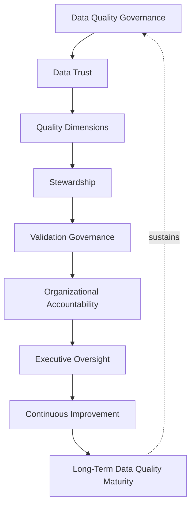
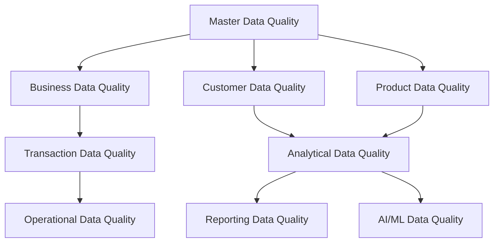
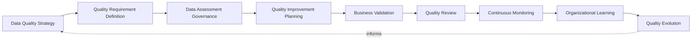
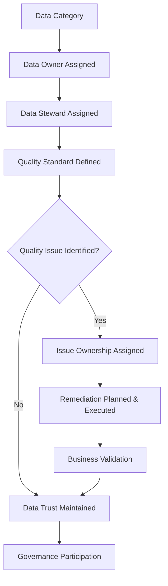
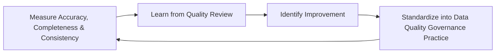
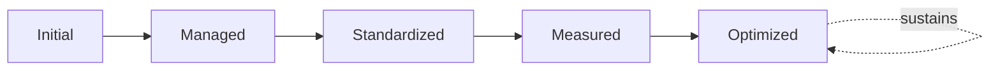

# Enterprise Data Quality Framework

## 1. Executive Summary

**Purpose** — This document defines the official Enterprise Data Quality Framework for **StackLeo Tech Store**. It establishes data quality governance, data trust, quality dimensions, stewardship, validation governance, organizational accountability, executive oversight, continuous improvement, and long-term data quality maturity as a deliberate, accountable enterprise discipline. `data-quality-governance.md` remains the CDO/CISO/CPO-owned executive charter for data quality at StackLeo — the document that establishes quality's foundational philosophy, ownership structure, and executive accountability. This framework does not restate or compete with that charter. It is the capability-and-dimension framework that operationalizes data quality specifically for the analytics, reporting, intelligence, and AI/ML consumption stack — `analytics-strategy.md`, `reporting-governance.md`, `business-intelligence-framework.md`, `ai-governance.md`, and `ml-governance.md` — each of which anticipated this framework by name as the shared quality foundation their insight, reports, intelligence, and models all ultimately depend on.

**Scope** — This framework applies to every category of data quality relevant to business use, analysis, and intelligence at StackLeo — business, customer, product, transaction, analytical, operational, reporting, AI/ML, and master data quality — coordinated with `data-governance.md`, `data-quality-governance.md`, and every document in the analytics and intelligence family.

**Strategic Objectives** — To ensure data quality is defined, measured, and improved consistently across every downstream consumer of StackLeo's data; that a genuine, shared standard of trustworthiness underlies analytics, reporting, intelligence, and model output alike; that quality issues are identified and remediated before they propagate into a decision; and that executive leadership has continuous, honest visibility into the trustworthiness of the data the organization decides on.

**Business Value** — A governed data quality framework protects every downstream consumer — analyst, report recipient, executive, and model — from silently inheriting an upstream data defect, protects the organization from the disproportionate cost of a decision made on data that looked reliable but was not, and gives leadership confidence that StackLeo's entire intelligence stack rests on a genuinely trustworthy foundation.

**Intended Audience** — Executive leadership, the Data Governance Council, the Chief Technology Officer, data owners, data stewards, engineering leadership, analytics leadership, security leadership, and business stakeholders.

## 2. Enterprise Data Quality Vision

- **Data Quality as Strategic Capability** — data quality is governed as a genuine strategic capability, never merely a technical cleanup activity.
- **Trusted Data Culture** — the organization is governed to default to trusting its data, because that trust is genuinely earned through deliberate quality practice.
- **Business Confidence** — quality governance gives business leadership confidence that the data behind a decision is genuinely sound.
- **Decision Accuracy** — quality governance protects the accuracy of every decision built on StackLeo's data, coordinated with `analytics-strategy.md` and `business-intelligence-framework.md`.
- **Customer Trust** — quality governance protects customers from the consequence of inaccurate or inconsistent data held about them.
- **Operational Excellence** — quality governance gives operational leadership confidence in the data underlying day-to-day decisions.
- **Sustainable Data Management** — quality is governed as an ongoing, sustained discipline, never a one-time cleanup effort.

### Enterprise Data Quality Vision Matrix

| Vision Element | Focus | Business Value |
|---|---|---|
| Data Quality as Strategic Capability | Genuine strategic capability, not a technical cleanup activity | Prevents quality from being treated as a low-priority afterthought |
| Trusted Data Culture | An organization-wide default of genuinely earned trust | Removes the cost of independently re-verifying data constantly |
| Business Confidence | Confidence that decision-supporting data is genuinely sound | Protects the credibility of every data-informed decision |
| Decision Accuracy | Protects the accuracy of every decision built on the data | Connects quality directly to decision-making integrity |
| Customer Trust | Protects customers from inaccurate or inconsistent data | Protects the trust relationship every interaction depends on |
| Operational Excellence | Confidence in the data underlying day-to-day decisions | Supports genuinely informed operational decisions |
| Sustainable Data Management | An ongoing, sustained discipline, not a one-time cleanup | Protects quality investment from eroding over time |

*Diagram 1: Enterprise Data Quality Framework — data quality governance establishes data trust and quality dimensions, sustained through stewardship and validation governance, with organizational accountability and executive oversight driving continuous improvement toward long-term data quality maturity that reinforces governance itself.*

## 3. Data Quality Principles

Data quality governance at StackLeo rests on ten principles, each producing a specific business outcome.

- **Accuracy** — data is governed to genuinely and correctly reflect the real-world fact it represents. *Business Value:* protects the credibility of every decision that relies on it.
- **Completeness** — data is governed to include every genuinely necessary attribute, without silent gaps. *Business Value:* prevents a decision from being made on an incomplete, misleading picture.
- **Consistency** — a given fact is governed to resolve identically wherever it appears, coordinated with `data-governance.md`. *Business Value:* prevents divergent data from silently undermining trust in itself.
- **Timeliness** — data is governed to remain genuinely current relative to the decision it informs. *Business Value:* protects decisions from being made on stale, outdated information.
- **Validity** — data is governed to conform to its genuinely defined business rules and format. *Business Value:* prevents malformed data from propagating into downstream analysis.
- **Reliability** — data is governed to behave predictably and consistently under normal and unexpected conditions alike. *Business Value:* protects confidence that data can be depended upon over time.
- **Uniqueness** — data is governed to avoid unintended duplication of the same business fact. *Business Value:* prevents duplicate records from silently distorting counts, totals, and analysis.
- **Integrity** — data is governed to remain internally coherent and protected from unauthorized or accidental alteration. *Business Value:* protects the trustworthiness of data as a business asset in its own right.
- **Accountability** — every data category's quality traces to a specific, named, responsible owner. *Business Value:* ensures no quality issue is left to drift without someone genuinely responsible for it.
- **Continuous Improvement** — data quality governance practice matures over time, informed by real quality outcomes. *Business Value:* keeps quality discipline aligned with the organization's growing scale and complexity.

### Data Quality Principles Matrix

| Principle | Description | Business Value |
|---|---|---|
| Accuracy | Genuinely and correctly reflects the real-world fact | Protects credibility of every decision relying on it |
| Completeness | Includes every genuinely necessary attribute | Prevents decisions on an incomplete, misleading picture |
| Consistency | A given fact resolves identically wherever it appears | Prevents divergent data undermining trust in itself |
| Timeliness | Remains genuinely current relative to the decision | Protects decisions from stale, outdated information |
| Validity | Conforms to genuinely defined business rules and format | Prevents malformed data propagating downstream |
| Reliability | Behaves predictably under normal and unexpected conditions | Protects confidence that data can be depended upon |
| Uniqueness | Avoids unintended duplication of the same business fact | Prevents duplicates distorting counts, totals, and analysis |
| Integrity | Remains internally coherent and protected from alteration | Protects trustworthiness of data as a business asset |
| Accountability | Every category's quality traces to a responsible owner | Ensures no quality issue drifts without genuine responsibility |
| Continuous Improvement | Practice matures from real quality outcomes | Keeps discipline aligned with growing scale and complexity |

## 4. Enterprise Data Quality Governance Model

Data quality governance operates across nine conceptual domains, each holding accountability for a distinct category of data.

### Business Data Quality

- **Purpose** — govern the quality of data underlying genuine business and commercial understanding.
- **Governance Scope** — oversight coordinated with `01_Business/business-model.md` and Business Analytics (`analytics-strategy.md`, Section 4).
- **Business Value** — protects the trustworthiness of the organization's core business understanding.
- **Executive Expectations** — leadership expects business data quality to be genuinely defensible under scrutiny.

### Customer Data Quality

- **Purpose** — govern the quality of data describing genuine customer identity, behavior, and history.
- **Governance Scope** — oversight coordinated with `06_Security/privacy-governance.md`, given the sensitivity of customer data.
- **Business Value** — protects customers from the consequence of inaccurate or inconsistent data held about them.
- **Executive Expectations** — leadership expects customer data quality to be held to elevated rigor given its trust sensitivity.

### Product Data Quality

- **Purpose** — govern the quality of data describing the product catalog and its attributes.
- **Governance Scope** — oversight coordinated with Product Analytics (`analytics-strategy.md`, Section 4).
- **Business Value** — protects the accuracy of the product understanding customers and the business both depend on.
- **Executive Expectations** — leadership expects product data quality to directly support genuine customer confidence.

### Transaction Data Quality

- **Purpose** — govern the quality of data describing genuine business transactions and their outcomes.
- **Governance Scope** — oversight held to elevated rigor given transaction data's direct financial and audit consequence.
- **Business Value** — protects the trustworthiness of the organization's most consequential business records.
- **Executive Expectations** — leadership expects transaction data quality to be unimpeachably accurate.

### Analytical Data Quality

- **Purpose** — govern the quality of data as it is consumed by `analytics-strategy.md`'s analytical processes.
- **Governance Scope** — oversight coordinated with Data Readiness (`analytics-strategy.md`, Section 6).
- **Business Value** — protects the trustworthiness of every analytical insight built upon it.
- **Executive Expectations** — leadership expects analytical data quality to be confirmed before insight is trusted.

### Operational Data Quality

- **Purpose** — govern the quality of data supporting genuine day-to-day operational activity.
- **Governance Scope** — oversight coordinated with Operational Analytics (`analytics-strategy.md`, Section 4).
- **Business Value** — protects the organization's ability to genuinely operate on trustworthy operational data.
- **Executive Expectations** — leadership expects operational data quality to support timely, informed operational decisions.

### Reporting Data Quality

- **Purpose** — govern the quality of data as it is presented through `reporting-governance.md`'s distributed reports.
- **Governance Scope** — oversight coordinated with Information Validation (`reporting-governance.md`, Section 6).
- **Business Value** — protects the credibility of every report leadership and stakeholders rely upon.
- **Executive Expectations** — leadership expects reporting data quality to be confirmed before a report is distributed.

### AI/ML Data Quality

- **Purpose** — govern the quality of data used to develop, validate, and operate AI and ML capability, coordinated with `ai-governance.md` and `ml-governance.md`.
- **Governance Scope** — oversight held to elevated rigor given the amplifying effect poor-quality data has on a trained model.
- **Business Value** — protects AI and ML capability from inheriting and amplifying an upstream data defect.
- **Executive Expectations** — leadership expects AI/ML data quality to be confirmed with the same rigor as model validation itself.

### Master Data Quality

- **Purpose** — govern the quality of StackLeo's authoritative, single-source-of-truth reference data.
- **Governance Scope** — oversight exclusively accountable for the data every other domain above ultimately references.
- **Business Value** — protects the foundation every other data quality domain depends on.
- **Executive Expectations** — leadership expects master data quality to be governed with the highest rigor in this model.

### Data Quality Governance Matrix

| Domain | Purpose | Business Value | Executive Expectations |
|---|---|---|---|
| Business Data Quality | Govern quality of data underlying business understanding | Protects trustworthiness of core business understanding | Expects genuine defensibility under scrutiny |
| Customer Data Quality | Govern quality of data describing customer identity and behavior | Protects customers from consequence of inaccurate data | Expects elevated rigor given trust sensitivity |
| Product Data Quality | Govern quality of data describing the product catalog | Protects accuracy of shared product understanding | Expects direct support for genuine customer confidence |
| Transaction Data Quality | Govern quality of data describing business transactions | Protects trustworthiness of the most consequential records | Expects unimpeachable accuracy |
| Analytical Data Quality | Govern quality of data consumed by analytical processes | Protects trustworthiness of every analytical insight | Expects confirmation before insight is trusted |
| Operational Data Quality | Govern quality of data supporting day-to-day operation | Protects the ability to operate on trustworthy data | Expects support for timely, informed decisions |
| Reporting Data Quality | Govern quality of data presented through distributed reports | Protects the credibility of every relied-upon report | Expects confirmation before distribution |
| AI/ML Data Quality | Govern quality of data used to develop and operate models | Protects AI/ML from inheriting and amplifying defects | Expects rigor equal to model validation itself |
| Master Data Quality | Govern quality of authoritative, single-source-of-truth data | Protects the foundation every other domain depends on | Expects the highest rigor in this model |

*Diagram 2: Data Quality Governance Model — master data quality anchors business, customer, and product data quality, feeding transaction and analytical data quality, which in turn feed reporting, AI/ML, and operational data quality across the consuming stack.*

## 5. Data Quality Dimensions Framework

Data quality is governed across ten conceptual dimensions, each carrying a distinct governance objective. Remaining implementation independent, these dimensions describe what quality means — never which tool or validation rule enforces it.

- **Accuracy** — governs whether data genuinely and correctly reflects the real-world fact it represents.
- **Completeness** — governs whether data includes every genuinely necessary attribute.
- **Consistency** — governs whether a given fact resolves identically wherever it appears.
- **Timeliness** — governs whether data remains genuinely current relative to its use.
- **Validity** — governs whether data conforms to its genuinely defined business rules and format.
- **Uniqueness** — governs whether data avoids unintended duplication of the same business fact.
- **Integrity** — governs whether data remains internally coherent and protected from unauthorized alteration.
- **Availability** — governs whether data is genuinely accessible to those with a legitimate need for it, when they need it.
- **Reliability** — governs whether data behaves predictably and consistently over time.
- **Trustworthiness** — governs the synthesized, overall confidence the organization can genuinely place in a given data category.

### Data Quality Dimension Matrix

| Dimension | Governance Objective | Coordination |
|---|---|---|
| Accuracy | Genuinely and correctly reflecting the real-world fact | Accuracy (Section 3) |
| Completeness | Including every genuinely necessary attribute | Completeness (Section 3) |
| Consistency | A given fact resolving identically wherever it appears | `data-governance.md` |
| Timeliness | Remaining genuinely current relative to its use | Reporting Data Quality (Section 4) |
| Validity | Conforming to genuinely defined business rules and format | `data-governance.md` |
| Uniqueness | Avoiding unintended duplication of the same fact | Master Data Quality (Section 4) |
| Integrity | Remaining internally coherent and protected from alteration | `06_Security/security-governance.md` |
| Availability | Genuinely accessible to those with legitimate need | `06_Security/privacy-governance.md` |
| Reliability | Behaving predictably and consistently over time | Continuous Monitoring (Section 6) |
| Trustworthiness | Synthesized, overall confidence in a data category | Data Trust Management (Section 7) |

## 6. Data Quality Lifecycle Governance

Data quality governance operates across nine conceptual lifecycle stages.

- **Data Quality Strategy** — govern how the organization determines its overall approach and priority toward data quality investment.
- **Quality Requirement Definition** — govern how the specific quality standard for a data category is defined before it is measured against.
- **Data Assessment Governance** — govern how a data category's genuine current quality is assessed against its defined requirement.
- **Quality Improvement Planning** — govern how a genuine quality gap is planned for deliberate remediation.
- **Business Validation** — govern how a remediated data category is confirmed to genuinely meet its business purpose.
- **Quality Review** — govern the periodic, formal review of data quality posture for genuine insight.
- **Continuous Monitoring** — govern how a data category's quality is continuously observed for genuine degradation over time.
- **Organizational Learning** — govern how understanding gained from quality practice is captured as durable organizational knowledge.
- **Quality Evolution** — govern the periodic reassessment of whether quality requirements remain aligned with evolving business need.

### Data Lifecycle Matrix

| Stage | Governance Objective | Business Value |
|---|---|---|
| Data Quality Strategy | Determine overall approach and priority toward investment | Ensures quality investment is deliberately directed |
| Quality Requirement Definition | Define the specific standard before measurement | Ensures a data category is measured against a genuine standard |
| Data Assessment Governance | Assess genuine current quality against the requirement | Confirms whether data genuinely meets its defined standard |
| Quality Improvement Planning | Plan deliberate remediation of a genuine gap | Ensures gaps are addressed deliberately, not left to accumulate |
| Business Validation | Confirm remediated data genuinely meets its purpose | Protects against declaring resolution prematurely |
| Quality Review | Periodically review posture for genuine insight | Confirms quality investment is genuinely working |
| Continuous Monitoring | Continuously observe for genuine degradation | Detects quality decline while it can still be addressed |
| Organizational Learning | Capture understanding as durable organizational knowledge | Converts quality evidence into lasting organizational insight |
| Quality Evolution | Reassess alignment with evolving business need | Keeps quality standards genuinely connected to business intent |

*Diagram 3: Data Quality Lifecycle — strategy and requirement definition inform assessment and improvement planning, feeding business validation and quality review, with continuous monitoring, organizational learning, and quality evolution feeding lessons back into the cycle.*

## 7. Data Stewardship Framework

- **Data Ownership** — governs every data category's traceability to a specific, named, accountable owner, consistent with `data-governance.md` (Section 5).
- **Data Steward Responsibilities** — governs the day-to-day quality management performed by a steward, distinct from but accountable to the data's owner.
- **Business Accountability** — governs how a business function, not only a technical team, remains genuinely accountable for the quality of the data it depends on.
- **Quality Standards** — governs how a data category's defined quality standard is communicated to and understood by its steward.
- **Issue Ownership** — governs how an identified quality issue traces to a specific party genuinely responsible for its resolution.
- **Governance Participation** — governs how data owners and stewards genuinely participate in the broader governance structures defined in Section 8.
- **Data Trust Management** — governs how the organization's collective confidence in a data category is deliberately built, monitored, and, where warranted, restored.

### Data Stewardship Matrix

| Stewardship Area | Focus | Governance Coordination |
|---|---|---|
| Data Ownership | Traceability to a specific, named, accountable owner | `data-governance.md` (Section 5) |
| Data Steward Responsibilities | Day-to-day quality management, accountable to the owner | Accountability (Section 3) |
| Business Accountability | Genuine business-function accountability, not only technical | Organizational Governance (Section 8) |
| Quality Standards | Defined standard communicated to and understood by stewards | Quality Requirement Definition (Section 6) |
| Issue Ownership | An issue traces to a party genuinely responsible for resolution | Data Quality Risk Governance (Section 9) |
| Governance Participation | Owners and stewards genuinely participate in governance | Data Governance Council (Section 8) |
| Data Trust Management | Collective confidence deliberately built, monitored, restored | Trustworthiness (Section 5) |

*Diagram 4: Data Stewardship Structure — every data category is assigned an owner and steward against a defined quality standard, with identified issues assigned specific ownership and remediated before business validation restores data trust and feeds ongoing governance participation.*

## 8. Organizational Governance

Governance accountability is distributed deliberately across nine organizational roles.

- **Executive Leadership** — holds ultimate accountability for whether StackLeo's data is genuinely trustworthy.
- **Data Governance Council** — owns alignment of this framework with `data-governance.md` and `data-quality-governance.md`, ensuring no duplicated or conflicting authority.
- **Chief Technology Officer** — owns the coherence and enforcement of this framework across every data quality domain and governance layer it defines.
- **Data Owners** — own the quality standard and accountability for their assigned data category, consistent with `data-governance.md` (Section 5).
- **Data Stewards** — own the day-to-day quality management of their assigned data category, accountable to the Data Owner.
- **Engineering Leadership** — own Operational and Transaction Data Quality (Section 4) within their accountable teams.
- **Analytics Leadership** — own Analytical and Reporting Data Quality (Section 4) in coordination with `analytics-strategy.md` and `reporting-governance.md`.
- **Security Leadership** — own Integrity and Availability (Section 5) jointly with `06_Security/security-governance.md`.
- **Business Stakeholders** — own Business and Customer Data Quality (Section 4) alignment with genuine business priority.

### Organizational Responsibility Matrix

| Role | Governance Objective | Business Value |
|---|---|---|
| Executive Leadership | Hold ultimate accountability for genuinely trustworthy data | Provides a single point of ultimate accountability |
| Data Governance Council | Own alignment with `data-governance.md` and `data-quality-governance.md` | Prevents duplicated or conflicting governance authority |
| Chief Technology Officer | Own coherence and enforcement of this framework | Provides a single point of specialist accountability |
| Data Owners | Own the quality standard for their assigned data category | Ensures no data category exists without genuine accountability |
| Data Stewards | Own day-to-day quality management, accountable to Owners | Ensures quality is actively maintained, not assessed only rarely |
| Engineering Leadership | Own operational and transaction data quality | Embeds quality accountability closest to where data originates |
| Analytics Leadership | Own analytical and reporting data quality | Ensures the analytics and reporting stack rests on trustworthy data |
| Security Leadership | Own integrity and availability jointly with security governance | Ensures quality and security discipline remain coordinated |
| Business Stakeholders | Own business and customer data quality alignment | Connects quality to genuine business relevance |

## 9. Data Quality Risk Governance

Data quality-related risk is governed across nine conceptual categories.

- **Poor Data Accuracy** — the risk that data fails to genuinely and correctly reflect the real-world fact it represents.
- **Missing Information** — the risk that a genuinely necessary attribute is silently absent from a data category.
- **Data Inconsistency** — the risk that the same fact resolves differently across systems or reports.
- **Delayed Information** — the risk that data remains stale relative to the decision it is meant to inform.
- **Duplicate Information** — the risk that unintended duplication silently distorts counts, totals, or analysis.
- **Data Trust Loss** — the risk that a repeated or high-visibility quality failure erodes the organization's genuine confidence in a data category.
- **Decision Risks** — the risk that a genuinely consequential decision is made on data whose quality was never confirmed.
- **Business Impact Risks** — the risk that a quality failure produces genuine, material harm to the business or its customers.
- **Compliance Risks** — the risk that poor data quality undermines the organization's ability to demonstrate genuine regulatory or contractual adherence.

### Data Quality Risk Matrix

| Risk Category | Focus | Governance Coordination |
|---|---|---|
| Poor Data Accuracy | Data failing to genuinely reflect the real-world fact | Coordinated with Accuracy (Section 3) |
| Missing Information | A genuinely necessary attribute silently absent | Coordinated with Completeness (Section 3) |
| Data Inconsistency | The same fact resolving differently across systems | Coordinated with Consistency (Section 3) |
| Delayed Information | Data remaining stale relative to its intended use | Coordinated with Timeliness (Section 3) |
| Duplicate Information | Unintended duplication distorting analysis | Coordinated with Uniqueness (Section 3) |
| Data Trust Loss | Erosion of genuine confidence in a data category | Coordinated with Data Trust Management (Section 7) |
| Decision Risks | A consequential decision made on unconfirmed data | Coordinated with Business Validation (Section 6) |
| Business Impact Risks | Material harm to the business or its customers | Coordinated with Business Data Quality (Section 4) |
| Compliance Risks | Undermined ability to demonstrate genuine adherence | Coordinated with `06_Security/compliance-governance.md` |

## 10. Executive Oversight

- **Data Quality Reviews** — the overall coherence of data quality governance is formally reviewed on a regular cadence.
- **Data Trust Reviews** — the organization's genuine confidence in its data, by category, is reviewed directly with executive leadership.
- **Business Impact Reviews** — the genuine business impact of recent data quality issues is reviewed as a distinct, ongoing concern.
- **Governance Reporting** — aggregated data quality health — accuracy, completeness, consistency, remediation progress — is reported to executive leadership and the Board.
- **Compliance Reviews** — data quality's contribution to genuine regulatory and contractual adherence is periodically reviewed with executive leadership.
- **Continuous Improvement Reviews** — the organization's follow-through on captured data quality governance lessons is reviewed directly with executive leadership.

### Executive Oversight Matrix

| Oversight Mechanism | Purpose | Governance Role |
|---|---|---|
| Data Quality Reviews | Confirm overall data quality governance coherence | Regular, predictable cadence for the framework as a whole |
| Data Trust Reviews | Review genuine organizational confidence, by category | Direct executive-level review of data trust posture |
| Business Impact Reviews | Review genuine business impact of recent quality issues | Treats business impact as ongoing, not assumed |
| Governance Reporting | Provide leadership a single, coherent data quality picture | Reports accuracy, completeness, consistency, remediation |
| Compliance Reviews | Review contribution to regulatory and contractual adherence | Periodic executive-level compliance review |
| Continuous Improvement Reviews | Review follow-through on captured lessons | Direct executive-level review of improvement completion |

## 11. Future Readiness

This framework is designed to remain valid as StackLeo evolves in scale, geography, and organizational complexity.

- **AI-Assisted Data Quality** — as data assessment increasingly incorporates AI-assisted methods, they remain governed under Data Assessment Governance (Section 6) at the same rigor as any other method.
- **Intelligent Data Trust Management** — where data trust management increasingly draws on intelligent pattern analysis, that analysis remains subject to the same Data Trust Management discipline (Section 7) as any other method.
- **Predictive Quality Insights** — where the organization develops the capability to anticipate a quality issue before it fully materializes, that capability is governed as an extension of Continuous Monitoring (Section 6).
- **Autonomous Quality Governance (Conceptual)** — where automation increasingly performs steps within data assessment or continuous monitoring, that automation remains subject to the same ownership and executive oversight as any human-performed activity.
- **Enterprise Data Scale** — the governance model, domains, and lifecycle defined throughout this framework are defined independently of organizational size or data volume.
- **Global Data Operations** — Quality Requirement Definition and Data Assessment Governance (Section 6) are structured to be re-applied as StackLeo expands from Bangladesh into South Asia and global markets, each with genuinely distinct data quality expectations.
- **Responsible Data Innovation** — new data quality capability is adopted only in a manner consistent with this framework's principles (Section 3), never at their expense.

## 12. Data Quality Maturity Model

Data quality governance maturity is described across five conceptual levels.

- **Initial** — data quality, where it exists, is informal and inconsistent; issues are discovered reactively, and ownership is unclear.
- **Managed** — basic data quality governance exists for individual domains, but consistency across the nine domains in Section 4 varies significantly.
- **Standardized** — the governance model, domains, and lifecycle are standardized, documented, and consistently applied across the organization.
- **Measured** — data quality is genuinely and routinely measured against defined standards, not merely assumed.
- **Optimized** — data quality governance is continuously and deliberately improved based on quantitative evidence and organizational learning; improvement itself is a managed, ongoing discipline.

### Data Quality Maturity Matrix

| Level | Characteristics | Primary Focus |
|---|---|---|
| Initial | Informal, inconsistent quality; issues discovered reactively | Ad hoc, individually-dependent quality practice |
| Managed | Basic governance exists per domain; consistency varies | Domain-level consistency |
| Standardized | Standardized governance model, domains, and lifecycle | Organization-wide consistency and clear ownership |
| Measured | Quality genuinely and routinely measured against standards | Evidence-based quality assessment as the organizational norm |
| Optimized | Practice continuously and deliberately improved from evidence | Sustained, deliberate improvement as a discipline |

*Diagram 5: Continuous Data Quality Improvement Cycle — accuracy, completeness, and consistency are measured, learned from, improved upon, and standardized back into governed practice, on a continuing basis.*

*Diagram 6: Data Quality Maturity Progression — maturity advances from informal, reactively-discovered quality practice toward standardized, genuinely measured, and continuously optimized data quality governance.*

## 13. Data Quality Anti-Patterns

- **Data Without Ownership** — a data category with no accountable owner has no one genuinely responsible for its quality.
- **Poor Data Standards** — the absence of a genuinely defined quality standard leaves a data category with no benchmark to be measured against.
- **Ignoring Quality Issues** — allowing a known quality issue to persist unaddressed forfeits the chance to prevent its downstream consequence.
- **Manual Dependency** — relying entirely on manual, ad hoc effort for quality management leaves quality vulnerable to inconsistency and oversight gaps.
- **Duplicate Information** — allowing unintended duplication to persist silently distorts every count, total, and analysis built upon it.
- **Weak Stewardship** — a data steward without genuine day-to-day engagement fails to maintain quality between formal reviews.
- **Reactive Quality Management** — addressing quality only once a failure has already affected a decision forfeits the chance to prevent it.
- **Lack of Continuous Improvement** — treating current quality practice as permanently finished guarantees it falls behind the organization's growing scale and complexity.

### Anti-Pattern Summary

| Anti-Pattern | Organizational & Business Impact |
|---|---|
| Data Without Ownership | Leaves no one genuinely responsible for a category's quality |
| Poor Data Standards | Leaves a category with no genuine benchmark to be measured against |
| Ignoring Quality Issues | Forfeits the chance to prevent a downstream consequence |
| Manual Dependency | Leaves quality vulnerable to inconsistency and oversight gaps |
| Duplicate Information | Silently distorts every count, total, and analysis built upon it |
| Weak Stewardship | Fails to maintain quality between formal reviews |
| Reactive Quality Management | Forfeits the chance to prevent a failure before it affects a decision |
| Lack of Continuous Improvement | Guarantees practice falls behind growing scale and complexity |

## 14. Relationship With Other Governance Frameworks

- **`data-governance.md`** — establishes the foundational ownership, classification, and lifecycle discipline this framework's quality dimensions (Section 5) apply against.
- **`analytics-strategy.md`** — consumes this framework's Analytical Data Quality (Section 4) as the trust foundation for Data Readiness (`analytics-strategy.md`, Section 6).
- **`reporting-governance.md`** — consumes this framework's Reporting Data Quality (Section 4) as the trust foundation for Information Validation (`reporting-governance.md`, Section 6).
- **`business-intelligence-framework.md`** — consumes this framework's quality dimensions as the trust foundation for Information Validation (`business-intelligence-framework.md`, Section 6).
- **`ai-governance.md`** — consumes this framework's AI/ML Data Quality (Section 4) as an input to Risk Evaluation (`ai-governance.md`, Section 6).
- **`ml-governance.md`** — consumes this framework's AI/ML Data Quality (Section 4) as an input to Validation Governance (`ml-governance.md`, Section 6).
- **`06_Security/security-governance.md`** — governs the security discipline this framework's Integrity dimension (Section 5) coordinates with.
- **`06_Security/privacy-governance.md`** — governs the privacy discipline this framework's Availability dimension (Section 5) coordinates with, particularly for customer data.

### Framework Relationship Matrix

| Document | Relationship |
|---|---|
| `data-governance.md` | Establishes foundational ownership, classification, and lifecycle discipline this framework's dimensions apply against. |
| `data-quality-governance.md` | The existing CDO/CISO/CPO-owned executive charter this framework operationalizes for the analytics and intelligence stack, without restating it. |
| `analytics-strategy.md` | Consumes Analytical Data Quality (Section 4) as the trust foundation for Data Readiness. |
| `reporting-governance.md` | Consumes Reporting Data Quality (Section 4) as the trust foundation for Information Validation. |
| `business-intelligence-framework.md` | Consumes this framework's quality dimensions as the trust foundation for Information Validation. |
| `ai-governance.md` | Consumes AI/ML Data Quality (Section 4) as an input to Risk Evaluation. |
| `ml-governance.md` | Consumes AI/ML Data Quality (Section 4) as an input to Validation Governance. |
| `06_Security/security-governance.md` | Governs the security discipline this framework's Integrity dimension coordinates with. |
| `06_Security/privacy-governance.md` | Governs the privacy discipline this framework's Availability dimension coordinates with. |

## 15. Document Information

| Property | Value |
|----------|-------|
| Document | data-quality-framework.md |
| Version | 1.0.0 |
| Status | Active |
| Maintained By | StackLeo |
| Last Updated | 2026-07-28 |

---

© StackLeo. All Rights Reserved.
