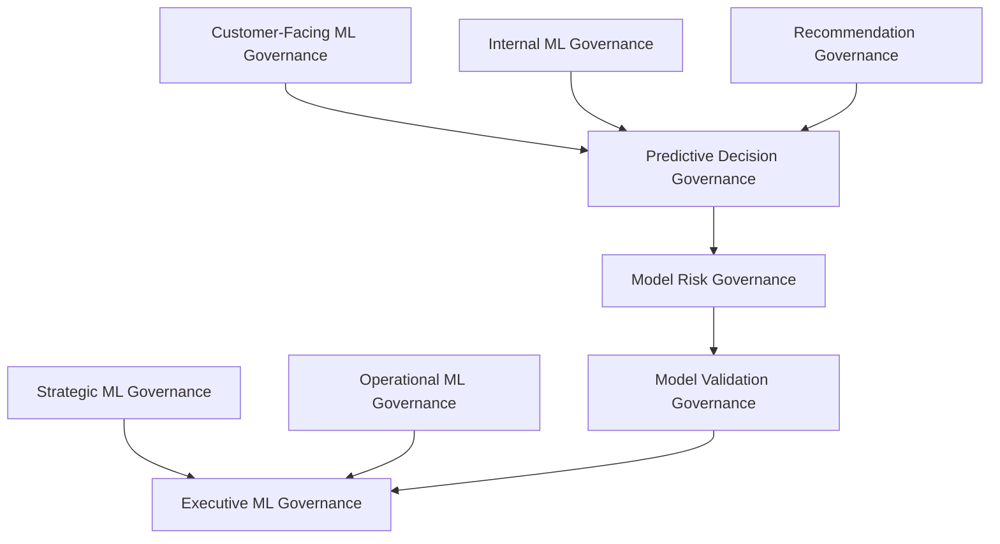
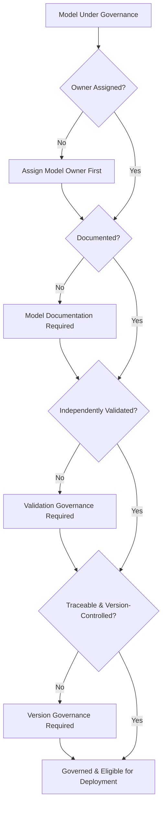
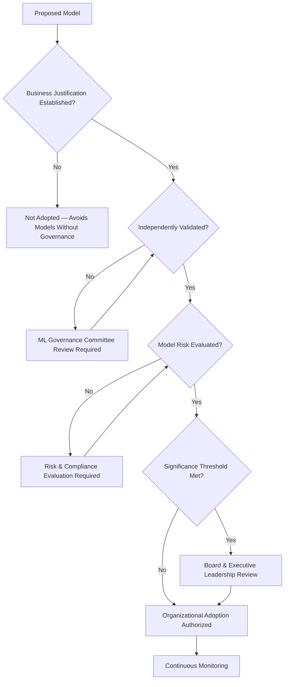
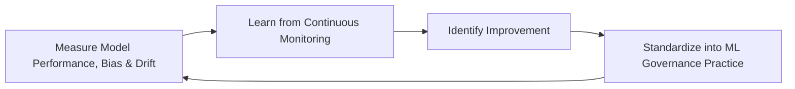
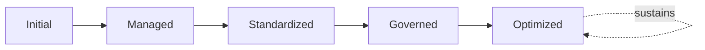

# Enterprise Machine Learning Governance Framework

## 1. Executive Summary

**Purpose** — This document defines the official Enterprise Machine Learning Governance Framework for **StackLeo Tech Store**. It establishes model governance, lifecycle governance, model risk management, validation governance, human oversight, responsible machine learning, executive oversight, and long-term ML maturity as a deliberate, accountable enterprise discipline. `ai-governance.md` establishes the enterprise-wide charter for responsible AI across every capability, including generative and decision-support AI. This framework is the model-specific elaboration operating within that charter, addressing what predictive, classification, recommendation, and forecasting models require beyond `ai-governance.md`'s general principles: independent validation, model-specific risk management, and rigorous documentation of a model's basis, performance, and drift over time. It does not restate `ai-governance.md`'s ethics or oversight structure — it applies that structure with the added rigor a statistical or learned model specifically demands.

**Scope** — This framework applies to every category of machine learning model at StackLeo — strategic, operational, customer-facing, internal, predictive, and recommendation models — across every business function, coordinated with `ai-governance.md`, `data-governance.md`, `analytics-strategy.md`, and `business-intelligence-framework.md`.

**Strategic Objectives** — To ensure a model is adopted at StackLeo only where it is genuinely justified and independently validated; that every model-influenced outcome remains subject to genuine, meaningful human oversight; that a model's performance, bias, and drift are continuously monitored, not assumed static; and that executive leadership and the Board have continuous, honest visibility into the organization's model risk posture.

**Business Value** — Governed machine learning protects the organization from the disproportionate cost of an unvalidated or silently degraded model, protects customer and stakeholder trust from opaque, unaccountable model-driven decisions, and gives leadership the confidence to pursue genuine predictive and recommendation advantage without unknowingly accepting ungoverned model risk.

**Intended Audience** — The Board of Directors, executive leadership, the Chief Technology Officer, the ML Governance Committee, engineering leadership, data leadership, security leadership, risk and compliance functions, and business stakeholders.

## 2. Enterprise Machine Learning Vision

- **ML as Business Capability** — machine learning is governed as a genuine business capability, deliberately adopted for its business value, never pursued as a technical exercise for its own sake.
- **Responsible Automation** — model-driven automation is pursued only in a manner consistent with StackLeo's ethical and risk obligations, never at the expense of them.
- **Trusted Decision Support** — a model's output is governed to be genuinely trustworthy to the humans who rely on it to decide.
- **Sustainable Innovation** — model capability is pursued as a durable organizational asset, not a short-lived technical novelty.
- **Human-Centered Intelligence** — models are governed to augment genuine human judgment, never to silently replace accountable decision-making.
- **Operational Excellence** — model governance gives operational leadership the confidence that model-driven processes perform reliably in genuine production conditions.
- **Long-Term Organizational Value** — model investment is governed to produce lasting organizational capability, coordinated with Continuous Organizational Learning (Section 5).

### Enterprise Machine Learning Vision Matrix

| Vision Element | Focus | Business Value |
|---|---|---|
| ML as Business Capability | Deliberately adopted for genuine business value | Prevents model adoption as a technical exercise for its own sake |
| Responsible Automation | Pursued only consistent with ethical and risk obligations | Protects the organization from avoidable model-driven harm |
| Trusted Decision Support | Output genuinely trustworthy to those who rely on it | Protects the credibility of every model-informed decision |
| Sustainable Innovation | A durable organizational asset, not a short-lived novelty | Protects model investment from being spent on fleeting trends |
| Human-Centered Intelligence | Augments human judgment, never replaces accountable decisions | Preserves genuine human ownership of model-influenced outcomes |
| Operational Excellence | Confidence that model-driven processes perform reliably | Protects production stability of model-touched processes |
| Long-Term Organizational Value | Produces lasting capability, connected to organizational learning | Converts model investment into durable organizational capability |

## 3. Machine Learning Governance Principles

Machine learning governance at StackLeo rests on ten principles, each producing a specific business outcome.

- **Human Oversight** — a genuinely accountable human remains able to review, question, and override a model-influenced outcome. *Business Value:* prevents a model from becoming an unaccountable decision-maker in its own right.
- **Model Transparency** — a model's existence, purpose, and general basis are disclosed to those genuinely affected by its output. *Business Value:* protects trust from the corrosive effect of undisclosed model-driven decisions.
- **Accountability** — every model traces to a specific, named, responsible owner. *Business Value:* ensures no model operates without someone genuinely responsible for it.
- **Fairness** — a model is governed to treat comparable individuals and situations comparably, without unjustified disparate impact. *Business Value:* protects customer and employee trust from discriminatory or inequitable model outcomes.
- **Reliability** — a model is governed to perform genuinely consistently within its defined and disclosed scope. *Business Value:* protects confidence that model-influenced outcomes can be depended upon.
- **Explainability** — a model-influenced outcome can be genuinely explained in terms its recipient can understand. *Business Value:* supports confident investigation, dispute resolution, and accountability.
- **Privacy by Design** — a model is governed to use the minimum necessary personal data, coordinated with `06_Security/privacy-governance.md`. *Business Value:* protects customer trust and regulatory standing from careless data use.
- **Security by Design** — a model is governed with security embedded from the outset, coordinated with `06_Security/security-governance.md`. *Business Value:* protects model capability from becoming a novel attack surface.
- **Continuous Monitoring** — a model's genuine performance, bias, and drift are continuously observed after deployment, never assumed static from validation onward. *Business Value:* protects against the silent degradation of a model's real-world reliability.
- **Continuous Improvement** — ML governance practice matures over time, informed by real operational and validation outcomes. *Business Value:* keeps model governance aligned with the organization's growing scale and the technology's own evolution.

### Machine Learning Governance Principles Matrix

| Principle | Description | Business Value |
|---|---|---|
| Human Oversight | A genuinely accountable human can review and override outcomes | Prevents a model from becoming an unaccountable decision-maker |
| Model Transparency | Existence, purpose, and basis disclosed to those affected | Protects trust from undisclosed model-driven decisions |
| Accountability | Every model traces to a specific, named, responsible owner | Ensures no model operates without genuine responsibility |
| Fairness | Comparable individuals and situations treated comparably | Protects trust from discriminatory or inequitable outcomes |
| Reliability | Performs genuinely consistently within defined scope | Protects confidence that outcomes can be depended upon |
| Explainability | Outcomes explainable in terms the recipient can understand | Supports confident investigation and accountability |
| Privacy by Design | Minimum necessary personal data used | Protects customer trust and regulatory standing |
| Security by Design | Security embedded from the outset | Protects model capability from becoming a novel attack surface |
| Continuous Monitoring | Performance, bias, and drift observed continuously | Protects against silent degradation of real-world reliability |
| Continuous Improvement | Practice matures from real operational and validation outcomes | Keeps governance aligned with growing scale and technology evolution |

## 4. Enterprise ML Governance Model

ML governance operates across nine conceptual domains, each holding accountability for a distinct category of model capability.

### Strategic ML Governance

- **Purpose** — govern model capability adopted in pursuit of StackLeo's long-term strategic direction.
- **Governance Scope** — oversight coordinated with `01_Business/objectives.md` and Strategic AI Governance (`ai-governance.md`, Section 4).
- **Business Value** — ensures strategic model investment is genuinely connected to organizational direction.
- **Executive Expectations** — leadership expects strategic ML governance to be reviewed with the same rigor as any other strategic investment.

### Operational ML Governance

- **Purpose** — govern model capability supporting genuine day-to-day operational activity.
- **Governance Scope** — oversight coordinated with Operational AI Governance (`ai-governance.md`, Section 4).
- **Business Value** — protects the organization's ability to genuinely operate model-touched processes reliably.
- **Executive Expectations** — leadership expects operational models to be governed with the same rigor as any operational system.

### Customer-Facing ML Governance

- **Purpose** — govern model capability that genuinely interacts with, or influences an outcome for, a customer.
- **Governance Scope** — oversight held to elevated rigor given direct customer impact, coordinated with Customer-Facing AI Governance (`ai-governance.md`, Section 4).
- **Business Value** — protects the trust relationship every customer interaction depends on.
- **Executive Expectations** — leadership expects customer-facing models to be transparent, fair, and genuinely explainable to the customer they affect.

### Internal ML Governance

- **Purpose** — govern model capability used internally to support employees and business functions.
- **Governance Scope** — oversight coordinated with Internal AI Governance (`ai-governance.md`, Section 4).
- **Business Value** — protects employees from opaque or unaccountable internal model-driven decisions.
- **Executive Expectations** — leadership expects internal models to be governed to the same standard as customer-facing models.

### Predictive Decision Governance

- **Purpose** — govern model capability that predicts a future outcome to inform a genuinely consequential human decision.
- **Governance Scope** — oversight coordinated with Decision Support AI Governance (`ai-governance.md`, Section 4).
- **Business Value** — protects the integrity of decisions a predictive model is used to inform.
- **Executive Expectations** — leadership expects predictive models to remain genuinely advisory, never a substitute for accountable judgment.

### Recommendation Governance

- **Purpose** — govern model capability that recommends a product, action, or content to a customer or employee.
- **Governance Scope** — oversight coordinated with Customer Experience Enhancement (`ai-governance.md`, Section 5).
- **Business Value** — protects the organization from a recommendation model that erodes, rather than earns, customer trust.
- **Executive Expectations** — leadership expects recommendations to be genuinely relevant and free of manipulative or exploitative design.

### Model Risk Governance

- **Purpose** — own the coherence of how model-specific risk, defined in Section 9, is identified and governed.
- **Governance Scope** — oversight spanning every domain above, coordinated with `06_Security/enterprise-risk-management-strategy.md`.
- **Business Value** — ensures model risk is governed as a single coherent discipline, not fragmented across individual models.
- **Executive Expectations** — leadership trusts no model risk exists outside this framework's visibility.

### Model Validation Governance

- **Purpose** — govern the independent confirmation that a model performs as genuinely intended before and during production use.
- **Governance Scope** — oversight coordinated with Validation Independence (Section 7).
- **Business Value** — protects the organization from deploying a model whose real-world performance was never genuinely verified.
- **Executive Expectations** — leadership expects validation to be genuinely independent of the team that built the model.

### Executive ML Governance

- **Purpose** — govern the synthesized, executive- and Board-relevant picture of model risk and posture across every domain above.
- **Governance Scope** — oversight exclusively accountable for converging every domain into one coherent enterprise picture.
- **Business Value** — protects leadership's and the Board's ability to understand overall model posture as a whole.
- **Executive Expectations** — leadership expects one coherent ML governance picture, not nine disconnected domain views.

### ML Governance Matrix

| Domain | Purpose | Business Value | Executive Expectations |
|---|---|---|---|
| Strategic ML Governance | Govern models in pursuit of long-term strategic direction | Ensures investment is genuinely connected to direction | Expects rigor equal to any strategic investment |
| Operational ML Governance | Govern models supporting day-to-day operational activity | Protects the ability to reliably operate model-touched processes | Expects rigor equal to any operational system |
| Customer-Facing ML Governance | Govern models that interact with or affect a customer | Protects the trust relationship every interaction depends on | Expects transparency, fairness, and explainability |
| Internal ML Governance | Govern models supporting employees and business functions | Protects employees from opaque, unaccountable decisions | Expects the same standard as customer-facing models |
| Predictive Decision Governance | Govern models informing consequential human decisions | Protects the integrity of decisions models are used to inform | Expects models to remain genuinely advisory |
| Recommendation Governance | Govern models recommending products, actions, or content | Protects against a model that erodes rather than earns trust | Expects relevance free of manipulative design |
| Model Risk Governance | Own coherence of model-specific risk identification | Ensures model risk is a single coherent discipline | Trusts no model risk exists outside this framework |
| Model Validation Governance | Govern independent confirmation of genuine model performance | Protects against deploying an unverified model | Expects validation genuinely independent of the builder |
| Executive ML Governance | Synthesize the enterprise model posture picture | Protects leadership's and the Board's ability to understand posture | Expects one coherent picture, not nine disconnected views |

*Diagram 1: Enterprise Machine Learning Governance Framework — strategic and operational ML governance, customer-facing, internal, and recommendation governance converge through predictive decision governance into model risk and validation governance, resolving into executive ML governance's single enterprise picture.*

## 5. ML Capability Domains

ML capability is governed across nine conceptual domains, each requiring a distinct governance emphasis. Remaining implementation independent, these domains describe what a model is used for — never which algorithm, framework, or platform provides it.

- **Predictive Intelligence** — governs model capability that estimates a genuinely future outcome from historical pattern.
- **Classification Intelligence** — governs model capability that assigns a genuine category or label to an input.
- **Recommendation Intelligence** — governs model capability that suggests a genuinely relevant product, action, or content.
- **Forecasting Capability** — governs model capability that projects a genuine future trend or quantity over time.
- **Operational Intelligence** — governs model capability that supports genuine day-to-day operational understanding.
- **Customer Intelligence** — governs model capability that deepens genuine understanding of customer behavior and need.
- **Business Optimization** — governs model capability that identifies a genuinely improved allocation of business resource or effort.
- **Decision Augmentation** — governs model capability that strengthens, without replacing, genuine human decision-making.
- **Continuous Organizational Learning** — governs how model capability, once understood, deepens the organization's genuine collective understanding over time.

### ML Capability Matrix

| Capability | Governance Focus | Coordination |
|---|---|---|
| Predictive Intelligence | Estimating a genuinely future outcome | Predictive Decision Governance (Section 4) |
| Classification Intelligence | Assigning a genuine category or label | Model Governance Framework (Section 7) |
| Recommendation Intelligence | Suggesting a genuinely relevant product, action, or content | Recommendation Governance (Section 4) |
| Forecasting Capability | Projecting a genuine future trend or quantity | Strategic ML Governance (Section 4) |
| Operational Intelligence | Supporting genuine day-to-day operational understanding | Operational ML Governance (Section 4) |
| Customer Intelligence | Deepening genuine understanding of customer behavior | Customer-Facing ML Governance (Section 4) |
| Business Optimization | Identifying genuinely improved resource allocation | Business Optimization coordinated with `analytics-strategy.md` |
| Decision Augmentation | Strengthening, without replacing, human decision-making | Human Oversight (Section 3) |
| Continuous Organizational Learning | Deepening collective understanding over time | Continuous Improvement (Section 3) |

## 6. ML Lifecycle Governance

ML governance operates across nine conceptual lifecycle stages.

- **Opportunity Identification** — govern how a genuine ML opportunity is recognized before model capability is pursued.
- **Business Justification** — govern how an identified opportunity's genuine business value is established.
- **Governance Approval** — govern how a justified opportunity is formally approved against the appropriate domain in Section 4.
- **Model Development Governance** — govern the oversight applied while a model is being genuinely developed, without prescribing the technical method.
- **Validation Governance** — govern how a developed model is independently confirmed to perform as genuinely intended.
- **Organizational Adoption** — govern how a validated model is genuinely adopted into organizational practice.
- **Executive Oversight** — govern the point at which a model requires executive- or Board-level visibility.
- **Continuous Monitoring** — govern how a deployed model is continuously observed for genuine performance, bias, and drift.
- **Model Retirement** — govern the periodic reassessment of whether a model remains genuinely justified, and its deliberate retirement when it no longer is.

### ML Lifecycle Matrix

| Stage | Governance Objective | Business Value |
|---|---|---|
| Opportunity Identification | Recognize a genuine ML opportunity | Ensures model effort is deliberately directed |
| Business Justification | Establish genuine business value | Protects investment from being spent on unjustified adoption |
| Governance Approval | Formally approve against the appropriate domain | Ensures approval by the genuinely accountable function |
| Model Development Governance | Apply oversight during genuine development | Ensures development remains within governed boundaries |
| Validation Governance | Independently confirm genuine model performance | Protects against deploying an unverified model |
| Organizational Adoption | Adopt a validated model into practice | Ensures investment converts into genuine organizational use |
| Executive Oversight | Elevate a model requiring executive or Board visibility | Engages leadership exactly when genuinely warranted |
| Continuous Monitoring | Observe performance, bias, and drift continuously | Detects degradation while it can still be addressed |
| Model Retirement | Reassess justification and retire deliberately | Prevents accumulation of stale or unjustified models |

*Diagram 2: ML Lifecycle Governance Model — opportunity identification and business justification inform governance approval and model development governance, feeding validation governance and organizational adoption, with executive oversight, continuous monitoring, and deliberate retirement feeding lessons back into the cycle.*

## 7. Model Governance Framework

- **Model Ownership** — governs every model's traceability to a specific, named, responsible owner accountable for its outcomes.
- **Model Documentation** — governs whether a model's genuine purpose, basis, scope, and limitations are documented and available for review.
- **Validation Independence** — governs whether a model's validation is genuinely performed independently of the team that built it.
- **Explainability** — governs whether a model's outcomes can be genuinely explained in terms the recipient can understand.
- **Traceability** — governs whether a model-influenced outcome can be traced back to the specific model version and input that produced it.
- **Version Governance** — governs whether a model's current, deployed version is genuinely unambiguous and controlled.
- **Change Governance** — governs how a genuine change to a deployed model is reviewed and approved before it takes effect.
- **Lifecycle Accountability** — governs whether accountability for a model persists genuinely across its full lifecycle, not only at initial deployment.
- **Governance Reviews** — governs the periodic, formal review of a model's continued justification, performance, and governance standing.

### Model Governance Matrix

| Governance Area | Focus | Coordination |
|---|---|---|
| Model Ownership | Traceability to a specific, named, responsible owner | Accountability (Section 3) |
| Model Documentation | Purpose, basis, scope, and limitations documented | Model Transparency (Section 3) |
| Validation Independence | Validation genuinely independent of the builder | Model Validation Governance (Section 4) |
| Explainability | Outcomes explainable in terms the recipient can understand | Explainability (Section 3) |
| Traceability | An outcome traceable to model version and input | Continuous Monitoring (Section 3) |
| Version Governance | Current, deployed version genuinely unambiguous | Change Governance (below) |
| Change Governance | A genuine change reviewed and approved before effect | Governance Approval (Section 6) |
| Lifecycle Accountability | Accountability persisting across the full lifecycle | Model Ownership (above) |
| Governance Reviews | Periodic review of justification, performance, standing | Executive Oversight (Section 10) |

*Diagram 3: Model Governance Structure — a model under governance is checked in sequence for assigned ownership, documentation, independent validation, and traceable version control, becoming eligible for deployment only once every governance requirement is genuinely satisfied.*

## 8. Organizational Governance

Governance accountability is distributed deliberately across nine organizational roles.

- **Board of Directors** — holds ultimate accountability for StackLeo's overall model risk posture and its alignment with organizational values.
- **Executive Leadership** — holds accountability for whether machine learning genuinely serves the business responsibly, in partnership with the Board.
- **Chief Technology Officer** — owns the coherence and enforcement of this framework across every ML domain and governance layer it defines.
- **ML Governance Committee** — owns the operational review of models against Sections 4, 6, and 7 of this framework.
- **Engineering Leadership** — owns Operational and Internal ML Governance (Section 4) within their accountable teams.
- **Data Leadership** — owns alignment of this framework with `data-governance.md`, ensuring models are never built on ungoverned data.
- **Security Leadership** — owns Security by Design (Section 3) jointly with `06_Security/security-governance.md`, which remains authoritative for security-specific obligations.
- **Risk & Compliance** — own Model Risk Governance (Section 4) jointly with `06_Security/enterprise-risk-management-strategy.md` and `06_Security/compliance-governance.md`.
- **Business Stakeholders** — own the business justification and adoption of model capability within their accountable domain.

### Organizational Responsibility Matrix

| Role | Governance Objective | Business Value |
|---|---|---|
| Board of Directors | Hold ultimate accountability for overall model risk posture | Provides the highest point of ultimate accountability |
| Executive Leadership | Hold accountability for ML serving the business responsibly | Provides a single point of executive-level accountability |
| Chief Technology Officer | Own coherence and enforcement of this framework | Provides a single point of specialist accountability |
| ML Governance Committee | Own operational review against Sections 4, 6, and 7 | Provides a dedicated, cross-functional review body |
| Engineering Leadership | Own operational and internal ML governance | Embeds accountability closest to where models are built |
| Data Leadership | Own alignment with `data-governance.md` | Ensures models are never built on ungoverned data |
| Security Leadership | Own security by design jointly with security governance | Ensures models are never a novel, ungoverned attack surface |
| Risk & Compliance | Own model risk governance | Ensures model risk is genuinely identified and weighed |
| Business Stakeholders | Own business justification and adoption within their domain | Connects model capability to genuine business relevance |

*Diagram 4: ML Decision Oversight Flow — a proposed model is checked for business justification, independent validation, and model risk evaluation, escalating to Board and executive leadership review where significance thresholds are met, resolving into authorized adoption and continuous monitoring.*

## 9. ML Risk Governance

Model-related risk is governed across nine conceptual categories.

- **Model Bias Risks** — the risk that a model's training basis or design produces a systematically distorted outcome for a particular group.
- **Prediction Risks** — the risk that a model's prediction is genuinely wrong in a way that materially affects a decision.
- **Explainability Risks** — the risk that a model's outcome cannot be genuinely explained to the person it affects.
- **Privacy Risks** — the risk that a model uses or exposes personal data beyond what is genuinely necessary.
- **Security Risks** — the risk that a model introduces or is exploited as a novel security weakness.
- **Compliance Risks** — the risk that a model fails to meet a genuine, and increasingly evolving, regulatory or contractual obligation.
- **Operational Risks** — the risk that a model behaves unreliably or degrades silently in genuine production conditions.
- **Reputational Risks** — the risk that a model-related failure or controversy damages StackLeo's standing with customers, partners, or the market.
- **Strategic Risks** — the risk that the organization either over-adopts models without genuine justification, or under-adopts them and forfeits genuine competitive advantage.

### ML Risk Governance Matrix

| Risk Category | Focus | Governance Coordination |
|---|---|---|
| Model Bias Risks | Systematically distorted outcome for a particular group | Coordinated with Fairness (Section 3) |
| Prediction Risks | A genuinely wrong prediction materially affecting a decision | Coordinated with Predictive Decision Governance (Section 4) |
| Explainability Risks | An outcome that cannot be genuinely explained | Coordinated with Explainability (Section 3) |
| Privacy Risks | Personal data used or exposed beyond genuine necessity | Coordinated with `06_Security/privacy-governance.md` |
| Security Risks | A model introducing or exploited as a novel weakness | Coordinated with `06_Security/security-governance.md` |
| Compliance Risks | Failure to meet evolving regulatory obligation | Coordinated with `06_Security/compliance-governance.md` |
| Operational Risks | Unreliable behavior or silent degradation in production | Coordinated with Continuous Monitoring (Section 3) |
| Reputational Risks | Damage to standing with customers, partners, market | Coordinated with Executive ML Governance (Section 4) |
| Strategic Risks | Over-adoption without justification, or under-adoption | Coordinated with Strategic ML Governance (Section 4) |

## 10. Executive Oversight

- **Executive ML Reviews** — the overall coherence of ML governance is formally reviewed directly with executive leadership and the Board on a regular cadence.
- **Model Governance Reviews** — adherence to the Model Governance Framework (Section 7) is periodically reviewed with executive leadership.
- **Risk Reviews** — model-specific risk posture is reviewed directly with executive leadership and risk and compliance functions.
- **Compliance Reviews** — model adherence to regulatory and contractual obligation is periodically reviewed with executive leadership.
- **Business Value Reviews** — the genuine business value realized from model investment is periodically reviewed with executive leadership.
- **Continuous Improvement Reviews** — the organization's follow-through on captured ML governance lessons is reviewed directly with executive leadership.

### Executive Oversight Matrix

| Oversight Mechanism | Purpose | Governance Role |
|---|---|---|
| Executive ML Reviews | Confirm overall ML governance coherence | Regular, predictable cadence for the framework as a whole |
| Model Governance Reviews | Review adherence to the Model Governance Framework | Periodic executive-level model governance review |
| Risk Reviews | Review model-specific risk posture | Direct executive-level and risk and compliance review |
| Compliance Reviews | Review adherence to regulatory and contractual obligation | Periodic executive-level compliance review |
| Business Value Reviews | Review genuine business value realized from investment | Periodic executive-level value review |
| Continuous Improvement Reviews | Review follow-through on captured lessons | Direct executive-level review of improvement completion |

## 11. Future Readiness

This framework is designed to remain valid as StackLeo evolves in scale, geography, and organizational complexity.

- **Foundation Model Governance** — where StackLeo increasingly builds upon large, pre-trained foundation models rather than models trained from scratch, that capability remains governed under Model Validation Governance (Section 4) at the same rigor as any other model.
- **AI + ML Convergence** — as the distinction between generative AI, governed under `ai-governance.md`, and traditional ML narrows, both remain jointly subject to whichever framework's requirements are more rigorous for a given capability.
- **Autonomous Decision Support (Conceptual)** — where model-driven decision support increasingly operates with reduced human intervention, that capability remains governed under Human Oversight (Section 3), never permitted to substitute for genuine human accountability.
- **Enterprise ML at Scale** — the governance model, domains, and lifecycle defined throughout this framework are defined independently of organizational size or the number of models in production.
- **Federated Learning Governance (Conceptual)** — where model development increasingly draws on distributed data without centralizing it, that approach remains governed under Model Development Governance (Section 6) at the same rigor as any other method.
- **Responsible Innovation** — new model capability is adopted only in a manner consistent with the Model Governance Framework (Section 7), never at its expense.
- **Global Regulatory Readiness** — Governance Approval and Compliance Reviews (Sections 6 and 10) are structured to be re-applied as StackLeo expands from Bangladesh into South Asia and global markets, each with genuinely distinct and evolving model-specific regulation.

## 12. Machine Learning Maturity Model

ML governance maturity is described across five conceptual levels.

- **Initial** — model adoption, where it exists, is informal and inconsistent; models are introduced reactively, and ownership is unclear.
- **Managed** — basic ML governance exists for individual domains, but consistency across the nine domains in Section 4 varies significantly.
- **Standardized** — the governance model, domains, and lifecycle are standardized, documented, and consistently applied across the organization.
- **Governed** — models are consistently and rigorously governed across validation, risk, and documentation, with genuine executive and Board visibility.
- **Optimized** — ML governance is continuously and deliberately improved based on quantitative evidence and organizational learning; improvement itself is a managed, ongoing discipline.

### ML Maturity Matrix

| Level | Characteristics | Primary Focus |
|---|---|---|
| Initial | Informal, inconsistent adoption; models introduced reactively | Ad hoc, individually-dependent ML practice |
| Managed | Basic governance exists per domain; consistency varies | Domain-level consistency |
| Standardized | Standardized governance model, domains, and lifecycle | Organization-wide consistency and clear ownership |
| Governed | Rigorous governance across validation, risk, and documentation | Genuine executive and Board visibility |
| Optimized | Practice continuously and deliberately improved from evidence | Sustained, deliberate improvement as a discipline |

*Diagram 5: Continuous ML Governance Improvement Cycle — model performance, bias, and drift are measured, learned from, improved upon, and standardized back into governed practice, on a continuing basis.*

*Diagram 6: ML Maturity Progression — maturity advances from informal, reactively-introduced model practice toward standardized, rigorously governed, and continuously optimized machine learning governance.*

## 13. Machine Learning Anti-Patterns

- **Models Without Governance** — adopting a model without genuine governance review accepts avoidable exposure without an accountable decision behind it.
- **Unvalidated Models** — deploying a model without genuine, independent validation risks acting on a prediction that was never confirmed to work.
- **Black-Box Decisions** — deploying a model whose outcomes cannot be genuinely explained undermines accountability and trust.
- **Weak Ownership** — a model with no accountable owner has no one genuinely responsible for its outcomes.
- **Missing Documentation** — a model without genuine documentation of its purpose, basis, and limitations cannot be responsibly reviewed or governed.
- **Ignoring Model Drift** — failing to continuously monitor a deployed model allows its real-world performance to silently degrade unnoticed.
- **Compliance Neglect** — failing to track evolving model-specific regulatory obligation leaves the organization exposed as regulation matures.
- **Automation Without Accountability** — allowing a model to drive an outcome without a genuinely accountable human forfeits the Human Oversight principle entirely.

### Anti-Pattern Summary

| Anti-Pattern | Organizational & Business Impact |
|---|---|
| Models Without Governance | Accepts avoidable exposure without any accountable decision behind it |
| Unvalidated Models | Risks acting on a prediction that was never confirmed to work |
| Black-Box Decisions | Undermines accountability and trust in model-influenced outcomes |
| Weak Ownership | Leaves no one genuinely responsible for model outcomes |
| Missing Documentation | Prevents a model from being responsibly reviewed or governed |
| Ignoring Model Drift | Allows real-world performance to silently degrade unnoticed |
| Compliance Neglect | Leaves the organization exposed as regulation matures |
| Automation Without Accountability | Forfeits the Human Oversight principle entirely |

## Related Documents

| Document | Relationship |
|---|---|
| `data-governance.md` | Governs the ownership, classification, and quality of the data this framework's models are built upon. |
| `analytics-strategy.md` | Consumes model-derived predictions as an input to Predictive and Prescriptive Analytics capability. |
| `business-intelligence-framework.md` | Consumes model-derived intelligence as an input to Enterprise Performance Intelligence. |
| `ai-governance.md` | Establishes the enterprise-wide responsible AI charter this framework applies with model-specific rigor. |
| `data-quality-framework.md` | Governs the AI/ML Data Quality this framework's Validation Governance (Section 6) coordinates with, alongside `04_Database/data-quality-governance.md`. |
| `06_Security/privacy-governance.md` | Governs the privacy discipline this framework's Privacy by Design principle (Section 3) depends on. |
| `06_Security/security-governance.md` | Governs the security discipline this framework's Security by Design principle (Section 3) depends on. |
| `06_Security/enterprise-risk-management-strategy.md` | Governs the enterprise risk discipline this framework's Model Risk Governance (Section 4) is the model-specific instantiation of. |

## Document Information

| Property | Value |
|----------|-------|
| Document | ml-governance.md |
| Version | 1.0.0 |
| Status | Active |
| Maintained By | StackLeo |
| Last Updated | 2026-07-28 |

---

© StackLeo. All Rights Reserved.
