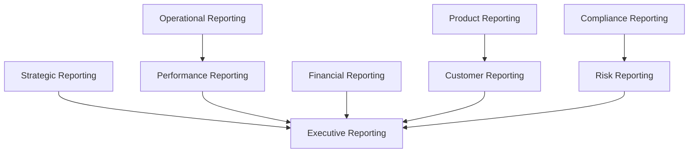
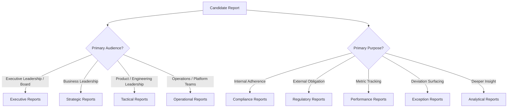
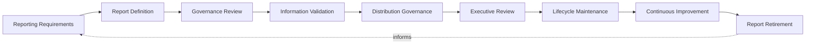
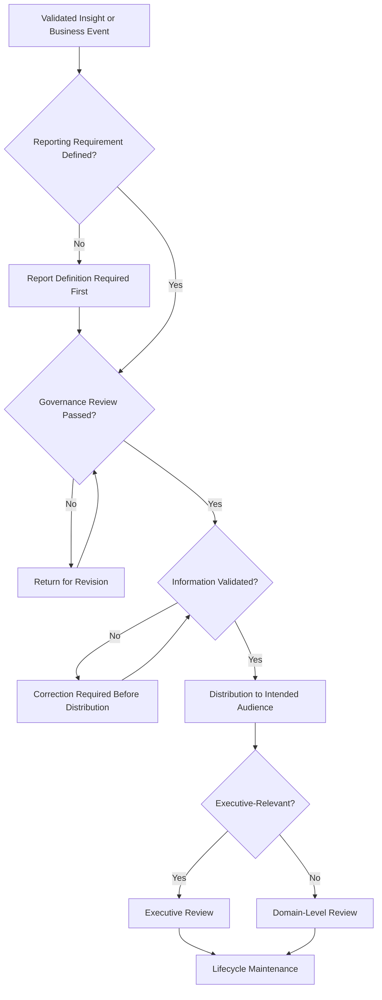
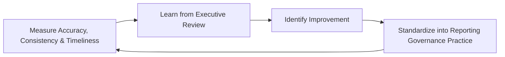
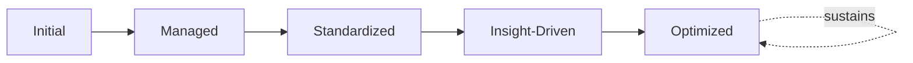

# Enterprise Reporting Governance Framework

## 1. Executive Summary

**Purpose** — This document defines the official Enterprise Reporting Governance Framework for **StackLeo Tech Store**. It establishes reporting governance, information distribution, reporting quality, executive reporting, organizational accountability, lifecycle governance, and long-term reporting maturity as a deliberate, accountable enterprise discipline. `analytics-strategy.md` anticipated this framework directly (Related Documents) as the dedicated governance treatment of how validated insight becomes a formal report. This framework does not restate analytics governance. It is the governance layer specifically responsible for the moment genuine insight is packaged, distributed, and presented as trustworthy business information to the people who must act on it.

**Scope** — This framework applies to every category of report produced across StackLeo — executive, strategic, operational, financial, product, customer, compliance, risk, and performance reporting — across every business function, coordinated with `data-governance.md`, `analytics-strategy.md`, and `metrics-governance.md`.

**Strategic Objectives** — To ensure every report StackLeo produces is genuinely accurate before it is fast; that a single, authoritative version of business truth exists for any given fact; that reports are distributed to genuinely the right audience, in the right form; and that executive leadership has continuous, honest confidence in the information it is given to govern with.

**Business Value** — Governed reporting protects the organization from the disproportionate cost of a decision made on inconsistent or stale information, protects leadership's ability to trust what it is shown without independently re-verifying it, and gives the Board and executive leadership confidence that StackLeo's reported business picture is honest and defensible.

**Intended Audience** — Executive leadership, the Chief Technology Officer, business leadership, the Data Governance Council, analytics leadership, engineering leadership, compliance leadership, and business stakeholders.

## 2. Enterprise Reporting Vision

- **Reporting as Strategic Communication** — reporting is governed as a genuine strategic communication capability, never merely a technical output.
- **Trusted Business Information** — a report is governed to be trusted at face value by the audience it reaches.
- **Executive Decision Support** — reporting exists to give executive leadership the genuine, timely information their most consequential decisions depend on.
- **Operational Transparency** — reporting gives operators and managers an honest, accurate picture of genuine operational reality.
- **Organizational Alignment** — reporting is governed to give every level of the organization a genuinely consistent understanding of business reality.
- **Business Performance Visibility** — reporting connects organizational activity directly to genuine, understood business performance.
- **Continuous Organizational Learning** — reported information, reviewed over time, deepens the organization's genuine collective understanding.

### Enterprise Reporting Vision Matrix

| Vision Element | Focus | Business Value |
|---|---|---|
| Reporting as Strategic Communication | Genuine strategic communication capability | Prevents reporting from being treated as a mechanical output |
| Trusted Business Information | Trusted at face value by the audience it reaches | Removes the cost of independently re-verifying every report |
| Executive Decision Support | Gives leadership the timely information decisions depend on | Informs the organization's most consequential decisions |
| Operational Transparency | An honest, accurate picture of operational reality | Supports confident, informed operational management |
| Organizational Alignment | A genuinely consistent understanding across the organization | Prevents divergent, conflicting interpretations of business reality |
| Business Performance Visibility | Connects activity directly to genuine, understood performance | Keeps reporting tethered to what the business actually values |
| Continuous Organizational Learning | Reviewed information deepens collective understanding | Converts reported evidence into durable organizational insight |

## 3. Reporting Governance Principles

Reporting governance at StackLeo rests on nine principles, each producing a specific business outcome.

- **Accuracy Before Speed** — a report is governed to be genuinely correct before it is delivered quickly. *Business Value:* protects decisions from being made on information that was fast but wrong.
- **Single Source of Truth** — a given business fact resolves identically wherever it is reported, coordinated with `data-governance.md`. *Business Value:* prevents divergent reports from silently undermining each other's credibility.
- **Business Relevance** — a report is governed to answer a genuine business question, not to exist for its own sake. *Business Value:* protects reporting effort from being spent on information no one genuinely needs.
- **Transparency** — a report's data sources, definitions, and assumptions are documented and visible to those who genuinely need them. *Business Value:* allows reported information to be scrutinized and defended, not merely trusted on faith.
- **Consistency** — a report's format, terminology, and cadence remain genuinely stable and predictable for its audience. *Business Value:* reduces the cognitive burden of interpreting recurring business information.
- **Accountability** — every report traces to a specific, named, responsible owner. *Business Value:* ensures no report is left to silently drift out of accuracy or relevance.
- **Traceability** — every reported figure can be traced back to the specific data and calculation that produced it. *Business Value:* supports confident audit, investigation, and defense of reported information.
- **Accessibility** — a report reaches its intended audience in a genuinely usable, understandable form. *Business Value:* ensures reporting investment converts into genuine organizational understanding.
- **Continuous Improvement** — reporting governance practice matures over time, informed by real audience and decision outcomes. *Business Value:* keeps reporting aligned with the organization's growing scale and complexity.

### Reporting Governance Principles Matrix

| Principle | Description | Business Value |
|---|---|---|
| Accuracy Before Speed | Genuinely correct before delivered quickly | Protects decisions from information that was fast but wrong |
| Single Source of Truth | A given fact resolves identically wherever reported | Prevents divergent reports undermining each other's credibility |
| Business Relevance | Answers a genuine business question | Protects effort from being spent on unneeded information |
| Transparency | Sources, definitions, and assumptions documented and visible | Allows reported information to be scrutinized and defended |
| Consistency | Format, terminology, and cadence remain stable | Reduces the cognitive burden of interpreting recurring reports |
| Accountability | Every report traces to a specific, named, responsible owner | Ensures no report drifts without genuine responsibility |
| Traceability | Every figure traces to the data and calculation behind it | Supports confident audit, investigation, and defense |
| Accessibility | Reaches its audience in a genuinely usable, understandable form | Ensures reporting investment converts into genuine understanding |
| Continuous Improvement | Practice matures from real audience and decision outcomes | Keeps reporting aligned with growing scale and complexity |

## 4. Enterprise Reporting Governance Model

Reporting governance operates across nine conceptual domains, each holding accountability for a distinct category of business report.

### Executive Reporting

- **Purpose** — govern the synthesized, executive-relevant picture of organizational performance across every domain below.
- **Governance Scope** — oversight exclusively accountable for converging every domain into one coherent picture for leadership.
- **Business Value** — protects leadership's ability to understand overall performance without wading through raw domain detail.
- **Executive Expectations** — leadership expects one coherent report, not eight disconnected domain feeds.

### Strategic Reporting

- **Purpose** — govern reporting on progress against StackLeo's long-term strategic objectives.
- **Governance Scope** — oversight coordinated with `01_Business/objectives.md` and Strategic Analytics (`analytics-strategy.md`, Section 4).
- **Business Value** — connects day-to-day reporting to genuine long-term organizational direction.
- **Executive Expectations** — leadership expects strategic reporting to be reviewed with the same rigor as quarterly business performance.

### Operational Reporting

- **Purpose** — govern reporting that supports how the platform and organization are genuinely operated day to day.
- **Governance Scope** — oversight coordinated with `09_Operations/operations-governance.md`.
- **Business Value** — protects the organization's ability to genuinely operate what it has built.
- **Executive Expectations** — leadership expects operational reporting to extend genuinely beyond the moment of a single decision.

### Financial Reporting

- **Purpose** — govern reporting on genuine financial performance and business health.
- **Governance Scope** — oversight held to the highest integrity standard in this model, coordinated with finance function accountability.
- **Business Value** — protects the trustworthiness of the organization's most consequential business decisions.
- **Executive Expectations** — leadership expects financial reporting to be unimpeachably accurate and independently defensible.

### Product Reporting

- **Purpose** — govern reporting on how the product is genuinely adopted, used, and valued.
- **Governance Scope** — oversight coordinated with Product Analytics (`analytics-strategy.md`, Section 4).
- **Business Value** — protects the ability to understand whether the product is genuinely succeeding with customers.
- **Executive Expectations** — leadership expects product reporting to reflect genuine usage and value.

### Customer Reporting

- **Purpose** — govern reporting on genuine customer behavior, need, and experience.
- **Governance Scope** — oversight coordinated with `06_Security/privacy-governance.md`, given the sensitivity of customer-level reporting.
- **Business Value** — protects the trust relationship every customer interaction depends on.
- **Executive Expectations** — leadership expects customer reporting to balance genuine insight against privacy responsibility.

### Compliance Reporting

- **Purpose** — govern reporting that demonstrates genuine adherence to regulatory and contractual obligation.
- **Governance Scope** — oversight coordinated with `06_Security/compliance-governance.md` and `06_Security/audit-governance.md`.
- **Business Value** — protects the organization's standing with regulators and counterparties.
- **Executive Expectations** — leadership expects compliance reporting to be complete, accurate, and audit-ready at any time.

### Risk Reporting

- **Purpose** — govern reporting on genuine organizational risk exposure.
- **Governance Scope** — oversight coordinated with `06_Security/enterprise-risk-management-strategy.md`.
- **Business Value** — protects leadership's ability to make risk-informed decisions with genuine, current evidence.
- **Executive Expectations** — leadership expects risk reporting to be honest, even when the picture is unfavorable.

### Performance Reporting

- **Purpose** — govern reporting on genuine organizational performance against governed metrics.
- **Governance Scope** — oversight coordinated with `metrics-governance.md`.
- **Business Value** — connects reported evidence directly to the metrics the organization has already agreed genuinely matter.
- **Executive Expectations** — leadership expects performance reporting to be consistent with, never contradictory to, governed metrics.

### Reporting Governance Matrix

| Domain | Purpose | Business Value | Executive Expectations |
|---|---|---|---|
| Executive Reporting | Synthesize the enterprise performance picture | Protects leadership's ability to understand performance as a whole | Expects one coherent report, not disconnected feeds |
| Strategic Reporting | Govern reporting on progress against strategic objectives | Connects reporting to genuine long-term direction | Expects rigor equal to quarterly business performance |
| Operational Reporting | Govern reporting supporting day-to-day operation | Protects the ability to genuinely operate what is built | Expects reporting extending beyond a single decision |
| Financial Reporting | Govern reporting on financial performance and health | Protects trustworthiness of the most consequential decisions | Expects unimpeachable accuracy and defensibility |
| Product Reporting | Govern reporting on product adoption, usage, and value | Protects ability to understand genuine product success | Expects reflection of genuine usage and value |
| Customer Reporting | Govern reporting on customer behavior, need, and experience | Protects the trust relationship every interaction depends on | Expects balance against privacy responsibility |
| Compliance Reporting | Govern reporting demonstrating regulatory adherence | Protects the organization's standing with regulators | Expects completeness and audit-readiness at any time |
| Risk Reporting | Govern reporting on genuine organizational risk exposure | Protects risk-informed decision-making with current evidence | Expects honesty, even when the picture is unfavorable |
| Performance Reporting | Govern reporting on performance against governed metrics | Connects evidence directly to metrics already agreed to matter | Expects consistency with governed metrics |

*Diagram 1: Enterprise Reporting Governance Framework — strategic reporting, operational and performance reporting, financial reporting, product and customer reporting, and compliance and risk reporting all converge on executive reporting, which synthesizes every domain into one coherent enterprise picture.*

## 5. Reporting Classification Framework

Reports are governed across nine conceptual classifications, each carrying a distinct governance objective. Remaining implementation independent, this framework classifies reports by audience and purpose — never by tool, format, or distribution mechanism.

- **Executive Reports** — govern the synthesized picture presented directly to executive leadership and the Board.
- **Strategic Reports** — govern reporting on long-term organizational direction and objective progress.
- **Tactical Reports** — govern reporting supporting mid-term operational and product decisions.
- **Operational Reports** — govern reporting on day-to-day platform and process behavior.
- **Compliance Reports** — govern reporting demonstrating internal policy adherence.
- **Regulatory Reports** — govern reporting demonstrating adherence to external regulatory or contractual obligation.
- **Performance Reports** — govern reporting against governed metrics and organizational performance targets.
- **Exception Reports** — govern reporting that surfaces a genuine deviation from expected business or operational condition.
- **Analytical Reports** — govern reporting that presents deeper analytical insight in support of a specific business question.

### Report Classification Matrix

| Classification | Governance Objective | Primary Audience |
|---|---|---|
| Executive Reports | Present the synthesized enterprise picture | Executive Leadership, Board |
| Strategic Reports | Report on long-term direction and objective progress | Executive Leadership, Business Leadership |
| Tactical Reports | Support mid-term operational and product decisions | Product and Engineering Leadership |
| Operational Reports | Report on day-to-day platform and process behavior | Operations Leadership, Platform Teams |
| Compliance Reports | Demonstrate internal policy adherence | Compliance Leadership |
| Regulatory Reports | Demonstrate adherence to external obligation | Compliance Leadership, Regulators |
| Performance Reports | Report against governed metrics and targets | Executive Leadership, Business Stakeholders |
| Exception Reports | Surface a genuine deviation from expected condition | Accountable Domain Owners |
| Analytical Reports | Present deeper analytical insight for a business question | Business Stakeholders, Analytics Leadership |

*Diagram 3: Report Classification Framework — a candidate report is classified by primary audience into executive, strategic, tactical, or operational reports, and by primary purpose into compliance, regulatory, performance, exception, or analytical reports.*

## 6. Reporting Lifecycle Governance

Reporting governance operates across nine conceptual lifecycle stages.

- **Reporting Requirements** — govern how a genuine reporting need is identified and defined before a report is built.
- **Report Definition** — govern how a report's content, audience, and cadence are formally defined and standardized.
- **Governance Review** — govern how a defined report is reviewed against the appropriate domain in Section 4.
- **Information Validation** — govern how a report's underlying information is confirmed accurate before distribution.
- **Distribution Governance** — govern how a validated report reaches its genuinely intended audience.
- **Executive Review** — govern the point at which a report's content and continued relevance are reviewed with executive leadership.
- **Lifecycle Maintenance** — govern the ongoing upkeep of a report's accuracy, definitions, and relevance over time.
- **Continuous Improvement** — govern how reporting practice is deliberately strengthened based on real audience and decision outcomes.
- **Report Retirement** — govern the deliberate retirement of a report once it no longer serves a genuine purpose.

### Reporting Lifecycle Matrix

| Stage | Governance Objective | Business Value |
|---|---|---|
| Reporting Requirements | Identify and define a genuine reporting need | Ensures reporting effort is deliberately directed |
| Report Definition | Formally define content, audience, and cadence | Prevents ambiguity in what a report is meant to convey |
| Governance Review | Review a defined report against the appropriate domain | Ensures review by the genuinely accountable function |
| Information Validation | Confirm underlying information accurate before distribution | Protects the credibility of every reliant decision |
| Distribution Governance | Reach the genuinely intended audience | Ensures reporting investment reaches those who need it |
| Executive Review | Review content and continued relevance with leadership | Ensures leadership sees only genuinely trustworthy information |
| Lifecycle Maintenance | Maintain accuracy, definitions, and relevance over time | Prevents a report from silently drifting out of accuracy |
| Continuous Improvement | Strengthen practice from real audience and decision outcomes | Keeps reporting practice compounding in capability |
| Report Retirement | Deliberately retire a report no longer serving a purpose | Prevents accumulation of stale, unused, or misleading reports |

*Diagram 2: Reporting Lifecycle Model — requirements and definition inform governance review and information validation, feeding distribution and executive review, with lifecycle maintenance, continuous improvement, and deliberate retirement feeding lessons back into the cycle.*

## 7. Reporting Quality Governance

- **Information Accuracy** — a report is governed to genuinely and reliably reflect the information it claims to represent.
- **Data Consistency** — a report's figures are governed to align with the single source of truth (Section 3), never diverge from it silently.
- **Report Completeness** — a report is governed to include the genuinely necessary context for its audience to interpret it correctly.
- **Timeliness** — a report reaches its audience within a genuinely useful window relative to the decision it informs.
- **Readability** — a report is governed to be genuinely understandable to its intended audience, without requiring specialist interpretation.
- **Accessibility** — a report is governed to be genuinely available to everyone with a legitimate, authorized need for it.
- **Version Governance** — a report's current, authoritative version is governed to be unambiguous to its audience at all times.
- **Business Context** — a report is governed to convey genuine business relevance, not only raw figures.

### Reporting Quality Matrix

| Quality Area | Focus | Governance Coordination |
|---|---|---|
| Information Accuracy | Genuinely and reliably reflecting represented information | Coordinated with Accuracy Before Speed (Section 3) |
| Data Consistency | Alignment with the single source of truth | Coordinated with `data-governance.md` |
| Report Completeness | Including genuinely necessary interpretive context | Coordinated with Business Relevance (Section 3) |
| Timeliness | Reaching the audience within a genuinely useful window | Coordinated with Distribution Governance (Section 6) |
| Readability | Genuinely understandable without specialist interpretation | Coordinated with Accessibility (Section 3) |
| Accessibility | Available to everyone with legitimate, authorized need | Coordinated with `06_Security/privacy-governance.md` |
| Version Governance | Unambiguous current, authoritative version | Coordinated with Lifecycle Maintenance (Section 6) |
| Business Context | Conveying genuine business relevance, not only figures | Coordinated with Business Relevance (Section 3) |

## 8. Organizational Governance

Governance accountability is distributed deliberately across eight organizational roles.

- **Executive Leadership** — holds ultimate accountability for whether StackLeo's reporting is genuinely trustworthy.
- **Chief Technology Officer** — owns the coherence and enforcement of this framework across every reporting domain and governance layer it defines.
- **Business Leadership** — owns Strategic and Financial Reporting (Section 4) alignment with genuine business priority.
- **Data Governance Council** — owns alignment of this framework with `data-governance.md`, ensuring reporting is never built on ungoverned data.
- **Analytics Leadership** — owns the conversion of validated insight from `analytics-strategy.md` into governed reports.
- **Engineering Leadership** — owns Operational Reporting (Section 4) within their accountable teams.
- **Compliance Leadership** — owns Compliance and Regulatory Reports (Section 5) jointly with `06_Security/compliance-governance.md`.
- **Business Stakeholders** — own Product and Customer Reporting (Section 4) alignment with genuine business priority.

### Organizational Responsibility Matrix

| Role | Governance Objective | Business Value |
|---|---|---|
| Executive Leadership | Hold ultimate accountability for trustworthy reporting | Provides a single point of ultimate accountability |
| Chief Technology Officer | Own coherence and enforcement of this framework | Provides a single point of specialist accountability |
| Business Leadership | Own strategic and financial reporting alignment | Ensures reporting reflects genuine business priority |
| Data Governance Council | Own alignment with `data-governance.md` | Ensures reporting is never built on ungoverned data |
| Analytics Leadership | Own conversion of validated insight into governed reports | Connects analytics directly to trustworthy reporting |
| Engineering Leadership | Own operational reporting | Embeds reporting accountability closest to operations |
| Compliance Leadership | Own compliance and regulatory reports | Ensures reporting genuinely meets regulatory obligation |
| Business Stakeholders | Own product and customer reporting alignment | Connects reporting to genuine business relevance |

### Executive Reporting Flow

*Diagram 4: Executive Reporting Flow — a validated insight or business event moves through report definition and governance review, information validation, and distribution, escalating to executive review where genuinely relevant, resolving into ongoing lifecycle maintenance.*

## 9. Reporting Risk Governance

Reporting-related risk is governed across eight conceptual categories.

- **Incorrect Reporting** — the risk that a report presents information that does not genuinely and accurately reflect reality.
- **Inconsistent Information** — the risk that the same fact is reported differently across reports, undermining trust in both.
- **Delayed Reporting** — the risk that information reaches its audience too late to genuinely inform the decision it was meant for.
- **Unauthorized Access** — the risk that a report reaches an audience without a genuine, authorized need to see it.
- **Compliance Risks** — the risk that reporting fails to meet a genuine regulatory or contractual obligation.
- **Decision Risks** — the risk that a flawed report drives a genuinely consequential decision in the wrong direction.
- **Reputation Risks** — the risk that inaccurate or inconsistent reporting damages StackLeo's standing with stakeholders, regulators, or the market.
- **Information Misinterpretation** — the risk that a genuinely accurate report is misunderstood by its recipient.

### Reporting Risk Matrix

| Risk Category | Focus | Governance Coordination |
|---|---|---|
| Incorrect Reporting | Information not genuinely and accurately reflecting reality | Coordinated with Information Accuracy (Section 7) |
| Inconsistent Information | The same fact reported differently across reports | Coordinated with Single Source of Truth (Section 3) |
| Delayed Reporting | Information arriving too late to inform the decision | Coordinated with Timeliness (Section 7) |
| Unauthorized Access | A report reaching an unauthorized audience | Coordinated with `06_Security/privacy-governance.md` |
| Compliance Risks | Reporting failing regulatory or contractual obligation | Coordinated with `06_Security/compliance-governance.md` |
| Decision Risks | A flawed report driving a consequential decision astray | Coordinated with Executive Review (Section 6) |
| Reputation Risks | Damage to standing with stakeholders, regulators, market | Coordinated with Executive Reporting (Section 4) |
| Information Misinterpretation | An accurate report misunderstood by its recipient | Coordinated with Readability (Section 7) |

## 10. Executive Oversight

- **Executive Reporting Reviews** — the overall coherence of reporting governance is formally reviewed on a regular cadence.
- **Strategic Performance Reviews** — strategic and performance reporting is reviewed directly with executive leadership.
- **Governance Reporting** — aggregated reporting health — accuracy, consistency, timeliness — is reported to executive leadership and the Board.
- **Information Quality Reviews** — reporting quality across accuracy, completeness, and readability is periodically reviewed.
- **Compliance Reviews** — compliance and regulatory reporting adherence is periodically reviewed with executive leadership.
- **Continuous Improvement Reviews** — the organization's follow-through on captured reporting governance lessons is reviewed directly with executive leadership.

### Executive Oversight Matrix

| Oversight Mechanism | Purpose | Governance Role |
|---|---|---|
| Executive Reporting Reviews | Confirm overall reporting governance coherence | Regular, predictable cadence for the framework as a whole |
| Strategic Performance Reviews | Review strategic and performance reporting | Direct executive-level review of business performance reporting |
| Governance Reporting | Provide leadership a single, coherent reporting picture | Reports accuracy, consistency, and timeliness |
| Information Quality Reviews | Review accuracy, completeness, and readability | Periodic executive-level quality review |
| Compliance Reviews | Review compliance and regulatory reporting adherence | Periodic executive-level compliance review |
| Continuous Improvement Reviews | Review follow-through on captured lessons | Direct executive-level review of improvement completion |

## 11. Future Readiness

This framework is designed to remain valid as StackLeo evolves in scale, geography, and organizational complexity.

- **AI-Assisted Reporting** — as report definition and validation increasingly incorporate AI-assisted methods, they remain governed under Report Definition and Information Validation (Section 6) at the same rigor as any other method.
- **Intelligent Executive Briefing** — where executive reporting increasingly synthesizes information through intelligent methods, that capability remains governed under Executive Reporting (Section 4) at the same rigor as any other method.
- **Narrative Analytics (Conceptual)** — where reports increasingly incorporate genuinely narrative, auto-generated explanation, that capability remains subject to the same Information Accuracy standard (Section 7) as any other content.
- **Enterprise Reporting at Scale** — the governance model, domains, and lifecycle defined throughout this framework are defined independently of organizational size.
- **Global Reporting Standards** — Report Definition and Distribution Governance (Section 6) are structured to be re-applied as StackLeo expands from Bangladesh into South Asia and global markets, each with genuinely distinct regulatory and stakeholder expectations.
- **Digital Board Reporting** — this framework's Executive Reporting domain (Section 4) is structured to remain valid regardless of the format through which the Board genuinely receives its information.
- **Responsible Information Sharing** — reporting distribution is governed with explicit awareness of confidentiality and appropriate audience, coordinated with `06_Security/privacy-governance.md`.

## 12. Reporting Maturity Model

Reporting governance maturity is described across five conceptual levels.

- **Initial** — reporting, where it exists, is informal and inconsistent; reports are produced reactively, and ownership is unclear.
- **Managed** — basic reporting governance exists for individual domains, but consistency across the nine domains in Section 4 varies significantly.
- **Standardized** — the governance model, domains, and lifecycle are standardized, documented, and consistently applied across the organization.
- **Insight-Driven** — reports genuinely and routinely convey decision-relevant insight, not merely raw figures.
- **Optimized** — reporting governance is continuously and deliberately improved based on quantitative evidence and organizational learning; improvement itself is a managed, ongoing discipline.

### Reporting Maturity Matrix

| Level | Characteristics | Primary Focus |
|---|---|---|
| Initial | Informal, inconsistent reporting; reports produced reactively | Ad hoc, individually-dependent reporting practice |
| Managed | Basic governance exists per domain; consistency varies | Domain-level consistency |
| Standardized | Standardized governance model, domains, and lifecycle | Organization-wide consistency and clear ownership |
| Insight-Driven | Reports genuinely and routinely convey decision-relevant insight | Insight quality over raw figure volume |
| Optimized | Practice continuously and deliberately improved from evidence | Sustained, deliberate improvement as a discipline |

*Diagram 5: Continuous Reporting Improvement Cycle — reporting accuracy, consistency, and timeliness are measured, learned from, improved upon, and standardized back into governed practice, on a continuing basis.*

*Diagram 6: Reporting Maturity Progression — maturity advances from informal, reactively-produced reporting practice toward standardized, genuinely insight-driven, and continuously optimized reporting governance.*

## 13. Reporting Anti-Patterns

- **Reports Without Purpose** — producing a report without a genuine, governed business need produces volume without direction.
- **Multiple Versions of Truth** — allowing the same fact to be reported inconsistently across reports undermines trust in every one of them.
- **Information Overload** — including more detail than a report's audience can genuinely absorb obscures the insight it was meant to convey.
- **Weak Governance** — reports introduced without genuine governance review accumulate as an ungoverned, untrustworthy sprawl.
- **Poor Ownership** — a report with no accountable owner has no one genuinely responsible for its accuracy or continued relevance.
- **Delayed Reporting** — information that consistently arrives after the decision it was meant to inform has already been made forfeits its purpose.
- **Missing Business Context** — a report that presents figures without genuine business interpretation fails to inform real decisions.
- **No Continuous Improvement** — treating current reporting practice as permanently finished guarantees it falls behind the organization's growing scale and complexity.

### Anti-Pattern Summary

| Anti-Pattern | Organizational & Business Impact |
|---|---|
| Reports Without Purpose | Produces volume without direction, wasting reporting investment |
| Multiple Versions of Truth | Undermines trust in every version of the reported fact |
| Information Overload | Obscures the insight a report was meant to convey |
| Weak Governance | Accumulates as an ungoverned, untrustworthy sprawl of reports |
| Poor Ownership | Leaves no one genuinely responsible for accuracy or relevance |
| Delayed Reporting | Forfeits the purpose the report was meant to serve |
| Missing Business Context | Fails to inform genuine business decisions |
| No Continuous Improvement | Guarantees practice falls behind growing scale and complexity |

## Related Documents

| Document | Relationship |
|---|---|
| `data-governance.md` | Governs the ownership, classification, and quality of the data this framework's reports are built upon. |
| `analytics-strategy.md` | Produces the validated insight this framework converts into governed, distributed reports. |
| `business-intelligence-framework.md` | Consumes this framework's distributed reports as a primary form through which organizational intelligence is delivered. |
| `ai-governance.md` | Governs the ethics, risk, and oversight of the AI-assisted reporting anticipated in this framework's Section 11. |
| `ml-governance.md` | Governs the model risk, validation, and documentation discipline behind any predictive capability this framework's Analytical Reports (Section 5) draw upon. |
| `data-quality-framework.md` | Governs the quality dimensions this framework's Data Consistency (Section 7) coordinates with, alongside `04_Database/data-quality-governance.md`. |
| `metrics-governance.md` | Governs the individual metric this framework's Performance Reporting (Section 4) presents to its audience. |

## Document Information

| Property | Value |
|----------|-------|
| Document | reporting-governance.md |
| Version | 1.0.0 |
| Status | Active |
| Maintained By | StackLeo |
| Last Updated | 2026-07-28 |

---

© StackLeo. All Rights Reserved.
